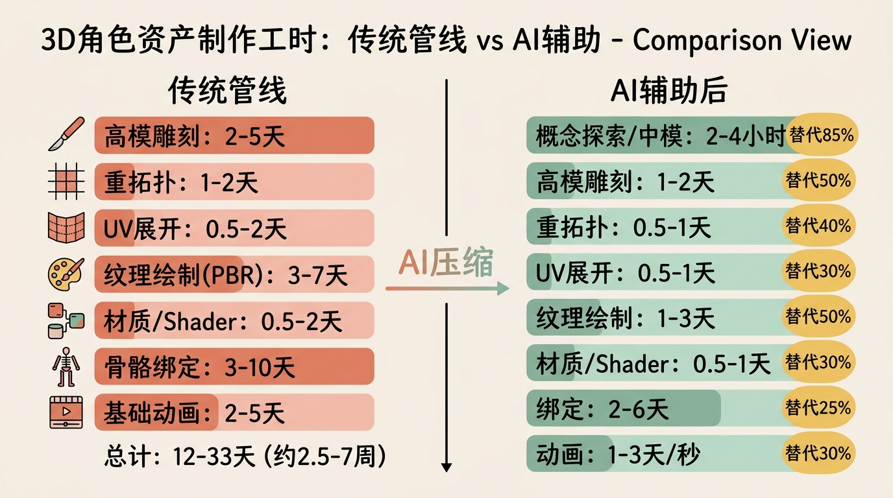
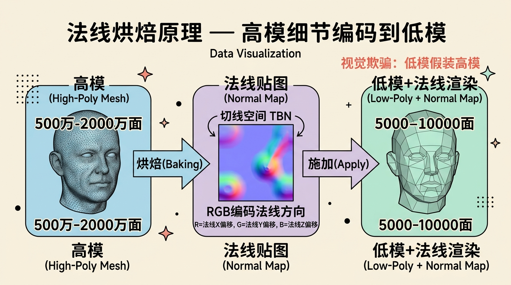
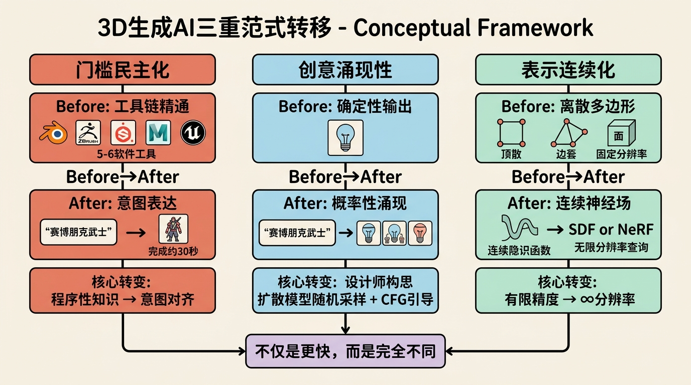
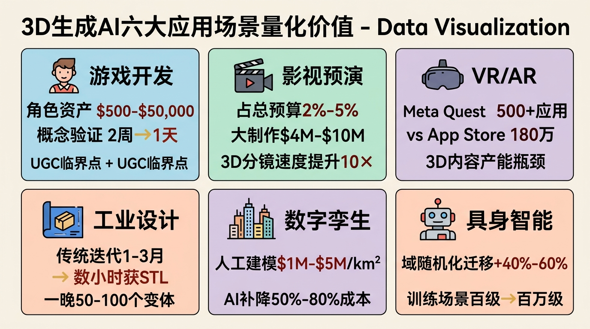
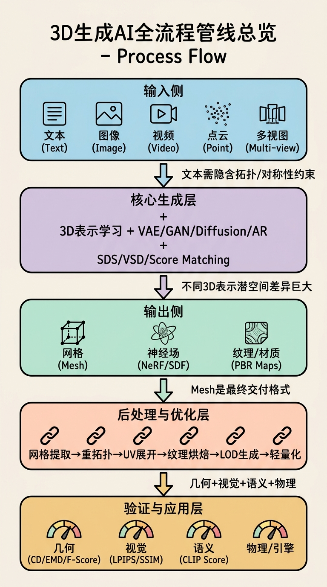
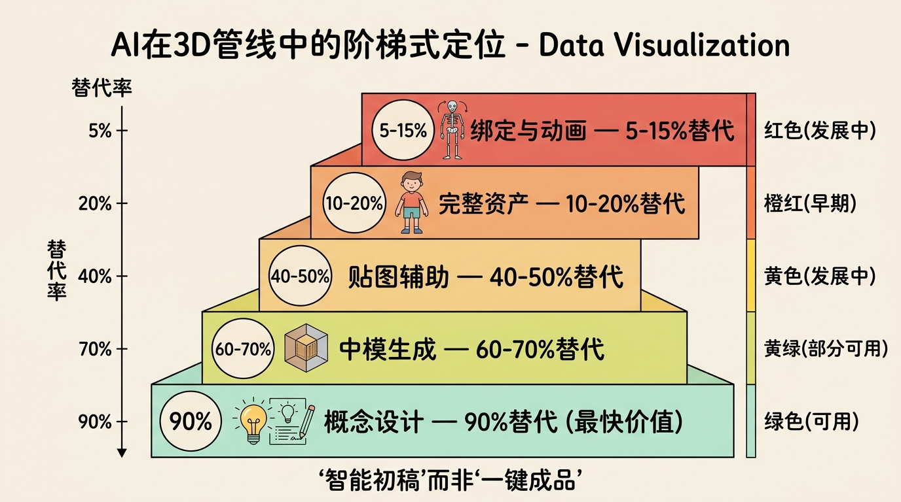
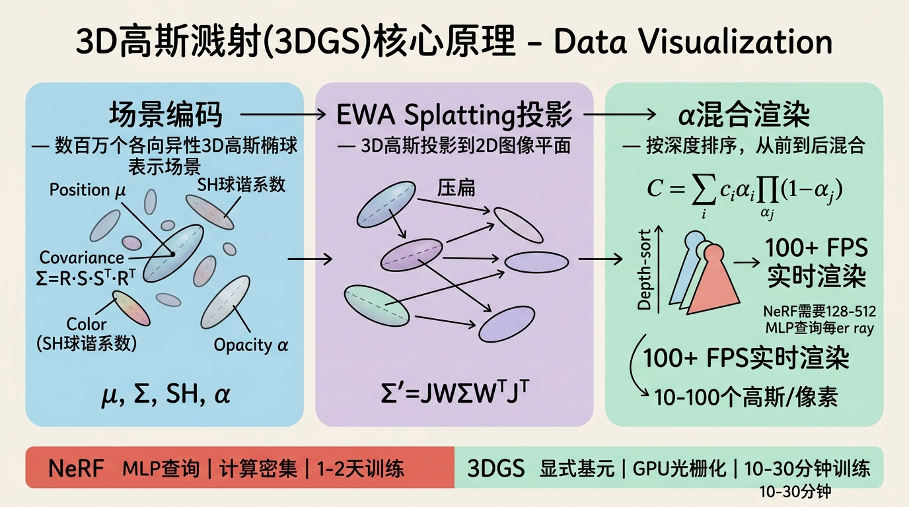

# 第一部分：开篇明义——3D生成AI的范式革命与管线全景图

## 1.1 传统3D内容制作管线拆解：一座精确到小时的工时金字塔



要理解3D生成AI带来的冲击，必须先理解传统3D内容制作管线的深度与复杂度。下面以**影视级/3A游戏角色**为基准，逐环节拆解。

### 1.1.1 高模雕刻：数字粘土的几何密度极限

**定义层**：高模雕刻（High-Poly Sculpting）是在计算机中使用数字笔刷对虚拟几何体进行增减材料的操作，目标是创建包含极高表面细节的**三维数字原型**，细节精度需达到毛孔、皱纹、织物纤维级别。

**原理层**：为什么需要数百万乃至数千万个多边形？因为真实世界的表面细节具有分形特征——当你不断放大，新的细节持续涌现。传统多边形建模无法高效表达这种不规则表面，而雕刻模式基于**细分曲面（Subdivision Surface）**技术，允许艺术家在低精度基网（Base Mesh）上操作，由算法实时细分生成光滑表面。法线烘焙（Normal Baking）的哲学前提是：人眼对表面朝向的变化极其敏感，但对 silhouette 边缘的 polygon 阶梯不敏感（在一定距离外）。因此，我们可以将高模的微观表面法线信息编码到一张法线贴图（Normal Map）中，施加到低模表面，在渲染时欺骗光照计算，获得接近高模的视觉效果。

**实例层**：在 **ZBrush** 中的典型流程为：导入基础人形（约 5,000-10,000 面）→ 使用 **Dynamesh** 动态重建均匀拓扑（解决拉伸问题）→ 逐级增加细分级别（Subdivision Levels，通常 4-7 级，最终可达 500万-2,000万 有效面）→ 使用 Standard/Clay Buildup/Trim Dynamic 笔刷塑造体积 → 使用 Dam Standard/Orb Cracks 笔刷雕刻皱纹与破损 → 使用 NoiseMaker 或 Surface Noise 添加微观皮肤毛孔。一个影视级角色高模的纯雕刻工时通常为 **2-5 天**，复杂生物（如带鳞片的龙）可达 **2 周**。关键概念是**多边形流（Polygon Flow）**——即使在 Dynamesh 阶段不关注拓扑，艺术家仍需在心里规划肌肉走向，因为雕刻的细节分布必须遵循解剖学张力线。

### 1.1.2 拓扑重建/重拓扑：为动画而生的几何整容

**定义层**：重拓扑（Retopology）是在高模表面重新构建一套全新的、低面数的、拓扑规则的多边形网格，使其既忠实于高模的外形，又满足实时渲染和动画变形的需求。

**原理层**：为什么高模不能直接用于游戏和动画？两个核心约束：**变形质量**与**渲染性能**。动画蒙皮变形（Skin Deformation）依赖顶点在骨骼间的权重混合，如果边线环（Edge Loops）不遵循解剖结构（如口轮匝肌、眼轮匝肌的环形走向），角色张嘴时嘴角会撕裂或塌陷。四边面（Quads）之所以优于三角面（Tris）和 N-gons，是因为细分曲面算法（如 Catmull-Clark）对四边面的处理是规则的，且动画变形时四边面的张力分布更均匀。极点（Poles，即一个顶点连接超过4条边）必然存在，但需被"隐藏"在变形较小的区域（如后脑勺、腋下）。面数目标直接关联平台性能：手游角色通常 **2,000-8,000 三角面**，PC/主机角色 **30,000-150,000 三角面**，电影级渲染代理可达数百万，但动画用绑定模型仍需控制拓扑整洁度。

**实例层**：工具链包括 **Blender RetopoFlow**（基于 surface snap 的交互式重拓扑）、**Maya Quad Draw**（业界标准，支持快速放样四边面）、**RizomUV**（虽主打展UV，但其拓扑优化工具亦常用）、**Topogun**（专门的独立重拓扑软件）。一个熟练艺术家的重拓扑速度约为 **1-2 天/角色**。拓扑规则包括：嘴部至少 3-4 圈边线环以支持口型变形；眼部内外眦需星形极点结构；肘关节和膝关节需保留足够边线以支持弯曲褶皱。

### 1.1.3 UV展开：将三维表面剥平成二维图纸

**定义层**：UV展开（UV Unwrapping）是将三维网格表面映射到二维纹理坐标系 [0,1]² 的过程，使得每个三维顶点获得一组 (u,v) 坐标，从而在二维图像上定位其颜色、法线、粗糙度等信息。

**原理层**：为什么 UV 空间是 [0,1]²？这是图形硬件的纹理采样约定。GPU 的纹理单元通过归一化坐标寻址，1 代表纹理图像的宽度/高度边界，便于不同分辨率的纹理图复用同一套 UV。UV 展开面临**等距映射（Isometric Mapping）**不可能性的根本约束——高斯绝妙定理（Theorema Egregium）告诉我们，除非表面是可展的（Developable，如圆柱、圆锥），否则任何将三维曲面压平到二维的操作必然引入**畸变**。畸变分为两类：面积畸变（不同区域的 Texel Density 不一致，导致贴图分辨率不均）和角度畸变（纹理图案被拉伸歪斜）。**接缝（Seams）**是避免全局畸变的必要手段——通过在低曲率区域切割表面，将不可展曲面拆分为近似可展的碎片，代价是接缝处可能出现纹理颜色不连续（需绘制修补）和渲染时 mipmap 过滤瑕疵。展开算法中，**LSCM（Least Squares Conformal Maps）**最小化角度畸变，适合有机体；**ABF++（Angle Based Flattening）**通过优化角度约束实现低畸变展开，是商业软件的主流选择。

**实例层**：一个角色的 UV 展开通常需 **0.5-2 天**。关键概念是 **Texel Density（纹素密度）**，单位为 像素/世界单位米 或 像素/厘米。3A 游戏通常统一为 512-1024 像素/米，确保角色全身纹理分辨率一致。UV 布局需在 [0,1]² 空间内紧凑排布，提高纹理空间利用率（packing ratio 通常要求 >75%）。工具包括 **RizomUV**（以高效自动展开和排布著称）、**Blender UV 编辑器**、**Maya UV Toolkit**。

### 1.1.4 纹理绘制：PBR 工作流的物质解码

**定义层**：纹理绘制（Texturing）是在二维图像或三维模型表面绘制颜色与材质属性的过程。现代3D采用 **PBR（Physically Based Rendering，基于物理的渲染）** 工作流，即所有贴图参数都对应物理可解释的材质属性。

**原理层**：PBR 的核心是**微表面模型（Microfacet Model）**——假设宏观表面由无数微观镜面（microfacets）组成，其朝向分布决定反射特性。PBR 工作流通常包含以下贴图，每种都在着色器方程中承担明确角色：

- **Base Color / Albedo**：漫反射颜色，去除了所有光照和阴影信息。在着色器中作为 Lambertian/Burley 漫反射项的系数。
- **Normal Map**：切线空间下的表面微观法线扰动，用于在不增加几何面数的前提下改变反射方向。
- **Roughness / Smoothness**：控制微表面朝向的随机程度。Roughness=0 时所有微表面法线与宏观法线一致，形成完美镜面反射；Roughness=1 时微表面朝向完全随机，形成漫反射外观。它直接控制 Cook-Torrance BRDF 中的分布函数（D项）的陡峭程度。
- **Metallic**：金属度遮罩。值为 1 时，表面仅产生镜面反射（使用 Base Color 作为 F0，即菲涅尔零度反射率）；值为 0 时，表面为电介质，F0 固定为 0.04（塑料/石头/木头）。
- **Ambient Occlusion (AO)**：环境光遮蔽，表示因几何自遮挡导致的环境漫反射光衰减，纯烘焙光照信息。
- **Height / Displacement**：高度图，用于视差映射（Parallax Mapping）或真正的几何位移。

**实例层**：**Substance Painter** 是行业标准工具，其图层工作流类似 Photoshop，但每个图层绘制的是材质属性而非仅颜色。智能材质（Smart Materials）利用**锚点（Anchor Points）**和**生成器（Generators）**根据几何曲率、AO、世界空间法线自动投射磨损、锈迹、边缘高光。手绘纹理（Hand-painted）常见于风格化游戏（如《塞尔达传说：旷野之息》），艺术家直接绘制光照暗示和风格化色彩；程序生成纹理（Procedural）则使用 Substance Designer 的节点图，通过 Perlin Noise、Voronoi 等数学函数合成无限分辨率的材质。一个角色纹理集的绘制工时为 **3-7 天**。

### 1.1.5 材质与着色器：像素着色的数学方程

**定义层**：着色器（Shader）是在 GPU 上运行的小程序，负责计算每个顶点或每个像素（片元）的最终颜色。材质（Material）是着色器参数（纹理贴图、数值）的实例化配置。

**原理层**：现代 GPU 管线中，**顶点着色器（Vertex Shader）**负责将模型顶点从局部空间经世界空间、相机空间变换到裁剪空间，并可传递 UV、法线、切线等数据到后续阶段。**片元着色器（Fragment Shader / Pixel Shader）**是性能瓶颈所在，它在光栅化后的每个像素上执行 BRDF 计算。

**Cook-Torrance BRDF** 的直观理解：其镜面反射项由三个主要函数和一个菲涅尔项构成：

$$
f_r = \frac{D(h) \cdot F(v,h) \cdot G(l,v,h)}{4(n \cdot l)(n \cdot v)}
$$
无需完整推导，但要理解每个参数的物理角色：
- **D(h)**：微表面法线分布函数（如 GGX/Trowbridge-Reitz），由 Roughness 控制。Roughness 越大，D(h) 的峰值越平坦，高光越弥散。
- **F(v,h)**：菲涅尔方程，描述反射率随视角变化的规律。Schlick近似 $F(\cos\theta) = F_0 + (1 - F_0)(1 - \cos\theta)^5$。关键直觉：**入射角越大（越倾斜），反射越强**。这就是为什么在湖面近处能看到水底，远处只能看到倒影。
- **G(l,v,h)**：几何遮蔽函数，模拟微表面间的相互遮挡（shadowing/masking），防止 Roughness 极高时能量不守恒。

**实例层**：在 **Unreal Engine 5** 中，默认 Lit 着色器封装了上述 BRDF；**Unity URP/HDRP** 采用类似的 GGX 模型。**Blender Principled BSDF** 节点是 Pixar 提出的"uber shader"概念。一个角色的材质调试和 Shader 定制需 **0.5-2 天**。

### 1.1.6 骨骼绑定：从静态网格到动态生命体

**定义层**：骨骼绑定（Rigging）是为三维模型创建虚拟骨骼层级（Skeleton Hierarchy）和变形控制器，并定义骨骼如何驱动网格顶点运动的系统。

**原理层**：骨骼层级本质是一棵有向树，每个关节（Joint/Bone）具有局部变换矩阵（平移 T、旋转 R、缩放 S），通过矩阵级联（Matrix Concatenation）从根节点传递到末端执行器（End Effector）。**正向运动学（FK, Forward Kinematics）**直接旋转关节角度，适合表达弧线运动（如挥手）；**反向运动学（IK, Inverse Kinematics）**通过解析或数值方法（如 Jacobian 迭代）由末端位置反推关节角度，适合保持接触（如脚踩地时膝盖自动弯曲）。蒙皮（Skinning）的数学核心是**顶点混合（Vertex Blending）**：每个顶点的最终位置由其受影响的 n 根骨骼（通常 n≤4，出于 GPU 性能考虑）的变换矩阵加权混合决定：

$$
v' = \sum_{i=1}^{n} w_i \cdot M_i \cdot M_{i,\text{bind}}^{-1} \cdot v, \quad \sum w_i = 1
$$
其中 $M_{i,\text{bind}}$ 是绑定姿态（Bind Pose）下骨骼的逆矩阵，确保仅在偏离绑定姿态时才产生变形。**绑定测试**要求角色能通过一组极端姿势（T-pose、A-pose、大张口、握拳、极端弯腰）而不出现网格撕裂或体积损失。

**实例层**：影视级绑定使用 **Maya**（Advanced Skeleton、mGear 等插件框架），游戏引擎中使用 **Blender Rigify** 或直接在 **Unreal Control Rig** 中构建。一个功能完整的角色绑定（含面部 blendshape 和次级动力学）需 **3-10 天**。

### 1.1.7 动画制作：时间的雕刻

**定义层**：动画制作（Animation）是通过逐帧定义对象变换属性，利用人眼的**似动现象（Phi Phenomenon）**创造运动幻觉的过程。

**原理层**：关键帧插值是动画的数学基础。线性插值（Lerp）产生匀速运动，而贝塞尔曲线插值（Bezier Interpolation）通过切线手柄控制进出的加速度，形成**慢入慢出（Slow In/Slow Out）**的自然运动。动画曲线（Animation Curves）在 Graph Editor 中展示属性随时间的变化。动作捕捉（Motion Capture）通过光学或惯性传感器记录真人运动，但原始数据充满噪声和滑步（Foot Skate）。数据清理包括：卡尔曼滤波/双向滤波去噪、IK 脚步锁定（Foot Locking）、接触检测自动修复滑步。

**实例层**：**Autodesk MotionBuilder** 是动捕数据清理的主力工具；**Cascadeur**（AI 辅助关键帧动画工具）可自动补全物理合理的中间帧。手工关键帧动画的速度约为 **每秒运动 1-3 天**（高度依赖复杂度），动捕清理为 **原始数据的 3-10 倍工时**。

### 1.1.8 工时金字塔：从8周到8小时的压缩神话

综合上述环节，一个**影视级完整角色资产**的传统总工时为：

| 环节 | 熟练 artist 工时 |
|------|-----------------|
| 高模雕刻 | 2-5 天 |
| 重拓扑 | 1-2 天 |
| UV 展开 | 0.5-2 天 |
| 纹理绘制（含 PBR） | 3-7 天 |
| 材质/Shader 调试 | 0.5-2 天 |
| 骨骼绑定（含面部） | 3-10 天 |
| 基础动画（待机/行走） | 2-5 天 |
| **总计** | **12-33 天（约 2.5-7 周）** |

若包含概念设计迭代、审核反馈、技术问题解决，**总周期通常为 2-3 个月**。一个 3A 游戏主角的制作成本轻松达到 **$10,000-$50,000**。

AI 生成对每个环节的压缩效果：

| 管线环节 | 传统工时 | AI 辅助后工时 | 人力替代比 | 当前成熟度 |
|---------|---------|--------------|-----------|-----------|
| 概念探索/中模 | 3-7 天 | 2-4 小时 | ~85% | 可用 |
| 高模雕刻 | 2-5 天 | 1-2 天 | ~50% | 部分可用 |
| 重拓扑 | 1-2 天 | 0.5-1 天 | ~40% | 发展中 |
| UV 展开 | 0.5-2 天 | 0.5-1 天 | ~30% | 发展中 |
| 纹理绘制 | 3-7 天 | 1-3 天 | ~50% | 可用 |
| 材质/Shader | 0.5-2 天 | 0.5-1 天 | ~30% | 较成熟 |
| 绑定 | 3-10 天 | 2-6 天 | ~25% | 发展中 |
| 动画 | 2-5 天/秒 | 1-3 天/秒 | ~30% | 早期 |

**三层解释法示例一：法线烘焙**



- **定义层**：法线烘焙（Normal Baking）是将高模表面的微观几何法线信息投影到低模表面，存储为一张 RGB 贴图的过程。
- **原理层**：其数学本质是将高模表面点投影到低模的切线空间（Tangent Space）中。切线空间由每个顶点的法线（N）、切线（T）、副切线（B = N × T）构成局部坐标系。将世界空间法线转换到此局部坐标系后，大部分向量接近 (0,0,1)，可高效存储在 [0,1] 范围的 RGB 纹理中。这使得低模在光照计算时"假装"拥有高模的表面复杂度，而顶点数保持不变。Trade-off 在于：法线贴图无法修复 silhouette 的 polygon 阶梯（因为几何轮廓没有改变），且极端角度下可能出现贴图走样（Aliasing）。
- **实例层**：在 Substance Painter 或 Marmoset Toolbag 中，烘焙设置包括笼体（Cage）偏移距离（解决投影穿插）、抗锯齿级别（4x-16x）、贴图分辨率（2K/4K/8K）。一个角色全身的法线贴图烘焙需 **30 分钟-2 小时**。

---

## 1.2 三重范式转移：不仅是更快，而是完全不同



### 1.2.1 门槛民主化：从工具链精通到意图表达

**定义层**：门槛民主化指 3D 内容创作的核心能力要求，从掌握复杂软件操作和图形学知识，转变为通过自然语言或图像表达创意意图。

**原理层**：传统管线要求创作者在**陈述性知识**之外，掌握大量的**程序性知识**。这包括：理解非线性变形的数学本质、掌握 UV 切割的几何直觉、记忆数十种快捷键、管理多软件文件格式互导（FBX/OBJ/USD 的兼容性陷阱）。学习曲线陡峭到需要 2-5 年才能成为合格通才。AI 工具通过**意图对齐（Intent Alignment）**将中间操作步骤封装进神经网络的黑箱中，用户只需提供高维目标描述（文本提示或参考图），模型在潜空间中搜索最优解并解码为 3D 表示。

**实例层**：对比两种工作流：
- **传统工具链**：Blender（建模+UV+基础绑定）→ ZBrush（雕刻）→ RizomUV（展UV）→ Substance Painter（纹理）→ Maya（动画+渲染）→ Unreal Engine（实时预览），涉及 5-6 个软件。
- **AI 工具链**：**Meshy.ai** 输入文本 "a cyberpunk samurai with neon katana"，约 30 秒后获得带贴图的 3D 模型，支持直接下载 USDZ/GLB/FBX。**CSM.ai** 上传一张 2D 角色概念图，自动推断深度、重建几何、生成纹理。**Luma AI** 围绕真实物体拍摄视频，通过 NeRF 重建，导出 mesh。

### 1.2.2 创意涌现性：概率之井中的意外之喜

**定义层**：创意涌现性（Emergent Creativity）指生成模型在服从用户提示的前提下，产出超出用户显式描述、却又合理且新颖的设计变体的能力。

**原理层**：这一现象的数学根源在于**扩散模型**的随机采样机制。扩散模型从纯噪声出发，通过反向去噪过程逐步恢复数据。每一步去噪都引入了随机性，且从高斯分布中采样不同的初始噪声 $x_T$ 会导致模型收敛到数据流形上的不同点。此外，**分类器无关引导（CFG）**通过有条件预测和无条件预测的插值，控制生成结果对提示词的忠实度与多样性之间的 Trade-off。

### 1.2.3 表示连续化：从离散多边形到连续神经场

**定义层**：表示连续化指 3D 对象从离散的顶点-边-面集合向连续的、可无限分辨率查询的函数表示（神经场）的转变。

**原理层**：传统网格是**离散表示**——顶点坐标存储在 float32 数组中。这种表示的本质限制在于：其几何分辨率在创建时就被固定。当你放大一个球体网格，最终会看到多边形边缘。而神经场（如 NeRF、SDF）将 3D 几何编码为神经网络的权重，网络函数可以在任意空间坐标上查询。由于神经网络是连续函数的组合，其隐式表示具有**无限分辨率**的特性——理论上可以在任意尺度查询而不会产生几何锯齿。

---

## 1.3 应用场景的量化价值



### 1.3.1 游戏开发

3A 游戏中一个高品质角色资产的外包成本为 **$500-$5,000**，复杂主角可达 **$10,000-$50,000**。AI 生成将**概念验证**周期从 **2 周**缩短到 **1 天**。更深远的影响是 **UGC 生态的临界点**：当用户创建 3D 资产的时间成本从数周降到数分钟，平台的内容供给曲线将从线性增长转向指数增长。

### 1.3.2 影视预演

传统 Previs 占影片总预算的 **2%-5%**，大制作可达 **$4M-$10M**。AI 生成将 3D 分镜的制作速度提升一个数量级。

### 1.3.3 VR/AR

Meta Quest Store 约 **500+** 应用，而 Apple App Store 超过 **180 万**。VR 内容稀缺的核心瓶颈是**3D 内容产能**。

### 1.3.4 工业设计

汽车外形设计传统迭代周期 **1-3 个月**。AI 生成允许设计师在**数小时**内获得可 3D 打印的 STL 文件，并可在**一晚**生成 **50-100 个**设计变体。

### 1.3.5 数字孪生

智慧城市人工建模成本为 **$1M-$5M/平方公里**。AI 补全构成混合流程：**扫描获取骨干几何** → **AI 填补缺失细节和纹理**，成本降低 **50%-80%**。

### 1.3.6 具身智能

域随机化（Domain Randomization）可将抓取成功率从仿真到真实的迁移提升 **40%-60%**。AI 生成场景将训练场景多样性从**百级**跃升到**百万级**。

---

## 1.4 全流程管线总览



```
┌─────────────────────────────────────────────────────────────────────────────┐
│                         3D生成AI全流程管线总览                                  │
├─────────────────────────────────────────────────────────────────────────────┤
│                                                                             │
│  【输入侧】                                                                    │
│  文本(Text) │ 图像(Image) │ 视频(Video) │ 点云(Point) │ 多视图(Multi-view)    │
│                          │                                                  │
│                          ▼                                                  │
│  【核心生成层】          ┌─────────────────────────────┐                      │
│  3D表示学习 +           │  VAE / GAN / Diffusion / AR  │                      │
│  生成模型               │  SDS / VSD / Score Matching  │                      │
│                          └─────────────┬───────────────┘                      │
│                          ┌─────────────┼─────────────┐                      │
│                          ▼             ▼             ▼                      │
│  【输出侧】          网格(Mesh)   神经场(NeRF/SDF)  纹理/材质(PBR Maps)        │
│                                       │                                     │
│                                       ▼                                     │
│  【后处理与优化层】  网格提取 → 重拓扑 → UV展开 → 纹理烘焙 → LOD生成 → 轻量化    │
│                                       │                                     │
│                                       ▼                                     │
│  【验证与应用层】  几何评估(CD/EMD/F-Score) │ 视觉评估(LPIPS/SSIM) │          │
│                   语义对齐(CLIP Score) │ 物理仿真 │ 引擎集成(Unity/UE)        │
│                                                                             │
└─────────────────────────────────────────────────────────────────────────────┘
```

**输入侧详解**：
- **文本**：3D中Prompt Engineering的特殊之处在于需隐含拓扑约束、对称性、功能性描述
- **图像**：单图像重建面临单目深度估计的本质歧义性（ill-posed problem）；多图像通过SfM/MVS消解歧义
- **视频**：时序多视图提供自监督信号（相邻帧构成小基线立体对）
- **点云**：LiDAR/RGB-D传感器特性（线束数、深度精度衰减、覆盖度）
- **多视图**：相机内参K与外参(R,t)的格式，稀疏视图vs密集视图的权衡

**核心生成层详解**：
- 不同3D表示的潜空间结构差异巨大
- VAE/GAN/Diffusion/AR在3D中的适配挑战各不相同

**输出侧详解**：
- 流形(Mesh)和水密(Watertight)的严格定义
- NeRF/SDF/占用场的输出格式差异
- 纹理图集 vs 过程纹理 vs 神经纹理

---

## 1.5 "智能初稿"：AI 在 3D 管线中的合理定位



### 为什么 AI 目前不能做到"一键成品"？

1. **几何精度不足**：AI 生成的 mesh 常在细节区域出现漂浮几何、面片穿插或过度平滑
2. **拓扑不符合动画需求**：生成模型优化的是表面重建损失，而非拓扑质量
3. **UV 质量不稳定**：自动 UV 展开在复杂生物体上常产生碎片化 UV 岛
4. **材质不遵循 PBR 规范**：Base Color 中可能嵌入光照阴影、Metallic 出现不合理中间值

### AI 在管线中的阶梯式定位

**第一层：概念设计 —— 90% 替代**（最快价值）
**第二层：中模生成 —— 60-70% 替代**
**第三层：贴图辅助 —— 40-50% 替代**
**第四层：完整资产 —— 10-20% 替代**
**第五层：绑定与动画 —— 5-15% 替代**

**三层解释法示例二：3D 高斯溅射（3D Gaussian Splatting）**



- **定义层**：用数百万个各向异性3D高斯椭球来编码几何和外观，通过可微光栅化实现实时渲染的显式三维场景表示。
- **原理层**：为什么比 NeRF 快？NeRF 需要为每条光线上的数百个采样点查询 MLP；3DGS 将场景"硬化"为离散高斯原语，可通过 GPU 光栅化管线直接投影。Trade-off 是显存占用高且编辑不如网格直观。
- **实例层**：**Inria 的原始 3DGS 实现** 可在 RTX 3090 上以 100+ FPS 渲染；**Luma AI**、**Polycam** 已将其集成到消费级应用中。

**三层解释法示例三：符号距离场（SDF）**

- **定义层**：$f: \mathbb{R}^3 \to \mathbb{R}$，其中 $|f(x)|$ 为到最近表面距离，符号表示内外。
- **原理层**：SDF 的梯度 $\nabla f$ 在表面附近等于法线。支持布尔运算（min/max）、偏移（$f(x)-r$）、圆滑过渡（smooth minimum）。与占用场相比提供亚体素精度。
- **实例层**：**NeuS** 用 SDF + 体渲染达到亚毫米重建精度；**Unreal Engine 5** 的 Lumen 使用 Mesh SDF 进行光线步进。

---

## 1.6 思考题

1. 对比摄影术诞生时画家群体的反应，3D 生成 AI 对 3D 艺术家职业生态的冲击在哪些方面相似？哪些方面因数字经济的特性而完全不同？
2. 若一个开放世界游戏需要 2,000 个独特角色资产，传统外包成本 $2,000/角色，AI 生成将中模和纹理环节压缩 70% 但后处理增加 20%，计算总成本变化。
3. 你正在为 VR 社交平台选择 3D 生成后端，请从渲染性能、编辑灵活性、存储传输、跨平台兼容性四维度建立决策矩阵。
4. 扩散模型的随机性带来创意涌现，但也导致不可复现性。如果你是 3A 工作室技术总监，如何设计工程化解决方案？
5. AI 生成的无限训练场景对机器人泛化能力的提升是否存在边际递减？

---

*本章为后续技术深度章节奠定了概念基础。建议先通过 Blender 跟随一个基础角色建模教程实际操作 2-4 小时，建立具身认知。*

---


---