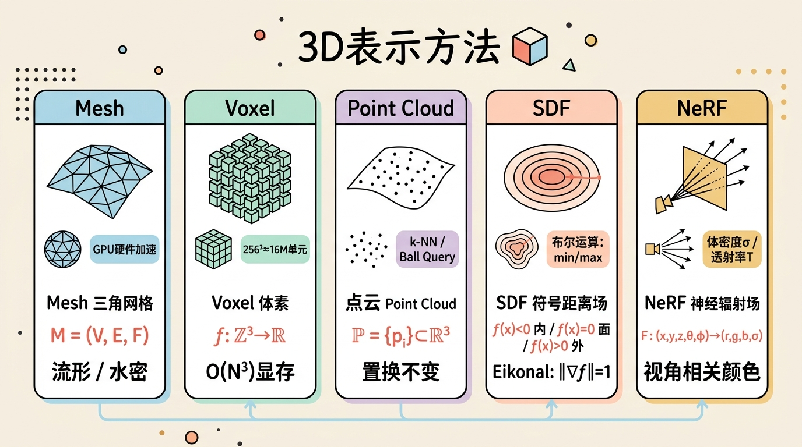
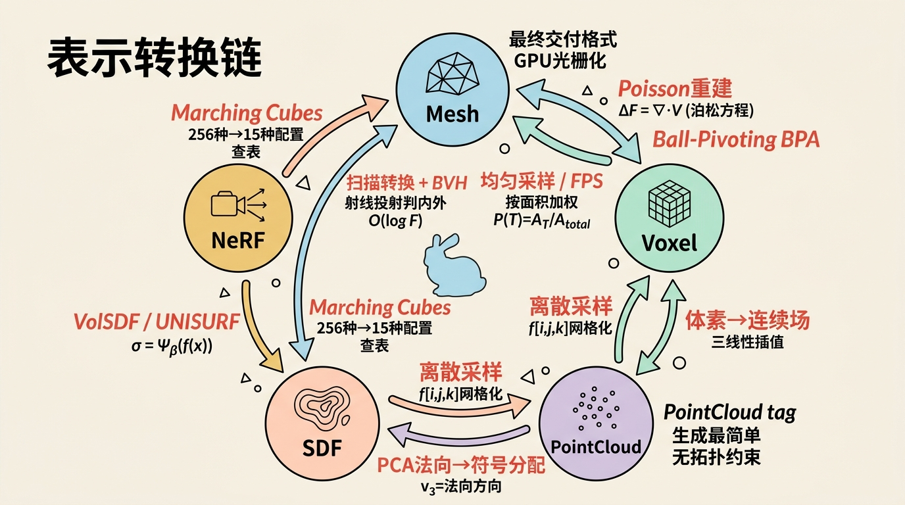
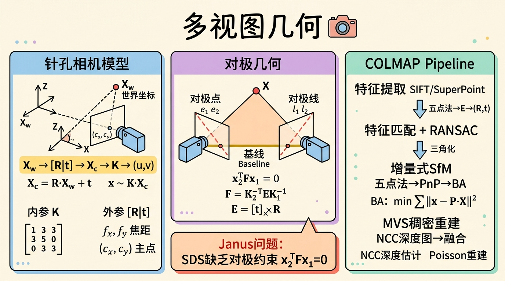
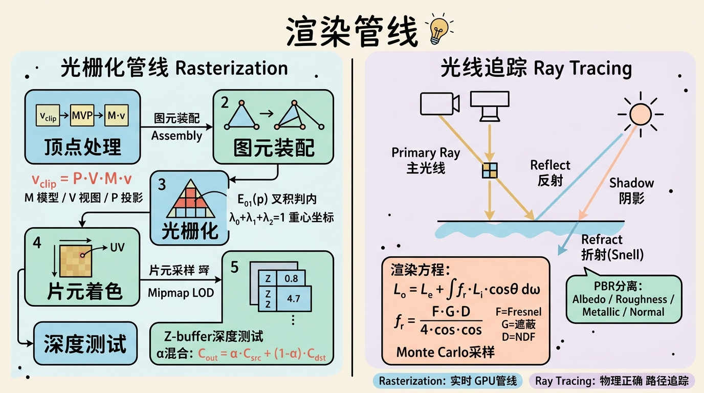
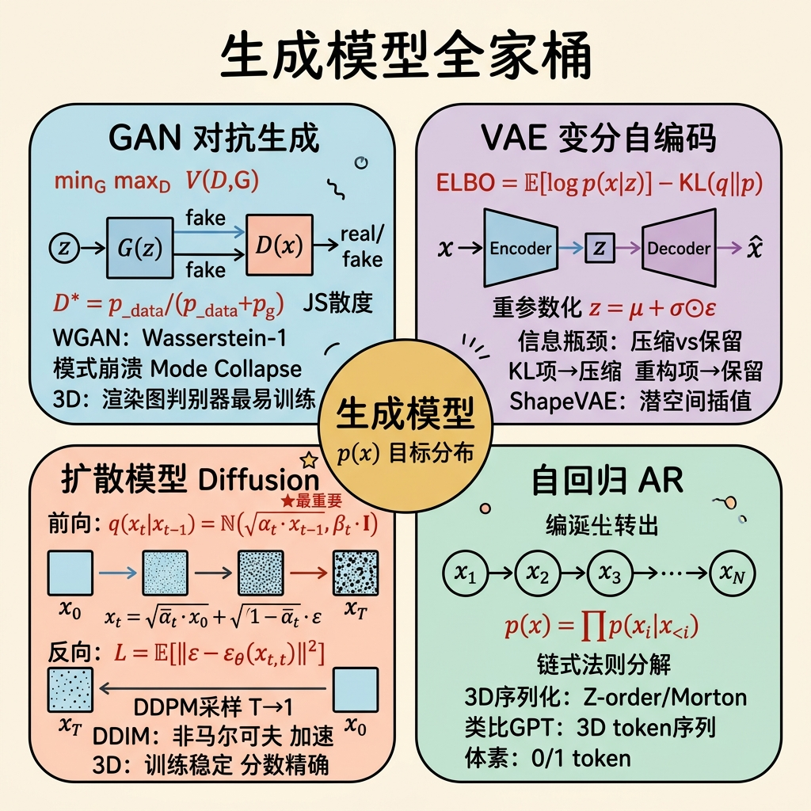
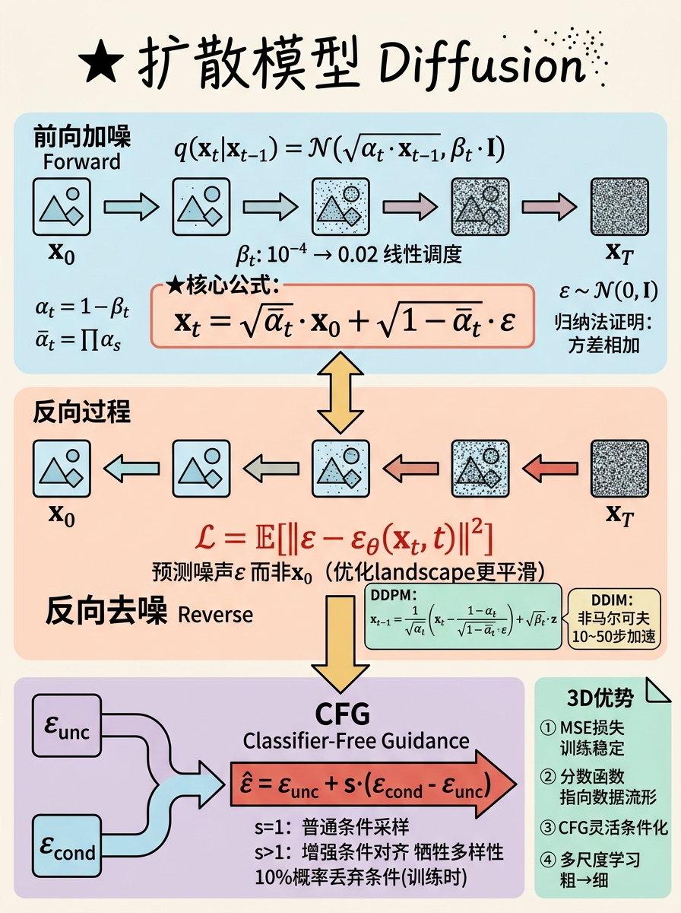
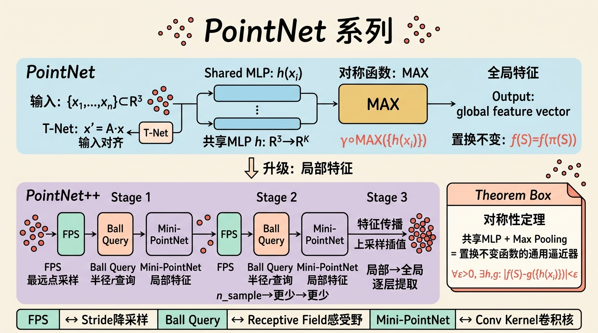

# 第二部分：筑基篇——不可或缺的先修知识

> "如果你不知道数据是如何表示的，你就不知道模型在学什么；如果你不知道模型在优化什么，你就不知道它为什么会失败。"

3D生成AI是一个极度跨学科的领域。它要求研究者同时具备3D计算机图形学的几何直觉和深度学习的优化理论。本章的目标不是泛泛而谈，而是为后续所有技术细节打下**数学上严谨、工程上可落地**的基础。我们会从最底层的表示方法出发，逐步建立起连接图形学与深度学习的完整知识图谱。

---

## 2.1 3D计算机图形学基础

### 2.1.1 五种核心表示方法（重点中的重点）



在3D生成AI中，**表示（Representation）就是一切**。神经网络最终输出的不可能是"一个物体"的抽象概念，它必须选择一种数学结构来编码几何与外观。不同的表示决定了：模型的架构设计、损失函数的构造、训练难度的量级，以及最终生成结果的用途。

#### 多边形网格（Polygon Mesh）

**精确数学定义**

一个多边形网格是一个三元组 $\mathcal{M} = (V, E, F)$，其中：

- 顶点集合 $V = \{v_1, v_2, \dots, v_N\} \subset \mathbb{R}^3$；
- 边集合 $E \subset V \times V$，其中每条边 $e_{ij} = (v_i, v_j)$；
- 面集合 $F$，每个面 $f \in F$ 是顶点的一个循环子集。在计算机图形学中，我们几乎总是使用**三角网格**，即每个面恰好包含3个顶点：$f = (v_i, v_j, v_k)$。

一个网格是**流形（Manifold）**的，当且仅当每个点 $p \in \mathcal{M}$ 存在一个邻域 $U_p$，使得 $U_p$ 同胚于（homeomorphic to） either $\mathbb{R}^2$（内部点）或 $\mathbb{R}^2_{\geq 0}$（边界点）。直观地说，流形网格在局部看起来必须像一张纸或半张纸——不允许存在"三张纸在一个边上交汇"（非流形边）或"多张纸在一个点交汇"（非流形顶点）的情况。

一个网格是**水密（Watertight）**的，如果它是**封闭的2-流形**：每条边恰好被两个面共享，且没有边界边。水密性在3D打印和物理仿真中至关重要，因为开放的表面没有明确定义的"内部"与"外部"。

**直觉解释**

想象你正在用折纸制作一个模型。顶点是你折出的每个尖点，边是折痕，面是纸面本身。流形条件意味着你绝不能让三张纸共用一条折痕（否则局部拓扑就不是平面了）。水密条件意味着你的折纸必须完全封闭，不能有破洞。

**为什么重要：网格处理的基石——半边数据结构（Half-edge Data Structure）**

在AI生成网格之前，我们需要理解网格在计算机中如何被高效存储和遍历。半边数据结构是现代网格处理的基石，因为它将"无向"的边拆分为两条有向的"半边"，从而用局部一致性替代了全局搜索。

**结构定义**：
每条半边 $\vec{e}$ 存储：
- `origin`：起点顶点
- `twin`：反向的孪生半边
- `next`：沿当前面循环的下一条半边
- `prev`：沿当前面循环的前一条半边
- `face`：所属的 face 指针

**遍历伪代码**：

```python
def incident_faces(v: Vertex) -> List[Face]:
    """遍历顶点v的所有邻接面（时间复杂度O(k)，k为顶点的度）"""
    result = []
    h = v.halfedge          # 从v出发的任意一条半边
    start = h
    while True:
        result.append(h.face)
        h = h.twin.next     # 走到对面的下一条以v为起点的半边
        if h == start:
            break
    return result

def adjacent_vertices(v: Vertex) -> List[Vertex]:
    """遍历顶点v的所有1-邻域顶点"""
    result = []
    h = v.halfedge
    start = h
    while True:
        result.append(h.twin.origin)  # 孪生半边的起点即邻接顶点
        h = h.twin.next
        if h == start:
            break
    return result
```

半边结构的核心优势是：所有邻域查询都是 $O(1)$ 起步、$O(k)$ 完成，其中 $k$ 是局部邻域大小。这在网格细分、曲面简化、Remeshing 等算法中不可或缺。

**GPU渲染管线中的角色**

现代GPU不认识"半边"，它只认识**顶点缓冲对象（VBO）**和**索引缓冲对象（IBO）**。VBO 是一个扁平的浮点数组，存储所有顶点属性（位置、法向、UV、颜色）；IBO 存储面如何索引 VBO 中的顶点。

- VBO：$[x_1, y_1, z_1, nx_1, ny_1, nz_1, u_1, v_1, \dots]$（交错或分离布局）
- IBO：$[i_1, j_1, k_1, i_2, j_2, k_2, \dots]$（每个三角形三个索引）

**顶点数组对象（VAO）**记录了这些缓冲的绑定状态，使得一次 `glDrawElements` 调用就能将完整的网格提交给GPU。

顶点着色器处理每个VBO中的顶点，执行模型-视图-投影变换（$M_{mvp} = P \cdot V \cdot M$）；随后光栅化器根据IBO装配三角形，在像素级别进行插值和着色。

**在AI生成中的角色：为什么Mesh仍然是最终交付格式？**

尽管NeRF、SDF、点云在研究中极为流行，但**游戏引擎、3D打印、CAD软件和Web3D仍然只认Mesh**。这是一个典型的**生态锁定（Ecosystem Lock-in）**问题：
- GPU光栅化管线对三角网格有硬件级优化；
- UV参数化、骨骼绑定、材质贴图都依赖网格的拓扑结构；
- 物理引擎（PhysX、Bullet）需要封闭流形网格来计算碰撞和体积。

因此，几乎所有3D生成AI pipeline的最终步骤都是某种形式的"提取网格"——无论是Marching Cubes从SDF中提取，还是Poisson重建从点云中拟合。

---

#### 体素（Voxel）

**精确数学定义**

体素是三维空间中的规则采样，可以形式化为一个离散函数：

$$f: \mathbb{Z}^3 \rightarrow \mathbb{R}$$

其中定义域 $\mathbb{Z}^3$ 表示三维整数格点，值域 $\mathbb{R}$ 的含义取决于具体应用：可以是二值占用（0/1）、有符号距离（SDF值）、密度值（如NeRF的$\sigma$）或材质特征。

**直觉解释**

如果把2D像素想象成墙面上的小瓷砖，那么体素就是房间里的**小立方块**。但关键差异在于邻接关系：2D像素有4-邻接（上下左右）和8-邻接（包含对角）；3D体素有6-邻接（面接触）、18-邻接（面或边接触）和26-邻接（面、边或顶点接触）。这个差异看似微小，但在表面提取（Marching Cubes）和形态学操作中会导致完全不同的连通性定义。

**稀疏性分析**

假设一个 $N \times N \times N$ 的体素网格。存储整个网格需要 $O(N^3)$ 的内存。但考虑一个光滑闭合曲面：它的表面积是 $O(N^2)$（在离散分辨率下），而内部体积是 $O(N^3)$。

对于3D生成AI，这意味着：
- 一个 $256^3$ 的稠密体素网格有 16,777,216 个单元；
- 如果每个单元存一个32位浮点数，仅原始数据就需要 64 MB；
- 3D U-Net 的中间特征图可能是 32 通道 × $256^3$，这轻松超过 2 GB 显存；
- 这就是为什么 $256^3$ 通常被认为是消费级GPU的显存瓶颈。

**八叉树（Octree）的数学结构**

八叉树是一种自适应空间划分结构。每个节点对应一个轴对齐的立方体区域 $[x_0, x_1] \times [y_0, y_1] \times [z_0, z_1]$。分裂规则为：如果节点区域与物体表面相交（或满足某种误差准则），则将其均分为8个子立方体（沿每个维度中点切分）。

**Morton编码（Z-order curve）**：为了加速邻域查询和空间一致性访问，八叉树节点通常按Morton码排序。对于坐标 $(x, y, z)$，其Morton码通过位交错（bit interleaving）得到：

$$\text{Morton}(x, y, z) = \sum_{i=0}^{k-1} \left( (x_i \ll 3i) \mid (y_i \ll (3i+1)) \mid (z_i \ll (3i+2)) \right)$$

其中 $x_i, y_i, z_i$ 是坐标第 $i$ 位。Morton码的美妙性质是：空间上相近的节点，其Morton码在整数排序中也相近（虽然存在"跳跃"）。

**在AI中的具体应用：3D U-Net**

3D U-Net 是体素生成的主流架构。其编码器通过 3D 卷积和池化逐步降低空间分辨率，同时增加通道数；解码器通过 3D 反卷积/上采样恢复分辨率，并拼接编码器的skip connection。

```python
def forward_3d_unet(x: Tensor[N, C, D, H, W]) -> Tensor[N, C_out, D, H, W]:
    # Encoder
    e1 = encoder_block_1(x)        # [N, 32, D, H, W]
    p1 = max_pool3d(e1)            # [N, 32, D/2, H/2, W/2]
    e2 = encoder_block_2(p1)       # [N, 64, D/2, H/2, W/2]
    ...
    b = bottleneck(e4)             # [N, 512, D/16, H/16, W/16]
    
    # Decoder
    d4 = upsample_3d(b)            # [N, 512, D/8, H/8, W/8]
    d4 = concat([d4, e4], dim=1)   # Skip connection
    ...
    return final_conv(d1)
```

显存开销主要来自于：1）特征图的 $O(N^3)$ 体积；2）反向传播时保存的中间激活值。稀疏卷积（Sparse Convolution）是解决这一问题的关键，它只在被占据的体素上执行计算。

---

#### 点云（Point Cloud）

**精确数学定义**

点云是一个**无序集合** $\mathcal{P} = \{p_i\}_{i=1}^N \subset \mathbb{R}^3$。这里"集合"的强调至关重要：点云是**置换不变（permutation invariant）**的，即

$$\{p_1, p_2, \dots, p_N\} = \{p_{\pi(1)}, p_{\pi(2)}, \dots, p_{\pi(N)}\}$$

对任意置换 $\pi \in S_N$ 成立。这与图像（像素有固定的空间排列）有本质区别。

**直觉解释**

点云就像向一个物体表面"撒了一把沙子"。每粒沙子只知道自己的位置，不知道邻居是谁，也不知道全局结构。然而，人类却能从这些散点中识别出物体——这说明局部密度和空间分布包含了丰富的几何信息。

**局部邻域定义：k-NN和Ball Query**

由于点云没有显式的连接关系，所有局部操作都依赖邻域查询：

- **k-NN（k-Nearest Neighbors）**：对每个点 $p_i$，找到欧氏距离最近的 $k$ 个点：
  $$\mathcal{N}(p_i) = \{p_j \mid \|p_i - p_j\| \leq r_k\}$$
  其中 $r_k$ 是到第 $k$ 近点的距离。

- **Ball Query（半径查询）**：给定半径 $r$，找到球内所有点：
  $$\mathcal{N}_r(p_i) = \{p_j \mid \|p_i - p_j\| < r\}$$

k-NN 保证每个点有固定的邻域大小，适合需要固定感受野的神经网络层；Ball Query 保证固定的空间尺度，更适合几何性质随尺度变化的分析。在 PointNet++ 中，Ball Query 通常被用于分层特征提取。

**法向估计：PCA局部平面拟合的完整推导**

法向是点云最重要的局部几何属性之一。估计法向的标准方法是主成分分析（PCA）：

设点 $p$ 的邻域为 $\mathcal{N}(p) = \{q_1, \dots, q_k\}$。

1. 计算邻域质心：
   $$\bar{q} = \frac{1}{k} \sum_{i=1}^k q_i$$

2. 构建协方差矩阵（实际上是散布矩阵，未除以 $k-1$）：
   $$C = \sum_{i=1}^k (q_i - \bar{q})(q_i - \bar{q})^T \in \mathbb{R}^{3 \times 3}$$

3. 对 $C$ 进行特征值分解：
   $$C v_j = \lambda_j v_j, \quad \lambda_1 \geq \lambda_2 \geq \lambda_3 \geq 0$$

4. **最小特征值对应的特征向量 $v_3$ 就是法向方向**。

**为什么？** 几何直观：协方差矩阵衡量了数据在各个方向上的离散程度。如果点云局部近似一个平面，那么沿平面方向（两个主方向）的方差很大，而垂直于平面的方向方差很小。最小特征值对应最小方差方向，即法向。

**完整推导**：
法向估计等价于寻找过质心 $\bar{q}$ 的平面 $n^T (x - \bar{q}) = 0$，使得所有邻域点到该平面的平方距离之和最小：

$$\min_{n, \|n\|=1} \sum_{i=1}^k (n^T(q_i - \bar{q}))^2 = \min_{n, \|n\|=1} n^T C n$$

由Rayleigh商定理，$n^T C n$ 在 $\|n\|=1$ 约束下的最小值等于 $C$ 的最小特征值 $\lambda_3$，在 $n = v_3$ 时取到。

**注意**：PCA只给出方向，不给出朝向（inside/outside）。对于封闭物体，通常需要传播法向朝向使其一致（如基于最小生成树的传播）。

**点云渲染方式**

点云没有面，不能直接光栅化。主要渲染技术：
- **Point Splatting（椭球溅射）**：将每个点渲染为一个小椭盘（通常面向相机），通过混合累积颜色；
- **Point Sprite**：GPU将每个点扩展为一个正方形billboard，配合深度纹理修正。

**在AI生成中的利弊分析：为什么Point-E选择点云作为中间表示？**

OpenAI的Point-E选择点云作为生成目标，核心原因是：
- **生成简单**：点云没有拓扑约束，生成模型只需预测坐标，无需保证流形性或水密性；
- **与文本-图像模型的兼容性**：点云可以视为"很多3D像素"，容易适配Transformer或扩散架构；
- **劣势**：点云稀疏、无显式表面、难以直接用于渲染和制造。Point-E pipeline的第二阶段正是将点云上采样并转换为网格。

---

#### 符号距离场（Signed Distance Field, SDF）

**严格数学定义**

设 $S \subset \mathbb{R}^3$ 是一个封闭曲面，$\Omega_{int}$ 是其内部区域。符号距离场是一个函数 $f: \mathbb{R}^3 \rightarrow \mathbb{R}$，满足：

$$|f(x)| = \inf_{y \in S} \|x - y\|$$

且

$$f(x) < 0 \Leftrightarrow x \in \Omega_{int}, \quad f(x) = 0 \Leftrightarrow x \in S, \quad f(x) > 0 \Leftrightarrow x \in \Omega_{ext}$$

**与占用场（Occupancy Field）的区别**

占用场定义为：

$$o(x) = \mathbb{1}_{f(x) < 0} = \begin{cases} 1 & x \in \Omega_{int} \\ 0.5 & x \in S \\ 0 & x \in \Omega_{ext} \end{cases}$$

SDF 比占用场包含更多信息：它不仅告诉你在内在外，还告诉你**离表面有多远**。这个距离信息使得 SDF 支持高效的梯度查询（法向即 $\nabla f / \|\nabla f\|$）和空间操作。

**Eikonal方程**

真正的SDF（不只是任意隐式函数）满足 Eikonal 方程：

$$\|\nabla f(x)\| = 1, \quad \forall x \in \mathbb{R}^3 \setminus S$$

**直觉解释**：在距离场中，沿任意方向移动时，距离值的变化率（梯度模长）必须恰好为1。如果你沿着最速下降方向（梯度方向）走，每走单位距离，$f$ 的值就变化1。这正是"距离"的定义性质。

**数学推导**：设 $x \notin S$，$y^* = \arg\min_{y \in S} \|x - y\|$ 是最近表面点。则 $f(x) = \pm \|x - y^*\|$（符号取决于内外）。梯度为：

$$\nabla f(x) = \pm \frac{x - y^*}{\|x - y^*\|}$$

其模长显然为1。

**SDF的优良性质**

SDF 是"可计算的几何"，支持一系列解析操作：

1. **布尔运算**：
   - 并集：$f_{A \cup B}(x) = \min(f_A(x), f_B(x))$
   - 交集：$f_{A \cap B}(x) = \max(f_A(x), f_B(x))$
   - 差集：$f_{A \setminus B}(x) = \max(f_A(x), -f_B(x))$

2. **偏移（Offset / Dilate-Erode）**：
   $$f_{A+r}(x) = f_A(x) - r$$
   向内偏移（腐蚀）用 $+r$，向外偏移（膨胀）用 $-r$。

3. **圆滑过渡（Smooth Minimum）**：
   硬min/max会在交集处产生 $C^1$ 不连续。可用 smooth minimum 替代：
   $$\text{smin}(a, b, k) = -\frac{1}{k} \log(e^{-ka} + e^{-kb})$$
   当 $k \to \infty$ 时趋近于 $\min(a,b)$。

**DeepSDF的数学框架**

DeepSDF 将 SDF 参数化为一个神经网络 $f_\theta(z, x)$，其中 $z \in \mathbb{R}^d$ 是形状潜码，$x \in \mathbb{R}^3$ 是查询点。

**训练目标的完整推导**：

给定一个训练样本（某物体的SDF采样），设其潜码为 $z_i$，训练数据为该物体表面附近点的SDF值 $\{(x_j, s_j)\}$。损失函数为：

$$\mathcal{L}(\theta, \{z_i\}) = \sum_{i,j} \left| f_\theta(z_i, x_j) - s_j \right| + \lambda \sum_{i,j} \left( \|\nabla_x f_\theta(z_i, x_j)\| - 1 \right)^2$$

第一项是SDF值的重构损失（通常用L1，因为SDF对异常值敏感）；第二项是 Eikonal 正则化，强制网络学到的函数接近 true distance field。

训练时，潜码 $z_i$ 和参数 $\theta$ 同时通过梯度下降优化。推理时，固定 $\theta$，通过优化 $z$ 来拟合新观测（如部分点云）。

**代码级伪代码**：

```python
#### DeepSDF 训练伪代码
model: SDFNetwork(d_in=3 + latent_dim, d_out=1)
latent_codes: nn.Embedding(num_shapes, latent_dim)

for batch in dataloader:
    shape_idx, points, sdf_values = batch  # points: [B, N, 3], sdf: [B, N]
    z = latent_codes(shape_idx)            # [B, latent_dim]
    z_repeat = z.unsqueeze(1).expand(-1, N, -1)  # [B, N, latent_dim]
    x_in = torch.cat([points, z_repeat], dim=-1) # [B, N, 3+latent_dim]
    
    pred_sdf = model(x_in)                 # [B, N, 1]
    loss_recon = torch.abs(pred_sdf.squeeze(-1) - sdf_values).mean()
    
    # Eikonal regularization
    points.requires_grad_(True)
    pred_sdf_for_grad = model(torch.cat([points, z_repeat], dim=-1))
    grad = torch.autograd.grad(
        outputs=pred_sdf_for_grad,
        inputs=points,
        grad_outputs=torch.ones_like(pred_sdf_for_grad),
        create_graph=True
    )[0]  # [B, N, 3]
    loss_eikonal = ((grad.norm(dim=-1) - 1.0) ** 2).mean()
    
    loss = loss_recon + 0.1 * loss_eikonal
    loss.backward()
    optimizer.step()
```

---

#### 神经辐射场（NeRF）

**5D坐标函数的逐分量解释**

NeRF 将场景表示为一个连续的5D函数：

$$F_\theta: (x, y, z, \theta, \phi) \rightarrow (r, g, b, \sigma)$$

- **$(x, y, z)$**：空间位置；
- **$(\theta, \phi)$**：视角方向（通常用3D单位向量 $d$ 表示）；
- **$\sigma$**：体密度（volume density），与视角无关；
- **$(r, g, b)$**：颜色，与视角相关。

**体密度 $\sigma$ 的物理含义**

$\sigma(x)$ 是光线穿过位置 $x$ 处的无穷小体积时被"拦截"的**概率密度**。如果在位置 $x$ 处有一条光线穿过，在微小线段 $\delta t$ 内被拦截的概率为 $\sigma(x) \delta t$。

基于这个定义，可以推导出**透射率（transmittance）** $T(t)$：光线从 $t_n$ 传播到 $t$ 而不被拦截的概率：

$$T(t) = \exp\left(-\int_{t_n}^t \sigma(r(s)) \, ds\right)$$

**视角相关颜色 $c(x, d)$ 的必要性**

为什么颜色必须依赖视角方向？因为真实世界存在**非朗伯表面（non-Lambertian surfaces）**：
- **光泽金属**：反射率随视角剧烈变化（Fresnel效应）；
- **半透明物体**：次表面散射导致颜色随视角改变；
- **各向异性材质**：如拉丝金属、天鹅绒。

如果 $c$ 只依赖 $x$，NeRF 只能表示完美的漫反射（Lambertian）表面，无法重建镜面高光。

**与SDF的深层联系**

NeRF 的密度场 $\sigma(x)$ 在数学上与 SDF 存在深刻联系。理想情况下，表面应该对应 $\sigma \to \infty$ 的薄层，但NeRF使用"软"密度分布。UNISURF 和 VolSDF 等工作显式建立了这一桥梁：

- **VolSDF**：将密度定义为 SDF 的变换：
  $$\sigma(x) = \Psi_\beta(f(x))$$
  其中 $\Psi_\beta$ 是可学习的密度变换（如sigmoid的缩放版本），$f(x)$ 是 true SDF。这使得表面具有明确的几何定义（$f(x)=0$），同时保留了体渲染的可微性。

- **UNISURF**：在训练早期使用大的"模糊"表面（类似NeRF），逐步退火到尖锐的表面（类似SDF），实现了从粗到精的几何学习。

---

#### 表示转换链的数学细节



在3D生成pipeline中，不同表示之间的转换是不可避免的。

**点云 → 网格**

- **Ball-Pivoting Algorithm (BPA)**：想象一个半径为 $\rho$ 的球在点云上"滚动"。当球恰好接触三个点且内部无其他点时，这三个点构成一个三角形。BPA 简单快速，但对噪声敏感，且需要合适的 $\rho$ 参数。

- **Poisson Surface Reconstruction**：这是工业界的黄金标准。其核心数学思想是：
  1. 将点云视为一个**指示函数** $\chi: \mathbb{R}^3 \to \{0, 1\}$ 的采样（内部为1，外部为0）；
  2. 点云的法向近似为指示函数的梯度：$n \approx \nabla \chi$；
  3. 泊松重建求解：找到标量函数 $F$ 使得 $\Delta F = \nabla \cdot \vec{V}$，其中 $\vec{V}$ 是点云定义的法向场；
  4. 表面提取为 $F = 0.5$ 的等值面。

  这本质上是将"离散的、有噪声的法向场"投影到"某个标量函数的梯度场"上，而泊松方程是这个投影的最优解（在最小二乘意义下）。

**SDF → 网格：Marching Cubes（概述）**

给定一个离散采样的SDF网格 $f[i,j,k]$，Marching Cubes 在每个体素立方体内检查8个顶点的符号。如果符号不一致（有正有负），说明表面穿过该立方体。根据256种可能的符号配置（通过对称性简化为15种），查表确定三角形顶点的位置（通过线性插值找到 $f=0$ 的边交点）。第四部分将详讲。

**网格 → 点云**

- **均匀采样**：在三角形上按面积加权采样。三角形 $T$ 的面积 $A_T = \frac{1}{2}\|(v_j - v_i) \times (v_k - v_i)\|$。选中概率 $P(T) = A_T / A_{total}$。在三角形内，用重心坐标 $(u, v)$ 生成随机点：$p = v_i + u(v_j - v_i) + v(v_k - v_i)$，其中 $u, v \sim \text{Uniform}$ 且 $u + v \leq 1$。

- **Farthest Point Sampling (FPS)**：从随机起点开始，迭代选择距离已选点集最远的点。形式化地，设已选集合为 $S$，则下一采样点为：
  $$p^* = \arg\max_{p \in \mathcal{P} \setminus S} \min_{q \in S} \|p - q\|$$
  FPS 提供了良好的空间覆盖，常用于 PointNet++ 的下采样层。

**网格 → SDF**

- **扫描转换（Scan Conversion）**：对网格每个三角形，影响其周围的体素。对每个体素中心查询到三角形的最近距离，并更新符号（通过射线投射判断内外）。
- **加速结构**：使用 BVH（Bounding Volume Hierarchy）或 k-d tree 将"点到网格最近距离查询"从 $O(F)$ 降低到 $O(\log F)$。

---

### 2.1.2 多视图几何基础



3D生成AI的大量方法（如DreamFusion、Zero-1-to-3、MVDream）都依赖于"从2D图像恢复或约束3D结构"这一核心操作。然而，2D图像与3D场景之间的映射并非任意的——它受制于严格的几何规律，这套规律就是**多视图几何（Multi-View Geometry）**。本节从最基础的针孔相机模型出发，逐步建立对极几何、SfM/MVS流程的完整理论框架，并深入分析SDS的Janus问题与多视图约束的关系。

#### 针孔相机模型与内参矩阵 $K$

针孔相机将3D世界中的一点 $\mathbf{X}_c = (X_c, Y_c, Z_c)^T$（在相机坐标系下）投影到2D图像平面上的点 $\mathbf{x} = (u, v)^T$，其过程分为两步：

**透视投影（3D → 归一化图像平面）**：$x_n = X_c / Z_c$，$y_n = Y_c / Z_c$——将3D坐标除以深度，将空间点"压扁"到深度为1的平面上。

**像素坐标映射（归一化平面 → 像素平面）**：

$$u = f_x \cdot x_n + c_x, \quad v = f_y \cdot y_n + c_y$$

其中 $f_x, f_y$ 是以像素为单位的焦距，$(c_x, c_y)$ 是主点。

**内参矩阵 $K$ 的齐次形式**：

$$\begin{bmatrix} u \\ v \\ 1 \end{bmatrix} = \frac{1}{Z_c} \underbrace{\begin{bmatrix} f_x & 0 & c_x \\ 0 & f_y & c_y \\ 0 & 0 & 1 \end{bmatrix}}_{K} \begin{bmatrix} X_c \\ Y_c \\ Z_c \end{bmatrix}$$

即 $\mathbf{x} \sim K \mathbf{X}_c$。$K$ 是上三角矩阵，封装了相机的所有内部参数。

**畸变模型**：实际镜头需引入径向畸变修正：$x_{dist} = x_n(1 + k_1 r^2 + k_2 r^4 + k_3 r^6)$，其中 $r^2 = x_n^2 + y_n^2$。COLMAP在SfM pipeline中联合估计内参和畸变系数。

#### 外参：从世界坐标系到相机坐标系

3D点在世界坐标系与相机坐标系之间通过刚体变换关联：$\mathbf{X}_c = R \mathbf{X}_w + \mathbf{t}$，其中 $R \in SO(3)$，$\mathbf{t} \in \mathbb{R}^3$。

在齐次坐标下，外参写为 $4 \times 4$ 变换矩阵：

$$T_{wc} = \begin{bmatrix} R & \mathbf{t} \\ \mathbf{0}^T & 1 \end{bmatrix}$$

完整的投影模型：$\mathbf{x} \sim K[R \mid \mathbf{t}] \mathbf{X}_w = P \mathbf{X}_w$，其中 $P = K[R \mid \mathbf{t}] \in \mathbb{R}^{3 \times 4}$ 是**投影矩阵**——多视图几何中最重要的单个公式。

#### 对极几何：两视图之间的约束

对极几何告诉我们：**如果知道一个3D点在一幅图像中的投影位置，那么该点在另一幅图像中的投影位置被约束在一条直线上**——即对极线。

**对极几何的几何要素**：基线（两相机中心连线）、对极平面（3D点与基线张成的平面）、对极点（基线与图像平面的交点）、对极线（对极平面与图像平面的交线）。

**本质矩阵 $E$**：当使用归一化坐标 $\hat{\mathbf{x}} = K^{-1}\mathbf{x}$ 时，对极约束为 $\hat{\mathbf{x}}_2^T E \hat{\mathbf{x}}_1 = 0$，$E = [\mathbf{t}]_\times R$，5个自由度。

**基础矩阵 $F$**：使用原始像素坐标时，$\mathbf{x}_2^T F \mathbf{x}_1 = 0$，$F = K_2^{-T} E K_1^{-1}$，7个自由度。$F$ 独立于场景结构，仅依赖相机的内外参——**仅从图像点对应关系就能恢复相机的相对位姿**。

#### 八点法（Eight-Point Algorithm）

从至少8对点对应估计 $F$（或 $E$）的经典线性算法：将 $E$ 的9个元素排列为向量，对极约束重写为 $\mathbf{a}^T \mathbf{e} = 0$，$n \geq 8$ 对点堆叠为 $A\mathbf{e} = \mathbf{0}$，求解 $A^T A$ 最小特征值对应的特征向量，再SVD分解强制秩2约束，最后从 $E$ 恢复 $(R, \mathbf{t})$。**数据归一化**（Hartley归一化）对数值稳定性至关重要。

#### SfM/MVS流程：COLMAP的完整Pipeline

COLMAP是3D生成AI中最常用的相机位姿估计工具，几乎所有NeRF/3DGS训练数据都依赖它预处理。

**阶段一：特征提取** — SIFT/SuperPoint检测关键点并计算描述子。

**阶段二：特征匹配** — 顺序匹配 + 词袋验证 + RANSAC几何验证剔除外点。

**阶段三：增量式SfM** — 选择初始两视图用五点法估计 $E$→分解得到 $(R,\mathbf{t})$→三角化初始3D点→PnP注册新相机→三角化新3D点→Bundle Adjustment联合优化所有相机位姿和3D点位置，最小化重投影误差：

$$\arg\min_{\{R_i, \mathbf{t}_i, X_j\}} \sum_{i,j \in \text{vis}} \|\mathbf{x}_{ij} - K_i[R_i \mid \mathbf{t}_i] X_j\|^2$$

**阶段四：MVS稠密重建** — 平面扫描+归一化互相关(NCC)估计逐像素深度图→左右一致性滤波→融合稠密点云→可选Poisson重建提取Mesh。

#### 三角化的数学推导

双视图三角化：$X$ 满足 $\mathbf{x}_1 \times (P_1 X) = \mathbf{0}$ 和 $\mathbf{x}_2 \times (P_2 X) = \mathbf{0}$，每个叉积提供2个线性独立约束，两视图共4个约束，堆叠为 $AX = \mathbf{0}$ 用SVD求解。

**深度不确定性**：$\delta Z \approx \frac{Z^2}{b \cdot f_x} \cdot \delta x$，深度误差与距离平方成正比、与基线成反比——远处物体或窄基线的三角化本质上是不确定的。

#### Janus问题的对极几何解释

SDS优化3D时，**2D扩散模型的分数函数对3D一致性一无所知**。对同一3D点在不同视角的投影，2D扩散模型分别施加独立约束 $\log p(\mathbf{x}_1 \mid c)$ 和 $\log p(\mathbf{x}_2 \mid c)$，从不施加对极约束 $\mathbf{x}_2^T F \mathbf{x}_1 = 0$。结果：各视角独立选择各自最可能的外观，而不关心它们是否对应同一3D表面。**SDS将多视图几何问题退化为独立的多帧生成问题**——扩散模型对"头部正面"的高概率区域是2D图像空间中的吸引子，无论相机在哪个位置，SDS都会将渲染结果拉向这个吸引子。

#### MVDream：通过多视图训练隐式编码对极约束

MVDream同时输入同一物体的 $M$ 个视角图像及相机位姿（Plücker射线表示 $\mathbf{r}_{ij} = (\mathbf{o}_i + t\mathbf{d}_{ij}) \in \mathbb{R}^6$），3D自注意力允许不同视角的token相互通信。通过大量多视图数据训练，注意力机制学会了"对应点应该长什么样"——对极约束的隐式编码。MVDream证明了**用足够多视图数据训练，扩散模型可以隐式学习多视图一致性约束**——数据驱动的几何先验，从数据中归纳对极约束。

---

### 2.1.3 渲染基础



渲染是连接3D表示与2D图像的桥梁。理解渲染不仅对图形学重要，对3D生成AI也至关重要——因为大多数3D生成模型是通过**渲染损失（rendering loss）**来监督的。

#### 光栅化管线逐步详解

**1. 顶点处理**

每个顶点 $v$ 依次经过三个变换：

$$v_{clip} = P \cdot V \cdot M \cdot v$$

- **模型矩阵 $M$**：将顶点从局部坐标（建模空间）变换到世界坐标。包含旋转、平移、缩放。
- **视图矩阵 $V$**：将世界坐标变换到相机坐标（以相机为原点，看向 $-Z$）。
- **投影矩阵 $P$**：将相机坐标变换到裁剪坐标（clip space）。
  - 透视投影：
    $$P_{persp} = \begin{bmatrix} \frac{1}{\tan(\text{fov}/2) \cdot aspect} & 0 & 0 & 0 \\ 0 & \frac{1}{\tan(\text{fov}/2)} & 0 & 0 \\ 0 & 0 & \frac{f+n}{f-n} & \frac{2fn}{f-n} \\ 0 & 0 & -1 & 0 \end{bmatrix}$$
  - 正交投影（略）。

裁剪坐标经过透视除法（$v_{ndc} = v_{clip} / w_{clip}$）得到归一化设备坐标（NDC），再映射到屏幕像素坐标。

**2. 图元装配与裁剪**

GPU 将顶点组装为三角形，并裁剪掉视锥体（frustum）外的部分。裁剪后的三角形可能变为四边形或更多边形，最终被三角化。

**3. 光栅化：三角形覆盖测试与重心坐标**

光栅化的核心问题是：判断一个像素中心是否在某个三角形内部。

**Edge Function 方法**：对于三角形顶点 $v_0, v_1, v_2$，定义有向边函数：

$$E_{01}(p) = (p - v_0) \times (v_1 - v_0)$$

在2D中，这等价于叉积的z分量。像素 $p$ 在三角形内部，当且仅当 $E_{01}(p), E_{12}(p), E_{20}(p)$ 同号（都非负或都非正，取决于顶点顺序）。

**重心坐标插值**：三角形内任意点可表示为：

$$p = \lambda_0 v_0 + \lambda_1 v_1 + \lambda_2 v_2, \quad \lambda_i \geq 0, \sum \lambda_i = 1$$

其中 $\lambda_i = \frac{E_{jk}(p)}{E_{jk}(v_i)}$（对边面积比）。重心坐标用于插值顶点属性（颜色、法向、UV、深度）。

**4. 片元着色与纹理采样**

片元（fragment）是"候选像素"，携带插值后的属性。纹理采样使用UV坐标 $(u, v)$ 查询纹理图像。

- **双线性过滤（Bilinear Filtering）**：对 $(u, v)$ 的四个相邻像素做双线性插值，消除块效应；
- **Mipmap**：预计算纹理的金字塔层级。根据屏幕像素 footprint 的大小选择 LOD（Level of Detail）：
  $$\lambda = \log_2 \left( \max\left( \sqrt{(\frac{\partial u}{\partial x})^2 + (\frac{\partial v}{\partial x})^2}, \sqrt{(\frac{\partial u}{\partial y})^2 + (\frac{\partial v}{\partial y})^2} \right) \right)$$
- **三线性过滤（Trilinear Filtering）**：在相邻两个mipmap层级间再做一次线性插值。

**5. 深度测试与混合**

每个片元有一个深度值 $z$（来自重心坐标插值的 $z$ 分量）。深度缓冲（Z-buffer）存储每个像素当前的最小深度。新片元只有 $z < Z_{buffer}[x, y]$ 时才能通过测试并写入颜色缓冲。透明物体需要按深度排序后进行Alpha混合：
$$C_{out} = \alpha \cdot C_{src} + (1 - \alpha) \cdot C_{dst}$$

---

#### 光线追踪概念

**Whitted-Style 光线追踪**

这是一种递归的光线追踪算法：

1. **Primary Ray**：从相机穿过像素中心发射光线；
2. **求交**：找到与场景物体的最近交点；
3. **着色**：在该点发射三类次级光线：
   - **反射光线**（Reflect Ray）：沿镜面反射方向；
   - **折射光线**（Refract Ray）：按Snell定律进入透明介质；
   - **阴影光线**（Shadow Ray）：指向每个光源，判断是否有遮挡。

这种风格的光线追踪能产生完美的反射和折射，但无法处理间接漫反射（color bleeding）。

**路径追踪（Path Tracing）与渲染方程**

路径追踪基于**渲染方程**：

$$L_o(x, \omega_o) = L_e(x, \omega_o) + \int_{\Omega} f_r(x, \omega_i, \omega_o) \, L_i(x, \omega_i) \, (\omega_i \cdot n) \, d\omega_i$$

**逐项直观解释**：
- $L_o(x, \omega_o)$：从点 $x$ 沿方向 $\omega_o$ 发出的辐射亮度；
- $L_e(x, \omega_o)$：点 $x$ 自身发射的光（仅对光源非零）；
- $f_r$：BRDF（双向反射分布函数），描述入射光如何散射到出射方向；
- $L_i$：从方向 $\omega_i$ 入射到 $x$ 的光；
- $(\omega_i \cdot n)$：入射角的余弦（投影面积因子，Lambert定律）；
- $\int d\omega_i$：对所有入射方向积分。

路径追踪用**蒙特卡洛积分**估计这个积分：随机采样一个入射方向，追踪该方向的光线，递归计算 $L_i$。当光线击中光源时，递归终止（俄罗斯轮盘赌）。

---

#### PBR材质参数在渲染方程中的角色

现代实时渲染使用**微表面模型（Microfacet Model）**，其BRDF为：

$$f_r = \frac{F(\omega_o, h) \cdot G(\omega_i, \omega_o, h) \cdot D(h)}{4(\omega_i \cdot n)(\omega_o \cdot n)}$$

**逐项解释**：

1. **$F$ Fresnel 项**：描述反射率随视角的变化。Schlick近似：
   $$F(\cos\theta) = F_0 + (1 - F_0)(1 - \cos\theta)^5$$
   其中 $F_0$ 是垂直入射时的反射率。关键直觉：**入射角越大（越倾斜），反射越强**。这是为什么在湖面近处能看到水底，远处只能看到倒影。

2. **$G$ Geometry 项**：描述微表面间的相互遮蔽（shadowing-masking）。当表面非常粗糙时，入射光可能先被其他微表面挡住。常用的GGX模型：
   $$G(\omega_i, \omega_o) = \frac{1}{1 + \Lambda(\omega_i)} \cdot \frac{1}{1 + \Lambda(\omega_o)}$$

3. **$D$ Normal Distribution Function (NDF)**：描述表面法向的统计分布。光滑表面法向集中在宏观法向附近（$D$ 是尖峰）；粗糙表面法向分布广泛（$D$ 扁平）。GGX/Trowbridge-Reitz分布：
   $$D(h) = \frac{\alpha^2}{\pi((n \cdot h)^2(\alpha^2 - 1) + 1)^2}$$
   其中 $\alpha = roughness^2$。

**为什么AI生成PBR贴图需要分离通道？**

如果AI直接生成RGB图像，它只是在模仿特定光照条件下的外观。而分离为：
- **Albedo（基础颜色）**：剥离光照的材质固有颜色；
- **Roughness（粗糙度）**：控制 $D$ 的尖锐程度；
- **Metallic（金属度）**：混合 $F_0$（电介质约0.04，金属用albedo的RGB）；
- **Normal（法线贴图）**：在片元级别扰动表面法向，模拟凹凸细节。

这种分离使得生成的材质可以在**任意光照下正确渲染**，这是游戏/影视资产的标准要求。

---

## 2.2 深度学习核心基石

### 2.2.1 生成模型全家桶（从零推导）



3D生成AI的核心是**生成模型**。本节从零开始推导四种主流生成范式，重点建立"优化什么"和"为什么这样优化"的数学直觉。

#### GAN的完整推导

**二人零和博弈的数学表述**

GAN 由生成器 $G: \mathcal{Z} \to \mathcal{X}$ 和判别器 $D: \mathcal{X} \to [0, 1]$ 组成。$G$ 从先验 $p_z(z)$（通常是标准高斯）采样潜码，生成假样本 $G(z)$；$D$ 判断输入是真实数据（输出1）还是生成数据（输出0）。

价值函数（零和博弈）：

$$\min_G \max_D V(D, G) = \mathbb{E}_{x \sim p_{data}}[\log D(x)] + \mathbb{E}_{z \sim p_z}[\log(1 - D(G(z)))]$$

**最优判别器 $D^*$ 的推导**

固定 $G$，求最优 $D$。对任意样本 $x$，$D$ 的目标是最大化：

$$V(D) = \int_x p_{data}(x) \log D(x) \, dx + \int_z p_z(z) \log(1 - D(G(z))) \, dz$$

通过变量替换，第二项可写为 $p_g(x)$（生成样本的分布）：

$$V(D) = \int_x \left[ p_{data}(x) \log D(x) + p_g(x) \log(1 - D(x)) \right] dx$$

被积函数形如 $a \log y + b \log(1-y)$，在 $y \in [0,1]$ 上的最大值在 $y = \frac{a}{a+b}$ 处取到。因此：

$$\boxed{D^*(x) = \frac{p_{data}(x)}{p_{data}(x) + p_g(x)}}$$

**代入后生成器的损失等价于最小化JS散度**

将 $D^*$ 代回价值函数，得到：

$$V(D^*, G) = 2 \cdot JS(p_{data} \| p_g) - 2\log 2$$

其中 JS 散度（Jensen-Shannon Divergence）定义为：

$$JS(P \| Q) = \frac{1}{2} KL\left(P \,\middle\| \frac{P+Q}{2}\right) + \frac{1}{2} KL\left(Q \,\middle\| \frac{P+Q}{2}\right)$$

因此，原始GAN的生成器等价于最小化 $p_g$ 与 $p_{data}$ 之间的JS散度。

**训练不稳定性的根因**

1. **梯度消失**：当 $D$ 接近最优时，$D^*(x) \approx 1$ 对真实样本，$D^*(x) \approx 0$ 对生成样本。此时生成器的梯度：
   $$\nabla_\theta \mathbb{E}_z[\log(1 - D(G_\theta(z)))] \approx \nabla_\theta \mathbb{E}_z[-\log D(G_\theta(z))]$$
   但在饱和区域（$D \approx 0$），sigmoid的梯度趋于0，导致生成器几乎得不到更新。实践中改用非饱和损失：$\min_G -\mathbb{E}_z[\log D(G(z))]$。

2. **模式崩溃（Mode Collapse）**：如果生成器发现某个区域（mode）能稳定欺骗判别器，它会集中生成该区域的样本，而不探索其他区域。JS散度的离散本质加剧了这个问题——当两个分布支撑集不重叠时，JS散度恒为 $\log 2$，无法提供梯度信号。

**WGAN的改进**

Wasserstein GAN 用 **Earth Mover's Distance（Wasserstein-1）** 替代 JS 散度：

$$W(p_{data}, p_g) = \inf_{\gamma \in \Pi(p_{data}, p_g)} \mathbb{E}_{(x,y) \sim \gamma}[\|x - y\|]$$

其中 $\Pi$ 是所有联合分布（耦合）的集合，其边缘分布分别为 $p_{data}$ 和 $p_g$。

根据Kantorovich-Rubinstein对偶性：

$$W(p_{data}, p_g) = \sup_{\|f\|_L \leq 1} \mathbb{E}_{x \sim p_{data}}[f(x)] - \mathbb{E}_{x \sim p_g}[f(x)]$$

其中上确界取遍所有1-Lipschitz函数 $f$。WGAN将判别器 $D$ 替换为Critic $f$，并强制 $f$ 满足Lipschitz约束（通过权重裁剪或梯度惩罚）。

**在3D中的具体困难**

3D GAN需要设计3D判别器。选择包括：
- **体素判别器**：3D CNN判断 $32^3$ 体素的真假。问题在于高分辨率计算昂贵，且模式崩溃严重；
- **点云判别器**：判断无序点云的真假。PointNet可以作为判别器 backbone；
- **渲染图判别器**：将3D表示（体素/点云/NeRF）渲染为2D图像，用2D CNN判断。这是**最容易训练**的方式，因为2D CNN极为成熟。但问题是：判别器可能只关注纹理而忽略几何一致性（例如，一个3D不一致但每张2D视图都逼真的"幻觉"物体）。

---

#### VAE的完整推导

**目标：最大化对数似然**

我们希望学习一个生成模型 $p_\theta(x)$，使得观测数据的对数似然最大：

$$\max_\theta \sum_i \log p_\theta(x_i)$$

但直接计算 $p_\theta(x) = \int p_\theta(x|z) p(z) dz$ 需要积分所有潜码，不可行。

**ELBO（Evidence Lower Bound）的推导**

引入变分后验 $q_\phi(z|x)$ 来近似真实后验 $p_\theta(z|x)$。考虑对数似然的分解：

$$\log p_\theta(x) = \log \int p_\theta(x|z) p(z) dz$$

乘以 $q_\phi(z|x)/q_\phi(z|x)$ 并应用Jensen不等式：

$$\log p_\theta(x) = \log \mathbb{E}_{q_\phi(z|x)}\left[ \frac{p_\theta(x|z) p(z)}{q_\phi(z|x)} \right] \geq \mathbb{E}_{q_\phi(z|x)}\left[ \log \frac{p_\theta(x|z) p(z)}{q_\phi(z|x)} \right]$$

展开得：

$$\log p_\theta(x) \geq \mathbb{E}_{q_\phi(z|x)}[\log p_\theta(x|z)] - D_{KL}(q_\phi(z|x) \| p(z)) = \mathcal{L}_{ELBO}$$

这就是 **ELBO**。VAE 的目标是最大化 ELBO。两项分别为：
- **重构项**：$\mathbb{E}_{q}[\log p_\theta(x|z)]$ —— 潜码 $z$ 必须保留足够信息来重构 $x$；
- **KL项**：$D_{KL}(q_\phi(z|x) \| p(z))$ —— 后验 $q_\phi(z|x)$ 必须接近先验 $p(z)$（通常是 $\mathcal{N}(0, I)$）。

**重参数化技巧（Reparameterization Trick）**

为了通过梯度下降优化 $\phi$，我们需要对 $q_\phi(z|x)$ 采样同时保持梯度流。假设 $q_\phi(z|x) = \mathcal{N}(z; \mu_\phi(x), \sigma_\phi^2(x))$。

直接采样 $z \sim q_\phi$ 是一个随机节点，梯度无法通过它回传。重参数化技巧将随机性外置：

$$z = \mu_\phi(x) + \sigma_\phi(x) \odot \epsilon, \quad \epsilon \sim \mathcal{N}(0, I)$$

现在 $z$ 关于 $\phi$ 是确定性的（可微的），随机性只来自 $\epsilon$。期望关于 $q_\phi$ 的梯度变为关于 $\epsilon \sim \mathcal{N}(0,I)$ 的梯度：

$$\nabla_\phi \mathbb{E}_{q_\phi}[f(z)] = \mathbb{E}_\epsilon[\nabla_\phi f(\mu_\phi(x) + \sigma_\phi(x) \odot \epsilon)]$$

**信息瓶颈的解释**

ELBO 是一个**信息瓶颈**：
- KL项逼迫编码器将信息压缩到与先验一致的潜码中，丢弃冗余信息；
- 重构项逼迫保留对重构 $x$ 至关重要的信息。

最优的 $q_\phi(z|x)$ 在"压缩"与"保留"之间取得平衡。

**在3D中的应用：ShapeVAE**

ShapeVAE 将3D形状（体素或点云）编码为潜码，解码器重构形状。潜空间具有优良的插值性质：两个形状潜码的线性插值 $z = \lambda z_1 + (1-\lambda)z_2$ 解码为语义上过渡的3D形状。

---

#### 扩散模型的从零推导（最重要）



扩散模型是当前3D生成AI的主流范式（Point-E, DreamFusion, Zero-1-to-3等）。其数学之美在于：它通过一个前向加噪过程定义了一个可逆的变换，然后用神经网络学习逆过程。

**前向过程（加噪）的数学**

设原始数据为 $x_0 \sim q(x_0)$。前向过程通过 $T$ 步逐步添加高斯噪声：

$$q(x_t | x_{t-1}) = \mathcal{N}(x_t; \sqrt{1-\beta_t} x_{t-1}, \beta_t I)$$

其中 $\beta_1, \dots, \beta_T$ 是预设的噪声方差调度（通常从 $10^{-4}$ 线性增加到 $0.02$）。

**关键推导：从 $x_0$ 直接采样 $x_t$**

定义 $\alpha_t = 1 - \beta_t$ 和 $\bar{\alpha}_t = \prod_{s=1}^t \alpha_s$。通过重参数化：

$$x_t = \sqrt{\alpha_t} x_{t-1} + \sqrt{1-\alpha_t} \epsilon_{t-1}$$

递归展开：

$$x_t = \sqrt{\bar{\alpha}_t} x_0 + \sqrt{1-\bar{\alpha}_t} \epsilon, \quad \epsilon \sim \mathcal{N}(0, I)$$

**推导验证**（归纳法）：
- $t=1$：直接由定义成立；
- 假设对 $t-1$ 成立，则：
  $$x_t = \sqrt{\alpha_t} x_{t-1} + \sqrt{1-\alpha_t} \epsilon'$$
  代入归纳假设：
  $$= \sqrt{\alpha_t}(\sqrt{\bar{\alpha}_{t-1}} x_0 + \sqrt{1-\bar{\alpha}_{t-1}} \epsilon) + \sqrt{1-\alpha_t} \epsilon'$$
  $$= \sqrt{\bar{\alpha}_t} x_0 + \sqrt{\alpha_t(1-\bar{\alpha}_{t-1})} \epsilon + \sqrt{1-\alpha_t} \epsilon'$$

  两个独立高斯之和的方差为系数平方和：
  $$\alpha_t(1-\bar{\alpha}_{t-1}) + (1-\alpha_t) = 1 - \bar{\alpha}_t$$

  因此：
  $$x_t = \sqrt{\bar{\alpha}_t} x_0 + \sqrt{1-\bar{\alpha}_t} \tilde{\epsilon}$$

  证毕。

这个推导至关重要，因为它意味着我们**不需要逐步加噪**——可以直接计算任意时刻 $t$ 的带噪样本。

**为什么训练目标是预测噪声而非直接预测 $x_0$？**

理论上，从 $x_t$ 恢复 $x_0$ 等价于恢复噪声 $\epsilon$，因为：

$$x_0 = \frac{x_t - \sqrt{1-\bar{\alpha}_t} \epsilon}{\sqrt{\bar{\alpha}_t}}$$

但 Ho et al. (2020) 发现，预测 $\epsilon$ 的优化 landscape 更平滑，训练更稳定。直观上：噪声 $\epsilon$ 始终是标准高斯，具有稳定的尺度；而 $x_0$ 的尺度随数据分布变化很大。

**反向过程与损失函数**

反向过程定义为：

$$p_\theta(x_{t-1} | x_t) = \mathcal{N}(x_{t-1}; \mu_\theta(x_t, t), \Sigma_\theta(x_t, t))$$

可以证明（通过贝叶斯定理和前向过程的马尔可夫性），真实的反向条件分布 $q(x_{t-1} | x_t, x_0)$ 是高斯分布，其均值依赖于 $x_0$ 和 $x_t$。

由于 $x_0$ 与 $\epsilon$ 一一对应，网络 $\epsilon_\theta(x_t, t)$ 预测噪声等价于预测均值。损失函数简化为：

$$\mathcal{L} = \mathbb{E}_{x_0, t, \epsilon} \left[ \|\epsilon - \epsilon_\theta(\underbrace{\sqrt{\bar{\alpha}_t} x_0 + \sqrt{1-\bar{\alpha}_t} \epsilon}_{x_t}, t)\|^2 \right]$$

**采样算法（DDPM）伪代码**：

```python
def ddpm_sample(eps_theta, T, alpha_bar):
    x_T ~ N(0, I)
    for t in reversed(range(1, T+1)):
        z ~ N(0, I) if t > 1 else 0
        alpha_t = 1 - beta[t]
        alpha_bar_t = alpha_bar[t]
        alpha_bar_t_1 = alpha_bar[t-1]
        
        # Predict noise
        eps = eps_theta(x_t, t)
        
        # Compute x_0 prediction (optional, used in some formulations)
        # x_0_pred = (x_t - sqrt(1-alpha_bar_t) * eps) / sqrt(alpha_bar_t)
        
        # Denoise step
        coef1 = 1 / sqrt(alpha_t)
        coef2 = (1 - alpha_t) / sqrt(1 - alpha_bar_t)
        x_t_1 = coef1 * (x_t - coef2 * eps) + sqrt(beta[t]) * z
        
        x_t = x_t_1
    return x_0
```

**DDIM（去噪扩散隐式模型）**通过将反向过程视为非马尔可夫链，允许用更少的步数（如50步甚至10步）采样，大大加速推理。

**Classifier-Free Guidance（CFG）的数学**

CFG 是文本到3D生成的关键技术。训练时，以10%的概率将条件 $c$（如文本prompt）替换为空条件 $\emptyset$。推理时：

$$\hat{\epsilon} = \epsilon_{unc} + s \cdot (\epsilon_{cond} - \epsilon_{unc})$$

其中：
- $\epsilon_{unc} = \epsilon_\theta(x_t, t, \emptyset)$：无条件预测；
- $\epsilon_{cond} = \epsilon_\theta(x_t, t, c)$：条件预测；
- $s \geq 1$：引导尺度（guidance scale）。

**为什么这个线性外推有效？**

无条件预测 $\epsilon_{unc}$ 指向"数据分布的一般方向"；条件预测 $\epsilon_{cond}$ 额外包含了向条件 $c$ 靠拢的方向。它们的差 $\epsilon_{cond} - \epsilon_{unc}$ 是条件引入的"修正方向"。CFG 沿着这个修正方向走得更远，从而在样本质量（与条件对齐度）和多样性之间 trade-off。$s=1$ 即普通条件采样，$s>1$ 增强条件服从性但可能牺牲多样性。

**在3D中的应用：为什么扩散模型比GAN更适合3D？**

1. **训练稳定**：扩散模型的损失是简单的MSE，不需要对抗训练；
2. **分数估计精确**：扩散模型本质上在学习数据分布的分数函数 $\nabla_x \log p(x)$，这在几何上对应于指向数据流形的方向；
3. **易于条件化**：通过CFG，可以灵活地注入文本、图像、类别等多种条件；
4. **多尺度学习**：扩散过程天然地在不同噪声水平下学习，从粗结构到细细节。

---

#### 自回归模型

**链式法则分解**

任何联合分布都可以按链式法则分解：

$$p(x) = \prod_{i=1}^N p(x_i | x_1, \dots, x_{i-1}) = \prod_{i=1}^N p(x_i | x_{<i})$$

自回归模型用一个神经网络（如Transformer）来参数化每个条件分布。

**在3D中的序列化挑战**

3D数据是本质上的空间数据，如何展平为序列？
- **体素**：按空间顺序（如Z-order/Morton序或光栅扫描序）展平为 token 序列；
- **点云**：按生成顺序（如从粗到精，或按FPS顺序）逐个生成点坐标；
- **Mesh**：将顶点-面关系编码为 token 序列（如 PolyGen 的做法）。

**与GPT的类比**

将3D tokens 视为"单词"，自回归模型学习"下一个token的分布"。例如，在体素生成中，每个token是二值占用（0/1）；在点云生成中，每个token可能是量化的坐标值。

---

### 2.2.2 神经网络架构

#### CNN在3D中的扩展

**2D卷积**：

$$Y[i,j] = \sum_{m=0}^{k-1} \sum_{n=0}^{k-1} X[i+m, j+n] \cdot W[m,n] + b$$

**3D卷积**：

$$Y[i,j,k] = \sum_{m=0}^{k-1} \sum_{n=0}^{k-1} \sum_{l=0}^{k-1} X[i+m, j+n, k+l] \cdot W[m,n,l] + b$$

**计算复杂度分析**：
- 2D：输入 $N \times N$，核 $K \times K$，输出通道 $C_{out}$，复杂度 $O(N^2 \cdot K^2 \cdot C_{in} \cdot C_{out})$；
- 3D：输入 $N \times N \times N$，核 $K \times K \times K$，复杂度 $O(N^3 \cdot K^3 \cdot C_{in} \cdot C_{out})$。

空间和时间都升了一维，使得 $256^3$ 的3D卷积在计算上极为昂贵。

**稀疏卷积（Sparse Convolution）**

大多数3D体素是空的。稀疏卷积只在被占据的体素上计算：

```python
def sparse_conv3d(input_coords: Tensor[M, 3], input_feats: Tensor[M, C_in], 
                  kernel_size: int, stride: int):
    # input_coords: M个非空体素的整数坐标
    # input_feats: 对应的特征
    output_coords = []
    output_feats = []
    for i, (c, f) in enumerate(zip(input_coords, input_feats)):
        # 遍历该体素邻域内的所有邻居（包括空体素，但它们贡献0）
        for dz in range(kernel_size):
            for dy in range(kernel_size):
                for dx in range(kernel_size):
                    neighbor = c + (dz, dy, dx) * stride - kernel_size//2
                    # 哈希查找邻居是否存在
                    if neighbor in hash_table:
                        neighbor_feat = hash_table[neighbor]
                        # 累加卷积贡献
                        ...
    return output_coords, output_feats
```

MinkowskiEngine 是实现稀疏卷积的主流库，它使用哈希表存储体素特征，并实现了GPU加速的稀疏卷积核。

---

#### Transformer与自注意力

**自注意力的完整公式**

给定查询矩阵 $Q$、键矩阵 $K$、值矩阵 $V$（都由输入 $X$ 线性投影得到）：

$$\text{Attention}(Q, K, V) = \text{softmax}\left(\frac{QK^T}{\sqrt{d_k}}\right)V$$

**为什么除以 $\sqrt{d_k}$？**

假设 $Q$ 和 $K$ 的每个元素是独立随机变量，均值为0，方差为1。那么 $QK^T$ 的每个元素是 $d_k$ 个独立变量之和，其方差为 $d_k$。因此 $QK^T$ 的元素的方差随 $d_k$ 线性增长。除以 $\sqrt{d_k}$ 将方差归一化为1，防止点积过大导致 softmax 进入饱和区（梯度消失）。

**Multi-Head Attention**

$$ \text{MultiHead}(Q, K, V) = \text{Concat}(\text{head}_1, \dots, \text{head}_h)W^O $$

$$ \text{head}_i = \text{Attention}(QW_i^Q, KW_i^K, VW_i^V) $$

直觉：不同的头可以关注不同的子空间和关系模式（如一个头关注局部几何，另一个头关注全局结构）。

**在3D中的适配：Point Transformer**

将点云视为 token 序列，每个点的特征（如坐标+颜色）经过线性投影得到 token embedding。自注意力计算点与点之间的关联权重：

$$\alpha_{ij} = \frac{\exp\left(\frac{(W_q f_i)^T (W_k f_j)}{\sqrt{d}}\right)}{\sum_{j'} \exp(\cdot)}$$

$$\hat{f}_i = \sum_j \alpha_{ij} (W_v f_j)$$

这本质上是**特征空间中的加权聚合**，权重由特征相似度决定。

**计算复杂度 $O(N^2)$ 的挑战**

对 $N$ 个点的点云，自注意力需要计算 $N \times N$ 的注意力矩阵。当 $N=10^5$ 时，这不可行。解决方案：
- **局部注意力**：只计算k-NN邻域内的注意力（$O(N \cdot k)$）；
- **稀疏注意力**：如Strided attention, Window attention；
- **线性注意力**：用核技巧近似 softmax，降至 $O(N)$。

---

#### PointNet系列深度解析



**PointNet的数学**

设点云为 $\{x_1, \dots, x_n\} \subset \mathbb{R}^3$。PointNet 的核心是：

$$f(\{x_1, \dots, x_n\}) = \gamma \circ \text{POOL}(\{h(x_i)\}_{i=1}^n)$$

其中：
- $h: \mathbb{R}^3 \to \mathbb{R}^K$ 是共享MLP（每个点独立处理）；
- $\text{POOL}$ 是对称函数（max pooling 或 sum pooling）；
- $\gamma: \mathbb{R}^K \to \mathbb{R}^{K'}$ 是后续MLP。

**对称性定理**

PointNet 论文证明了以下关键定理：

> **定理**：对于任何连续的置换不变函数 $f: \mathcal{X}^N \to \mathbb{R}$，和任意 $\epsilon > 0$，存在连续函数 $h$ 和对称函数 $g$，使得对任意点集 $S \in \mathcal{X}^N$：
> $$|f(S) - g(\{h(x_i) : x_i \in S\})| < \epsilon$$
> 其中 $g$ 可以选择为 max pooling。

这意味着**共享MLP + max pooling 是置换不变函数的通用逼近器**，为PointNet的合理性提供了理论保证。

**T-Net的作用**

T-Net 是一个小型网络（PointNet本身），预测输入点云的 $3 \times 3$ 仿射变换矩阵 $A$：

$$x_i' = A x_i$$

这相当于学习一个输入对齐（input alignment），使得网络对刚性变换（旋转、平移）具有不变性或等变性。特征空间变换网络（Feature T-Net）做同样的事，但在特征空间中。

**PointNet++的分层架构**

PointNet只提取全局特征，无法捕捉局部结构。PointNet++引入分层特征学习：

1. **采样层（Sampling）**：用 FPS 选取关键点 $\{p_{i_1}, \dots, p_{i_m}\}$；
2. **分组层（Grouping）**：以每个关键点为中心，用 ball query 找到局部邻域；
3. **PointNet层**：对每个局部邻域应用 mini-PointNet，提取局部特征；
4. **上采样/特征传播**：在解码器阶段，将稀疏关键点特征插值回密集点云。

**与2D CNN的类比**：
- FPS $\leftrightarrow$ Stride（降采样）；
- Ball Query $\leftrightarrow$ Receptive Field（感受野）；
- Mini-PointNet $\leftrightarrow$ Convolution Kernel（局部特征提取器）。

```python
def pointnet_plus_plus_layer(points, features, n_sample, radius, k):
    # Sampling
    centroids = farthest_point_sample(points, n_sample)  # [n_sample, 3]
    
    # Grouping
    idx = ball_query(points, centroids, radius, k)       # [n_sample, k]
    grouped_points = index_points(points, idx)           # [n_sample, k, 3]
    grouped_features = index_points(features, idx)       # [n_sample, k, C]
    
    # Normalize to local coordinates
    grouped_points -= centroids.unsqueeze(1)
    
    # Local PointNet
    local_features = mini_pointnet(grouped_points, grouped_features)  # [n_sample, C_out]
    
    return centroids, local_features
```

---

#### ConvONet

**核心思想**

ConvONet（Convolutional Occupancy Network）的核心创新是**解耦特征提取分辨率和解码分辨率**：

- **编码器**：用3D CNN在离散的低分辨率体素网格上提取特征（如 $32^3$）；
- **解码器**：一个MLP，以**连续坐标** $(x,y,z)$ 为输入，查询其在特征网格中的插值特征，预测占用概率。

$$o(x) = \text{MLP}(z, \Phi(x))$$

其中 $\Phi(x)$ 是通过三线性插值从3D特征网格中查询的特征向量，$z$ 是全局潜码。

**为什么能处理高分辨率？**

特征网格只需要覆盖感兴趣区域的核心结构，分辨率 $32^3$ 足够编码大致形状。而解码器可以在任意分辨率上查询——因为MLP是连续函数。这避免了在高分辨率体素上运行3D CNN的显存灾难。

**条件化生成**

潜码 $z$ 可以通过多种方式注入：
- **拼接（Concatenation）**：将 $z$ 与 $\Phi(x)$ 拼接后输入MLP；
- **条件批归一化（Conditional BN）**：用 $z$ 预测BN的 $\gamma, \beta$；
- **注意力（Attention）**：用 $z$ 生成查询，与空间特征做交叉注意力。

---

### 2.2.3 表征学习：潜空间

**信息瓶颈（Information Bottleneck）理论**

信息瓶颈的目标是学习表示 $Z$，使得 $Z$ 对预测任务 $Y$ 提供最大信息，同时包含关于输入 $X$ 的最小信息：

$$\min_{p(z|x)} I(X; Z) - \beta I(Z; Y)$$

其中 $I(\cdot; \cdot)$ 是互信息，$\beta$ 控制压缩与预测的 trade-off。VAE 的 ELBO 可以看作信息瓶颈的变分近似。

**良好潜空间的性质**

1. **平滑性（Smoothness）**：如果 $z_1$ 和 $z_2$ 在潜空间中接近，那么解码后的样本 $D(z_1)$ 和 $D(z_2)$ 在数据空间中也接近。这保证了插值有意义。
2. **完备性（Completeness）**：先验分布 $p(z)$ 的支撑集应该覆盖整个数据流形，不应有"空洞"（即不存在对应的解码样本）。
3. **可解耦性（Disentanglement）**：潜空间的各个维度对应独立的语义因子（如一个维度控制高度，另一个控制宽度）。$\beta$-VAE 通过增大KL项的权重来实现更强的解耦：
   $$\mathcal{L}_{\beta\text{-VAE}} = \mathbb{E}_{q}[\log p(x|z)] - \beta \cdot D_{KL}(q(z|x) \| p(z))$$
   当 $\beta > 1$ 时，KL项的惩罚更重，迫使编码器将信息压缩到更独立的维度中。

**在3D生成中的关键作用**

在文本到3D生成中，文本条件 $c$ 通常首先被编码到潜空间中的一个方向向量 $v_c$。生成时，从随机潜码 $z$ 出发，沿 $v_c$ 方向移动：
$$z' = z + \alpha \cdot v_c$$

这使得语义控制成为可能：通过调整 $\alpha$，可以在保持物体身份的同时改变特定属性。潜空间的良好结构（平滑、完备、可解耦）是这种控制有效的前提。

---

### 2.2.4 优化理论与工程基础

3D生成AI的数学优雅之下，是大量的优化理论与工程实践在支撑。本节建立从凸优化到CUDA编程、从梯度下降到分布式训练的完整工程知识图谱。

#### 凸优化基本概念

**凸集**：集合 $\mathcal{C}$ 是凸集，当且仅当对任意 $\mathbf{x}, \mathbf{y} \in \mathcal{C}$ 和 $\lambda \in [0,1]$：$\lambda \mathbf{x} + (1 - \lambda) \mathbf{y} \in \mathcal{C}$。

**凸函数**：$f$ 是凸的当且仅当 $f(\mathbf{y}) \geq f(\mathbf{x}) + \nabla f(\mathbf{x})^T (\mathbf{y} - \mathbf{x})$（一阶条件），或 $\nabla^2 f(\mathbf{x}) \succeq 0$（二阶条件）。

**强凸性**：$f$ 是 $\mu$-强凸的，如果 $\nabla^2 f(\mathbf{x}) \succeq \mu I$。强凸性保证唯一全局最优解，梯度下降以线性速率收敛：$\|x_t - x^*\|^2 \leq \left(\frac{L - \mu}{L + \mu}\right)^{2t} \|x_0 - x^*\|^2$，其中 $\kappa = L/\mu$ 是条件数。

#### 拉格朗日对偶与WGAN的Kantorovich对偶

考虑约束优化 $\min f(\mathbf{x}) \text{ s.t. } g_i(\mathbf{x}) \leq 0$，拉格朗日函数 $\mathcal{L}(\mathbf{x}, \boldsymbol{\lambda}) = f(\mathbf{x}) + \sum \lambda_i g_i(\mathbf{x})$，对偶函数 $d(\boldsymbol{\lambda}) = \inf_{\mathbf{x}} \mathcal{L}$。弱对偶性：$d(\boldsymbol{\lambda}) \leq p^*$；Slater条件下强对偶性成立。

**连接WGAN**：Wasserstein距离 $W(p_{data}, p_g) = \inf_{\gamma \in \Pi} \mathbb{E}_{(x,y)\sim\gamma}[\|x-y\|]$ 是线性规划问题，其对偶正是Kantorovich-Rubinstein对偶：$W = \sup_{\|f\|_L \leq 1} \{\mathbb{E}_{p_{data}}[f] - \mathbb{E}_{p_g}[f]\}$。WGAN的Critic参数化了这个1-Lipschitz函数，WGAN-GP通过梯度惩罚 $\|\nabla_x f_w(x)\| \approx 1$ 近似Lipschitz约束。**WGAN的训练本质上是求解凸优化问题的对偶形式**。

#### 变分推断一般框架：ELBO作为特例

变分推断通过 $q_\phi(z)$ 逼近真实后验 $p(z \mid x)$，最小化 $D_{KL}(q_\phi \| p(\cdot \mid x))$。展开得 $\log p(x) = D_{KL}(q_\phi \| p(\cdot \mid x)) + \text{ELBO}$，因此最小化KL等价于最大化ELBO。VAE的ELBO是变分推断在潜变量模型上的特例。

更广义的框架包括：黑箱VI（蒙特卡洛梯度估计）、Normalizing Flow VI（可逆变换增强 $q_\phi$ 表达能力）、SVGD（Stein算子的确定性粒子方法，用于NeRF不确定性估计）。

#### 梯度下降变体：从SGD到AdamW

**Adam**：维护梯度一阶矩和二阶矩的指数移动平均：

$$\mathbf{m}_t = \beta_1 \mathbf{m}_{t-1} + (1 - \beta_1) \mathbf{g}_t, \quad \mathbf{v}_t = \beta_2 \mathbf{v}_{t-1} + (1 - \beta_2) \mathbf{g}_t^2$$

偏差修正后更新：$\theta_{t+1} = \theta_t - \eta \cdot \hat{\mathbf{m}}_t / (\sqrt{\hat{\mathbf{v}}_t} + \epsilon)$。推荐 $\beta_1=0.9, \beta_2=0.999, \epsilon=10^{-8}$。

**AdamW**：将权重衰减从梯度中解耦，直接作用于参数：$\theta_{t+1} = (1 - \eta\lambda)\theta_t - \eta \hat{\mathbf{m}}_t / (\sqrt{\hat{\mathbf{v}}_t} + \epsilon)$。使权重衰减独立于自适应缩放，**当前3D生成AI训练几乎统一使用AdamW**，默认 $\lambda = 0.01$。

#### 学习率调度：Cosine Annealing与Warmup

**Cosine Annealing**：$\eta_t = \eta_{min} + \frac{1}{2}(\eta_0 - \eta_{min})(1 + \cos(\frac{t}{T}\pi))$。训练初期衰减缓慢（探索），中期加速（精调），末期稳定（收敛）。无需手动选择衰减点。

**Warmup**：前 $T_{warmup}$ 步学习率从0线性增加到 $\eta_0$。解决Adam二阶矩冷启动问题、初始化远离数据流形、BatchNorm统计量未稳定。典型 $T_{warmup}$ 为总步数的5%-10%。

#### CUDA编程基础：为什么3DGS和Instant-NGP需要CUDA

3DGS的高斯数量动态变化、排序后的tile分配不均匀、Instant-NGP的多分辨率哈希表查询——这些操作无法用标准张量算子高效表达。

**线程层级**：Thread（最小执行单元）→ Block（共享内存+同步，大小为warp倍数，典型128-1024）→ Grid（所有Block，通过全局内存通信）。

**共享内存**：每个Block约48-96KB高速缓存，延迟比全局显存低约100倍。3DGS将Tile涉及的高斯参数加载到共享内存后混合计算。

**Warp调度与分支发散**：一个warp（32线程）锁步执行同一指令。不同线程走向不同分支时必须串行执行——分支发散降低性能。3DGS中不同Tile的高斯数量差异导致严重分支发散。

#### 分布式训练：DDP、FSDP与混合精度

**DDP**：模型复制到每个GPU，AllReduce同步梯度。瓶颈：每卡必须容纳完整模型。

**ZeRO优化器**：ZeRO-1（优化器状态分片，内存~4×节省）→ ZeRO-2（+梯度分片，~8×）→ ZeRO-3（+参数分片，~N×，但通信量增加）。FSDP是PyTorch的ZeRO-3实现，引入预取策略将通信与计算重叠。

**混合精度训练（AMP）**：前向FP16/BF16，参数更新FP32。**Loss Scaling**解决FP16梯度下溢：$\tilde{\mathcal{L}} = s \cdot \mathcal{L}$，缩放因子 $s$ 动态调整。BF16指数位与FP32相同，不需要Loss Scaling，已成为大型模型训练主流。

---

## 2.3 先修知识自测清单（扩展版）

本节提供一个覆盖上述所有主题的深度自测清单。如果你能够独立回答其中80%的问题（包括写出关键公式和伪代码），说明你已具备继续深入3D生成AI的坚实基础。

### 3D表示与数据结构

**Q1.** 写出一个三角网格的数学定义。什么是流形边？什么是水密网格？  
*提示：流形边要求恰好被两个面共享；水密=封闭2-流形。*

**Q2.** 半边数据结构中，给定一个顶点 $v$，如何遍历其所有邻接面？时间复杂度是多少？  
*提示：利用 `twin.next` 循环，$O(k)$，$k$ 为顶点度。*

**Q3.** 体素与像素的升维类比中，3D邻接关系与2D有何关键差异？  
*提示：3D有6/18/26-邻接；2D有4/8-邻接。对角连通性在3D更复杂。*

**Q4.** 为什么 $256^3$ 体素对3D U-Net构成显存瓶颈？做粗略计算。  
*提示：$256^3 \approx 1.6 \times 10^7$；若32通道、float32，仅一层特征图约2GB。*

**Q5.** 点云为什么被定义为"集合"而非"序列"？写出置换不变性的数学表达。  
*提示：$f(\{x_i\}) = f(\{x_{\pi(i)}\})$ 对任意 $\pi \in S_N$。*

**Q6.** 用PCA估计法向时，为什么最小特征值对应的特征向量是法向？给出完整推导。  
*提示：最小化 $n^T C n$ 在 $\|n\|=1$ 下，Rayleigh商 $\Rightarrow$ 最小特征值。*

**Q7.** SDF与占用场的本质区别是什么？为什么SDF支持偏移操作而占用场不支持？  
*提示：SDF编码距离；占用场仅编码内外。$f(x) - r$ 改变等值面位置。*

**Q8.** 写出Eikonal方程并解释其几何意义。  
*提示：$\|\nabla f\| = 1$；沿梯度方向每走单位距离，函数值变化为1。*

**Q9.** DeepSDF的训练损失包含哪两项？分别起什么作用？  
*提示：L1重构损失 + Eikonal正则化（强制true distance property）。*

**Q10.** NeRF中为什么颜色必须依赖视角方向？举两个非朗伯表面的例子。  
*提示：Fresnel效应、次表面散射；如金属、蜡、皮肤。*

**Q11.** 泊松表面重建的数学核心是什么？  
*提示：求解 $\Delta F = \nabla \cdot \vec{V}$，其中 $\vec{V}$ 是输入法向场。*

**Q12.** Marching Cubes的输入是什么？输出是什么？核心步骤是什么？  
*提示：离散SDF采样；三角网格；查表确定每个立方体内的三角形拓扑。*

### 渲染基础

**Q13.** 写出MVP矩阵的分解，并解释每个矩阵的作用。  
*提示：$M_{mvp} = P \cdot V \cdot M$；模型→世界→相机→裁剪。*

**Q14.** 用Edge Function判断像素是否在三角形内。写出公式。  
*提示：$E_{01}(p) = (p - v_0) \times (v_1 - v_0)$；三边同号则在内部。*

**Q15.** 什么是Mipmap？LOD如何计算？  
*提示：预过滤纹理金字塔；$\lambda = \log_2(\max(\|\partial(u,v)/\partial x\|, \|\partial(u,v)/\partial y\|))$。*

**Q16.** 写出渲染方程并解释每一项的物理含义。  
*提示：$L_o = L_e + \int f_r L_i \cos\theta \, d\omega$；发射、BRDF、入射、余弦、积分。*

**Q17.** Microfacet BRDF中 $F, G, D$ 分别代表什么？  
*提示：Fresnel反射、几何遮蔽、法向分布。*

**Q18.** 为什么PBR管线要将Albedo/Roughness/Metallic/Normal分离？  
*提示：物理正确性；任意光照下正确渲染；编辑灵活性。*

### 生成模型

**Q19.** GAN的最优判别器是什么？写出推导的关键步骤。  
*提示：$D^* = p_{data} / (p_{data} + p_g)$；被积函数 $a\log y + b\log(1-y)$ 在 $y=a/(a+b)$ 取最大。*

**Q20.** GAN等价于最小化什么散度？WGAN改用什么距离？  
*提示：JS散度；Wasserstein-1距离（Earth Mover's Distance）。*

**Q21.** VAE的ELBO如何推导？写出完整的不等式链。  
*提示：$\log p(x) = \log \mathbb{E}_q[p(x|z)p(z)/q(z|x)] \geq \mathbb{E}_q[\log p(x|z)] - D_{KL}(q\|p)$。*

**Q22.** 重参数化技巧是什么？为什么它使梯度能回传？  
*提示：$z = \mu + \sigma \odot \epsilon$；随机节点外置，$z$ 对参数可微。*

**Q23.** 写出扩散模型从 $x_0$ 直接采样 $x_t$ 的公式，并证明它。  
*提示：$x_t = \sqrt{\bar{\alpha}_t} x_0 + \sqrt{1-\bar{\alpha}_t} \epsilon$；递归展开+方差相加。*

**Q24.** 为什么扩散模型训练时预测噪声而非直接预测 $x_0$？  
*提示：数学等价，但噪声尺度稳定（标准高斯），优化landscape更平滑。*

**Q25.** 写出DDPM的损失函数。  
*提示：$\mathcal{L} = \mathbb{E}_{x_0,t,\epsilon}[\|\epsilon - \epsilon_\theta(x_t, t)\|^2]$。*

**Q26.** Classifier-Free Guidance的公式是什么？解释 $s > 1$ 的效应。  
*提示：$\hat{\epsilon} = \epsilon_{unc} + s(\epsilon_{cond} - \epsilon_{unc})$；增强条件对齐，牺牲多样性。*

**Q27.** 自回归模型如何用链式法则分解联合分布？3D数据序列化的主要挑战是什么？  
*提示：$p(x) = \prod_i p(x_i|x_{<i})$；空间结构可能被序列顺序破坏。*

### 神经网络架构

**Q28.** 写出2D和3D卷积的数学公式，并比较计算复杂度。  
*提示：2D是4重求和，3D是6重求和；复杂度从 $O(N^2 K^2)$ 到 $O(N^3 K^3)$。*

**Q29.** 稀疏卷积解决了什么问题？其核心思想是什么？  
*提示：避免在空体素上做无用计算；只在被占据位置计算并维护哈希表。*

**Q30.** 自注意力中为什么除以 $\sqrt{d_k}$？如果不除会发生什么？  
*提示：防止点积方差过大导致softmax饱和；梯度消失。*

**Q31.** PointNet的对称性定理说了什么？为什么max pooling是关键？  
*提示：共享MLP + 任意对称连续函数可以逼近任意连续置换不变函数。*

**Q32.** PointNet++中FPS和Ball Query分别对应2D CNN的什么概念？  
*提示：FPS $\leftrightarrow$ Stride降采样；Ball Query $\leftrightarrow$ 感受野。*

**Q33.** ConvONet为什么能处理高分辨率？其核心解耦是什么？  
*提示：特征提取分辨率（如$32^3$）与解码分辨率解耦；连续坐标解码器。*

### 表征学习

**Q34.** 信息瓶颈的目标函数是什么？VAE的ELBO如何与之联系？  
*提示：$\min I(X;Z) - \beta I(Z;Y)$；KL项压缩，重构项保留任务信息。*

**Q35.** $\beta$-VAE中增大 $\beta$ 会导致什么结果？  
*提示：更强的解耦，但可能牺牲重构质量。*

**Q36.** 良好潜空间的三条性质是什么？在文本到3D生成中如何利用潜空间？  
*提示：平滑性、完备性、可解耦性；文本条件编码为方向向量进行语义控制。*

---

> **结语**
> 
> 本章我们建立了3D生成AI的两根支柱：3D表示的数学结构与深度学习的优化理论。从多边形网格的半边数据结构，到扩散模型的前向加噪过程；从渲染方程的物理直觉，到Transformer的注意力机制——这些概念不是孤立的知识点，而是构成后续所有3D生成方法的"操作基础"。
> 
> 在下一部分中，我们将进入"核心篇"，看到这些先修知识如何在具体的3D生成模型中组合、变形和突破。如果你在本章的任何推导中感到困惑，建议在此暂停，用纸笔重新推导一遍——因为在核心篇中，这些公式将以更复杂的形式重新出现。</result>
---