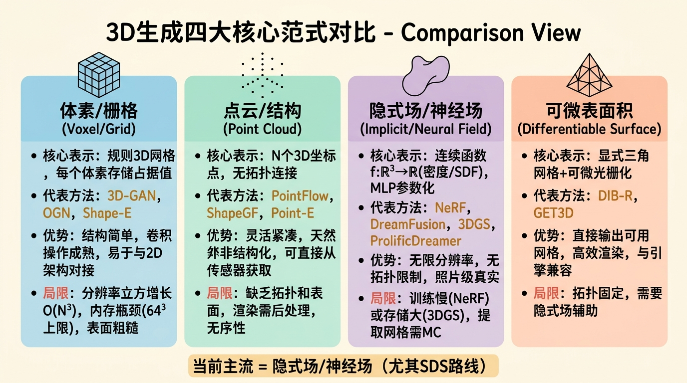
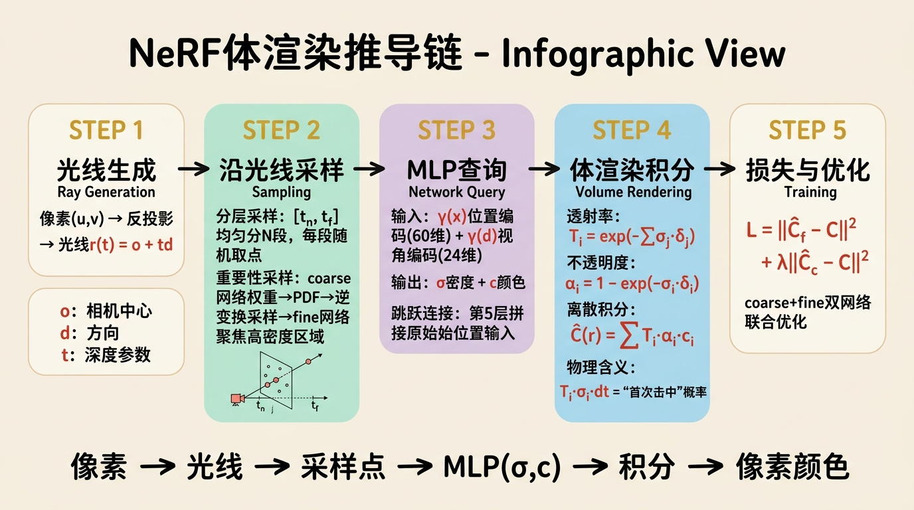
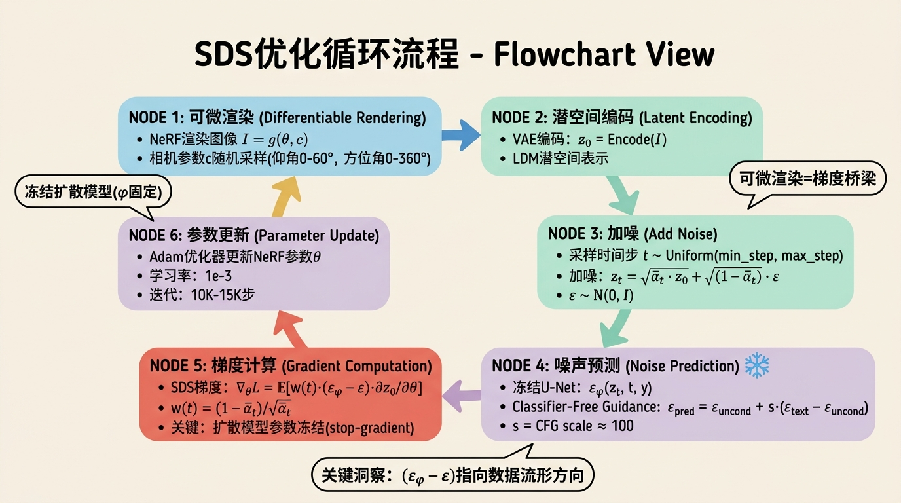
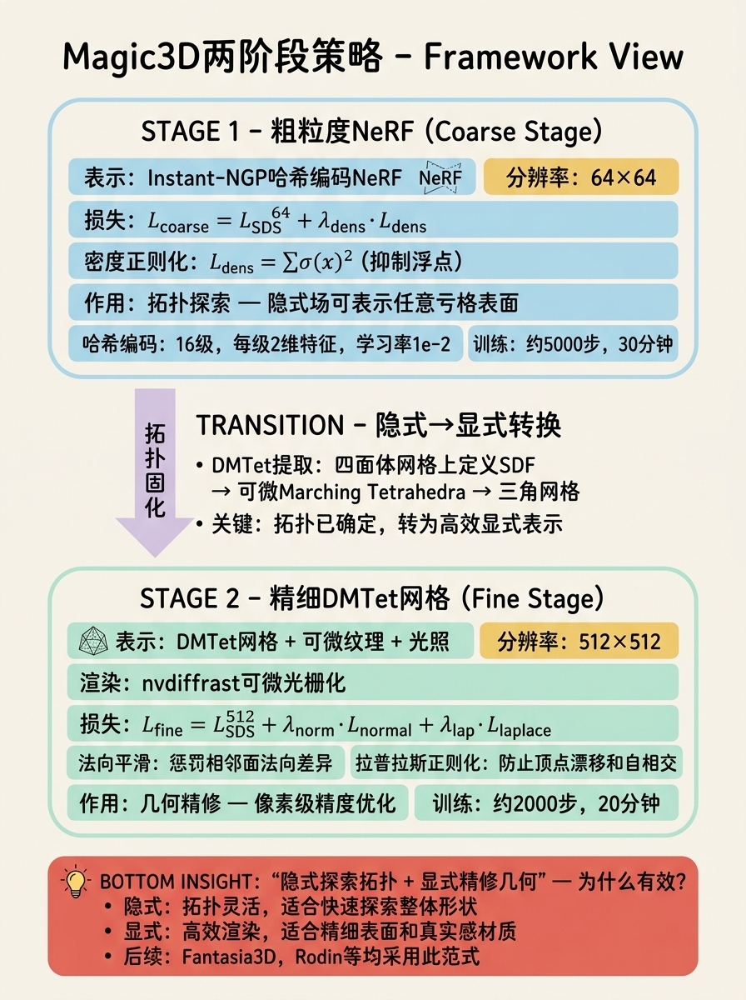
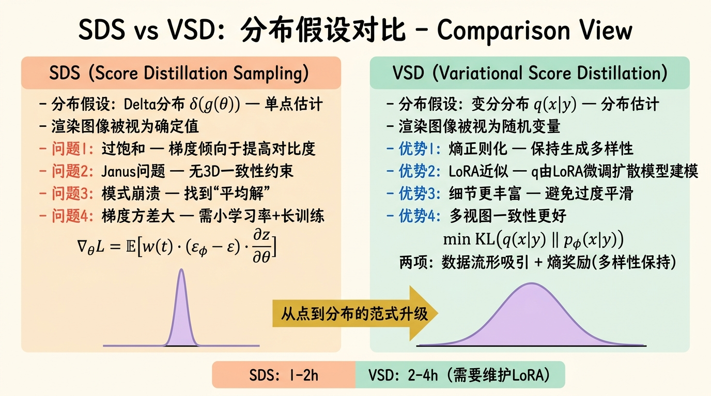
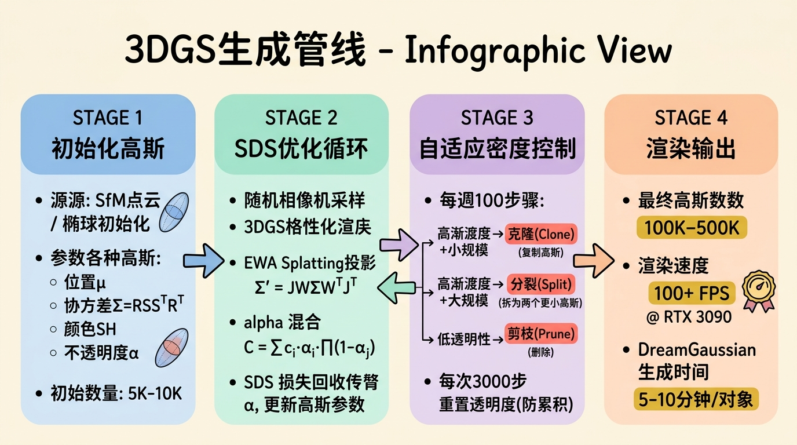
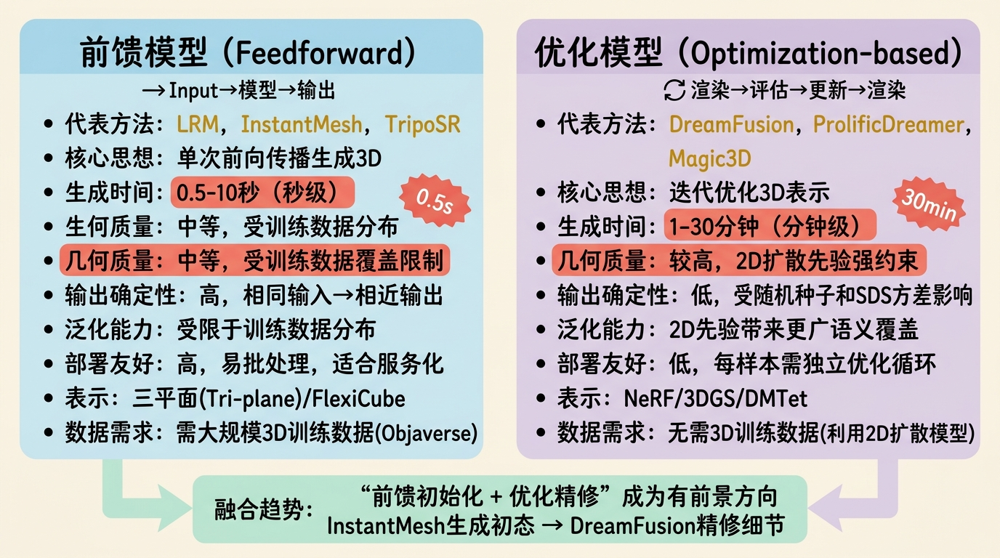

# 第三部分：核心篇（上）——3D生成模型的核心范式

## 3.1 基于体素与栅格的生成



### 3.1.1 3D-GAN：深度卷积在三维空间的首次成功

三维生成对抗网络的早期探索中，**3D Generative Adversarial Network (3D-GAN)** 由 Wu 等人于 CVPR 2016 提出，是首次将深度卷积架构成功扩展到三维体素空间的开创性工作。其前身可追溯至 Goodfellow 等人 2014 年的原始 GAN 框架以及 3DShapeNets (Wu et al., CVPR 2015) 对三维形状的卷积编码器探索；其后续影响则体现在后续大量基于体素的条件生成模型（如 3D-VAE-GAN、PrGAN）以及隐式场方法中对三维卷积特征的处理。

**完整架构**：

3D-GAN 的生成器 $G$ 采用 5 层三维转置卷积（3D Transposed Convolution），将低维潜码 $\mathbf{z} \in \mathbb{R}^{200}$（从标准正态分布采样）映射到 $64 \times 64 \times 64$ 的占据体素网格：

$$
\mathbf{z} \sim \mathcal{N}(0, I), \quad G(\mathbf{z}) = \mathbf{o} \in [0,1]^{64 \times 64 \times 64}
$$

生成器的逐层变换为：
- 第 1 层：$\mathbf{z} \in \mathbb{R}^{200} \rightarrow$ 全连接扩展为 $512 \times 4 \times 4 \times 4$
- 第 2 层：3D 反卷积，$512 \rightarrow 256$，空间分辨率 $4 \rightarrow 8$
- 第 3 层：3D 反卷积，$256 \rightarrow 128$，空间分辨率 $8 \rightarrow 16$
- 第 4 层：3D 反卷积，$128 \rightarrow 64$，空间分辨率 $16 \rightarrow 32$
- 第 5 层：3D 反卷积，$64 \rightarrow 1$，空间分辨率 $32 \rightarrow 64$

判别器 $D$ 是对称的 5 层三维卷积，最后一层通过全连接输出二元分类分数。

每层均使用 ReLU 激活（生成器）和 LeakyReLU（判别器），并配合批归一化（Batch Normalization）以稳定训练。

**关于反卷积的设计选择**：

3D-GAN 采用反卷积（transposed convolution）而非上采样+卷积的组合。从现代视角看，上采样（最近邻或双线性）后接标准卷积能显著减少棋盘伪影（checkerboard artifacts），这是因为反卷积的核重叠不均匀会导致输出出现周期性模式。但在 2016 年，转置卷积是生成器上采样的标准做法。值得注意的是，在三维空间中，棋盘伪影问题比二维更严重，因为体素的邻域连接度更高，但 3D-GAN 通过较小的卷积核（通常 $4 \times 4 \times 4$，步长 2）和批归一化部分缓解了这一问题。若去掉批归一化，训练会迅速发散；若改用线性上采样+卷积，生成形状的边界会略微模糊，但内部一致性会提升。

**训练细节与 WGAN-GP 的适配**：

原始 3D-GAN 使用标准 GAN 的 JS 散度目标，训练稳定性较差。后续工作中普遍采用 Arjovsky 等人提出的 Wasserstein GAN (WGAN) 及其带梯度惩罚的改进版 WGAN-GP (Gulrajani et al., NeurIPS 2017) 来训练三维生成器。WGAN-GP 的判别器损失为：

$$
\mathcal{L}_D = \mathbb{E}_{\tilde{\mathbf{x}} \sim \mathbb{P}_g}[D(\tilde{\mathbf{x}})] - \mathbb{E}_{\mathbf{x} \sim \mathbb{P}_r}[D(\mathbf{x})] + \lambda_{\text{gp}} \mathbb{E}_{\hat{\mathbf{x}}}[(\|\nabla_{\hat{\mathbf{x}}} D(\hat{\mathbf{x}})\|_2 - 1)^2]
$$

其中 $\hat{\mathbf{x}} = \epsilon \mathbf{x} + (1-\epsilon)\tilde{\mathbf{x}}$ 是真实样本与生成样本之间的线性插值，$\lambda_{\text{gp}} = 10$ 是标准设置。在三维空间中，梯度惩罚的实现与二维完全相同，因为判别器输入仍然是张量，只是维度从 $H \times W \times C$ 变为 $D \times H \times W \times C$。

关键超参数：
- 潜码维度：200
- 体素分辨率：$64^3$
- 批量大小（batch size）：受显存限制通常为 4-16（现代 GPU 上可提升至 32-64）
- 学习率：生成器 $0.0025$，判别器 $0.0001$（Adam，$\beta_1=0.5, \beta_2=0.9$）

**训练时间的量级**：在单张 NVIDIA V100 上，使用 ModelNet10 数据集（约 5000 个训练形状），训练至收敛约需 1-2 天。若使用 WGAN-GP，因判别器需多次更新，训练时间延长至 2-3 天。

**评估指标——合成分类准确率**：

由于缺乏通用的三维生成质量指标（如二维中的 FID 在当时尚未普及），3D-GAN 采用**合成分类准确率**（synthetic classification accuracy）作为代理指标。具体做法：
1. 用生成器合成大量三维形状；
2. 用这些合成形状训练一个三维形状分类器（基于 3DShapeNets 的架构）；
3. 在真实测试集上评估分类准确率。

直觉是：如果生成的形状质量高、多样性足，那么仅由合成数据训练出的分类器应能泛化到真实数据。这一指标的缺陷在于对模式坍塌（mode collapse）不够敏感——即使生成器只生成某几类形状的高质量样本，分类器仍可能表现良好。后续工作中引入了最小匹配距离（MMD）和覆盖度（Coverage）等指标来补充评估。

### 3.1.2 OGN：八叉树的神经网络表示

**Octree Generating Networks (OGN)** 由 Tatarchenko 等人于 CVPR 2017 年提出，是针对稠密体素表示内存效率低下的直接回应。其核心思想是：三维形状的表面在空间中往往是稀疏的，大部分体素是空的，因此不需要在全分辨率下表示所有区域。

**八叉树的神经网络表示**：

OGN 的生成器以递归方式构建八叉树（octree）。八叉树的每个节点对应一个立方体区域。网络在每个节点上做出两个预测：
1. **细分决策**（split decision）：当前节点是否需要继续细分为 8 个子节点；
2. **占据概率**（occupancy probability）：如果该节点是叶节点，其内部是否被占据。

设节点特征为 $\mathbf{h} \in \mathbb{R}^C$，网络输出为：

$$
p_{\text{split}} = \sigma(\mathbf{W}_s \mathbf{h} + b_s), \quad p_{\text{occ}} = \sigma(\mathbf{W}_o \mathbf{h} + b_o)
$$

**递推解码过程**：

解码从根节点开始，根节点对应整个 $256^3$ 的空间范围（或其他分辨率）。对于每个非叶节点：
1. 网络接收当前节点的特征向量 $\mathbf{h}$；
2. 预测 8 个子节点的特征 $\{\mathbf{h}_1, \mathbf{h}_2, ..., \mathbf{h}_8\} = f_{\text{deconv}}(\mathbf{h})$，其中 $f_{\text{deconv}}$ 是三维反卷积操作；
3. 对每个子节点递归执行步骤 1-2，直到达到预设的最大深度或 $p_{\text{split}} < 0.5$。

这种递归结构允许网络在表面附近（需要细节）使用深度细分的高分辨率体素，在空旷区域（内部或外部）使用粗粒度的大体素。

**内存节省的定量分析**：

假设形状表面附近的厚度为一个体素层，目标分辨率为 $N^3$。对于简单的表面积为 $A$（以体素单位计）的凸形状：
- 全稠密体素：内存 $O(N^3)$；
- 八叉树：仅在表面附近细分，内存 $O(A \cdot \log N)$。

以 $256^3$ 分辨率为例，全稠密表示需要 16,777,216 个体素值。若形状占据率仅 5%（对于 CAD 模型很常见），八叉树可将活跃节点数减少至约 100 万个，节省约 16 倍内存。这种节省使得在当时的硬件上训练更高分辨率的三维生成器成为可能。

若去掉八叉树结构而强制全分辨率预测，网络参数量不会显著增加（因为反卷积层的通道数相同），但显存消耗和计算量会随分辨率立方增长，导致 batch size 被迫降至 1 或训练不可行。

**输入、输出与超参数**：
- 输入：潜码 $\mathbf{z} \in \mathbb{R}^{200}$
- 输出：八叉树表示的三维占据网格，等效分辨率可达 $256^3$
- 关键超参数：最大八叉树深度（通常 8），节点特征维度（512），占用阈值（0.5）
- 训练时间：在 ModelNet 上约 1 天（Titan X GPU）

### 3.1.3 扩散模型时代的体素生成

进入扩散模型时代后，纯体素表示虽然不再是三维生成的主流，但在特定架构中仍扮演重要角色，尤其是作为正则化手段和快速预览路径。

**Shape-E 的两条路径**：

OpenAI 的 Shape-E (Jun & Nichol, 2023) 同时训练了两条生成路径：
1. **隐式函数编码器路径**：将点云编码为隐式函数的潜码，再解码为连续场；
2. **体素化渲染路径**：直接生成体素表示并通过可微渲染得到图像。

两条路径共享相同的文本条件编码器（基于 CLIP），通过不同的解码器输出三维表示。体素路径的优势在于渲染速度极快（无需光线行进），适合作为粗粒度预览；隐式路径则提供更精细的表面。

**体素作为正则化的具体做法**：

在基于 NeRF 的三维生成中，一种有效的正则化策略是**体素一致性损失**（Voxel Consistency Loss）。具体做法：
1. 在训练过程中，维护一个低分辨率的体素网格（如 $64^3$），记录每条光线采样点的密度累积；
2. 将 NeRF 的密度场 $\sigma(\mathbf{x})$ 投影到体素网格，计算每个体素的平均密度；
3. 鼓励体素内部的密度分布满足空间一致性，例如通过总变差（Total Variation）损失：

$$
\mathcal{L}_{\text{voxel}} = \sum_{i,j,k} \left( |\sigma_{i+1,j,k} - \sigma_{i,j,k}| + |\sigma_{i,j+1,k} - \sigma_{i,j,k}| + |\sigma_{i,j,k+1} - \sigma_{i,j,k}| \right)
$$

若去掉体素正则化，NeRF 在稀疏视图设置下容易产生浮点（floater）和噪声密度，尤其是在背景区域。体素正则化通过显式空间惩罚抑制了这些伪影，代价是略增加显存消耗（低分辨率体素网格的显存开销通常小于 1GB）。

---

## 3.2 基于点云与结构的生成

点云是一种灵活的三维表示，不需要规则网格，天然适合表示非结构化表面。在生成模型领域，点云的优势在于可直接从传感器获取（如 LiDAR），且表示紧凑；劣势在于缺乏拓扑信息且难以直接渲染。

### 3.2.1 PointFlow：连续归一化流的三维点云生成

**PointFlow** 由 Yang 等人于 ICCV 2019 提出，是将连续归一化流（Continuous Normalizing Flow, CNF）应用于三维点云生成的里程碑工作。其前身包括 PointNet (Qi et al., CVPR 2017) 对点云的深度学习编码和 Normalizing Flow (Dinh et al., 2014/2016; Kingma & Dhariwal, 2018) 在图像生成中的成功；后续影响了 PointCloudFlow、SceneFlow 以及扩散模型中对点云概率建模的理解。

**Normalizing Flow 的基础**：

Normalizing Flow 通过一系列可逆变换 $f = f_K \circ \cdots \circ f_1$ 将简单先验分布 $p_Z(\mathbf{z})$（通常是标准高斯）映射到复杂数据分布 $p_X(\mathbf{x})$。对于单个样本，通过**变量变换公式**（change of variables）计算精确对数似然：

$$
\log p_X(\mathbf{x}) = \log p_Z(f^{-1}(\mathbf{x})) + \log \left| \det J_{f^{-1}}(\mathbf{x}) \right|
$$

其中 $J_{f^{-1}}(\mathbf{x}) = \frac{\partial f^{-1}(\mathbf{x})}{\partial \mathbf{x}}$ 是逆变换的雅可比矩阵。关键约束是每个 $f_i$ 必须是可逆的，且其雅可比行列式易于计算。

**PointFlow 的 CNF 实现**：

传统 Normalizing Flow 采用离散层叠结构，而 PointFlow 使用 Chen 等人 2018 年提出的 Neural ODE 框架实现**连续归一化流**。其核心是将变换视为时间上的常微分方程：

$$
\frac{d\mathbf{z}(t)}{dt} = f(\mathbf{z}(t), t; \theta), \quad \mathbf{z}(0) \sim \mathcal{N}(0, I), \quad \mathbf{z}(1) = \mathbf{x}
$$

其中 $f$ 是一个神经网络（通常是 MLP 或小型的图神经网络），参数为 $\theta$。样本 $\mathbf{x}$ 的对数似然通过**瞬时变化公式**（instantaneous change of variables）计算：

$$
\log p(\mathbf{x}) = \log p(\mathbf{z}(0)) - \int_0^1 \text{Tr}\left( \frac{\partial f}{\partial \mathbf{z}(t)} \right) dt
$$

这里 $\text{Tr}\left( \frac{\partial f}{\partial \mathbf{z}(t)} \right)$ 是动态 $f$ 对状态的迹，替代了离散流中繁重的雅可比行列式计算。通过 ODE 求解器（如 dopri5 或 euler 方法）进行前向和后向积分。

**两级潜码设计——形状潜码与点潜码**：

PointFlow 的一个核心设计是分离了**形状级变异**和**点级采样噪声**：
- **形状潜码 $\mathbf{z}_s \in \mathbb{R}^{128}$**：描述整体形状结构，如"椅子"的类别和风格；
- **点潜码 $\mathbf{z}_p \in \mathbb{R}^{128}$**：描述特定点的位置变异，可视为每个点的"噪声"。

给定形状潜码 $\mathbf{z}_s$ 和一组点潜码 $\{\mathbf{z}_p^{(i)}\}_{i=1}^N$，每个三维点的生成过程为：

$$
\mathbf{x}_i = \text{ODESolve}(f_\theta(\cdot, \cdot, \mathbf{z}_s, \mathbf{z}_p^{(i)}), \mathbf{z}_p^{(i)}, t_0, t_1)
$$

**为什么需要两级潜码？**（Ablation 视角）

如果只用单级潜码（仅 $\mathbf{z}_s$），模型需要同时编码形状结构和点的分布，导致：
1. 形状相同的点云在潜空间中分布分散，因为点的排列（permutation）会改变潜码；
2. 生成新点时难以独立控制采样多样性。

分离后，$\mathbf{z}_s$ 可通过变分推断学习（编码器 $q(\mathbf{z}_s|\mathbf{X})$），而 $\mathbf{z}_p$ 固定为标准高斯。这保证了：
- 固定 $\mathbf{z}_s$，采样不同的 $\mathbf{z}_p$ 可得到同一形状的不同点采样（类似同一表面的不同点云扫描）；
- 在潜空间中插值 $\mathbf{z}_s$ 获得形状间的平滑过渡。

**训练目标**：

PointFlow 最大化条件对数似然 $\log p(\mathbf{X} | S)$，通过变分下界（ELBO）：

$$
\mathcal{L} = \mathbb{E}_{q(\mathbf{z}_s|\mathbf{X})} \left[ \sum_{i=1}^N \log p(\mathbf{x}_i | \mathbf{z}_s) \right] - \text{KL}(q(\mathbf{z}_s|\mathbf{X}) \| p(\mathbf{z}_s))
$$

其中 $\log p(\mathbf{x}_i | \mathbf{z}_s)$ 通过 CNF 的 ODE 积分计算。

**代码级结构**：

```python
class PointFlow(nn.Module):
    def __init__(self, latent_dim=128, num_points=2048):
        self.encoder = PointNetEncoder(latent_dim)  # 编码点云为 z_s
        self.odefunc = ODEFunc(latent_dim)          # 定义 dz/dt = f(z,t,z_s)
        self.ode_solver = ODESolver(self.odefunc)
        
    def encode_shape(self, point_cloud):
        # point_cloud: [B, N, 3]
        z_s = self.encoder(point_cloud)  # [B, latent_dim]
        return z_s
    
    def flow_transform(self, z_p, z_s):
        # z_p: [B, N, latent_dim], 点潜码
        # z_s: [B, latent_dim], 形状潜码（广播到每个点）
        t0, t1 = 0.0, 1.0
        # ODESolve 将 z_p(先验) 积分到 x(数据空间)
        points = self.ode_solver(z_p, t0, t1, context=z_s)
        return points  # [B, N, 3]
    
    def forward(self, point_cloud):
        z_s = self.encode_shape(point_cloud)
        z_s_prior = torch.randn_like(z_s)
        z_p_prior = torch.randn(point_cloud.shape[0], point_cloud.shape[1], 128)
        
        # 重构：从先验恢复点云
        recon = self.flow_transform(z_p_prior, z_s)
        
        # 计算对数似然（通过 ODESolve 的 adjoint 方法）
        log_p = compute_likelihood(recon, z_p_prior, z_s)
        
        kl = kl_divergence(z_s, z_s_prior)
        return -log_p + kl
    
    def sample(self, num_shapes, num_points=2048):
        z_s = torch.randn(num_shapes, 128)  # 形状先验
        z_p = torch.randn(num_shapes, num_points, 128)  # 点先验
        return self.flow_transform(z_p, z_s)
```

**输入、输出与超参数**：
- 输入：训练点云 $\mathbf{X} \in \mathbb{R}^{N \times 3}$（$N=2048$ 或 8192）
- 输出：生成的点云，同维度
- 关键超参数：形状潜码维度 128，ODE 求解器绝对容差 $10^{-5}$，学习率 $10^{-3}$，批量大小 128（点云级别）
- 训练时间：ShapeNet 单类别约 1-2 天（V100），由于 ODE 积分计算量大，比 GAN 慢 3-5 倍

### 3.2.2 ShapeGF：分数匹配与 Langevin 动力学

**ShapeGF** 由 Cai 等人于 CVPR 2020 提出，其前身是 Song & Ermon 2019 年的 Sliced Score Matching 和 Hyvarinen 2005 年的原始分数匹配理论；后续直接启发了 Point-Voxel Diffusion 以及将扩散模型应用于点云的大量工作。

**分数匹配的基本原理**：

概率密度函数 $p(\mathbf{x})$ 的**分数**（score）定义为对数密度的梯度：

$$
\mathbf{s}(\mathbf{x}) = \nabla_{\mathbf{x}} \log p(\mathbf{x})
$$

分数匹配的核心思想是：直接学习分数函数 $\mathbf{s}_\theta(\mathbf{x}) \approx \mathbf{s}(\mathbf{x})$，而**无需知道归一化常数**。这是因为归一化常数 $Z$ 在对数密度中表现为常数 $\log Z$，其梯度为零。这一性质对三维点云尤为重要，因为点云分布的归一化常数通常难以计算。

Hyvarinen 的原始分数匹配目标为：

$$
\mathcal{L}_{\text{SM}}(\theta) = \mathbb{E}_{p(\mathbf{x})} \left[ \text{tr}\left( \nabla_{\mathbf{x}} \mathbf{s}_\theta(\mathbf{x}) \right) + \frac{1}{2} \|\mathbf{s}_\theta(\mathbf{x})\|_2^2 \right]
$$

其中 $\nabla_{\mathbf{x}} \mathbf{s}_\theta(\mathbf{x})$ 是分数网络的雅可比矩阵。Sliced Score Matching 通过随机投影避免了直接计算迹（trace），使高维数据上的训练变得可行。

**Langevin 动力学采样**：

一旦学会了分数函数 $\mathbf{s}_\theta(\mathbf{x})$，就可以通过**Langevin 动力学**从分布中采样。这是一个离散的马尔可夫链蒙特卡洛（MCMC）过程：

$$
\mathbf{x}_{i+1} = \mathbf{x}_i + \epsilon_i \mathbf{s}_\theta(\mathbf{x}_i) + \sqrt{2\epsilon_i} \mathbf{z}_i, \quad \mathbf{z}_i \sim \mathcal{N}(0, I)
$$

其中 $\epsilon_i$ 是步长，通常随迭代衰减（如 $\epsilon_i = \epsilon_0 / (1 + i)$）。直观理解：第一项 $\mathbf{s}_\theta(\mathbf{x}_i)$ 将样本推向高密度区域（沿对数密度梯度上升），第二项 $\sqrt{2\epsilon_i}\mathbf{z}_i$ 提供随机扰动以确保采样的多样性。

**ShapeGF 的实现**：

ShapeGF 训练一个神经网络 $\mathbf{s}_\theta$ 以估计三维点云分布的分数。输入是一个扰动后的点云（加噪处理以覆盖多个尺度），输出是每个点的分数向量。训练时使用 Denoising Score Matching：

$$
\mathcal{L}_{\text{DSM}} = \mathbb{E}_{\mathbf{x} \sim p(\mathbf{x}), \boldsymbol{\sigma} \sim p(\boldsymbol{\sigma}), \boldsymbol{\delta} \sim \mathcal{N}(0, \boldsymbol{\sigma}^2 I)} \left[ \left\| \mathbf{s}_\theta(\mathbf{x} + \boldsymbol{\delta}; \boldsymbol{\sigma}) + \frac{\boldsymbol{\delta}}{\boldsymbol{\sigma}^2} \right\|_2^2 \right]
$$

这等价于训练网络去预测给定加噪样本时的最优去噪方向。

**Ablation 意识**：若去掉多尺度噪声条件（即只用单一噪声水平 $\sigma$），分数网络只能学会该尺度下的局部密度结构，Langevin 采样会陷入局部极小值或无法跨越不同模式。多尺度训练是确保全局结构正确生成的关键。

**输入、输出与超参数**：
- 输入：训练点云 $\mathbf{X} \in \mathbb{R}^{N \times 3}$，$N=2048$
- 输出：生成的点云，通过 1000 步 Langevin 动力学获得
- 关键超参数：噪声水平数量 10（几何级数从 0.01 到 1.0），Langevin 步长 0.001，退火率 0.95
- 训练时间：单类别约 12-24 小时（V100）

### 3.2.3 Point-E：两阶段大规模点云生成

**Point-E** 由 OpenAI 于 2022 年发布，是将大规模文本-图像扩散模型能力迁移到三维生成的早期尝试。其前身包括 GLIDE (Nichol et al., 2022)、CLIP (Radford et al., 2021) 和 Stable Diffusion；后续催生了 Shap-E 和直接生成 NeRF/网格的模型。

**第一阶段：GLIDE 文本到图像生成**：

Point-E 的第一阶段使用 GLIDE（OpenAI 的文本引导扩散模型）生成 $64 \times 64$ 的图像。GLIDE 基于扩散模型，在训练时使用 classifier-free guidance（CFG）。CFG 的核心公式：

在训练时，以 10% 的概率将文本条件 $\mathbf{c}$ 替换为空标记 $\emptyset$。采样时，预测噪声通过外推增强文本遵循度：

$$
\hat{\epsilon}_\theta(\mathbf{x}_t, t, \mathbf{c}) = \epsilon_\theta(\mathbf{x}_t, t, \emptyset) + s \cdot \left( \epsilon_\theta(\mathbf{x}_t, t, \mathbf{c}) - \epsilon_\theta(\mathbf{x}_t, t, \emptyset) \right)
$$

其中 $s > 1$ 是 guidance scale（Point-E 中通常取 3-5）。$s=1$ 时等价于无条件生成；$s > 1$ 时强化了文本条件的影响。

**第二阶段：图像到点云的 Transformer 扩散**：

第二阶段是 Point-E 的核心创新。它训练一个基于 Transformer 的扩散模型，以图像为条件生成点云。

点云表示：固定 $N = 16384$ 个点，每个点 6 维 $(x, y, z, r, g, b)$，因此序列长度为 16384。虽然 Transformer 的二次复杂度在理论上难以处理如此长的序列，但 Point-E 采用了两项关键设计：
1. 将点云分块为局部 patch，或使用线性复杂度的注意力变体；
2. 图像条件通过 CLIP 图像编码器提取 $\mathbf{z}_{\text{img}} \in \mathbb{R}^{768}$，在每个 Transformer 层通过 AdaLN（Adaptive Layer Norm）注入：

$$
\text{AdaLN}(\mathbf{h}, \mathbf{z}_{\text{img}}) = \gamma(\mathbf{z}_{\text{img}}) \cdot \frac{\mathbf{h} - \mu}{\sigma} + \beta(\mathbf{z}_{\text{img}})
$$

扩散模型在点云潜空间或直接坐标空间上运行，通过逐步去噪生成完整点云。

**后处理：从点云到网格**：

Point-E 生成的点云需要后处理才能用于大多数图形学应用：
1. **SDF 转换法**：将点云转换为符号距离函数（SDF），可通过泊松重建或从点云估计局部隐含场，然后用 Marching Cubes 提取网格；
2. **直接渲染法**：将点云渲染为点精灵（point sprites），适合预览但缺乏真实表面。

**输入、输出与超参数**：
- 输入：文本提示 $\mathbf{c}$ 或图像 $\mathbf{I}$
- 输出：16384 个 RGB 点的点云
- 关键超参数：图像分辨率 $64 \times 64$，CFG scale 3.0，点云扩散步数 1024，Transformer 层数 24，隐藏维度 2048
- 训练时间：在数百万三维-文本对上训练（具体数据量未公开），单阶段训练需数周级别（A100 集群）
- 推理时间：单样本约 1-2 分钟（T4 GPU），其中大部分在第一阶段图像生成

### 3.2.4 多视图扩散引导点云生成

**Zero-1-to-3** 由 Liu 等人于 CVPR 2023 提出，展示了如何利用视图合成模型作为中间层来优化三维表示（包括点云）。

**核心思想**：

给定单张输入图像 $\mathbf{I}_0$，Zero-1-to-3 微调 Stable Diffusion 学习相对相机姿态控制的新视角合成。具体而言，在原本的条件 $\mathbf{c}$ 上拼接相对旋转和平移编码 $\mathbf{p}_{\text{rel}}$，训练扩散模型去噪目标视角：

$$
\epsilon_\theta(\mathbf{x}_t, t, \mathbf{I}_0, \mathbf{p}_{\text{rel}})
$$

在推理时，可从多个视角 $\{\mathbf{p}_i\}$ 合成一致的图像 $\{\mathbf{I}_i\}$。这些多视图图像随后用于优化点云或神经场：

1. 初始化点云（如从深度估计或粗糙基元）；
2. 对每个采样视角，渲染当前点云得到 $\hat{\mathbf{I}}_i$；
3. 用 Zero-1-to-3 模型计算该视角的 SDS 或重建损失；
4. 反向传播更新点云位置。

多视图一致性损失确保各视角的投影匹配：

$$
\mathcal{L}_{\text{mv}} = \sum_{i,j} \| \pi_i(\mathbf{X}) - \mathbf{I}_i \|_1 + \lambda_{\text{consist}} \sum_{i,j} \| \pi_i^{-1}(\mathbf{I}_i) \cap \pi_j^{-1}(\mathbf{I}_j) \|
$$

其中 $\pi_i$ 是第 $i$ 个视角的投影，最后一项惩罚不一致的深度。

---

## 3.3 基于隐式场/神经场的生成（全文最重章节）

隐式场表示将三维形状编码为连续函数 $f: \mathbb{R}^3 \rightarrow \mathbb{R}$，通常是占据概率或符号距离。这种表示天然具有无限分辨率、无拓扑限制的优势。NeRF 将隐式场扩展到辐射场，结合可微渲染实现了照片级真实感的新视角合成，从而成为三维生成领域最重要的基础。

### 3.3.1 NeRF 原理的完全推导



**Neural Radiance Fields (NeRF)** 由 Mildenhall 等人于 ECCV 2020 提出，其前身包括 Scene Representation Networks (Sitzmann et al., CVPR 2019) 和 DeepSDF (Park et al., CVPR 2019)；后续直接催生了数千篇跟进论文，构成了现代三维视觉的核心支柱。

#### 从辐射传输方程到体渲染公式

NeRF 的体渲染公式并非凭空构造，而是来源于辐射传输方程（Radiative Transfer Equation, RTE）的简化形式。RTE 描述了光在参与介质（participating medium）中传播时的能量变化：

$$
\frac{dL(\mathbf{x}, \boldsymbol{\omega})}{ds} = -\sigma_a(\mathbf{x}) L(\mathbf{x}, \boldsymbol{\omega}) + \sigma_s(\mathbf{x}) \int_{S^2} p(\mathbf{x}, \boldsymbol{\omega}', \boldsymbol{\omega}) L(\mathbf{x}, \boldsymbol{\omega}') d\boldsymbol{\omega}' + Q(\mathbf{x}, \boldsymbol{\omega})
$$

其中 $L$ 是辐射亮度，$\sigma_a$ 是吸收系数，$\sigma_s$ 是散射系数，$p$ 是相位函数，$Q$ 是源项。NeRF 做了以下简化假设：
1. 不发光介质，$Q = 0$；
2. 仅考虑单散射或忽略散射，$\sigma_s = 0$；
3. 定义消光系数 $\sigma_t = \sigma_a + \sigma_s$，在 NeRF 中简称为密度 $\sigma$。

在这些假设下，沿光线方向 $\mathbf{r}(t) = \mathbf{o} + t\mathbf{d}$ 的辐射亮度微分方程简化为：

$$
\frac{dC(t)}{dt} = -\sigma(t) C(t) + \sigma(t) \mathbf{c}(t)
$$

其中 $C(t)$ 是累积颜色，$\mathbf{c}(t)$ 是位置 $t$ 处的发射颜色。这是一个一阶线性常微分方程。为了求解它，引入**透射率** $T(t)$，表示光线从近端 $t_n$ 传播到 $t$ 而没有被任何粒子拦截的概率：

$$
T(t) = \exp\left( -\int_{t_n}^t \sigma(s) ds \right)
$$

$T(t)$ 满足 $\frac{dT(t)}{dt} = -\sigma(t) T(t)$，初始条件 $T(t_n) = 1$。

将 $C(t)$ 的方程重写为：

$$
\frac{dC}{dt} + \sigma(t) C = \sigma(t) \mathbf{c}(t)
$$

两边乘以积分因子 $T(t)^{-1} = \exp\left(\int_{t_n}^t \sigma(s) ds\right)$：

$$
\frac{d}{dt} [T(t)^{-1} C(t)] = T(t)^{-1} \sigma(t) \mathbf{c}(t)
$$

从 $t_n$ 到 $t_f$ 积分，利用 $T(t_n) = 1$ 和边界条件 $C(t_n) = 0$（从相机出发时无累积光）：

$$
C(\mathbf{r}) = \int_{t_n}^{t_f} T(t) \sigma(t) \mathbf{c}(t) dt
$$

**关键理解**：$T(t) \sigma(t) dt$ 的物理意义是光线在 $[t, t+dt]$ 区间内**首次**击中粒子的概率。$T(t)$ 确保此前未被阻挡，$\sigma(t)dt$ 是在该无穷小区间内发生碰撞的概率。因此，积分本质上是在所有可能位置上按"首次击中"概率加权求和发射颜色。

#### 离散化数值实现

实际中，NeRF 通过沿光线采样有限个点来近似积分。设沿光线采样 $N$ 个点 $\{t_i\}_{i=1}^N$，相邻采样点间距为 $\delta_i = t_{i+1} - t_i$。

将密度 $\sigma_i = \sigma(t_i)$ 视为在该小区间内恒定，则透射率的离散形式为：

$$
T_i = \exp\left( -\sum_{j=1}^{i-1} \sigma_j \delta_j \right)
$$

对应的离散体渲染公式为：

$$
\hat{C}(\mathbf{r}) = \sum_{i=1}^{N} T_i (1 - \exp(-\sigma_i \delta_i)) \mathbf{c}_i
$$

其中 $\alpha_i = 1 - \exp(-\sigma_i \delta_i)$ 可解释为第 $i$ 个采样段的不透明度。该公式保证 $0 \leq \alpha_i \leq 1$，且当 $\sigma_i \rightarrow \infty$ 时 $\alpha_i \rightarrow 1$（完全不透明），当 $\sigma_i = 0$ 时 $\alpha_i = 0$（完全透明）。

**分层采样（Stratified Sampling）**：

NeRF 使用分层采样在 $[t_n, t_f]$ 区间内获取 $N$ 个采样点，以覆盖整个深度范围。具体实现：

```python
def stratified_sampling(ray_near, ray_far, N_samples, perturb=True):
    """
    ray_near: [B, 1], 光线近端
    ray_far: [B, 1], 光线远端
    N_samples: int, 采样数
    """
    # 将 [0,1] 均匀分 N 段
    t_vals = torch.linspace(0., 1., N_samples + 1)
    
    # 在近平面和远平面之间线性插值
    z_vals = ray_near * (1. - t_vals) + ray_far * t_vals  # [B, N_samples+1]
    
    # 计算每段的中点
    mids = .5 * (z_vals[..., 1:] + z_vals[..., :-1])       # [B, N_samples]
    upper = torch.cat([mids, z_vals[..., -1:]], -1)         # [B, N_samples]
    lower = torch.cat([z_vals[..., :1], mids], -1)          # [B, N_samples]
    
    if perturb:
        # 在每段内随机扰动
        t_rand = torch.rand(z_vals[..., :-1].shape)         # [B, N_samples]
        z_vals = lower + (upper - lower) * t_rand
    else:
        z_vals = mids
        
    return z_vals  # [B, N_samples]
```

分层采样确保了深度范围内的均匀探索，每段内的随机性打破了与网络特征的对齐（避免系统性伪影）。若去掉段内随机扰动（即均匀采样），MLP 可能因输入的固定模式产生摩尔纹状伪影。

**重要性采样（Hierarchical Sampling）**：

仅使用分层采样时，平坦空旷区域和密集表面区域获得相同数量的采样点，造成计算浪费。NeRF 引入 coarse-to-fine 的两级网络：

1. **Coarse 网络**：在 $N$ 个分层采样点上查询，预测密度和颜色；
2. 根据 coarse 网络的输出计算归一化权重：

$$
w_i = \alpha_i T_i = T_i (1 - \exp(-\sigma_i \delta_i))
$$

$$
\hat{w}_i = \frac{w_i}{\sum_{j=1}^N w_j}
$$

3. 将 $\hat{w}_i$ 视为概率密度函数（PDF），通过**逆变换采样**在密集区域额外采样 $N_f$ 个"精细"点。

```python
def sample_pdf(bins, weights, N_samples, det=False):
    """
    根据权重进行逆变换采样
    bins: [B, N_coarse+1], 区间边界
    weights: [B, N_coarse], 每个区间的权重
    """
    # 归一化得到 PDF
    pdf = weights + 1e-5  # 防止除零
    pdf = pdf / torch.sum(pdf, -1, keepdim=True)   # [B, N_coarse]
    
    # 计算 CDF
    cdf = torch.cumsum(pdf, -1)                     # [B, N_coarse]
    cdf = torch.cat([torch.zeros_like(cdf[..., :1]), cdf], -1)  # [B, N_coarse+1]
    
    # 在 [0,1] 均匀采样
    if det:
        u = torch.linspace(0., 1., N_samples)
        u = u.expand(list(cdf.shape[:-1]) + [N_samples])
    else:
        u = torch.rand(list(cdf.shape[:-1]) + [N_samples])
    
    # 逆变换采样：在 CDF 中查找 u 对应的位置
    u = u.contiguous()
    inds = torch.searchsorted(cdf, u, right=True)   # [B, N_fine]
    below = torch.max(torch.zeros_like(inds - 1), inds - 1)
    above = torch.min((cdf.shape[-1] - 1) * torch.ones_like(inds), inds)
    
    # 在 bins[below] 和 bins[above] 之间线性插值
    inds_g = torch.stack([below, above], -1)
    matched_shape = [inds_g.shape[0], inds_g.shape[1], cdf.shape[-1]]
    cdf_g = torch.gather(cdf.unsqueeze(1).expand(matched_shape), 2, inds_g)
    bins_g = torch.gather(bins.unsqueeze(1).expand(matched_shape), 2, inds_g)
    
    denom = (cdf_g[..., 1] - cdf_g[..., 0])
    denom = torch.where(denom < 1e-5, torch.ones_like(denom), denom)
    t = (u - cdf_g[..., 0]) / denom
    samples = bins_g[..., 0] + t * (bins_g[..., 1] - bins_g[..., 0])
    
    return samples
```

重要性采样将精细采样点集中在有实际内容的区域（高权重区域），从而在相同计算量下显著提升重建精度。若去掉此机制，coarse 和 fine 网络仅在采样密度上有所区别， fine 网络无法有效聚焦高频细节，导致边缘模糊。

#### 位置编码的频域分析

NeRF 的一个核心设计是将三维坐标 $\mathbf{x} \in \mathbb{R}^3$ 和视角方向 $\mathbf{d} \in \mathbb{R}^2$（球面坐标）通过**位置编码**（Positional Encoding, PE）映射到高频空间：

$$
\gamma(p) = \left[ \sin(2^0 \pi p), \cos(2^0 \pi p), \sin(2^1 \pi p), \cos(2^1 \pi p), \ldots, \sin(2^{L-1} \pi p), \cos(2^{L-1} \pi p) \right]
$$

对于三维坐标，若 $L=10$，则每个坐标分量映射到 20 维，总输入维度为 60。对于视角方向，通常 $L=4$，映射到 24 维。

**为什么需要位置编码？——MLP 的频谱偏置**：

Rahaman 等人（NeurIPS 2019）的论文《On the Spectral Bias of Neural Networks》证明了神经网络存在**频谱偏置**（spectral bias）：它们倾向于先学习目标函数的低频成分，高频成分的学习需要更长的训练时间。直观上，ReLU MLP 的傅里叶谱以低频为主，因为梯度下降更容易拟合平滑变化。

位置编码通过显式注入高频基函数，将低频 MLP 的建模任务转换为学习高频系数，从而绕过了频谱偏置。Tancik 等人（NeurIPS 2020）在《Fourier Features Let Networks Learn High Frequency Functions in Low Dimensional Domains》中进一步证明，位置编码等价于将核函数变为平移不变的**平稳核**（stationary kernel）。具体而言，对于映射后的特征 $\gamma(\mathbf{x})$，MLP 在高维特征空间中的点积对应于原始空间中的核函数：

$$
k(\mathbf{x}_1, \mathbf{x}_2) = \mathbb{E}_{\mathbf{w} \sim \mathcal{N}(0, I)} \left[ \cos(2\pi \mathbf{w}^T (\mathbf{x}_1 - \mathbf{x}_2)) \right]
$$

这是一个径向基函数（RBF），其带宽由频率范围 $L$ 控制。因此，位置编码的本质是**将 MLP 转变为核方法**，其中频率范围决定了核的局部化程度。

**编码方式对比与演进**：

| 方法 | 编码方式 | 核心思想 | 相对原版 NeRF 的优劣 |
|------|---------|---------|-------------------|
| 原版 NeRF | 正弦位置编码 $\gamma(p)$ | 显式傅里叶特征 | 参数少，但需固定 $L$ |
| Instant-NGP | 多分辨率哈希编码 | 可学习哈希表 + 三线性插值 | 速度快 100 倍，质量相当 |
| Fsinh | 有限元编码 | 局部多项式基 | 更光滑，实现复杂 |
| 3D Gaussian Splatting | 无需编码 | 高斯本身就是局部基 | 最快，但表示不连续 |

Instant-NGP (Müller et al., SIGGRAPH 2022) 用多分辨率哈希表替代固定正弦编码：将空间划分为多个分辨率层级，每个网格顶点存储可学习特征，通过哈希函数索引。查询时三线性插值各层级特征并拼接。这种编码使 NeRF 训练从 1-2 天缩短至 5 分钟，因为梯度直接更新局部特征而非通过深层 MLP 反向传播。

3D Gaussian Splatting 则完全不需要位置编码，因为每个 3D 高斯本身就是局部基函数，其影响随距离指数衰减，天然具有局部性和多分辨率特性。

#### NeRF 训练的细节

**MLP 架构**：

原版 NeRF 的 MLP 接收编码后的位置 $\gamma(\mathbf{x}) \in \mathbb{R}^{60}$ 和视角 $\gamma(\mathbf{d}) \in \mathbb{R}^{24}$：

1. 位置输入通过 8 个全连接层，每层 256 个神经元，ReLU 激活；
2. 第 5 层的输出通过跳跃连接（skip connection）与原始位置输入拼接：

$$
\mathbf{h}_5 = \text{ReLU}(\mathbf{W}_5 \mathbf{h}_4 + \mathbf{b}_5), \quad \mathbf{h}_6^{\text{input}} = [\mathbf{h}_5, \gamma(\mathbf{x})]
$$

3. 后续层继续处理 $\mathbf{h}_6^{\text{input}}$，输出 256 维特征；
4. 密度头 $\sigma$ 从该特征直接输出（不依赖视角，保证多视角一致性）；
5. 颜色头 $\mathbf{c}$ 将视角方向 $\gamma(\mathbf{d})$ 与特征拼接后通过额外层输出 RGB。

**为什么需要跳跃连接？**

去掉第 5 层的跳跃连接，深层网络对位置信息的保留能力会下降。在梯度反向传播中，深层 MLP 的位置梯度可能因梯度消失/爆炸而失真，跳跃连接提供了位置信息的"高速公路"，确保网络在深层仍能敏感地响应位置变化。实验中，去掉跳跃连接会导致高频几何细节丢失，尤其是薄结构。

**相机位姿与投影**：

NeRF 需要精确的相机内参 $K$ 和外参 $(R, t)$。外参构成 $4 \times 4$ 齐次变换矩阵：

$$
\mathbf{T}_{\text{cam}}^{\text{world}} = \begin{bmatrix} R & t \\ 0 & 1 \end{bmatrix}
$$

投影矩阵为 $P = K [R | t]$。光线原点 $\mathbf{o}$ 是相机中心，方向 $\mathbf{d}$ 通过像素坐标 $(u, v)$ 反投影：

$$
\mathbf{d} = R^T K^{-1} \begin{bmatrix} u \\ v \\ 1 \end{bmatrix}
$$

在训练数据准备中，通常使用 COLMAP (Schönberger & Frahm, 2016) 从多视角图像估计相机位姿。位姿精度直接影响 NeRF 重建质量：若位姿误差超过 1 像素，重建结果会出现模糊或重影。

**损失函数**：

$$
\mathcal{L} = \sum_{\mathbf{r} \in \mathcal{R}} \left\| \hat{C}_f(\mathbf{r}) - C(\mathbf{r}) \right\|_2^2 + \lambda \left\| \hat{C}_c(\mathbf{r}) - C(\mathbf{r}) \right\|_2^2
$$

其中 $\hat{C}_c$ 是 coarse 网络输出，$\hat{C}_f$ 是 fine 网络输出，$\lambda$ 通常取 0.1。均方误差直接惩罚渲染像素与真实像素的差异。若去掉 coarse 损失， coarse 网络缺乏直接监督，其 PDF 估计会退化，导致重要性采样失效。

**训练时间演进**：
- 原版 NeRF：1 张 V100，单场景 1-2 天（约 100-300 万射线，迭代 10k-30k 步）
- Instant-NGP：1 张 RTX 3090，单场景 5 分钟
- 3D Gaussian Splatting：1 张 RTX 3090，单场景 10-30 分钟（包含自适应密度控制）

### 3.3.2 从重建到生成

**核心问题分析**：

重建（Reconstruction）与生成（Generation）是两个根本不同的数学问题：

- **重建** = 优化单个场景的表示参数 $\theta$：

$$
\theta^* = \arg\min_\theta \sum_i \mathcal{L}(\text{Render}(\theta, c_i), I_i)
$$

监督信号是多视图图像 $\{I_i\}$，目标是找到解释观测数据的最佳 $\theta$。这是一个确定性的优化问题，没有建模不确定性。

- **生成** = 学习场景分布 $p(\theta)$ 或 $p(\mathbf{X})$：

$$
\max_\phi \mathbb{E}_{\theta \sim p_{\text{data}}} [\log p_\phi(\theta)]
$$

需要捕捉多样性（不同形状）和条件控制（如文本引导）。这要求网络学习整个数据流形的结构，而非单个点。

**桥梁：条件化 NeRF**：

将生成引入 NeRF 的关键是**条件化**：让同一个网络根据潜码 $\mathbf{z}$ 生成不同的场景：

$$
F_\theta(\mathbf{x}, \mathbf{d}, \mathbf{z}) \rightarrow (\sigma, \mathbf{c})
$$

这就是 Conditional NeRF 或 generative NeRF 的核心形式。$\mathbf{z}$ 可从先验分布采样，从而生成新场景。在实现上，$\mathbf{z}$ 通常通过 FiLM (Feature-wise Linear Modulation) 或 AdaIN 注入 MLP 的各层：

$$
\text{FiLM}(\mathbf{h}, \mathbf{z}) = \gamma(\mathbf{z}) \odot \mathbf{h} + \beta(\mathbf{z})
$$

**核心挑战**：

三维生成面临的最大障碍是**缺乏大规模三维-文本配对数据**。二维扩散模型（如 Stable Diffusion）能在数十亿图像-文本对上训练，而带文本标注的三维模型仅有数百万（如 Objaverse 约 80 万）。这促使研究者利用预训练二维扩散模型作为三维生成的监督信号——即 Score Distillation Sampling (SDS) 的核心动机。

### 3.3.3 DreamFusion 与 SDS（最关键）



**DreamFusion** 由 Poole 等人于 ICCV 2023 提出，首次成功利用预训练二维扩散模型引导三维 NeRF 的优化，无需任何三维训练数据。其前身可追溯到 CLIP-Mesh (Mohammad Khalid et al., 2022) 和 CLIP-for-all；后续催生了 Magic3D、ProlificDreamer、Fantasia3D 以及整个文本到三维生成的研究浪潮。

**完整数学推导**：

定义：
- $\theta$：NeRF 的可优化参数（网络权重或隐式场参数）
- $g(\theta, c)$：相机参数 $c$ 下的可微渲染函数，输出图像 $\mathbf{I} \in \mathbb{R}^{H \times W \times 3}$
- $\phi$：预训练 2D 扩散模型的参数（**冻结**，不参与训练）
- $\mathbf{y}$：文本条件（通过 CLIP 或 T5 编码的文本嵌入）

扩散模型定义前向加噪过程。设 $\mathbf{z}_0$ 是图像在潜空间中的表示（对于像素空间扩散，$\mathbf{z}_0 = \mathbf{I}$；对于 LDM，$\mathbf{z}_0 = \mathcal{E}(\mathbf{I})$，$\mathcal{E}$ 是 VAE 编码器）：

$$
q(\mathbf{z}_t | \mathbf{z}_0) = \mathcal{N}\left(\mathbf{z}_t; \sqrt{\bar{\alpha}_t} \mathbf{z}_0, (1-\bar{\alpha}_t)\mathbf{I}\right)
$$

其中 $\bar{\alpha}_t = \prod_{s=1}^t (1-\beta_s)$，$\beta_t$ 是噪声方差进度表。

扩散模型学习去噪：$\epsilon_\phi(\mathbf{z}_t, t, \mathbf{y})$ 预测 $\mathbf{z}_t$ 中的噪声分量 $\boldsymbol{\epsilon}$。

**SDS 的核心洞察**：

如果渲染图像 $g(\theta, c)$ 符合文本描述 $\mathbf{y}$，那么扩散模型应该能很容易地预测其噪声。如果不符合，扩散模型预测的去噪方向就会指向"更合理的图像"，这一方向可作为梯度信号来更新 NeRF。

形式上，考虑扩散模型隐式定义的对数似然 $\log p_\phi(\mathbf{z}_0 | \mathbf{y})$。通过扩散模型的得分函数，我们有：

$$
\nabla_{\mathbf{z}_0} \log p_\phi(\mathbf{z}_0 | \mathbf{y}) \approx \mathbb{E}_{t, \boldsymbol{\epsilon}} \left[ w(t) \left( \epsilon_\phi(\mathbf{z}_t; \mathbf{y}, t) - \boldsymbol{\epsilon} \right) \frac{\partial \mathbf{z}_t}{\partial \mathbf{z}_0} \right]
$$

其中 $\mathbf{z}_t = \sqrt{\bar{\alpha}_t} \mathbf{z}_0 + \sqrt{1-\bar{\alpha}_t} \boldsymbol{\epsilon}$，$w(t)$ 是与信噪比相关的权重，通常取：

$$
w(t) = \frac{1-\bar{\alpha}_t}{\sqrt{\bar{\alpha}_t}}
$$

**通过链式法则传播到 NeRF 参数**：

$$
\nabla_\theta \log p_\phi(g(\theta, c) | \mathbf{y}) = \underbrace{\mathbb{E}_{t, \boldsymbol{\epsilon}} \left[ w(t) \left( \epsilon_\phi(\mathbf{z}_t; \mathbf{y}, t) - \boldsymbol{\epsilon} \right) \frac{\partial \mathbf{z}_t}{\partial \mathbf{z}_0} \right]}_{\text{图像空间梯度}} \cdot \frac{\partial g(\theta, c)}{\partial \theta}
$$

注意到 $\frac{\partial \mathbf{z}_t}{\partial \mathbf{z}_0} = \sqrt{\bar{\alpha}_t}$（对于 LDM 还需考虑 VAE 编码器的导数），因此：

$$
\nabla_\theta \mathcal{L}_{\text{SDS}} = \mathbb{E}_{t, \boldsymbol{\epsilon}} \left[ w(t) \left( \epsilon_\phi(\mathbf{z}_t; \mathbf{y}, t) - \boldsymbol{\epsilon} \right) \sqrt{\bar{\alpha}_t} \frac{\partial g(\theta, c)}{\partial \theta} \right]
$$

在 DreamFusion 的实际实现中，使用了一个简化的梯度形式（省略了某些缩放因子并通过 stop-gradient 处理）：

$$
\nabla_\theta \mathcal{L}_{\text{SDS}} \approx \mathbb{E}_{t, \boldsymbol{\epsilon}} \left[ w(t) \left( \epsilon_\phi(\mathbf{z}_t; \mathbf{y}, t) - \boldsymbol{\epsilon} \right) \frac{\partial \mathbf{z}_0}{\partial \theta} \right]
$$

其中 $\frac{\partial \mathbf{z}_0}{\partial \theta}$ 通过可微渲染获得。

**关键理解**：
- $(\epsilon_\phi - \boldsymbol{\epsilon})$ 表示"扩散模型认为应有的噪声方向"与"实际噪声"的差异；
- 如果渲染图 $\mathbf{z}_0$ 已经很好（符合文本），扩散模型预测的噪声接近真实噪声，差值趋于零，梯度消失；
- 如果渲染图与文本不符，扩散模型会预测一个将图像推向数据流形的去噪方向，产生非零梯度；
- 扩散模型参数 $\phi$ 被冻结（stop-gradient），因此梯度不会更新扩散模型，只流向 NeRF。

**SDS 的 PyTorch 风格伪代码**：

```python
def sds_loss(nerf, diffusion, text_embedding, camera, 
             min_step=0.02, max_step=0.98, guidance_scale=100):
    """
    nerf: NeRF 模型
    diffusion: 预训练 2D 扩散模型 (Stable Diffusion)
    text_embedding: [1, 77, 768], CLIP 文本编码
    camera: 当前相机参数
    """
    # 1. 可微渲染
    rendered_image = nerf.render(camera)  # [1, 3, H, W], 范围 [0,1]
    
    # 2. 编码到潜空间 (LDM)
    with torch.no_grad():
        z0 = diffusion.encode_first_stage(rendered_image)  # [1, 4, h, w]
        z0 = z0 * diffusion.scale_factor  # VAE 缩放因子
    
    # 3. 随机采样时间步
    t = torch.randint(
        int(min_step * diffusion.num_timesteps),
        int(max_step * diffusion.num_timesteps),
        (1,)
    ).long()
    
    # 4. 加噪
    noise = torch.randn_like(z0)
    sqrt_alpha_bar = diffusion.sqrt_alphas_cumprod[t]
    sqrt_one_minus_alpha_bar = diffusion.sqrt_one_minus_alphas_cumprod[t]
    zt = sqrt_alpha_bar * z0 + sqrt_one_minus_alpha_bar * noise
    
    # 5. 扩散模型预测（冻结参数）
    with torch.no_grad():
        # Classifier-free guidance
        if torch.rand(1) < 0.1:
            # 无条件预测
            eps_uncond = diffusion.unet(zt, t, encoder_hidden_states=None)
        else:
            eps_text = diffusion.unet(zt, t, encoder_hidden_states=text_embedding)
            eps_uncond = diffusion.unet(zt, t, encoder_hidden_states=None)
            eps_pred = eps_uncond + guidance_scale * (eps_text - eps_uncond)
    
    # 6. SDS 梯度（直接作为梯度，不是标准损失）
    # 注意: w(t) 通常实现为 (1 - alpha_bar) 的某种形式
    w = 1 - diffusion.alphas_cumprod[t]
    grad = w * (eps_pred - noise)
    
    # 7. 通过 z0 传播到 NeRF（manual backward）
    # 目标：让 z0 产生 grad 方向的梯度
    z0_grad = grad * sqrt_alpha_bar  # 链式法则通过 z_t = sqrt(a)*z0 + ...
    
    # 使用 torch.autograd.grad 手动传播
    # 这里我们构造一个辅助损失来实现
    latent_model_input = z0
    # 关键：停止扩散模型和噪声的梯度，只保留渲染梯度
    grad_z0 = z0_grad.detach()
    
    # 通过可微渲染反向传播
    # 实际实现中常用 hook 或 grad 变量
    loss = (z0 * grad_z0).sum()
    loss.backward()
    
    return loss
```

**完整的 SDS 训练循环**：

```python
nerf = NeRFModel()
optimizer = torch.optim.Adam(nerf.parameters(), lr=1e-3)
diffusion = load_pretrained_stable_diffusion().to(device).eval()

text = "a dog wearing a wizard hat"
text_embedding = clip_encode_text(text)  # [1, 77, 768]

for step in range(10000):
    # 随机采样相机
    elevation = random.uniform(0, 60)
    azimuth = random.uniform(0, 360)
    camera = get_orbit_camera(elevation, azimuth, radius=4.0)
    
    # 渲染并计算 SDS
    rendered = nerf.render(camera)
    
    # SDS 损失
    loss = sds_loss(nerf, diffusion, text_embedding, camera)
    
    # 优化
    optimizer.zero_grad()
    loss.backward()
    optimizer.step()
    
    # 定期更新学习率/密度控制
    if step % 100 == 0:
        print(f"Step {step}, Loss: {loss.item()}")
```

**SDS 的问题与理论分析**：

1. **过饱和（Over-saturation）**：
   SDS 的梯度方向往往倾向于提高渲染图像的对比度而非改善几何结构。这是因为扩散模型的去噪过程在高度加噪（$t$ 大）时更关注全局结构，在低加噪（$t$ 小）时关注细节。SDS 的权重函数 $w(t)$ 如果设计不当，会过度强调某些频率范围，导致颜色过饱和。解决思路是在 $w(t)$ 中引入频率依赖的衰减。

2. **多面问题（Janus Problem）**：
   2D 扩散模型独立处理每个视角，缺乏显式的三维一致性约束。优化过程中，NeRF 可能学会在多个方向上都呈现物体的"正面"特征，导致一个 3D 物体出现多个正面（如一张脸有两对眼睛）。这是 SDS 方法的根本限制，因为 2D 扩散先验只编码了投影分布，无法约束不可见区域的 3D 结构。

3. **模式崩溃与过度平滑**：
   SDS 优化倾向于找到一个"平均"解来最大化所有采样视角的似然。如果文本描述允许多种解释（如"一个立方体或球体"），优化结果往往是两者的模糊混合而非清晰选择其一。这与 GAN 中的模式崩溃不同，更像是优化的确定性偏差。

4. **梯度方差大**：
   由于相机采样（每个 step 随机视角）和噪声采样（随机 $t$ 和 $\epsilon$）的随机性，SDS 梯度具有较高方差。需要较小的学习率和较长的训练时间（通常 10k-15k 步）来平均噪声。

**输入、输出与超参数**：
- 输入：文本描述 $\mathbf{y}$，随机初始化 NeRF（或椭球初始化）
- 输出：优化的 NeRF 表示，可渲染为 360 度新视角
- 关键超参数：CFG scale 100（远高于图像生成时的 7.5），学习率 $10^{-3}$，分辨率 $64 \times 64$（训练）$\rightarrow 256 \times 256$（渲染），迭代 10k-15k，每步随机采样 1-4 个视角
- 训练时间：单张 V100，约 1-2 小时 per shape（DreamFusion 原版使用 TPUs）

### 3.3.4 Magic3D 与后续改进

**Magic3D** 由 Lin 等人于 NeurIPS 2023 年（高影响力，实际公开时间与 DreamFusion 接近）提出，核心贡献是采用**由粗到细的两阶段策略**，将 DreamFusion 的质量提升到可用水平。

#### 第一阶段：粗粒度 NeRF

第一阶段使用 Instant-NGP 的哈希编码加速 NeRF 表示，在低分辨率 $64 \times 64$ 下进行 SDS 优化。

Instant-NGP 的哈希编码将空间位置 $\mathbf{x}$ 映射为多分辨率特征：

$$
\mathbf{h}(\mathbf{x}) = \oplus_{l=0}^{L-1} \text{interp}\left(\mathcal{H}_l\left[\lfloor \mathbf{x} \cdot b^l \rfloor \right], \mathbf{x}\right)
$$

其中 $\mathcal{H}_l$ 是第 $l$ 层的哈希表，$b$ 是底数（通常 1.5-2），$\text{interp}$ 是三线性插值。

第一阶段的损失为：

$$
\mathcal{L}_{\text{coarse}} = \mathcal{L}_{\text{SDS}}^{64} + \lambda_{\text{dens}} \mathcal{L}_{\text{dens}}
$$

其中 $\mathcal{L}_{\text{dens}}$ 是密度正则化，鼓励密度场稀疏（避免浮点）：

$$
\mathcal{L}_{\text{dens}} = \sum_{\mathbf{x}} \sigma(\mathbf{x})^2
$$

**关键超参数**：哈希表级数 16，每级特征维度 2， coarse 分辨率 16，fine 分辨率 2048，学习率 $10^{-2}$。

#### 第二阶段：精细 DMTet 网格

第二阶段将粗 NeRF 转换为显式网格并进行精细优化。核心是 **DMTet**（Differentiable Marching Tetrahedra）。

**DMTet 表示**：

DMTet 在规则四面体网格（tetrahedral grid）上定义符号距离函数（SDF）。设网格顶点集为 $\mathcal{V} = \{\mathbf{v}_i\}_{i=1}^M$，每个顶点存储 SDF 值 $s_i \in \mathbb{R}$ 和形变偏移 $\Delta \mathbf{v}_i \in \mathbb{R}^3$。通过神经网络预测这些值：

$$
\{s_i, \Delta \mathbf{v}_i\} = \text{MLP}(\mathbf{v}_i, \mathbf{z})
$$

**可微 Marching Tetrahedra**：

对于每个四面体，检查其 4 个顶点的 SDF 符号。若符号变化（部分顶点为正，部分为负），则等值面 $s=0$ 穿过该四面体。在四面体内，通过线性插值找到零交叉点，连接形成三角形。

Marching Tetrahedra 是 Marching Cubes 在四面体剖分上的类比，但由于四面体只有 16 种拓扑配置（远少于立方体的 256 种），且所有插值都是线性的，整个提取过程关于顶点 SDF 值是**可微的**。这允许梯度从渲染图像一直回传到 SDF 网络。

```python
#### DMTet 核心概念伪代码
class DMTetMesh(nn.Module):
    def __init__(self, resolution=128):
        # 创建规则四面体网格
        self.tet_grid = create_regular_tetrahedral_grid(resolution)
        self.mlp = MLP(input_dim=3, output_dim=4)  # 输出 SDF + 3D 偏移
        
    def extract_mesh(self):
        # 查询每个顶点的 SDF 和偏移
        features = self.mlp(self.tet_grid.vertices)  # [M, 4]
        sdf = features[:, 0]
        deform = features[:, 1:4]
        
        # 应用形变
        vertices = self.tet_grid.vertices + deform
        
        # 可微 Marching Tetrahedra
        triangles = marching_tetrahedra(
            vertices, self.tet_grid.indices, sdf
        )
        return triangles  # 梯度可回传到 sdf 和 deform
```

**第二阶段的联合优化**：

提取网格后，Magic3D 优化网格顶点位置 $\mathcal{V}$、可微纹理 $\mathcal{T}$（通常也是 MLP 或纹理图）和光照参数 $\mathcal{L}$。使用 nvdiffrast（Laine et al., 2020）进行高分辨率可微光栅化：

$$
\mathcal{L}_{\text{fine}} = \mathcal{L}_{\text{SDS}}^{512} + \lambda_{\text{normal}} \mathcal{L}_{\text{normal}} + \lambda_{\text{lap}} \mathcal{L}_{\text{laplace}}
$$

其中：
- $\mathcal{L}_{\text{normal}}$ 是法向平滑正则化，惩罚相邻三角形法向差异；
- $\mathcal{L}_{\text{laplace}}$ 是拉普拉斯平滑，防止顶点过度漂移：

$$
\mathcal{L}_{\text{laplace}} = \sum_i \left\| \mathbf{v}_i - \frac{1}{|\mathcal{N}(i)|} \sum_{j \in \mathcal{N}(i)} \mathbf{v}_j \right\|_2^2
$$

若去掉拉普拉斯正则化，网格在 SDS 的强梯度下容易产生自相交和锯齿状表面；若去掉法向正则化，光照计算会出现不连续 artifact。

**为什么两阶段策略有效？**（关键思考题）



粗阶段使用隐式 NeRF 表示，其拓扑灵活（可表示任意亏格表面），适合快速探索正确的整体形状拓扑。若直接从网格开始优化，拓扑固定（如球拓扑），容易陷入错误的拓扑结构。细阶段将隐式场固化到显式网格，利用网格的高效率实现精细表面优化和真实感渲染。这种"隐式探索 + 显式精修"的范式后续被 Fantasia3D、Rodin 等大量方法采用。

**ProlificDreamer 的 VSD（Variational Score Distillation）**：



Wang 等人于 CVPR 2024 年提出的 ProlificDreamer 从理论上分析了 SDS 的缺陷，并提出 **Variational Score Distillation (VSD)**。

SDS 的根本问题可归结为：它将渲染图像的分布假设为 delta 函数（单点估计），即假设所有相机视角下都只渲染出完全确定的图像。VSD 将问题重新建模为变分推断：学习一个分布 $q(\theta)$ 而非单点估计。

VSD 的核心数学：

设渲染图像分布为 $q(\mathbf{x} | \mathbf{y})$，VSD 最小化该分布与扩散模型定义的数据分布 $p_\phi(\mathbf{x} | \mathbf{y})$ 之间的 KL 散度：

$$
\min_{q} \text{KL}(q(\mathbf{x} | \mathbf{y}) \| p_\phi(\mathbf{x} | \mathbf{y}))
$$

展开梯度，VSD 给出两个关键项：

$$
\nabla_\theta \mathcal{L}_{\text{VSD}} = \underbrace{\nabla_\theta \mathbb{E}_{q}[\log p_\phi(\mathbf{x} | \mathbf{y})]}_{\text{数据流形吸引}} - \underbrace{\nabla_\theta \mathbb{E}_{q}[\log q(\mathbf{x} | \mathbf{y})]}_{\text{熵正则化/多样性保持}}
$$

第一项类似 SDS，将渲染拉向数据流形；第二项是熵奖励，鼓励渲染分布保持多样性，防止模式崩溃。

实现上，VSD 维护一个 LoRA 微调的扩散模型来近似当前 3D 模型的渲染分布 $q(\mathbf{x} | \mathbf{y})$。这避免了直接估计熵的困难，同时大幅提升了生成多样性和细节质量。

**MVDream**：

Shi 等人于 ICLR 2024 年提出的 MVDream 从另一角度解决 Janus 问题：直接微调 Stable Diffusion 成为**多视图扩散模型**。

训练数据：从 Objaverse 数据集渲染的物体多视图图像（每个物体 4-6 个正交或环绕视角）。

输入：将 4 个视角的图像拼接为一张大图（如 $2 \times 2$ 网格），相机姿态通过正弦位置编码嵌入。

输出：去噪后的多视图拼接图。

由于扩散模型在训练时看到多个视角同时出现，它学会了视角间的对应关系。在 SDS 中使用 MVDream 时，单次前向传播即可为多个视角提供一致的去噪信号，从根本上缓解了多面问题。

**Fantasia3D**：

Chen 等人于 2023 年提出的 Fantasia3D 强调**几何与外观的解耦优化**：

**几何阶段**：
- 只优化 SDF 场（通过 DMTet），不学习纹理；
- 使用法向图（normal map）或深度图的 SDS 进行监督，而非 RGB 图像；
- 法向图对光照不敏感，迫使网络只学习几何结构。

**外观阶段**：
- 固定几何（提取的网格），优化基于物理的渲染（PBR）参数；
- 材质参数包括反照率（albedo）、粗糙度（roughness）、金属度（metallic）；
- 使用 HDR 环境光照图，通过可微蒙特卡洛渲染计算图像。

这种解耦使得生成的几何更干净，材质更真实。若不解耦，SDS 的梯度会同时影响形状和颜色，导致颜色泄漏到形状（如阴影被误解释为几何凹陷）。

#### 3D Gaussian Splatting 的数学详解



**3D Gaussian Splatting (3DGS)** 由 Kerbl 等人于 SIGGRAPH 2023 年提出，是 NeRF 之后三维表示领域最具影响力的工作之一。其后续催生了 DreamGaussian、GaussianDreamer、LGM 等生成式方法。

**高斯定义**：

每个 3D 高斯由以下参数定义：
- 中心位置 $\boldsymbol{\mu} \in \mathbb{R}^3$
- 协方差矩阵 $\Sigma \in \mathbb{R}^{3 \times 3}$
- 颜色：球谐函数（Spherical Harmonics, SH）系数
- 不透明度 $\alpha \in \mathbb{R}$

**协方差参数化**：

为保证 $\Sigma$ 是半正定矩阵（合法的协方差），3DGS 使用缩放-旋转分解：

$$
\Sigma = R S S^T R^T
$$

其中 $R \in SO(3)$ 是旋转矩阵（以四元数 $\mathbf{q} \in \mathbb{R}^4, \|\mathbf{q}\|=1$ 存储），$S = \text{diag}(s_x, s_y, s_z)$ 是对角缩放矩阵。这种参数化使得优化过程中协方差始终保持有效。若直接优化 $\Sigma$ 的对称 6 个元素，容易导致非半正定矩阵，数值不稳定。

**投影（EWA Splatting）**：

将 3D 高斯投影到 2D 图像平面是 Splatting 的核心。设相机投影变换的仿射近似为雅可比矩阵 $J$，世界到相机变换为 $W$，则投影后的 2D 协方差为：

$$
\Sigma' = J W \Sigma W^T J^T
$$

这是经典的 **EWA（Elliptical Weighted Average）Splatting** 公式。投影后的 2D 高斯在图像平面上形成椭圆，其中心通过完整的投影变换计算。

**$\alpha$ 混合**：

对于每个像素，收集沿光线相交的所有 3D 高斯（通过 tile-based 排序），按深度从前到后混合：

$$
C = \sum_{i=1}^{N} c_i \alpha_i \prod_{j=1}^{i-1}(1-\alpha_j)
$$

其中 $c_i$ 是第 $i$ 个高球的颜色（由 SH 系数和视角方向计算），$\alpha_i$ 是投影高斯在该像素中心的不透明度：

$$
\alpha_i = \sigma_i \cdot \exp\left( -\frac{1}{2} (\mathbf{x}' - \boldsymbol{\mu}_i')^T (\Sigma_i')^{-1} (\mathbf{x}' - \boldsymbol{\mu}_i') \right)
$$

这里 $\mathbf{x}'$ 是像素中心坐标，$\boldsymbol{\mu}_i'$ 是投影中心。

**训练与自适应密度控制**：

3DGS 的训练包含独特的**自适应密度控制**：

```python
#### 3D Gaussian Splatting 训练循环概念
gaussians = initialize_from_sfm_point_cloud(ply_file)  # 从 COLMAP 初始化

for iteration in range(30000):
    # 前向：投影并光栅化
    image = rasterize(gaussians, camera)
    
    # 损失
    loss = (1 - lambda_dssim) * l1_loss(image, gt_image) + \
           lambda_dssim * (1 - ssim(image, gt_image))
    
    loss.backward()
    optimizer.step()
    
    # 自适应密度控制（每 100 迭代）
    if iteration % 100 == 0:
        # 1. 计算每个高斯的平均梯度幅值
        grads = gaussians.xyz_gradient_accum / gaussians.denom
        
        # 2. 高梯度 → 分裂或克隆
        high_grad_mask = grads > threshold
        
        # 克隆：复制高斯，位置相同
        clone_mask = high_grad_mask & (scales < scale_threshold)
        gaussians.clone(clone_mask)
        
        # 分裂：替换为两个更小的高斯
        split_mask = high_grad_mask & (scales >= scale_threshold)
        gaussians.split(split_mask)
        
        # 3. 低不透明度 → 删除
        prune_mask = alphas < alpha_threshold
        gaussians.prune(prune_mask)
        
        # 4. 周期性重置不透明度，防止积累
        if iteration % 3000 == 0:
            gaussians.reset_opacity()
```

**为什么比 NeRF 快？**

| 操作 | NeRF | 3DGS |
|------|------|------|
| 表示 | MLP 查询 | 显式基元（高斯） |
| 渲染 | 每条光线 128-512 次 MLP 前向 | 每个像素混合 10-100 个高斯 |
| 梯度传播 | 通过 MLP 多层 | 直接到高斯参数 |
| 空白区域 | 仍需查询 | 自动剔除（tile-based） |

NeRF 的渲染是"每光线多次 MLP 查询"，计算复杂度 $O(H \cdot W \cdot N_{\text{samples}} \cdot M_{\text{mlp}})$。3DGS 的渲染是"每像素混合有限个高斯"，且高斯已通过空间哈希预排序，可用 GPU 光栅化管线高度并行，复杂度 $O(H \cdot W \cdot K_{\text{gaussians}})$，其中 $K \ll N_{\text{samples}}$。

**生成式 3DGS**：

将 SDS 应用于 3DGS 的方法（如 DreamGaussian）省去了光线行进，直接优化高斯参数：

```python
#### DreamGaussian 风格 SDS 训练
gaussians = initialize_ellipsoid(num_gaussians=5000)

for step in range(5000):
    camera = sample_random_camera()
    
    # 3DGS 渲染
    image = gaussian_splatting_render(gaussians, camera)
    
    # SDS 损失（与 NeRF 相同）
    loss = sds_loss(image, text_embedding, diffusion)
    
    loss.backward()
    
    # 优化位置、旋转、缩放、SH、不透明度
    optimizer.step()
    
    # 定期执行分裂/剪枝
    if step % 100 == 0:
        adaptive_density_control(gaussians)
```

**输入、输出与超参数**：
- 输入：多视图图像 + 相机位姿（重建）；或文本提示（生成式）
- 输出：数百万个 3D 高斯（通常 100 万-500 万个）
- 关键超参数：初始点云大小（SfM 点数量），SH 阶数（通常 3 阶，共 16 系数），$\alpha$ 重置周期（3000 步），$\lambda_{\text{dssim}} = 0.2$
- 训练时间：单场景重建，RTX 3090 上 10-30 分钟；生成式优化（DreamGaussian）每物体 10-20 分钟

---

## 3.4 基于可微表面积的生成

### 3.4.1 可微光栅化（DIB-R）详解

**Differentiable Interpolation-Based Renderer (DIB-R)** 由 Chen 等人于 NeurIPS 2019 年提出，解决了传统光栅化不可微的核心问题。

**传统光栅化的不可微性**：

光栅化的关键操作——三角形覆盖测试——是硬阈值决策：

$$
\mathbf{1}_{\text{inside}}(\mathbf{p}) = \begin{cases} 1 & \text{if } \mathbf{p} \in \triangle \\ 0 & \text{otherwise} \end{cases}
$$

这一指示函数的梯度几乎处处为零，无法通过反向传播更新网格顶点位置。

**DIB-R 的软光栅化**：

DIB-R 定义了**软三角形**（soft triangle）。对于像素 $\mathbf{p}$ 和三角形的三条边，计算其有符号距离 $d_i(\mathbf{p})$。像素属于三角形的概率定义为：

$$
D_i = \sigma\left( \frac{d_i}{\tau} \right)
$$

其中 $\sigma$ 是 sigmoid 函数，$\tau$ 是温度参数（softness）。当 $\tau \rightarrow 0$ 时退化为硬阈值；$\tau > 0$ 时提供平滑梯度。

像素颜色通过 alpha 混合：

$$
I_i = D_i \cdot f_c + (1 - D_i) \cdot f_b
$$

其中 $f_c$ 是三角形颜色（通过重心坐标插值顶点颜色），$f_b$ 是背景色。

**深度排序的可微近似**：

多个三角形覆盖同一像素时，DIB-R 使用 softmax 进行可微深度排序：

$$
I_{\text{final}} = \sum_{k=1}^{K} w_k \cdot I_k, \quad w_k = \frac{\exp(-z_k / \gamma)}{\sum_j \exp(-z_j / \gamma)}
$$

其中 $z_k$ 是第 $k$ 个三角形在该像素的深度，$\gamma$ 是温度。当 $\gamma \rightarrow 0$ 时，最近的三角形获得权重 1；$\gamma > 0$ 时允许多个三角形软混合。

**Ablation 意识**：若去掉软光栅化而强行使用直通估计器（straight-through estimator）近似硬阈值梯度，网格优化会在局部最优处震荡，难以收敛到合理形状。软化的连续逼近是端到端网格学习的关键。

### 3.4.2 GET3D：生成式可微渲染网络

**GET3D** 由 Gao 等人于 NeurIPS 2022 年提出，是首个成功结合 StyleGAN2 生成器与可微光栅化的大规模三维生成模型。

**生成器架构**：

GET3D 的生成器输出两个隐式场：
1. **SDF 场**：$f_{\text{geo}}(\mathbf{x}, \mathbf{z}) \rightarrow s \in \mathbb{R}$，通过 DMTet 提取网格几何；
2. **材质场**：$f_{\text{tex}}(\mathbf{x}, \mathbf{z}) \rightarrow \mathbf{c} \in \mathbb{R}^3$，定义表面颜色。

潜码 $\mathbf{z}$ 通过 StyleGAN2 的映射网络（Mapping Network）注入到两个场网络中。

**DMTet 提取与渲染**：

几何场通过 DMTet（同 Magic3D）提取可微三角网格。不同于 NeRF 的体积渲染，GET3D 使用 6 个固定视角的可微光栅化（nvdiffrast）渲染高分辨率图像。固定视角减少了训练方差，因为判别器总是在相同视角下判断真伪。

**判别器**：

判别器采用 StyleGAN2 的架构，判断渲染图像是否真实。由于生成器输出的是三维表示，同一样本可在不同视角下渲染，判别器需要判断所有视角的一致性。

**文本条件**：

GET3D 支持文本条件生成：通过 CLIP 文本编码器获得文本嵌入 $\mathbf{e}_{\text{text}}$，通过条件批归一化（conditional BN）注入生成器：

$$
\text{CBN}(\mathbf{h}, \mathbf{e}_{\text{text}}) = \gamma(\mathbf{e}_{\text{text}}) \cdot \frac{\mathbf{h} - \mu}{\sqrt{\sigma^2 + \epsilon}} + \beta(\mathbf{e}_{\text{text}})
$$

**输入、输出与超参数**：
- 输入：随机潜码 $\mathbf{z} \in \mathbb{R}^{512}$，可选文本条件
- 输出：带纹理的三角网格（顶点数约 1 万-10 万）
- 关键超参数： StyleGAN2 映射网络深度 8，DMTet 分辨率 128，渲染分辨率 $512 \times 512$，学习率 0.002
- 训练时间：在 ShapeNet 大规模子集上，8 张 A100 训练约 2-3 天

**Ablation 意识**：若去掉 DMTet 而直接在网格顶点上生成（无隐式场），生成器无法表达拓扑变化（如从球变为环）。隐式场提供了拓扑灵活性，可微提取将其转换为高效的显式渲染表示。

---

## 关键思考题扩展（解答）

**1. 从信息论角度，SDS-based 方法的上界在哪里？**

SDS-based 方法本质上利用 2D 扩散模型 $p_\phi(\mathbf{I} | \mathbf{y})$ 提供的**投影分布先验**来优化 3D 表示。信息论上，单视角图像 $\mathbf{I} = \pi(\mathbf{X})$ 是三维场景 $\mathbf{X}$ 的投影，这是一个多对一的映射。根据数据处理不等式，投影后的信息不会多于原始三维信息：

$$
I(\mathbf{X}; \mathbf{y}) \geq I(\pi(\mathbf{X}); \mathbf{y}) = I(\mathbf{I}; \mathbf{y})
$$

因此，2D 扩散模型只能提供**可见表面的约束**，对不可见区域（背面、内部结构）的约束仅为间接推断。SDS 方法的上界在于：它无法生成超越 2D 扩散模型"想象能力"的三维结构。如果某个三维特征在所有二维投影下都不可区分，SDS 无法为其提供监督。这解释了为什么 SDS 方法在生成对称、各向同性物体时表现较好，而在生成具有复杂内部结构或严格拓扑要求的物体时受限。

**2. 3D Gaussian Splatting 的表示能力与 NeRF 相比如何？**

从逼近论角度，NeRF 的 MLP 表示的是**全局函数**，其影响范围遍及整个空间（尽管位置编码提供了局部化）。3DGS 的高斯基元是**严格局部**的，其影响随距离指数衰减。

- **光滑表面**：NeRF 更容易表示 $C^\infty$ 光滑表面，因为 MLP 是解析函数；3DGS 的表示在微观上是不连续的（数百万个高斯的拼接），需要极大量高斯才能逼近光滑曲面。
- **高频细节**：3DGS 通过增加高斯数量可任意提高局部分辨率；NeRF 的高频能力受限于位置编码频率 $L$ 或哈希表分辨率。
- **空洞/薄结构**：3DGS 难以表示极薄表面（如叶片、纸张），因为高斯需要极小尺度；NeRF 通过高密度区域集中采样点也能建模薄结构，但可能产生模糊。
- **渲染效率**：3DGS 显著优于 NeRF，因其计算模式适合 GPU 并行光栅化。

总结：3DGS 是"以空间换时间"的表示，用显式存储的大量局部基函数换取渲染效率；NeRF 是"以计算换压缩"的表示，用网络评估换取紧凑存储。

**3. 为什么 Magic3D 的两阶段策略有效？**

Magic3D 的两阶段策略符合**拓扑优化**与**几何精化**的分离原则：

- **拓扑空间是离散的**：改变物体拓扑（如球变为环面）需要非局部、离散的操作。隐式场（NeRF/SDF）天然支持任意拓扑，因为等值面的拓扑由函数值分布隐式决定，可通过梯度下降连续优化。
- **几何细节是连续的**：一旦拓扑确定，表面的精细几何（褶皱、纹理）是连续可微的。显式网格提供了对顶点位置的直接参数化，配合可微光栅化可实现像素级精度的优化。

若只用单阶段 NeRF，虽然也能生成不错的外观，但提取的网格通常有噪声且过度平滑；若只用单阶段网格，拓扑固定导致生成多样性受限。两阶段策略在正确的时间使用正确的表示，是工程上的最优解。

---

## 3.5 原生3D扩散与大规模预训练

### 3.5.1 为什么需要原生3D扩散？

基于Score Distillation Sampling (SDS)的方法在3D生成领域取得了显著进展，但从信息论的角度审视，这类方法存在不可逾越的根本性局限。

**数据处理不等式与信息损失**

SDS方法利用预训练2D扩散模型为3D表示提供梯度监督。然而，根据数据处理不等式，对于马尔可夫链 $\mathbf{X} \rightarrow \pi(\mathbf{X}) \rightarrow \mathbf{y}$：

$$I(\mathbf{X}; \mathbf{y}) \geq I(\pi(\mathbf{X}); \mathbf{y})$$

2D扩散模型在训练时从未接触过三维结构信息，其提供的梯度信号只能在投影信息所覆盖的子空间内约束，无法恢复被投影操作丢弃的维度信息。物体的背面、底面等不可见区域缺乏直接梯度约束，几何细节在2D投影中被遮蔽无法准确恢复。

**Janus问题的根本来源**——2D扩散模型学到的是"从某个视角看，正面应该是什么样的"，而非"正面在三维空间中的几何位置"。不同视角的梯度可能引导模型在不同位置生成独立的正面结构。从信息论视角看，Janus问题本质上是 $H(\mathbf{X} | \pi(\mathbf{X}), \mathbf{y}) > 0$——即使给定了2D观测和模型先验，3D结构仍然存在不可消除的不确定性。

### 3.5.2 直接在3D空间训练扩散模型的三大挑战

**挑战一：数据规模不足** — LAION-5B包含约50亿图文对，Objaverse仅约800K个3D模型，量级差距达三个数量级。扩散模型的缩放定律 $\mathcal{L}(N, M) \approx A/N^\alpha + B/M^\beta + \mathcal{L}_0$ 表明数据不足时模型欠拟合或过拟合。

**挑战二：3D表示的非均匀性** — 2D图像有统一像素网格表示，3D数据存在点云、网格、SDF、体素、NeRF等多种异构表示，各有优劣，无法设计统一网络架构处理所有3D数据。

**挑战三：计算成本** — 3D卷积复杂度从 $O(HW \cdot K^2)$ 增至 $O(DHW \cdot K^3)$，约增长一个数量级。$512^3$ 体素需约1.34亿存储位置，对GPU显存提出极高要求。

### 3.5.3 代表性工作详解

#### Shap-E (OpenAI)

核心创新："隐式函数编码+体素双路径扩散"。编码器将3D资产映射为NeRF辐射场和SDF双路径隐向量 $\mathbf{z} \in \mathbb{R}^d$，在潜空间训练条件扩散模型 $p_\theta(\mathbf{z} | \mathbf{c})$，规避了3D表示非均匀性挑战。采样得到的潜向量通过预训练解码器同时输出NeRF和Mesh，生成时间约秒级。

#### LRM（Large Reconstruction Model）

单图到3D的前馈重建模型，用Transformer大规模容量替代迭代优化。采用三平面(Tri-plane)表示：$\mathbf{f}(\mathbf{p}) = \mathbf{F}_{xy}(x,y) + \mathbf{F}_{xz}(x,z) + \mathbf{F}_{yz}(y,z)$，将3D特征存储复杂度从 $O(N^3)$ 降至 $O(3N^2)$。

流程：DINOv2编码图像patch特征 → Transformer解码为三平面特征 → NeRF体积渲染计算损失。约5亿参数，在Objaverse 800K数据上训练。一次前向传播约0.5秒生成3D表示。

#### InstantMesh

"多视图扩散+FlexiCube可微等值面提取"端到端管线。先用Zero123++从单图生成6个一致多视图图像（$I(\mathbf{X}; \{\mathbf{I}_1, \ldots, \mathbf{I}_6\}) \geq I(\mathbf{X}; \mathbf{I}_1)$），再用FlexiCube实现可微等值面提取：$\mathbf{v}_{\text{mesh}} = \text{FlexiCube}(\text{SDF}, \mathbf{w}, \boldsymbol{\delta})$，其中 $\mathbf{w}$ 为可学习面权重，$\boldsymbol{\delta}$ 为顶点偏移。单张图像约10秒生成带纹理高质量Mesh。

#### TripoSR

基于Transformer+TSDF的快速单图3D重建。全局-局部特征融合机制：图像编码器同时输出全局语义向量和局部patch特征，Transformer解码器通过交叉注意力同时利用两者。约0.5秒推理速度。

#### XCube

"稀疏体素+层次化扩散"框架：粗粒度扩散在低分辨率体素网格上生成占据结构，细粒度扩散在已占据区域内逐区域生成高分辨率细节：

$$p_\theta(\mathbf{V}_{\text{fine}} | \mathbf{V}_{\text{coarse}}) = \prod_{r \in \mathcal{R}_{\text{occ}}} p_\theta(\mathbf{v}_r | \mathbf{V}_{\text{coarse}})$$

可扩展到 $256^3$ 及更大分辨率场景生成。

### 3.5.4 前馈 vs 优化的范式对比



| 对比维度 | 前馈模型（LRM, InstantMesh, TripoSR） | 优化模型（DreamFusion, ProlificDreamer） |
|---------|---------------------------------------|-----------------------------------------|
| **生成时间** | 秒级（0.5-10s） | 分钟级（1-30min） |
| **几何质量** | 中等，受训练数据覆盖范围限制 | 较高，2D扩散先验提供强约束 |
| **输出确定性** | 高，相同输入产生相近输出 | 低，受随机种子和SDS方差影响 |
| **泛化能力** | 受限于训练数据分布 | 2D先验带来更广的语义覆盖 |
| **部署友好度** | 高，单次前向，易于批处理 | 低，每样本需独立优化循环 |

两种范式的融合——先用前馈模型生成初始化，再用优化方法精修——正成为有前景的方向。

### 3.5.5 大规模3D预训练的挑战与趋势

**合成数据增强**：利用Blender批量生成多视图/深度/法线图；程序化生成合成3D场景；2D扩散模型生成多视图一致图像后反推3D。需注意合成-真实域偏移，通过域随机化和混合训练缓解。

**自监督预训练**：ULIP通过三模态对比学习实现3D-文本-图像对齐：

$$\mathcal{L} = -\log \frac{\exp(\text{sim}(\mathbf{f}_{3D}, \mathbf{f}_{\text{text}}) / \tau)}{\sum_{j} \exp(\text{sim}(\mathbf{f}_{3D}, \mathbf{f}_{\text{text}}^j) / \tau)} + \lambda_{\text{img}} \cdot \mathcal{L}_{\text{3D-img}}$$

预训练后的3D编码器在零样本分类和少样本迁移上显著提升。

**多模态统一表示**趋势：统一编码空间（3D/文本/图像映射到同一潜空间）、任意到3D生成（Any-to-3D）、3D大语言模型（3D场景的对话式理解和编辑）、规模化缩放（Objaverse-XL千万级数据集）。

---

## 本章总结

本章深入探讨了三维生成的四大核心范式：

| 范式 | 代表方法 | 核心优势 | 核心局限 |
|------|---------|---------|---------|
| 体素/栅格 | 3D-GAN, OGN | 结构简单，卷积操作成熟 | 分辨率立方增长，内存受限 |
| 点云/结构 | PointFlow, Point-E | 灵活，易于获取 | 无序性，缺乏拓扑和表面 |
| 隐式场/神经场 | NeRF, DreamFusion, 3DGS | 连续、无限分辨率、照片级真实 | 训练慢（NeRF），或存储大（3DGS） |
| 可微表面积 | DIB-R, GET3D | 直接输出可用网格 | 拓扑灵活性不如隐式场 |

其中，**基于神经场的生成**（尤其是 SDS 及其改进）代表了当前文本到三维生成的主流路线。理解 NeRF 的体渲染原理、SDS 的梯度结构、以及后续 VSD/MVDream 对 SDS 缺陷的修正，是进入三维生成研究领域的核心门槛。同时，3D Gaussian Splatting 以其卓越的渲染效率正在重塑这一领域，未来生成式方法可能越来越倾向于直接在 3DGS 表示上操作，而非传统的 MLP-based NeRF。</result>
---