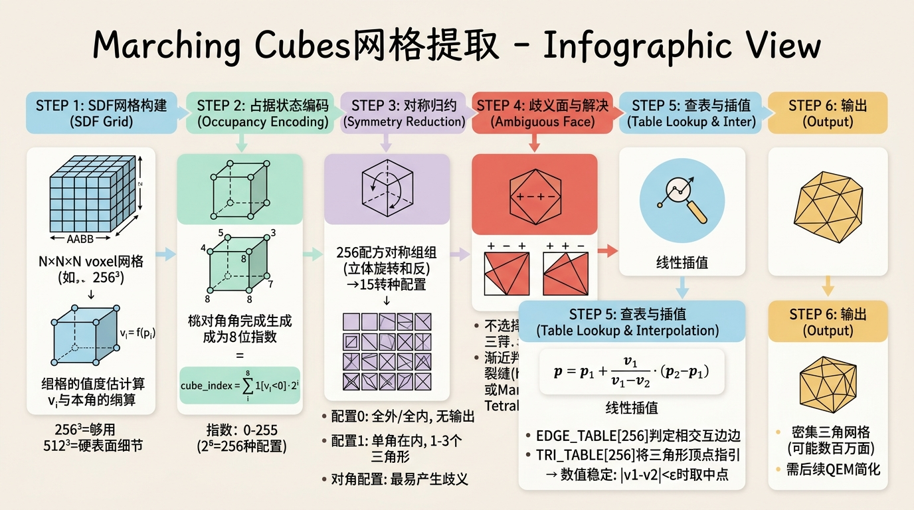
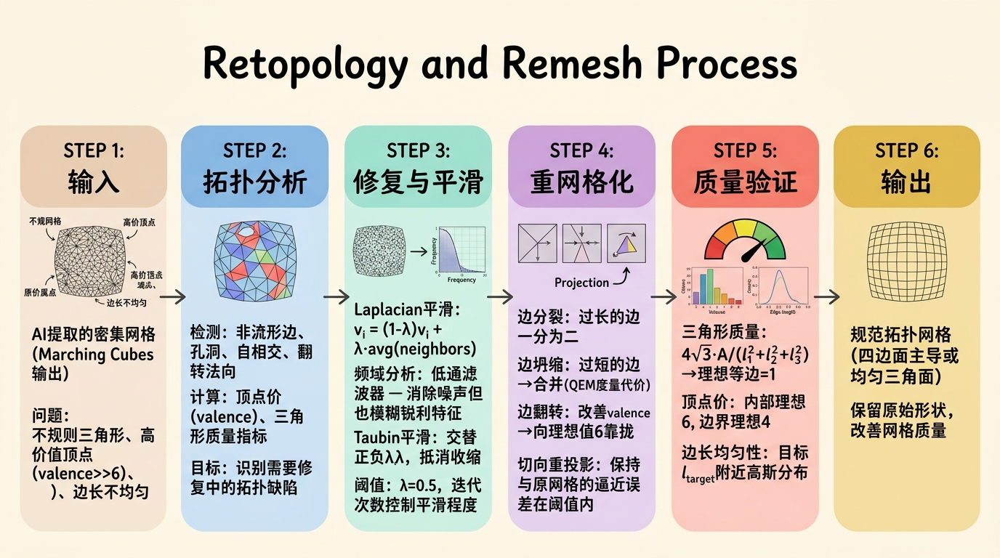
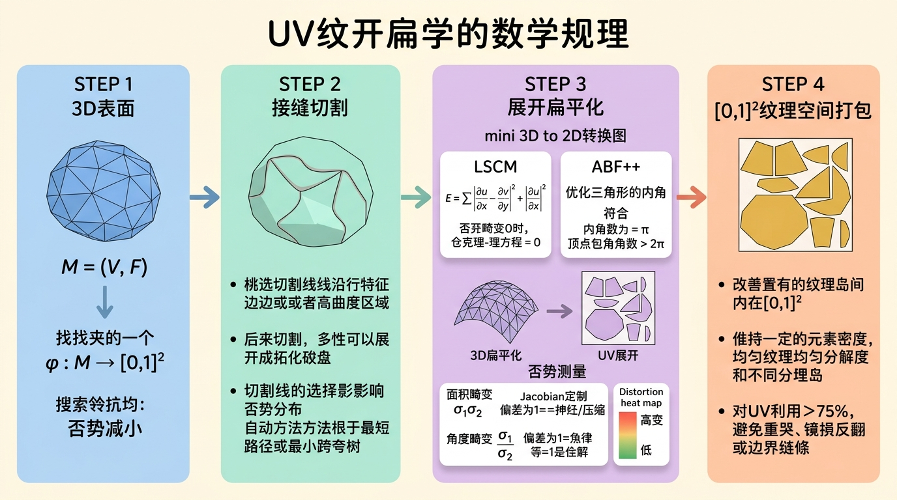
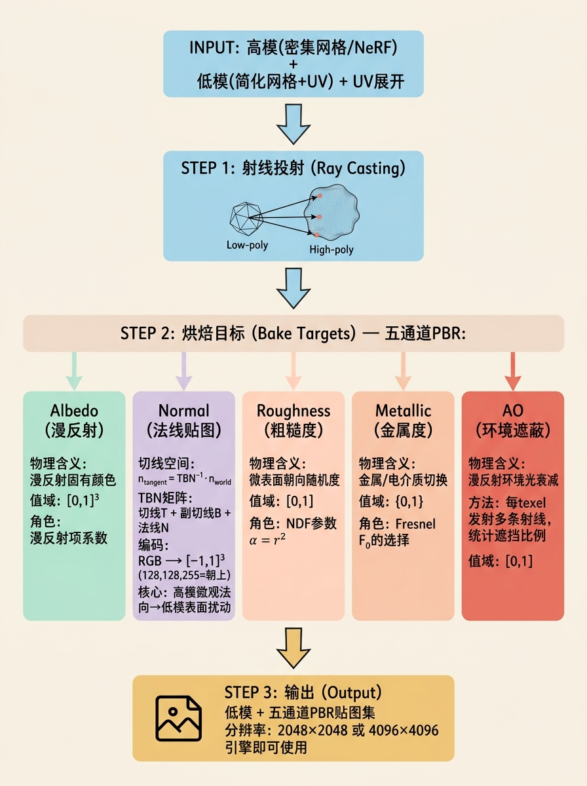
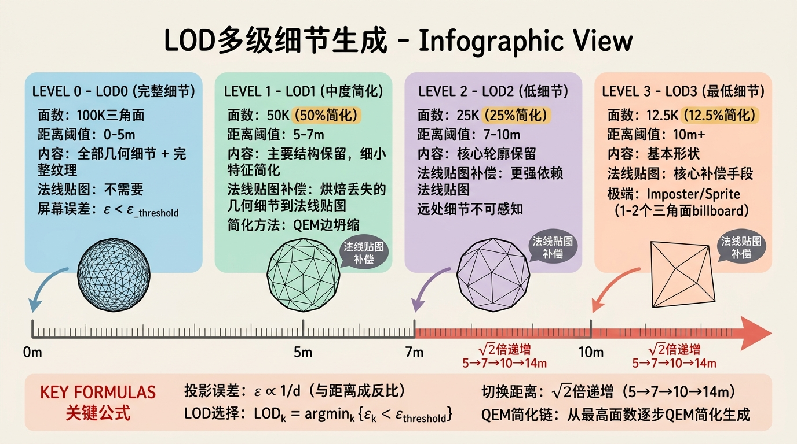
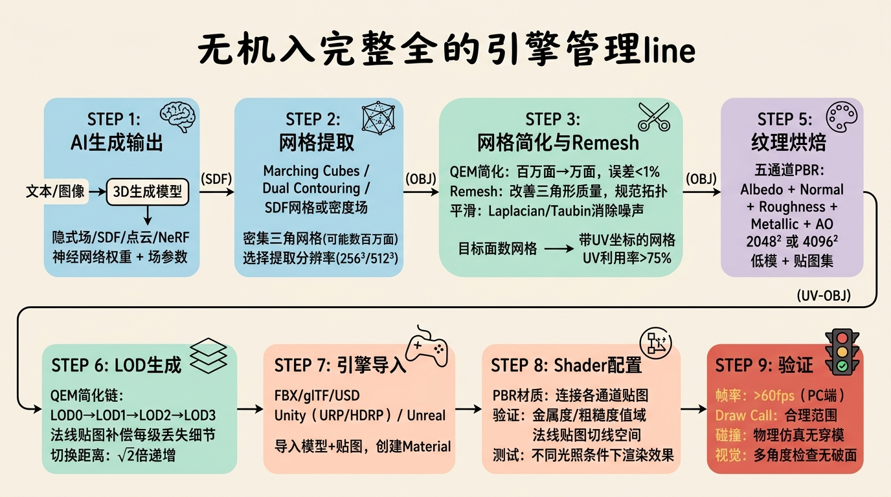

# 第四部分：核心篇（下）——从生成到可用资产：后处理、优化与管线

## 工程级扩展版

---

## 4.1 网格提取与优化

AI生成的三维表示（隐式场、点云、NeRF密度场）必须经过网格提取和优化才能转化为游戏引擎或影视管线中的可用资产。本节从算法原理出发，结合生产管线中的实际问题，给出可直接落地的技术方案。

### 4.1.1 Marching Cubes的完全算法详解



Marching Cubes（MC）是隐式曲面网格提取的事实标准算法。在AI生成管线中，它通常作用于神经隐式场（如NeRF的密度场、NeuS的SDF或Instant NGP的占用网格）的离散采样结果，将其转化为可渲染的三角网格。

#### 问题设置与算法流程

给定隐式场 $f: \mathbb{R}^3 \rightarrow \mathbb{R}$，目标是提取零水平集 $S = \{ x \in \mathbb{R}^3 \mid f(x) = 0 \}$ 的三角网格近似。在实际工程中，$f$ 可能是神经网络的输出，也可能是经过后处理的符号距离场（SDF）。

**完整算法步骤：**

1. **体素化空间**：在感兴趣区域（AABB）内建立规则体素网格，分辨率通常为 $N \times N \times N$（如 $256^3$ 或 $512^3$）。分辨率的选择是面数与精度的直接权衡：$256^3$ 对人物角色可能足够，但机械硬表面细节需要 $512^3$ 甚至更高。

2. **角点采样**：对每个体素的8个角点计算场值 $v_i = f(p_i)$。若使用神经网络，此步骤需要 $O(N^3)$ 次前向传播，是主要瓶颈。工程上常使用稀疏采样或缓存策略（如Instant NGP的哈希网格直接解码）。

3. **占据状态编码**：将每个角点的符号与阈值比较（通常为0），生成8位索引：
   $$\text{cube\_index} = \sum_{i=0}^{7} \mathbb{1}[v_i < 0] \cdot 2^i$$
   索引范围为0到255。

4. **查表获取边配置**：使用预计算的 `EDGE_TABLE[256]` 确定该体素内哪些边与零水平集相交。每条体素边用一个比特位表示，12条边对应12个比特。

5. **线性插值计算交点**：对标记为相交的边，计算精确交点位置。

6. **查表获取三角剖分**：使用 `TRI_TABLE[256]` 获取三角形的顶点索引列表，每个三角形引用第5步计算的边交点。

**线性插值公式：**
若边两端点为 $p_1, p_2$，场值为 $v_1 = f(p_1), v_2 = f(p_2)$，假设 $v_1$ 和 $v_2$ 异号，则交点：
$$p = p_1 + \frac{v_1}{v_1 - v_2}(p_2 - p_1)$$

当 $|v_1 - v_2|$ 极小时（几乎平场的边），数值稳定性会下降。工程上应加入epsilon检查：
```python
if abs(v1 - v2) < 1e-6:
    p = (p1 + p2) * 0.5
else:
    t = v1 / (v1 - v2)
    p = p1 + t * (p2 - p1)
```

#### 15种拓扑配置与歧义面问题

256种角点状态通过立方体对称群（旋转和反射）以及符号翻转可归约为15种基础配置。这是Lorensen和Cline原始论文的核心结果。

**15种配置的工程含义：**
- 配置0（索引0）：全部在外或全部在内，无输出。
- 配置1（索引1）：仅一个角点在内，产生1-3个三角形，形成局部锥形。
- 配置2（索引3）：两个相邻角点在内，产生2-4个三角形。
- 配置3（索引129）：对角顶点在内，这是最容易产生歧义的情况。

**歧义面（Ambiguous Face）问题：**
当一个面的四个角点呈现"交替符号"模式（+ - + - 或 - + - +）时，该面存在两种合法的三角剖分方式：
- 剖分方式A：连接对角顶点对1
- 剖分方式B：连接对角顶点对2

若相邻体素在共享歧义面上选择不一致的剖分方式，零水平集将出现裂缝（hole）。在AI生成的高分辨率场中，这种情况频繁发生。

**工程解决方案：**

1. **渐近判定器（Asymptotic Decider）**：
   对歧义面，计算面内部鞍点（saddle point）的场值：
   $$v_{saddle} = \frac{v_{00}v_{11} - v_{01}v_{10}}{v_{00} + v_{11} - v_{01} - v_{10}}$$
   其中 $v_{ij}$ 是面四个角点的双线性插值系数。根据 $v_{saddle}$ 的符号决定剖分方式。此方法保证相邻体素在共享面上的一致性。

2. **Marching Tetrahedra（MT）**：
   将每个立方体预先剖分为5个或6个四面体（避免引入Steiner点），在每个四面体内执行线性等值面提取。四面体的等值面提取只有 $2^4 = 16$ 种配置，且不存在歧义面问题。代价是生成更多的三角形和更细的切片。

**完整伪代码实现：**

```python
import numpy as np

EDGE_TABLE = [...]  # 256个12-bit整数值
TRI_TABLE = [...]   # 256 x 16数组，-1终止

def marching_cubes(sdf_grid, grid_origin, voxel_size, threshold=0.0):
    vertices = []
    faces = []
    vertex_cache = {}

    dims = sdf_grid.shape
    for z in range(dims[2] - 1):
        for y in range(dims[1] - 1):
            for x in range(dims[0] - 1):
                # 采样8角点SDF值
                cube_vals = np.zeros(8)
                for i in range(8):
                    ix = x + (i & 1)
                    iy = y + ((i >> 1) & 1)
                    iz = z + ((i >> 2) & 1)
                    cube_vals[i] = sdf_grid[ix, iy, iz]

                cube_index = 0
                for i in range(8):
                    if cube_vals[i] < threshold:
                        cube_index |= (1 << i)

                if cube_index == 0 or cube_index == 255:
                    continue

                edges = EDGE_TABLE[cube_index]
                if edges == 0:
                    continue

                # 计算12条边的交点
                vert_list = [None] * 12
                for i in range(12):
                    if edges & (1 << i):
                        a, b = EDGE_VERTICES[i]
                        va, vb = cube_vals[a], cube_vals[b]
                        p1 = np.array([
                            grid_origin[0] + (x + (a & 1)) * voxel_size,
                            grid_origin[1] + (y + ((a >> 1) & 1)) * voxel_size,
                            grid_origin[2] + (z + ((a >> 2) & 1)) * voxel_size
                        ])
                        p2 = np.array([
                            grid_origin[0] + (x + (b & 1)) * voxel_size,
                            grid_origin[1] + (y + ((b >> 1) & 1)) * voxel_size,
                            grid_origin[2] + (z + ((b >> 2) & 1)) * voxel_size
                        ])
                        if abs(va - vb) < 1e-6:
                            vert_list[i] = (p1 + p2) * 0.5
                        else:
                            t = va / (va - vb)
                            vert_list[i] = p1 + t * (p2 - p1)

                # 查表生成三角形
                tri_table_row = TRI_TABLE[cube_index]
                for i in range(0, 16, 3):
                    if tri_table_row[i] == -1:
                        break
                    v0 = vert_list[tri_table_row[i]]
                    v1 = vert_list[tri_table_row[i+1]]
                    v2 = vert_list[tri_table_row[i+2]]
                    idx0 = get_or_create_vertex(v0, vertex_cache, vertices)
                    idx1 = get_or_create_vertex(v1, vertex_cache, vertices)
                    idx2 = get_or_create_vertex(v2, vertex_cache, vertices)
                    faces.append([idx0, idx1, idx2])

    return np.array(vertices), np.array(faces)
```

**性能优化**：生产环境中，使用 `skimage.measure.marching_cubes`（基于 Lewiner 等2003年的改进实现，解决了歧义面问题）或 `mcubes` 库（C++实现，支持GPU加速）。对于神经网络隐式场，可用 kaolin 的 `kaolin.ops.conversions.sdf_to_mesh` 直接从SDF网格提取，无需手动实现。

### 4.1.2 Dual Contouring与QEF

**Dual Contouring（DC）** 由 Ju 等人于 SIGGRAPH 2002 提出，解决了 Marching Cubes 的两个根本缺陷：1）无法保留锐利特征（sharp features）；2）歧义面导致的拓扑不一致。

**核心思想：对偶网格构造**

MC 在体素**边**上放置顶点，DC 在体素**内部**放置顶点。具体地：

1. **识别有符号变化的体素**：如果一个体素的8个角点不全同号，说明表面穿过该体素；
2. **收集表面-体素交点**：遍历该体素的12条边，找到所有符号变化的边，通过线性插值计算交点 $\mathbf{p}_i$ 和对应法向 $\mathbf{n}_i$；
3. **QEF最小化**：在该体素内部找到一个最优顶点 $\mathbf{x}^*$，使得它到所有切平面的距离平方和最小。

**二次误差函数（Quadratic Error Function, QEF）**：

$$\text{QEF}(\mathbf{x}) = \sum_{i} \left( (\mathbf{x} - \mathbf{p}_i)^T \mathbf{n}_i \right)^2$$

展开为矩阵形式：

$$\text{QEF}(\mathbf{x}) = \mathbf{x}^T A \mathbf{x} - 2\mathbf{b}^T \mathbf{x} + c$$

其中 $A = \sum_i \mathbf{n}_i \mathbf{n}_i^T$，$\mathbf{b} = \sum_i (\mathbf{p}_i^T \mathbf{n}_i) \mathbf{n}_i$，$c = \sum_i (\mathbf{p}_i^T \mathbf{n}_i)^2$。

最小值在 $\nabla \text{QEF} = 0$ 处取到，即 $A\mathbf{x}^* = \mathbf{b}$，解为 $\mathbf{x}^* = A^{-1}\mathbf{b}$（当 $A$ 可逆时）。

**为什么QEF能保留锐利特征？**

锐利边（如立方体的棱）处，相邻表面的法向突变。MC在这些位置会将顶点放在边的中间，导致棱角被"切掉"。DC通过QEF将体素内的顶点放在最接近所有切平面的公共交点处——如果多条切平面交于一点（锐利特征点），QEF自然将该顶点推到特征点位置。

**对偶连接**：DC的网格连接关系基于体素的邻接关系。如果两个相邻体素共享一条有符号变化的边，则连接它们的QEF顶点。这种对偶连接天然保证流形性（无裂缝），因为相邻体素必然在共享面上达成一致。

**与MC的对比**：

| 特性 | Marching Cubes | Dual Contouring |
|------|---------------|-----------------|
| 顶点位置 | 边上（线性插值） | 体素内部（QEF优化） |
| 锐利特征保留 | 差（平滑化） | 好（QEF收敛到特征点） |
| 拓扑一致性 | 需要渐近判定器 | 天然一致 |
| 实现复杂度 | 低（查表法） | 中（需解QEF） |
| 输出网格质量 | 平滑但过于密集 | 自适应，特征清晰 |

### 4.1.3 QEM网格简化

提取的网格通常面数过多（$256^3$ 的MC可产生数百万三角面），必须简化到目标面数。**Quadric Error Metrics（QEM）** 由 Garland 和 Heckbert 于 SIGGRAPH 1997 提出，是网格简化的金标准。

**核心思想：边坍缩（Edge Collapse）**

每次操作选择一条边 $e = (v_i, v_j)$，将两端点合并为新顶点 $\bar{v}$，删除与该边相邻的两个三角形，更新邻接关系。关键问题是如何选择坍缩顺序和计算新顶点位置。

**二次误差度量**：

定义每个顶点 $v$ 的误差矩阵 $Q_v$，它是所有经过 $v$ 的平面方程的二次形式之和：

$$Q_v = \sum_{f \ni v} \mathbf{p}_f \mathbf{p}_f^T$$

其中 $\mathbf{p}_f = [a, b, c, d]^T$ 是平面 $ax + by + cz + d = 0$ 的系数，满足 $\|\mathbf{n}\| = 1$。顶点 $v = [x, y, z, 1]^T$ 到平面的距离为 $\mathbf{p}_f^T v$，二次误差为：

$$E(v) = v^T Q_v v = \sum_{f \ni v} (\mathbf{p}_f^T v)^2$$

**边坍缩代价**：

合并边 $e = (v_i, v_j)$ 后，新顶点 $\bar{v}$ 的误差矩阵为 $Q_{\bar{v}} = Q_{v_i} + Q_{v_j}$，代价为：

$$\text{cost}(e) = \bar{v}^T (Q_{v_i} + Q_{v_j}) \bar{v}$$

新顶点位置取使代价最小的 $\bar{v}^*$：

$$\bar{v}^* = (Q_{v_i} + Q_{v_j})^{-1} \begin{bmatrix} 0 \\ 0 \\ 0 \\ 1 \end{bmatrix}$$

当矩阵不可逆时，退化为取边中点或端点中代价较小者。

**算法流程**：

```python
def qem_simplify(mesh, target_faces):
    # 1. 计算每个顶点的Q矩阵
    Q = compute_quadric_matrices(mesh)

    # 2. 计算所有有效边的坍缩代价，建优先队列
    heap = MinHeap()
    for edge in mesh.edges:
        cost, new_pos = compute_collapse_cost(edge, Q)
        heap.push((cost, edge, new_pos))

    # 3. 迭代坍缩
    while mesh.num_faces > target_faces:
        cost, edge, new_pos = heap.pop()
        if not is_valid_edge(edge, mesh):
            continue
        collapse_edge(mesh, edge, new_pos)
        # 更新受影响边的代价
        for neighbor_edge in get_affected_edges(new_vertex):
            new_cost, new_p = compute_collapse_cost(neighbor_edge, Q)
            heap.push((new_cost, neighbor_edge, new_p))

    return mesh
```

**Ablation意识**：若去掉QEM而使用均匀边坍缩（随机选择边），简化后的网格在曲率高的区域（如鼻尖、指尖）会丢失细节，因为所有区域被同等对待。QEM的优势在于自动在平坦区域大幅简化（因为那里 $Q$ 矩阵的值小），在曲率高的区域保守简化。

**时间复杂度**：建堆 $O(E \log E)$，每次坍缩 $O(\log E)$，总 $O(k \log E)$，其中 $k$ 是坍缩次数。对百万面网格简化到万面，通常在1秒内完成。

---

## 4.2 网格平滑与Remeshing

### 4.2.1 Laplacian平滑的频域分析

**定义层**：Laplacian平滑是迭代地将每个顶点移动到其邻域质心的过程：

$$v_i^{(t+1)} = (1 - \lambda) v_i^{(t)} + \lambda \frac{1}{|\mathcal{N}(i)|} \sum_{j \in \mathcal{N}(i)} v_j^{(t)}$$

其中 $\lambda \in (0, 1]$ 是平滑因子，$\mathcal{N}(i)$ 是顶点 $v_i$ 的1-邻域。

**原理层——频域分析**：

将网格视为图信号处理的离散流形，Laplacian平滑等价于对网格的几何信号进行低通滤波。定义**图Laplacian矩阵** $L = D - A$，其中 $D$ 是度矩阵，$A$ 是邻接矩阵。归一化形式 $L_{norm} = D^{-1/2} L D^{-1/2}$。

Laplacian平滑一步可写为矩阵形式：

$$V^{(t+1)} = (I - \lambda D^{-1} L) V^{(t)}$$

矩阵 $I - \lambda D^{-1} L$ 的特征值在 $[1 - 2\lambda, 1]$ 范围内。高频特征向量（对应 $L$ 的大特征值）被衰减，低频特征向量被保留。因此，Laplacian平滑是**各向同性低通滤波器**——它在消除噪声的同时也模糊了锐利特征。

**Ablation意识**：若 $\lambda$ 过大或迭代过多，网格会收缩（shrinkage）——所有顶点向质心漂移。解决方法包括：
- **Taubin平滑**：交替使用正负 $\lambda$，$(\lambda_+, \lambda_-) = (0.5, -0.53)$，正步平滑，负步膨胀，抵消收缩；
- **HC平滑**：记录每步的位移，反向补偿收缩分量。

### 4.2.2 各向异性Remeshing



**为什么需要Remeshing？**

AI提取的网格（尤其通过Marching Cubes）通常是规则但低质量的：三角形形状不理想（等腰/等边三角形不足），边长不均匀，存在高价顶点（valence >> 6）。Remeshing的目标是重新构造一个与原网格近似但具有理想拓扑性质的网格。

**关键质量指标**：

1. **三角形质量**：$\frac{4\sqrt{3} A}{l_1^2 + l_2^2 + l_3^2}$，其中 $A$ 是面积，$l_i$ 是边长。理想等边三角形为1；
2. **顶点价（Valence）**：内部顶点理想为6，边界为4；
3. **边长均匀性**：目标边长 $l_{target}$ 附近的高斯分布。

**常用Remeshing算法**：

- **Isotropic Explicit Remeshing**（Botsch & Kobbelt, 2004）：迭代执行边分裂（过长的边）、边坍缩（过短的边）、边翻转（改善valence）、顶点切向重投影。每步保持与原网格的逼近误差在阈值内；
- **Instant Meshes**（Jakob et al., 2015）：通过联合优化位置场和方向场生成纯四边网格，速度快且输出质量高。

---

## 4.3 UV展开与纹理管线

### 4.3.1 UV展开的数学原理



**定义层**：UV展开是将三维网格表面映射到二维纹理空间 $[0,1]^2$ 的过程。数学上，这是在流形 $\mathcal{M}$ 上寻找一个映射 $\phi: \mathcal{M} \rightarrow [0,1]^2$，使得映射引入的畸变尽可能小。

**原理层——畸变的数学描述**：

映射 $\phi$ 在每个点处由其Jacobian矩阵 $J_\phi \in \mathbb{R}^{2 \times 2}$ 描述。设 $J_\phi^T J_\phi$ 的特征值为 $\sigma_1^2 \geq \sigma_2^2$（即映射的奇异值的平方），则：

- **面积畸变**：$\sigma_1 \sigma_2$（Jacobian行列式的绝对值），偏离1表示面积拉伸或压缩；
- **角度畸变**（conformal distortion）：$\sigma_1 / \sigma_2$，偏离1表示角度被扭曲。保角映射（conformal map）满足 $\sigma_1 = \sigma_2$；
- **整体畸变量度**：$\int_\mathcal{M} (\sigma_1/\sigma_2 + \sigma_2/\sigma_1 - 2) dA$，为零当且仅当处处保角。

**LSCM（Least Squares Conformal Maps）**：

LSCM 最小化角度畸变的全局度量：

$$E_{LSCM} = \sum_{t \in F} \left| \frac{\partial u}{\partial x} - \frac{\partial v}{\partial y} \right|^2 + \left| \frac{\partial u}{\partial y} + \frac{\partial v}{\partial x} \right|^2$$

其中 $(u,v)$ 是纹理坐标，$(x,y)$ 是局部切平面坐标。Cauchy-Riemann方程 $\frac{\partial u}{\partial x} = \frac{\partial v}{\partial y}$，$\frac{\partial u}{\partial y} = -\frac{\partial v}{\partial x}$ 满足时畸变为零。LSCM求解这些方程的最小二乘近似。

**ABF++（Angle Based Flattening）**：

ABF++ 直接优化三角形内角，约束为：
- 三角形内角和 = $\pi$；
- 围绕内部顶点的角之和 = $2\pi$；
- 围绕边界顶点的角之和可变。

优化使用拉格朗日乘子和稀疏线性系统求解，通常比LSCM产生更低畸变的展开。

### 4.3.2 纹理烘焙管线



AI生成的材质通常以MLP或顶点色的形式存在，必须转换为标准纹理贴图才能被游戏引擎使用。

**烘焙流程**：

1. **输入**：高模（AI生成的NeRF/SDF提取的密集网格）+ 低模（简化后的目标网格）+ UV展开；
2. **射线投射**：对低模每个UV像素，从纹理空间反投影到三维表面，沿法线方向投射射线到高模，获取命中点的材质属性；
3. **属性编码**：将命中点的法向、材质、AO等写入对应的纹理通道。

**关键烘焙类型**：

- **法线烘焙（Normal Baking）**：将高模表面法向编码到切线空间法线贴图。切线空间法向 $\mathbf{n}_{tangent} = TBN^{-1} \cdot \mathbf{n}_{world}$，其中TBN矩阵由切线、副切线、法向构成；
- **AO烘焙**：对每个texel发射多条射线，统计被遮挡比例，写入AO贴图；
- **曲率烘焙**：将高模的局部曲率（平均曲率 $H = (\kappa_1 + \kappa_2)/2$）写入贴图，用于磨损/边缘高光效果。

**PBR贴图管线**：

在SDS-based 3D生成中（如Fantasia3D），材质参数被显式分解：

| 通道 | 物理含义 | 值域 | 着色器角色 |
|------|---------|------|-----------|
| Albedo | 漫反射固有颜色 | [0,1]³ | 漫反射项系数 |
| Normal | 表面微观法向扰动 | [0,1]³→[-1,1]³ | 光照计算中的法向 |
| Roughness | 微表面朝向随机度 | [0,1] | NDF $D(h)$ 的参数 $\alpha = r^2$ |
| Metallic | 金属/电介质切换 | {0,1} | Fresnel $F_0$ 的选择 |
| AO | 环境光遮蔽 | [0,1] | 漫反射环境光的衰减 |

---

## 4.4 LOD生成与管线自动化

### 4.4.1 LOD（Level of Detail）策略



**定义层**：LOD是为同一3D资产创建多个细节级别版本的技术，根据物体到相机的距离选择渲染哪个版本。

**原理层**：

设物体到相机的距离为 $d$，屏幕投影误差为 $\epsilon$。根据透视投影，$\epsilon \propto 1/d$。当 $\epsilon$ 小于一个像素时，进一步细节不可感知。LOD选择策略：

$$\text{LOD}_k = \arg\min_k \{ \epsilon_k < \epsilon_{\text{threshold}} \}$$

其中 $\epsilon_k$ 是第 $k$ 级LOD的最大投影误差，$\epsilon_{\text{threshold}}$ 通常取1-2像素。

**LOD生成方法**：

1. **QEM简化链**：从最高面数版本开始，逐步QEM简化生成一系列LOD；
2. **法线贴图补偿**：每降低一个LOD级别，将丢失的几何细节烘焙到法线贴图中，保持视觉保真度；
3. **Imposter/Sprite**：最低LOD用预渲染的billboard sprite替代，仅1-2个三角形。

### 4.4.2 自动化管线



AI生成3D资产的完整生产管线：

```
文本/图像输入
    ↓
3D生成模型（DreamFusion/Magic3D/3DGS）
    ↓
隐式场/SDF/点云
    ↓
[Marching Cubes / Dual Contouring] → 密集三角网格
    ↓
[QEM简化] → 目标面数网格
    ↓
[Laplacian平滑 / Remeshing] → 规范拓扑网格
    ↓
[LSCM/ABF++ UV展开] → 带UV坐标的网格
    ↓
[PBR纹理烘焙] → Albedo + Normal + Roughness + Metallic + AO
    ↓
[QEM LOD链] → LOD0 (高) → LOD1 → LOD2 → LOD3 (低)
    ↓
游戏引擎 / 实时渲染器
```

**关键量化指标**：
- 网格简化：百万面→万面，误差 < 1%（QEM度量）；
- UV利用率：> 75% 的纹理空间被有效使用；
- LOD切换距离：$\sqrt{2}$ 倍递增（LOD0: 0-5m, LOD1: 5-7m, LOD2: 7-10m, ...）；
- 烘焙分辨率：通常 2048×2048 或 4096×4096（PBR各通道独立）。

---

## 本章关键思考题

**1.** Marching Cubes的15种拓扑配置是如何从256种状态归约而来的？写出归约的两个操作。  
*提示：立方体对称群（48种对称）和符号翻转（补集操作）。*

**2.** Dual Contouring相比Marching Cubes的两大优势是什么？QEF的物理直觉是什么？  
*提示：保留锐利特征 + 拓扑一致性；QEF找到最接近所有切平面的点。*

**3.** QEM简化的核心假设是什么？为什么它在平坦区域简化多、在曲率高处简化少？  
*提示：假设顶点到平面的距离是好的误差度量；曲率高的地方Q值大，代价大。*

**4.** Laplacian平滑为什么会导致收缩？Taubin平滑如何解决？  
*提示：低通滤波消除高频也消除DC偏移；正负λ交替抵消收缩。*

**5.** LSCM优化的目标是什么？Cauchy-Riemann方程的几何含义是什么？  
*提示：最小化角度畸变；CR方程 = 保角映射条件。*

**6.** 法线贴图烘焙中，切线空间法向如何从世界空间法向计算？  
*提示：$\mathbf{n}_{tangent} = TBN^{-1} \cdot \mathbf{n}_{world}$，TBN是正交化后的局部坐标系。*

**7.** 从SDS生成到可用游戏资产，完整管线包含哪些步骤？每步的输入输出是什么？  
*提示：生成→提取→简化→Remesh→UV→烘焙→LOD。*

---

## 4.5 推理优化与部署

3D生成模型从研究原型到生产可用服务的跨越，不仅需要前述的网格提取与纹理管线，更需要系统化的推理优化与部署工程。本节从量化基础到服务架构，再到端侧落地，给出完整的推理优化知识体系。

### 4.5.1 模型量化基础

#### PTQ与QAT范式

- **训练后量化（Post-Training Quantization, PTQ）**：在已训练的浮点模型上直接量化，无需重新训练。优势是零训练成本，但对低比特（INT4及以下）精度损失显著。
- **量化感知训练（Quantization-Aware Training, QAT）**：在训练过程中插入伪量化节点（fake quantization），模拟量化误差，使模型学习适应低精度表示。代价是需要完整训练流程，但在INT4/INT8混合精度下能显著恢复精度。

#### 量化数学原理

均匀仿射量化将浮点值 $x \in [\alpha, \beta]$ 映射到整数 $q \in \{0, 1, \ldots, 2^b - 1\}$：

$$q = \text{round}\left(\frac{x - z}{s}\right), \quad s = \frac{\beta - \alpha}{2^b - 1}, \quad z = \text{round}\left(-\frac{\alpha}{s}\right)$$

其中 $s$ 为缩放因子（scale），$z$ 为零点（zero point），$b$ 为比特宽度。反量化为 $\hat{x} = s \cdot (q - z)$。INT8量化的相对误差约 $0.4\%$；INT4 的相对误差可达 $6\%$ 以上。

#### GPTQ与AWQ权重量化

**GPTQ**基于最优脑手术的逐层量化框架：对权重矩阵 $W$ 按列量化，每量化一个权重 $w_i$，通过Hessian矩阵计算对剩余权重的最优补偿，保证逐层量化后的输出重构误差近似最小。

**AWQ**（Activation-Aware Weight Quantization）的核心观察：并非所有权重同等重要——激活值大的通道对应的权重对量化更敏感。AWQ对每个通道的权重引入可学习的缩放因子，由该通道激活值的幅度决定重要性，无需反向传播，仅需少量校准数据。

### 4.5.2 推理引擎与图优化

#### ONNX Runtime

核心优化发生在图级别：

1. **算子融合（Operator Fusion）**：将多个连续算子合并为单一算子执行，减少中间张量的内存读写。典型模式：Conv + BN + ReLU → FusedConvBNReLU，在GPU上可提速20-40%。
2. **常量折叠（Constant Folding）**：在图编译阶段预计算所有输入为常量的子图。
3. **内存优化**：通过静态内存规划和就地操作减少峰值显存占用，对3D生成模型中频繁的中间特征图可将峰值显存降低30-50%。

#### TensorRT

NVIDIA TensorRT进一步引入硬件感知优化：

- **Kernel Auto-Tuning**：对每个算子遍历多种实现策略，选择最快的一个。
- **精度校准**：自动识别网络中对精度敏感的层（保持FP16/FP32），对不敏感层降精度到INT8。
- **动态形状优化**：对可变输入尺寸，为不同尺寸范围预编译最优kernel。

对于扩散模型，TensorRT通过将UNet的50步去噪循环编译为单一引擎，在SDXL上可实现2-3倍端到端加速。

### 4.5.3 扩散模型加速

#### Latent Consistency Model（LCM）

LCM基于一致性模型的思想，在潜空间中训练一个一致性函数 $f_\theta$，使其将PF-ODE轨迹上的任意点映射到同一个原点：

$$f_\theta(x_t, t) \approx f_\theta(x_{t'}, t'), \quad \forall t, t' \in [\epsilon, T]$$

LCM将SD 1.5的推理从50步压缩至4步，单步即可从噪声跳转到接近干净的潜表示。数学保证来源于一致性函数的自一致性约束——ODE轨迹上所有点收敛到同一不动点。

#### SDXL Turbo与对抗蒸馏

将对抗训练引入蒸馏过程：$\mathcal{L}_{ADD} = \mathcal{L}_{distill} + \lambda \mathcal{L}_{adv}$。蒸馏损失使学生网络少步输出逼近教师网络多步输出，对抗损失通过判别器确保单步生成在高频细节上与真实图像不可区分。

| 方法 | 原始步数 | 蒸馏后步数 | FID变化 | 加速比 |
|------|---------|-----------|---------|-------|
| DDIM (SD 1.5) | 50 | — | 基准 | 1× |
| LCM (SD 1.5) | 50 | 4 | +1.2 FID | ~10× |
| SDXL Turbo | 50 | 1-4 | +2.5 FID (1步) | ~12-50× |

对3D生成管线（如DreamFusion的SDS优化循环），将UNet推理从50步降至4步，SDS的总优化时间可从小时级压缩至分钟级。

### 4.5.4 3D生成模型的部署挑战

#### NeRF推理的MLP瓶颈

一个 $800 \times 800$ 像素的帧需要约 $5 \times 10^7$ 次MLP推理。**TinyMLP策略**：将8层256宽度MLP替换为2-4层64宽度的轻量网络，配合位置编码频率截断（$L$ 从10降至4-6），结合Instant NGP哈希编码可将单帧推理从秒级降至10-30ms。

#### 3DGS的实时渲染优化

- **排序算法优化**：将画面划分为 $16 \times 16$ 像素的tile，每个tile独立执行并行基数排序 $O(n)$。
- **Tile-based并行**：每个tile由一个CUDA线程块处理，排序后从近到远遍历高斯进行alpha混合，当累积alpha超过$1-\epsilon$时提前终止。百万高斯场景下RTX 3090可达100+ FPS。
- **从训练权重到引擎资产**：协方差存储为4元旋转四元数+3元缩放向量，球谐系数从3阶降至1阶，移除低不透明度高斯，百万高斯场景仅需约50-80MB。

### 4.5.5 服务化架构

NVIDIA Triton是生产环境中部署3D生成模型的标准推理服务框架。**动态批处理（Dynamic Batching）**将一个时间窗口 $\tau$ 内到达的多个请求合并为一个大batch一次执行，batch=4时GPU利用率可达85%。模型版本管理支持A/B测试、灰度发布和快速回滚。

### 4.5.6 端侧部署

- **移动端限制**：显存2-6GB、带宽50-100 GB/s，限制高斯数量或MLP大小。
- **WebGPU 3DGS**：Compute Shader实现GPU端排序，30万高斯排序约1-2ms，中等场景在集显笔记本上可达30-60 FPS。
- **模型压缩管线**：高斯剪枝50-70%→球隐降阶→参数量化→码本压缩，百万高斯场景可从300MB压缩至20-40MB。MobileNeRF将MLP烘焙为纹理数组，用Mesh + Texture标准管线在移动端实现>100FPS渲染。

---

> **结语**
>
> 本章聚焦于将AI生成的三维表示转化为生产可用资产的完整管线。从Marching Cubes的体素-网格转换，到QEM简化的智能降面，到UV展开的畸变最小化，到PBR纹理烘焙——每一步都不是简单的格式转换，而是涉及深层几何与优化理论的工程决策。理解这些步骤的原理，才能在遇到管线输出质量不达标时，准确定位问题环节并调整参数。
>
> 在下一部分中，我们将进入评估与验证篇，学习如何定量衡量3D生成模型的质量。


---