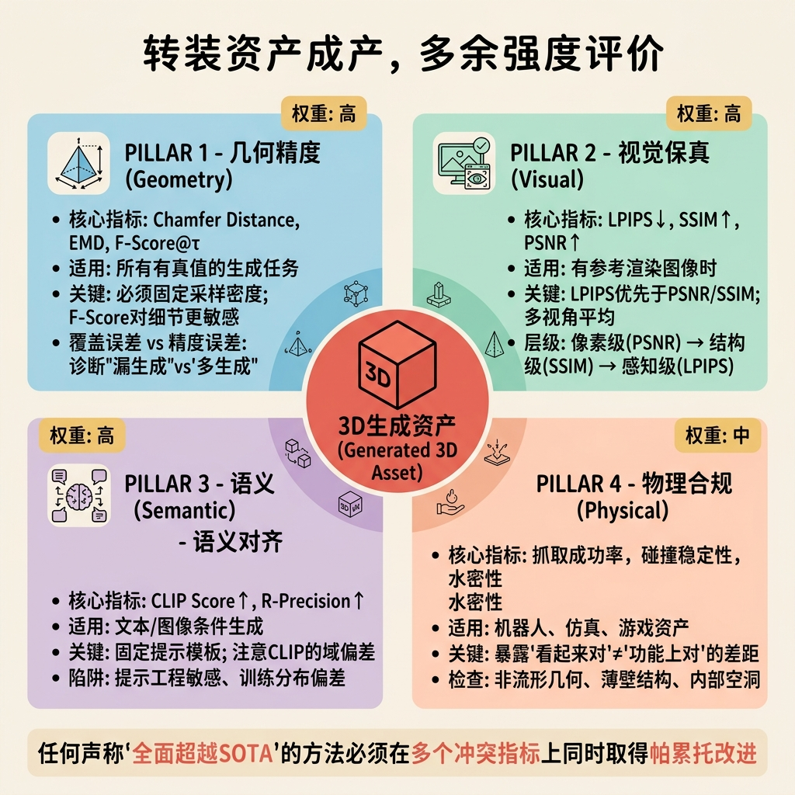
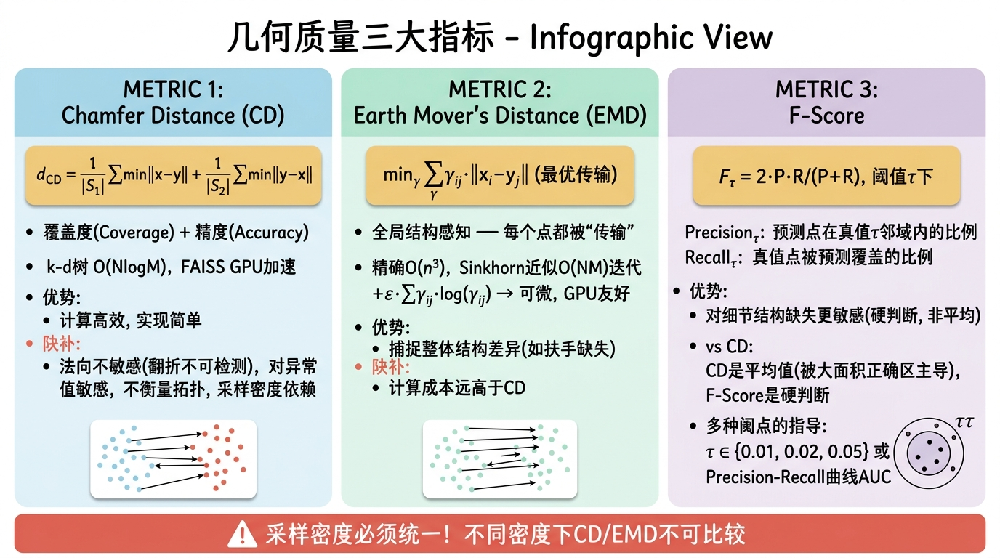
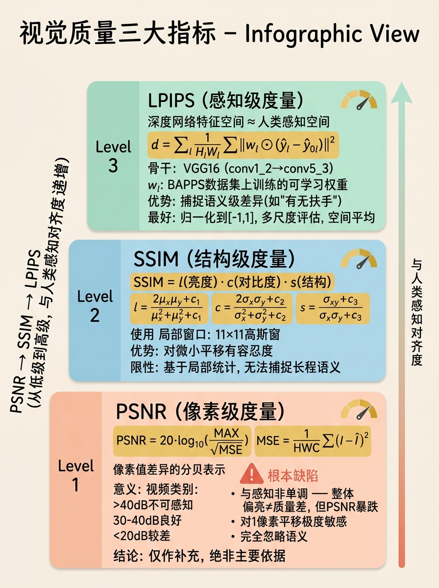
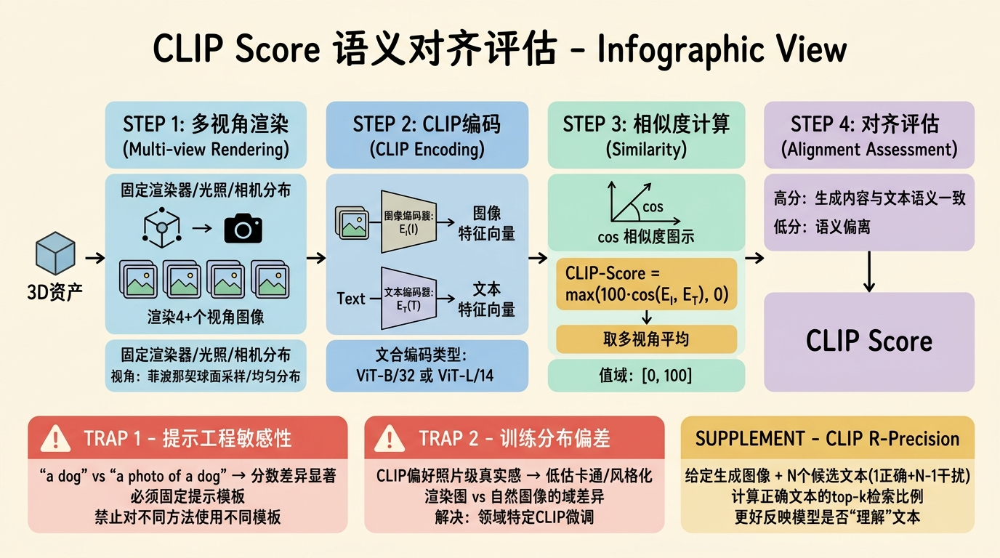
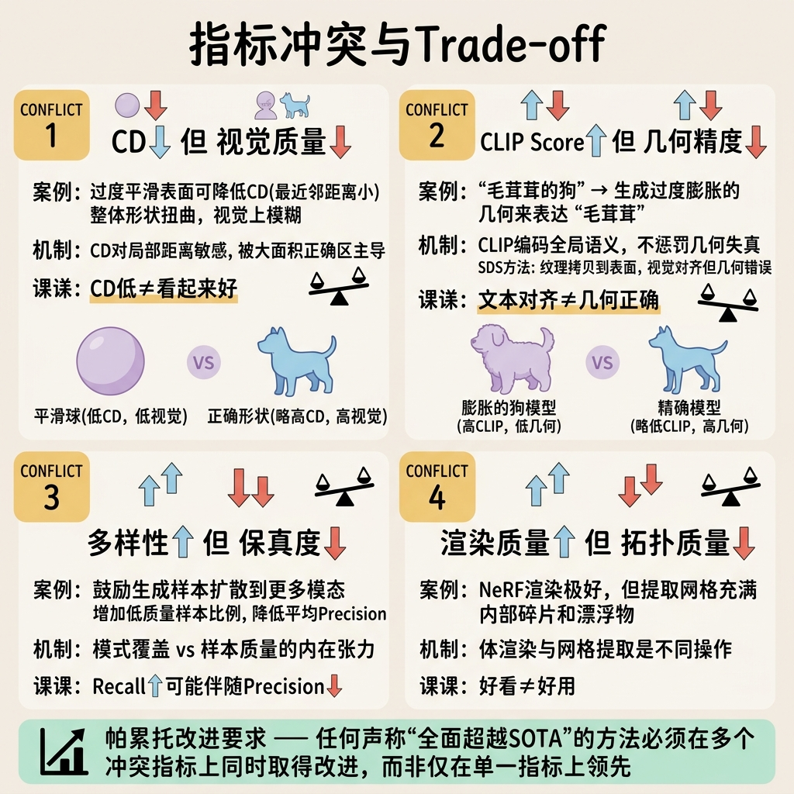
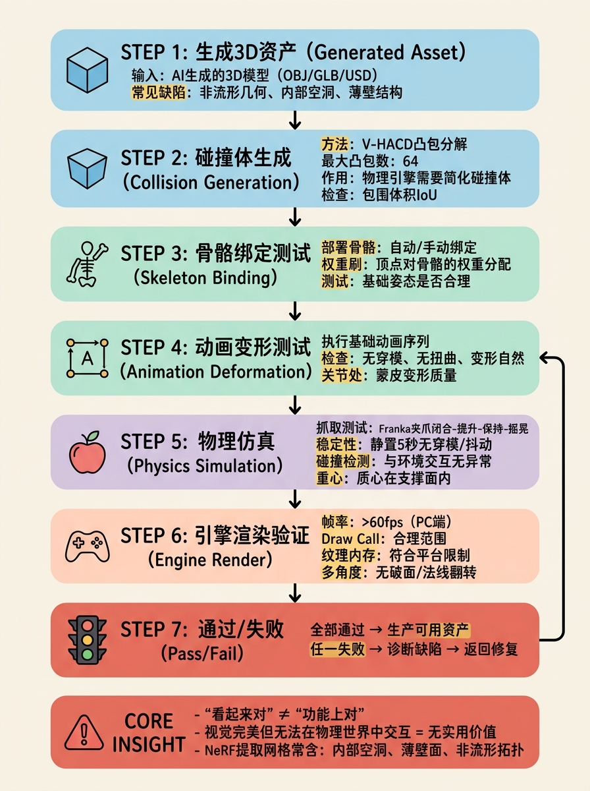

# 第五部分：验证与评估篇——如何衡量生成结果的好坏？

在三维生成模型的研究与发展中，评估（Evaluation）绝非简单的"打分数"环节，而是整个科学方法论体系的基石。与二维图像生成领域存在 Fréchet Inception Distance（FID）这类虽不完美却已被广泛接受的"通用货币"不同，三维生成至今尚未形成单一的主导性指标。这种碎片化现状源于三维数据本身的异质性——同样的生成结果可以以体素、点云、网格、隐式场或神经辐射场（NeRF）的形式存在；也源于评估维度的多元性——几何精度、视觉保真度、拓扑正确性、物理合规性、语义对齐度与感知质量往往此消彼长，难以被压缩为一个标量。

本部分将从主观实验设计、客观指标体系的数学本质、指标间的内在冲突，以及下游任务驱动的功能性验证四个维度，建立一套方法论层面严谨、可复现且难以被操纵的评估框架。我们的核心论点是：**一个好的评估协议必须同时是多维的（覆盖几何、视觉、语义、物理）、多视角的（避免单一渲染视角的偏差）、统计上严谨的（报告显著性与效应量），并与下游任务锚定的（functional correctness）**。

---

## 5.1 主观评估

主观评估是三维生成结果评价中不可被客观指标完全替代的核心环节。原因在于，三维内容的最终受众是人类，而人类视觉系统对几何瑕疵、光照不协调和语义违和的敏感度，往往无法被现有的逐点距离度量所捕捉。然而，主观评估若设计不当，极易引入巨大的系统偏差与噪声，导致结论不可信。

### 5.1.1 用户研究设计方法

#### AB测试（Pairwise Comparison）

在三维生成评估中，AB测试（成对比较）是最可靠的主观评估范式之一。其基本实验设计为：被试在每次试验中观察由两个不同模型生成的三维结果（以旋转渲染视频或交互式视图呈现），并在强制选择（forced choice）或分级量表上做出判断。

**统计模型：Bradley-Terry 模型**

设共有 $M$ 个待比较的模型（或方法），每个模型具有一个潜在的感知质量分数（latent score）$\theta_i \in \mathbb{R}$。Bradley-Terry 模型假设模型 $i$ 在成对比较中击败模型 $j$ 的概率为：

$$P(i \text{ beats } j) = \frac{e^{\theta_i}}{e^{\theta_i} + e^{\theta_j}}$$

该模型可视为 Logistic 模型在离散选择场景下的特例。给定 $N$ 次独立观测，其中 $w_{ij}$ 表示模型 $i$ 击败模型 $j$ 的次数，对数似然函数为：

$$\ell(\boldsymbol{\theta}) = \sum_{i<j} \left[ w_{ij} (\theta_i - \theta_j) - (w_{ij} + w_{ji}) \log(1 + e^{\theta_i - \theta_j}) \right]$$

为避免尺度不可识别性，通常施加约束 $\sum_{i=1}^M \theta_i = 0$ 或固定 $\theta_1 = 0$。通过最大似然估计（MLE）求解 $\hat{\boldsymbol{\theta}}$，可获得各模型的全局排序。Fisher 信息矩阵 $\mathbf{I}(\boldsymbol{\theta})$ 可用于估计参数的标准误，进而构造置信区间。

当模型数量 $M$ 较大时，成对比较的总次数为 $\binom{M}{2}$，可采用自适应采样策略（如 Active Learning 或 Tournament 机制）减少比较次数，同时保持排序精度。

**样本量计算与统计功效分析**

主观实验设计的核心问题之一是：需要多少被试、多少对比较才能检测到真实的质量差异？

设我们关注两个模型间的配对差异，采用 5 级 Likert 量表（-2 到 +2）或二元选择。对于连续型或近似连续型的差异度量，可使用 Cohen's $d$ 作为标准化效应量：

$$d = \frac{\mu_1 - \mu_2}{\sigma_{pooled}}$$

对于配对样本设计（同一被试比较 A 和 B），在显著性水平 $\alpha = 0.05$（双侧检验）、统计功效 $1-\beta = 0.8$ 的条件下，所需样本量（对比较数）为：

$$n \approx \frac{2(z_{1-\alpha/2} + z_{1-\beta})^2}{d^2}$$

当 $d = 0.5$（中等效应量）时，$z_{0.975} \approx 1.96$，$z_{0.8} \approx 0.84$，代入得：

$$n \approx \frac{2 \times (1.96 + 0.84)^2}{0.25} = \frac{2 \times 7.84}{0.25} \approx 62.7$$

即至少需要约 **64 对有效比较**。然而，这一计算基于理想假设。在实际三维生成评估中，必须考虑以下膨胀因素：
1. **被试间差异（Inter-subject variability）**：不同被试的评判标准差异巨大，需引入随机效应模型；
2. **项目间差异（Item variability）**：不同文本提示或物体类别的生成难度不同；
3. **学习效应与疲劳效应**：随着实验进行，被试的判断标准可能漂移；
4. **缺失数据**：部分被试可能跳过某些比较。

因此，实践中通常将样本量乘以 3–5 倍的安全系数，即 **每对方法至少需要 200–300 次有效比较**，若涉及多个类别，则需按类别分层采样。

**实验设计模板（可直接用于论文写作）**

> **协议名称**：成对比较主观评估协议（Pairwise Comparison Protocol for 3D Generation）
>
> **被试招募**：通过 Amazon Mechanical Turk 或 Prolific 招募 $N \geq 50$ 名被试，要求通过注意力检查题（attention check，如要求选择指定选项）。排除标准：色彩视觉异常；三维图形学背景（避免专家偏差）。
>
> **刺激呈现**：每个试验展示两个同步旋转的 360° 渲染视频（30 帧，20 秒循环），分辨率为 $512 \times 512$，采用 Blender Cycles 渲染器，固定 HDRI 环境光。左右位置随机化。
>
> **任务**：被试需回答"哪个三维模型在整体质量上更好？"（强制选择），并可选填置信度（高/中/低）。
>
> **样本量**：基于预实验（pilot study, $n=20$）估计效应量 $d=0.6$，目标功效 0.8，$\alpha=0.05$，计算需 180 对有效比较。考虑 20% 淘汰率，实际收集 225 对。
>
> **统计检验**：使用 Bradley-Terry 模型估计 latent scores，报告 95% 置信区间；采用 Wilcoxon 符号秩检验（因数据非正态）验证两模型差异的显著性；报告 Cliff's Delta 作为效应量度量。
>
> **伦理与报酬**：经 IRB 批准；时薪不低于平台最低标准的 1.5 倍。

#### Likert 量表

除二元选择外，多维度 Likert 量表常用于捕捉生成质量的细粒度差异。在三维生成评估中，推荐的评估维度包括：
- **Overall Quality（整体质量）**
- **Geometry Quality（几何质量）**：表面平滑度、结构合理性、无漂浮物
- **Texture Quality（纹理质量）**：清晰度、光照一致性、分辨率
- **Text Alignment（文本对齐度）**：生成结果与输入文本提示的符合程度
- **Diversity（多样性）**：在多次采样下结果的变异程度

**顺序数据的统计处理原则**

5 点或 7 点 Likert 数据在测量学上属于**顺序数据（ordinal data）**，即数值之间的距离不等距（"略好"与"明显好"之间的感知差距不一定等于"平"与"略好"之间的差距）。因此，以下做法在统计上是**有争议或错误的**：
- 直接计算均值与标准差；
- 使用参数 $t$ 检验或 ANOVA 比较组间差异；
- 假设数据服从正态分布。

**正确的统计处理方法**：
1. **描述统计**：报告中位数（Median）与四分位距（Interquartile Range, IQR），而非均值±标准差；
2. **推断统计**：使用非参数检验：
   - 两组独立样本：Mann-Whitney $U$ 检验；
   - 多组独立样本：Kruskal-Wallis $H$ 检验，若显著则进行 Dunn's 检验进行事后多重比较，并使用 Bonferroni 或 Holm 校正；
   - 配对样本：Wilcoxon 符号秩检验；
3. **效应量**：对于非参数检验，报告秩相关系数 $r = Z / \sqrt{N}$ 或 Cliff's Delta，而非 Cohen's $d$；
4. **高级建模**：若需控制协变量（如被试经验、物体类别），可使用有序 Probit/Logit 混合效应模型（Ordered Mixed-effects Model）。

> **警示**：当前计算机视觉与图形学顶会论文中，大量工作仍报告 Likert 评分的"均值±标准差"并使用 $t$ 检验。审稿人与作者应意识到，这种做法可能低估或高估真实的组间差异，且对异常值极为敏感。

#### 专家评估 vs. 众包评估

主观评估的信源（Source of Judgment）直接决定了评估能捕捉何种缺陷。

**专家评估（Expert Evaluation）**
- **评估者**：三维艺术家、建模师、图形学研究者；
- **优势**：能识别拓扑错误（非流形边、孔洞）、UV 展开瑕疵、PBR 材质参数不合规、法向翻转等专业问题；
- **劣势**：样本量小（通常 $N < 20$），成本高，存在专家偏差（对微小几何误差过度敏感，与大众审美脱节）；
- **适用场景**：技术合规性检查、工业级资产验收。

**众包评估（Crowdsourcing）**
- **评估者**：通过 Amazon Mechanical Turk、Prolific 招募的普通用户；
- **优势**：样本量大（$N \geq 100$），成本低，结果反映大众感知质量（perceptual quality）；
- **劣势**：无法识别技术性错误（如一个模型可能有严重的内部自相交，但从外部看起来正常）；对文本对齐度的判断可能受提示词复杂度影响；
- **适用场景**：整体质量排序、文本-三维对齐度评估。

**推荐做法**：采用**两阶段混合评估**。第一阶段用众包评估进行大规模筛选，获得整体质量排序与置信区间；第二阶段邀请专家对前 $K$ 个模型进行技术合规性审查，识别众包无法发现的隐性缺陷。论文中应分别报告两种评估的结果，并讨论其差异。

#### Just Noticeable Difference (JND)

JND 是心理物理学中的核心概念，指人眼（或人脑）能察觉的最小刺激差异。在三维生成评估中，JND 可用于回答一个关键工程问题：**两个生成结果的差异在何种程度上对终端用户是可感知的？**

具体应用场景包括：
1. **几何简化**：一个具有 100K 面的网格被简化到 50K 面或 20K 面，用户在旋转观察时何时开始察觉质量下降？
2. **纹理压缩**：纹理从 4K 压缩到 1K 或 512，JND 阈值是多少？
3. **NeRF vs. 网格**：神经渲染结果与传统光栅化渲染结果在多少视角差异下无法区分？

**实验设计（2AFC 阶梯法）**：
采用二选一强迫选择（2-Alternative Forced Choice, 2AFC）结合自适应阶梯（Adaptive Staircase）法。初始时，参考模型与测试模型差异极大（如一个高保真、一个低模），被试轻松识别。随后逐步减小差异（如增加面数、提高分辨率），直到被试正确率降至 75%（介于完全随机 50% 与完全正确 100% 之间的中点），该点即定义为 JND 阈值。

数学上，设被试的内部感知为 $S = S_{ref} - S_{test}$，其服从正态分布 $\mathcal{N}(\Delta, \sigma^2)$。被试正确判断测试模型更差的概率为：

$$P(\text{correct}) = \Phi\left(\frac{\Delta}{\sigma}\right)$$

其中 $\Phi$ 为标准正态累积分布函数。令 $P(\text{correct}) = 0.75$，则 $\Delta / \sigma \approx 0.674$。通过极大似然拟合心理测量函数（Psychometric Function），可精确估计 JND。

---

## 5.2 客观评估指标



客观指标是评估体系的主体，但其设计、计算与解释均蕴含深刻的统计与几何假设。忽视这些假设将导致系统性的评估偏差。

### 5.2.1 几何质量指标



#### Chamfer Distance（CD）的完整分析

Chamfer Distance 是三维点云比较中最广泛使用的度量。给定两个点集 $S_1 = \{x_i\}_{i=1}^{N} \subset \mathbb{R}^3$ 和 $S_2 = \{y_j\}_{j=1}^{M} \subset \mathbb{R}^3$，其定义如下：

$$d_{CD}(S_1, S_2) = \frac{1}{|S_1|}\sum_{x \in S_1}\min_{y \in S_2}\|x-y\|_2 + \frac{1}{|S_2|}\sum_{y \in S_2}\min_{x \in S_1}\|x-y\|_2$$

该定义具有明确的数学结构：它是两个有向 Hausdorff 距离的对称化平均。第一项衡量从 $S_1$ 到 $S_2$ 的覆盖度（Coverage），第二项衡量从 $S_2$ 到 $S_1$ 的精度（Accuracy）。

**计算实现与复杂度分析**

朴素的双重循环实现具有 $O(N \cdot M)$ 的时间复杂度，在 $N, M \sim 10^5$ 时完全不可行。工程上采用空间划分数据结构：

- **k-d 树（k-dimensional tree）**：构建复杂度 $O(N \log N)$，单次最近邻查询期望 $O(\log N)$，总复杂度 $O(N \log M + M \log N)$；
- **FAISS（Facebook AI Similarity Search）**：针对 GPU 优化的批量最近邻搜索，在百万级点云上仍保持毫秒级延迟。

```python
import numpy as np
import scipy.spatial

def chamfer_distance(A, B):
    """
    A: [N, 3] numpy array
    B: [M, 3] numpy array
    Returns: scalar Chamfer Distance
    """
    tree_A = scipy.spatial.cKDTree(A)
    tree_B = scipy.spatial.cKDTree(B)
    # A 到 B 的距离：对 A 中每个点在 B 中找最近邻
    dist_A_to_B, _ = tree_B.query(A, k=1)
    # B 到 A 的距离：对 B 中每个点在 A 中找最近邻
    dist_B_to_A, _ = tree_A.query(B, k=1)
    return np.mean(dist_A_to_B) + np.mean(dist_B_to_A)
```

**可微分近似**

在基于优化的三维生成（如 DeepSDF、PointFlow）中，CD 需作为损失函数。由于 $\min$ 操作不可微，常采用 softmin 近似：

$$\min_{y \in S_2} \|x - y\|_2 \approx -\epsilon \log \sum_{y \in S_2} \exp\left(-\frac{\|x - y\|_2}{\epsilon}\right)$$

当 $\epsilon \to 0$ 时，softmin 收敛于 hard min；当 $\epsilon > 0$ 时，梯度可稳定传播。

**性质分析：优点与致命缺陷**

CD 的普及源于其计算效率与实现简单性，但其缺陷同样深刻：

1. **法向不敏感**：CD 仅考虑欧氏距离，完全不惩罚法向不一致。两个表面可以"贴得很近"（CD 很小），但朝向完全相反（一个朝外、一个朝内）。在三维重建中，这对应于"表面翻折"（inside-out）缺陷，视觉上极为明显，但 CD 无法捕捉。

2. **对异常值敏感**：单个远离主群体的离群点（outlier）会贡献极大的最近邻距离，导致 CD 值被人为放大。虽然可通过截断（truncation）或使用中位数缓解，但这破坏了 CD 的理论基础。

3. **不衡量拓扑与连通性**：一个由 100 个不相交碎片组成的点云，若其并集与真值形状空间接近，可获得极低的 CD；而一个连通但略微膨胀的均匀球体，CD 可能更高。CD 完全无法区分"碎片几何"与"完整几何"。

4. **采样密度依赖性**：CD 值严格依赖于采样策略。使用均匀随机采样、泊松盘采样（Poisson Disk Sampling）或曲率自适应采样会得到不同的 CD 值。若两篇论文采用不同的采样密度（如 10K vs. 100K 点），其 CD 值**不可直接比较**。

#### Earth Mover's Distance（EMD）

为克服 CD 的局部性缺陷，Earth Mover's Distance（又称 Wasserstein-1 距离）从全局最优传输（Optimal Transport）的角度度量点云差异。

**数学定义**

将 $S_1$ 和 $S_2$ 视为概率分布的离散支撑，均匀权重分别为 $a_i = \frac{1}{N}$ 和 $b_j = \frac{1}{M}$。EMD 定义为：

$$d_{EMD}(S_1, S_2) = \min_{\gamma \in \Gamma(\mathbf{a}, \mathbf{b})} \sum_{i=1}^{N} \sum_{j=1}^{M} \gamma_{ij} \|x_i - y_j\|_2$$

其中 $\Gamma(\mathbf{a}, \mathbf{b})$ 是所有满足边际约束的传输计划（coupling）集合：

$$\sum_{j=1}^{M} \gamma_{ij} = a_i = \frac{1}{N}, \quad \sum_{i=1}^{N} \gamma_{ij} = b_j = \frac{1}{M}, \quad \gamma_{ij} \geq 0$$

这是一个经典的线性规划（Linear Programming, LP）问题，其约束矩阵具有全单模性（totally unimodular），保证存在顶点最优解。

**计算：从精确解到 Sinkhorn 近似**

- **精确算法**：网络单纯形法（Network Simplex）或 Hungarian 算法变种，时间复杂度 $O(n^3)$ 或更高（$n = \max(N, M)$）。对于 $n > 10^4$，精确计算在单 CPU 上可能需要数小时。
- **熵正则化与 Sinkhorn 迭代**：Cuturi (2013) 引入熵正则项，将 LP 转化为可通过矩阵缩放高效求解的问题：

$$\min_{\gamma \in \Gamma} \sum_{i,j} \gamma_{ij} c_{ij} + \epsilon \sum_{i,j} \gamma_{ij} \log \gamma_{ij}$$

其中 $c_{ij} = \|x_i - y_j\|_2$ 为代价矩阵，$\epsilon > 0$ 为正则化参数。该问题的解具有指数族形式 $\gamma_{ij}^* = u_i K_{ij} v_j$，其中 $K_{ij} = \exp(-c_{ij}/\epsilon)$。通过迭代更新尺度向量 $\mathbf{u}$ 和 $\mathbf{v}$：

$$\mathbf{u}^{(t+1)} = \frac{\mathbf{a}}{K \mathbf{v}^{(t)}}, \quad \mathbf{v}^{(t+1)} = \frac{\mathbf{b}}{K^T \mathbf{u}^{(t+1)}}$$

Sinkhorn 迭代的每步复杂度为 $O(NM)$（若使用 GPU 加速的矩阵乘法），通常数十至数百次迭代即可收敛。$\epsilon$ 越小，解越接近原始 EMD，但收敛越慢、数值稳定性越差；实践中常取 $\epsilon = 0.01 \sim 0.1$（经代价矩阵中位数归一化后）。

**性质与局限**

- **全局结构感知**：EMD 强制每个点都被"传输"到目标分布，因此能捕捉整体结构差异。例如，若一个椅子的扶手缺失，EMD 会将扶手区域的点质量传输到主体，产生显著距离；而 CD 可能因主体匹配良好而被大面积正确区域主导。
- **计算成本**：即使采用 Sinkhorn 近似，EMD 的计算成本仍远高于 CD，这限制了其在大规模基准测试（如 10K+ 样本）中的应用。
- **等基数要求**：标准 EMD 要求总质量守恒（$\sum a_i = \sum b_j = 1$）。若 $N \neq M$，需通过权重归一化实现，但这意味着单个点的"质量"不同，解释性略降。

#### F-Score

F-Score 将二分类中的 Precision 与 Recall 概念引入三维几何评估，尤其擅长捕捉**细节结构的缺失**。

**数学定义**

给定距离阈值 $\tau > 0$：
- **Precision$_\tau$**：预测点集 $S_{pred}$ 中落在真值 $S_{gt}$ 的 $\tau$-邻域内的点的比例：

$$\text{Precision}_\tau = \frac{1}{|S_{pred}|} \sum_{x \in S_{pred}} \mathbb{1}\left(\min_{y \in S_{gt}} \|x - y\|_2 < \tau\right)$$

- **Recall$_\tau$**：真值点集 $S_{gt}$ 中被预测点集覆盖（在 $\tau$ 距离内）的点的比例：

$$\text{Recall}_\tau = \frac{1}{|S_{gt}|} \sum_{y \in S_{gt}} \mathbb{1}\left(\min_{x \in S_{pred}} \|x - y\|_2 < \tau\right)$$

则 F-Score 为两者的调和平均：

$$F_\tau = \frac{2 \cdot \text{Precision}_\tau \cdot \text{Recall}_\tau}{\text{Precision}_\tau + \text{Recall}_\tau}$$

**阈值选择与曲线分析**

单阈值 $F_\tau$ 的绝对值受 $\tau$ 选择影响巨大，因此严谨的论文应：
1. 报告多个阈值下的 F-Score，如 $\tau \in \{0.01, 0.02, 0.05\}$（单位通常为包围盒对角线的比例或绝对单位）；
2. 或绘制 Precision-Recall 曲线（通过变化 $\tau$），并报告曲线下面积（AUC）；
3. 更高级的做法：报告 F-Score@$\tau$ 曲线本身，展示模型在不同容忍度下的表现。

**F-Score 相比 CD 的优势**

CD 是所有点最近邻距离的**平均值**，具有强烈的"平均化"效应。若一个模型在 90% 的区域完美匹配（CD 贡献接近 0），但在 10% 的细节区域（如椅子的扶手、动物的尾巴）完全缺失，CD 可能仍然很低，给人一种"生成质量很好"的假象。相反，F-Score 在阈值 $\tau$ 处是"硬"判断：细节区域的点无法在 $\tau$ 内找到对应点，直接导致 Precision 或 Recall 下降。因此，**F-Score 对尖锐特征、薄壁结构和细小附属物更为敏感**。

---

### 5.2.2 视觉质量指标



当存在参考图像（Ground-truth rendering）时，可通过像素级或特征级度量评估渲染一致性。

#### PSNR（Peak Signal-to-Noise Ratio）

PSNR 基于均方误差（MSE）定义。设参考图像为 $I$，生成图像为 $\hat{I}$，像素值范围为 $[0, \text{MAX}]$（通常为 1.0 或 255）：

$$\text{MSE} = \frac{1}{HWC} \sum_{h,w,c} (I_{hwc} - \hat{I}_{hwc})^2$$

$$\text{PSNR} = 10 \cdot \log_{10}\left(\frac{\text{MAX}^2}{\text{MSE}}\right) = 20 \cdot \log_{10}\left(\frac{\text{MAX}}{\sqrt{\text{MSE}}}\right)$$

PSNR 在数学上等价于 MSE 的单调变换，其单位为分贝（dB）。PSNR > 40 dB 通常被认为是"不可感知差异"，30–40 dB 为"良好"，< 20 dB 为"较差"。

**根本缺陷**

PSNR 与感知质量（Perceptual Quality）的相关性极差，原因如下：
1. **与感知非单调**：MSE 对像素值的线性变换敏感。若生成图像仅是整体偏亮或偏暗（人眼可轻松适应），MSE 会显著增大，PSNR 下降；但若图像结构被完全破坏（如严重模糊），只要整体亮度正确，PSNR 可能反而较高。
2. **对微小平移极度敏感**：若生成图像相对于参考图像平移 1 个像素（如由于相机标定误差），边缘区域的 MSE 会激增，PSNR 暴跌，但人眼几乎无法察觉这种亚像素级偏移。
3. **忽略语义**：PSNR 将图像视为信号，完全不考虑语义内容。两个语义上完全错误的图像（如把汽车生成成椅子），只要像素值碰巧接近，PSNR 就会很高。

因此，**在现代三维生成论文中，PSNR 应仅作为补充指标，绝不应作为主要依据**。

#### SSIM（Structural Similarity Index）

Wang 等人提出的 SSIM 旨在通过比较局部统计量来逼近人类视觉系统的掩蔽效应与结构敏感性。

**完整公式与分解**

对于两个局部图像块 $x$ 和 $y$，SSIM 定义为三个分量的乘积：

$$\text{SSIM}(x, y) = l(x,y) \cdot c(x,y) \cdot s(x,y)$$

其中：
- **亮度项（Luminance）**：比较局部均值

$$l(x,y) = \frac{2\mu_x\mu_y + c_1}{\mu_x^2 + \mu_y^2 + c_1}$$

- **对比度项（Contrast）**：比较局部标准差

$$c(x,y) = \frac{2\sigma_x\sigma_y + c_2}{\sigma_x^2 + \sigma_y^2 + c_2}$$

- **结构项（Structure）**：比较归一化互相关

$$s(x,y) = \frac{\sigma_{xy} + c_3}{\sigma_x\sigma_y + c_3}$$

合并后：

$$\text{SSIM}(x, y) = \frac{(2\mu_x\mu_y + c_1)(2\sigma_{xy} + c_2)}{(\mu_x^2 + \mu_y^2 + c_1)(\sigma_x^2 + \sigma_y^2 + c_2)}$$

其中 $\mu_x, \mu_y$ 为局部窗口（通常 $11 \times 11$ 高斯窗）的均值，$\sigma_x^2, \sigma_y^2$ 为方差，$\sigma_{xy}$ 为协方差；$c_1, c_2$ 为小常数，避免分母为零。SSIM 取值范围为 $[-1, 1]$，通常报告整幅图像的平均 SSIM（MSSIM）。

**为何优于 PSNR**

SSIM 将图像分解为亮度、对比度和结构三个感知相关属性，对微小几何偏移有一定容忍度（通过局部窗口统计平滑掉亚像素级位移）。然而，SSIM 仍有局限：它基于局部统计，无法捕捉长程语义关系（如物体类别的正确性），且对严重失真（如 JPEG 块效应）的评估不够准确。

#### LPIPS（Learned Perceptual Image Patch Similarity）

LPIPS 代表了从手工设计度量（PSNR/SSIM）到学习感知度量的范式转变。其核心思想是：**预训练深度网络的中间层特征空间与人类感知相似性高度对齐**。

**数学定义**

设深度网络（如 VGG16）的第 $l$ 层特征图为 $y^l \in \mathbb{R}^{H_l \times W_l \times C_l}$。首先对特征进行通道归一化（除以该通道在训练集上的标准差）。对于图像 $x$ 和参考 $x_0$，LPIPS 距离为：

$$d_{LPIPS}(x, x_0) = \sum_l \frac{1}{H_l W_l} \sum_{h,w} \|w_l \odot (\hat{y}_{hw}^l - \hat{y}_{0,hw}^l)\|_2^2$$

其中：
- $\hat{y}^l$ 为归一化后的特征图；
- $\odot$ 为逐通道乘法；
- $w_l$ 为可学习的通道权重向量，在 Berkeley-Adobe Perceptual Patch Similarity（BAPPS）数据集上训练得到。BAPPS 数据集包含大量由人类标注的感知相似性判断，因此 $w_l$ 的优化目标直接对齐人类偏好。

**实现细节与最佳实践**

1. **网络选择**：VGG16 是最常用的骨干网络（使用 conv1_2, conv2_2, conv3_3, conv4_3, conv5_3 层）；AlexNet 和 SqueezeNet 变体也有提供，但 VGG 特征与感知判断的相关性通常最高。
2. **输入预处理**：图像需归一化到 $[-1, 1]$ 或 ImageNet 统计量（mean=[0.485, 0.456, 0.406], std=[0.229, 0.224, 0.225]）。
3. **多尺度评估**：对图像进行不同倍率的下采样（如 $1\times, 0.5\times, 0.25\times$）分别计算 LPIPS 后平均，可提升对多尺度失真的鲁棒性。
4. **空间平均**：通常计算全图 LPIPS 后取空间平均，得到单张图像对的标量距离。

**为什么 LPIPS 有效**

深度网络的中间层通过大规模图像分类训练，隐式编码了从低层特征（边缘、纹理）到中层特征（物体部分、轮廓）的层次化表示。LPIPS 在这些特征空间中比较图像，本质上是在问"两个图像是否激活了相似的模式探测器"。因此，它能捕捉 PSNR 和 SSIM 无法感知的语义级差异（如"这个椅子有扶手而那个没有"）。

#### 多视图一致性检查

三维生成模型的独特挑战在于**多视图一致性（Multi-view Consistency）**：从正面看合理的模型，侧面可能出现拉伸、孔洞或不一致的结构。

**评估协议**

1. **图像空间一致性**：从 $K$ 个均匀分布的视角（如二十面体顶点方向）渲染生成模型，计算相邻视角图像对的平均 LPIPS 或 SSIM。一致性得分可定义为：

$$\text{Consistency} = \frac{1}{K} \sum_{k=1}^K \text{SSIM}(R_k, R_{k+1})$$

其中 $R_k$ 为第 $k$ 个视角的渲染图。注意：相邻视角本身存在内容差异（如遮挡），因此绝对阈值难以设定，更适合用于相对比较（模型 A vs. 模型 B）。

2. **三维重投影一致性**：将各视角的渲染图通过深度图反投影为三维点云，计算不同视角反投影点云之间的 CD 或 ICP（Iterative Closest Point）配准误差。

3. **显式一致性损失（Consistency Loss）**：部分方法在训练时已施加多视图光度一致性（如 NeRF 的体渲染一致性），此时可在测试时检查该损失的数值。但需注意：**训练时使用的损失在测试时降低是预期行为，不能作为跨方法比较的依据**。

---

### 5.2.3 多样性与保真度

生成模型需在**保真度（Fidelity）**与**多样性（Diversity）**之间取得平衡。客观评估必须能解耦这两个维度，避免"模式坍塌（Mode Collapse）"被单一平均指标掩盖。

#### Precision / Recall for Generative Models

受分类任务启发，Sajjadi 等人与 Kynkäänniemi 等人分别提出了针对生成模型的 Precision 与 Recall 框架。其核心思想是：将真实样本与生成样本嵌入到一个合适的特征空间（如 VGG 特征空间或 CLIP 空间），通过 k-NN 估计数据流形的局部支撑。

**数学定义**

设真实样本集为 $R = \{r_i\}_{i=1}^{N_r}$，生成样本集为 $G = \{g_j\}_{j=1}^{N_g}$，嵌入函数为 $\phi: \mathcal{X} \to \mathbb{R}^D$。定义特征空间中的 k-NN 流形近似：

- **Precision（精度）**：生成样本落在真实数据流形支撑内的比例，衡量**质量**：

$$\text{Precision}(G, R) = \frac{1}{|G|} \sum_{x \in G} \mathbb{1}\left(\exists y \in R: \|\phi(x) - \phi(y)\|_2 < \epsilon\right)$$

等价地，对每个生成样本 $x$，找到其在真实集中的最近邻 $y^*$，若 $\|\phi(x) - \phi(y^*)\|_2 < \epsilon$，则认为 $x$ 是"真实的"（plausible）。

- **Recall（召回率）**：真实样本被生成样本覆盖的比例，衡量**多样性/覆盖率**：

$$\text{Recall}(G, R) = \frac{1}{|R|} \sum_{y \in R} \mathbb{1}\left(\exists x \in G: \|\phi(x) - \phi(y)\|_2 < \epsilon\right)$$

阈值 $\epsilon$ 通常设为真实样本到其第 $k$ 个最近邻距离的经验分布的某个分位数（如第 5 个最近邻距离的均值）。

**改进版：Improved Precision/Recall**

上述硬阈值方法对异常值敏感。Improved Precision/Recall 引入**人造样本（Synthetic Samples）**作为流形边界的探针：在真实样本之间进行线性插值，若插值样本仍被判定为"真实"，则说明真实流形支撑被良好建模。该方法更鲁棒，且与 GAN 训练动态有更好的理论联系。

#### Density / Coverage

Naeem 等人进一步提出了 Density 与 Coverage，作为 Precision/Recall 的改进：

- **Density**：衡量生成样本在真实流形中的"密度"，考虑了每个生成样本在 $\epsilon$ 邻域内的真实邻居数量。高密度意味着生成样本聚集在真实数据的稠密区域，但可能忽略稀疏区域；
- **Coverage**：与 Recall 类似，但更强调生成分布是否覆盖了真实分布的**所有模态（Modes）**。

数学上，设 $N_k(y, R)$ 为真实样本 $y$ 在真实集中的第 $k$ 个最近邻距离。Coverage 定义为：

$$\text{Coverage}(G, R) = \frac{1}{|R|} \sum_{y \in R} \mathbb{1}\left(\min_{x \in G} \|\phi(x) - \phi(y)\|_2 \leq N_k(y, R)\right)$$

#### CLIP Score



在文本条件三维生成中，CLIP Score 是最常用的语义对齐度量。

**数学定义**

设 $I$ 为生成物体的渲染图，$T$ 为输入文本提示。CLIP Score 定义为图像编码器与文本编码器归一化特征向量的余弦相似度：

$$\text{CLIP-Score}(I, T) = \max(100 \cdot \cos(E_I(I), E_T(T)), 0)$$

其中 $E_I$ 和 $E_T$ 分别为 CLIP 的图像与文本编码器，缩放因子 100 用于将分数映射到 $[0, 100]$ 区间。通常取 4 个或更多视角渲染图的平均 CLIP Score。

**问题、陷阱与改进**

1. **提示工程敏感性（Prompt Engineering Sensitivity）**："a dog" 和 "a photo of a dog" 会产生显著不同的 CLIP Score。若基线方法使用"a dog"而本方法使用"a photo of a dog"，比较将不公平。**论文必须固定提示模板，或报告使用多种提示模板的平均结果**。

2. **训练分布偏差**：CLIP 在大量自然图像上训练，对照片级真实感（photorealistic）图像打分偏高，而对渲染图、卡通风格或抽象几何可能系统性低估。若生成模型输出风格化三维资产（如 low-poly 或卡通风格），CLIP Score 可能不公平地惩罚其语义对齐度。

3. **改进：领域特定 CLIP**：使用在三维渲染图-文本对上微调的 CLIP 变体（如 CLIP-for-3D、UniCLIP3D），可缓解自然图像与渲染图之间的域差异。

4. **CLIP R-Precision**：作为 CLIP Score 的补充，CLIP R-Precision 评估检索能力：给定生成图像和 $N$ 个候选文本（1 个正确，$N-1$ 个干扰项），计算正确文本在余弦相似度排序中的 top-k 比例。这能更好地反映模型是否真正"理解"了文本，而非仅仅生成高余弦相似度的图像。

---

### 5.2.4 指标使用的陷阱与最佳实践



#### 陷阱清单

1. **Cherry-picking（摘樱桃偏差）**
   仅报告对己方方法有利的指标（如 CD 低但 F-Score 差），或仅选择最有利的视角进行渲染评估。在某些极端案例中，研究者可能从 100 个生成样本中手动挑选 10 个最好的进行可视化与定量评估——这在统计上完全不可接受。

2. **测试集污染（Test Set Contamination）**
   生成模型的超参数（如扩散步数、CFG 尺度、后处理阈值）在测试集上调参，导致对测试集的隐性过拟合。正确的做法是：在验证集（validation set）上调参，在完全未见的测试集上仅运行一次最终评估。

3. **采样偏差（Sampling Bias）**
   CD 与 EMD 强烈依赖于点云采样密度和采样算法。论文 A 使用 10K 均匀采样点，论文 B 使用 100K 泊松盘采样点，两者的 CD 值不可比。同样，网格评估时，不同网格简化算法会导致完全不同的顶点分布。

4. **渲染差异（Rendering Discrepancy）**
   不同光照（HDR vs. LDR）、材质模型（PBR vs. Lambertian）、环境贴图和相机参数下，渲染图的差异可能远大于生成模型本身的差异。若两篇论文使用不同的渲染管线，其报告的 LPIPS、PSNR、SSIM 不可进行横向比较。

5. **单一视角陷阱（Single-view Trap）**
   仅从正面或 3–4 个固定视角渲染评估，忽略背面、底面和内部细节。许多三维生成模型在正面表现优异，但背面存在严重的结构崩溃（如"融化的椅子背"）。

6. **指标冲突的掩盖（Metric Conflict Concealment）**
   某些方法优化 CD 会导致 EMD 上升，或优化 CLIP Score 会导致几何精度下降。若论文仅报告优化的指标而忽略恶化的指标，将误导读者认为该方法"全面优越"。

#### 推荐评估协议（Protocol）

为确保评估的可复现性与公平性，我们提出以下标准化协议：

1. **固定渲染器**：采用 Blender Cycles 或 Mitsuba 3，使用标准 HDR 环境贴图（如 Poly Haven 的 studio_small_08），固定曝光、白平衡与采样数（如 128 samples/pixel）。
2. **固定相机分布**：采用 20 个均匀分布的视角（基于二十面体细分或菲波那契球面采样），焦距 50mm，相机距离为物体包围盒对角线的 $2.5$ 倍。
3. **固定采样密度**：点云评估采用统一的泊松盘采样（Poisson Disk Sampling），密度以确保表面覆盖为准（如 2048 或 8192 点），并在论文中明确说明采样参数。
4. **完整指标矩阵**：同时报告 CD、EMD、F-Score（多阈值）、LPIPS、CLIP Score、Precision/Recall。若空间受限，至少应包含几何指标（CD/F-Score）、视觉指标（LPIPS）和语义指标（CLIP）各一项。
5. **统计显著性**：对随机性来源（如扩散模型的采样、初始化）进行多次重复实验（如 $n \geq 5$），报告均值 $\pm$ 标准差，并使用配对 $t$ 检验或 Wilcoxon 符号秩检验标注显著性（$p < 0.05$）。

---

## 5.3 下游任务驱动评估

客观指标再完美，也仅是真实世界性能的代理（Proxy）。**功能性正确性（Functional Correctness）**要求生成结果能在下游任务中可靠使用，而非仅在统计度量上接近真值。

### 5.3.1 机器人仿真评估



三维生成模型在机器人学中的核心应用是提供仿真训练资产。一个视觉上完美的物体模型若无法在物理仿真器中稳定交互，则毫无实用价值。

**协议设计**

1. **资产导入**：将生成的三维模型（通常为 OBJ/GLB/USD 格式）导入 NVIDIA Isaac Sim 或 MuJoCo。自动进行前处理：检测并修复非流形几何、生成碰撞凸包（Convex Decomposition，如 V-HACD）。
2. **抓取任务设置**：部署 Franka Emika Panda 机械臂，配备平行夹爪。使用 GraspNet-1B 或 Contact-GraspNet 生成候选抓取姿态（grasp poses），筛选掉碰撞姿态。
3. **物理仿真执行**：在仿真器中执行闭合-提升-保持-摇晃序列（close-lift-hold-shake）。
4. **评估指标**：
   - **抓取成功率（Grasp Success Rate）**：夹爪闭合后，物体在提升过程中不掉落且位置稳定；
   - **物理稳定性（Physical Stability）**：物体静置于水平桌面时，不穿模（clipping）、不抖动（jitter）、质心合理；
   - **碰撞网格质量（Collision Mesh Fidelity）**：简化碰撞体与视觉网格的包围体积差异（如 IoU）。

**为什么这一评估至关重要**

大量基于 Score Distillation Sampling（SDS）或纯神经场的方法能生成视觉上高度逼真的几何，但其隐式表示提取出的网格常存在：
- 内部空洞（Internal Voids）：导致质量分布错误，物体在仿真中行为异常；
- 薄壁结构（Zero-thickness Faces）：物理引擎无法为无厚度的面赋予有效碰撞体；
- 非流形拓扑（Non-manifold Topology）：基于三角网格的碰撞检测器（如 Bullet、PhysX）可能崩溃或产生错误接触点。

机器人仿真评估直接暴露了"看起来对"（visually correct）与"功能上对"（functionally correct）之间的鸿沟。

### 5.3.2 场景理解评估

若生成场景用于训练三维感知模型（如 3D 目标检测、语义分割），其评估应直接关联下游任务性能。

**协议**

1. **数据生成**：用生成模型产生大规模合成场景（如室内房间、户外街景），包含 RGB-D 扫描或点云。
2. **模型训练**：用生成数据预训练 3D 检测器（VoteNet、PointRCNN、PointTransformerV3）。
3. **迁移测试**：在真实场景数据集（ScanNet、SUN RGB-D、KITTI）上测试，报告 mAP@0.25 与 mAP@0.5。
4. **对比基线**：
   - 从头训练（Scratch）：无预训练；
   - 真实数据训练：使用同等规模的真实数据；
   - 生成数据预训练 + 真实数据微调（Fine-tuning）。

**Domain Gap 问题与应对**

生成场景与真实场景之间存在显著的域差异（Domain Gap），来源包括：
- **光照差异**：生成场景可能过亮或过暗，缺乏真实世界的复杂全局光照；
- **纹理差异**：生成纹理可能过于"干净"，缺乏磨损、灰尘与细节；
- **布局差异**：生成物体的空间分布可能违反物理支撑规则（如椅子悬浮在空中）。

应对策略：
- **Domain Randomization**：在渲染时随机化光照、纹理、相机参数，增强模型鲁棒性；
- **Domain Adaptation**：使用对抗性域适应（Adversarial Domain Adaptation）或自训练（Self-training）缩小特征空间差异；
- **物理约束生成**：在生成过程中施加重力、碰撞与支撑约束，确保布局合理性。

### 5.3.3 路径规划与碰撞检测

在自动驾驶与机器人导航仿真中，生成环境用于训练路径规划器与避障算法。

**评估要求**

- **几何必须是水密的（Watertight）**：任何孔洞、缝隙或反面都可能导致规划器误判为可通行区域；
- **拓扑正确性**：走廊必须连通，门必须是实际的开孔而非纹理欺骗；
- **评估指标**：导航成功率（Navigation Success Rate）、碰撞率（Collision Rate）、路径最优性比率（Path Optimality Ratio，相对于最短路径的长度比）。

**关键洞察**

若生成环境存在微小的几何孔洞（如墙壁上的单像素缝隙），基于占据栅格（Occupancy Grid）或 ESDF（Euclidean Signed Distance Field）的规划器可能认为机器人可以穿过该"隧道"。这类缺陷在 PSNR 或 CD 评估中完全不可见，但在功能层面是致命的。

---

## 5.4 建立完整评估矩阵

基于上述讨论，我们提出一个多维评估框架，旨在避免单一指标带来的片面结论，并为不同应用场景提供可定制的评估配方。

### 推荐的多维评估框架

| 维度 | 核心指标 | 适用场景 | 权重建议 | 备注 |
|------|---------|---------|---------|------|
| **几何精度** | CD, EMD, F-Score@$\tau$ | 所有有真值的生成任务 | 高 | 必须固定采样密度；F-Score 对细节更敏感 |
| **视觉保真** | LPIPS ↓, SSIM ↑, PSNR ↑ | 有参考渲染图像时 | 高 | LPIPS 优先于 PSNR/SSIM；多视角平均 |
| **语义对齐** | CLIP Score ↑, R-Precision ↑ | 文本/图像条件生成 | 高 | 固定提示模板；注意 CLIP 的域偏差 |
| **多样性** | Precision ↑, Recall ↑, Coverage ↑ | 无条件生成、多样本评估 | 中 | 需解耦保真度与多样性；避免模式坍塌 |
| **拓扑质量** | 欧拉特征 $\chi$、连通分量数、流形比率 | 需要可用网格时 | 中 | 检测孔洞、自相交、非流形边 |
| **物理合规** | 抓取成功率、碰撞稳定性、水密性 | 机器人、仿真、游戏资产 | 中 | 暴露"看起来对"与"功能上对"的差距 |
| **感知质量** | User Study AB Test, Bradley-Terry Score | 最终产品、论文发表 | 高 | 报告统计显著性、效应量、样本量 |

**指标间的关联与冲突**

必须认识到，上述指标并非单调一致。常见的冲突模式包括：
- **CD ↓ vs. EMD ↑**：CD 对局部噪声敏感，EMD 对全局结构敏感。过度平滑表面可降低 CD，但可能扭曲整体形状导致 EMD 上升；
- **CLIP Score ↑ vs. 几何精度 ↓**：为提高文本对齐度，模型可能生成纹理上符合文本但几何上扭曲的形状（如"毛茸茸的狗"生成出过度膨胀的几何以表达"毛茸茸"）；
- **多样性 ↑ vs. 保真度 ↓**：鼓励生成样本扩散到更多模态可能增加低质量样本的比例，降低平均 Precision；
- **渲染质量 ↑ vs. 拓扑质量 ↓**：神经渲染方法可产生极好的多视图一致性，但其提取的网格可能充满内部碎片与漂浮物。

因此，**任何声称"全面超越 SOTA"的论文都必须证明其在多个冲突指标上同时取得帕累托改进（Pareto Improvement）**，而非仅在单一指标上领先。

### 实验设计模板：发布新模型的完整评估套件

> **评估套件名称**：Comprehensive 3D Generation Evaluation Suite (C3GES)
>
> **硬件与软件环境**：NVIDIA RTX 4090, PyTorch 2.1, Blender 3.6, Isaac Sim 2023.1。所有随机种子固定。
>
> **数据集**：在 ShapeNet 测试集（未见过类别）和 Objaverse 子集上评估。文本提示来自 Cap3D 和人工整理的 500 个密集描述。
>
> **几何评估**：
> - 使用泊松盘采样从网格表面采样 8192 点；
> - 报告 CD (×0.01)、EMD (Sinkhorn, $\epsilon=0.01$)、F-Score@1%, F-Score@5%（阈值相对于包围盒对角线）；
> - 统计：5 次采样取均值±标准差；与基线进行配对 Wilcoxon 检验。
>
> **视觉评估**：
> - Blender Cycles 渲染，128 samples，HDR 环境光 studio_small_08；
> - 20 个视角（菲波那契球面采样），分辨率 $512^2$；
> - 报告平均 LPIPS (VGG)、SSIM、PSNR；
> - 多视图一致性：相邻视角 LPIPS 的平均值。
>
> **语义评估**：
> - 提示模板固定为："a 3D model of [text], high quality, detailed"；
> - 报告 CLIP Score (ViT-B/32) 和 CLIP R-Precision@1 (在 32 个干扰文本中检索)；
> - 使用 4 个视角平均。
>
> **多样性评估**：
> - 对每个文本提示生成 10 个样本；
> - 嵌入 VGG 特征空间，报告 Precision、Recall、Density、Coverage（k=3）。
>
> **物理/功能评估**：
> - 前 100 个生成模型导入 Isaac Sim；
> - V-HACD 碰撞体分解，最大凸包数 64；
> - Franka 抓取任务：每个物体 50 个候选抓取，报告抓取成功率与物理稳定性（静止 5 秒无穿模）。
>
> **主观评估**：
> - Prolific 招募 $N=60$ 被试，成对比较（本方法 vs. 基线 vs. 真值）；
> - 每对被试进行 30 次比较，共 1800 次有效判断；
> - Bradley-Terry 模型估计 latent scores，报告 95% CI 与 Wilcoxon $p$ 值。
>
> **结果报告**：以雷达图展示各维度相对得分；表格报告均值±标准差与统计显著性；补充材料提供失败案例分析。

---

## 5.5 3D生成评估的标准化进展与基准测试

前四节分别从主观评估、客观指标、下游任务与综合框架四个层面对3D生成评估进行了方法论层面的深入讨论。然而，一个不容忽视的现实是：截至2024年底，3D生成领域仍缺乏被社区广泛采纳的标准化评测基准与统一协议。本节将系统梳理这一困境的根源，介绍近两年涌现的基准测试工作，并展望评估标准化的未来方向。

### 5.5.1 现有评估的困境：为什么3D没有FID等价物

二维图像生成领域之所以能形成以FID为核心的"评价共识"，依赖于三个隐性条件：统一的表示格式（$H \times W \times 3$ 张量）、强大的通用特征提取器（Inception-V3在ImageNet上预训练的特征空间），以及相对单一的评估维度（以视觉感知质量为主）。3D生成在这三个维度上均遭遇根本性障碍。

**表示异质性（Representation Heterogeneity）**

3D生成模型的输出格式五花八门：点云（$\mathcal{P} \subset \mathbb{R}^{3}$）、三角网格（$\mathcal{M} = (\mathcal{V}, \mathcal{F})$）、体素栅格（$\mathcal{V} \in \{0,1\}^{N^3}$）、神经辐射场（NeRF）、3D高斯泼溅（3DGS），以及隐式符号距离场（SDF）。不同表示之间的转换并非无损：网格提取自SDF时会引入离散化误差，点云采样自网格时丢失拓扑信息，NeRF体渲染到2D图像时丢失三维结构信息。这意味着，**任何依赖特定表示的指标都天然地将使用其他表示的方法置于不利位置**。

**缺乏通用3D特征提取器（Absence of Universal 3D Feature Extractor）**

FID的核心操作是在Inception-V3特征空间中比较真实分布与生成分布的统计量。3D领域至今没有与之等价的特征提取器。现有的3D编码器——PointNet、PointNet++、DGCNN、PointTransformer——均在ShapeNet或ModelNet等相对狭窄的数据集上训练，其特征空间的泛化性与语义丰富度远不及在数百万自然图像上训练的Inception或CLIP。

**几何与外观的不可约张力（Geometry-Appearance Trade-off）**

二维图像的质量本质上是一个感知问题。3D生成的质量则至少包含两个本质不同的维度：几何正确性与外观保真度。这两个维度之间不存在简单的单调关系：过度优化几何精度可能牺牲纹理细节，过度优化视觉质量可能掩盖几何缺陷。**任何试图将两者压缩为单一标量的做法，必然引入无法消除的信息损失与价值判断**。

### 5.5.2 新兴基准测试

2023–2024年间，多个面向3D生成的系统化基准测试相继问世。

#### T3Bench (ICLR 2024)：文本到3D的系统化基准

T3Bench是首个面向文本到3D生成任务的全面基准，建立了**文本对齐与3D质量的双维度评估框架**。

- **文本对齐维度**：评估生成结果与输入文本提示的语义一致性，细分为物体类别对齐、属性对齐、空间关系对齐。
- **3D质量维度**：评估生成三维资产本身的几何与视觉质量，细分为几何完整性、纹理清晰度、多视图一致性。

自动化评估管线：

$$\text{T3Score} = \alpha \cdot \text{AlignScore} + (1-\alpha) \cdot \text{QualityScore}$$

其中文本对齐分数基于多视角CLIP特征与文本特征的最大余弦相似度。T3Bench还进行了大规模人类研究（600+被试，12000+判断），验证了自动化指标与人类判断的Spearman相关系数达到 $\rho > 0.7$。

#### GPTEval3D：基于GPT-4V的多维度自动评估

GPTEval3D的核心洞察是：**大视觉语言模型（VLM）已经内化了足够的三维常识，可以充当"人工评审"的代理**。其评估流程为：

1. 将生成模型渲染为6个标准视角的图像；
2. 将6视角图像与结构化评估提示组合，输入GPT-4V；
3. GPT-4V对几何质量、纹理质量、文本对齐、3D一致性、整体质量五个维度分别给出1–5分。

实验表明，GPTEval3D与人类判断的Kendall's $\tau$ 相关系数在文本对齐维度达到 $\tau = 0.65$，显著高于传统CLIP Score（$\tau \approx 0.40$）。

**局限**：VLM本质上仍是二维模型，对于需要拓扑检查或精确几何评估的任务能力有限。VLM版本迭代可能导致评估结果不可复现。

#### 3DGenBench：多任务3D生成评测

3DGenBench将3D生成评估从单一的"文本到3D"扩展到多任务场景：文本到3D、图像到3D、3D补全、3D编辑、3D风格化。每个任务配备独立的评估指标集，引入了**任务特异性评估协议**。

### 5.5.3 评估协议标准化：推荐评估Checklist

**3D生成评估标准化Checklist**

| 编号 | 评估维度 | 必需指标 | 推荐补充指标 | 最低要求 |
|:----:|---------|---------|------------|---------|
| G1 | 几何质量 | CD (泊松盘采样, 固定密度) | EMD, F-Score@多阈值 | 至少1项几何指标 |
| G2 | 视觉质量 | LPIPS (多视角平均) | SSIM, PSNR | 至少4个视角 |
| G3 | 文本对齐 | CLIP Score (固定提示模板) | CLIP R-Precision, GPTEval3D | 至少1项语义指标 |
| G4 | 多样性 | Precision/Recall | Density/Coverage | 每提示至少5个样本 |
| G5 | 效率 | 生成时间(GPU小时) | 峰值显存, 推理FLOPs | 必须报告 |

各维度的关键注意事项：

- **G1（几何）**：必须声明采样方式、点数、归一化方法。若方法输出为隐式表示，必须声明网格提取算法。
- **G2（视觉）**：必须固定渲染器、光照、相机分布与分辨率。禁止仅报告正面视角。
- **G3（文本对齐）**：必须固定提示模板。禁止针对不同方法使用不同模板优化CLIP Score。
- **G4（多样性）**：必须在相同随机种子集合下比较。
- **G5（效率）**：必须报告端到端生成时间（含前处理与后处理）、GPU型号与峰值显存。

### 5.5.4 人类评估的标准化：从Bradley-Terry到Elo评分

**多维Bradley-Terry模型**

标准BT模型假设比较结果是传递的，但在3D评估中，传递性经常被违反（模型A在几何上优于B，B在纹理上优于C，C在几何上优于A）。改进方案是将每个模型的潜在能力表示为向量 $\boldsymbol{\theta}_i \in \mathbb{R}^D$：

$$P(i \text{ beats } j \mid \mathbf{w}) = \frac{\exp(\mathbf{w}^\top \boldsymbol{\theta}_i)}{\exp(\mathbf{w}^\top \boldsymbol{\theta}_i) + \exp(\mathbf{w}^\top \boldsymbol{\theta}_j)}$$

其中 $\mathbf{w}$ 为被试特定的权重向量。当 $D=1$ 时退化为标准BT模型；$D>1$ 时可捕捉非传递偏好结构。

**Elo评分系统在3D生成中的应用**

Elo系统的优势在于**增量更新**：新模型的加入只需与已有模型进行有限次数的比较，无需重新运行全部成对比较。更新规则为：

$$R_i' = R_i + K \cdot (S_{ij} - E_{ij}), \quad E_{ij} = \frac{1}{1 + 10^{(R_j - R_i)/400}}$$

T3Bench的后续版本已采用Elo系统，设定初始分1500，$K=32$，至少30场比赛后分数趋于稳定。

### 5.5.5 评估与改进的闭环：诊断式评估

评估的终极目的不是"打分"，而是"诊断"。诊断式评估的核心思想是**将总指标分解为可归因的子指标**，使每个子指标对应一种特定的失败模式。

**几何诊断**：将CD分解为覆盖误差（Coverage Error）与精度误差（Accuracy Error）：

$$d_{CD} = \underbrace{\frac{1}{|S_1|}\sum_{x \in S_1}\min_{y \in S_2}\|x-y\|_2}_{\text{Coverage (漏生成)}} + \underbrace{\frac{1}{|S_2|}\sum_{y \in S_2}\min_{x \in S_1}\|x-y\|_2}_{\text{Accuracy (多生成)}}$$

若覆盖误差显著高于精度误差，说明模型倾向于"生成不足"（细节缺失），改进方向应侧重于增加细节分辨率。反之，若精度误差主导，说明模型倾向于"过度生成"（碎片、漂浮物），改进方向应侧重于表面提取后处理或几何正则化。

**纹理诊断**：将LPIPS分解为不同层的贡献。低层特征差异反映纹理级失真，高层特征差异反映语义级失真。

**语义诊断**：将输入文本分解为物体词、属性词、空间词，分别计算各部分的CLIP对齐度。

**评估-改进闭环的工作流**：

$$\boxed{\text{生成模型} \xrightarrow{\text{诊断式评估}} \text{失败模式归因} \xrightarrow{\text{针对性改进}} \text{改进模型} \xrightarrow{\text{验证评估}} \text{确认改进}}$$

关键在于：每次迭代都必须重新运行完整的评估矩阵，以防止"按下葫芦浮起瓢"。评估不是终点，而是持续改进的起点。

---

### 思考题

**1. 为什么三维生成领域没有像 FID 那样被广泛接受的单一指标？FID 在二维中有效的前提在三维中为何不成立？**

FID 的有效性建立在三个隐性前提之上：(a) Inception-V3 特征空间对二维图像具有足够的表达性，能捕捉语义与风格；(b) 二维图像具有统一的张量表示（$H \times W \times 3$），便于批量统计；(c) 真实图像与生成图像的分布可在同一特征空间中用高斯近似。在三维中，这些前提逐一失效：三维表示的异质性（点云、网格、NeRF、高斯泼溅）导致没有统一的"三维 Inception"网络；三维特征学习本身仍不成熟，现有编码器（如 PointNet、3DShapeNets）的泛化性与表达性远不及二维 CNN；三维数据的统计特性（如点云的非均匀性、网格的拓扑变异）使得高斯假设更加牵强。因此，三维生成评估被迫回到**多指标、多模态、任务驱动**的范式。

**2. 如果你要发布一个新的文本到三维生成模型，如何设计实验才能让你的结果既有说服力又难以被质疑？**

首先，采用**盲评估与双盲协议**：向众包被试和专家隐藏模型身份，避免品牌效应。其次，**固定所有可控变量**：渲染器、相机分布、采样密度、提示模板、随机种子、硬件环境均明确披露，并提供可复现的代码。第三，**报告完整指标矩阵**，包括几何（CD/EMD/F-Score）、视觉（LPIPS）、语义（CLIP/R-Precision）、多样性（P/R）和物理（仿真成功率），并明确标注在哪些指标上存在 trade-off。第四，**提供负面结果（Negative Results）**：主动展示失败案例、极端视角下的缺陷、以及计算成本分析，这反而增强可信度。第五，**统计严谨**：所有比较均报告 $p$ 值与效应量（如 Cliff's Delta），样本量基于功效分析预先确定，而非事后决定。最后，**下游任务验证**：至少在机器人抓取或检测任务上展示迁移学习结果，证明生成资产具有实用价值。

**3. SDS-based 方法的评估中，为什么多视图渲染的 LPIPS 可能会"欺骗性地高"？**

SDS（Score Distillation Sampling）通过二维扩散模型的梯度监督三维表示优化。其内在机制倾向于：
- **过饱和（Oversaturation）**：为迎合扩散模型对高对比度、鲜艳色彩的偏好，SDS 生成的纹理往往过于饱和，在 LPIPS 的 VGG 特征空间中产生强烈激活，导致与参考图像的 LPIPS 距离被人为放大或缩小（取决于参考图像风格）；
- **纹理拷贝（Texture Copy）**：SDS 可能从扩散模型的训练记忆中将二维纹理"粘贴"到三维表面，产生视觉上合理但几何上错误的细节（如虚假的凹凸感）；
- **视角依赖的伪影（View-dependent Artifacts）**：SDS 在单视角优化时可能产生"面对相机正确、侧面崩塌"的几何，但由于评估时若仅在正面附近采样视角，LPIPS 可能表现良好，而真实的三维一致性极差。

因此，对 SDS 方法的评估必须结合**三维几何指标（F-Score）**与**极端视角检查**，不能仅凭正面渲染的 LPIPS 下结论。此外，CLIPT 分数可能因过饱和而虚高，需配合物理合理性与专家检查进行综合判断。</result>
---