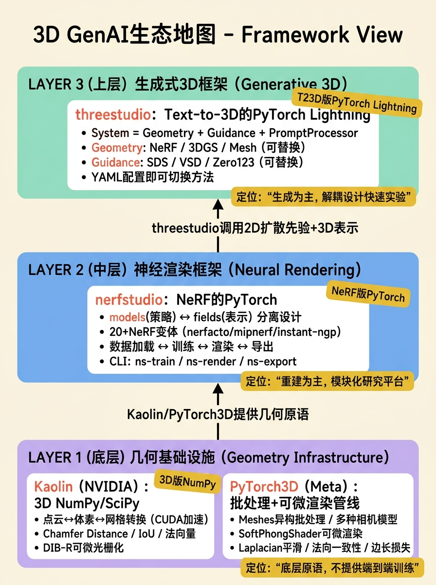
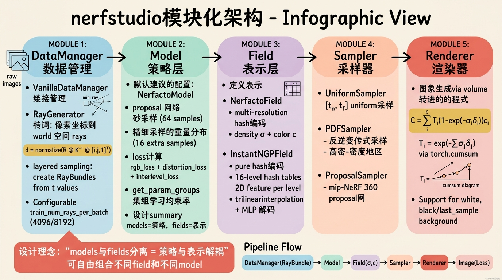
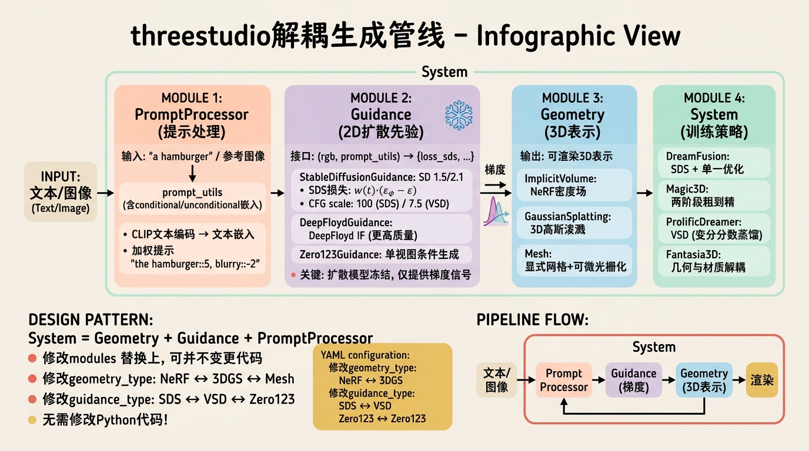
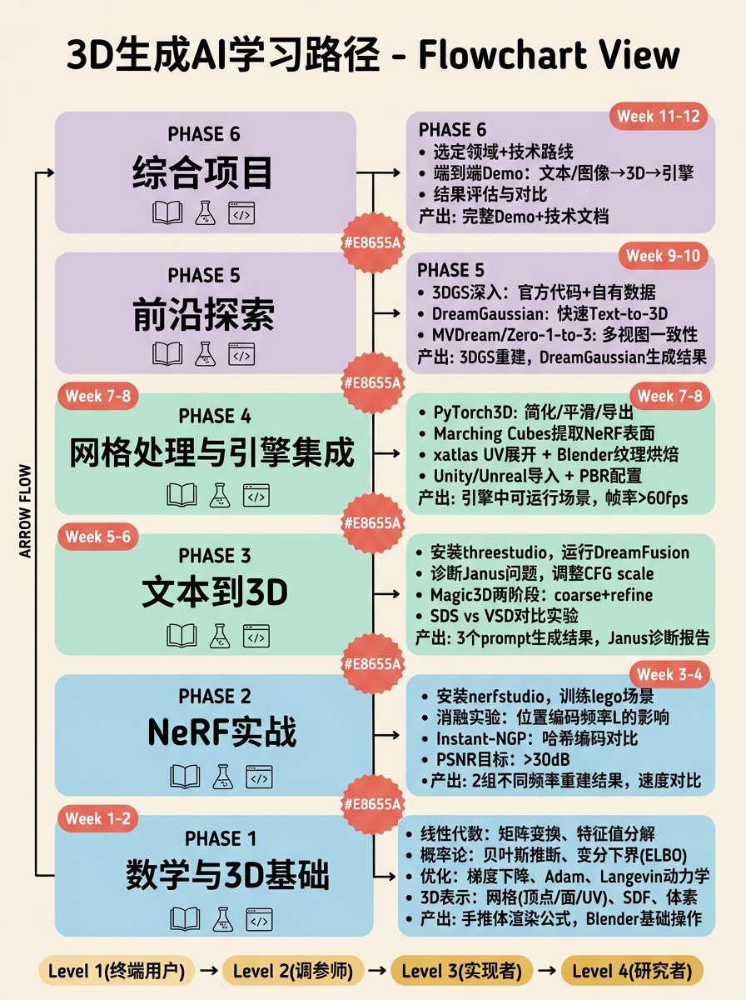
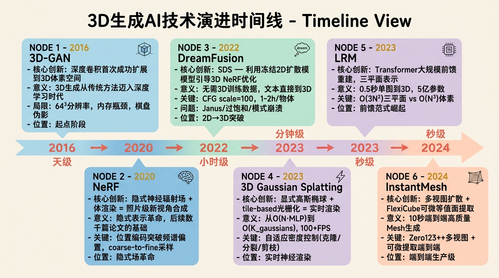

# 第六部分：实战与趋势篇——动手路径与未来展望

## 6.1 核心开源框架详解



在3D生成AI领域，框架的选择直接决定了实验的迭代速度和调试的便利程度。与2D视觉领域PyTorch和TensorFlow的二分天下不同，3D生成AI目前仍处在"工具链快速演化"的阶段。选择框架时，需要区分两个维度：一是**神经渲染框架**（负责从3D表示生成2D图像并反向传播梯度），二是**生成式3D框架**（负责调用2D先验或3D先验来优化3D表示）。nerfstudio属于前者，threestudio属于后者，而Kaolin和PyTorch3D则是更底层的几何操作基础设施。

### 6.1.1 nerfstudio



nerfstudio是社区目前最成熟、工程化程度最高的NeRF训练与渲染框架。它并非单一算法的复现，而是一个**模块化的NeRF研究平台**。其设计目标是将NeRFpipeline中的各个组件（数据加载、场表示、采样策略、体渲染、后处理）彻底解耦，使得研究者可以通过修改YAML配置文件或继承基类的方式快速组合出新方法。

#### 架构概览与源码导航

nerfstudio的目录结构反映了其严格的分层设计：

```
nerfstudio/
├── models/           # 模型定义，继承自Model基类
│   ├── base_surface_model.py  # 表面模型（NeuS, VolSDF风格）的抽象基类
│   ├── instant_ngp.py         # Instant-NGP的完整复现
│   ├── nerfacto.py            # 推荐的默认模型，集成多技术
│   └── mipnerf.py             # mip-NeRF 360实现
├── fields/           # 神经场表示，负责将空间坐标映射到密度/颜色/语义
│   ├── base_field.py
│   ├── instant_ngp_field.py   # 哈希编码+小MLP
│   └── nerfacto_field.py      # 基于哈希编码的NeRF场
├── model_components/ # 可复用组件，避免重复造轮子
│   ├── renderers.py           # 光线行进积分器
│   ├── loss.py                # MSE, Charbonnier, distortion loss等
│   └── ray_samplers.py        # 均匀采样、重要性采样、PDF采样
├── data/             # 数据IO与预处理
│   ├── dataparsers/           # COLMAP, blender, polycam, nuscenes等
│   └── datasets.py            # 内存映射与缓存策略
├── pipelines/        # 训练管线
│   └── base_pipeline.py       # 定义train/val步骤和优化器配置
└── engine/           # 训练引擎，基于PyTorch Lightning封装
    └── trainers.py
```

**关键设计哲学**：`models`与`fields`的分离。`models`负责"策略"（如proposal sampling、损失组合、参数调度），而`fields`只负责"表示"（给定坐标，输出属性）。这种分离使得你可以将Instant-NGP的哈希编码场（`instant_ngp_field.py`）与mip-NeRF的抗锯齿采样策略组合，而不需要重写整个训练循环。

#### 核心类源码级解析

**VanillaDataManager**
位于`nerfstudio/data/datamanagers/base_datamanager.py`。它继承自`DataManager`，是连接原始图像与模型输入的桥梁。其核心逻辑在`next_train`方法中：

1. 从缓存的图像数据集中随机抽取一个相机位姿和对应图像。
2. 调用`RayGenerator`（定义于`ray_generator.py`），利用相机内参（`fx, fy, cx, cy`）和外参（`camera_to_worlds`），将像素坐标`(i, j)`转换为世界空间中的射线。数学上，每条射线由原点`o`和方向`d`组成，其中`d = normalize(R @ K^{-1} @ [i, j, 1]^T)`，`R`为旋转矩阵，`K`为内参矩阵。
3. 对每条射线沿深度方向进行分层采样（`uniform sampler`或`PDF sampler`），生成`t`值（到原点的距离）。
4. 将`ray origins`、`ray directions`、`t`值打包为`RayBundle`对象，送入模型。

可配置的`train_num_rays_per_batch`直接控制显存占用。对于RTX 3090（24GB），通常设置为4096或8192；对于消费级显卡（8GB），需降至1024或2048。

**NerfactoModel**
位于`models/nerfacto.py`，是当前nerfstudio推荐的默认配置。它整合了mip-NeRF 360的提案网络（proposal network）和Instant-NGP的多分辨率哈希编码。

- **继承关系**：`NerfactoModel -> Model -> nn.Module`
- **核心方法**：
  - `get_param_groups`：将模型参数分为"proposal网络参数"和"场参数"，分别配置不同的学习率。
  - `get_outputs`：前向传播入口。接收`RayBundle`，首先通过`proposal sampler`进行粗采样（通常64个样本），评估proposal网络的密度得到一个粗略的权重分布；然后根据权重分布进行细采样（通常16个额外样本）；最后将所有样本点送入`NerfactoField`计算最终密度和颜色，并通过`RGBRenderer`进行体渲染积分。
  - `get_loss_dict`：组合`rgb_loss`、`distortion_loss`（来自mip-NeRF 360，防止浮点伪影）和`interlevel_loss`（proposal监督）。

**NERFRenderer**
位于`model_components/renderers.py`。这里实现了经典的体渲染方程：

$$C = \sum_{i=1}^{N} T_i (1 - \exp(-\sigma_i \delta_i)) c_i$$

其中透射率$T_i = \exp(-\sum_{j=1}^{i-1} \sigma_j \delta_j)$。nerfstudio的`RGBRenderer`使用`torch.cumsum`高效计算透射率，并通过`torch.nan_to_num`处理数值稳定性问题。源码中支持`background_color`参数，若设置为`"white"`，则在积分公式后加上透射率乘以白色背景；若设置为`"last_sample"`，则将最后一段的透射率无限延伸，模拟无限远背景。

**HashEncoding**
位于`fields/instant_ngp_field.py`或`model_components/encodings.py`。这是Instant-NGP的核心，实现了Thomas Müller提出的多分辨率哈希编码。

- 源码实现维护$L$个级别的哈希表，每个级别独立映射。
- 对于输入坐标$x$，在每个级别$l$中，先通过缩放因子$scale_l = \exp(\ln(N_{min}) + l \cdot \ln(N_{max}/N_{min}) / (L-1))$映射到体素网格。
- 确定$x$所在的体素，对该体素的8个角点进行三线性插值（`torch.lerp`嵌套三次）。
- 每个角点通过哈希函数映射到特征向量表$T$中的索引。哈希函数通常是$hash(x,y,z) = (x \cdot p_1 \oplus y \cdot p_2 \oplus z \cdot p_3) \mod T$。
- 最终，$L$个级别的特征向量拼接后送入MLP。

源码中一个关键的工程细节是**伪随机哈希冲突的处理**：由于$T$通常远小于网格分辨率（$T=2^{19}$），不同体素会映射到同一槽位。但实验发现，MLP能够自动学习消除冲突带来的噪声，这是该方法比八叉树或稠密网格更省内存的根本原因。

#### 运行一个完整实验的命令序列

以下命令在Ubuntu 22.04 + CUDA 11.8/12.1环境下可直接运行：

```bash
# 1. 创建隔离环境（强烈建议使用conda）
conda create -n nerfstudio python=3.8
conda activate nerfstudio

# 2. 安装PyTorch（根据CUDA版本调整）
pip install torch==2.1.2+cu118 torchvision==0.16.2+cu118 --extra-index-url https://download.pytorch.org/whl/cu118

# 3. 安装nerfstudio（包含tinycudann，可能需要编译）
pip install nerfstudio

# 4. 验证安装
ns-install-cli
ns-train -h | head -n 5

# 5. 下载示例数据（blender synthetic lego场景）
ns-download-data nerfstudio --capture-name=lego

# 6. 训练（nerfacto为默认推荐配置）
ns-train nerfacto \
    --data data/nerfstudio/lego \
    --pipeline.model.background-color white \
    --trainer.steps-per-save 2000 \
    --trainer.max-num-iterations 30000 \
    --logging.local-writer.max-log-size 10 \
    --pipeline.model.eval-num-rays-per-chunk 4096

# 7. 训练过程中查看TensorBoard（另开终端）
tensorboard --logdir outputs/

# 8. 渲染测试视角视频（spiral轨迹）
ns-render --load-config outputs/lego/nerfacto/.../config.yml \
    --traj spiral \
    --output-path renders/lego_spiral.mp4 \
    --rendered-output-names rgb

# 9. 导出点云（用于后续网格提取）
ns-export pointcloud --load-config outputs/.../config.yml \
    --output-dir exports/lego/ \
    --num-points 1000000 \
    --remove-outliers True
```

#### 关键配置参数的工程意义

- `pipeline.model.num-rays-per-batch`：每次迭代的光线数量。直接影响显存占用与梯度噪声。增大可减少噪声但占用更多显存。在nerfacto中，默认值会根据可用显存自动调整。
- `pipeline.model.cone-angle`：mip-NeRF 360中，用于近似像素 footprint 的锥形半角。值越大，抗锯齿效果越强，但proposal网络需要覆盖更大的尺度范围。对于高分辨率（>2K）输入，建议适当增大。
- `pipeline.model.near-plane/far-plane`：限制光线采样的深度范围。对于室内场景，near-plane设为0.05可避免相机附近的伪影；对于360度物体，far-plane设为4.0或更大以包含整个物体。
- `pipeline.model.hidden-dim`和`pipeline.model.num-levels`：控制MLP宽度和哈希编码级别数。增大`num-levels`（默认16）可提升高频细节，但会增加哈希表内存占用（线性增长）。

### 6.1.2 threestudio



如果说nerfstudio是"NeRF的PyTorch"，那么threestudio就是"Text-to-3D的PyTorch Lightning"。它的核心价值在于将Text-to-3D pipeline中的**3D表示（Geometry）**、**2D先验（Guidance）**、**文本处理（Prompt Processor）**三者解耦，使得研究者可以通过YAML配置文件快速组合不同的技术路线（例如用Gaussian Splatting替换NeRF，或用DeepFloyd替换Stable Diffusion）。

#### 架构概览与解耦设计

```
threestudio/
├── models/              # 3D表示（可替换）
│   ├── nerf.py          # NeRF密度场
│   ├── gaussian.py      # 3D Gaussian Splatting表示
│   └── mesh.py          # 显式网格（带可微光栅化）
├── systems/             # 训练系统（策略层）
│   ├── dreamfusion.py   # SDS损失 + 单一优化
│   ├── magic3d.py       # 两阶段粗到精
│   ├── prolificdreamer.py # VSD（变分分数蒸馏）
│   └── fantasia3d.py    # 几何与材质解耦
├── guidance/            # 2D扩散先验（黑盒监督信号）
│   ├── stable_diffusion_guidance.py  # SD 1.5/2.1
│   ├── deep_floyd_guidance.py        # DeepFloyd IF（更高质量）
│   └── zero123_guidance.py           # 单视图条件生成
├── prompt_processors/   # 文本处理与加权
│   └── base.py          # 支持"the hamburger::5, blurry:: -2"格式
└── data/                # 相机分布配置（球面/半球面均匀采样）
```

**核心设计模式**：System = Geometry + Guidance + PromptProcessor。在`systems/base.py`中，`BaseSystem`定义了标准的PyTorch Lightning `training_step`流程：

1. 从相机分布中采样一个批次相机参数（`elevation, azimuth, radius`）。
2. 通过当前3D表示（Geometry）渲染出RGB图像和/或法线图。
3. 将渲染图送入Guidance模块，计算SDS/VSD/CLIP损失。
4. 反向传播更新Geometry参数。

这种解耦的威力体现在配置文件中。以下是一个简化的YAML逻辑：

```yaml
system_type: dreamfusion
system:
  geometry_type: implicit-volume  # 可改为 "gaussian" 或 "mesh"
  geometry:
    radius: 1.0
    normal_type: analytic
  material_type: diffuse-with-point-light-material
  material:
    albedo_aug: true
  guidance_type: stable-diffusion-guidance
  guidance:
    pretrained_model_name_or_path: "runwayml/stable-diffusion-v1-5"
    guidance_scale: 100
    weighting_strategy: sds  # 可改为 "vsd"
  prompt_processor_type: base
  prompt_processor:
    prompt: "a hamburger"
```

只需修改`geometry_type`和`guidance_type`，即可在15分钟内从DreamFusion切换为DreamGaussian，而不需要修改任何Python代码。

#### 核心类解析：Guidance接口

所有Guidance模块继承自`threestudio.systems.base.BaseGuidance`，必须实现：

```python
def __call__(self, rgb: Float[Tensor, "B H W 3"], 
             prompt_utils: PromptProcessorOutput,
             elevation: Float[Tensor, "B"],
             azimuth: Float[Tensor, "B"],
             camera_distances: Float[Tensor, "B"],
             rgb_as_latents: bool = False,
             **kwargs) -> Dict[str, Any]:
    """
    输入:
        rgb: 渲染图像，范围[0, 1]
        prompt_utils: 编码后的文本嵌入（包括unconditional/negative）
        elevation/azimuth: 相机角度，用于计算文本加权（如"front view"）
    输出:
        dict，必须包含 "loss_sds" 或类似键
    """
```

在`stable_diffusion_guidance.py`中，核心逻辑是：
1. 将RGB渲染图通过VAE编码到潜空间`z_t`。
2. 根据当前时间步`t`加噪，得到`z_{t+1}`。
3. 将加噪潜变量送入U-Net预测噪声`eps_pred`。
4. 使用SDS公式计算梯度：`grad = w(t) * (eps_pred - eps) * ∂z / ∂theta`，其中`theta`是3D参数。

#### 运行Text-to-3D实验的完整流程

threestudio对显存要求较高（建议至少16GB），且依赖xformers加速：

```bash
# 1. 环境准备
conda create -n threestudio python=3.9
conda activate threestudio

# 2. 安装PyTorch
pip install torch==2.0.1+cu118 torchvision==0.15.2+cu118 --extra-index-url https://download.pytorch.org/whl/cu118

# 3. 安装xformers（关键加速库）
pip install xformers==0.0.22

# 4. 克隆并安装threestudio
git clone https://github.com/threestudio-project/threestudio.git
cd threestudio
pip install -r requirements.txt

# 5. 下载必要的配置模板
ls configs/

# --- 实验1: DreamFusion (SDS + NeRF) ---
python launch.py --config configs/dreamfusion-if.yaml \
    --train \
    system.prompt_processor.prompt="a DSLR photo of a delicious hamburger" \
    system.guidance.guidance_scale=100 \
    trainer.max_steps=10000

# --- 实验2: Magic3D（两阶段）---
# 阶段1: 粗NeRF优化
python launch.py --config configs/magic3d-coarse-if.yaml \
    --train \
    system.prompt_processor.prompt="a hamburger" \
    trainer.max_steps=5000

# 阶段1完成后，找到ckpt路径，例如 outputs/magic3d-coarse/.../ckpts/last.ckpt
# 阶段2: 精网格（从checkpoint恢复，切换到可微网格+表面渲染）
python launch.py --config configs/magic3d-refine-sd.yaml \
    --train \
    system.prompt_processor.prompt="a hamburger" \
    system.geometry.geometry_convert_from="outputs/magic3d-coarse/.../ckpts/last.ckpt" \
    trainer.max_steps=2000

# --- 实验3: ProlificDreamer (VSD) ---
python launch.py --config configs/prolificdreamer.yaml \
    --train \
    system.prompt_processor.prompt="a hamburger" \
    system.guidance.guidance_scale=7.5 \
    trainer.max_steps=25000
```

#### 关键超参数调试指南与故障排查

threestudio的训练过程比nerfstudio更不稳定，因为优化信号来自黑盒扩散模型。以下是基于社区issue和源码分析的调试手册：

**1. 全白/全黑输出**
- **现象**：渲染图在1000步后变为纯白色或纯黑色，或NaN。
- **根因**：通常不是扩散模型的问题，而是NeRF密度场的初始化或学习率导致。如果初始密度过低，光线无法命中任何表面，积分结果接近背景色；如果初始密度过高，则整个空间不透明。
- **源码修复**：在`models/geometry/implicit_volume.py`中，检查`self.density_activation`。默认使用`Softplus(beta=1, threshold=4)`，其零点附近输出约为0.69。可以尝试在配置中增加`system.geometry.density_bias = 0.1`或降低MLP学习率。
- **命令**：`python launch.py ... system.geometry.density_bias=0.1 trainer.optimizers.geometry.lr=0.001`

**2. Janus（双面神/多面）问题**
- **现象**：生成的物体在正面看起来正确，但背面出现了第二张脸，或侧面出现了重复结构。
- **根因**：2D扩散先验缺乏3D一致性。每个视角独立优化时，不同视角对应的梯度可能矛盾，模型为了同时满足多个视角的2D约束，选择了"在多个方向各放一个正面"的次优解。
- **修复方案**：
  - 使用`perp_neg`（Perpendicular Negative Prompting）：在`configs/`中查找包含`perp_neg`的配置，它会为侧面视图生成额外的负面提示"front view of ..."，惩罚侧面出现正面特征。
  - 降低CFG scale：`guidance_scale`从100降至50-75，减少对文本的过度拟合。
  - 使用视角相关的文本加权：例如`"front view of a hamburger, side view of a hamburger"`，通过`prompt_processor`的`front/left/right/back`模板实现。

**3. 浮点（Floaters）**
- **现象**：主体周围出现不透明的漂浮颗粒。
- **根因**：空间中远离主体的区域偶然产生了高密度，且SDS损失无法有效惩罚这些不可见的浮点（因为它们在某些视角下可能被遮挡，或在背景中不显眼）。
- **修复方案**：
  - 启用`sparsity_loss`或`opacity_loss`：在配置中增加`system.loss.lambda_sparsity=0.01`。
  - 增加TV（Total Variation）正则化：在空间密度场上施加TV loss，惩罚剧烈变化。
  - 调整`near_plane`：将相机近裁剪面从0.0提高到0.1，避免相机附近生成伪影。

**4. 颜色过饱和**
- **现象**：生成物体颜色极其鲜艳，不符合真实感。
- **根因**：CFG scale过高（>100）时，扩散模型的预测倾向于高对比度、高饱和度以匹配文本，这种偏差通过SDS传递到了3D表示。
- **修复**：将`guidance_scale`降至7.5-20（如果使用VSD，通常不需要很高的CFG）。或在渲染时使用`albedo_aug`（材质解耦）来分离光照和纹理。

### 6.1.3 Kaolin（NVIDIA）

Kaolin的定位非常明确：**它不是端到端训练框架，而是3D深度学习的"NumPy/SciPy"**。如果你需要实现一个自定义的NeRF损失函数，或者从NeRF提取Mesh后进行简化和平滑，Kaolin提供了经过CUDA加速的原语操作。

#### 核心功能模块详解

**kaolin.ops.conversions**
这是表示转换的核心。在3D生成pipeline中，经常需要在不同表示间切换：

```python
import torch
import kaolin

# 假设我们有一个NeRF提取的密集点云 [N, 3]
points = torch.rand(100000, 3).cuda()

# 点云转体素网格（用于后续Marching Cubes）
# voxelgrid形状为 [batch, depth, height, width]
voxelgrid = kaolin.ops.conversions.pointclouds_to_voxelgrids(
    points.unsqueeze(0),  # [1, N, 3]
    resolution=128        # 128^3 网格
)
# 返回 occupancy grid，可以用作 SDF 的初始猜测

# 体素转网格（通过 Marching Cubes，CUDA加速）
# 需要提供一个占用阈值
vertices, faces = kaolin.ops.conversions.voxelgrids_to_trianglemeshes(
    voxelgrid, 
    iso_value=0.5
)
```

**kaolin.ops.mesh**
在显式网格优化中（如Magic3D第二阶段），需要计算微分几何属性：

```python
# vertices: [V, 3], faces: [F, 3]
vertices = torch.rand(100, 3).cuda().requires_grad_(True)
faces = torch.randint(0, 100, (200, 3)).cuda()

# 1. 计算均匀拉普拉斯矩阵（用于平滑损失）
# L的形状为 [V, V]，是一个稀疏矩阵
laplacian = kaolin.ops.mesh.uniform_laplacian(
    vertices, faces
)
# 平滑损失 = ||L @ vertices||^2
laplacian_loss = (laplacian.mm(vertices)).pow(2).mean()

# 2. 计算网格法向量（面法向和顶点法向）
face_normals = kaolin.ops.mesh.face_normals(vertices, faces, unit=True)
vertex_normals = kaolin.ops.mesh.vertex_normals(
    vertices, faces, face_normals=face_normals
)

# 3. 计算三角形面积（用于采样）
face_areas = kaolin.ops.mesh.face_areas(vertices, faces)
# 按面积加权采样点（用于渲染或损失计算）
sampled_points, face_idx = kaolin.ops.mesh.sample_points(
    vertices, faces, num_samples=10000, areas=face_areas
)
```

**kaolin.metrics**
在评估生成质量时，避免自己实现低效的Chamfer Distance：

```python
# pred_points, gt_points: [1, N, 3] 或 [1, M, 3]
# chamfer_distance 返回 (dist, idx)，dist是双向平均距离
cd_loss, _ = kaolin.metrics.pointcloud.chamfer_distance(
    pred_points, gt_points
)

# 对于网格，计算IoU需要体素化
iou = kaolin.metrics.voxelgrid.iou(
    pred_voxel, gt_voxel
)
```

**kaolin.render**
Kaolin提供了DIB-R（Differentiable Image-based Rendering）的可微光栅化器。与PyTorch3D的NDC空间光栅化不同，DIB-R使用SoftRas风格的软光栅化，更适合处理不完整的网格：

```python
from kaolin.render.mesh import dibr_rasterization, texture_mapping

# 投影顶点并光栅化
face_vertices_camera, face_vertices_image, face_normals = \
    kaolin.render.mesh.prepare_vertices(
        vertices, faces, camera_proj
    )
rendered_image, render_mask = dibr_rasterization(
    image_height, image_width,
    face_vertices_camera[..., 2],  # face_z
    face_vertices_image,
    face_attributes,  # 如纹理坐标或颜色
    mode="bilinear"   # 或 "nearest"
)
```

### 6.1.4 PyTorch3D（Meta）

PyTorch3D的设计哲学与Kaolin不同：它更强调**批处理（batching）**和**可微渲染管线（differentiable rendering pipelines）**。如果你需要在Text-to-3D的第二阶段做网格渲染并反向传播到顶点，PyTorch3D提供了比Kaolin更完整的"相机 -> 光栅化 -> 着色"管线。

#### 核心模块与数据结构

**Meshes**：PyTorch3D的`Meshes`类能够自动计算边、面法向、邻接关系，并支持不同大小的网格批处理（通过`verts_packed()`和`faces_packed()`统一索引）。

```python
from pytorch3d.structures import Meshes

# 支持异构批次（batch中每个mesh顶点数不同）
verts_list = [torch.rand(100, 3), torch.rand(150, 3)]
faces_list = [torch.randint(0, 100, (250, 3)), torch.randint(0, 150, (300, 3))]
meshes = Meshes(verts=verts_list, faces=faces_list)

# 获取 packed 表示（所有mesh顶点拼接在一起）
verts_packed = meshes.verts_packed()  # [250, 3]
# 获取面到packed顶点的索引
faces_packed = meshes.faces_packed()  # [550, 3]
# 自动计算边
edges = meshes.edges_packed()
```

**Cameras**：支持多种相机模型，其中`FoVPerspectiveCameras`和`PerspectiveCameras`最常用。与nerfstudio的相机模型不同，PyTorch3D的相机使用OpenGL坐标系（相机朝向-Z），需要注意坐标系转换。

```python
from pytorch3d.renderer import PerspectiveCameras

# focal_length可以是像素值或NDC单位
cameras = PerspectiveCameras(
    focal_length=((fx, fy),),          # (N, 2)
    principal_point=((cx, cy),),       # (N, 2)
    R=R,                               # (N, 3, 3) 世界到相机
    T=T,                               # (N, 3) 相机中心
    image_size=((H, W),),
    in_ndc=False                       # 使用像素坐标
)
```

**Renderer**：组装光栅化器和着色器。

```python
from pytorch3d.renderer import (
    MeshRenderer, MeshRasterizer, SoftPhongShader,
    PointLights, RasterizationSettings
)

raster_settings = RasterizationSettings(
    image_size=512,
    blur_radius=0.0,          # 0为硬光栅化，>0为软光栅化（可微）
    faces_per_pixel=1,
    bin_size=None             # 自动选择
)

renderer = MeshRenderer(
    rasterizer=MeshRasterizer(
        cameras=cameras, 
        raster_settings=raster_settings
    ),
    shader=SoftPhongShader(
        device=device,
        cameras=cameras,
        lights=PointLights(device=device, location=[[0.0, 0.0, -3.0]])
    )
)

images = renderer(meshes)  # [B, H, W, 4] RGBA

# 损失反向传播
loss = ((images[..., :3] - target_images) ** 2).mean()
loss.backward()
# meshes.verts_list() 中的每个tensor现在都包含梯度
with torch.no_grad():
    for v in meshes.verts_list():
        v -= lr * v.grad
```

**Losses**：PyTorch3D内置了几何正则化损失，在网格优化中至关重要：

```python
from pytorch3d.loss import (
    mesh_laplacian_smoothing, 
    mesh_normal_consistency,
    mesh_edge_loss
)

# Laplacian smoothing: 惩罚顶点与其邻居的偏离
loss_laplacian = mesh_laplacian_smoothing(meshes, method="uniform")

# Normal consistency: 惩罚相邻面法向差异（保持表面平滑）
loss_normal = mesh_normal_consistency(meshes)

# Edge length: 惩罚长边，防止退化三角形
loss_edge = mesh_edge_loss(meshes)

total_loss = loss_laplacian * 0.1 + loss_normal * 0.01 + loss_edge * 0.1
```

### 6.1.5 Instant-NGP / 3D Gaussian Splatting

这两个项目代表了"实时神经渲染"的两种技术路线：**基于坐标编码的隐式表示**（Instant-NGP）和**基于显式基元的光栅化**（3D Gaussian Splatting）。

#### Instant-NGP

Instant-NGP的代码仓库（NVlabs/instant-ngp）包含两个部分：C++核心（CUDA）和Python绑定。其核心创新是多分辨率哈希编码，使得MLP可以在几秒内收敛。

**源码结构解析**：

```
instant-ngp/
├── include/neural-graphics-primitives/  # C++头文件
│   ├── common.h
│   ├── encoding.h                       # 编码基类
│   └── fully_fused_mlp.h                # 小MLP的CUDA融合kernel
├── src/                                 # 核心实现
│   ├── encoding.cu                      # 哈希编码的CUDA kernel
│   └── testbed.cu                       # 主渲染循环
├── dependencies/
│   └── tiny-cuda-nn/                    # 独立的核心库，包含所有编码和MLP
└── scripts/                             # Python辅助脚本
    ├── run.py                           # 训练脚本入口
    └── colmap2nerf.py                   # COLMAP位姿转换
```

tiny-cuda-nn是实际负责哈希编码和MLP前向/反向传播的库。在PyTorch绑定中，`tinycudann.Module`接收一个JSON配置来定义网络结构。

**安装与运行**：

```bash
# 1. 克隆（必须recursive，因为包含tiny-cuda-nn等子模块）
git clone --recursive https://github.com/NVlabs/instant-ngp.git
cd instant-ngp

# 2. 安装依赖
sudo apt-get install build-essential git libglfw3-dev libglew-dev
# Windows需安装CUDA Toolkit和Visual Studio 2019+

# 3. 编译
cmake . -B build -DCMAKE_BUILD_TYPE=RelWithDebInfo
cmake --build build --config RelWithDebInfo -j

# 4. 运行（支持NeRF格式、NV格式、COLMAP格式）
# 对NeRF synthetic数据（json格式）：
./build/testbed --scene data/nerf/lego/transforms_train.json

# 5. 训练并保存
# GUI中按Ctrl+S保存网络权重
# 或使用Python脚本训练：
python scripts/run.py --scene data/nerf/fox --mode nerf --save_snapshot fox.ingp
```

**关键参数数学解释**：
在tiny-cuda-nn的JSON配置中：

```json
{
    "encoding": {
        "otype": "HashGrid",
        "n_levels": 16,        // L: 哈希表级数，越多越能表示高频细节
        "n_features_per_level": 2, // F: 每级特征维度，通常2或4
        "log2_hashmap_size": 19,   // log2(T): T=2^19=524288，哈希表总大小
        "base_resolution": 16,     // N_min: 最粗网格分辨率
        "per_level_scale": 2.0     // 每级分辨率增长因子，决定N_max
    },
    "network": {
        "otype": "FullyFusedMLP",
        "n_neurons": 64,
        "n_hidden_layers": 2,
        "activation": "ReLU",
        "output_activation": "None"
    }
}
```

- **Hash冲突与$T$的选择**：$T$越大，冲突越少，但显存占用线性增长。对于$N_{max}=2048$的16级网格，如果直接存储，需要$(2048)^3 \times 16 \times 2 \times 4 \text{ bytes} \approx 1TB$；而哈希表$T=2^{19}$仅需$2^{19} \times 2 \times 4 = 4MB$。冲突通过MLP的泛化能力自动解决。
- **$N_{max}$的计算**：源码中$N_{max} = N_{min} \times \text{per\_level\_scale}^{L-1}$。对于$N_{min}=16, \text{scale}=2, L=16$，$N_{max} \approx 524288$。过大的$N_{max}$对于简单场景是浪费，过小的$N_{max}$则无法捕捉发丝级别的细节。

#### 3D Gaussian Splatting

3D Gaussian Splatting（3DGS）通过显式的3D高斯椭球集合来表示场景，每个高斯由中心位置$\mu$、协方差矩阵$\Sigma$（分解为旋转$R$和尺度$S$）、不透明度$\alpha$和球谐系数（SH）颜色组成。其革命性在于提出了**tile-based rasterizer**，使得在RTX 3090上实现1080p@60fps的渲染成为可能。

**官方代码结构解析**：

```
gaussian-splatting/
├── scene/
│   ├── __init__.py          # 场景初始化，创建相机、高斯模型
│   ├── gaussian_model.py    # 核心：高斯参数的存储、优化、密度控制
│   ├── dataset_readers.py   # COLMAP/Blender数据加载
│   └── cameras.py           # 相机类（与COLMAP对齐）
├── gaussian_renderer/
│   ├── __init__.py          # 调用CUDA rasterizer的Python接口
│   └── diff_gaussian_rasterization/  # 子模块：CUDA光栅化前后向
├── utils/
│   ├── general_utils.py     # 辅助函数
│   └── system_utils.py      # 打印系统信息
├── train.py                 # 训练主循环
└── render.py                # 从checkpoint渲染视频/图像
```

**GaussianModel核心源码分析**：
在`scene/gaussian_model.py`中，`GaussianModel`继承自`torch.nn.Module`，但并未使用传统的`nn.ParameterList`，而是显式注册参数：

```python
class GaussianModel(nn.Module):
    def __init__(self, sh_degree: int):
        super().__init__()
        self._xyz = torch.empty(0)              # [N, 3] 中心
        self._features_dc = torch.empty(0)      # [N, 1, 3] 0阶SH（漫反射）
        self._features_rest = torch.empty(0)    # [N, K, 3] 高阶SH
        self._opacity = torch.empty(0)          # [N, 1] 经过sigmoid前
        self._scaling = torch.empty(0)          # [N, 3] 对数空间
        self._rotation = torch.empty(0)         # [N, 4] 四元数
        self.max_radii2D = torch.empty(0)       # 2D投影半径（用于密度控制）
        # ...
```

**协方差的几何意义**：3D高斯在视图空间中的投影是2D高斯。协方差矩阵$\Sigma = RSS^TR^T$。为了保证正定性，源码中不直接优化$\Sigma$，而是优化缩放（对数空间保证正数）和旋转（四元数，然后归一化为单位四元数）。在CUDA kernel中，视图变换后的协方差通过$JW\Sigma W^TJ^T$计算，其中$J$是投影变换的仿射近似的雅可比矩阵，$W$是视图矩阵。

**关键超参数在训练中的作用**：
在`arguments/__init__.py`和`train.py`中：

- `densify_grad_threshold`：默认0.0002。如果某个高斯在视图空间中的位置梯度（由光度误差反向传播产生）超过此阈值，说明该区域欠重建（大误差）且细节丰富（梯度大），需要进行密度控制。
- `densification_interval`：默认100步。每100步检查一次密度控制。
- `opacity_reset_interval`：默认3000步。由于透明度的优化存在正反馈（不透明->更多梯度->更不透明），源码中会周期性地将所有高斯的不透明度重置为一个很小的值，打破累积误差，允许优化过程重新分配高斯。
- `densify_until_iter`：默认15000步。超过此迭代后停止分裂/克隆，仅继续优化SH和位置，防止过拟合。

**运行命令**：

```bash
# 1. 环境（要求CUDA >= 11.0, PyTorch >= 1.12）
conda create -n gaussian_splatting python=3.8
conda activate gaussian_splatting
conda install pytorch torchvision torchaudio pytorch-cuda=11.8 -c pytorch -c nvidia
pip install plyfile tqdm

# 2. 克隆（包含子模块 diff-gaussian-rasterization）
git clone --recursive https://github.com/graphdeco-inria/gaussian-splatting.git
cd gaussian-splatting
pip install submodules/diff-gaussian-rasterization
pip install submodules/simple-knn

# 3. 数据准备（使用COLMAP格式或已有的nerfstudio输出）
# 如果使用COLMAP:
# colmap feature_extractor ... (详见6.3节)
# colmap mapper ...

# 4. 训练
python train.py -s path/to/colmap/output \
    --model_path output/trained_model \
    --iterations 30000 \
    --densify_grad_threshold 0.0002 \
    --densify_until_iter 15000

# 5. 渲染视频
python render.py -m output/trained_model --iteration 30000

# 6. 导出为点云或PLY（可用 external viewer 如 SIBR 或 Unity插件查看）
python export.py -m output/trained_model --iteration 30000
```

## 6.2 推荐入门实验路线（按周规划）



以下路线假设学习者具备深度学习基础（了解PyTorch、CNN、Transformer），但无需3D图形学背景。每周投入时间约10-15小时。

### 第1-2周：NeRF基础与体渲染

**Day 1-2：理论准备与公式推导**
- 阅读原始NeRF论文（Mildenhall et al., ECCV 2020）的Section 3和Section 4。
- 手推体渲染方程的离散近似：
  给定光线上的采样点$\mathbf{x}_i = \mathbf{o} + t_i \mathbf{d}$，模型输出体积密度$\sigma_i$和颜色$\mathbf{c}_i$。相邻样本间距为$\delta_i = t_{i+1} - t_i$。透射率（不透明度累积）为$T_i = \exp(-\sum_{j=1}^{i-1} \sigma_j \delta_j)$。最终颜色为：
  $$\hat{C} = \sum_{i=1}^{N} T_i (1 - \exp(-\sigma_i \delta_i)) \mathbf{c}_i$$
- 理解位置编码的数学动机：原始的$xyz$坐标属于低频信号，通过$\gamma(p) = (\sin(2^0 \pi p), \cos(2^0 \pi p), \dots, \sin(2^{L-1} \pi p), \cos(2^{L-1} \pi p))$映射到高维，使得MLP能够学习高频细节。

**Day 3-4：安装与首次训练**
- 按照6.1.1节的命令安装nerfstudio。
- 下载lego数据并运行nerfacto训练。
- 在TensorBoard中观察以下曲线：
  - `train/loss`：应在前2K步快速下降，随后缓慢收敛。
  - `train/psnr`：最终应达到30dB以上（synthetic数据）。
  - `train/num_rays_per_sec`：反映训练吞吐，可用于对比不同GPU。

**Day 5-6：消融实验——位置编码的影响**
在nerfstudio源码中，位置编码的实现位于`model_components/encodings.py`中的`NeRFEncoding`。为了观察$L$的影响，不需要修改源码，只需在训练命令中覆盖配置：

```bash
# 原始 L=10 for position, L=4 for direction
# 实验1: 降低频率
ns-train nerfacto --data data/nerfstudio/lego \
    --pipeline.model.num-pos-frequency 5 \
    --pipeline.model.num-dir-frequency 2 \
    --experiment-name lego_low_freq

# 实验2: 提高频率
ns-train nerfacto --data data/nerfstudio/lego \
    --pipeline.model.num-pos-frequency 20 \
    --pipeline.model.num-dir-frequency 6 \
    --experiment-name lego_high_freq

# 对比：低频率会导致表面模糊（高频几何丢失）；高频率可能导致过拟合和训练不稳定。
```

**Day 7：Instant-NGP论文与哈希编码理解**
- 阅读Instant-NGP论文（Müller et al., SIGGRAPH 2022）。
- 重点理解Figure 2和哈希编码的冲突机制。
- 可选：运行Instant-NGP官方代码，对比其训练速度（lego场景通常在5分钟内收敛，而原始NeRF需要数小时）。

### 第3-4周：文本到3D生成

**Day 8-10：threestudio安装与DreamFusion复现**
- 按照6.1.2节的命令配置环境。
- 运行DreamFusion实验，选择简单的提示词，如"a pineapple"。
- **关键观察**：使用TensorBoard监控`guidance/sds_loss`和`guidance/grad_norm`。如果`grad_norm`在初期爆炸（>1000），说明CFG scale过大或学习率过高。

**Day 11-12：Prompt工程与Janus问题诊断**
- 尝试3组对比实验，记录生成结果：

| 配置 | Prompt | CFG Scale | 结果（是否Janus） |
|------|--------|-----------|------------------|
| 1 | "a pineapple" | 100 | 记录 |
| 2 | "a pineapple" | 50 | 记录 |
| 3 | "a 3D render of a pineapple, front view" | 100 | 记录 |

- Janus诊断：检查渲染的法线图。如果正面和背面法线都呈现出正面特征（如正面脸的法线朝前，背面脸法线也朝前），则可确认Janus。修复方法：在配置中启用`perp_neg`或使用视角加权提示。

**Day 13-14：Magic3D两阶段管线**
- 运行Magic3D的coarse和refine阶段。
- **对比指标**：使用CLIP score定量评估（可用`threestudio/utils/clip.py`中的工具，或自行编写）：
  ```python
  import clip
  import torch
  from PIL import Image

  model, preprocess = clip.load("ViT-B/32", device="cuda")
  image = preprocess(Image.open("render.png")).unsqueeze(0).cuda()
  text = clip.tokenize(["a pineapple"]).cuda()
  with torch.no_grad():
      image_features = model.encode_image(image)
      text_features = model.encode_text(text)
      similarity = (image_features @ text_features.T).item()
  ```
- 观察：第二阶段（mesh refine）通常在几何细节上优于第一阶段（NeRF），因为可微光栅化比体渲染具有更锐利的梯度。

**Day 15：SDS vs VSD对比**
- 使用相同prompt运行DreamFusion（SDS）和ProlificDreamer（VSD）。
- 观察差异：
  - SDS结果通常更饱和、更平滑，但可能过拟合到某几个视角。
  - VSD结果细节更丰富、更符合多视图一致性，但训练时间更长（2-4倍）。
- 记录显存占用：`nvidia-smi`观察峰值显存。VSD由于需要维护额外的LoRA网络，显存占用通常比SDS高4-6GB。

### 第5-6周：表示转换与网格处理

**Day 16-17：PyTorch3D网格操作**
- 加载一个从threestudio导出的OBJ文件，进行简化和平滑：
  ```python
  import torch
  from pytorch3d.structures import Meshes
  from pytorch3d.loss import mesh_laplacian_smoothing, mesh_edge_loss
  from pytorch3d.io import load_obj, save_obj

  verts, faces, aux = load_obj("model.obj")
  faces_idx = faces.verts_idx.cuda()
  verts = verts.cuda().requires_grad_(True)

  mesh = Meshes(verts=[verts], faces=[faces_idx])

  optimizer = torch.optim.Adam([verts], lr=0.01)
  for i in range(100):
      optimizer.zero_grad()
      loss = mesh_laplacian_smoothing(mesh) * 0.1 + mesh_edge_loss(mesh) * 0.1
      loss.backward()
      optimizer.step()
      mesh = Meshes(verts=[verts], faces=[faces_idx])  # 重新计算法向等

  save_obj("smoothed.obj", verts, faces_idx)
  ```

**Day 18-19：从NeRF提取显式网格**
- 方法1：使用nerfstudio的导出工具：
  ```bash
  ns-export tsdf --load-config outputs/.../config.yml --output-dir mesh/
  ```
- 方法2：使用PyMCubes（纯Python，适合理解算法）：
  ```python
  import mcubes
  import numpy as np
  import torch

  # 在[-1, 1]^3空间内创建256^3的密度网格
  resolution = 256
  x = torch.linspace(-1, 1, resolution)
  y = torch.linspace(-1, 1, resolution)
  z = torch.linspace(-1, 1, resolution)
  grid_x, grid_y, grid_z = torch.meshgrid(x, y, z, indexing='ij')
  points = torch.stack([grid_x, grid_y, grid_z], dim=-1).reshape(-1, 3).cuda()

  # 查询NeRF密度（需要加载训练好的模型）
  # density = model.density(points)  # [N, 1]
  # density_grid = density.reshape(resolution, resolution, resolution).cpu().numpy()

  # 使用Marching Cubes提取表面（isosurface=10，根据场景调整）
  # vertices, triangles = mcubes.marching_cubes(density_grid, 10)
  # mcubes.export_obj(vertices, triangles, "extracted.obj")
  ```
- 对比不同分辨率（128 vs 256 vs 512）的提取结果：分辨率越高，细节越多，但浮点伪影也可能增加。

**Day 20-21：UV展开实验**
- 使用xatlas进行自动化UV展开（适合快速实验）：
  ```bash
  pip install xatlas
  ```
  ```python
  import xatlas
  import numpy as np
  import trimesh

  mesh = trimesh.load("extracted.obj")
  vmapping, indices, uvs = xatlas.parametrize(
      mesh.vertices.astype(np.float32),
      mesh.faces.astype(np.uint32)
  )
  # vmapping: 新顶点索引映射
  # indices: 新的面索引（指向新顶点列表）
  # uvs: 每个新顶点的UV坐标
  ```
- 观察：对于复杂拓扑（如有很多孔洞的物体），xatlas可能产生碎片化的UV岛。对比Blender的智能UV投射（Smart UV Project）结果。

**Day 22：纹理烘焙**
- 将高模（高密度网格或NeRF直接渲染）的细节烘焙到低模的纹理贴图上。
- 使用Blender Python API自动化：
  ```python
  import bpy

  # 清除场景
  bpy.ops.object.select_all(action='SELECT')
  bpy.ops.object.delete()

  # 导入高模和低模
  bpy.ops.import_scene.obj(filepath="high_res_mesh.obj")
  high = bpy.context.selected_objects[0]
  bpy.ops.import_scene.obj(filepath="low_res_mesh.obj")
  low = bpy.context.selected_objects[0]

  # 创建烘焙图像
  image = bpy.data.images.new("BakeTexture", 2048, 2048)
  mat = bpy.data.materials.new(name="BakeMat")
  # ... 配置材质节点连接图像纹理 ...
  # 注意：完整脚本较长，建议参考Blender官方文档的Bake API
  bpy.ops.object.bake(
      type='DIFFUSE',
      pass_filter={'COLOR'},
      filepath="baked_texture.png",
      width=2048, height=2048
  )
  ```

### 第7-8周：引擎集成与自动化

**Day 23-25：Unity/Unreal导入与PBR配置**
- **Unity流程**：
  1. 将OBJ/FBX导入Assets。
  2. 创建Material，选择URP/Lit或HDRP/Lit shader。
  3. 将烘焙的漫反射贴图（Albedo）、法线贴图（Normal）、粗糙度贴图（Roughness）赋给对应槽位。
  4. 在Inspector中调整Metallic和Smoothness。
- **Unreal流程**：
  1. 导入FBX，确保"Import Normals and Tangents"勾选。
  2. 创建Material，将Texture Sample节点连接到Base Color、Normal、Roughness。
  3. 设置Material Domain为Surface，Blend Mode为Opaque。

**Day 26-28：性能评估**
- **Unity**：使用Profiler（Window -> Analysis -> Profiler）或命令行模式：
  ```bash
  # 运行场景并记录性能
  /path/to/Unity -batchmode -projectPath ./MyProject -executeMethod PerformanceTest.Run
  ```
  关注指标：Batches, SetPass Calls, Triangle Count, GPU Memory。
- **Unreal**：使用`stat unit`和`stat gpu`命令查看帧时间。对于生成的3D资产，特别注意：
  - Draw Call是否过高（高模导致）：需要通过LOD或合并网格优化。
  - 纹理内存：4K纹理在移动设备上过重，应提供512/1024/2048的多级纹理。

**Day 29-30：端到端自动化脚本**
编写一个Python脚本，串联从文本到引擎资产的流程：

```python
#!/usr/bin/env python3
"""
text_to_engine.py: 从文本提示词自动生成引擎就绪的3D资产
依赖: threestudio, trimesh, xatlas, blender (命令行)
"""

import subprocess
import os
import sys
import shutil

PROMPT = "a wooden chair with cushion"
OUTPUT_DIR = "./output"
BLENDER_PATH = "/usr/bin/blender"  # 或 Windows 下的 blender.exe

def run_threestudio():
    """阶段1: 使用threestudio生成网格"""
    cmd = [
        "python", "threestudio/launch.py",
        "--config", "threestudio/configs/magic3d-refine-sd.yaml",
        "--train",
        f"system.prompt_processor.prompt={PROMPT}",
        "--exp_root", OUTPUT_DIR
    ]
    subprocess.run(cmd, check=True)
    # 假设输出在 output/magic3d-refine/.../save/
    return os.path.join(OUTPUT_DIR, "it5000-export/model.obj")

def process_mesh(input_obj):
    """阶段2: 使用trimesh修复，xatlas展UV"""
    import trimesh
    import xatlas
    import numpy as np

    mesh = trimesh.load(input_obj)
    # 修复：合并顶点，移除退化面
    mesh.merge_vertices()
    mesh.remove_degenerate_faces()
    mesh.remove_duplicate_faces()

    # UV展开
    vmapping, indices, uvs = xatlas.parametrize(
        mesh.vertices.astype(np.float32),
        mesh.faces.astype(np.uint32)
    )
    new_verts = mesh.vertices[vmapping]

    # 保存带UV的OBJ
    out_path = os.path.join(OUTPUT_DIR, "processed.obj")
    with open(out_path, 'w') as f:
        for v in new_verts:
            f.write(f"v {v[0]} {v[1]} {v[2]}\n")
        for vt in uvs:
            f.write(f"vt {vt[0]} {vt[1]}\n")
        for face in indices:
            f.write(f"f {face[0]+1}/{face[0]+1} {face[1]+1}/{face[1]+1} {face[2]+1}/{face[2]+1}\n")
    return out_path

def bake_and_export(input_obj):
    """阶段3: 调用Blender烘焙纹理并导出FBX"""
    blender_script = f"""
import bpy
bpy.ops.object.select_all(action='SELECT')
bpy.ops.object.delete()
bpy.ops.import_scene.obj(filepath="{input_obj}")
# 这里可以添加自动展UV和烘焙逻辑
bpy.ops.export_scene.fbx(
    filepath="{os.path.join(OUTPUT_DIR, 'final.fbx')}",
    use_selection=True,
    path_mode='COPY',
    embed_textures=True
)
"""
    script_path = os.path.join(OUTPUT_DIR, "bake.py")
    with open(script_path, 'w') as f:
        f.write(blender_script)

    cmd = [BLENDER_PATH, "--background", "--python", script_path]
    subprocess.run(cmd, check=True)

if __name__ == "__main__":
    os.makedirs(OUTPUT_DIR, exist_ok=True)
    raw_mesh = run_threestudio()
    processed_mesh = process_mesh(raw_mesh)
    bake_and_export(processed_mesh)
    print(f"[Done] Engine-ready asset: {os.path.join(OUTPUT_DIR, 'final.fbx')}")
```

### 第9-12周：进阶前沿与领域应用

**Week 9：3D Gaussian Splatting深入**
- 阅读3DGS论文（Kerbl et al., SIGGRAPH 2023），重点理解tile-based rasterizer的CUDA实现。
- 运行官方代码，尝试用自己的COLMAP数据训练。
- 修改`densify_grad_threshold`，观察对点数和渲染质量的影响。

**Week 10：3DGS-based生成**
- 运行DreamGaussian（基于3DGS的Text-to-3D，训练时间约5分钟）：
  ```bash
  git clone https://github.com/dreamgaussian/dreamgaussian.git
  cd dreamgaussian
  # 根据README配置环境
  python main.py --config configs/text.yaml prompt="a corgi"
  ```
- 对比DreamGaussian与Magic3D：速度提升约20倍，但几何细节略逊，适合快速原型。

**Week 11：多视图一致性前沿**
- 阅读MVDream（Shi et al., ICLR 2024）和Zero-1-to-3（Liu et al., CVPR 2023）。
- 尝试运行Zero-1-to-3：给定单张图像，生成多视图一致的轨道视频。
- 理解MVDream的多视图联合扩散：训练时输入4个正交视图，通过3D-aware attention保证一致性。

**Week 12：领域应用项目**
- 选择一个细分领域（如医学器官建模、工业设计、古建筑复原、游戏道具）。
- 收集领域数据（或利用现有数据集），运行一个端到端实验。
- 撰写实验报告，包含：数据说明、方法选择理由、定性/定量结果、失败案例分析。

## 6.3 数据集详解与获取实践

数据集是3D生成AI的燃料。与2D图像数据集不同，3D数据集涉及多种表示格式（mesh, point cloud, SDF, NeRF weights），且规模普遍较小（最大的Objaverse-XL约10M，而LAION-5B是5B张图像）。理解每个数据集的结构和局限，是设计实验的第一步。

### ShapeNet

- **规模**：55个类别，约51,300个模型。最常用的子集是ShapeNetCore。
- **格式**：每个模型包含`.obj`（几何）、`.mtl`（材质引用）、`.jpg/.png`（纹理）。
- **特点**：
  - CAD模型，轴对齐，单位归一化到单位球内。
  - 大部分是水密的（watertight），适合作为SDF监督的GT。
  - 类别标签精确，适合训练条件生成模型。
- **加载方式**：
  ```python
  import json
  from pathlib import Path
  import trimesh

  shapenet_dir = Path("/datasets/ShapeNetCore.v2")
  # 类别到synsetId映射
  with open(shapenet_dir / "taxonomy.json") as f:
      taxonomy = json.load(f)

  # 加载一个椅子
  synset_id = "03001627"  # chair
  model_id = "1a6f615e8b1b5ae4dbbc9440457e303e"
  mesh_path = shapenet_dir / synset_id / model_id / "models/model_normalized.obj"
  mesh = trimesh.load(mesh_path, force='mesh')
  print(mesh.vertices.shape, mesh.faces.shape)  # 如 (2156, 3) (4376, 3)

  # 检查是否水密
  print(mesh.is_watertight)
  ```
- **局限**：领域 gap 极大。ShapeNet是简洁的CAD模型，缺乏真实世界的纹理、磨损、光照效果。直接用ShapeNet训练真实场景重建会导致严重的分布偏移。

### Objaverse / Objaverse-XL

Objaverse是3D生成领域的"LAION时刻"——它证明了大规模、弱监督、多样化的3D数据能够训练出强大的先验模型。

- **规模**：Objaverse 800K；Objaverse-XL超过10M。
- **来源**：Sketchfab、GitHub等互联网来源，由上传者附带文本描述和标签。
- **特点**：
  - 极度多样化：从工业零件到幻想生物，从低多边形到高模扫描。
  - 附带文本：每个模型有标题、描述、标签。
  - 质量参差不齐：包含大量破损网格、错误法线、非流形几何。
- **加载方式**：
  ```python
  import objaverse
  # 无需下载整个数据集，按需加载
  uids = objaverse.load_uids()  # 获取所有UID
  print(len(uids))  # > 800000

  # 下载前100个模型（返回本地路径字典）
  objects = objaverse.load_objects(uids=uids[:100])
  for uid, path in objects.items():
      print(uid, path)  # path 指向本地 .glb 或 .gltf 文件

  # 加载元数据（文本描述）
  metadata = objaverse.load_annotations(uids[:100])
  print(metadata[uids[0]]["name"])
  print(metadata[uids[0]]["description"])
  ```
- **清洗建议**：
  ```python
  import trimesh

  def is_valid_mesh(path):
      try:
          mesh = trimesh.load(path, force='mesh')
          if len(mesh.vertices) < 100:
              return False
          if not mesh.is_watertight:
              return False
          return True
      except Exception:
          return False
  ```

### Google Scanned Objects (GSO)

- **规模**：约1,030个真实世界的日常物体（玩具、家居用品）。
- **特点**：
  - 照片级真实：使用Google的扫描仪捕获，包含复杂的材质和表面细节。
  - 多视角图像：每个物体附带约250张不同角度的图像及相机位姿。
  - 尺寸真实：保留了真实世界的物理尺寸。
- **使用场景**：主要用于评估NeRF/3DGS的重建质量，因为GT mesh和GT多视图都可用。
- **加载**：可通过TensorFlow Datasets获取：
  ```python
  import tensorflow_datasets as tfds

  ds = tfds.load("google_scanned_objects", split="train")
  for example in ds.take(1):
      image = example["image"]  # [H, W, 3]
      mask = example["mask"]    # [H, W, 1]
      # 注意：完整加载需要配置TFDS路径
  ```

### ABO（Amazon-Berkeley Objects）

- **规模**：约8,000个产品，来自亚马逊 listings。
- **特点**：
  - 每个产品包含：3D模型（glTF格式）、产品照片（真实世界拍摄，非渲染）、元数据（类别、材质描述）。
  - 多视角渲染图：提供围绕物体的固定轨道渲染。
  - PBR材质：包含base color, metallic, roughness, normal贴图。
- **用途**：材质生成（从单图预测PBR参数）、产品级3D重建。
- **加载**：
  ```python
  import json
  from pathlib import Path
  import pygltflib  # 或 trimesh

  abo_dir = Path("/datasets/abo")
  with open(abo_dir / "metadata.json") as f:
      metadata = json.load(f)

  # 加载一个产品的3D模型
  product_id = "B07... "
  model_path = abo_dir / "3dmodels" / f"{product_id}.glb"
  ```

### CO3D（Common Objects in 3D）

- **规模**：1.5M帧，50个类别，真实世界视频。
- **特点**：
  - 多视角+时序：每个样本是一段围绕物体的手机拍摄视频。
  - 相机位姿：通过SLAM估计，精度足以训练NeRF。
  - 分割掩码：前景/背景自动分割。
- **用途**：新视角合成、动态NeRF、类别级先验学习。
- **加载**：
  ```python
  from co3d.dataset import Co3dDataset
  # CO3D提供官方PyTorch Dataset
  dataset = Co3dDataset(
      frame_annotations_file="co3d/frame_annotations.jgz",
      sequence_annotations_file="co3d/sequence_annotations.jgz",
      subset=["apple", "oranges"],
  )
  ```

### 自组数据集：从零开始的采集流程

如果你的研究领域是医学、建筑、文物修复等垂直领域，公共数据集往往不够用。以下是经过验证的自组数据集采集流程：

**硬件需求**：任意现代智能手机（iPhone 12+/Pixel 6+，具备稳定的4K视频录制能力）。

**Step 1: 视频采集**
- 围绕目标物体录制30-60秒视频，帧率30fps。
- 关键原则：
  - 光照均匀，避免高光和阴影剧烈变化。
  - 覆盖物体所有可见表面，包括顶面和底面（如果可能）。
  - 保持移动平滑，不要突然加速或旋转。

**Step 2: COLMAP位姿估计**
```bash
# 创建项目结构
mkdir my_dataset && cd my_dataset
mkdir images

# 从视频中提取帧（每10帧取1张，避免过度冗余）
ffmpeg -i video.mp4 -vf "fps=3,scale=1920:-1" images/frame_%04d.jpg

# COLMAP稀疏重建
colmap feature_extractor \
    --database_path database.db \
    --image_path images/ \
    --ImageReader.camera_model OPENCV \
    --SiftExtraction.max_num_features 8192

colmap exhaustive_matcher \
    --database_path database.db

mkdir sparse
colmap mapper \
    --database_path database.db \
    --image_path images/ \
    --output_path sparse/

# （可选）COLMAP去畸变
mkdir dense
colmap image_undistorter \
    --image_path images/ \
    --input_path sparse/0/ \
    --output_path dense/ \
    --output_type COLMAP
```

**Step 3: 格式转换与质量筛选**
```bash
# 转换为nerfstudio格式（自动生成transforms.json）
ns-process-data images \
    --data images/ \
    --output-dir ./processed/ \
    --colmap-model-path sparse/0/

# 或者转换为Instant-NGP格式
python instant-ngp/scripts/colmap2nerf.py \
    --colmap_matcher exhaustive \
    --aabb_scale 4 \
    --images images/ \
    --text sparse/0/
```

**Step 4: 人工检查**
- 打开COLMAP GUI，检查稀疏重建的点云是否覆盖整个物体。
- 剔除位姿估计失败的图像（通常在transforms.json中只有少量图像注册成功）。
- 如果重建失败，通常是纹理重复区域（如纯白墙面）导致特征匹配失败。解决方法是在物体周围放置报纸、便利贴等辅助纹理。

## 6.4 当前核心挑战的深度分析

3D生成AI在2024年仍处于"从玩具到工具"的过渡期。要理解未来的技术路线，必须深入分析当前的根本性限制，而非仅仅罗列现象。

### 6.4.1 几何精细度：为什么生成的3D总是"糊"的？

**根本原因的三层拆解**：

1. **2D先验的分辨率天花板**：当前主流的Text-to-3D方法（DreamFusion, Magic3D）依赖Stable Diffusion作为监督信号。SD 1.5的训练分辨率是512x512。这意味着，即使3D表示本身可以无限分辨率查询（NeRF是连续函数），监督信号本质上是在告诉模型"这个视角下512x512的缩略图看起来对不对"。高频几何细节（如编织纹理、毛发、机械螺纹）在512x512下可能只占据几个像素，其梯度信号被淹没在低频结构的优化中。

2. **SDS/VSD梯度的统计偏差**：SDS的梯度公式本质上是$\nabla_\theta \mathcal{L}_{SDS} = \mathbb{E}_{t, \epsilon} [ w(t) (\epsilon_\phi(z_t; y, t) - \epsilon) \frac{\partial g(\theta)}{\partial \theta} ]$。其中$\epsilon_\phi$是扩散模型的噪声预测。关键点在于：$\epsilon_\phi$是在**加噪后的图像**上训练的，它倾向于预测一个"去噪后的平均结果"。这导致SDS梯度具有平滑效应——它惩罚那些与训练集中"平均图像"偏离太远的结构，从而倾向于生成模糊、过平滑的几何。这不是bug，而是SDS作为score distillation的固有属性。

3. **表示能力的隐性限制**：
   - 对于基于MLP的NeRF，几何细节受限于MLP的容量和位置编码的频率上限。即使使用Instant-NGP的哈希编码，哈希表的分辨率$N_{max}$也限制了可表示的最小特征尺寸。
   - 对于3D Gaussian Splatting，细节受限于高斯数量。虽然可以通过densify增加数量，但每个高斯是各向异性的椭球，对于薄壁结构（如纸张、布料）或尖锐边缘，高斯的近似能力有限。

**潜在解决方案的工程评估**：

| 方案 | 原理 | 当前成熟度 | 局限性 | 成功概率评估 |
|------|------|-----------|--------|-------------|
| 多尺度优化 | 先用低分辨率SD监督形状，再用高分辨率细化 | 高（Magic3D已使用） | 细化阶段仍受限于2D先验分辨率 | 3/5 |
| 位移/法线贴图 | 将高频几何烘焙到纹理，而非显式几何 | 中 | 需要UV展开，且贴图生成仍需监督 | 4/5 |
| 超分辨率3D表示 | 将哈希编码分辨率提升至16K+ | 中 | 显存占用剧增，哈希冲突加剧 | 2/5 |
| 3D原生扩散模型 | 直接在3D表示（如体素/点云/三平面）上训练扩散模型 | 低 | 缺乏大规模3D训练数据，计算成本高 | 5/5（长期） |

**最可能突破的方向**：短期（1-2年）内，**位移贴图+多视图联合优化**是工程上最可行的路径。即先用Text-to-3D生成中频几何（如一个椅子的整体形状），然后通过一个专门的"细节生成网络"预测位移贴图（displacement map），该网络以多视图渲染为条件，在2D空间训练但输出3D一致的位移。长期（3-5年）来看，**原生3D扩散模型**是必然方向。当Objaverse-XL级别的数据与Diffusion Transformer（如DiT）结合，直接在3D latent space（如压缩的三平面或3D token序列）上训练扩散模型，将彻底解决2D蒸馏带来的模糊问题。

### 6.4.2 多视图一致性：Janus问题的深层技术博弈

Janus问题（多面问题）是Text-to-3D最直观也最难根治的缺陷。其本质是**2D先验缺乏3D结构因果性**。

**技术路线对比与源码级分析**：

| 方法 | 原理 | 代表工作/代码 | 优势 | 劣势 |
|------|------|--------------|------|------|
| 单视图SDS逐视角蒸馏 | 每步独立采样视角，用SDS优化 | DreamFusion (`threestudio/dreamfusion.py`) | 简单，无需3D数据 | 无跨视图约束，必然Janus |
| 多视图联合扩散 | 一次性去噪多个视角，强制一致性 | MVDream (`MVDream/threestudio-mvdream`) | 从根本上解决一致性 | 需要成对的多视图数据训练 |
| 3D感知注意力 | 在2D扩散模型中注入3D位置编码 | Zero-1-to-3 (`zero123/zero123.py`) | 单图可控，跨数据集泛化 | 受限于训练数据的视角范围 |
| 显式3D得分链 | 通过3D表示的Jacobian链式法则传播得分 | SJC (`score-jacobian-chaining/`) | 理论更严谨 | 实现复杂，数值不稳定 |

**为什么MVDream路线将主导短期主流**：

MVDream的核心创新是修改了扩散模型的 attention 机制。在标准Stable Diffusion中，self-attention只在单个图像的token间计算。MVDream将4个正交视角的图像拼接为一个长序列，在self-attention层中允许不同视角的对应位置（如四个视角中的"头顶"区域）相互通信。这相当于在扩散模型的去噪过程中施加了**硬约束**：四个视角的联合样本必须来自一个合理的3D物体。

从工程实现角度，这意味着：
- 不需要修改3D表示（仍然可以是NeRF或Gaussian）。
- 不需要复杂的后处理。
- 只需将Guidance模块从单视图SD替换为多视图SD。

其劣势是需要多视图数据训练，但Objaverse-XL提供了足够的带相机标注的3D模型，可以渲染出任意数量的多视图对。随着渲染算力的提升，训练数据的瓶颈正在缓解。

**预测**：未来12个月内，基于多视图扩散（MVDream及其变体）的方法将基本解决Janus问题，成为Text-to-3D的默认配置。单视图SDS方法将仅用于快速原型或特定风格化场景。

### 6.4.3 计算成本：从小时级到分钟级的工程攻坚

**精确成本分析**（单张A100 80GB，截至2024年初）：

| 方法 | 训练时间 | 峰值显存 | 近似电费成本（$1.5/小时） | 瓶颈分析 |
|------|---------|---------|------------------------|---------|
| DreamFusion (SDS+NeRF) | 1-2小时 | ~12GB | $1.5-3 | U-Net前向传播次数多（每步需要4次SD前向） |
| Magic3D Coarse | 30分钟 | ~10GB | $0.75 | 同DreamFusion，但迭代次数少 |
| Magic3D Refine | 20分钟 | ~14GB | $0.5 | 可微光栅化+SD，网格顶点优化需要更多显存 |
| ProlificDreamer (VSD) | 2-4小时 | ~20GB | $3-6 | 需维护粒子模型或LoRA，反向传播路径更长 |
| DreamGaussian (3DGS+SD) | 5-10分钟 | ~10GB | $0.13-0.25 | 光栅化极快，但SD前向仍是瓶颈 |

**优化方向的代码级实践**：

1. **少步扩散（Few-step Diffusion）**：
   Latent Consistency Models (LCM) 和 SDXL-Turbo 可以将50步去噪压缩到4步。在threestudio中集成LCM的示例：

   ```python
   from diffusers import LCMScheduler, UNet2DConditionModel
   # 在 guidance/stable_diffusion_guidance.py 中
   # 将 scheduler 从 DDPM 替换为 LCMScheduler
   self.scheduler = LCMScheduler.from_pretrained(
       "latent-consistency/lcm-lora-sdv1-5",
       subfolder="scheduler"
   )
   # 加载LCM-LoRA权重
   self.unet.load_lora_weights("latent-consistency/lcm-lora-sdv1-5")
   # 训练时将 num_inference_steps 从 50 改为 4-8
   ```

2. **模型蒸馏与量化**：
   使用TensorRT或`torch.compile`编译扩散模型的U-Net：
   ```python
   import torch
   from diffusers import StableDiffusionPipeline

   pipe = StableDiffusionPipeline.from_pretrained("runwayml/stable-diffusion-v1-5").to("cuda")
   pipe.unet = torch.compile(pipe.unet, mode="reduce-overhead")
   # 首次编译较慢，后续推理速度提升约30-50%
   ```

3. **3D表示的速度红利**：
   3D Gaussian Splatting相比NeRF的加速不是常数倍的优化，而是**算法复杂度的降级**（从$O(N_{samples} \times MLP)$到$O(N_{gaussians})$）。在可预见的未来，任何追求实时性的应用都会优先选择3DGS或其变体。

**预测**：通过LCM/Turbo + 3DGS的组合，Text-to-3D的生成时间将在2024年底压缩到**1-3分钟**。到2025年，专门的端侧模型（如量化后的8B参数3D原生模型）可能实现消费级GPU（RTX 4090）上的**30秒生成**。

### 6.4.4 可控性：从文本到参数的层层困境

可控性是3D生成从"玩具"升级为"工业设计工具"的关键。当前的可控性呈现出明显的层级断层：

1. **文本控制（已实现，粒度粗）**：当前的CLIP文本编码器只能提供全局语义。例如，"a red car"可以控制颜色和类别，但"a car with wheelbase of 2.8m"无法被准确执行，因为CLIP embedding不包含精确的度量信息。

2. **图像控制（已实现，精度中）**：Zero-1-to-3和ImageDream允许以单张图像为条件。但生成结果往往过度拟合输入视角，且对背景敏感。

3. **草图控制（部分实现）**：2D草图到3D的难点在于草图是高度抽象的（线条），而3D生成需要密度/表面信息。MIDI或Sketch2Mesh等方法通过编码器将草图映射到latent，但泛化能力有限。

4. **部件级控制（困难）**："将椅子腿从圆柱形换成方形"需要模型理解部件语义和参数化关系。当前的隐式表示（NeRF/3DGS）是连续的标量场，不具备部件级别的结构化latent。

5. **参数化控制（极其困难）**：工业CAD要求精确到毫米的尺寸控制。这与神经表示的"近似、平滑、无参数"本质相冲突。

**技术路线评估**：

- **ControlNet for 3D**：将2D ControlNet（边缘、深度、姿态）扩展到多视图。每个视角独立应用ControlNet，然后通过3D一致性损失（如多视图光度一致性）进行后校正。这是短期内最可行的方案，因为可以复用海量的2D ControlNet权重。

- **分解表示（Factorized Representations）**：将NeRF/3DGS分解为几何场 + 外观场 + 光照场。通过独立编辑外观场实现材质替换，通过编辑几何场实现形状变形。Fantasia3D和NeRF-Editing是代表工作。其局限是分解本身需要额外的监督（如多光照图像）。

- **神经-符号混合表示**：在生成过程中保留一个参数化基元树（CSG树或参数化曲面），同时用神经网络填充细节。这允许用户通过修改参数化基元来控制宏观形状，神经网络自动调整微观细节。这是长期满足工业设计需求的关键，但当前处于非常早期的研究阶段。

**预测**：2年内，基于多视图ControlNet的草图/图像控制将成熟；5年内，针对特定类别（如椅子、桌子）的部件级可控生成将出现商用工具；参数级精确控制需要神经-符号混合方法的突破，预计需要5-10年。

## 6.5 前沿方向的代表性工作

### 6.5.1 大规模3D-文本预训练

ULIP（Unified Language-Image Pretraining for 3D）开启了3D基础模型的先河。其核心思想是**利用已经对齐的CLIP图像-文本空间，将3D点云也对齐进去**，从而避免从头训练跨模态对齐的巨大开销。

**ULIP方法详解**：
- 输入：3D点云（通过 farthest point sampling 得到2048个点）、2D多视图渲染图、文本描述。
- 架构：3D编码器使用PointNet++或Point Transformer；2D和文本编码器固定为预训练的CLIP。
- 损失函数：Triplet loss，确保对于同一物体，其3D特征、2D特征、文本特征在嵌入空间中彼此接近，同时远离其他物体的特征。
- 训练数据：ShapeNet + 渲染图 + 类别文本，无需人工标注。

```python
# 伪代码示意ULIP的前向过程
import torch.nn as nn

class ULIP(nn.Module):
    def __init__(self):
        super().__init__()
        self.point_encoder = PointTransformer(depth=12)  # 可训练
        self.clip_img_encoder = CLIPImageEncoder()       # 固定
        self.clip_text_encoder = CLIPTextEncoder()       # 固定
        
    def forward(self, points, images, text_tokens):
        point_feat = self.point_encoder(points)          # [B, D]
        img_feat = self.clip_img_encoder(images)         # [B, D]
        text_feat = self.clip_text_encoder(text_tokens)  # [B, D]
        
        # Triplet contrastive loss
        logits_point_img = point_feat @ img_feat.T / temperature
        logits_point_text = point_feat @ text_feat.T / temperature
        loss = cross_entropy(logits_point_img, labels) + \
               cross_entropy(logits_point_text, labels)
        return loss
```

**Uni3D / OpenShape**：在ULIP基础上将数据规模扩展至百万级（Objaverse），并采用更强的3D编码器（如基于Point Transformer V3）。其结果是3D零样本分类准确率逼近监督学习水平，且支持开放词汇（open-vocabulary）检索——你可以输入"a red sports car"在3D数据库中检索，即使训练时从未见过"sports car"的标注。

**未来预测**：3D基础模型将遵循2D视觉的演进路径：从对比学习（ULIP）到生成式预训练（类似GPT的3D autoregressive模型）。未来的"3D-GPT"将能够接收任意模态输入（文本/图像/点云/草图），输出3D表示，并支持对话式编辑（"把椅子腿加粗一点"）。

### 6.5.2 视频生成3D：Sora之后的范式转移

OpenAI的Sora证明了大规模视频生成模型隐式学习了3D物理一致性（遮挡、透视、刚体运动）。这催生了从视频生成模型中提取3D表示的新路线。

**Wonder3D**：
- 方法：从单张图像，首先使用2D扩散模型生成6个正交视图（front, back, left, right, top, bottom）。
- 关键技术：跨视图注意力机制，确保6个视图在轮廓和纹理上的一致性。
- 3D重建：使用NeRF或稀疏视图重建网络（如MVSplat）从6个视图恢复3D。
- 代码实践：
  ```bash
  git clone https://github.com/xxlong0/Wonder3D.git
  cd Wonder3D
  # 环境配置见README
  python test_mvdiffusion_seq.py \
      --cfg configs/mvdiffusion-joint-ortho-6views.yaml \
      --image_path examples/hamburger.png
  ```

**4D Gaussian Splatting**：
动态场景的表示是视频到3D的自然延伸。4DGS将时间维度$t$纳入高斯参数，允许高斯随时间移动、旋转、变形。
- 在`gaussian_model.py`基础上，为每个高斯增加速度、角速度或变形MLP。
- 渲染时，根据时间戳$t$变换高斯位置，然后使用标准3DGS光栅化。
- 应用场景：动态数字人、运动物体重建、4D内容生成。

**预测**：视频生成模型（如Sora、可灵、Runway Gen-3）将成为3D生成的"上游"。未来的流程可能是：文本 -> 5秒视频 -> 时序一致的4D Gaussian Splatting -> 静态3D快照。视频模型解决了多视图一致性问题，而3D表示提供了可交互性和精确几何。

### 6.5.3 物理合理性：从"看起来像"到"用起来对"

当前的3D生成只优化视觉逼真度（photorealism），而忽略了物理合理性（physical plausibility）。一个生成的椅子可能在视觉上完美，但重心偏移导致在现实中无法直立。

**可微物理引擎集成**：

DiffTaichi（基于Taichi语言）和NVIDIA Warp提供了可微的刚体、软体、流体仿真。其关键特性是仿真过程可以反向传播梯度，从而优化物体的物理参数。

```python
import warp as wp

wp.init()

@wp.kernel
def compute_gravity_force(mass: wp.array(dtype=float), 
                          gravity: wp.vec3,
                          force: wp.array(dtype=wp.vec3)):
    tid = wp.tid()
    force[tid] = mass[tid] * gravity

# 可微仿真循环：优化物体密度分布使其重心位于支撑面内
# 这在 threestudio 的 geometry 参数上增加了物理损失
```

**物理引导扩散（Physics-Diffusion）**：
在扩散采样过程中，每一步去噪后，将当前样本送入物理仿真器计算物理损失（如结构应力、重心位置），并通过梯度修正潜变量。这类似于Classifier-Guidance，但引导信号来自物理法则而非分类器。

**关键应用场景**：
- **机器人仿真**：生成大量物理合理的训练场景，用于Sim-to-Real迁移。
- **建筑结构验证**：生成的建筑模型自动通过结构力学检验，确保承重墙分布合理。
- **游戏可玩性**：生成的关卡不仅看起来好，而且玩家可以实际通过（没有不可见的碰撞体错误）。

**预测**：物理引导将在2-3年内成为高质量3D生成的标准后处理步骤。NVIDIA Omniverse已经展示了这一方向的工程可行性。

### 6.5.4 具身智能与3D生成：共生演进

具身智能（Embodied AI）需要智能体在3D环境中感知、推理和行动。真实世界数据采集成本极高（一台自主机器人每小时数据成本约$50-$200），且存在安全风险。AI生成环境是唯一的规模化路径。

**ProcTHOR**：
由Allen Institute for AI开发，程序化生成室内环境（厨房、卧室、浴室）。它与AI2-THOR仿真器集成，生成的环境不仅包含静态网格，还包含可交互的物理属性（抽屉可拉开、冰箱可打开）。

```python
from ai2thor.controller import Controller
from prior import ProcTHORPrior

# 生成一个随机厨房布局
prior = ProcTHORPrior()
house = prior.sample()

# 在仿真器中实例化
controller = Controller(scene=house, visibilityDistance=1.5)
event = controller.step(action="MoveAhead")
# event.metadata 包含可见物体、深度图、语义分割
```

**3D-LLM**：
将大语言模型（LLM）与3D场景表示连接。通过将3D场景编码为token序列（类似Point Transformer的聚合特征），LLM可以直接理解空间关系（"冰箱左边是什么？"）并生成3D布局描述。

**核心逻辑闭环**：
1. LLM根据任务描述生成场景的高层语义布局（如"一个厨房，有水槽、灶台、冰箱"）。
2. 3D生成模型（Text-to-3D）生成具体资产。
3. 物理引擎验证布局的可行性（通道宽度、操作空间）。
4. 具身智能体在仿真环境中训练，策略迁移到真实机器人。

**预测**：具身智能将成为3D生成最大的下游驱动力之一。到2026年，针对具身智能训练的"合成3D环境生成平台"将成为一个独立的赛道，市场规模可能超过游戏/影视的3D生成工具。

### 6.5.5 4D生成：动态3D的时间维度

**从静态到动态：为什么需要4D？**

前文讨论的3D生成方法（NeRF、3DGS、隐式表面等）均聚焦于静态场景——它们生成的是某一时刻的"冻结"三维快照。然而，现实世界本质上是动态的：水流翻涌、人物行走、旗帜飘扬。4D生成的目标正是为3D内容赋予时间维度，即生成 $\mathcal{F}(x, y, z, t)$，使得同一3D表示在不同时刻 $t$ 呈现不同的外观与几何。

形式化地，静态3D生成可表述为学习一个映射 $g: \mathcal{Z} \to \mathcal{V}$，其中 $\mathcal{Z}$ 为隐空间、$\mathcal{V}$ 为3D表示空间；而4D生成则扩展为 $g: \mathcal{Z} \to \mathcal{V} \times \mathcal{T}$，其中 $\mathcal{T}$ 为时间域上的动态场。这一看似简单的扩展，实则引入了时间一致性、运动合理性和计算复杂度三重挑战。

**4D表示：形变场与动态高斯**

目前主流的4D表示可分为两大路线：

1. **Deformable NeRF**：在规范NeRF的基础上引入形变场（Deformation Field）。其核心思想是将动态场景分解为静态规范空间（Canonical Space）和时间依赖的形变场：

$$\mathbf{x}_{\text{cano}} = \mathbf{x} + D_\theta(\mathbf{x}, t)$$

其中 $D_\theta$ 为形变网络，将时刻 $t$ 的观测空间坐标映射回规范空间。体密度和颜色在规范空间中查询：

$$\sigma(\mathbf{x}, t) = \sigma_{\text{cano}}(\mathbf{x}_{\text{cano}}), \quad \mathbf{c}(\mathbf{x}, t) = \mathbf{c}_{\text{cano}}(\mathbf{x}_{\text{cano}}, \mathbf{d})$$

D-NeRF和HyperNeRF是这一路线的经典工作。形变场的优势在于规范空间只需编码静态几何，降低了表示复杂度；但其难点在于大形变和拓扑变化下的映射歧义性。

2. **Dynamic 3D Gaussian Splatting**：将3DGS中的高斯参数扩展为时间依赖的函数。每个高斯的均值、协方差、不透明度均可随时间变化：

$$\boldsymbol{\mu}(t), \quad \mathbf{S}(t), \quad \mathbf{R}(t), \quad \alpha(t)$$

其中 $\mathbf{S}(t)$ 和 $\mathbf{R}(t)$ 分别为缩放矩阵和旋转矩阵。Dynamic 3DGS可通过形变场驱动（如Deformable 3DGS），也可直接用小型MLP参数化每个高斯的时间变化。得益于3DGS的高效光栅化，动态3DGS在训练和渲染速度上相比Deformable NeRF有数量级优势。

**视频扩散驱动4D生成**

正如图像扩散模型驱动了3D生成（Score Distillation Sampling），视频扩散模型正在成为4D生成的关键驱动力。核心思路是：视频扩散模型已经隐式学习了物理运动的先验（如重力、碰撞、弹性），通过蒸馏可以将这些先验迁移到4D表示中。

典型的4D生成管线如下：

$$\text{文本/图像} \xrightarrow{\text{视频扩散}} \text{多视角视频} \xrightarrow{\text{4D SDS/重建}} \text{Deformable NeRF / Dynamic 3DGS}$$

**代表工作**：

- **Consistent4D**：提出跨帧一致性正则化，利用视频扩散模型生成多视角一致的四维内容，通过一致性损失 $\mathcal{L}_{\text{consist}} = \sum_t \| \nabla_{\boldsymbol{\mu}} \mathcal{L}_{\text{SDS}}^{(t)} - \nabla_{\boldsymbol{\mu}} \mathcal{L}_{\text{SDS}}^{(t+1)} \|^2$ 约束相邻帧的高斯参数变化平滑。
- **4DGen**：将4D生成分解为静态3D生成与动态形变场学习两阶段，先构建规范空间3D，再从视频蒸馏运动先验到形变场，降低了优化难度。
- **DreamGaussian4D**：基于3DGS的快速4D生成框架，通过高效的高斯表示和视频SDS实现了分钟级的4D内容创建。
- **Anchored3DGS**：引入锚点高斯机制，在规范空间中部署锚点高斯，形变场仅预测锚点高斯的偏移，子高斯继承锚点运动，有效降低了动态高斯的参数量和优化难度。

**4D生成的核心挑战**

| 挑战 | 描述 |
|------|------|
| 时间一致性 | 相邻帧之间需保持外观、几何的平滑过渡，避免闪烁和跳变 |
| 运动合理性 | 生成物的运动需符合物理规律（如重力下落、弹性形变），而非"幻影式"形变 |
| 计算成本 | 4D表示的参数量随时间维度急剧增长，训练和存储成本远高于静态3D |
| 多视角-时序耦合 | 需同时保证空间多视角一致性和时间连续性，两者相互约束 |

---

### 6.5.6 世界模型与场景级生成

**从物体到场景：质的飞跃**

前文讨论的生成方法主要针对单一物体——一把椅子、一辆车、一个人。然而，真实世界的3D内容几乎总是以场景的形式存在：一个房间、一条街道、一片森林。场景级生成的困难远超物体级，原因有三：

1. **空间布局**：场景需要合理的物体摆放和尺度关系，"桌子上的杯子"而非"杯子穿过桌面"。
2. **物体交互**：场景中的物体不是孤立的，它们之间存在物理交互（遮挡、接触、支撑）。
3. **光照一致性**：场景中的全局光照（直接光照、间接光照、阴影）需要在所有物体间保持一致。

**场景级生成的代表工作**

- **SceneScape**：从文本描述生成可导航的3D场景。其核心创新在于将场景生成分解为深度估计引导的几何构建和渐进式场景扩展，通过"行走-生成"范式逐步构建大规模场景。
- **WonderWorld**：实现交互式场景级3D生成，用户可以通过自然语言指定场景的语义布局，系统生成几何、纹理和光照一致的完整3D场景。其关键技术是语义布局引导的分层生成策略。

**世界模型：从生成到理解-预测-生成的闭环**

世界模型（World Model）是近年来备受关注的概念，其核心思想是构建一个对物理世界的内部模拟器，能够：

$$\underbrace{s_t}_{\text{当前状态}} \xrightarrow{\text{世界模型 } f_\theta} \underbrace{\hat{s}_{t+1}}_{\text{预测下一状态}}$$

在3D生成语境下，世界模型意味着从"仅生成"走向"理解+预测+生成"的闭环：3D表示不仅用于渲染，还用于物理推理、场景补全和交互预测。这一范式的典型应用在自动驾驶领域：

- **Gaia-1**：Generative AI for Autonomy，将自动驾驶建模为世界模型问题。通过联合训练多模态数据（视频、激光雷达、文本），Gaia-1能够生成未来驾驶场景，包括合理的交通参与者行为和环境变化。
- **UniSim**：统一感知与仿真的神经模拟器，从真实驾驶数据学习3D场景表示，并支持动态编辑（修改车辆、行人、天气），生成的场景可直接用于自动驾驶系统的闭环测试。

**从重建到生成：NeRF/3DGS的场景重建路线**

场景级生成的另一条路径是从传感器数据重建场景，再进行编辑和生成：

- **NeRF场景重建**：Mip-NeRF 360、Block-NeRF等工作将NeRF扩展到大规模场景，通过空间分块和层级编码解决了大场景的内存和精度问题。
- **3DGS场景重建**：3DGS在大场景重建上展现出显著优势——其显式表示天然支持分块和流式加载。原始3DGS论文已展示街区级场景重建，后续工作（如Octree-GS、Gaussian Grouping）进一步提升了大规模场景的效率和组织能力。
- **3DGS-SLAM**：展示了如何用3DGS表示同时实现定位与建图，为场景级生成提供了更丰富的几何与外观先验。

世界模型的终极愿景是：**给定当前观测和动作，生成物理合理、视觉逼真的未来3D场景演化**。这一目标将3D生成、3D理解和物理仿真紧密耦合，是3D生成领域的下一个重大前沿。

---

### 6.5.7 可微物理仿真与3D生成

**为什么3D生成需要物理？**

当前主流的3D生成方法（无论是扩散模型驱动还是前馈网络）大多仅优化视觉质量——生成的3D看起来"像真的"。然而，在游戏、仿真、机器人等领域，"看起来像"远远不够：一把椅子需要能够稳定站立，一个布料需要能够自然垂落，一个机器人的抓手需要能够真正夹起物体。物理合理性（physical plausibility）成为3D生成从"视觉素材"走向"功能资产"的关键门槛。

**可微物理引擎**

可微物理仿真（Differentiable Physics Simulation）是将物理仿真过程实现为可微分计算图的技术，使得物理仿真的输出对输入参数（形状、材质、力）的梯度可以通过反向传播高效计算：

$$\frac{\partial \mathbf{x}_{t+1}}{\partial \mathbf{x}_0}, \quad \frac{\partial \mathbf{x}_{t+1}}{\partial \boldsymbol{\theta}_{\text{phys}}}$$

其中 $\mathbf{x}_t$ 为时刻 $t$ 的物理状态，$\boldsymbol{\theta}_{\text{phys}}$ 为物理参数（如密度、弹性模量、摩擦系数）。代表引擎包括：

- **DiffTaichi**：基于Taichi编程语言的可微物理框架，支持刚体、软体、流体的可微仿真，通过源代码变换自动生成反向传播代码。
- **PlasticineLab**：面向软体操控的可微仿真平台，提供丰富的可微算子（形变、碰撞、接触），支持软体机器人设计的端到端优化。
- **DiffSim**：NVIDIA开发的通用可微仿真框架，支持大规模并行仿真和梯度计算。

**物理损失融入生成管线**

将物理约束融入3D生成管线的核心思路是将物理仿真视为生成过程中的一个可微约束层：

$$\mathcal{L}_{\text{total}} = \mathcal{L}_{\text{visual}} + \lambda_{\text{phys}} \mathcal{L}_{\text{phys}}$$

典型的物理损失包括：

- **稳定性损失**：$\mathcal{L}_{\text{stable}} = \sum_t \| \mathbf{x}_t - \mathbf{x}_{t-1} \|^2$，约束生成的物体在重力下保持稳定。
- **可制造性损失**：对于3D打印等应用，约束生成物的几何满足可制造性（如悬空角度、壁厚约束）。
- **运动合理性损失**：对动态生成物，约束物理仿真轨迹与观测/先验一致。

**代表工作**

- **PhysDreamer**：从单目视频估计物体的物理参数（弹性模量、阻尼系数等），并用于交互式物理仿真。管线为：视频 → 3D重建 → 物理参数优化 → 交互式物理仿真。证明了视觉观测蕴含了丰富的物理信息，可微仿真能够将这些信息提取出来。
- **DiffPhys-3D**：将可微物理仿真与3D生成模型结合，在生成过程中加入物理一致性约束。生成物不仅视觉逼真，还通过了物理验证。

**挑战与展望**

| 挑战 | 分析 |
|------|------|
| 仿真精度与梯度质量 | 碰撞检测、接触建模等过程本质上是非光滑的，导致梯度存在间断或噪声 |
| 仿真速度 | 可微仿真的前向与反向传播均需在生成循环中反复调用，计算开销巨大 |
| 梯度传播深度 | 长时间仿真的梯度需穿越多个时间步传播，面临梯度消失/爆炸问题 |
| 物理模型选择 | 不同材质和交互类型需要不同的物理模型，如何自动选择或混合是开放问题 |

可微物理仿真与3D生成的融合，标志着3D生成从"形似"走向"神似"的关键一步。当生成物不仅外观逼真，还能在物理世界中"活着"——承受力的作用、响应交互、遵循自然规律——3D生成才真正从视觉资产生产升级为数字世界的基础设施。

## 6.6 总结与学习路线图



### 能力模型定义

```
Level 1 (终端用户):
  - 能使用Meshy, Luma AI, CSM, Tripo3D等商业工具生成资产
  - 理解基本prompt写法，能挑选合适的输出格式（OBJ/FBX/GLB）
  - 能在Blender/Unity中导入并简单编辑生成的模型

Level 2 (开源调参师):
  - 能在Linux服务器上配置conda环境，解决CUDA版本冲突
  - 能运行nerfstudio/threestudio/3DGS的官方示例，调整YAML配置
  - 能使用TensorBoard监控训练，识别过拟合和模式崩溃
  - 能使用trimesh/PyTorch3D进行简单的后处理（简化、平滑、格式转换）

Level 3 (实现者/工程师):
  - 能阅读并修改框架源码（如替换nerfstudio的field，替换threestudio的guidance）
  - 能复现论文核心结果，定位并修复常见的bug（如坐标系不匹配、内存泄漏）
  - 能编写自定义的PyTorch损失函数和数据加载器
  - 能将生成pipeline集成到现有的DCC工具（Blender插件、Unity Editor脚本）

Level 4 (研究者):
  - 能提出新的表示/算法/损失函数，并在标准benchmark上验证
  - 能撰写技术报告或学术论文，清晰阐述方法动机和局限性
  - 能跟踪arXiv顶会动态，判断技术路线的潜力和缺陷
  - 能指导Level 2-3的工程师完成复杂项目

Level 5 (架构师/产品负责人):
  - 能设计完整的生产管线，平衡质量、速度和成本
  - 能根据产品需求选择技术栈（例如：实时选3DGS，离线高精度选NeRF+Mesh Refine）
  - 能组织数据采集团队，建立领域专属的数据集和评估体系
  - 能将3D生成技术与商业模式结合（如UGC平台、电商3D展示、AI游戏资产生成）
```

### 8周入门路线表（可打印）

| 周次 | 主题 | 具体任务（每日） | 预期产出 | 验收标准 |
|------|------|----------------|---------|---------|
| 1 | 3D图形学基础 | Day 1: 安装Blender，学习视图操作和基础建模；Day 2: 理解Mesh数据结构（顶点/面/UV）；Day 3: 学习SDF和体素表示；Day 4: 阅读NeRF论文Section 3；Day 5: 推导位置编码和体渲染方程；Day 6: 安装PyTorch3D/Kaolin并运行示例；Day 7: 周回顾，整理笔记 | 创建一个简单Blender场景；手写体渲染公式推导 | 能解释Mesh与SDF的区别；能写出离散体渲染公式 |
| 2 | NeRF深入实战 | Day 8: 安装nerfstudio；Day 9: 训练lego场景；Day 10: 修改num-rays-per-batch观察显存变化；Day 11: 修改位置编码频率并重新训练；Day 12: 对比不同频率的结果（截图）；Day 13: 运行Instant-NGP官方代码；Day 14: 对比nerfstudio与Instant-NGP的训练速度 | 2组不同频率的lego重建结果；训练速度对比表格 | lego PSNR > 30；Instant-NGP训练时间 < 10分钟 |
| 3 | 文本到3D入门 | Day 15: 安装threestudio；Day 16: 运行DreamFusion（简单prompt）；Day 17: 运行DreamFusion（复杂prompt）；Day 18: 监控SDS loss曲线；Day 19: 诊断Janus问题（截图记录）；Day 20: 调整CFG scale实验；Day 21: 周回顾 | 3个不同prompt的生成结果；Janus问题诊断报告 | 能解释SDS损失曲线趋势；能识别Janus现象 |
| 4 | 文本到3D进阶 | Day 22: 运行Magic3D coarse阶段；Day 23: 运行Magic3D refine阶段；Day 24: 计算CLIP score对比coarse/refine；Day 25: 运行ProlificDreamer；Day 26: SDS vs VSD定性对比；Day 27: 生成结果的后处理（提取Mesh）；Day 28: 周回顾 | Magic3D两阶段输出；对比分析报告 | Magic3D refine mesh有清晰表面；能解释SDS与VSD的区别 |
| 5 | 网格处理与转换 | Day 29: 用PyTorch3D加载并简化Mesh；Day 30: 实现Laplacian平滑；Day 31: 运行Marching Cubes提取NeRF表面；Day 32: 用xatlas展开UV；Day 33: 用Blender烘焙纹理（手动）；Day 34: 编写自动烘焙脚本（基础版）；Day 35: 周回顾 | 从NeRF提取的带UV网格；烘焙后的纹理贴图 | 网格水密；UV无严重重叠 |
| 6 | 引擎集成 | Day 36: 将FBX导入Unity并配置URP材质；Day 37: 配置PBR（金属度/粗糙度）；Day 38: 导入Unreal并对比渲染差异；Day 39: Unity Profiler性能测试；Day 40: 评估Draw Call和批次；Day 41: 生成LOD（简化级别）；Day 42: 周回顾 | Unity/UE中可运行的场景；性能测试截图 | 引擎内帧率 > 60fps（PC端）；材质正确显示 |
| 7 | 前沿探索 | Day 43: 阅读3DGS论文；Day 44: 运行3DGS官方代码（用自有数据）；Day 45: 运行DreamGaussian；Day 46: 阅读MVDream论文；Day 47: 阅读Zero-1-to-3论文；Day 48: 运行Wonder3D或类似项目；Day 49: 周回顾 | 自有数据的3DGS重建；DreamGaussian生成结果 | 3DGS渲染实时；能解释MVDream核心思想 |
| 8 | 综合项目实战 | Day 50-52: 确定项目选题（领域+技术路线）；Day 53-55: 数据准备与预处理；Day 56-58: 训练与调试；Day 59: 结果评估与对比；Day 60: 撰写项目文档与演示视频 | 完整的端到端Demo（文本/图像 -> 3D -> 引擎） | 有录屏演示；有技术文档说明方法选择依据 |

### 最终思考题：通往3D的"ChatGPT时刻"

**1. 假设你有无限的A100 GPU和1年时间，你会选择哪个子方向深入研究？为什么？**

如果资源无限但时间限定1年，我会选择**"多视图/视频原生的3D基础模型"**。理由如下：
- **问题根源**：当前所有质量问题的根（Janus、模糊、不一致）都可以追溯到"用2D先验优化3D"这一范式。
- **技术就绪度**：视频生成模型已经证明了大规模训练可以涌现3D一致性；Objaverse-XL提供了足够的3D数据；Diffusion Transformer架构适合扩展到3D token。
- **商业壁垒**：一旦拥有能够直接生成高质量3D表示的基础模型，其壁垒远高于单个Text-to-3D应用，因为数据、算力、算法三位一体的门槛极高。
- **1年时间可行性**：足够完成数据清洗、基线模型训练（类似MVDream but larger）、以及初步的开放世界生成演示。

**2. 3D生成AI的"ChatGPT时刻"会是什么样子？需要突破哪些技术瓶颈？**

3D生成AI的"ChatGPT时刻"将是这样一个场景：一个非专业用户在普通笔记本电脑上，输入"a detailed Victorian armchair with leather upholstery and brass studs, game-ready, 50k polygons, PBR textures"，在30秒内得到一个可以直接拖进Unity/Unreal的FBX文件，且几何水密、UV合理、材质正确、物理重心稳定。

需要突破的瓶颈：
- **质量瓶颈**：原生3D扩散模型取代2D蒸馏，消除模糊和Janus。
- **结构瓶颈**：自动产生符合工业标准的拓扑（四边面主导、UV展开合理、LOD链完整）。
- **交互瓶颈**：生成过程支持实时编辑（"把扶手加宽5cm"），而非一次性生成。
- **物理瓶颈**：生成时自动保证物理合理性（可站立、可装配、可制造）。

**3. 当3D生成变得instant且perfect，3D艺术家的核心竞争力将转移到哪里？**

历史总是押韵：摄影术没有杀死绘画，而是将其从"记录现实"的义务中解放出来，催生了印象派和现代艺术。同样，instant 3D生成将解放艺术家免于机械性的建模、展UV、拓扑修复。

核心竞争力将转移：
- **审美与创意方向（Art Direction）**：生成工具可以产出无数variants，但选择哪个variant、如何组合、如何讲述视觉故事，这是人类艺术家的领域。AI是画笔的延伸，而非审美的替代。
- **技术美术（Technical Art）**：理解引擎限制、性能优化、着色器编写、程序化生成规则设计。艺术家需要成为"懂代码的导演"，通过参数和节点图精确控制AI生成。
- **领域专业知识**：医学建模需要解剖学知识，工业设计需要人机工程学知识，建筑需要结构规范。AI可以生成形状，但无法自动知晓"这把手术钳的握持角度是否符合医生的人体工学"。
- **情感与文化共鸣**：3D艺术最终服务于人类情感体验。生成完美的 Victorian armchair 是一回事，让这把椅子在恐怖游戏中散发出令人不安的气息，是另一回事——这需要艺术家的意图注入。

AI生成的是"资产"，艺术家创造的是"意义"。当技术门槛被抹平，意义的创造将变得更加珍贵。

---

**附录：关键仓库速查表**

| 框架/项目 | GitHub地址 | 核心用途 | 安装难度 |
|-----------|-----------|---------|---------|
| nerfstudio | `nerfstudio-project/nerfstudio` | NeRF训练与渲染平台 | 中（需tinycudann编译） |
| threestudio | `threestudio-project/threestudio` | Text-to-3D生成框架 | 中高（依赖SD+显存） |
| Kaolin | `NVIDIAGameWorks/kaolin` | 3D深度学习原语库 | 低（pip install） |
| PyTorch3D | `facebookresearch/pytorch3d` | 可微渲染与几何处理 | 中（wheel或源码编译） |
| Instant-NGP | `NVlabs/instant-ngp` | 实时NeRF渲染 | 高（CUDA+CMake） |
| 3D Gaussian Splatting | `graphdeco-inria/gaussian-splatting` | 显式3D表示实时渲染 | 中（子模块编译） |
| DreamGaussian | `dreamgaussian/dreamgaussian` | 快速Text-to-3D | 低 |
| Wonder3D | `xxlong0/Wonder3D` | 单图到3D | 中 |
| MVDream | `bytedance/MVDream` | 多视图一致扩散 | 中 |</result>