---

> [!Tip]
> 最近疯狂迷恋Vibe Coding, 一闲下来就在和AI交流，发现一个问题，就是虽然AI能基于需求快速构建一个产品，但是由于我没有体系的学过WEB产品的开发知识，导致我想要指定AI对某一具体细节内容进行修改，只能描述当前的问题是什么，想要达到效果是什么。
>
> 这种模式一方面导致产品对我来说几乎是一个黑盒，快速开发到及格没问题，但是很难达到我理想的效果，而且这种编码方式有时候也不是很可控，出现问题只能靠AI，AI会为了改一个简单的问题而去动一些全局的架构文件，以至于牵一发而动全身。
>
> 还有就是一些具体的前端问题，样式微调对AI来说还是有点困难，还需要手动定位调整，鉴于此我决定来一次WEB产品的地毯式快速入门，以帮助我能更好的定位问题和构建产品，由于我本身有一些编程基础，所以具体的语法可以不是很关注，主要学某个东西是什么、为什么这样做，现代WEB产品构建有没有更高级模块化的方案了。

> 想象一下，你正在用淘宝购物、在微信上聊天、或者在B站看视频。这些看似简单的操作，背后其实有一个庞大而精密的系统在运转。当你点击"购买"按钮时，数据就像快递包裹一样，在你的手机、服务器、数据库之间来回传递。

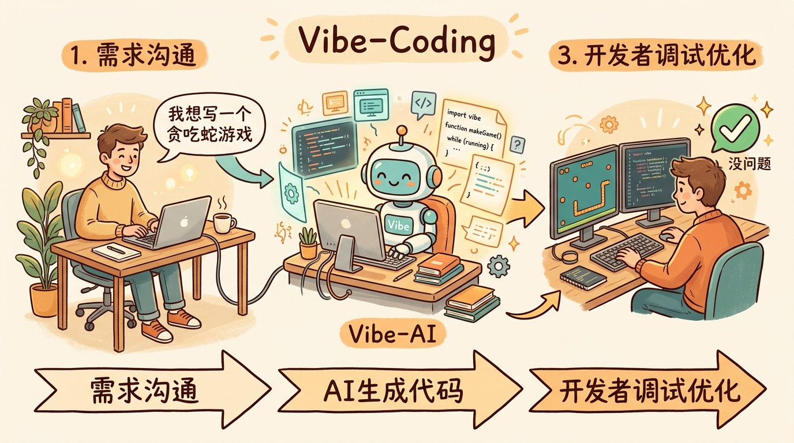

---

## 第一章：网页是如何工作的？

### 1.1 从输入网址到看到页面，发生了什么？

让我们从一个最熟悉的场景开始：你在浏览器地址栏输入 `www.taobao.com`，然后按下回车。接下来的几毫秒里，到底发生了什么？

让我用一个"餐厅吃饭"的比喻来帮你理解：

```
你的操作：在浏览器输入 www.taobao.com
    ↓
第一步：浏览器问"服务员"（DNS）
        "www.taobao.com 这个餐厅的地址在哪？"
        ↓
        DNS 回答："哦，那家店啊，地址是 110.75.115.70"
    ↓
第二步：浏览器"开车"到那个地址
        "你好，我想来份淘宝首页！"
    ↓
第三步：餐厅"后厨"（服务器）开始准备
        - 看看你要什么菜（数据）
        - 去"仓库"（数据库）拿食材
        - 把菜"炒"好（处理数据）
        - 装盘（组装成网页）
    ↓
第四步：服务员把菜端过来
        ↓
第五步：你开始"吃"（浏览器渲染）
        - 先看菜的样子（HTML结构）
        - 再看摆盘好不好看（CSS样式）
        - 尝尝味道（JavaScript交互）
    ↓
你看到的：淘宝首页！
```

这个比喻是不是好懂多了？接下来，让我们把这个比喻里的每个角色，翻译成程序员的语言。

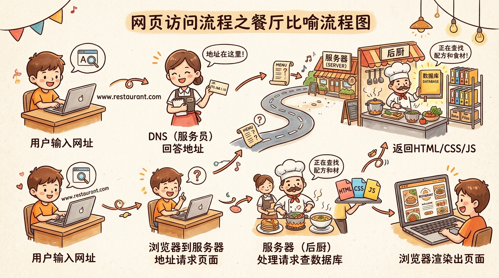

### 1.2 前端、后端、数据库——三个好伙伴

在我们每天用的网站和APP背后，其实有三个核心角色在默默工作：**前端**、**后端**、**数据库**。

#### 前端——你看到和摸到的一切

**前端是什么？**

前端就是你在浏览器或手机APP里看到的一切：按钮、图片、文字、动画、视频……所有你能看到和能点的东西，都是前端。

想象一下，如果把一个网站比作一栋房子：
- **HTML** 就是房子的"骨架"——墙在哪里、门在哪里、窗户在哪里
- **CSS** 就是房子的"装修"——墙刷成什么颜色、地板用什么材质、家具怎么摆
- **JavaScript** 就是房子的"水电和电梯"——灯怎么开关、空调怎么调、电梯怎么上下

**为什么需要前端？**

没有前端，用户看到的就只是一堆原始数据，根本没法用。就像手机没有屏幕，你只能看到一堆电路板，不知道它在干嘛。

举个例子：你在淘宝搜索"手机"，后端可能会返回这样的数据：
```
商品1：iPhone 15，价格9999元，库存100件
商品2：小米14，价格3999元，库存200件
```

但是，如果没有前端把这些数据变成漂亮的卡片、加上图片、做成可点击的按钮，你看到的就是两行冷冰冰的文字，根本不想买！

---

#### 后端——幕后的"大脑"

**后端是什么？**

后端是运行在服务器上的程序，你看不到它，但它负责处理所有"幕后工作"。

想象一下，你在网上买东西，点击"立即购买"之后：
- 后端要检查你的账号有没有登录
- 要检查商品有没有库存
- 要计算价格（有没有优惠券、运费多少）
- 要扣减库存
- 要生成订单
- 要给你发确认邮件
- 要通知仓库发货

这一堆事情，都是后端在默默做的。

**为什么需要后端？**

没有后端，网页就是"死"的——你没法登录、没法保存数据、没法购物。就像自动售货机没有后台系统，你付了钱也拿不到饮料，因为没人知道该给你什么。

举个例子：如果你在微博发一条状态，没有后端的话，这条状态只存在于你的手机上，刷新一下就没了，别人也看不到。有了后端，这条状态才会被保存到数据库里，你的粉丝才能看到。

---

#### 数据库——数据的"仓库"

**数据库是什么？**

数据库就是专门用来存数据的软件。你可以把它想象成一个超级大、超级智能的Excel表格。

比如，淘宝的数据库里会存：
- 所有用户的信息（用户名、密码、手机号、地址）
- 所有商品的信息（名称、价格、库存、图片）
- 所有订单的信息（谁买的、买了什么、花了多少钱、什么时候发货）
- 所有评论的信息（谁写的、写了什么、给了几颗星）

**为什么需要数据库？**

没有数据库，数据就只能存在内存里，服务器一重启就全丢了。就像你写日记，写在本子上（数据库）比写在沙滩上（内存）安全得多——潮水一冲，沙滩上的字就没了，但本子上的会一直留着。

而且，数据库能让你快速找到想要的数据。比如，淘宝有几亿件商品，你搜索"iPhone"，数据库能在几毫秒内就把所有相关商品找出来。如果是用Excel表格，你可能要翻好几天才能找到。

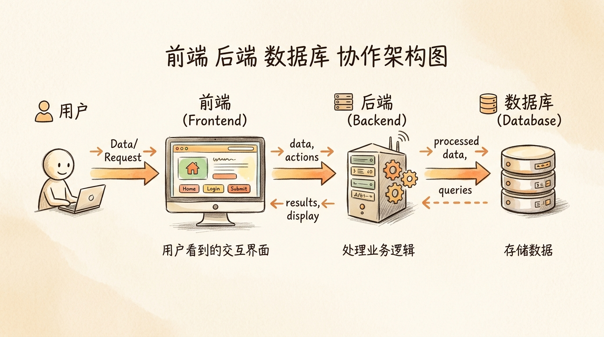

---

### 1.3 为什么要前后端分离？

在早期，网页通常是"前后端不分离"的——后端直接生成完整的HTML页面发给浏览器。这就像一个厨师既要炒菜又要摆盘，忙不过来。

**为什么后来变成分离的了呢？**

想象一下这样的场景：

**场景1：一家店，既要做堂食，又要做外卖，还要做打包**

如果用"不分离"的方式，厨师要为每种场景做不同的菜，很累。

如果用"分离"的方式，后厨只负责做菜，前端（服务员）负责：
- 堂食：把菜端到桌上，摆好
- 外卖：把菜装进外卖盒，贴上标签
- 打包：把菜装进打包袋，给客人

**场景2：你要做一个APP，同时要有网页版、iOS版、Android版**

如果用"不分离"的方式，每个版本都要自己写一套后端逻辑，重复劳动。

如果用"分离"的方式，只需要写一套后端API，三个前端（网页、iOS、Android）都调用同一个后端。

**现代前后端分离的好处：**

1. **分工明确**：前端工程师专心做用户界面，后端工程师专心做业务逻辑，效率更高
2. **独立开发**：前端和后端可以同时开发，不用等对方做完
3. **独立部署**：前端可以更新界面而不影响后端，后端可以修复bug而不影响前端
4. **多端复用**：一套后端API可以支持网页、APP、小程序多个客户端

好，第一章就讲到这里！现在你应该对网页是怎么工作的有了一个大概的了解。接下来，我们深入看看前端这个世界~


---

## 第二章：前端基础——从骨架到皮肤再到大脑

你有没有想过，一个看起来简单的网页，背后是怎么构成的？

在这一章，我们来聊聊前端的三剑客：**HTML**、**CSS**、**JavaScript**。我会用最简单的方式，让你明白它们各自是什么，以及为什么需要它们。

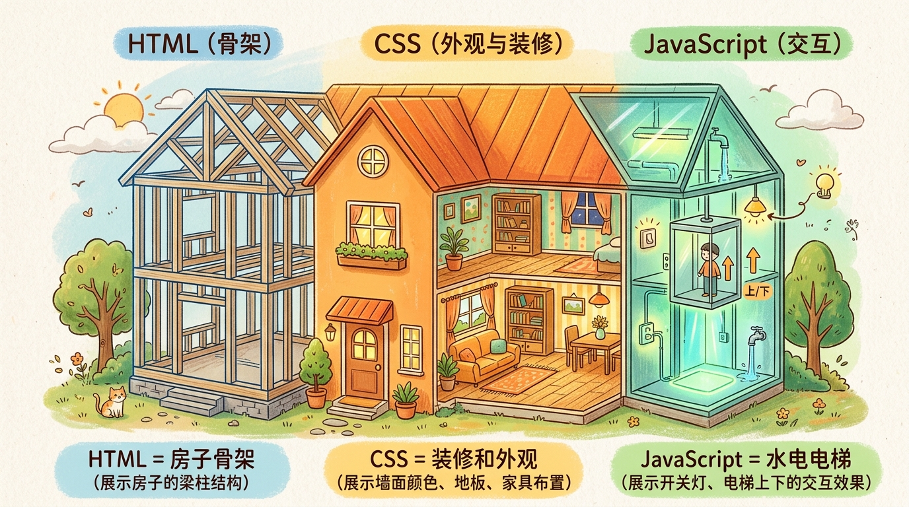

### 2.1 HTML——网页的"骨架"

**HTML是什么？**

HTML的全称是"超文本标记语言"（HyperText Markup Language）。这个名字听起来有点吓人，但其实很简单——HTML就是用来给网页"搭骨架"的。

想象一下建房子：
- 你需要先立起柱子、搭起梁——这就是HTML
- 然后才能刷墙、铺地板——这是CSS
- 最后才能装水电、装电梯——这是JavaScript

HTML用"标签"来定义内容。标签一般是成对出现的，比如 `<h1>` 和 `</h1>`。

举个例子：

```html
<!-- 这是一个标题 -->
<h1>我的个人主页</h1>

<!-- 这是一个段落 -->
<p>你好，欢迎来到我的网站！</p>

<!-- 这是一个链接 -->
<a href="https://www.taobao.com">去淘宝购物</a>

<!-- 这是一张图片 -->


<!-- 这是一个列表 -->
<ul>
  <li>苹果</li>
  <li>香蕉</li>
  <li>橙子</li>
</ul>
```

看到了吗？这些标签就像一个个"容器"，把不同的内容装进去。浏览器看到这些标签，就知道："哦，这是标题，那是段落，那边是个链接……"

**为什么要用HTML？**

你可能会问："我直接写文字不行吗？为什么要用这些标签？"

好问题！让我告诉你为什么：

**原因1：浏览器能理解**

如果你直接写"我的个人主页"，浏览器不知道这是标题还是正文。但如果你用 `<h1>` 包起来，浏览器就知道："这是一级标题，我应该把它放大加粗显示。"

**原因2：搜索引擎能理解**

Google、百度这些搜索引擎在爬取网页时，会通过HTML标签来判断内容的重要性。比如，`<h1>` 里的内容会被认为是页面最重要的主题。

**原因3：屏幕阅读器能理解**

视力障碍的用户会用"屏幕阅读器"来浏览网页。屏幕阅读器会通过HTML标签来告诉用户："这里有个标题，那里有个链接……"

**为什么要"语义化"？**

你可能听说过"语义化HTML"这个词。简单来说，就是"用正确的标签做正确的事"。

比如：
- 用 `<header>` 表示页面头部，而不是用 `<div>`
- 用 `<nav>` 表示导航栏，而不是用 `<div>`
- 用 `<article>` 表示文章内容，而不是用 `<div>`
- 用 `<footer>` 表示页脚，而不是用 `<div>`

**为什么要这样做？** 还是那个原因：让浏览器、搜索引擎、屏幕阅读器能更好地理解你的网页。

就像你寄快递时，在包裹上写清楚"这是电子产品，轻拿轻放"，快递员就知道该怎么处理这个包裹。语义化HTML，就是给网页的各个部分贴上"标签"，告诉计算机它们是什么。

---

### 2.2 CSS——网页的"皮肤和衣服"

**CSS是什么？**

CSS的全称是"层叠样式表"（Cascading Style Sheets）。简单来说，CSS就是用来给网页"化妆"和"穿衣服"的。

想象一下：HTML盖好了房子的骨架，但房子还是毛坯房——墙是灰的，地板是水泥的，没有任何装饰。

CSS就是来做装修的：
- 把墙刷成白色或粉色
- 铺上木地板或瓷砖
- 挂上窗帘
- 摆上家具
- 装上彩灯

**没有CSS的网页是什么样的？**

如果没有CSS，网页就是"素颜"的——黑字白底，没有任何样式，就像Word文档一样。虽然能看，但不好看，用户体验也不好。

**CSS能做什么？**

CSS的功能非常强大，我给你举几个例子：

**1. 改变颜色和字体**
```css
/* 把标题变成红色，字体变大 */
h1 {
  color: red;
  font-size: 36px;
}

/* 把段落文字变成灰色，行间距变大 */
p {
  color: #666;
  line-height: 1.8;
}
```

**2. 改变布局**

在CSS出现之前，网页布局是用"表格"来做的——就像Excel表格一样，把内容放在格子里。这种方式很不灵活。

后来有了CSS，我们有了更好的布局方式：
- **Flexbox**（弹性盒子）：适合一维布局（一行或一列）
- **Grid**（网格）：适合二维布局（多行多列）

**为什么要有Flexbox和Grid？**

想象一下，你要把三个按钮排成一行，而且要它们之间间距相等，还要在不同屏幕大小下自动调整。

在Flexbox出现之前，你可能需要用"浮动"（float）或者"定位"（position）来实现，代码很复杂，而且容易出问题。

有了Flexbox，一行代码就搞定了：
```css
.button-container {
  display: flex;
  justify-content: space-between;
  gap: 20px;
}
```

是不是简单多了？这就是为什么我们需要Flexbox和Grid——它们让布局变得更简单、更灵活、更不容易出错。

**3. 做动画和特效**

CSS还能做动画！比如：
- 鼠标悬停时按钮变色
- 页面滚动时元素淡入
- 加载时的旋转动画

这些动画能让网页变得更生动、更有趣。

**4. 响应式设计**

现在大家用手机上网的时间比电脑还多，所以网页需要能在不同屏幕大小下正常显示——这就是"响应式设计"。

CSS的"媒体查询"（Media Query）就是用来做这个的：
```css
/* 电脑屏幕：三列布局 */
@media (min-width: 1024px) {
  .container {
    grid-template-columns: repeat(3, 1fr);
  }
}

/* 平板：两列布局 */
@media (min-width: 768px) and (max-width: 1023px) {
  .container {
    grid-template-columns: repeat(2, 1fr);
  }
}

/* 手机：一列布局 */
@media (max-width: 767px) {
  .container {
    grid-template-columns: 1fr;
  }
}
```

这样，同一个网页在电脑上是三列，在平板上是两列，在手机上是一列——用户不管用什么设备，都能看得舒服。

---

### 2.3 JavaScript——网页的"大脑和神经系统"

**JavaScript是什么？**

JavaScript（简称JS）是一种编程语言，它能让网页"动起来"和"交互起来"。

如果说HTML是骨架，CSS是皮肤，那JavaScript就是大脑和神经系统——它能让网页思考、能响应用户的操作、能和后端通信。

**JavaScript能做什么？**

让我给你举几个常见的例子：

**1. 响应用户操作**

比如：
- 点击按钮弹出一个窗口
- 下拉菜单展开/收起
- 表单验证（检查用户输入的邮箱格式对不对）
- 点赞按钮点击后数字加1

```javascript
// 给按钮添加点击事件
const button = document.querySelector('#like-button');
let likeCount = 0;

button.addEventListener('click', function() {
  likeCount++; // 点赞数加1
  button.textContent = `点赞 (${likeCount})`; // 更新按钮文字
});
```

**2. 动态修改页面内容**

比如：
- 不刷新页面就能加载新内容（这叫"AJAX"）
- 搜索时输入框下面出现提示
- 购物车添加商品后实时更新

**为什么需要这个？**

在JavaScript出现之前，你每次提交表单或者点击链接，页面都会刷新一次——体验很不好，就像看书时每翻一页都要重新打开书。

有了JavaScript，页面可以在不刷新的情况下更新内容——就像电子书，翻页很流畅。

**3. 和后端通信**

这是JavaScript最重要的功能之一。前端通过JavaScript向后端发送请求，获取数据，然后更新页面。

比如：
- 你在淘宝搜索"手机"，JavaScript把搜索词发给后端
- 后端返回搜索结果
- JavaScript把结果显示在页面上

这整个过程，页面不需要刷新！

**4. 做复杂的应用**

现在的JavaScript已经非常强大了，你甚至能用它做：
- 在线文档（像Google Docs）
- 在线图片编辑器
- 视频播放器
- 游戏

---

**为什么需要TypeScript？**

你可能听说过TypeScript（简称TS）。简单来说，TypeScript是JavaScript的"超集"——它在JavaScript的基础上添加了"类型"。

**什么是类型？**

简单来说，类型就是告诉计算机"这个变量是什么类型的数据"：
- 是数字？还是字符串？
- 是布尔值（真/假）？还是数组？
- 是对象？还是null？

**为什么需要类型？**

想象一下这个场景：

```javascript
// JavaScript 代码
function add(a, b) {
  return a + b;
}

add(1, 2); // 返回 3，没问题
add("1", "2"); // 返回 "12"，不是你想要的
add(1, "2"); // 返回 "12"，也不是你想要的
```

如果用TypeScript：

```typescript
// TypeScript 代码
function add(a: number, b: number) {
  return a + b;
}

add(1, 2); // 返回 3，没问题
add("1", "2"); // ❌ 编译时报错，告诉你类型不对
```

**类型的好处：**

1. **提前发现错误**：很多错误在写代码时就能发现，不用等到运行时
2. **代码更清晰**：看类型就知道这个函数接受什么参数，返回什么
3. **IDE提示更好**：编辑器能给你更准确的自动补全
4. **重构更安全**：修改代码时，类型检查能帮你发现遗漏的地方

这就是为什么现在大型项目都在用TypeScript——它能让代码更可靠、更容易维护。

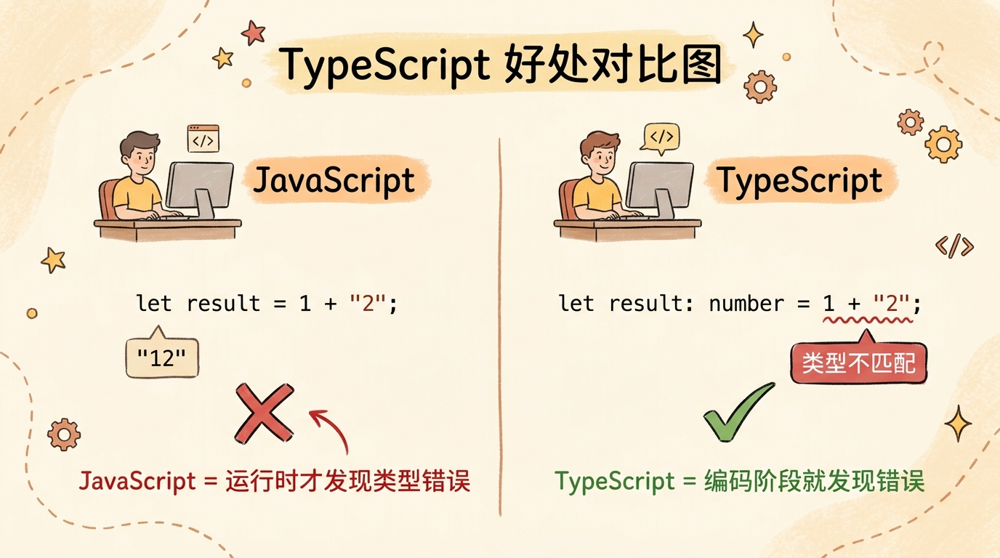

---

### 2.4 前端框架——为什么我们需要React/Vue？

在早期，开发者用原生JavaScript（或者jQuery）来写前端。但随着网页越来越复杂，这种方式变得越来越难维护。

于是，前端框架出现了——最流行的有 **React**、**Vue**、**Angular**。

**为什么需要框架？**

让我用一个"做饭"的比喻来解释：

**不用框架（原生JavaScript）：**
你要自己买菜、自己洗菜、自己切菜、自己炒菜、自己摆盘——每一步都要自己做，很累，而且容易出错。

**用框架：**
就像用半成品食材——菜已经洗好切好了，调料也配好了，你只需要按照说明炒一下就行。框架帮你处理了很多重复的、繁琐的工作，你只需要专注于业务逻辑。

**框架解决了什么痛点？**

**痛点1：DOM操作太繁琐**

DOM就是"文档对象模型"——简单来说，就是网页的结构树。

在不用框架时，你要手动操作DOM：
```javascript
// 获取元素
const container = document.querySelector('#container');
const title = document.querySelector('#title');
const button = document.querySelector('#button');

// 修改内容
title.textContent = '新标题';

// 添加类名
container.classList.add('highlight');

// 添加事件
button.addEventListener('click', function() {
  // ...
});
```

代码多了之后，你会发现自己写了很多重复的代码。

用框架的话，框架会帮你处理这些DOM操作，你只需要关心数据：
```jsx
// React 例子
function App() {
  const [title, setTitle] = useState('旧标题');
  
  return (
    <div>
      <h1>{title}</h1>
      <button onClick={() => setTitle('新标题')}>
        点击修改标题
      </button>
    </div>
  );
}
```

看到了吗？你不需要手动去获取元素、修改内容——数据一变，界面自动更新！

**痛点2：状态管理太复杂**

什么是"状态"？简单来说，状态就是"会变化的数据"。

比如：
- 用户有没有登录
- 购物车里有多少商品
- 表单里输入了什么
- 当前是第几页

在一个复杂的应用里，状态可能会分散在很多地方，而且状态之间可能会相互影响。如果没有框架，管理这些状态会非常困难，很容易出现bug。

框架提供了"状态管理"的解决方案——比如React的useState、useReducer，Vue的响应式系统，还有专门的状态管理库（Redux、Zustand、Pinia等）。

**痛点3：代码复用太难**

不用框架时，如果你想把一个按钮用在多个地方，你可能要复制粘贴很多代码。代码重复一多，维护就成了问题——你要改一个地方，就得把所有重复的地方都改一遍。

框架的核心思想是"组件化"——把界面拆成一个个小组件，每个组件可以独立开发、独立测试、独立复用。

比如，你可以做一个"点赞按钮"组件，然后在文章里、评论里、视频里都用这个组件——只需要写一次代码！

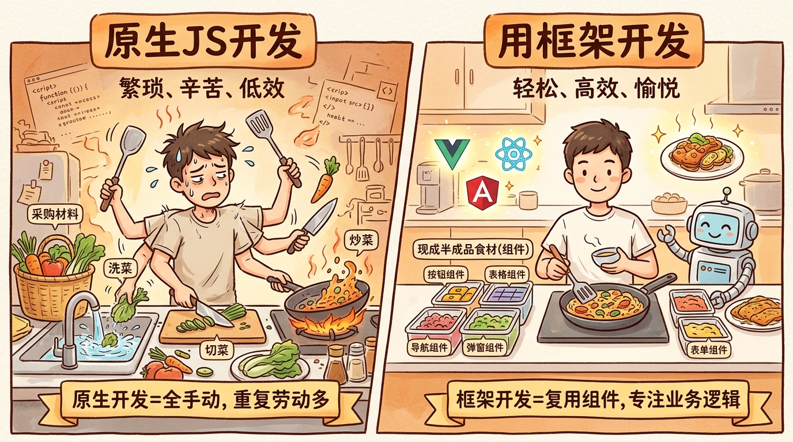

---

## 第三章：后端基础——服务器上的那些事

看完了前端，我们来看看后端。如果说前端是"餐厅的前厅"，那后端就是"餐厅的后厨"——你看不到它，但它在默默做着最重要的工作。

### 3.1 服务器是什么？

**服务器是什么？**

简单来说，服务器就是一台"24小时不关机的电脑"。它和你家里的电脑本质上是一样的——都有CPU、内存、硬盘、操作系统。

但有几个区别：
1. **更稳定**：服务器用的硬件更可靠，能连续运行几年不关机
2. **更强大**：服务器的CPU核数更多、内存更大、硬盘更快
3. **固定IP**：服务器一般有固定的IP地址，这样用户才能找到它
4. **没有显示器**：服务器一般放在机房里，不需要显示器，远程管理就行

**服务器在做什么？**

服务器一天24小时都在"等待请求"——就像餐厅的后厨一直在等服务员过来下单。

当一个请求过来时，服务器会：
1. 解析请求（看看用户要什么）
2. 执行业务逻辑（验证登录、处理订单、计算价格……）
3. 查询或更新数据库
4. 把结果返回给用户

**为什么需要服务器？**

你可能会问："不能直接在用户的电脑上运行这些逻辑吗？"

好问题！让我告诉你为什么需要服务器：

**原因1：数据需要集中存储**

如果没有服务器，每个人的数据都存在自己的电脑上，那：
- 你换个手机，数据就没了
- 你在手机上发的消息，在电脑上看不到
- 你没法和别人分享数据

有了服务器，数据都存在同一个地方，不管你用什么设备，都能访问到。

**原因2：有些逻辑不能在前端运行**

比如：
- 验证用户身份（你总不能把密码存在前端吧？）
- 处理支付（总不能让用户自己修改价格吧？）
- 管理库存（总不能让用户自己扣减库存吧？）

这些敏感的、重要的逻辑，必须在服务器上运行——前端是不可信的，用户可以随意修改前端的代码。

**原因3：前端计算能力有限**

手机和电脑的计算能力是有限的，而且会消耗电池。复杂的计算（比如大数据分析、图片处理、AI推理）放在服务器上做更合适。

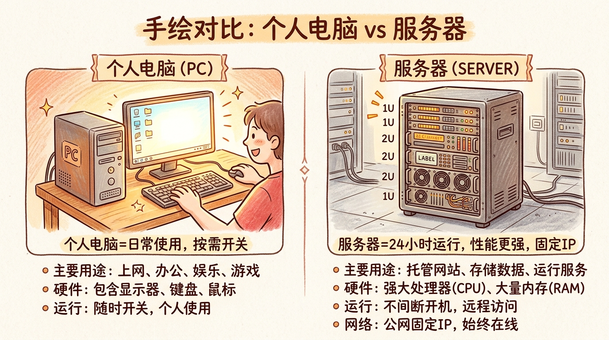

---

### 3.2 后端语言怎么选？

后端有很多编程语言可以选择，最流行的有：**Node.js**、**Python**、**Java**、**Go**、**PHP**、**Ruby**。

每种语言都有自己的特点和适用场景，没有"最好"的，只有"最适合"的。

让我用简单的方式帮你理解它们的区别：

#### Node.js —— JavaScript 也能写后端！

**是什么？**

Node.js是一个基于Chrome V8引擎的JavaScript运行环境——简单来说，就是让JavaScript能在服务器上运行。

**为什么用它？**

1. **前后端语言统一**：前端用JavaScript，后端也用JavaScript，不用学新语言
2. **适合高并发**：Node.js是"事件驱动"、"非阻塞I/O"的，特别适合处理很多并发请求（比如聊天应用、实时通知）
3. **生态好**：npm（Node Package Manager）是世界上最大的包管理器，有无数的开源库可以用

**适用场景：**
- 实时应用（聊天、协作工具）
- 前后端统一的团队
- API服务
- 原型开发（很快就能写出来）

---

#### Python —— 简单优雅，全能选手

**是什么？**

Python是一种语法非常简洁优雅的语言，被称为"最接近自然语言的编程语言"。

**为什么用它？**

1. **简单易学**：Python的语法很简单，读起来就像英语，新手很容易上手
2. **生态丰富**：Python在数据科学、人工智能、机器学习领域是绝对的霸主（NumPy、Pandas、TensorFlow、PyTorch……）
3. **开发速度快**：Python的代码量通常比其他语言少，能快速实现想法

**适用场景：**
- 数据科学、AI、机器学习
- 快速原型开发
- 自动化脚本
- 后台管理系统

---

#### Java —— 企业级首选，稳定可靠

**是什么？**

Java是一种历史悠久、非常成熟的语言，以"一次编写，到处运行"著称。

**为什么用它？**

1. **稳定可靠**：Java经过了20多年的考验，在企业级应用中是绝对的主流
2. **性能好**：Java虚拟机（JVM）的优化做得非常好，性能接近C++
3. **生态强大**：Spring框架几乎是企业级开发的标准
4. **人才多**：学Java的人很多，容易招聘

**适用场景：**
- 大型企业应用
- 金融系统（银行、证券）
- 高并发、高性能要求的系统

---

#### Go —— 云原生时代的新宠

**是什么？**

Go（又称Golang）是Google开发的一种语言，特点是简单、高效、天生支持并发。

**为什么用它？**

1. **简单**：Go的语法很简单，比Java简单得多，新手容易上手
2. **性能好**：Go是编译型语言，性能接近C++
3. **天生支持并发**：Go的goroutine和channel让并发编程变得非常简单
4. **部署方便**：Go编译后是一个单独的二进制文件，没有依赖，部署超级方便

**适用场景：**
- 云原生应用（Docker、Kubernetes都是Go写的）
- 微服务
- 高性能、高并发系统
- 命令行工具

---

#### 怎么选？

看到这里你可能会问："我到底应该学哪个？"

我的建议是：

**如果你是新手：**
- 先学 **Node.js** —— 前后端都能用JavaScript，学习曲线平缓
- 或者 **Python** —— 简单易学，应用范围广

**如果你想做AI/数据科学：**
- 选 **Python** —— 这是Python的主场

**如果你想进大公司/做企业应用：**
- 选 **Java** —— 很多大公司在用

**如果你想做云原生/微服务：**
- 选 **Go** —— 这是Go的强项

**重要提示：** 语言只是工具，核心是编程思想。学会了一种语言，再学另一种会很快——不要纠结于"选哪个最好"，先选一个开始学！

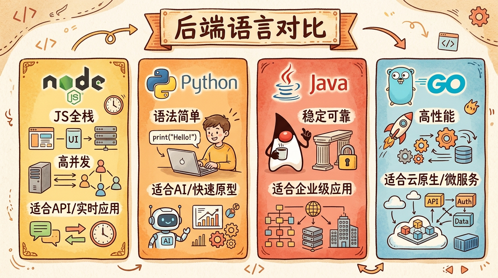

---

### 3.3 API是什么？为什么需要RESTful？

你肯定听过"API"这个词，它到底是什么？

#### API是什么？

API的全称是"应用程序编程接口"（Application Programming Interface）。这个名字听起来有点吓人，其实很简单。

让我用"餐厅"的比喻来解释：

- **前端** = 顾客
- **后端** = 后厨
- **API** = 服务员

顾客（前端）不直接去后厨（后端）点菜，而是通过服务员（API）：
1. 顾客告诉服务员："我要一份宫保鸡丁，微辣"
2. 服务员把订单写到后厨
3. 后厨做好菜，交给服务员
4. 服务员把菜端给顾客

API就是前后端之间的"翻译官"和"服务员"——前端通过API向后端发送请求，后端通过API返回数据。

**API长什么样？**

现代API通常返回JSON格式的数据。JSON是一种简单的数据格式，看起来像JavaScript的对象：

```json
{
  "success": true,
  "data": {
    "id": 123,
    "name": "iPhone 15",
    "price": 9999,
    "stock": 100,
    "categories": ["手机", "数码产品"]
  },
  "message": "获取成功"
}
```

---

#### RESTful是什么？为什么需要它？

RESTful是一种API设计风格——简单来说，就是"大家约定俗成的API设计规范"。

**为什么需要规范？**

如果没有规范，每个人设计API的方式都不一样：
- 有人用 `/getUser?id=123`
- 有人用 `/user/123`
- 有人用 `/api?action=getUser&id=123`

这样一来，前端开发人员每次对接新的API都要重新学习，很累。

RESTful规范就是为了解决这个问题——大家都按照同样的方式设计API，对接起来就方便多了。

**RESTful的核心思想：**

1. **资源导向**：URL代表资源（名词），而不是动作（动词）
   - 好：`/users`（用户资源）
   - 不好：`/getUsers`（这是动作）

2. **用HTTP方法表达操作**：
   - `GET`：获取资源（查询）
   - `POST`：创建资源（新增）
   - `PUT`：更新资源（完整更新）
   - `PATCH`：更新资源（部分更新）
   - `DELETE`：删除资源

3. **用HTTP状态码表示结果**：
   - `200 OK`：成功
   - `201 Created`：创建成功
   - `400 Bad Request`：客户端请求有问题
   - `401 Unauthorized`：未登录
   - `403 Forbidden`：没有权限
   - `404 Not Found`：资源不存在
   - `500 Internal Server Error`：服务器内部错误

**RESTful API示例：**

```
# 获取用户列表
GET /api/users

# 获取单个用户
GET /api/users/123

# 创建新用户
POST /api/users
Body: { "name": "张三", "email": "zhangsan@example.com" }

# 更新用户（完整更新）
PUT /api/users/123
Body: { "name": "张三", "email": "zhangsan_new@example.com" }

# 更新用户（部分更新）
PATCH /api/users/123
Body: { "email": "zhangsan_new@example.com" }

# 删除用户
DELETE /api/users/123
```

是不是很清晰？一看URL就知道是在操作什么资源，一看HTTP方法就知道是在做什么操作。

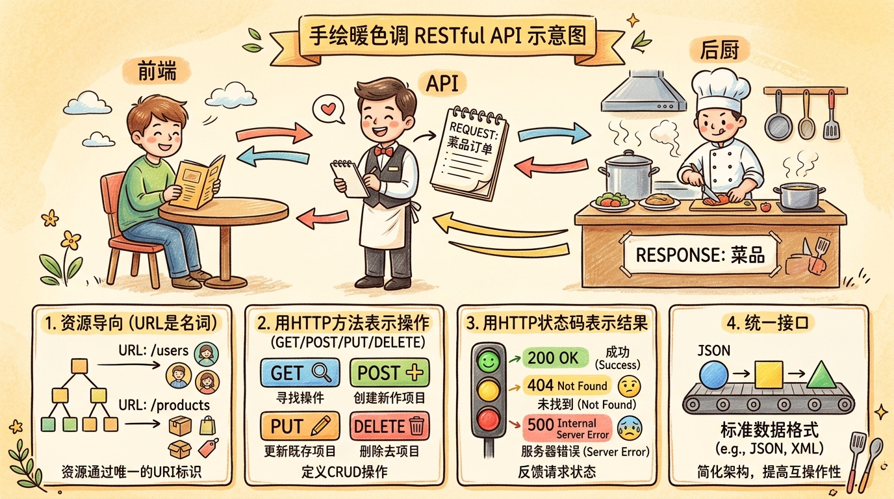

---

### 3.4 数据库——SQL还是NoSQL？

数据库是用来存数据的，但数据库也有很多种，主要分为两大类：**SQL（关系型数据库）**和**NoSQL（非关系型数据库）**。

#### SQL数据库——像Excel表格一样

**是什么？**

SQL数据库用"表格"来存数据，就像Excel一样：
- 有行（记录）和列（字段）
- 表与表之间可以建立"关系"
- 用SQL（结构化查询语言）来查询数据

**最流行的SQL数据库：**
- **MySQL**：开源免费，互联网公司用得最多
- **PostgreSQL**：功能更强大，支持复杂查询
- **Oracle**：企业级，功能强大但收费
- **SQLite**：轻量级，适合移动端和小型应用

**SQL数据库的优点：**

1. **结构清晰**：数据结构事先定义好，规范
2. **查询强大**：支持复杂的查询、分组、聚合
3. **事务支持**：ACID特性，数据一致性有保证（比如转账，要么都成功，要么都失败）
4. **成熟稳定**：经过了几十年的考验

**SQL数据库的缺点：**

1. **Schema固定**：表结构一旦定义好，修改起来比较麻烦
2. **扩展困难**：一般只能"垂直扩展"（换更好的服务器），"水平扩展"（加更多服务器）比较难
3. **不适合某些场景**：比如存储半结构化数据（JSON）、大数据量、高并发写入

---

#### NoSQL数据库——灵活多变

**是什么？**

NoSQL（Not Only SQL）数据库是对传统SQL数据库的补充，它们不使用表格，数据结构更灵活。

**常见的NoSQL类型：**

**1. 文档数据库（Document）**
- **代表**：MongoDB
- **特点**：用"文档"来存数据（类似JSON），结构灵活
- **适用场景**：内容管理、电商产品、用户偏好

**2. 键值数据库（Key-Value）**
- **代表**：Redis
- **特点**：就像一个大字典，通过key找value，速度极快
- **适用场景**：缓存、会话存储、排行榜

**3. 列族数据库（Wide-Column）**
- **代表**：Cassandra、HBase
- **特点**：按列存储，适合大数据
- **适用场景**：时间序列数据、日志、物联网

**4. 图数据库（Graph）**
- **代表**：Neo4j
- **特点**：用"图"来存数据，适合处理关系
- **适用场景**：社交网络、推荐系统、知识图谱

**NoSQL数据库的优点：**

1. **灵活**：Schema不固定，可以随时添加字段
2. **易扩展**：支持"水平扩展"，加服务器就行
3. **高性能**：某些场景下比SQL快很多
4. **适合大数据**：能处理TB甚至PB级的数据

**NoSQL数据库的缺点：**

1. **查询功能弱**：一般不支持复杂的join查询
2. **事务支持弱**：很多NoSQL不支持事务，或者支持得不好
3. **不够成熟**：相比SQL，NoSQL出现得较晚，生态不如SQL完善

---

#### 怎么选？SQL还是NoSQL？

这是个经典问题，我的建议是：

**选SQL，如果：**
- 你的数据结构比较固定，不会经常变
- 你需要复杂的查询（比如join、分组、聚合）
- 你需要强事务保证（比如金融、支付）
- 你的数据量不是特别大（几千万条以内）

**选NoSQL，如果：**
- 你的数据结构经常变，或者不确定
- 你需要存半结构化数据（JSON）
- 你需要极高的写入性能
- 你的数据量特别大（几亿条以上）
- 你需要水平扩展

**重要提示：** 现在很多应用是"混合使用"的——核心数据用SQL，非核心数据用NoSQL。比如：
- 用户信息、订单数据 → MySQL
- 缓存、会话 → Redis
- 日志、监控 → MongoDB
- 社交关系 → Neo4j

根据场景选择合适的工具，这才是最好的做法！

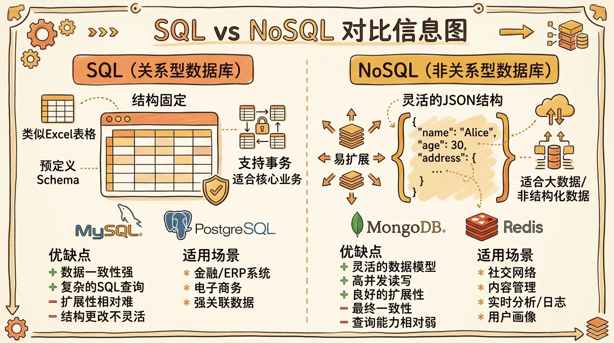

---

## 第四章：设计模式——前人总结的最佳实践

你可能听过"设计模式"这个词，它听起来很高深，其实很简单——设计模式就是"前人总结出来的、解决常见问题的最佳方案"。

在这一章，我会用最简单的方式，给你讲几个最常用的设计模式。我不会只给你看代码，我会告诉你：**这个模式解决了什么问题？为什么要这样做？**

### 4.1 为什么要学设计模式？

在讲具体的模式之前，先让我们聊聊："既然AI能写代码了，我还需要学设计模式吗？"

**我的答案是：非常需要！**

让我用一个"建房子"的比喻来解释：

**不学设计模式：**
你建房子时，可能会走很多弯路——比如，先盖好了墙，才发现没留门；先铺好了地板，才发现水管没装；等你终于把房子建好了，才发现结构不合理，想改也改不了。

**学了设计模式：**
你知道"哦，这种情况应该这样建"——比如，门应该留在哪里、水管应该怎么走、电线应该怎么布。你是站在前人的肩膀上，不会再犯前人犯过的错误。

**设计模式的好处：**

1. **避免重复造轮子**：问题已经被解决过了，直接用就行
2. **代码更易维护**：大家都用同样的模式，别人看你的代码更容易理解
3. **沟通更高效**：你说"用单例模式"，大家就知道你是什么意思，不用解释半天
4. **代码质量更高**：设计模式是经过验证的最佳实践，用它们能写出更好的代码

好，接下来我们来看具体的模式！

---

### 4.2 单例模式——为什么只需要一个实例？

**单例模式是什么？**

单例模式（Singleton）保证一个类只有一个实例，并提供一个全局访问点。

**听不懂？没关系，让我用例子来解释。**

**场景：数据库连接**

想象一下，你在写一个应用，需要连接数据库。如果不用单例模式，代码可能是这样的：

```javascript
// 不用单例模式
class DatabaseConnection {
  constructor() {
    console.log('建立数据库连接...');
    // 实际建立连接的代码
  }
  
  query(sql) {
    // 执行查询
  }
}

// 每次都创建新连接
const connection1 = new DatabaseConnection(); // 输出：建立数据库连接...
connection1.query('SELECT * FROM users');

const connection2 = new DatabaseConnection(); // 输出：建立数据库连接...（又建了一个！）
connection2.query('SELECT * FROM orders');

const connection3 = new DatabaseConnection(); // 输出：建立数据库连接...（又又建了一个！）
```

你发现问题了吗？每次用都创建一个新连接——这会浪费很多资源，而且数据库能接受的连接数是有限的，连接太多会导致数据库崩溃！

**用单例模式解决：**

```javascript
// 用单例模式
class DatabaseConnection {
  // 静态变量，保存唯一的实例
  static instance = null;
  
  constructor() {
    // 如果已经有实例了，就抛出错误，防止通过 new 创建
    if (DatabaseConnection.instance) {
      throw new Error('请使用 getInstance() 获取实例');
    }
    console.log('建立数据库连接...');
  }
  
  // 静态方法，获取唯一实例
  static getInstance() {
    if (!DatabaseConnection.instance) {
      // 如果还没有实例，就创建一个
      DatabaseConnection.instance = new DatabaseConnection();
    }
    // 返回唯一的实例
    return DatabaseConnection.instance;
  }
  
  query(sql) {
    console.log(`执行查询: ${sql}`);
  }
}

// 使用
const connection1 = DatabaseConnection.getInstance(); // 输出：建立数据库连接...
connection1.query('SELECT * FROM users');

const connection2 = DatabaseConnection.getInstance(); // 什么都不输出（复用之前的连接）
connection2.query('SELECT * FROM orders');

const connection3 = DatabaseConnection.getInstance(); // 什么都不输出（还是复用）
connection3.query('SELECT * FROM products');

// 验证一下：是不是同一个实例？
console.log(connection1 === connection2); // true！
console.log(connection2 === connection3); // true！
```

看到了吗？不管调用多少次 `getInstance()`，都只会创建一个连接——资源节省了，问题解决了！

**为什么要用单例模式？**

总结一下，单例模式适用于这些场景：

1. **资源共享**：比如数据库连接、日志记录器——大家共用一个就够了，创建多个是浪费
2. **状态一致**：比如配置管理——如果有多个实例，配置可能会不一样
3. **控制访问**：比如打印机管理器——大家通过同一个管理器来访问打印机，避免冲突

**单例模式的注意事项：**

单例模式虽然有用，但不要滥用！如果你把所有东西都做成单例，代码会变得很难测试（单例的状态很难重置），而且会变成"全局变量"一样的存在，耦合度很高。

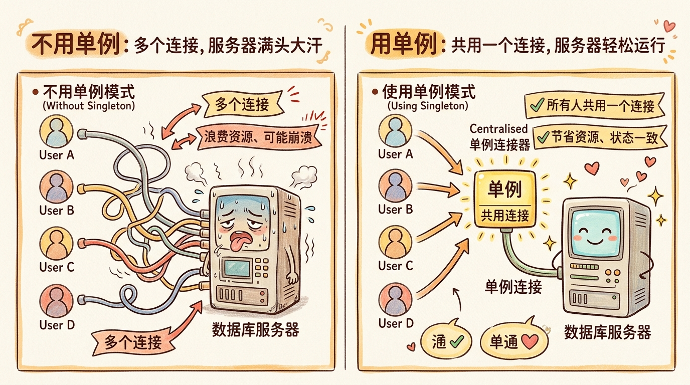

---

### 4.3 工厂模式——为什么要用"工厂"而不是直接new？

**工厂模式是什么？**

工厂模式（Factory Pattern）定义一个创建对象的接口，让子类决定实例化哪一个类。简单来说，就是"把创建对象的事情交给工厂来做，而不是自己直接new"。

**还是听不懂？没关系，让我用例子来解释。**

**场景：支付系统**

想象一下，你在做一个电商网站，需要支持多种支付方式：支付宝、微信支付、PayPal、银联……

如果不用工厂模式，代码可能是这样的：

```javascript
// 不用工厂模式
class Alipay {
  pay(amount) {
    console.log(`支付宝支付：${amount}元`);
  }
}

class WeChatPay {
  pay(amount) {
    console.log(`微信支付：${amount}元`);
  }
}

class PayPal {
  pay(amount) {
    console.log(`PayPal支付：${amount}美元`);
  }
}

// 业务代码
class OrderService {
  processOrder(paymentMethod, amount) {
    let payment;
    
    // 每次都要在这里写 if-else，很麻烦！
    if (paymentMethod === 'alipay') {
      payment = new Alipay();
    } else if (paymentMethod === 'wechat') {
      payment = new WeChatPay();
    } else if (paymentMethod === 'paypal') {
      payment = new PayPal();
    } else {
      throw new Error('不支持的支付方式');
    }
    
    payment.pay(amount);
  }
}

// 使用
const orderService = new OrderService();
orderService.processOrder('alipay', 999);
orderService.processOrder('wechat', 399);
```

你发现问题了吗？

**问题1：** 每次加新的支付方式，都要修改 `OrderService` 的代码（加新的 else-if），违反了"开闭原则"（对扩展开放，对修改关闭）

**问题2：** 创建支付对象的逻辑散落在各处，如果构造函数变了（比如需要传参数），你要改很多地方

**用工厂模式解决：**

```javascript
// 用工厂模式
// 1. 定义接口（在JavaScript里用注释或者TypeScript的interface）
class Payment {
  pay(amount) {
    throw new Error('子类必须实现 pay 方法');
  }
}

// 2. 具体实现类
class Alipay extends Payment {
  pay(amount) {
    console.log(`支付宝支付：${amount}元`);
  }
}

class WeChatPay extends Payment {
  pay(amount) {
    console.log(`微信支付：${amount}元`);
  }
}

class PayPal extends Payment {
  pay(amount) {
    console.log(`PayPal支付：${amount}美元`);
  }
}

// 3. 工厂类
class PaymentFactory {
  static createPayment(method) {
    switch (method) {
      case 'alipay':
        return new Alipay();
      case 'wechat':
        return new WeChatPay();
      case 'paypal':
        return new PayPal();
      default:
        throw new Error(`不支持的支付方式: ${method}`);
    }
  }
}

// 4. 业务代码（变得简单多了！）
class OrderService {
  processOrder(paymentMethod, amount) {
    // 工厂负责创建对象，业务代码只负责使用
    const payment = PaymentFactory.createPayment(paymentMethod);
    payment.pay(amount);
  }
}

// 使用
const orderService = new OrderService();
orderService.processOrder('alipay', 999);
orderService.processOrder('wechat', 399);
orderService.processOrder('paypal', 199);

// 加新的支付方式？
// 1. 新建类，继承 Payment
class CreditCard extends Payment {
  pay(amount) {
    console.log(`信用卡支付：${amount}元`);
  }
}
// 2. 在工厂里加一个 case
// 3. 完了！不需要修改 OrderService 的代码
```

看到了吗？现在好多了！

**工厂模式的好处：**

1. **解耦**：创建对象的逻辑和使用对象的逻辑分开了
2. **易扩展**：加新产品时，只需要加新类和修改工厂，不需要修改业务代码
3. **统一管理**：创建对象的逻辑集中在工厂里，要改只改一个地方

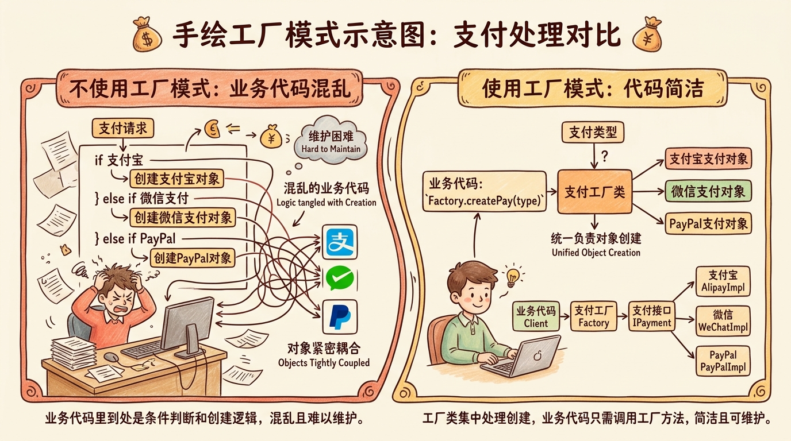

**为什么要用工厂模式？**

想象一下，如果你是餐厅老板：

**不用工厂模式：** 每个客人点菜时，你都要亲自去后厨告诉厨师怎么做——很累，而且容易出错。

**用工厂模式：** 你雇了一个"厨师长"（工厂），客人点菜时，你把菜单给厨师长，厨师长负责安排哪个厨师做、怎么做——你只需要接待客人就行了，轻松多了！

---

### 4.4 适配器模式——为什么要"适配"？

**适配器模式是什么？**

适配器模式（Adapter Pattern）将一个类的接口转换成客户希望的另一个接口。简单来说，就是"让两个不兼容的接口能一起工作"。

**还是听不懂？没关系，让我用生活中的例子来解释。**

**生活中的适配器：**

你肯定用过这些：
- **电源适配器**：你的手机充电器是两脚的，但插座是三脚的——适配器帮你转换
- **Type-C转HDMI**：你的电脑只有Type-C接口，但显示器只有HDMI——适配器帮你转换
- **翻译官**：你说中文，老外说英文——翻译官帮你转换

对，这就是适配器！适配器就是"中间人"，帮两个不兼容的东西"搭个桥"。

**编程中的适配器模式：**

让我用一个"支付系统"的例子来解释。

**场景：接入多个第三方支付**

想象一下，你的系统已经有了一个支付接口：

```javascript
// 你的系统定义的支付接口
class Payment {
  pay(amount) {
    // 接受金额（单位：元）
  }
  
  refund(transactionId) {
    // 接受交易ID
  }
}
```

现在你要接入支付宝。支付宝的SDK是这样的：

```javascript
// 支付宝 SDK（第三方，你改不了它的代码）
class AlipaySDK {
  // 注意：金额单位是分！
  sendPayment(amountInFen) {
    console.log(`支付宝支付：${amountInFen}分`);
    return `ALI${Date.now()}`;
  }
  
  // 注意：参数名不一样！
  doRefund(tradeNo) {
    console.log(`支付宝退款：${tradeNo}`);
    return true;
  }
}
```

问题来了！支付宝的SDK和你的接口不兼容：
- 方法名不一样：`sendPayment` vs `pay`，`doRefund` vs `refund`
- 参数单位不一样：支付宝用"分"，你的系统用"元"
- 参数名不一样：`tradeNo` vs `transactionId`

**怎么办？改支付宝的SDK？不行，那是第三方的。改你的系统？也不行，你的系统已经和微信支付对接了。**

**用适配器模式解决！**

```javascript
// 适配器！
class AlipayAdapter extends Payment {
  constructor(alipaySDK) {
    super();
    this.alipaySDK = alipaySDK;
  }
  
  pay(amountInYuan) {
    // 适配1：把元转成分
    const amountInFen = Math.round(amountInYuan * 100);
    
    // 适配2：调用不同的方法名
    const transactionId = this.alipaySDK.sendPayment(amountInFen);
    
    return transactionId;
  }
  
  refund(transactionId) {
    // 适配3：参数名不一样，传过去就行
    return this.alipaySDK.doRefund(transactionId);
  }
}

// 使用
const alipaySDK = new AlipaySDK();
const alipay = new AlipayAdapter(alipaySDK);

alipay.pay(99.99); // 你的系统用"元"，适配器自动转成"分"
alipay.refund('ALI123456'); // 你的系统用transactionId，适配器传tradeNo
```

完美！适配器帮你把支付宝的接口"适配"成了你系统的接口——你的业务代码不需要改，支付宝的SDK也不需要改，适配器在中间做转换。

**再接入PayPal？**

PayPal的SDK更不一样：

```javascript
// PayPal SDK
class PayPalSDK {
  // 用的是makePayment，而且要传对象
  makePayment(paymentDetails) {
    console.log(`PayPal支付：${paymentDetails.amount} ${paymentDetails.currency}`);
    return `PAY-${Date.now()}`;
  }
  
  // 用的是reversePayment
  reversePayment(payPalId) {
    console.log(`PayPal退款：${payPalId}`);
    return true;
  }
}
```

没关系，再加一个适配器就行了：

```javascript
class PayPalAdapter extends Payment {
  constructor(paypalSDK) {
    super();
    this.paypalSDK = paypalSDK;
  }
  
  pay(amountInYuan) {
    // 适配：把人民币转成美元（假设1:7）
    const paymentDetails = {
      amount: (amountInYuan / 7).toFixed(2),
      currency: 'USD'
    };
    
    return this.paypalSDK.makePayment(paymentDetails);
  }
  
  refund(transactionId) {
    return this.paypalSDK.reversePayment(transactionId);
  }
}
```

看到了吗？加新的第三方系统，只需要加新的适配器，业务代码不需要改！

**为什么要用适配器模式？**

总结一下，适配器模式适用于这些场景：

1. **接入第三方系统**：第三方的接口和你的不兼容，但你改不了第三方的代码
2. **兼容旧系统**：旧系统的接口过时了，但你不想改旧代码
3. **统一接口**：多个系统的接口不一样，你想让它们用同一个接口

**适配器模式的好处：**

1. **符合开闭原则**：加新适配器不需要改原有代码
2. **解耦**：业务代码不需要知道第三方系统的细节
3. **复用**：适配器可以在多个地方复用

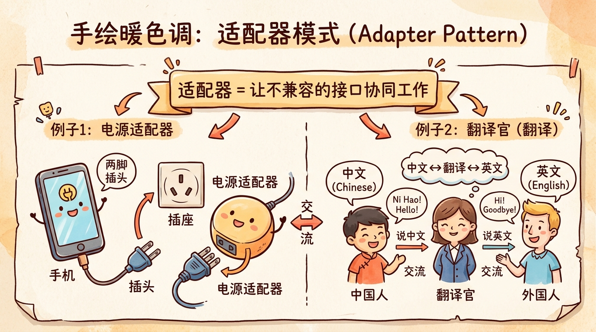

---

### 4.5 观察者模式——为什么要"订阅发布"？

**观察者模式是什么？**

观察者模式（Observer Pattern）定义了对象之间的一对多依赖关系，当一个对象的状态发生改变时，所有依赖它的对象都会收到通知并自动更新。

**还是听不懂？没关系，让我用"订报纸"的例子来解释。**

**生活中的观察者模式：**

想象一下你订报纸的场景：

- **报社** = 被观察的对象（Subject）
- **你（订阅者）** = 观察者（Observer）
- **订报纸** = 注册观察者
- **送报纸** = 通知观察者
- **退订** = 取消注册

**流程是这样的：**
1. 你去报社说："我要订你们的报纸"（注册）
2. 报社每天印好报纸，给所有订户送报纸（通知）
3. 你不想看了，去报社说："我要退订"（取消注册）

这就是观察者模式！报社不需要知道有多少订户，也不需要知道每个订户是谁——报社只需要印好报纸，给所有订户送去就行。

**编程中的观察者模式：**

让我用一个"电商订单系统"的例子来解释。

**场景：订单状态变更通知**

想象一下，你的电商系统里，订单状态变更时需要做这些事情：
1. 更新库存（扣减或者恢复）
2. 给用户发邮件通知
3. 给用户发短信通知
4. 记录日志
5. 更新数据分析平台

如果不用观察者模式，代码可能是这样的：

```javascript
// 不用观察者模式
class OrderService {
  constructor(
    inventoryService,
    emailService,
    smsService,
    logger,
    analyticsService
  ) {
    this.inventoryService = inventoryService;
    this.emailService = emailService;
    this.smsService = smsService;
    this.logger = logger;
    this.analyticsService = analyticsService;
  }
  
  updateOrderStatus(orderId, newStatus) {
    console.log(`订单 ${orderId} 状态变更为 ${newStatus}`);
    
    // 问题来了：这里要调用一堆服务，耦合度太高了！
    this.inventoryService.updateStock(orderId, newStatus);
    this.emailService.sendEmail(orderId, newStatus);
    this.smsService.sendSms(orderId, newStatus);
    this.logger.log(orderId, newStatus);
    this.analyticsService.update(orderId, newStatus);
  }
}
```

你发现问题了吗？

**问题1：** `OrderService` 依赖了一堆服务，耦合度太高——改一个服务，可能要改 `OrderService`

**问题2：** 加新的通知方式（比如推送到企业微信），要修改 `OrderService` 的代码

**问题3：** 有些用户不需要短信通知，没法灵活控制

**用观察者模式解决！**

```javascript
// 用观察者模式

// 1. 被观察者（订单主题）
class OrderSubject {
  constructor() {
    this.observers = []; // 所有观察者
  }
  
  // 注册观察者
  subscribe(observer) {
    this.observers.push(observer);
    console.log(`✅ ${observer.name} 订阅了订单通知`);
  }
  
  // 取消订阅
  unsubscribe(observer) {
    const index = this.observers.indexOf(observer);
    if (index > -1) {
      this.observers.splice(index, 1);
      console.log(`❌ ${observer.name} 取消订阅`);
    }
  }
  
  // 通知所有观察者
  notify(event) {
    console.log(`\n📢 订单 ${event.orderId} 状态变更为 ${event.newStatus}`);
    console.log(`   通知 ${this.observers.length} 个观察者...`);
    
    this.observers.forEach(observer => {
      try {
        observer.update(event);
        console.log(`   ✓ ${observer.name} 处理成功`);
      } catch (error) {
        console.log(`   ✗ ${observer.name} 处理失败: ${error.message}`);
      }
    });
  }
}

// 2. 观察者（库存服务）
class InventoryObserver {
  name = '库存服务';
  
  update(event) {
    console.log(`      [库存] 更新库存: 订单 ${event.orderId}, 状态 ${event.newStatus}`);
    // 实际更新库存的代码
  }
}

// 3. 观察者（邮件服务）
class EmailObserver {
  name = '邮件服务';
  
  update(event) {
    console.log(`      [邮件] 发送邮件: 订单 ${event.orderId}, 状态 ${event.newStatus}`);
    // 实际发邮件的代码
  }
}

// 4. 观察者（短信服务）
class SmsObserver {
  name = '短信服务';
  
  update(event) {
    console.log(`      [短信] 发送短信: 订单 ${event.orderId}, 状态 ${event.newStatus}`);
    // 实际发短信的代码
  }
}

// 5. 观察者（日志服务）
class LoggerObserver {
  name = '日志服务';
  
  update(event) {
    console.log(`      [日志] 记录日志: 订单 ${event.orderId}, 状态 ${event.newStatus}`);
    // 实际记录日志的代码
  }
}

// 使用！
const orderSubject = new OrderSubject();

// 订阅
const inventoryObserver = new InventoryObserver();
const emailObserver = new EmailObserver();
const smsObserver = new SmsObserver();
const loggerObserver = new LoggerObserver();

orderSubject.subscribe(inventoryObserver);
orderSubject.subscribe(emailObserver);
orderSubject.subscribe(smsObserver);
orderSubject.subscribe(loggerObserver);

// 订单状态变更，通知所有观察者！
orderSubject.notify({
  orderId: 'ORDER-123',
  oldStatus: 'pending',
  newStatus: 'paid',
  timestamp: new Date()
});

// 用户说：我不想收短信！
orderSubject.unsubscribe(smsObserver);

// 再通知一次，这次不会发短信了
orderSubject.notify({
  orderId: 'ORDER-456',
  oldStatus: 'paid',
  newStatus: 'shipped',
  timestamp: new Date()
});

// 想加新的通知方式？加新观察者就行！
class WeChatObserver {
  name = '微信服务';
  
  update(event) {
    console.log(`      [微信] 发送微信: 订单 ${event.orderId}, 状态 ${event.newStatus}`);
  }
}

const wechatObserver = new WeChatObserver();
orderSubject.subscribe(wechatObserver);
```

是不是很棒？现在：

1. **解耦了**：`OrderService` 不需要知道有哪些观察者，只需要调用 `notify()`
2. **易扩展**：加新的通知方式，只需要加新的观察者，不需要改原有代码
3. **灵活**：用户可以选择订阅或取消订阅，不需要改代码

**为什么要用观察者模式？**

观察者模式适用于这些场景：

1. **事件通知**：一个对象变了，需要通知其他多个对象
2. **解耦**：两个对象需要通信，但不想互相依赖
3. **广播**：需要给多个对象发送消息，但不知道具体有多少个对象

**观察者模式的好处：**

1. **符合开闭原则**：加新观察者不需要改原有代码
2. **解耦**：被观察者和观察者之间是松耦合的
3. **灵活**：可以动态添加或删除观察者


---

## 第五章：现代Web开发的快速实现路径

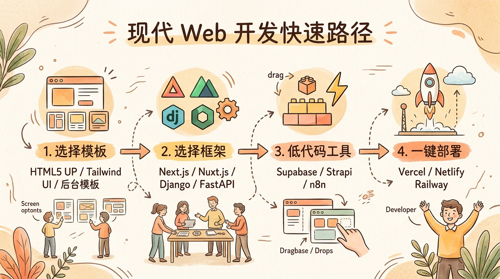

看完了前面的基础知识，你可能会问："我想做一个网站，从哪里开始？有没有快速上手的方法？"

这一章就是为你准备的！我会告诉你：
- 去哪里找现成的模板
- 快速开发用什么框架
- 怎么部署和上线

**重要提示：** 这一章的重点是"快速实现"——不需要从零开始写，用现成的工具和模板，先把东西做出来！

---

### 5.1 去哪里找现成的模板？

从零写一个好看的界面是很累的——设计、配色、布局、响应式……每一样都要花很多时间。

好消息是：有很多现成的模板可以用！你只需要稍微改一改，就能做出一个很漂亮的网站。

#### 前端模板网站

**1. ThemeForest**
- 网址：https://themeforest.net
- 特点：模板很多，各种类型都有（企业官网、电商、博客、后台管理……）
- 价格：一般几十美元到几百美元
- 注意：很多模板是用jQuery写的，不是用现代框架

**2. WrapBootstrap**
- 网址：https://wrapbootstrap.com
- 特点：基于Bootstrap的模板，质量比较高
- 价格：中等，比ThemeForest便宜一点

**3. HTML5 UP**
- 网址：https://html5up.net
- 特点：**免费！** 设计简洁，适合个人博客、小型网站
- 质量：很高，很多专业设计师在用

**4. Creative Tim**
- 网址：https://www.creative-tim.com
- 特点：有免费版和付费版，有基于React、Vue、Angular的模板
- 质量：很高，设计很现代

**5. Tailwind UI**
- 网址：https://tailwindui.com
- 特点：基于Tailwind CSS的组件库和模板
- 价格：付费，但物有所值
- 注意：需要自己用框架组装（React、Vue都可以）

**6. Untitled UI**
- 网址：https://untitledui.com
- 特点：设计很现代，有Figma文件和代码
- 价格：一次性付费，永久使用

---

#### 后台管理系统模板

做后台管理系统是最常见的需求之一，幸运的是，有很多开源的、漂亮的后台模板可以用！

**1. Ant Design Pro**
- 网址：https://pro.ant.design
- 框架：React
- 特点：阿里巴巴出品，功能强大，组件丰富
- 适用场景：企业级后台管理系统
- 推荐指数：⭐⭐⭐⭐⭐

**2. Vue Element Admin**
- 网址：https://panjiachen.gitee.io/vue-element-admin
- 框架：Vue 2 + Element UI
- 特点：非常流行，中文文档完善
- 推荐指数：⭐⭐⭐⭐⭐

**3. Vben Admin**
- 网址：https://vben.vvbin.cn
- 框架：Vue 3 + TypeScript + Vite
- 特点：现代、快速、功能强大
- 推荐指数：⭐⭐⭐⭐⭐

**4. D2Admin**
- 网址：https://d2.pub/zh-CN
- 框架：Vue
- 特点：简洁、易用、文档完善
- 推荐指数：⭐⭐⭐⭐

**5. React Admin**
- 网址：https://marmelab.com/react-admin
- 框架：React
- 特点：专注于CRUD（增删改查），很灵活
- 推荐指数：⭐⭐⭐⭐

---

#### Landing Page（落地页）模板

Landing Page就是"着陆页"——用户点广告或者搜索结果进来的第一个页面，通常用来展示产品、收集线索。

**1. Divi**
- 网址：https://www.elegantthemes.com
- 特点：WordPress主题，非常灵活，可视化编辑
- 价格：付费

**2. Carrd**
- 网址：https://carrd.co
- 特点：简单、漂亮的单页网站生成器
- 价格：免费版有限制，付费版便宜

**3. Tailwind UI Landing Pages**
- 网址：https://tailwindui.com/templates
- 特点：基于Tailwind CSS，设计很现代
- 价格：付费

---

### 5.2 快速开发用什么框架？

选对框架能帮你节省很多时间！我给你推荐几个"快速开发"的框架——它们都有一个共同特点：**约定优于配置**，很多事情框架都帮你决定好了，你只需要专注于业务逻辑。

#### 前端快速开发框架

**1. Next.js（React）**
- 网址：https://nextjs.org
- 特点：
  - React生态最流行的全栈框架
  - 支持SSR（服务端渲染）和SSG（静态生成）
  - SEO友好
  - 文件系统路由（你建个文件就是路由，不用配置）
  - API路由（可以写后端API）
- 适用场景：企业官网、博客、电商、SaaS
- 推荐指数：⭐⭐⭐⭐⭐

**2. Nuxt.js（Vue）**
- 网址：https://nuxt.com
- 特点：
  - Vue生态最流行的全栈框架
  - 类似Next.js，但用Vue
  - SEO友好
  - 自动导入（不用写import）
- 适用场景：企业官网、博客、电商、SaaS
- 推荐指数：⭐⭐⭐⭐⭐

**3. Remix（React）**
- 网址：https://remix.run
- 特点：
  - 较新，但很有前景
  - 专注于Web标准
  - 数据加载很优雅
  - 性能好
- 推荐指数：⭐⭐⭐⭐

**4. SvelteKit（Svelte）**
- 网址：https://kit.svelte.dev
- 特点：
  - Svelte的全栈框架
  - 代码量少，性能好
  - 学习曲线平缓
- 推荐指数：⭐⭐⭐⭐

---

#### 后端快速开发框架

**1. Nest.js（Node.js）**
- 网址：https://nestjs.com
- 特点：
  - Node.js生态最"企业级"的框架
  - 用TypeScript写的，类型安全
  - 架构清晰（Controller → Service → Repository）
  - 模块丰富（认证、数据库、缓存……）
  - 借鉴了Angular的设计
- 适用场景：企业级API、微服务
- 推荐指数：⭐⭐⭐⭐⭐

**2. Django（Python）**
- 网址：https://www.djangoproject.com
- 特点：
  - Python最流行的Web框架
  - "电池内置"——很多功能都有了（ORM、认证、管理后台……）
  - 管理后台超级好用，自动生成
  - 开发速度快
- 适用场景：内容管理系统、后台管理系统、快速原型
- 推荐指数：⭐⭐⭐⭐⭐

**3. FastAPI（Python）**
- 网址：https://fastapi.tiangolo.com
- 特点：
  - 很新，但非常流行
  - 性能好（基于Starlette和Pydantic）
  - 自动生成API文档（Swagger UI）
  - 类型安全
- 适用场景：API服务、机器学习服务
- 推荐指数：⭐⭐⭐⭐⭐

**4. Gin（Go）**
- 网址：https://gin-gonic.com
- 特点：
  - Go最流行的Web框架
  - 快，非常快
  - 简单易用
  - 中间件丰富
- 适用场景：高性能API、微服务
- 推荐指数：⭐⭐⭐⭐

---

#### 全栈框架——前后端一起搞定！

如果你想"一次搞定前后端"，可以试试这些全栈框架：

**1. T3 Stack**
- 网址：https://create.t3.gg
- 技术栈：Next.js + TypeScript + tRPC + Prisma + Tailwind CSS
- 特点：
  - 类型安全从数据库到前端
  - tRPC让API调用像调用函数一样简单
  - Prisma是最好用的TypeScript ORM
  - 现代化、开发体验好
- 推荐指数：⭐⭐⭐⭐⭐

**2. RedwoodJS**
- 网址：https://redwoodjs.com
- 技术栈：React + GraphQL + Prisma
- 特点：
  - 借鉴了Ruby on Rails的设计
  - 约定优于配置
  - 全栈类型安全
- 推荐指数：⭐⭐⭐⭐

**3. Blitz.js**
- 网址：https://blitzjs.com
- 技术栈：Next.js + Prisma
- 特点：
  - 基于Next.js
  - 无API层（直接在组件里调用服务端代码）
  - 开发速度快
- 推荐指数：⭐⭐⭐⭐

---

### 5.3 低代码/无代码选择

如果你不想写代码，或者想更快地做出东西，可以试试这些低代码/无代码平台：

#### 后台管理系统

**1. Supabase**
- 网址：https://supabase.com
- 特点：
  - 开源的Firebase替代
  - PostgreSQL数据库
  - 自动生成REST API
  - 认证、存储、实时数据库……都有
  - 免费版够用
- 适用场景：快速原型、SaaS后台
- 推荐指数：⭐⭐⭐⭐⭐

**2. Strapi**
- 网址：https://strapi.io
- 特点：
  - 开源的Headless CMS
  - Node.js写的
  - 可视化内容管理
  - 自动生成API（REST或GraphQL）
  - 可以自己部署
- 适用场景：内容管理、API生成
- 推荐指数：⭐⭐⭐⭐

**3. AppSmith**
- 网址：https://appsmith.com
- 特点：
  - 开源的内部工具开发平台
  - 拖拽式界面
  - 连接数据库、API
  - 可以自己部署
- 适用场景：内部工具、后台管理
- 推荐指数：⭐⭐⭐⭐

---

#### 自动化工具

**1. n8n**
- 网址：https://n8n.io
- 特点：
  - 开源的Zapier替代
  - 可视化工作流
  - 可以自己部署
  - 支持几百个应用
- 适用场景：自动化工作流、数据同步
- 推荐指数：⭐⭐⭐⭐⭐

**2. Zapier**
- 网址：https://zapier.com
- 特点：
  - 老牌自动化工具
  - 支持几千个应用
  - 不用自己部署
  - 免费版有限制
- 适用场景：快速自动化
- 推荐指数：⭐⭐⭐⭐

---

### 5.4 部署和CI/CD——把网站上线！

你把网站写好了，怎么让别人能访问到？这就是部署要解决的问题。

在以前，部署是件很麻烦的事情——你要买服务器、配置环境、上传代码、重启服务……每一步都可能出错。

现在好了，有很多"一键部署"的平台，部署变得超级简单！

---

#### 代码托管

首先，你的代码要放在一个地方——通常是Git仓库。

**1. GitHub**
- 网址：https://github.com
- 特点：
  - 最流行的代码托管平台
  - 免费版够用
  - GitHub Actions可以做CI/CD
  - 开源项目很多
- 推荐指数：⭐⭐⭐⭐⭐

**2. GitLab**
- 网址：https://gitlab.com
- 特点：
  - 功能更全面
  - 自带CI/CD
  - 可以自己部署
- 推荐指数：⭐⭐⭐⭐

---

#### 前端部署平台

前端部署最简单，因为只是静态文件。

**1. Vercel**
- 网址：https://vercel.com
- 特点：
  - Next.js官方推荐
  - 一键部署（GitHub仓库连上就行）
  - 自动HTTPS
  - 全球CDN
  - 免费版够用
- 推荐指数：⭐⭐⭐⭐⭐

**2. Netlify**
- 网址：https://netlify.com
- 特点：
  - 类似Vercel
  - 一键部署
  - 功能强大（表单处理、边缘函数……）
  - 免费版够用
- 推荐指数：⭐⭐⭐⭐⭐

**3. Cloudflare Pages**
- 网址：https://pages.cloudflare.com
- 特点：
  - Cloudflare出品
  - 速度快（Cloudflare的CDN）
  - 免费
- 推荐指数：⭐⭐⭐⭐

---

#### 全栈/后端部署平台

后端部署稍微复杂一点，但现在也有很多简单的平台。

**1. Railway**
- 网址：https://railway.app
- 特点：
  - 超级简单！
  - 支持Node.js、Python、Go、Java……
  - 可以一键部署PostgreSQL、Redis、MongoDB
  - 免费版有额度限制
- 推荐指数：⭐⭐⭐⭐⭐

**2. Render**
- 网址：https://render.com
- 特点：
  - 类似Railway
  - 支持Web服务、后台任务、数据库
  - 自动HTTPS
  - 免费版有额度限制
- 推荐指数：⭐⭐⭐⭐⭐

**3. Fly.io**
- 网址：https://fly.io
- 特点：
  - 把Docker容器部署到全球
  - 速度快
  - 价格合理
- 推荐指数：⭐⭐⭐⭐

**4. AWS / Azure / GCP**
- AWS：https://aws.amazon.com
- Azure：https://azure.microsoft.com
- GCP：https://cloud.google.com
- 特点：
  - 功能最强大
  - 价格便宜（但计费复杂）
  - 学习曲线陡峭
  - 适合大型项目
- 推荐指数：⭐⭐⭐（适合有经验的人）

---

#### CI/CD——自动构建、自动测试、自动部署

CI/CD是"持续集成/持续部署"的缩写——简单来说，就是"代码一推上去，自动构建、自动测试、自动部署"。

**1. GitHub Actions**
- 网址：https://github.com/features/actions
- 特点：
  - 集成在GitHub里
  - 配置简单（YAML文件）
  - 免费（公开仓库无限制，私有仓库有额度）
  - 市场上有很多现成的Action
- 推荐指数：⭐⭐⭐⭐⭐

**2. GitLab CI**
- 网址：https://docs.gitlab.com/ee/ci
- 特点：
  - 集成在GitLab里
  - 功能强大
  - 配置也是YAML
- 推荐指数：⭐⭐⭐⭐

**3. Jenkins**
- 网址：https://www.jenkins.io
- 特点：
  - 老牌CI/CD工具
  - 非常灵活
  - 可以自己部署
  - 学习曲线陡峭
- 推荐指数：⭐⭐⭐（适合有经验的人）

---

#### 容器化——Docker和Kubernetes

容器化现在已经是标配了——简单来说，就是"把应用和它的依赖打包在一起，在哪里运行都一样"。

**1. Docker**
- 网址：https://www.docker.com
- 特点：
  - 最流行的容器技术
  - 一次构建，到处运行
  - 学习曲线平缓
- 推荐指数：⭐⭐⭐⭐⭐

**2. Kubernetes**
- 网址：https://kubernetes.io
- 特点：
  - 容器编排平台
  - 功能强大（自动扩展、负载均衡、自我修复……）
  - 学习曲线陡峭
  - 适合大型项目
- 推荐指数：⭐⭐⭐（先学Docker，再学K8s）

---

## 结语：持续学习，保持好奇

恭喜你读到了这里！这篇文章很长，涵盖了很多内容——从网页是怎么工作的，到前后端基础知识，再到设计模式、快速实现路径。

在最后，我想给你几个建议：

### 1. 不要纠结于"选什么"，先开始

很多新手会纠结："我是学React还是Vue？"、"我是学Node.js还是Python？"

我的建议是：**随便选一个，先开始！**

语言和框架只是工具，核心是编程思想。学会了一个，再学另一个会很快。重要的是，不要在"选择"上浪费太多时间，先动手做！

### 2. 做项目是最好的学习方式

看书、看视频、看教程……这些都有用，但**最有用的是自己动手做项目**。

找一个你感兴趣的项目：
- 个人博客
- 待办事项应用
- 简单的电商网站
- 社交应用

先做出来，再慢慢优化。在做项目的过程中，你会遇到问题，解决问题的过程就是学习的过程。

### 3. AI是工具，不是替代品

这篇文章的标题是"AI编程"，但我想强调：**AI是工具，不是替代品**。

AI能帮你写代码、找bug、解释概念，但它不能代替你思考——你需要知道自己在构建什么，为什么这样构建，这样才能指导AI正确地工作。

就像自动驾驶汽车不能代替驾驶员一样，AI编程工具也不能代替开发者——它只是让开发者更高效了。

### 4. 持续学习，保持好奇

技术发展很快，新的框架、新的工具、新的模式一直在出现。

不要害怕学新东西——核心概念是不变的，变的只是实现方式。保持好奇心，持续学习，你就不会被淘汰。

---

好了，这篇文章就到这里。希望这篇文章能帮你建立起对前后端开发的完整认知。

如果你有问题，或者想和我交流，欢迎给我留言！

Happy coding! 🚀
