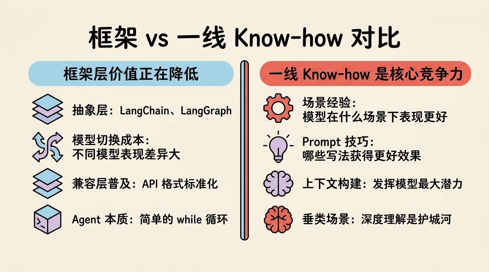
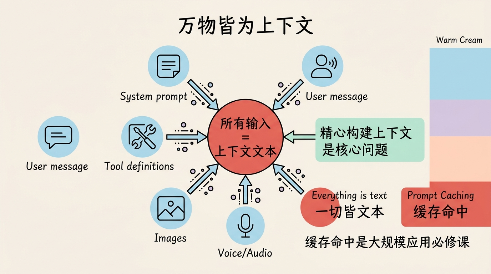
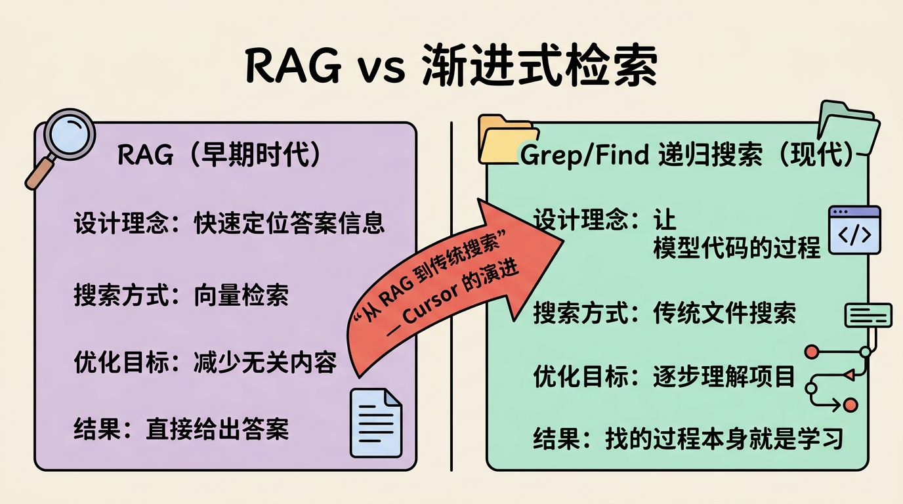
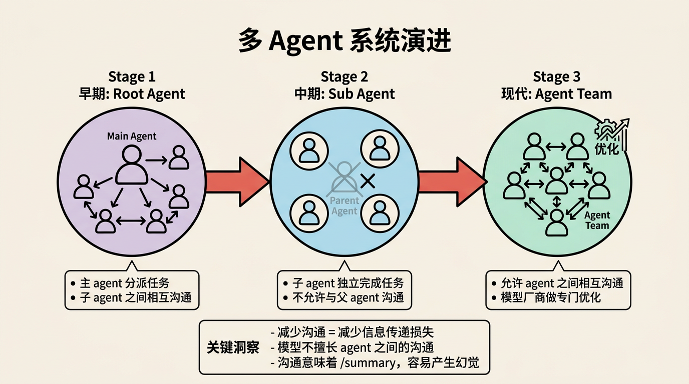
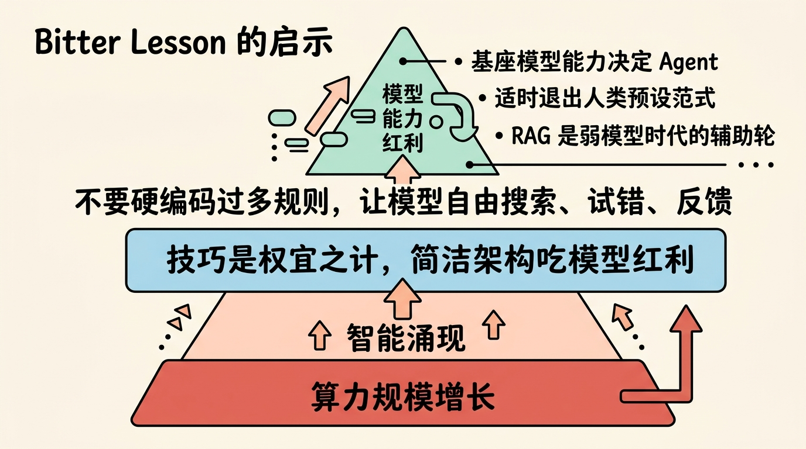
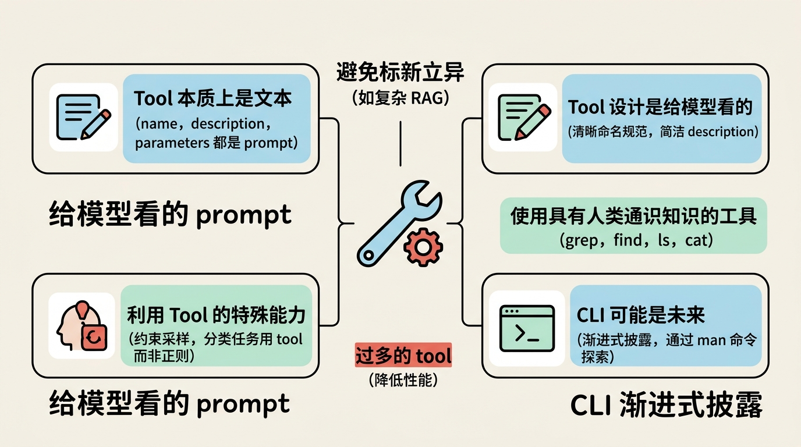

# Agent 实战落地经验与技术思考

## 前言

在当前 AI Agent 技术快速发展的背景下，很多开发者都在探索如何构建高效可靠的 Agent 应用。本文整理了一场来自一线开发者的技术分享，聚焦于 Agent 实践中的真实经验、技术思考与设计哲学，希望能为正在探索 Agent 开发的同学提供参考。

---

## 一、重新思考 Agent 框架的价值

### 1.1 框架层的价值正在降低

在大模型发展初期，各类 Agent 框架（如 LangChain、LangGraph）曾备受关注。这些框架试图在应用和大模型之间构建一层抽象层，主要价值是方便切换不同模型厂商。

然而实践表明，这种抽象层的实际价值已经很低：

1. **模型切换成本并不低**：不同模型在相同 prompt 下表现差异显著，切换模型往往需要重新优化 prompt 和 tool 设计
2. **兼容层已普及**：各大模型厂商基本都兼容 OpenAI 或其他标准 API 格式
3. **Agent 本质简单**：Agent 就是一个大 while 循环——观察状态、思考下一步、执行工具或回答，循环往复

### 1.2 真正的价值在哪里？

Agent 开发真正的价值在于 **一线交互过程中积累的 Know-how**：

- 模型在什么场景下表现更好？
- 哪些 prompt 写法能获得更好的效果？
- 上下文如何构建才能发挥模型最大潜力？

这些经验是框架无法提供的，只能在真实场景中通过大量测试、观察、调优获得。像Manus这样的应用之所以能超越模型厂商的官方 Agent 实现，正是因为他们在一线积累了大量特定领域的 insights。

> **关键洞察**：应用厂商并不一定会被模型厂商吞噬。垂类场景的深度理解是难以被替代的护城河。



---

## 二、上下文：一切的核心

### 2.1 万物皆为上下文

从 OpenAI 开源的 [harmony](https://github.com/openai/harmony) 项目可以看到一个重要事实：**所有输入到模型的内容最终都会被编码为文本**。

无论是 system prompt、user message、tool 定义，还是图片、语音，在模型视角下都是——上下文。这意味着 Agent 开发的核心问题简化为：**如何精心构建上下文**。

```
<|start|>system<|message|>You are ChatGPT, a large language model trained by OpenAI.
Knowledge cutoff: 2024-06
Current date: 2025-06-28

Reasoning: high

# Valid channels: analysis, commentary, final. Channel must be included for every message.
Calls to these tools must go to the commentary channel: 'functions'.<|end|>

<|start|>developer<|message|># Instructions

Always respond in riddles

# Tools

## functions

namespace functions {

// Gets the location of the user.
type get_location = () => any;

// Gets the current weather in the provided location.
type get_current_weather = (_: {
// The city and state, e.g. San Francisco, CA
location: string,
format?: "celsius" | "fahrenheit", // default: celsius
}) => any;

} // namespace functions<|end|><|start|>user<|message|>What is the weather like in SF?<|end|><|start|>assistant
```

### 2.2 缓存命中：大规模应用的必修课

当你的应用需要处理大量用户请求时，缓存命中成为必须考虑的问题。缓存 miss 会导致：

- 成本激增（可能达到 10 倍以上）
- 延迟增加（需要重新处理完整上下文）

**实践建议**：

1. **system prompt 保持稳定**：避免在 system prompt。中放入时间戳、文件列表等频繁变化的内容
2. **tool list 慎放 system prompt**：如果应用支持用户动态添加/删除工具，tool list 会破坏缓存
3. **考虑共享 system prompt**：在用户量极大的场景，可以让多个用户共享同一个 system prompt 以提升首次响应速度

> **拓展阅读**：[Anthropic Prompt Caching 官方文档](https://docs.anthropic.com/en/docs/build-with-claude/prompt-caching)

### 2.3 上下文长度与模型能力

一个重要但常被忽视的现象：**随着上下文变长，模型能力会下滑**。

测试发现，当上下文被大量内容填充后：
- 模型对早期内容的注意力会减弱
- 难以基于全文进行复杂推理
- 回答质量明显下降

这直接影响我们如何设计 RAG 或其他信息检索机制。



---

## 三、上下文构建的艺术

### 3.1 RAG vs. 渐进式检索

在 Code Agent 的演进中，我们看到了一个有趣的对比：

| 时代 | 检索方式 | 设计理念 |
|------|----------|----------|
| 早期 | RAG | 快速定位答案信息，减少无关内容 |
| 现代 | grep/find 递归搜索 | 让模型经历找代码的过程，逐步理解项目 |

为什么 Cursor 从 RAG 转向传统文件搜索？因为 **找的过程本身就是学习**。人类在陌生仓库中提 PR 时，正是通过层层查找代码来理解项目结构。删除这个过程反而降低了模型对项目的理解程度。

这揭示了一个深刻问题：看似无关的信息（搜索过程）可能对最终结果至关重要。**上下文的每一项都需要经过仔细思考和 benchmark 验证**。



### 3.2 错误记录：删还是留？

一个常见的优化实践：当模型多次调用同一个 tool 失败后，最终成功时，应该删除前面的错误记录以节省 token？

**取舍**：
- 删除：节省 token、缩短上下文、提升后续模型质量
- 保留：避免模型重复犯同样的错误

没有标准答案，需要根据场景权衡。代码场景可能更倾向于保留错误记录，因为重复调试的代价很高。

### 3.3 动态 Prompt 注入

一种有趣的机制：在运行过程中根据上下文状态动态注入提示。

示例场景：
- 当上下文长度接近上限时，提醒模型"尽快给出答案"
- 当一个回合的思考/执行步数过多时，提醒模型"检查是否偏离目标"

虽然用"低智力的代码"去提醒"高智力的模型"听起来有些滑稽，但在实践中往往有效。Claude Code 的 plan mode 就采用了类似机制，用数千字的 prompt 约束模型不执行修改操作。

> **思考**：这反映了当前模型在某些行为约束上的局限性，需要通过工程手段弥补。

### 3.4 Prompt 扰动机制

在 few-shot 示例中观察到的现象：如果模型看到的示例是固定的，它可能倾向于"偷懒"，直接复制示例的处理方式。

**解决方案**：让 few-shot 示例动态轮换，引入适度扰动，避免模型陷入机械复制。

### 3.5 上下文压缩的代价

**重要警示**：压缩上下文一定会产生幻觉。

代码的信息密度远高于自然语言，压缩意味着信息损失。而模型有两个强化幻觉的倾向：
1. 尊重现有代码，倾向于不修改
2. 将上下文内容视为 ground truth

压缩产生的二义性和信息损失会引发幻觉，在长任务中不断累积，最终导致失败。这就是为什么 /compact 一个session 后的对话质量往往大幅下降。

---

## 四、多 Agent 系统的演进

### 4.1 从 Root Agent 到 Sub Agent

早期的多 Agent 设计多采用 Root Agent 模式：主 agent 收到请求后，将任务分派给前端/后端/设计等子 agent，子 agent 之间可以相互沟通。

后来 Claude 采用了更优雅的 **Sub Agent**：通过一个 `task` tool 创建与当前 agent 能力相同的子 agent，子 agent 独立完成任务后将结果返回，期间不允许与父 agent 沟通。

**为什么这样设计？**

因为当前的模型并不擅长 agent 之间的沟通。沟通意味着 /summary，而模型做 /summary 的提取点往往与人类预期不一致，容易产生幻觉。减少沟通就减少了信息传递的损失。

### 4.2 Agent Team 的回退？

令人玩味的是，Claude 后来又推出了 Agent Team，允许 agent 之间相互沟通。这可能意味着：

1. 模型厂商针对多 agent 沟通做了专门的后训练优化
2. 或者发现了 Sub Agent机制的某些局限性

值得注意的是，agent 之间的沟通信息有时会对任务结果产生负面影响——如果模型认为"同事的提醒基本正确"，幻觉就会在沟通中累积。



---

## 五、Bitter Lesson 对 Agent 的启示

> **拓展阅读**：[The Bitter Lesson - Rich Sutton](http://www.incompleteideas.net/IncIdeas/BitterLesson.html)

Bitter Lesson 告诉我们：**算力规模的增长是智能涌现的核心驱动力**，人类设计的复杂技巧虽然在短期内有效，但最终会被更简洁、更充分利用算力的架构超越。

这对 Agent 开发的启示：

### 5.1 基座模型能力决定 Agent 架构

当模型能力停滞时，为模型设计复杂框架（如 RAG）是必要的。但当模型能力跨越阈值，更简洁的架构（如 grep/find）可能效果更好。

Cursor 从 RAG 转向传统搜索，正是因为他们认识到了模型的进步，并通过后训练强化了模型的搜索能力，使得复杂框架反而成为拖累。

### 5.2 适时退出人类预设范式

RAG 是弱模型时代的辅助轮。在强模型时代，模型可以自主思考、自主检索，就应该逐渐退出这些"辅助轮"。

**CoT 是下一个候选吗？**

CoT（Chain of Thought）要求模型"一步步思考"，这是人类预设的思维范式。如果模型能力足够强，是否还需要这种显式引导？

### 5.3 架构简洁的胜利

不要硬编码过多规则和特例。在当前模型能力下，构思一套 **最简洁、最符合奥卡姆剃刀原则** 的 Agent 架构，让模型自由地搜索、试错、反馈、解决问题，这样才能获得模型能力增长的红利。

各种 trick 都是为了弥补当前模型的局限性，而 Agent 的核心——**观测、思考、执行的循环**——短期内不会改变。



---

## 六、Tool 设计的最佳实践

### 6.1 Tool 本质上是文本

Tool 的 name、description、parameters 最终都会作为 prompt 被模型理解，没有任何魔法。

一个有趣的观察：Claude 某个版本中，有些 system reminder 无法通过普通 message 传递，开发者就将其拼接到任意一个 tool 的返回消息后面——因为模型眼中，**上下文没有高低贵贱之分，塞进去就能理解**。

### 6.2 Tool 设计是给模型看的

很多开发者习惯用程序员的思维命名 tool 和参数，但 **tool 设计是给模型看的 prompt**。

优秀实践：
- 建立命名规范：如浏览器相关 tool 都用 `browser_` 前缀
- description 要清晰、简洁，用模型容易理解的语言

### 6.3 利用 Tool 的特殊能力

不要自创 DSL，优先利用 tool 的特殊能力。例如分类任务：

- ❌ 告诉模型"只输出标签"，然后用正则提取
- ✅ 定义一个 tool，参数就是标签选项，让模型调用 tool

因为模型厂商对 tool 调用做了专门优化（如约束采样），调用成功率和参数正确率更高。

### 6.4 避免标新立异的 Tool

如果一个 tool 太复杂，连人类都难以解释清楚，模型更难理解正确用法。

RAG 就是这样的例子——它是一个标新立异的工具，需要额外的 prompt 约束才能用好。

**推荐原则**：使用具有人类通识知识的工具（如 grep、find、ls、cat），这些工具在模型的训练数据中出现过无数次，模型自然会用。

### 6.5 Tool 数量控制

过多的 tool 会：
- 占用上下文
- 降低性能（模型难以选择）

Claude 的 tool 数量一度过多，后来推出了 `tool_search` 机制让模型动态查询可用 tool，但这更像是一种补丁式的 hack。

### 6.6 CLI 可能是未来

Claude 推出了 security tool 来减少 tool 调用传递的中间结果。但更本质的方向可能是：**让模型像人类使用 CLI 一样，通过 `man` 命令逐步探索工具**。

MCP (Model Context Protocol) 社区中出现了很多 "MCP to CLI" 项目，这预示着 CLI 模式可能是未来趋势——渐进式披露、按需探索。



---

## 七、Memory 的挑战与思考

### 7.1 记忆什么？如何记忆？

Memory 面临几个难题：

1. **提取困难**：模型不擅长判断哪些信息值得记忆
2. **更新困难**：代码、依赖库、打包工具都在变化，memory 如何保持更新？
3. **检索困难**：用小模型做 RAG 检索效果不一定好

有趣的是：**将所有 memory 放入上下文，往往比复杂检索效果更好**——因为模型可以直接从全文中理解。

### 7.2 Memory 的副作用

1. **过度活跃**：memory 在 system prompt 中会让模型过于频繁地提起"你上次问过..."
2. **限制发散**：过多的 memory 会限制模型独立思考

### 7.3 当前方案

1. **Memory as Markdown**：放弃结构化存储，直接存储上下文文本，由模型自己处理
2. **结构化 JSON**：类似的方式，便于更新和检索

---

## 八、Cursor、Claude 与 Open Claw 的价值

### 8.1 Cursor：市场教育

Cursor 在 2025 年初的市场教育功不可没。在此之前，开发者习惯"模型说一步我检查一步"的交互模式。Cursor 告诉我们：**直接看最终结果就行，不需要检查中间过程**。

这为 Agent 的大规模普及奠定了心理基础。

### 8.2 Open Claw：完全解放

Open Claw将市场教育更进一步：**给你电脑权限，自己玩去吧，代码都不用看，只要给我高层次结果**。

这彻底解放了长链智能体的思维定式。未来会有更多这类"自主执行"的应用出现。

---

## 九、核心要点总结

1. **一线 Know-how 是核心竞争力**：框架价值低，实战经验不可替代

2. **上下文是一切**：所有输入最终都是文本，精心构建上下文是关键

3. **重视缓存命中**：稳定 system prompt，避免频繁变化的配置

4. **上下文越长能力越弱**：需要谨慎设计信息检索和压缩策略

5. **简洁架构吃模型红利**：不要过度设计，让模型发挥智能

6. **Tool 设计给模型看**：遵循命名规范，避免标新立异

7. **Bitter Lesson 的启示**：算力规模是核心，技巧是权宜之计

8. **CLI 渐进式披露**：让模型像人类一样探索工具，可能优于海量 tool 列表

   

## 十、延伸阅读

- [Anthropic Prompt Caching](https://docs.anthropic.com/en/docs/build-with-claude/prompt-caching)
- [The Bitter Lesson - Rich Sutton](http://www.incompleteideas.net/IncIdeas/BitterLesson.html)
- [OpenAI Harmony](https://github.com/openai/harmony)
- [Magnus - Agent Development Framework](https://github.com/mnpx/mnpx)
- [Model Context Protocol (MCP)](https://modelcontextprotocol.io/)

---

*本文整理自一线 Agent 开发者的技术分享，内容仅代表演讲者个人观点。*
