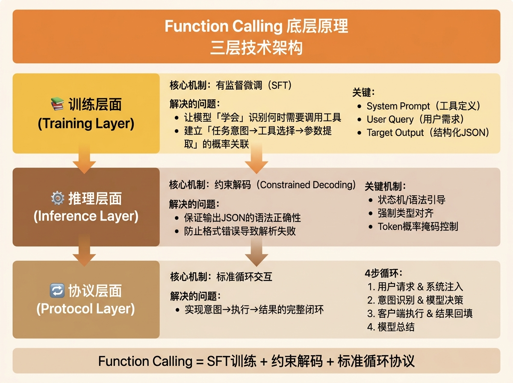
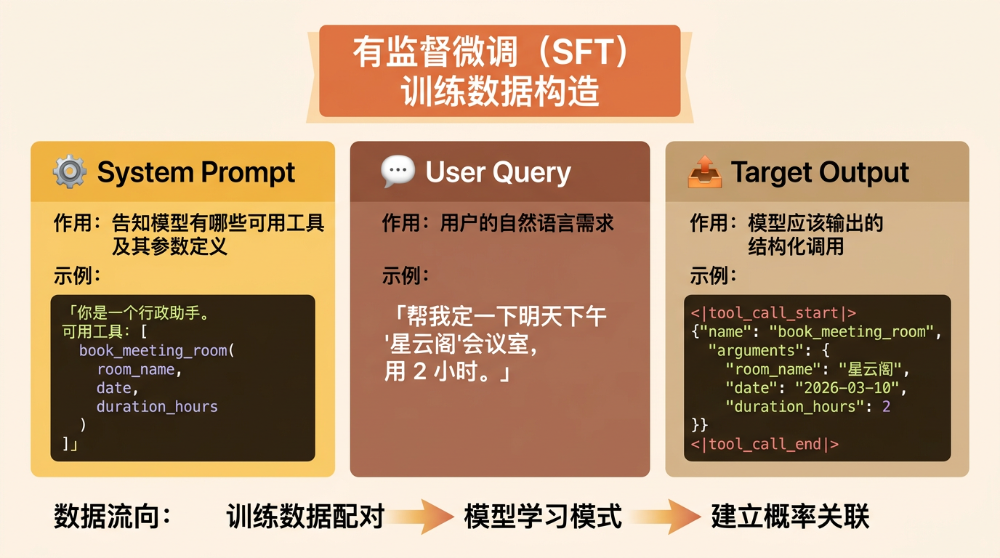
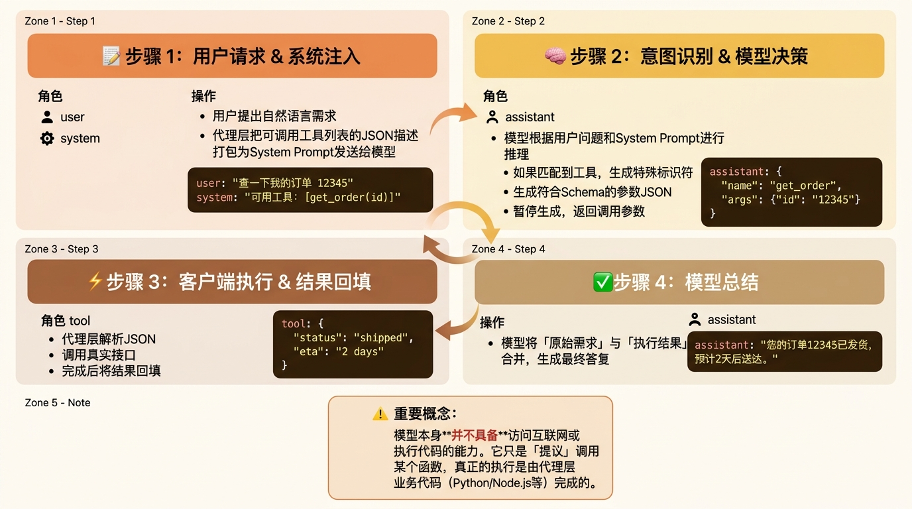
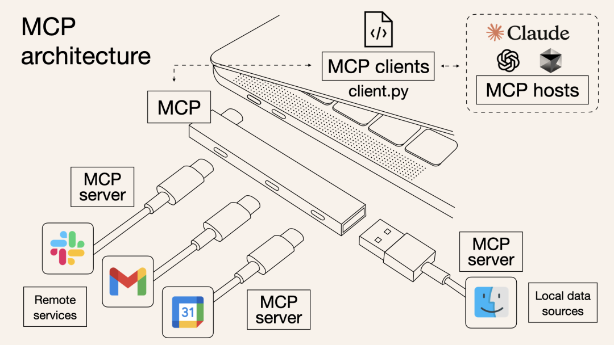
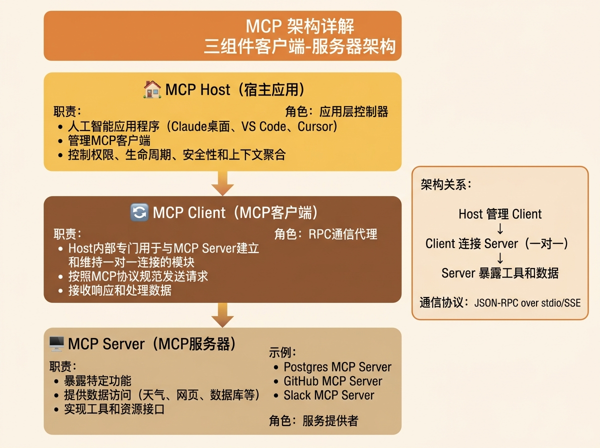
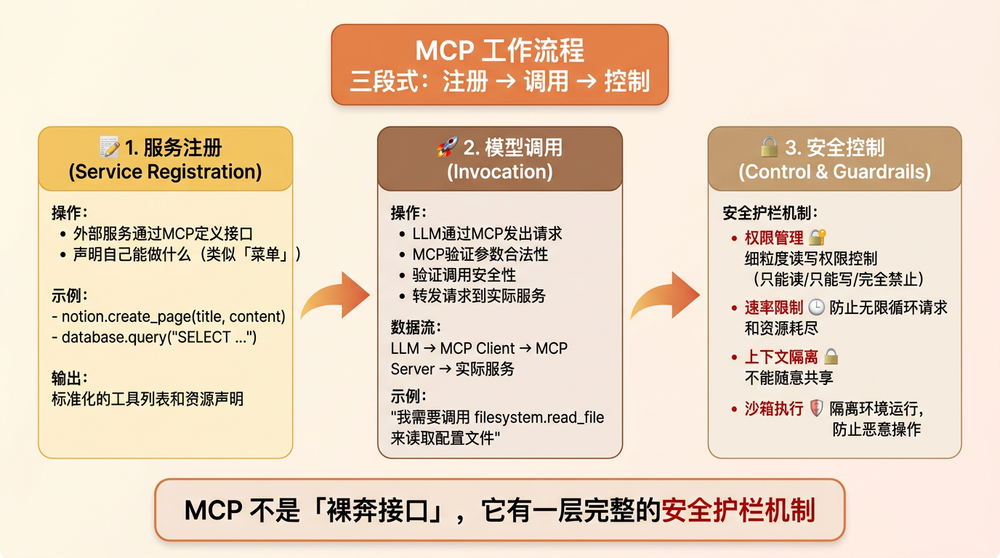

# 从"只能回答"到"能调用工具"：LLM能力的演进

## 背景与演进

在传统的 LLM 交互中，模型只能通过自然语言与用户对话。无论用户问什么问题，LLM 都只能基于其训练数据生成文本回答——它无法真正"做"任何事情，比如查询实时天气、读取数据库、发送邮件或执行代码。

这就好比一个非常博学但行动力为零的学者：他知道一切知识，但当你让他"帮我查一下明天的航班"时，他只能告诉你"我很抱歉，我无法访问实时数据"。

**Function Calling 的出现，改变了这一局面**。它让 LLM 从"只能回答问题"的被动角色，变成了"能指挥工具干活"的主动指挥官。

> **核心比喻**：
> - **传统 LLM**：像一台只有屏幕的电视机——只能被动显示内容
> - **Function Calling**：给这台电视接上了遥控器——可以控制外部设备
> - **MCP**：为所有遥控器制定了统一的标准协议

> **延伸阅读**：
> - [OpenAI Function Calling Documentation](https://platform.openai.com/docs/guides/function-calling) - Function Calling官方文档
> - [Anthropic Tool Use Guide](https://docs.anthropic.com/en/docs/build-with-claude/tool-use) - Claude工具调用指南

## Function Calling底层原理

现代大模型（如 GPT-4、Claude、Qwen-7B-Chat 等）之所以能够精准调用工具，是因为在训练阶段进行了特殊的**有监督微调**，使用精心构造的数据集让模型建立了"任务意图→工具选择→参数提取"的概率关联。

这一过程让模型学会：当用户意图匹配某个工具时，不再输出自然语言，而是输出特定格式的结构化数据（通常是 JSON），方便代理层解析并执行相应的服务调用。

从技术角度看，Function Calling 的实现涉及三个层面：

| 层面 | 核心机制 | 解决的问题 |
|------|----------|------------|
| **训练层面** | 有监督微调（SFT） | 让模型"学会"识别何时需要调用工具 |
| **推理层面** | 约束解码（Constrained Decoding） | 保证输出 JSON 的语法正确性 |
| **协议层面** | 标准循环交互 | 实现意图→执行→→结果的完整闭环 |



### 1. 训练层面：教会模型"填空" (SFT)

**问题**：模型本质上是一个概率预测器，它如何学会"当用户想预订会议室时，应该调用特定函数并提取参数"？

**答案**：通过**有监督微调**（Supervised Fine-Tuning，简称 SFT）。

#### 训练数据构造

训练团队会构造大量高质量的「用户意图→工具调用」配对数据：

| 数据字段 | 作用 | 示例 |
|----------|------|------|
| **System Prompt** | 告知模型有哪些可用工具及其参数定义 | `可用工具: [book_meeting_room(room_name, date, duration_hours)]` |
| **User Query** | 用户的自然语言需求 | `帮我定一下明天下午"星云阁"会议室，用 2 小时。` |
| **Target Output** | 模型应该输出的结构化调用 | `<|tool_call_start|>{"name": "book_meeting_room", ...}<|tool_call_end|>` |

#### 训练示例

```
### System:
你是一个行政助手。可用工具: [book_meeting_room(room_name, date, duration_hours)]

### User:
帮我定一下明天下午'星云阁'会议室，用 2 小时。

### Assistant:
<|thought|>
用户想要预订会议室。
参数提取：
- 会议室：星云阁
- 日期：明天（基于当前日期 2026-03-09 推算为 2026-03-10）
- 时长：2 小时
匹配工具：book_meeting_room
<|tool_call_start|>:{"name": "book_meeting_room", "arguments": {"room_name": "星云阁", "date": "2026-03-10", "duration_hours": 2}}<|tool_call_end|>
```

通过这样的 SFT 训练，模型学到了一种模式：当用户意图与某个工具描述匹配时，不再输出自然语言，而是输出**特定标记符包裹的 JSON 结构**，方便代理层解析和执行。



> **延伸阅读**：
> - [Fine-Tuning Large Language Models](https://arxiv.org/abs/2103.10395) - 有监督微调理论基础
> - [Instruction Tuning for Large Language Models](https://arxiv.org/abs/2104.05559) - 指令微调研究

### 2. 推理层面：强制模型"守规矩" (Constrained Decoding)

**问题**：LLM 生成文本是概率性的，可能会生成错误的 JSON（比如缺少逗号、括号不匹配），导致代理层解析失败。

**解决方法**：推理引擎（如 vLLM、llama.cpp）使用**约束解码**（Constrained Decoding / Grammar-based Sampling）。

#### 工作原理

| 机制 | 说明 |
|------|------|
| **状态机/语法引导** | 推理引擎加载 JSON Schema，如果当前生成的 Token 破坏了 JSON 结构，引擎将其概率掩码（Mask）设为 0，迫使模型选择符合语法的下一个 Token |
| **强制类型对齐** | 如果 Schema 定义某个字段必须是 `integer`，模型在生成该字段时，只能从数字 Token 中选择 |

#### 实例说明

假设模型已经生成了 `{"city":`，按照 JSON 语法，下一个 Token **必须**是字符串的开始引号 `"`。如果模型想要生成一个数字，推理引擎会强行把数字的概率设为 0，迫使模型只能选择符合 JSON 语法的 Token。

**结果**：这保证了程序后端在拿到模型输出时，可以直接用 `json.loads()` 解析，而不会因为格式错误（Syntax Error）导致系统崩溃。

> **延伸阅读**：
> - [llama.cpp Grammar-based Sampling](https://github.com/ggerganov/llama.cpp/tree/master/grammars) - 基于语法的采样实现
> - [Guidance: Controlling Generative Models](https://github.com/guidance-ai/guidance) - 输出约束控制库

### 3. 协议层面：完整的交互循环（The Loop）

Function Calling 不仅仅是一次请求，而是一个标准的 **4 步循环协议**：

**核心逻辑**：一个"意图 → 动作 → 结果 → 结论"的完整闭环。



> **重要概念**：
> 模型本身**并不具备**访问互联网或执行代码的能力。它只是"提议"调用某个函数，真正的执行是由代理层业务代码（Python/Node.js 等）完成的。

| 循环协议步骤 | 角色 | 步骤描述 | 示例对话内容 |
|--------------|------|----------|----------------|
| **1. 用户请求 & 系统注入** | `user`、`system` | 用户提出自然语言需求<br>代理层把可调用工具列表的 JSON 描述打包为 System Prompt | `user`: "查一下我的订单 12345"<br>`system`: "你是一个可以调用工具的助理，可用工具：[get_order(id)]" |
| **2. 意图识别 & 模型决策** | `assistant` | 模型根据用户问题和 System Prompt 进行推理<br>如果匹配到工具，生成特殊标识符（如 `finish_reason='tool_calls'`）<br>生成符合 Schema 的参数 JSON<br>暂停生成，返回调用参数 | `assistant`: `{ "name": "get_order", "args": {"id": "12345"} }` |
| **3. 客户端执行 & 结果回填** | `tool` | 代理层解析 JSON，调用真实接口<br>完成后将结果回填 | `tool`: `{ "status": "shipped", "eta": "2 days" }` |
| **4. 模型总结** | `assistant` | 模型将"原始需求"与"执行结果"合并，生成最终答复 | `assistant`: "您的订单 12345 已发货，预计 2 天后送达。" |

> **实用技巧**：
> - **强制触发（Tool Choice）**：可以通过参数 `tool_choice='required'` 强制模型**必须**调用某个工具，这在自动化流水线（Pipeline）中非常有用
> - **并行调用**：某些模型支持同时调用多个工具，提升执行效率

> **延伸阅读**：
> - [OpenAI Parallel Function Calling](https://platform.openai.com/docs/guides/function-calling#parallel-function-calling) - 并行函数调用
> - [Streaming Function Calls](https://docs.anthropic.com/en/docs/build-with-claude/tool-use#streaming-tool-use) - 流式工具调用

## MCP：模型上下文协议

除了 Function Calling，**MCP**（Model Context Protocol）是大模型工具调用领域另一个备受关注的核心概念。

### MCP的定义

MCP，全称 **Model Context Protocol**，中文可译为**模型上下文协议**。

它由 Anthropic（Claude）在 2024 年提出，是一种 **Agent 级系统协议**，目标是让**大模型（LLM）能够安全、受控地访问外部工具和数据源**。

#### MCP的核心价值

| 维度 | 说明 |
|------|------|
| **标准化接口** | 就像给 AI 大模型装了一个"万能接口"，让 AI 模型能够与不同的数据源和工具进行无缝交互。它就像 USB-C 接口一样，提供了一种标准化的方法，将 AI 模型连接到各种数据源和工具 |
| **生态建设** | 旨在替换碎片化的 Agent 代码集成，使 AI 系统更可靠、更有效。通过建立通用标准，服务商可以基于协议推出自己服务的 AI 能力，开发者无需重复造轮子 |
| **上下文持久化** | 可以在不同的应用/服务之间保持上下文，从而增强整体自主执行任务的能力 |

#### 与Function Calling的关系

> **类比理解**：
> - **Function Calling**：像是"器官"——定义了模型"如何表达"想用工具的意图
> - **MCP**：像是"神经系统"——定义了工具和数据"如何规范地"暴露给模型，并提供统一的传输链路

简单来说，Function Calling 解决了**"模型怎么说"**的问题，而 MCP 解决了**"工具怎么接"**的问题。

> **延伸阅读**：
> [Model Context Protocol Specification](https://spec.modelcontextprotocol.io/) - MCP官方规范文档

### Function Calling 与 MCP 的协作

可以把它们的关系类比为**"乐高积木"与"乐高底板"**：

#### 维度一：能力的标准化

| 场景 | 没有 MCP 时 | 有了 MCP 后 |
|------|-------------|-------------|
| **工具发现** | 需要手动把 API 文档写成 JSON Schema 喂给模型 | 任何支持 MCP 的服务器自动导出标准工具列表，模型可以直接"看到" |
| **模型切换** | 换模型或平台可能需要重写工具描述 | MCP 提供统一接口，模型无关 |

#### 维度二：连接的拓扑结构

- **Function Calling（点对点）**：`App → 编写解析代码 → 调用具体 API`
- **MCP（星型拓扑）**：`App → MCP 控制器 → 挂载 N 个 MCP Servers`（如 Postgres 服务器、Slack 服务器、GitHub 服务器）



> **核心比喻**：
> MCP 是为 LLM 打造的"USB 接口标准"，让它能安全地接上各种外部设备和服务。

#### 完整对比表

| 特性 | Function Calling（函数调用） | MCP（模型上下文协议） |
|------|------------------------------|------------------------|
| **本质** | 模型的一种**生成能力**（输出 JSON） | 一套**通信协议**（定义如何传输数据和工具） |
| **关注点** | 侧重于"模型怎么说" | 侧重于"工具怎么接"、"数据怎么传" |
| **作用域** | 单次对话的请求/响应循环 | 跨平台、跨工具的持久化连接 |
| **开发者工作** | 手写 JSON Schema 和解析逻辑 | 运行一个现成的 MCP Server 即可一键挂载工具 |
| **可扩展性** | 每新增一个工具都要写集成代码 | 新增服务只需启动对应的 MCP Server |


> **延伸阅读**：
> - [MCP: A Standard for Connecting AI Assistants to Data](https://modelcontextprotocol.io/) - MCP 官方介绍
> - [Building MCP Servers](https://docs.modelcontextprotocol.io/concepts/servers/) - MCP 服务器开发指南

## MCP 架构详解

MCP 采用基于客户端-服务器的架构，包含三个主要组件：



### 三大核心组件

| 组件 | 职责 | 示例 |
|------|------|------|
| **MCP Host（宿主应用）** | 人工智能应用程序，负责管理 MCP 客户端，控制权限、生命周期、安全性和上下文聚合 | Claude 桌面应用、VS Code、Cursor、Cline |
| **MCP Client（MCP 客户端）** | Host 内部专门用于与 MCP Server 建立和维持一对一连接的模块，负责按照 MCP 协议规范发送请求、接收响应和处理数据 | Host 内部的 RPC 通信代理 |
| **MCP Server（MCP 服务器）** | 暴露特定功能并提供数据访问，比如实时获取天气、浏览网页等能力 | Postgres MCP Server、GitHub MCP Server、Slack MCP Server |

> **延伸阅读**：
> - [MCP Client Implementation Guide](https://docs.modelcontextprotocol.io/concepts/clients/) - MCP 客户端实现指南
> - [MCP Server Quick Start](https://docs.modelcontextprotocol.io/tutorials/server-typescript/) - MCP 服务器快速入门

## MCP 工作流程

MCP 的基本步骤可以概括为**三段式：注册 → 调用 → 控制**：



### 1. 服务注册（Service Registration）

外部服务（如 Notion API、SQL 数据库、内部 CRM）通过 MCP 定义接口，声明自己能做什么（类似"菜单"）：

```typescript
// 示例：一个文件系统 MCP Server 的工具声明
{
  "name": "read_file",
  "description": "读取文件内容",
  "inputSchema": {
    "type": "object",
    "properties": {
      "path": {
        "type": "string",
        "description": "文件路径"
      }
    },
    "required": ["path"]
  }
}
```

### 2. 模型调用（Invocation）

当 LLM 需要完成某个任务时，它通过 MCP 发出请求：

```
LLM → MCP Client → MCP Server → 实际服务
"我需要调用 filesystem.read_file 来读取配置文件"
```

MCP 会验证参数是否合法、调用是否安全，然后再把请求转发给实际的服务。

### 3. 安全控制（Control & Guardrails）

MCP 不是一个"裸奔接口"，它有一层**安全护栏**：

| 安全机制 | 说明 |
|----------|------|
| **权限管理** | 细粒度的读写权限控制，只能读/只能写/完全禁止 |
| **速率限制** | 防止无限循环请求和资源耗尽 |
| **上下文隔离** | 不同任务之间的数据不能随意共享，保护隐私 |
| **沙箱执行** | 某些 MCP Server 可在隔离环境中运行，防止恶意操作 |

> **延伸阅读**：
> - [MCP Security Considerations](https://docs.modelcontextprotocol.io/concepts/security/) - MCP 安全性考量
> - [MCP Resource Access Control](https://docs.modelcontextprotocol.io/concepts/resources/) - 资源访问控制

## 实践建议与最佳实践

### 选择建议

| 场景 | 推荐方案 | 原因 |
|------|----------|------|
| **简单工具调用（1-3个工具）** | 直接使用 Function Calling | 集成成本低，无需额外依赖 |
| **复杂多工具场景（5+个工具）** | MCP | 标准化、可维护、生态支持 |
| **跨应用共享工具能力** | MCP | 一次开发，多处使用 |
| **需要持久化连接** | MCP | MCP 支持长连接和上下文保持 |

### 开发流程

1. **确定需求**：分析需要接入的工具和数据源
2. **选择方案**：根据工具数量和复杂度决定使用 Function Calling 还是 MCP
3. **实现集成**：
   - Function Calling：编写 JSON Schema 和解析逻辑
   - MCP：运行或开发对应的 MCP Server
4. **测试验证**：确保参数提取准确、调用正常、结果正确
5. **监控优化**：监控调用成功率、延迟和成本

> **延伸阅读**：
> - [Claude MCP Integration](https://docs.anthropic.com/en/docs/build-with-claude/desktop/mcp) - Claude MCP 集成指南
> - [Cursor MCP Setup](https://cursor.sh/docs/mcp) - Cursor MCP 配置教程

## 学习资源推荐

### 官方文档与规范

- [MCP Specification](https://spec.modelcontextprotocol.io/) - MCP 协议规范
- [OpenAI Function Calling Docs](https://platform.openai.com/docs/guides/function-calling) - OpenAI 函数调用文档
- [Anthropic Tool Use Guide](https://docs.anthropic.com/en/docs/docs/build-with-claude/tool-use) - Claude 工具使用指南

### 深度技术文章

- [Fine-Tuning Large Language Models](https://arxiv.org/abs/2103.10395) - 有监督微调研究
- [Instruction Tuning for Large Language Models](https://arxiv.org/abs/2104.05559) - 指令微调论文

### 视频教程

- [MCP是啥？技术原理是什么？一个视频搞懂MCP的一切](https://www.youtube.com/watch?v=McNRkd5CxFY&t=4s) - Windows系统配置MCP，Cursor、Cline使用MCP

### 实战教程（中文）

- [MCP是什么，一篇搞懂MCP爆火的其中奥秘！](https://blog.csdn.net/m0_48891301/article/details/147918360) - CSDN深度解析
- [什么是MCP和A2A？一文搞懂MCP和A2A](https://blog.csdn.net/2401_84204207/article/details/147421954) - MCP与A2A对比分析
- [MCP协议是什么？MCP入门实战](https://blog.csdn.net/weixin_73093777/article/details/149002722) - MCP实战入门

### 开源项目与示例

- [Official MCP SDKs](https://github.com/modelcontextprotocol) - MCP 官方 SDK 仓库
- [MCP Servers Collection](https://github.com/modelcontextprotocol/servers) - 社区维护的 MCP Server 集合
