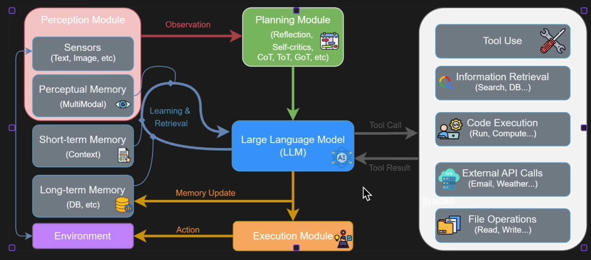
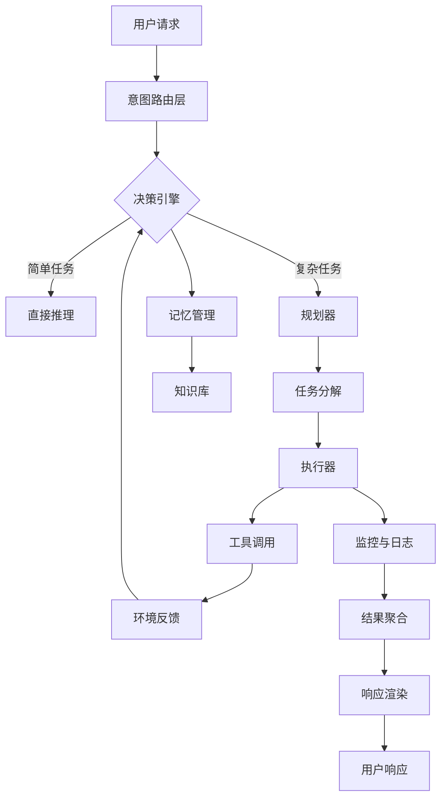

寒假开学以来，一直在学习一些Agent相关的技术文档和媒体视频，从概念设计思想到手搓了几个Demo，最近在尝试拆解一些热门框架的源码，这段时间的学习让我对Agent的看法大为改观，沉迷于每日头脑风暴，有些想法不吐不快，做此纪录。

## 怎样理解Agent


自 2023 年 ChatGPT 引爆全球以来，我几乎每天都在与各类 Chat 产品交互。在那段时期，我对大模型的认知还停留在一个极简的逻辑上——**"模型即产品”**。我理所当然地认为，大模型就是一个能与我无障碍交流的聊天窗口。

随后，前年开始，Agent(智能体)的概念被自媒体反复咀嚼与炒作：从早期的"工作流颠覆世界”，到后来层出不穷、月更不辍的新名词，每一波浪潮都宣称要重塑人类社会。这种浮躁的空气让我对 Agent 这个词产生了某种程度的"**PTSD**(创伤后应激障碍)”，导致我迟迟没有沉下心去剖析它的底层机理。

但在这一段时间系统性的学习后，我大致认清了Agent的产品形态。现在，我可以非常肯定地给出一个核心结论：**Agent 绝非炒作概念，它是以大模型为核心驱动(类似CPU)的下一代操作系统。** 我们此前以及现在所使用的所有顶级 AI 产品，剥开它们的对话外壳，其本质都是一套复杂而精密的 Agent 系统。


### Transformer的无状态性

提到大模型与 Agent 的进化，绕不开 AI 时代真正的分水岭：Transformer 架构。

[【LLM技术】Transformer架构宗述 | 古月月仔的博客](https://tingdonghu.github.io/posts/llm技术transformer架构宗述/)

从底层数学逻辑看，Transformer 本质上是一个高度复杂的"概率序列预测器”。 它并非像人类一样具备实体感官或持续意识，而是基于概率分布在海量的 Token空间中寻找下一个最合理的输出。模型所展现出的惊人智能，源于它在预训练阶段从万亿级语料中汲取的**隐性知识**(Implicit Knowledge)。

当多模态模型接收到文字、语音或图像的混合输入时，它会将其映射到高维的**潜空间**(Latent Space)中。在这里，模型执行的不是简单的关键词匹配，而是极其复杂的高阶矩阵运算。所谓的"推理能力”，本质上是模型在潜空间中沿着逻辑语义的**流形**(Manifold)进行概率坍缩。

然而，回归其物理本质，模型依然是**无状态**(Stateless)且**瞬时**的。它唯一的任务是基于当前输入(Context)计算概率最大化的下一个 Token。它没有"昨天”的记忆，也没有"行动”的渴望。这种"预测即推理”的特性，既是大模型力量的源泉，也是它产生幻觉与缺乏逻辑稳定性的根源。

### 代理行为到代理层

在使用 ChatGPT 类产品时，你之所以感觉到它能对语境理解清晰对答如流，并非因为模型具备持久化记忆，而是后台程序在发挥作用。每当你按下回车键，后台会迅速对历史聊天记录(Context)进行打包、修剪，连同当前问题一并注入模型。这种"**用户发送内容、程序提供语境**”的交互模式，本质上就是一种代理(Proxy/Agent)模式：模型负责瞬时的序列预测，而后台负责维护状态与环境。

Agent 的定义也由此清晰：它不再是一个裸露的模型接口，而是一个被逻辑代码包裹、能感知并利用上下文进行决策的闭环系统。

不仅是上下文管理，Chat 类产品的诸多特性皆源于此：

- 当你无法表述自己需求，只写了一半句子时，发现模型仍然能较好的猜测出意图并回答，是代理层在后台做**意图识别**(Intent Recognition)**意图扩展**(Intent Expansion)；
- 当你触发敏感词而模型拒绝回答问题时，是**安全审核层**在拦截和审查；
- 当你看到模型输出的MarkDown语法直接渲染为的富文本样式时，是**前端代理**在解析逻辑和渲染；
- 当你要求总结 PDF 或联网搜索，是**外挂插件**和**知识图谱**在提取知识并标记出处。

这一切功能，大模型LLM本身都无法独立实现。回归本质：**大模型的核心任务只有"预测下一个 Token”**，而从用户输入到最终交互的整个黑盒空间，全部是由**代理层**(**Agent Layer**)驱动的。

从用户体验上看，Chat类产品代理层的作用其实就是：**增强交互+无感使用**。

从技术解耦上看，Agent就是一个AI产品中除了核心模型之外全部的总和。



## AGI与Agent

在深入现代Agent架构之前，我们需要先厘清一个常被混淆的概念：Agent与AGI（通用人工智能）的关系。

### Agent的层次结构

Agent并非一个平面的概念，而是一个具有明确层次结构的系统。我们可以将其抽象为四个层次：

```python
class AgentHierarchy:
    """Agent的层次结构"""
    
    # Level 1: 交互层
    class InteractionLayer:
        """直接与用户交互的界面"""
        def handle_input(self, user_request):
            # 意图识别
            # 输入验证
            # 前置处理
            pass
        
        def render_output(self, response):
            # 格式化输出
            # 流式渲染
            # 错误处理
            pass
    
    # Level 2: 推理层
    class ReasoningLayer:
        """基于LLM的核心推理能力"""
        def plan(self, goal, context):
            # 任务分解
            # 决策制定
            # 思维链生成
            pass
        
        def reflect(self, action, result):
            # 反思与调整
            # 学习反馈
            pass
    
    # Level 3: 执行层
    class ExecutionLayer:
        """与环境交互的能力"""
        def execute(self, action):
            # 工具调用
            # 状态管理
            # 错误恢复
            pass
        
        def observe(self):
            # 环境感知
            # 状态更新
            pass
    
    # Level 4: 记忆层
    class MemoryLayer:
        """持久化知识存储"""
        def store(self, key, value):
            # 短期记忆
            # 长期记忆
            pass
        
        def retrieve(self, query):
            # 语义检索
            # 关联推荐
            pass
```

从设计哲学角度看，这四个层次遵循着**"关注点分离"（Separation of Concerns）**原则：

- **交互层**专注于用户体验的平滑性
- **推理层**专注于决策的智能性
- **执行层**专注于操作的可靠性
- **记忆层**专注于知识的连续性

### Agent vs. AGI：本质区别

很多人误以为Agent就是AGI的雏形，这是一个危险的过度乐观。让我用一个类比来说明二者的区别：

**Agent之于AGI，恰如浏览器之于互联网。**

浏览器是一个极其复杂的软件，它拥有渲染引擎、JavaScript引擎、网络协议栈、安全沙箱等诸多组件。它可以访问互联网的任何资源，执行复杂的交互操作。但浏览器本身并不"知道"互联网的内容，它只是一个**访问工具**。

同理，Agent是一个极其复杂的系统，它拥有推理能力、记忆管理、工具调用、状态维护等诸多组件。它可以处理复杂的任务，协调多个子系统。但Agent本身并不具备AGI意义上的"通用智能"，它只是一个**智能执行器**。

真正的AGI需要具备Agent不具备的三个核心特性：

1. **自主意识（Self-Awareness）**：AGI应该知道自己"正在思考"，并能够反思自己的认知过程。当前的大模型虽然在形式上可以模拟自我反思，但本质上是基于模式的模拟，而非真正的意识。

2. **价值体系（Value System）**：AGI应该有自己独立的价值判断标准，而不是仅仅遵循人类预设的规则。当前的Agent完全依赖于人类定义的目标和约束。

3. **创造意图（Creative Intent）**：AGI应该能够自主设定新的目标和方向，而不仅仅是被动响应人类的请求。当前的Agent始终是响应式的（Reactive），而非主动式的（Proactive）。

### Agent的实际价值

虽然Agent不是AGI，但这并不贬低它的价值。恰恰相反，Agent是我们当前能够构建的最接近实用AGI的系统。它的价值体现在三个维度：

**维度一：能力的桥接者**

Agent将LLM的"知识能力"与外部世界的"行动能力"连接起来。没有Agent，LLM只是一个被困在文本世界的预言家；有了Agent，LLM才能真正"做"事情。

```python
# 没有Agent的LLM：被困在文本世界
llm = LargeLanguageModel()
answer = llm.ask("帮我写一个数据分析报告")
# 结果：只能生成文本建议，无法实际操作

# 有Agent的LLM：连接真实世界
agent = DataAnalysisAgent()
result = agent.execute("帮我分析Q1销售数据并生成导出报告")
# 结果：连接数据库 → 执行分析 → 生成图表 → 发送邮件
```

**维度二：复杂度的管理者**

现实世界的任务往往比单次对话复杂得多。一个看似简单的"帮我安排一次会议"，背后可能涉及：
- 查询每个人的日历
- 寻找共同空闲时间
- 预订会议室
- 发送邀请
- 设置提醒

Agent通过任务分解、状态管理、错误恢复等机制，让LLM能够处理这种多步骤的复杂任务。

**维度三：人机协作的中介**

Agent不是要替代人类，而是要成为人类与AI之间更高效的协作桥梁。通过合理的Agent设计，我们可以：
- 降低AI的使用门槛（自然语言交互）
- 提高AI的可靠性（多层验证和纠错）
- 增强AI的可控性（透明化的决策过程）

## 现代Agent架构

从单次对话服务到业务全流程服务，现代Agent架构已经形成了相对成熟的设计模式。让我们从全局视角拆解这一架构。

### 架构全景图

现代Agent系统可以抽象为以下七个核心组件：



让我们逐个深入剖析这些组件。

### 组件一：意图路由层（Intent Router）

**设计哲学：分类是理解的前提**

人类在处理复杂问题时，第一步往往是"这个问题属于哪一类"。同样的，Agent在面对用户请求时，也需要先判断"这是什么类型的任务"。

意图路由层的作用就是对用户输入进行分类，然后调度到不同的处理模块。这一设计借鉴了**责任链模式（Chain of Responsibility）**和**策略模式（Strategy Pattern）**。

```python
class IntentRouter:
    """意图路由器"""
    
    def __init__(self):
        self.classifier = IntentClassifier()  # 可以是规则引擎或小型LLM
        self.handlers = {
            'search': SearchHandler(),
            'analysis': AnalysisHandler(),
            'generation': GenerationHandler(),
            'action': ActionHandler(),
            'conversation': ConversationHandler()
        }
    
    def route(self, user_input: str, context: dict) -> Handler:
        """路由到合适的处理器"""
        # 步骤1：提取意图
        intent = self.classifier.classify(user_input, context)
        
        # 步骤2：检查是否有对应的处理器
        if intent not in self.handlers:
            intent = 'conversation'  # 降级到通用对话
        
        # 步骤3：返回处理器
        return self.handlers[intent]


class IntentClassifier:
    """意图分类器"""
    
    def classify(self, text: str, context: dict) -> str:
        """使用混合策略分类"""
        # 策略1：关键词匹配（快速路径）
        if any(word in text.lower() for word in ['搜索', '查找', 'search']):
            return 'search'
        
        if any(word in text.lower() for word in ['分析', '统计', '分析']):
            return 'analysis'
        
        # 策略2：语义相似度（中等路径）
        intent = self._semantic_match(text)
        if intent:
            return intent
        
        # 策略3：LLM分类（慢速但准确路径）
        return self._llm_classify(text, context)
```

**设计要点：**

1. **分层策略**：先用规则快速判断，再用向量匹配，最后用LLM兜底。这种"金字塔式"策略在性能和准确率之间取得了良好平衡。

2. **热路径优化**：对常见意图（如"搜索"、"对话"）提供快速通道，减少不必要的计算。

3. **可扩展性**：新增意图类型只需添加新的Handler类，符合开闭原则。

### 组件二：规划器（Planner）

**设计哲学：先想清楚，再动手**

人类在执行复杂任务前，通常会先制定计划。比如"我要写一篇论文"，计划可能是：查阅文献 → 拟定大纲 → 撰写初稿 → 修改润色 → 格式调整。

Planner的作用就是将用户的模糊目标分解为可执行的具体步骤。这是Agent智能性的核心体现之一。

```python
class Planner:
    """任务规划器"""
    
    def plan(self, goal: str, context: dict, available_tools: list) -> Plan:
        """生成执行计划"""
        
        # 步骤1：理解目标
        goal_understanding = self._understand_goal(goal, context)
        
        # 步骤2：分解子任务
        subtasks = self._decompose(goal_understanding, available_tools)
        
        # 步骤3：确定执行顺序
        execution_order = self._order_subtasks(subtasks)
        
        # 步骤4：生成完整计划
        return Plan(
            goal=goal,
            steps=execution_order,
            estimated_cost=self._estimate_cost(execution_order),
            risk_level=self._assess_risk(execution_order)
        )
    
    def _understand_goal(self, goal: str, context: dict) -> dict:
        """深入理解用户目标"""
        prompt = f"""
        分析以下用户目标，提取关键信息：
        
        目标: {goal}
        上下文: {context}
        
        请分析并返回JSON格式：
        {{
            "intent": "核心意图",
            "scope": "任务范围",
            "constraints": ["约束条件1", "约束条件2"],
            "preferences": ["偏好1", "偏好2"],
            "success_criteria": ["成功标准1", "成功标准2"]
        }}
        """
        return self.llm.ask(prompt, response_format="json")
    
    def _decompose(self, goal_understanding: dict, tools: list) -> list:
        """将目标分解为子任务"""
        prompt = f"""
        将以下目标分解为可执行的子任务：
        
        目标理解: {goal_understanding}
        可用工具: {tools}
        
        请返回子任务列表（JSON格式）：
        [
            {{
                "task_id": "task_1",
                "description": "任务描述",
                "required_tool": "需要的工具",
                "dependencies": ["task_0"],
                "estimated_duration": 120
            }}
        ]
        """
        return self.llm.ask(prompt, response_format="json")
    
    def _order_subtasks(self, subtasks: list) -> list:
        """确定执行顺序（拓扑排序）"""
        # 构建依赖图
        graph = self._build_dependency_graph(subtasks)
        
        # 拓扑排序
        return self._topological_sort(graph)
```

**规划策略的演进：**

现代Agent系统主要采用三种规划策略：

1. **链式思考（Chain of Thought）**：让LLM逐步推理，生成思维链。适用于推理密集型任务。

2. **树式思考（Tree of Thoughts）**：探索多个可能的路径，选择最优解。适用于需要权衡的任务。

3. **规划-执行（Plan-and-Solve）**：先生成完整计划，再依次执行。适用于复杂多步任务。

### 组件三：执行器（Executor）

**设计哲学：将计划变为现实**

规划器负责"想"，执行器负责"做"。执行器是Agent与环境交互的桥梁，负责实际调用工具、管理状态、处理异常。

```python
class Executor:
    """任务执行器"""
    
    def __init__(self):
        self.tool_registry = ToolRegistry()
        self.state_manager = StateManager()
        self.error_handler = ErrorHandler()
    
    def execute(self, plan: Plan) -> ExecutionResult:
        """执行计划"""
        results = {}
        
        for step in plan.steps:
            # 步骤1：检查依赖是否满足
            if not self._check_dependencies(step, results):
                self._handle_dependency_failure(step)
                continue
            
            # 步骤2：准备参数
            params = self._prepare_params(step, results)
            
            # 步骤3：执行工具
            try:
                # 记录执行开始
                self.state_manager.update(step.task_id, "running")
                
                # 调用工具
                tool = self.tool_registry.get_tool(step.required_tool)
                result = tool.execute(**params)
                
                # 记录执行成功
                self.state_manager.update(step.task_id, "completed")
                results[step.task_id] = result
                
            except Exception as e:
                # 错误处理
                self.state_manager.update(step.task_id, "failed")
                recovered = self.error_handler.recover(step, e, results)
                
                if recovered:
                    results[step.task_id] = recovered
                else:
                    raise  # 无法恢复，终止执行
        
        return ExecutionResult(results=results, status="completed")
    
    def _prepare_params(self, step: Step, previous_results: dict) -> dict:
        """准备执行参数"""
        # 从依赖的结果中提取参数
        params = {}
        for dep in step.dependencies:
            params.update(previous_results[dep])
        
        # 合合步骤的原始参数
        params.update(step.params)
        
        return params
```

**执行模式：**

1. **串行执行**：按顺序执行每个步骤，适用于有明确依赖关系的任务。

2. **并行执行**：同时执行无依赖关系的步骤，适用于可并行的任务（如同时查询多个API）。

3. **自适应执行**：根据任务复杂度和资源情况动态选择执行策略。

### 组件四：工具系统（Tool System）

**设计哲学：LLM不是万能的，需要扩展**

LLM本身只能生成文本，无法直接访问外部世界。工具系统解决了这个问题，它就像给LLM装上了"手"和"脚"，让它能够真正行动。

工具系统的设计体现了**"开闭原则"（Open-Closed Principle）**：对扩展开放（可以轻松添加新工具），对修改封闭（核心框架不需要改动）。

```python
class ToolRegistry:
    """工具注册中心"""
    
    def __init__(self):
        self.tools = {}
        self.tool_schemas = {}
    
    def register(self, tool: Tool):
        """注册工具"""
        self.tools[tool.name] = tool
        self.tool_schemas[tool.name] = tool.get_schema()
    
    def get_tool(self, name: str) -> Tool:
        """获取工具"""
        return self.tools.get(name)
    
    def get_all_schemas(self) -> dict:
        """获取所有工具的schema（用于LLM理解）"""
        return self.tool_schemas


class Tool:
    """工具基类"""
    
    def __init__(self, name: str, description: str: str):
        self.name = name
        self.description = description
    
    def execute(self, **kwargs) -> Any:
        """执行工具（子类实现）"""
        raise NotImplementedError
    
    def get_schema(self) -> dict:
        """返回工具的schema（用于LLM理解）"""
        return {
            "name": self.name,
            "description": self.description,
            "parameters": self._get_parameter_schema()
        }


# 具体工具示例
class WebSearchTool(Tool):
    """网络搜索工具"""
    
    def __init__(self, search_api):
        super().__init__(
            name="web_search",
            description="在互联网上搜索信息"
        )
        self.search_api = search_api
    
    def execute(self, query: str, num_results: int = 5) -> list:
        """执行搜索"""
        return self.search_api.search(query, num_results)
    
    def _get_parameter_schema(self) -> dict:
        """参数schema"""
        return {
            "type": "object",
            "properties": {
                "query": {
                    "type": "string",
                    "description": "搜索关键词"
                },
                "num_results": {
                    "type": "integer",
                    "description": "返回结果数量",
                    "default": 5
                }
            },
            "required": ["query"]
        }
```

**工具设计原则：**

1. **单一职责**：每个工具只做一件事（如只负责搜索，不负责总结）。

2. **幂等性**：多次调用同一工具（相同参数）应产生相同结果（尽可能）。

3. **明确边界**：输入输出清晰，无隐藏副作用。

4. **错误透明**：工具的失败应该是可预测和可处理的。

### 组件五：记忆系统（Memory System）

**设计哲学：智能需要记忆**

LLM本身是无状态的，每次推理都是独立的。但真正的智能需要能够记忆过去的经验、学习新的知识。记忆系统解决了这个问题。

```python
class MemorySystem:
    """记忆系统"""
    
    def __init__(self):
        # 短期记忆（工作记忆）
        self.working_memory = []
        
        # 长期记忆（知识库）
        self.long_term_memory = VectorDatabase()
        
        # 语义记忆（概念知识）
        self.semantic_memory = KnowledgeBase()
        
        # 情景记忆（经验记录）
        self.episodic_memory = EventLogger()
    
    def store(self, content: str, metadata: dict = None):
        """存储记忆"""
        # 生成嵌入向量
        embedding = self._embed(content)
        
        # 存储到长期记忆
        memory_id = self.long_term_memory.store(
            content=content,
            embedding=embedding,
            metadata=metadata or {}
        )
        
        # 同时记录到情景记忆
        self.episodic_memory.log(
            event_id=memory_id,
            content=content,
            timestamp=datetime.now()
        )
        
        return memory_id
    
    def retrieve(self, query: str, top_k: int = 5) -> list:
        """检索相关记忆"""
        # 生成查询向量
        query_embedding = self._embed(query)
        
        # 向量检索
        results = self.long_term_memory.search(
            vector=query_embedding,
            top_k=top_k
        )
        
        return results
    
    def update(self, memory_id: str, new_content: str):
        """更新记忆"""
        # 先删除旧的
        self.delete(memory_id)
        
        # 再存储新的
        return self.store(new_content, {"updated_from": memory_id})
    
    def delete(self, memory_id: str):
        """删除记忆"""
        self.long_term_memory.delete(memory_id)
```

**记忆类型：**

1. **短期记忆（Working Memory）**：临时存储当前对话的上下文，容量有限（如最近10轮对话）。

2. **长期记忆（Long-term Memory）**：持久化存储重要的知识和经验，通过向量数据库实现语义检索。

3. **情景记忆（Episodic Memory）**：记录具体的事件和经验，用于反思和学习。

4. **语义记忆（Semantic Memory）**：存储抽象的概念和规则，用于推理。

### 组件六：监控与观测（Monitoring & Observability）

**设计哲学：看不见的bug无法修复**

Agent系统是复杂的，多个组件协同工作，可能产生难以预测的行为。监控与观测系统让我们能够"看见"Agent的内部状态，及时发现和解决问题。

```python
class MonitoringSystem:
    """监控与观测系统"""
    
    def __init__(self):
        self.metrics = MetricsCollector()
        self.tracer = Tracer()
        self.logger = StructuredLogger()
    
    def track_execution(self, func):
        """追踪执行过程"""
        @wraps(func)
        def wrapper(*args, **kwargs):
            # 开始追踪
            trace_id = self.tracer.start_trace(func.__name__)
            
            try:
                # 记录开始时间
                start_time = time.time()
                
                # 执行函数
                result = func(*args, **kwargs)
                
                # 记录成功指标
                duration = time.time() - start_time
                self.metrics.record(
                    name=f"{func.__name__}.duration",
                    value=duration,
                    tags={"status": "success"}
                )
                
                return result
            
            except Exception as e:
                # 记录失败指标
                self.metrics.record(
                    name=f"{func.__name__}.errors",
                    value=1,
                    tags={"error_type": type(e).__name__}
                )
                
                # 记录错误日志
                self.logger.error(
                    trace_id=trace_id,
                    error=str(e),
                    stack_trace=traceback.format_exc()
                )
                
                raise
            
            finally:
                # 结束追踪
                self.tracer.end_trace(trace_id)
        
        return wrapper


class MetricsCollector:
    """指标收集器"""
    
    def __init__(self):
        self.counters = defaultdict(int)
        self.gauges = defaultdict(float)
        self.histograms = defaultdict(list)
    
    def record(self, name: str, value: float, tags: dict = None):
        """记录指标"""
        # 根据指标类型存储
        if name.endswith('.duration'):
            self.histograms[name].append(value)
        elif name.endswith('.errors'):
            self.counters[name] += int(value)
        else:
            self.gauges[name] = value
    
    def get_summary(self) -> dict:
        """获取指标摘要"""
        summary = {}
        
        # 计算直方图的统计值
        for name, values in self.histograms.items():
            if values:
                summary[f"{name}.avg"] = sum(values) / len(values)
                summary[f"{name}.max"] = max(values)
                summary[f"{name}.min"] = min(values)
        
        # 合并计数器和仪表
        summary.update(self.counters)
        summary.update(self.gauges)
        
        return summary
```

**监控维度：**

1. **性能监控**：响应时间、吞吐量、资源使用等。

2. **错误监控**：错误率、错误类型、错误堆栈等。

3. **业务监控**：任务成功率、工具调用频率、用户满意度等。

4. **追踪监控**：完整的请求链路，便于问题定位。

### 组件七：安全与合规（Security & Compliance）

**设计哲学：能力越大，责任越大**

Agent系统可以访问用户数据、调用外部API、执行系统操作。如果缺乏安全防护，可能造成严重后果。安全与合规系统是Agent的"安全带"。

```python
class SecurityLayer:
    """安全层"""
    
    def __init__(self):
        self.audit_logger = AuditLogger()
        self.permission_checker = PermissionChecker()
        self.content_filter = ContentFilter()
        self.rate_limiter = RateLimiter()
    
    def before_execution(self, user_id: str, action: Action) -> bool:
        """执行前检查"""
        
        # 检查1：权限验证
        if not self.permission_checker.check(user_id, action):
            self.audit_logger.log(
                event="permission_denied",
                user_id=user_id,
                action=action.name
            )
            return False
        
        # 检查2：内容过滤
        if hasattr(action, 'content') and self.content_filter.is_violation(action.content):
            self.audit_logger.log(
                event="content_violation",
                user_id=user_id,
                content=action.content
            )
            return False
        
        # 检查3：速率限制
        if not self.rate_limiter.allow(user_id, action.name):
            self.audit_logger.log(
                event="rate_limit_exceeded",
                user_id=user_id,
                action=action.name
            )
            return False
        
        return True
    
    def after_execution(self, user_id: str, action: Action, result: Any):
        """执行后审计"""
        self.audit_logger.log(
            event="action_completed",
            user_id=user_id,
            action=action.name,
            result_size=len(str(result))
        )


class PermissionChecker:
    """权限检查器"""
    
    def __init__(self):
        self.role_policies = {
            'admin': ['*'],  # 管理员拥有所有权限
            'user': ['read', 'write_own', 'search'],
            'guest': ['read', 'search']
        }
    
    def check(self, user_id: str, action: Action) -> bool:
        """检查用户是否有执行权限"""
        user_role = self._get_user_role(user_id)
        allowed_actions = self.role_policies.get(user_role, [])
        
        if '*' in allowed_actions:
            return True
        
        return action.name in allowed_actions
```

**安全策略：**

1. **最小权限原则**：用户和Agent只拥有完成任务所需的最小权限。

2. **多层验证**：在请求进入、工具调用、数据访问等多个层面进行验证。

3. **审计日志**：记录所有关键操作，便于事后追溯。

4. **内容安全**：过滤敏感内容，防止生成有害信息。

## Agent的设计哲学总结

经过以上拆解，我们可以总结出现代Agent系统的核心设计哲学：

### 1. 分层与解耦

Agent系统不是一个大而全的monolith，而是由多个独立组件组成的系统。每个组件职责清晰，接口明确，可以独立开发和演化。

### 2. 可组合性

通过将能力模块化（如工具、技能、记忆），Agent可以像搭积木一样组合出各种复杂系统。这是Agent能够适应多样化场景的关键。

### 3. 可观测性

复杂的系统需要透明的内部状态。监控、日志、追踪让Agent的行为变得可见和可控。

### 4. 防御性编程

Agent系统必然会遇到各种异常情况：网络错误、工具失败、LLM幻觉。健壮的Agent设计必须假设"一切可能出错"，并为此做准备。

### 5. 人机协同

Agent不是要完全自主运行，而是要成为人类智能的放大器。优秀的设计应该让人类能够在关键环节介入，提供指导、验证和纠错。

### 6. 渐进式增强

Agent的能力应该是可渐进增强的。从简单的规则引擎开始，逐步引入LLM、工具、记忆，让系统在保持稳定性的同时不断提升智能。

## 结语：Agent的未来

Agent不是银弹，它不会解决所有问题。但在AI应用的演进路径上，它是一个重要的里程碑。

从"对话"到"行动"，从"生成"到"决策"，从"单一任务"到"复杂流程"，Agent正在将大模型从"聪明的预测器"转变为"有用的执行者"。

理解Agent，关键在于理解它不是什么：

- Agent不是AGI，但它是通向AGI的桥梁
- Agent不是黑箱，而是一个可观测、可控制的系统
- Agent不是魔法，而是一套精心设计的工程体系

掌握Agent的设计哲学，不仅仅是为了构建更好的AI产品，更是为了理解"智能"在工程意义上的本质。在这个意义上，Agent的学习之旅，也是我们重新思考"什么是智能"的旅程。

---

## 延伸阅读

- [【LLM技术】Transformer架构宗述](https://tingdonghu.github.io/posts/llm技术transformer架构宗述/)
- [【LLM应用开发原理】Agent Skill原理与基础](https://tingdonghu.github.io/posts/llm应用开发原理agentskill原理与基础/)
