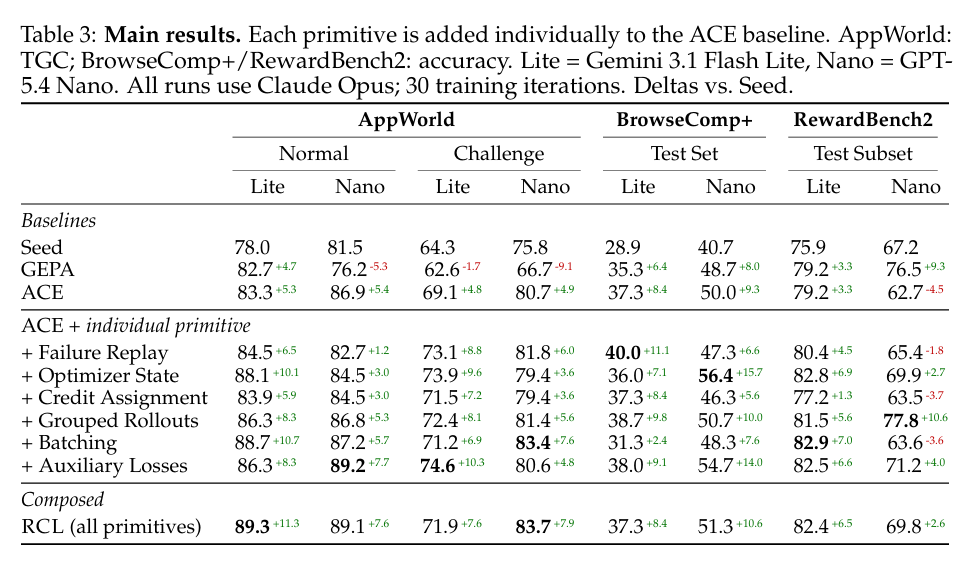
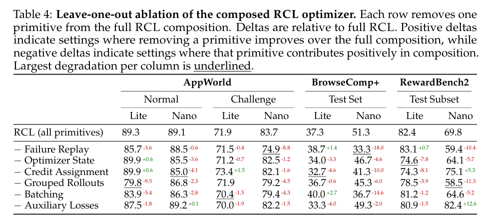
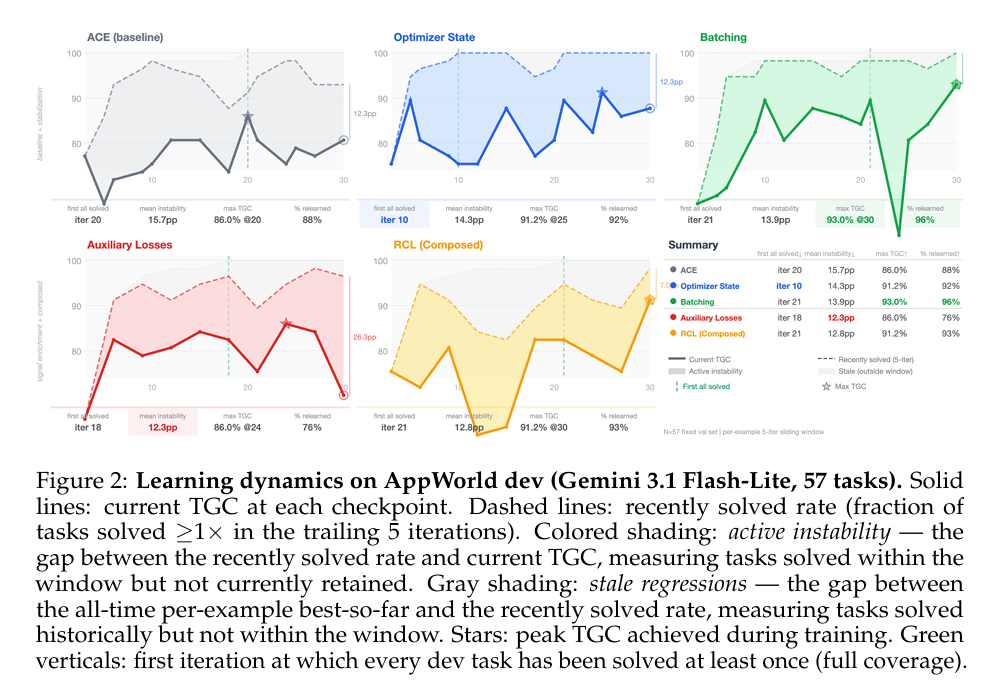
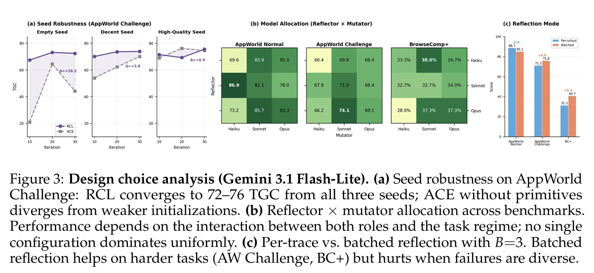

**论文信息**：[Reflective Context Learning: Studying the Optimization Primitives of Context Space](https://arxiv.org/abs/2604.03189)  
**作者**：Nikita Vassilyev, William Berrios, Ruowang Zhang, Bo Han, Douwe Kiela, Shikib Mehri (Contextual AI)  
**发表状态**：Preprint. Under review (2026年4月3日)  
**代码地址**：[GitHub](https://github.com/nvassilyev/RCL)  
**阅读时间**：2026年4月19日

---

## 1. 核心动机与研究问题

### 1.1 主要研究动机

作者提出了两个根本性问题：

**问题一**：只修改Context而不修改模型参数，能否让Agent持续变强？

> **关键定义**：这里"Context"（记为 $C$）不单指prompt，而是指所有对Agent[行为产生可解释影响的外部对象，包括：
> - **结构化Playbook**（行为规则手册）
> - **持久Memory**（记忆模块）
> - **Tool definitions**（工具定义）
> - **Retrieval indices**（检索索引）
> - **Operational guidelines**（操作指导原则）
> - 任何可读、可编辑、可解释的行为配置

Context是一个超集：$C \supset \text{"prompt"}$，包含Agent在执行期间可访问的任何artifact，无论是直接注入到context window中还是通过检索或tool use动态访问。

现代语言模型专门设计为有效的、忠实的指令遵循者（Ouyang et al., 2022; Anthropic, 2025），这种对$C$的敏感性使得context-space优化变得实用：对$C$的更新可靠地产生Agent行为的相应变化。

**问题二**：Context Learning 本质上也是一种优化问题，是否会遭遇传统参数优化的经典困境？

作者的核心论点是：Context Learning 与传统的参数空间优化（如SGD）在**数学本质上同构**，因此必然面临以下经典优化病理：

| 优化病理 | 在Context Learning中的表现 | 参数空间类比 |
|---------|------------------------|------------|
| **高方差** | 单个失败样本的反馈可能引入噪声，导致context更新方向不稳定 | 随机梯度估计的高方差（Robbins & Monro, 1951） |
| **信用分配困难** | 失败可能由多个context条目共同导致，难以确定应该修改哪一项 | 稀疏奖励问题（Sutton & Barto, 2018） |
| **灾难性遗忘** | 为了适应新任务而修改context时，丢失了已掌握的知识 | 顺序学习中的灾难性干扰（McCloskey & Cohen, 1989） |
| **更新震荡** | Context在不同失败样本之间反复切换，无法收敛 | 状态less优化器的震荡（Polyak, 1964） |
| **局部最优** | 基于当前context的局部更新可能陷入次优策略 | 贪心优化中的局部最优（Mitchell, 1980） |

### 1.2 研究意义

这项工作的意义在于：

1. **统一视角**：将分散的prompt engineering、in-context learning、tool design等方法统一到一个优化框架下
2. **系统性研究**：不是提出某个特定技巧，而是像研究SGD那样系统性研究context优化的"原语"（primitives）
3. **可解释性**：Context优化具有天然的可解释性（修改的是自然语言规则而非不可读的参数）
4. **未来-proof**：随着模型能力提升，context优化的scope从"优化措辞"扩展到"学习真正的多步策略"


---

## 2. RCL 框架：Reflect-Update 循环

### 2.1 问题形式化

给定一个任务数据集 $D = \{(x_i, y_i)\}$，其中 $x_i$ 是输入（查询、环境状态或任务规范），$y_i$ 是ground-truth标签或reward函数 $R$，学习问题是找到context $C$ 以最大化期望性能：

$$
C^* = \arg\max_C \mathbb{E}_{(x,y)\sim D}[R(A(x, C), y)]
$$

其中 $A$ 是以base语言模型实现的ReAct loop Agent（Yao et al., 2023）。

### 2.2 RCL 三步循环

RCL将context learning统一为一个三步循环，每一步与梯度训练的一个阶段功能对应（Table 1）：

```
┌─────────────────────────────────────────────────────────┐
│                    RCL Framework                         │
├─────────────────────────────────────────────────────────┤
│                                                         │
│  ┌─────────┐     ┌──────────┐     ┌──────────┐         │
│  │Execute  │────▶│Reflect   │────▶│  Mutate  │         │
│  │         │     │          │     │          │         │
│  │Agent执行│     │ 生成诊断  │     │更新context│        │
│  │当前任务 │     │ 信号 δt   │     │ /playbook│       │
│  └─────────┘     └──────────┘     └──────────┘         │
│      │                 │                │               │
│      ▼                 ▼                ▼               │
│  trajectory         reflection      updated            │
│  + outcome          signal          context             │
│                                                         │
└─────────────────────────────────────────────────────────┘

对应关系：
Execute  ⇔ Forward pass (ŷ = f(x), L = L(ŷ, y))
Reflect  ⇔ Gradient (∇θ L)
Mutate   ⇔ Optimizer step (θ_{t+1} = θ_t - η·∇θ L)
```

#### Execute（执行）

Agent带着当前context执行任务，得到trajectory和outcome：

$$
\tau = A(x, C_t), \quad r = R(\tau, y)
$$

trajectory $\tau$ 是actions、observations和中间推理步骤的序列。outcome $r$ 可能是binary、scalar或结构化的执行trace。

**类比**：在参数优化中，这对应forward pass $\hat{y} = f(x)$ 和loss计算 $L(\hat{y}, y)$。

#### Reflect（反思）

Reflector模块 $g$ 根据以下输入生成诊断信号 $\delta_t$：

$$
\delta_t = g(\tau, r, C_t)
$$

诊断 $\delta_t$ 是什么失败、为什么失败、以及 $C_t$ 的哪些组件应该被修订的自然语言分析。

**类比**：这是context-space的梯度计算 $\nabla_\theta L$：将执行经验转换为定向更新信号。关键区别是 $\delta_t$ 是由LLM对trajectory推理产生的，而非通过计算图微分；reflector可能是一个独立的、可能更强的模型。

#### Mutate（变异）

Mutator模块 $f$ 根据诊断信号和当前context产生更新后的context：

$$
C_{t+1} = f(C_t, \delta_t)
$$

**类比**：这是context-space的优化器步骤 $\theta_{t+1} = \theta_t - \eta \cdot \nabla_\theta L$。Mutator应用reflector的建议，受结构约束（如只修改特定playbook规则或维护版本历史）限制。

#### 完整更新

$$
C_{t+1} = f(C_t, g(\tau_t, r_t, C_t))
$$

**类比强调**：这种对应是功能的，非形式的。不存在可微分的loss surface，$\delta_t$ 可能是错的、模糊的或矛盾的，这是真实梯度不具备的。作者声称的是**功能角色的保留**，正如Table 1总结：reflector服务于梯度计算，mutator服务于优化器步骤，经典改进梯度学习的机制以相同底层原因改进反思式context学习。


### 2.3 Table 1: 功能对应关系

| Classical Concept | RCL Analogue | Prior Work |
|-----------------|-----------------|-------------|
| **Parameters** | Context artifact $C$ (playbook, memory, tools, guidelines) | 所有方法 |
| **Forward pass** $\hat{y} = f(x)$, Loss $L(\hat{y}, y)$ | Trajectory $\tau = A(x, C)$, Outcome $r = R(\tau, y)$ | ReAct, Voyager |
| **Gradient** $\nabla_\theta L$ | Reflective diagnostic $\delta = g(\tau, r, C)$ | ProTeGi, TextGrad |
| **Optimizer step** | Context update $C_{t+1} = f(C_t, \delta)$ | ACE |
| **Minibatch** $B \sim D$ | Trajectory batch per reflection step | ProTeGi, TF-GRPO |
| **Momentum / Adam** | Optimizer history + mutation ratio | ERM, Ding et al. |
|**Replay buffer**| Failure replay over historical hard cases | Dyn. Cheatsheet, ExpeL |
| **Architecture choice** | Context param. (flat vs. structured) | ACE, DSPy |
| **Regularization** | Structural constraints (diffs, error rule maps) | ACE, MIPRO

---

## 3. 相关工作与Context-Space Learning的演变

### 3.1 根源：Prompt Engineering与离散Prompt调优

- **Soft prompt tuning**（Lester et al., 2021; Li & Liang, 2021）：通过连续embedding上的梯度优化提供替代，但在一个梯度步骤产生微level扰动而非结构化、可解释的修订
- **In-context learning**（Brown et al., 2020）：证明了context是一个强大的conditioning机制，但不涉及迭代精化
- **Early discrete methods**（如APE, Zhou et al., 2023）：通过generate-and-score搜索引入迭代，建立context作为优化目标，但更新信号保持纯标量，没有诊断为何一个候选优于另一个

### 3.2 向真正学习的转变

真正的学习开始于将**reflection作为更新机制**的引入（Table 5）：

| Method | Reflector | Mutator | State/Memory | Regime |
|--------|------------|----------|---------------|----------|
| **Reflexion** (Shinn et al., 2023) | Verbal self-critique | Append to memory | Episodic history | Single-ep. |
| **ExpeL** (Zhao et al., 2024) | Experience extraction | Insight reuse | Extracted knowledge | Cross-task |
| **Agent-Pro** (Zhang et al., 2024) | Belief + policy critique | DFS-style search | World model beliefs | Policy learn. |
| **Dyn. Cheatsheet** (Suzgun et al., 2026) | Failure summarization | Curated append | Persistent cheatsheet | Task learn. |
| **ACE** (Zhang et al., 2026) | Trajectory critique | Structured delta edits | Playbook history | Policy learn. |
| **ProTeGi** (Pryzant et al., 2023) | Minibatch text gradient | Beam search + bandit | LLM-proposed edit | Micro-opt. |
| **TextGrad** (Yuksekgonul et al., 2024) | Textual differentiation | LLM-proposed edit | Context update | Modular opt. |
| **ERM** (Yan et al., 2025) | Exemplar reflection | Beam | Historical feedback | Experiential library |
| **TF-GRPO** (Cai et al., 2025) | Semantic group advantage | Beam | Past distributions | Micro-opt. |
| **Ding et al.** (2025) | -- | -- | Sampling momentum | -- |
| **APE** (Zhou et al., 2023) | None (score only) | None (score only) | -- | Instr. search |
| **EvoPrompt** (Guo et al., 2024) | None (score only) | None (score only) | -- | Instr. search |
| **PromptBreeder** (Fernando et al., 2024) | None (score only) | None (score only) | -- | Instr. search |
| **GEPA** (Agrawal et al., 2026) | Pareto-aware reflection | Evolutionary + Pareto | Candidate pop. | Instr. search |
| **DSPy** (Khattab et al., 2024) | N/A (compiler) | Proposal scoring | Program structure | Program opt. |
| **MIPRO** (Opsahl-Ong et al., 2024) | Module-level compilation | Bayesian surrogate | Module-level state | Program opt. |

**核心发展**：
- **Reflexion**证明了verbal self-critique跨episode改善agent性能无需weight更新
- **ProTeGi**将此形式化为"textual gradients"：从失败minibatches派生的批量自然语言批评，通过beam search应用
- **TextGrad**将梯度隐喻推广到复合AI系统，将多组件pipeline视为计算图，具有文本反馈传播
- **ACE**引入结构化的、增量delta编辑到模块化playbook
- **TF-GRPO**（Training-Free GRPO）通过对比语义优势的grouped rollouts进一步减少噪声
- **ERM**（Efficient and accurate prompt optimization with memory）保留历史反馈以防止信息丢失
- **GEPA**结合群体搜索与反思诊断

### 3.3 三个改进维度

从这个共享基础，先前工作探索了几个改进方向：

| 维度 | 意义 | 代表工作 |
|------|------|---------|
| **Structured parameterization** | 从flat prompt到模块化表示实现本地化信用分配 | Dyn. Cheatsheet, ACE, DSPy, MIPRO |
| **Variance reduction** | ProTeGi的minibatching跨失败聚合批评 | ProTeGi, TF-GRPO |
| **Optimizer state & momentum** | ERM保留历史反馈，Ding et al.引入sampling-based momentum | ERM, Ding et al. |
| **Search & frontier maintenance** | EvoPrompt, PromptBreeder维护演进候选种群，GEPA结合群体搜索与反思诊断 | APE, EvoPrompt, PromptBreeder, GEPA |
| **Policy-level learning** | ExpeL提取可复用洞察用于跨任务迁移，Agent-Pro修订行为信念和指导原则 | ExpeL, Agent-Pro |

任何学习系统必须导航的三个基本维度：
- **Parameterization**：学习artifact的结构确定信用分配的粒度
- **Signal quality**：反思诊断的精度取决于reflector观察多少trajectory以及能否隔离关键决策
- **Optimizer dynamics**：没有momentum、replay或curriculum，stateless learner可能震荡、遗忘或过拟合到近期经验

**论文指出的关键问题**：这些方向在**隔离**中探索，每个在特定模型、prompting惯例、benchmarks和任务regimes下。模型能力和评估实践的快速共同演化使得改进归因于特定学习primitives变得困难。

---

## 4. 五大优化原语

### 4.1 核心更新循环


基础更新 $C_{t+1} = f(C_t, g(\tau_t, r_t, C_t))$ 是**单样本、无状态、贪婪步骤**：一个trajectory告知一个reflection，产生一个edit，没有prior迭代记忆，也没有机制逃离poor basin。

重复应用时，这个最小循环表现与其参数空间counterpart相同的pathologies——高方差更新、稀疏信用分配、灾难性遗忘、局部最优。作者引入五个primitive在循环的特定阶段解决这些pathologies（Table 2; Figure 1）。

### 4.2 Batching（批处理）

**解决的问题**：High variance from single samples（高方差）  
**目标阶段**：Execution  
**先验工作**：ProTeGi; TF-GRPO

单个trajectory $\tau$ 产生单个诊断 $\delta$，其内容被该example的特质dominated——这是parameter-space优化中minibatching解决的context-space analogue（Robbins & Monro, 1951; Pryzant et al., 2023; Cai et al., 2025）。

**实现**：不反思单个trajectory，每次迭代采样 $B$ 个任务 $\{x_1, ..., x_B\} \subset D$，执行每个，对每个失败trace独立反思，产生per-trace诊断 $\delta_1, ..., \delta_k$（$k \leq B$ failures）。这些被联合传递给mutator：

$$
C_{t+1} = f(C_t, \delta_1, ..., \delta_k)
$$

Mutator识别跨diagnostics的重复模式并过滤one-off异常，减少跨任务分布的方差。当 $k = 0$（所有任务pass），不产生诊断，mutator不进行edit；这是现实场景，特别是在seed分数超过78%的AppWorld上。

**类比**：这parallels SGD中的minibatching，其中对 $B$ 样本平均梯度通过 $O(1/B)$ 减少更新方差；这里"averaging"由mutator推理而非算术平均执行。

**实验发现**：当失败分布broad时batching显示强gain（+5.4在AppWorld Normal/Lite上优于ACE），但当失败多样时可以actively hurt（在BrowseComp+/Lite上，batching相对于ACE降级-6.0，表明mutator被竞争信号overload）。

### 4.3 Grouped Rollouts（分组轨迹）

**解决的问题**：Confounded attribution（混淆归因）  
**目标阶段**：Execution  
**先验工作**：TF-GRPO（Training-Free Group Relative Policy Optimization）

每个任务 $x_i$ 在相同playbook $C_t$ 下执行 $G$ 次，产生一个组 $\{\tau_i^{(1)}, ..., \tau_i^{(G)}\}$ 带有outcomes $\{r_i^{(1)}, ..., r_i^{(G)}\}$。

包含pass和failures的组提供**对比信号**——reflector接收同一任务的成功trace $\tau^+$ 和失败trace $\tau^-$：

$$
\delta_i = g(\tau^+, \tau^-, r^+, r^-, C_t)
$$

使reflector能够隔离负责outcome差异的决策点，同时控制任务难度。当组不包含对比信号（所有 $G$ traces pass或全部fail），reflector回退到Eq. 3的单trace签名；Eq. 7的对比形式仅当两个outcome都存在时应用。这是reflector接收正trace的唯一设置，将其诊断扎根于演示的成功行为。

**类比**：Batching减少跨任务分布的方差；grouped rollouts减少每个任务内的方差，analogous to Monte Carlo方法中inter-sample和intra-sample方差减少的区别。

**实验发现**：当reflector需要对比信号时grouped rollouts帮助最多（+3.0在AppWorld Normal/Lite上优于ACE，+15.1在RewardBench2/Nano上，表中最大单gain），因为reflector在相同playbook下观察正确和错误排名，并能识别哪些标准实际预测而非仅从失败提出新程序规则。

### 4.4 Improved Credit Assignment（改进信用分配）

**解决的问题**：Sparse terminal reward（稀疏终端奖励）  
**目标阶段**：Reflection  
**先验工作**：TextGrad

outcome信号 $r = R(\tau, y)$ 是终端的，留下reflector将其归因于整个trajectory和playbook，没有中间监督——这与激励step-level奖励建模（Lightman et al., 2023）和value分解（Sunehag et al., 2017）的稀疏奖励问题相同。

**Dual-trace credit assignment**：令 $C_t^{ann}$ 表示 $C_t$ 的标注变体，在每个entry $e_i$ 中注入XML instrumentation，提示agent引用它consult哪些entries，标记uncertainty，以及在哪里缺少guidance。每个任务**并发执行两次**：

$$
\tau^{std} = A(x, C_t), \quad r^{std} = R(\tau^{std}, y)
$$
$$
\tau^{ann} = A(x, C_t^{ann}), \quad r^{ann} = R(\tau^{ann}, y)
$$

标准trace $\tau^{std}$ 保持未污染用于评估；标注trace $\tau^{ann}$ 使agent的决策过程可观测，启用entry-level attribution。Reflector接收两个trace但只接收标准outcome：

$$
\delta = g(\tau^{std}, \tau^{ann}, r^{std}, C_t)
$$

标注outcome $r^{ann}$ 被排除，因为instrumentation改变agent的行为，使 $r^{ann}$ 成为playbook质量的不可靠measure；标注trace仅因其决策过程可观测性使用，非其outcome。

当与grouped rollouts组合时，每个任务总执行次数变为 $G + 1$：$G$ baseline traces加一个annotated trace，从对比组中排除，因为instrumentation改变行为。

**实验发现**：信用分配在AppWorld上增加modest value，多步程序trace受益于entry-level attribution，但不在BrowseComp+上，其中终端反馈已将问题本地化到agent的搜索策略而非个别playbook entries。

### 4.5 Auxiliary Losses（辅助损失）

**解决的问题**：Surface-level diagnostics（表层次诊断）  
**目标阶段**：Reflection  
**先验工作**：--（论文未列出先验工作）

没有显式结构，无约束反思向表层次trajectory复述collapse——analogous to auxiliary objectives在多任务学习中防止的表示collapse（Jaderberg et al., 2016）。在两个level施加结构：

#### Playbook Parameterization（Playbook参数化）

$C$ 组织为具独立可寻址entries $e_1, ..., e_N$ 的命名sections，mutator被约束表达更新为本地化编辑操作——`UPDATE(e_j, e_j')`、`ADD(e_{N+1})`、`DELETE(e_k)`——而非整体重写。这种结构约束analogous to parameter space中的sparsity regularization：限制每次更新的自由度，防止mutator进行过度拟合到当前batch的sweeping改变。

#### Reflection Schema（Reflection Schema）

Reflector $g$ 分解为三个并行诊断heads：

$$
\delta = \delta_{attr}, \delta_{root}, \delta_{gap}
$$

其中：
- $\delta_{attr} \in \{\text{actionable gap, execution variance, intractable}\}$ 是失败归因分类
- $\delta_{root}$ 是根因分析
- $\delta_{gap}$ 指定当前playbook的覆盖gap

这些heads与mutator交互：execution-variance归因向no-ops偏置（防止来自噪声信号的不必要编辑），而actionable-gap归因具特定根因驱动targeted添加或修改。分解强制reflector产生结构化诊断而非非结构化叙事，analogous to multi-task learning中的辅助loss heads强迫中间表示捕获输入的特定方面。

**实验发现**：辅助losses相对于ACE在7 of 8 settings改进，但从完整RCL移除它们只产生适度降级并在most conditions甚至改进RewardBench2/Nano（+12.6 points）。这表明over-structuring可能hurt某些设置，特别是当reflection schema与任务需求misalignment时。

### 4.6 Failure Replay（失败重放）

**解决的问题**：Forgetting learned tactics（遗忘学习策略）  
**目标阶段**：Sampling  
**先验工作**：Dyn. Cheatsheet; ExpeL

单个reflection-mutation循环可能无法解决失败：edit可能partial，可能与现有entries $e_i$ 负面交互，或仅在不同batch context中重新遭遇时明显需要精化。经验replay buffer解决parameter-space learning中的analogous issues（Lin, 1992; Schaul et al., 2016）；在context space，其中edits可以直接矛盾或subsume彼此，需求至少同样acute。

**实现**：维护一个failure replay buffer $B_t$，修改每次迭代的采样分布。令 $\rho \in [0, 1]$ 为replay ratio。每次迭代，$\rho B$ 任务从 $B_t$ 绘制，剩余 $B - \rho B$ 从 $D$ 新采样：

$$
\{x_1, ..., x_B\} \sim (1 - \rho) \cdot \text{Uniform}(D) + \rho \cdot \text{Uniform}(B_t)
$$

任务失败时进入 $B_t$，由两个阈值管理：
- **Graduate**：任务在跨迭代 $n_{grad}$ 连续passes后被移除，确认playbook已durably学习处理它
- **Evict**：任务在跨迭代 $n_{evict}$ 连续failures后被驱逐，表明它在当前playbook下可能intractable，不应主导训练信号

这实现一个curriculum，集中优化effort在marginal return最高处，analogous to prioritized experience replay（Schaul et al., 2016），其中样本按学习utility加权而非均匀绘制。

**实验发现**：移除failure replay在3 of 8 settings产生largest drop，包括表中single largest regression在BrowseComp+/Nano上（-18.0）和AppWorld Challenge/Nano上（-8.8），表明replay对反复精化困难失败至关重要。

### 4.7 Optimizer State（优化器状态）

**解决的问题**：Oscillation from stateless updates（状态less更新引起的震荡）  
**目标阶段**：Mutation  
**先验工作**：ERM; OPRO

Stateless optimizer可能恢复两轮前的改变，因为激励它的证据已scroll出context——这是momentum（Polyak, 1964; Kingma & Ba, 2015）设计防止的震荡analogue。在基于梯度的优化中，momentum维护指数移动平均 $m_t = \beta m_{t-1} + (1 - \beta) \nabla_\theta L_t$，平滑更新轨迹。作者在context space实现analogous机制。

**实现**：维护一个结构化的、滚动优化状态文档 $S_t$，每次迭代后由专用模型调用 $h$ 更新：

$$
S_{t+1} = h(S_t, \delta_1, ..., \delta_k, C_t, C_{t+1})
$$

$S_t$ 追踪：
- **Change ledger**：修改了什么以及为什么
- **Playbook assessment**：哪些entries工作良好vs.不佳
- **Open hypotheses**：conjectured失败模式尚未确认
- **Optimization phase**：exploratory vs. convergent

状态文档注入到mutator但从reflector排除：

$$
C_{t+1} = f(C_t, \delta_1, ..., \delta_k, S_t)
$$

这种不对称镜像Adam中momentum如何在优化器步骤而非梯度计算上操作：refactor的诊断 $\delta_i$ 保持未被past迭代共识偏置，而mutator可以使用 $S_t$ 上下文化当前诊断，避免恢复先前验证的改变，并保持跨迭代一致性。

**类比**：这为context-space优化提供与parameter space中momentum类似的稳定化效果。

**实验发现**：Optimizer state达到全覆盖最早（iteration 10）并达到高peak TGC（91.2%）并强relearning（92%）：滚动状态文档防止mutator恢复有用编辑，提供与参数空间优化中momentum类似的稳定化效果。

### 4.8 完整composed更新

结合所有五个primitive，RCL更新变为：

$$
C_{t+1} = f(C_t, g(\tau^+, \tau^-, \tau^{ann}), \{r_i\}, C_t | \tilde{B}_t, S_t)
$$

其中 $\tilde{B}_t$ 表示replay-mixed batch的 $B$ 任务（Eq. 11），每个执行 $G + 1$ 次（grouped rollouts加一个annotated trace），$g$ 是Eq. 10的多头reflector，$S_t$ 是优化器状态。

每个primitive解决此更新特定阶段的distinct pathology；Section 4.2评估它们的individual和composed贡献。

---

## 5. 实验设计

### 5.1 设置

在三个放置不同需求于优化循环的benchmarks上评估：

| Benchmark | 类型 | 评估指标 | 训练集 | 测试集 | Seed分数 | 任务类型 |
|-----------|------|---------|--------|--------|---------|---------|
| **AppWorld** (Trivedi et al., 2024) | 多步交互编码 | TGC (Task Goal Completion) | 90任务 | Normal (168), Challenge (417) | 78-82% | 程序化失败模式修正 |
| **BrowseComp+** (Chen et al., 2025) | Web研究 | LLM-judged accuracy | 100查询 | 30验证, 150测试 | 29-41% | 技能获取，发现一般搜索启发式 |
| **RewardBench2** (Malik et al., 2025) | 响应排序 | Accuracy | 1,307示例 | 277验证, 281测试 | 68-76% | 校准问题，精化判别标准 |

**Regime特征**：
- **AppWorld**：seed-to-ceiling gap窄，optimization问题resemble finetuning，其中base model已拥有核心能力，增益来自修正程序失败模式
- **BrowseComp+**：gap宽，问题更接近skill acquisition，要求模型发现它尚未拥有的一般搜索启发式
- **RewardBench2**：near-deterministic, non-agentic环境使这成为校准问题——精化判别标准而非学习新程序或策略

**模型**：
- **Agent models**：Gemini 3.1 Flash Lite (Lite) 和 GPT-5.4 Nano (Nano)
- **Optimizer model**：Claude Opus 4.6（作为reflector和mutator）
- 训练30 iterations，在从未见过训练的held-out splits上评估

### 5.2 Baselines

**ACE**（Zhang et al., 2026）：主要baseline，作为所有实验构建的基础优化循环，对应Eq. 5，无Section 3中的primitives active。采用其结构化delta编辑、helpful/harmful bullet scoring、以及Generator→Reflector→Curator分解。省略两个可选机制：(i) embedding-based去重步骤，用显式更新/删除操作替代，(ii) multi-round Reflector精化，使用单reflection pass。

**GEPA**（Agrawal et al., 2026）：sample-efficient prompt optimizer，收集执行traces并应用自然语言reflection诊断错误和提议prompt修订。遗传Pareto搜索在候选prompts上维持多样性frontier，帮助避免局部最优。

### 5.3 主要发现

#### Reflection quality给出最佳compute回报

Optimizer state和auxiliary losses——改进reflector和mutator无需额外任务执行——在所有三个benchmarks的most conditions上优于ACE：
- Optimizer state在AppWorld Normal/Lite上添加+4.8 TGC，在BrowseComp+/Nano上+6.4 accuracy
- Auxiliary losses在AppWorld Challenge/Lite上添加+5.5，在RewardBench2/Nano上+8.5

Grouped rollouts也可靠改进，但以额外执行cost。由于两个最便宜primitive是最有效之一，**诊断精度比执行量更重要**。

#### 执行端primitive必须调优到任务dynamics

- Batching当失败分布broad时显示强gain（+5.4在AppWorld Normal/Lite上优于ACE），但当失败多样时可以actively hurt（在BrowseComp+/Lite上降级-6.0）
- Grouped rollouts当reflector需要对比信号时帮助最多（+15.1在RewardBench2/Nano上，表中最大单gain）
- Credit assignment在AppWorld上添加modest value，多步程序trace受益于entry-level attribution，但不在BrowseComp+上

这些结果表明配置执行端primitive到目标环境的variance结构和难度分布而非均匀应用它们。

#### Seed-to-ceiling gap塑造学习类型

- **AppWorld**：gap窄，多个primitive贡献：batching和optimizer state在Normal/Lite上lead（相对于ACE +5.4和+4.8），而auxiliary losses和optimizer state在Challenge/Lite上lead（+5.5和+4.8）。学到的playbook确认增量通过ADD mutations积累targeted程序规则。
- **BrowseComp+**：gap宽，结果agent-dependent：optimizer state对Nano给予最大gain（+6.4相对于ACE）但slightly degrade Lite（-1.3），其中failure replay lead代替（+2.7）。Playbook显示high ratio的UPDATE mutations，策略在重复遭遇上精化。
- **RewardBench2**：near-deterministic环境使over-instruction pose最大风险。不像AppWorld和BrowseComp+，其中agent执行多步程序，RewardBench2是单turn judgment任务，从程序失败模式学到的playbook entries（如结构化trigger/procedure规则）可以与任务要求的自然主义推理interfere。对比信号（grouped rollouts）在此regime提供最有效学习信号，改进Nano从62.7到77.8（+15.1相对于ACE，+10.6相对于Seed）。

### 5.4 Primitive交互下的组合





**Standalone value不预测compositional role**：为了区分marginal gains与compositional role，执行完整RCL optimizer的leave-one-out ablations。Table 3测量将单个primitive添加到ACE的marginal value，而Table 4测量一旦完整optimizer组装该primitive的角色。这些不是相同quantity。

**关键发现**：
1. **Auxiliary losses**：作为ACE的standalone添加，它们在7 of 8 settings改进，但从完整RCL移除它们只产生适度降级并在most conditions甚至改进RewardBench2/Nano（+12.6 points）
2. **Credit assignment**：Converse pattern。作为ACE的standalone添加，它只帮助3 of 8 settings并tie一个，但从完整RCL移除它在3 settings产生largest drop——AppWorld Normal/Nano、BrowseComp+/Lite、RewardBench2/Lite——并在BrowseComp+/Nano上进一步10.0 point drop
3. **Batching**：在BrowseComp+/Nano上显示类似reversal：作为ACE添加hurt，但从完整RCL移除引起14.6 point drop

**Standalone gains因此不能可靠预测primitive的compositional role**。

**两个primitive特别load-bearing**：
- 移除**grouped rollouts**在7 of 8 settings hurt并tie剩余一个；它从不exceed完整RCL并在AppWorld Normal/Lite（-9.5）和RewardBench2/Nano（-11.3）上产生largest drop
- 移除**failure replay**显示类似强模式，包括largest drop在AppWorld Challenge/Nano（-8.8）和表中single largest regression在BrowseComp+/Nano上（-18.0）

**完整optimizer因此依赖于几个互补机制**，即使它们的效果足够重叠以至于standalone ablations是compositional contribution的poor proxy。

剩余交互是regime-dependent：
- BrowseComp+对Nano移除failure replay（-18.0）、batching（-14.6）和credit assignment（-10.0）特别敏感
- RewardBench2/Nano显示不同pattern：移除grouped rollouts sharply hurt（-11.3），强化对比信号在near-deterministic校准任务中的重要性，而移除auxiliary losses（+12.6）和credit assignment（+5.3）改进性能

**Context-space optimization中的primitive贡献是真实的但非additive**。它们的效果取决于任务regime、agent以及与之组合的其他机制。

### 5.5 训练动态





为了理解优化轨迹——progress是steady或oscillatory，学到的能力是否被retained或forgotten——在每个checkpoint使用Gemini 3.1 Flash-Lite agent在固定57任务AppWorld dev集上追踪per-example solve状态。

**度量**：
- **Current TGC**（实线）：该checkpoint解决的dev任务分数
- **Recently solved rate**（虚线）：过去 $w=5$ 迭代trailing window内至少解决一次的dev任务分数

gap之间分解为两个成分：
- **Active instability**（着色阴影）：窗口内解决但当前不retained的分数——recent regressions，能力在窗口内演示但当前未保持
- **Stale regressions**（灰色阴影）：all-time per-example best-so-far与recently solved rate之间的gap——tasks历史上某点解决但不在trailing window内——训练早期能力丢失且未恢复

报告每run的四个汇总统计：
1. **First all solved**：每个dev任务至少解决一次的首次迭代（cumulative, all-time）
2. **Mean instability**：跨所有checkpoints平均active instability gap
3. **Max TGC**：任何单checkpoint的最高current TGC
4. **% relearned**：当任务在连续checkpoints间从solved切换到unsolved时为unlearn event；如果它稍后flip回solved为recovery。% relearned是最终恢复的unlearn events分数，测量forgetting多久可逆

**结果**：
- **Optimizer State**：最早达到全覆盖（iteration 10），达到高peak TGC（91.2%）并强relearning（92%）：滚动状态文档防止mutator恢复有用编辑，提供与参数空间优化中momentum类似的稳定化效果
- **Batching**：较晚达到全覆盖（iteration 21），展示较大mid-training oscillations，但达到任何configuration的最高peak TGC（93.0%）并最高relearning rate（96%）：与variance-reduction解释一致，其中较大batches早期产生noisier signal但随着失败分布变得well-characterized产生increasingly robust signal
- **Auxiliary Losses**：展示distinctive profile：最低mean instability（12.3pp）但也最低relearning rate（76%）和peak TGC（86.0%）不高于ACE baseline。这建议保守而非exploratory dynamic——结构化诊断产生稳定、targeted edits，但regressions当它们发生时tend to be permanent且primitive发现较少novel solutions
- **Composed RCL**：继承complementary strengths：低instability（12.8pp，仅次之Auxiliary Losses），高peak TGC（91.2%，匹配Optimizer State），强relearning（93%），与complementary-pathology观点一致

### 5.6 对初始化的敏感性

Figure 3a在AppWorld Challenge上跨三个质量levels变化seed playbook：
- (I) empty（0 entries）
- (II) decent（7 entries跨4 sections）
- (III) high-quality（9 entries跨5 sections）

**发现**：
- RCL从所有三个收敛到72-76% TGC，而ACE无primitive从empty seed严重震荡（44.2在iteration 30 vs. RCL的72.4）
- Primitive贡献与seed质量成反比：
  - Empty seed: +28.2
  - Decent seed: +3.8
  - High-quality seed: +0.9

此模式与primitives解决真实优化pathologies一致——variance、forgetting、instability——当初始化弱时效果最大。从empty seed，ACE必须同时发现有用规则并跨迭代保持它们，所以noisy更新和regressions特别costly；添加primitives使那些早期改进更容易积累。从强seed，错误更少且更local，所以这些稳定机制的marginal value收缩。ACE从empty初始化的分歧与此解释一致。

### 5.7 模型分配

Figure 3b跨所有九个Haiku、Sonnet和Opus组合独立变化reflector和mutator模型。

**发现**：
- 更强reflector倾向于在更难任务上帮助：Opus reflector配Sonnet mutator在AppWorld Challenge上达到74.1%，该split最佳configuration
- 但pattern在整体模型能力上非单调。在AppWorld Normal和BrowseComp+上，Haiku作为reflector配Sonnet作为mutator匹配或exceed几个Opus-reflector configurations
- 更strikingly，Opus作为mutator尽管是最强模型并不dominate；Sonnet是最跨benchmarks一致强大的mutator
- 作者假设这反映两个角色需求的不同：reflection要求多步失败的诊断推理，而mutation要求忠实、约束编辑——模型太capable在后一role可能over-interpret诊断而非精确执行它。跨三个不同task structures的benchmarks的此pattern一致性表明，匹配reflector输出复杂度与mutator执行capacity比uniformly最大化capability更重要

### 5.8 Per-Trace vs. Batched Reflection

在Section 3.1中，batching定义为执行端primitive：每次迭代采样 $B$ 任务并呈现它们的diagnostics给mutator。一个单独设计选择是聚合发生位置——refactor是否在单次调用中看到所有 $B$ traces（batched reflection）或每个独立反思，聚合延迟到mutator。

Figure 3c在 $B=3$ 比较这些模式。

**发现**：
- Batched reflection在更难任务上改进over per-trace reflection（AppWorld Challenge +4.6，BrowseComp+ +9.4），但在AppWorld Normal上降级（-3.6）

**有用解释per-trace reflection**是为每个trace产生有噪声定向更新，analogous to随机梯度估计。Mutator然后执行context-space analogue的minibatch步骤，通过将多个 $\delta_i$ 调和为单playbook更新。Batched reflection改为要求reflector从几个trace一次性估计共享更新方向。这可以在失败足够coherent以支持跨trace综合时帮助，如在更难任务上，但当剩余失败多样且需要更多localized corrections时可以hurt。

**这种区别也阐明Table 3中与batching结果的交互**，其中batching降级BrowseComp+ -6.0相对于ACE。关键差异是reconciliation发生位置：在batching中，多个独立诊断传递给mutator，必须reconcile它们；在batched reflection中，reflector跨traces综合并传递单coherent信号。在reflector的聚合在BrowseComp+上帮助（相对于per-trace）而mutator的聚合hurt（相对于ACE），表明在具有多样失败的regimes中，mutator reconciling竞争推荐的能力——而非信号volume——是binding constraint。

对于main experiments，因此使用per-trace reflection并非因为batched reflectionuniformly worse，而是因为它保持模块化RCL分解并与grouped rollouts更干净地组合，其对比信号定义在individual-task level。

---

## 6. 关键洞察与贡献

### 6.1 四个主要发现

1. **诊断精度比执行量更重要**：改进reflection signal的primitive给出最大每单位compute回报
2. **哪些primitive help取决于task regime，且组合非additive**：无单primitive domimates，且完整optimizer不uniformly beat最佳individual one
3. **匹配模型capacity与每个role比最大化更重要**：忠实mutator配强reflector outperforms reverse
4. **Context-space训练动态镜像parameter-space现象**：震荡、momentum-stabilized convergence、稳定性与relearning的权衡

### 6.2 统一视角

将多种分散的context-optimization方法（Reflexion, ProTeGi, TextGrad, ACE等）重新cast为共享学习循环实例，并系统研究经典优化primitives在controlled conditions下如何在context space组合。

### 6.3 开放方向

1. **Adaptive primitive selection**：基于当前训练phase或任务属性选择激活哪些primitive——可能减少手动配置需求
2. **Second-order state tracking**：优化器关于自身编辑轨迹而非仅当前batch的推理——可能进一步稳定收敛
3. **Extension to continual deployment**：任务分布随时间shift且playbook必须适应而不forgetting——是自然下一步

### 6.4 更广泛影响

这些发现表明context-space optimization将受益于与经典ML带给weight更新相同的系统discipline：诊断pathologies、组合remedies、研究它们的交互。随着模型增长更capable，通过context updates可学习的scope随它们增长——使该学习过程的principled optimization increasingly重要。

---

## 7. 拓展阅读

### 核心参考文献

- [Reflective Context Learning: Studying the Optimization Primitives of Context Space](https://arxiv.org/abs/2604.03189) - 本文
- [Reflexion: Language Agents with Verbal Reinforcement Learning](https://arxiv.org/abs/2303.11366) - Verbal self-critique
- [Automatic Prompt Optimization with "Gradient Descent" and Beam Search](https://arxiv.org/abs/2211.09600) - ProTeGi
- [TextGrad: Automatic "Differentiation" via Text](https://arxiv.org/abs/2312.02103) - TextGrad
- [Agentic Context Engineering: Evolving contexts for self-improving language models](https://arxiv.org/abs/2506.03420) - ACE
- [Training-Free Group Relative Policy Optimization](https://arxiv.org/abs/2510.08191) - TF-GRPO

### 相关理论工作

- [ReAct: Synergizing reasoning and acting in language models](https://arxiv.org/abs/2210.03629) - ReAct loop
- [A Comprehensive Survey of Self-Evolving AI Agents](https://arxiv.org/abs/2508.07407) - Self-evolving agents综述
- [A Survey of Context Engineering for Large Language Models](https://arxiv.org/abs/2507.13334) - Context工程综述
- [A Survey of Automatic Prompt Engineering: An Optimization Perspective](https://arxiv.org/abs/2502.11560) - Prompt优化综述

### 优化理论

- [Adam: A method for stochastic optimization](https://arxiv.org/abs/1412.6980) - Adam优化器
- [Prioritized experience replay](https://arxiv.org/abs/1511.05952) - 优先经验重放
- [Overcoming catastrophic forgetting in neural networks](https://arxiv.org/abs/1612.00796) - 灾难性遗忘
- [Catastrophic interference in connectionist networks](https://doi.org/10.1037/2242) - 经典遗忘研究

### 评估基准

- [AppWorld: A controllable world of apps and people for benchmarking interactive coding agents](https://aclanthology.org/2024.acl-long.455/) - AppWorld
- [BrowseComp+: A more fair and transparent evaluation benchmark of deep-research agent](https://arxiv.org/abs/2508.06600) - BrowseComp+
- [RewardBench2: Advancing reward model evaluation](https://arxiv.org/abs/2506.01937) - RewardBench2

