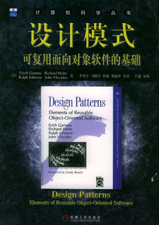
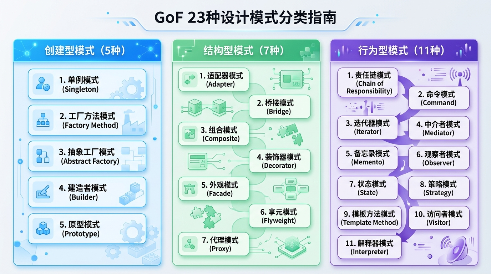
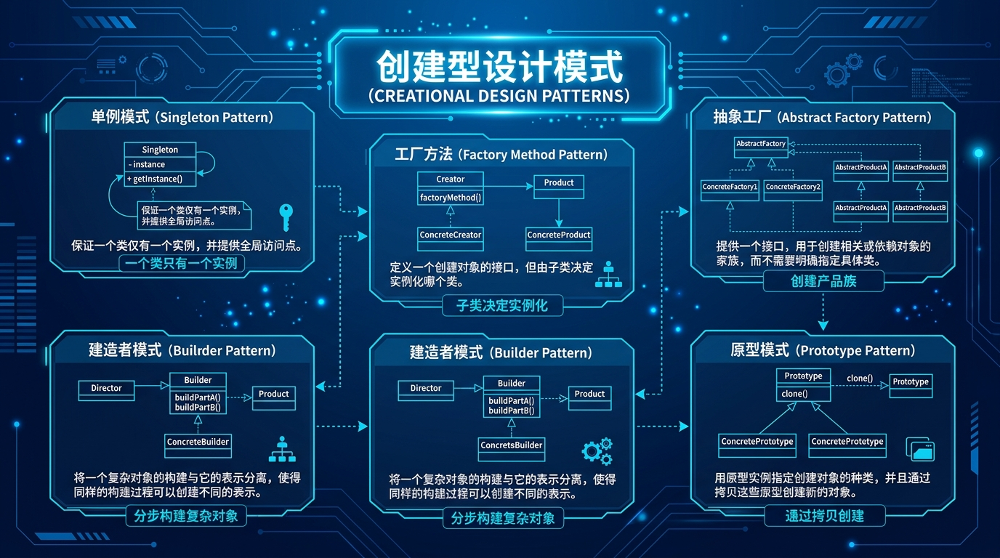
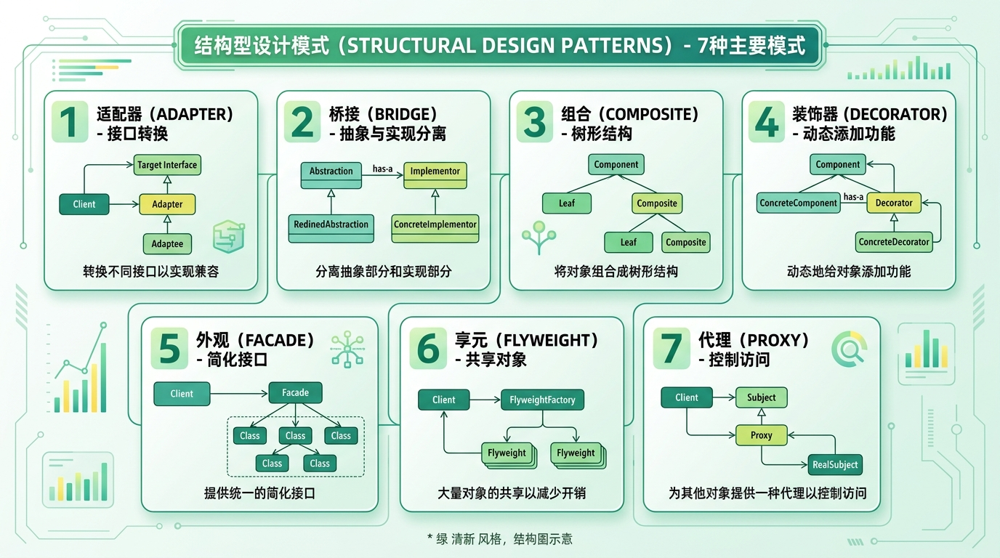
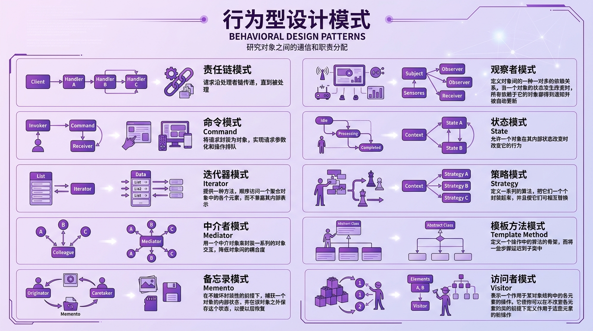
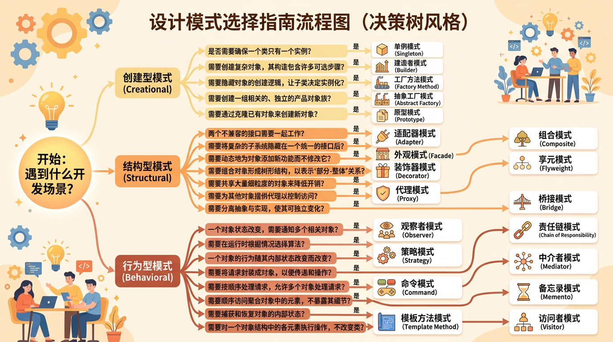

---

设计模式是针对软件设计中反复出现问题的通用解决方案，其核心在于提升代码复用性，避免重复劳动。 

## 什么是设计模式

引用**克里斯托弗·亚历山大（Christopher Alexander）**在1977年的著作《**A Pattern Language: Towns, Buildings, Construction**》中提出了关于设计模式的经典定义。

**英文原版**：

> *"Each pattern describes a problem which occurs over and over again in our environment, and then describes the core of the solution to that problem, in such a way that you can use this solution a million times over, without ever doing it the same way twice."*
> — Christopher Alexander, *A Pattern Language*, 1977

**中文翻译**：

> “每一个模式描述了一个在我们环境中反复出现的问题，并描述了该问题解决方案的核心。通过这种方式，你可以无数次地使用该解决方案，而无需以相同的方式重复两次。”

说人话就是:`不需要重复造轮子`

推荐一本历史性著作《设计模式:可复用面相对象软件的基础》



> [!TIP]
>
>  设计模式的核心关键词: 复用

## 设计模式的分类

GoF（Gang of Four）设计模式共23种，分为三大类：



| 类型 | 描述 | 包含模式 |
|------|------|----------|
| **创建型模式** | 处理对象创建机制，将对象的创建与使用分离 | 单例、工厂方法、抽象工厂、建造者、原型 |
| **结构型模式** | 处理类或对象的组合，关注如何组织类和对象 | 适配器、桥接、组合、装饰器、外观、享元、代理 |
| **行为型模式** | 处理对象间的通信，关注对象之间的职责分配和协作 | 责任链、命令、迭代器、中介者、备忘录、观察者、状态、策略、模板方法、访问者 |

---

## 创建型设计模式



### 1. 单例模式（Singleton）

**意图**：保证一个类仅有一个实例，并提供一个访问它的全局访问点。

#### 线程安全的单例实现（C++11及以后）

```cpp
#include <mutex>
#include <memory>

class Singleton {
public:
    // 删除拷贝构造和赋值运算符
    Singleton(const Singleton&) = delete;
    Singleton& operator=(const Singleton&) = delete;
    
    // 获取单例实例
    static Singleton& getInstance() {
        static Singleton instance;  // C++11保证线程安全
        return instance;
    }
    
    void doSomething() {
        // 业务逻辑
    }
    
private:
    Singleton() {
        // 私有构造函数
    }
    ~Singleton() = default;
};
```

#### 双重检查锁定实现

```cpp
class Singleton {
public:
    static Singleton* getInstance() {
        if (instance == nullptr) {
            std::lock_guard<std::mutex> lock(mutex);
            if (instance == nullptr) {
                instance = new Singleton();
            }
        }
        return instance;
    }
    
private:
    Singleton() = default;
    static Singleton* instance;
    static std::mutex mutex;
};

// 静态成员初始化
Singleton* Singleton::instance = nullptr;
std::mutex Singleton::mutex;
```

#### 使用场景

- 配置管理器
- 日志记录器
- 数据库连接池
- 线程池

---

### 2. 工厂方法模式（Factory Method）

**意图**：定义一个创建对象的接口，让子类决定实例化哪一个类。工厂方法使一个类的实例化延迟到其子类。

```cpp
#include <iostream>
#include <memory>

// 产品基类
class Product {
public:
    virtual ~Product() = default;
    virtual void use() = 0;
};

// 具体产品A
class ConcreteProductA : public Product {
public:
    void use() override {
        std::cout << "使用产品A" << std::endl;
    }
};

// 具体产品B
class ConcreteProductB : public Product {
public:
    void use() override {
        std::cout << "使用产品B" << std::endl;
    }
};

// 工厂基类
class Factory {
public:
    virtual ~Factory() = default;
    virtual std::unique_ptr<Product> createProduct() = 0;
};

// 具体工厂A
class ConcreteFactoryA : public Factory {
public:
    std::unique_ptr<Product> createProduct() override {
        return std::make_unique<ConcreteProductA>();
    }
};

// 具体工厂B
class ConcreteFactoryB : public Factory {
public:
    std::unique_ptr<Product> createProduct() override {
        return std::make_unique<ConcreteProductB>();
    }
};

// 使用示例
int main() {
    std::unique_ptr<Factory> factory = std::make_unique<ConcreteFactoryA>();
    std::unique_ptr<Product> product = factory->createProduct();
    product->use();
    return 0;
}
```

---

### 3. 抽象工厂模式（Abstract Factory）

**意图**：提供一个创建一系列相关或相互依赖对象的接口，而无需指定它们具体的类。

```cpp
#include <iostream>
#include <memory>

// 抽象产品A
class AbstractProductA {
public:
    virtual ~AbstractProductA() = default;
    virtual void useA() = 0;
};

// 抽象产品B
class AbstractProductB {
public:
    virtual ~AbstractProductB() = default;
    virtual void useB() = 0;
};

// 具体产品A1
class ProductA1 : public AbstractProductA {
public:
    void useA() override { std::cout << "使用产品A1" << std::endl; }
};

// 具体产品A2
class ProductA2 : public AbstractProductA {
public:
    void useA() override { std::cout << "使用产品A2" << std::endl; }
};

// 具体产品B1
class ProductB1 : public AbstractProductB {
public:
    void useB() override { std::cout << "使用产品B1" << std::endl; }
};

// 具体产品B2
class ProductB2 : public AbstractProductB {
public:
    void useB() override { std::cout << "使用产品B2" << std::endl; }
};

// 抽象工厂
class AbstractFactory {
public:
    virtual ~AbstractFactory() = default;
    virtual std::unique_ptr<AbstractProductA> createProductA() = 0;
    virtual std::unique_ptr<AbstractProductB> createProductB() = 0;
};

// 具体工厂1 - 创建产品族1
class ConcreteFactory1 : public AbstractFactory {
public:
    std::unique_ptr<AbstractProductA> createProductA() override {
        return std::make_unique<ProductA1>();
    }
    std::unique_ptr<AbstractProductB> createProductB() override {
        return std::make_unique<ProductB1>();
    }
};

// 具体工厂2 - 创建产品族2
class ConcreteFactory2 : public AbstractFactory {
public:
    std::unique_ptr<AbstractProductA> createProductA() override {
        return std::make_unique<ProductA2>();
    }
    std::unique_ptr<AbstractProductB> createProductB() override {
        return std::make_unique<ProductB2>();
    }
};
```

---

### 4. 建造者模式（Builder）

**意图**：将一个复杂对象的构建与它的表示分离，使得同样的构建过程可以创建不同的表示。

```cpp
#include <iostream>
#include <string>

// 产品 - 电脑
class Computer {
public:
    void setCPU(const std::string& cpu) { m_cpu = cpu; }
    void setRAM(const std::string& ram) { m_ram = ram; }
    void setStorage(const std::string& storage) { m_storage = storage; }
    void setGPU(const std::string& gpu) { m_gpu = gpu; }
    
    void show() const {
        std::cout << "电脑配置: \n"
                  << "  CPU: " << m_cpu << "\n"
                  << "  RAM: " << m_ram << "\n"
                  << "  存储: " << m_storage << "\n"
                  << "  GPU: " << m_gpu << "\n";
    }
    
private:
    std::string m_cpu;
    std::string m_ram;
    std::string m_storage;
    std::string m_gpu;
};

// 抽象建造者
class ComputerBuilder {
public:
    virtual ~ComputerBuilder() = default;
    virtual void buildCPU() = 0;
    virtual void buildRAM() = 0;
    virtual void buildStorage() = 0;
    virtual void buildGPU() = 0;
    virtual Computer getResult() = 0;
};

// 具体建造者 - 游戏电脑
class GamingComputerBuilder : public ComputerBuilder {
public:
    void buildCPU() override { m_computer.setCPU("Intel i9-14900K"); }
    void buildRAM() override { m_computer.setRAM("64GB DDR5"); }
    void buildStorage() override { m_computer.setStorage("2TB NVMe SSD"); }
    void buildGPU() override { m_computer.setGPU("RTX 4090"); }
    Computer getResult() override { return m_computer; }
    
private:
    Computer m_computer;
};

// 具体建造者 - 办公电脑
class OfficeComputerBuilder : public ComputerBuilder {
public:
    void buildCPU() override { m_computer.setCPU("Intel i5-12400"); }
    void buildRAM() override { m_computer.setRAM("16GB DDR4"); }
    void buildStorage() override { m_computer.setStorage("512GB SSD"); }
    void buildGPU() override { m_computer.setGPU("集成显卡"); }
    Computer getResult() override { return m_computer; }
    
private:
    Computer m_computer;
};

// 指挥者
class Director {
public:
    void setBuilder(ComputerBuilder* builder) { m_builder = builder; }
    
    Computer construct() {
        m_builder->buildCPU();
        m_builder->buildRAM();
        m_builder->buildStorage();
        m_builder->buildGPU();
        return m_builder->getResult();
    }
    
private:
    ComputerBuilder* m_builder;
};

// 使用示例
int main() {
    Director director;
    GamingComputerBuilder gamingBuilder;
    
    director.setBuilder(&gamingBuilder);
    Computer gamingPC = director.construct();
    gamingPC.show();
    
    return 0;
}
```

#### 链式调用风格的Builder

```cpp
class Pizza {
public:
    class Builder;
    
    void show() const {
        std::cout << "披萨: " << m_size << "寸, "
                  << (m_cheese ? "芝士" : "无芝士") << ", "
                  << (m_pepperoni ? "意大利辣香肠" : "无香肠") << "\n";
    }
    
private:
    Pizza(int size) : m_size(size) {}
    
    int m_size;
    bool m_cheese = false;
    bool m_pepperoni = false;
    
    friend class Builder;
};

class Pizza::Builder {
public:
    Builder(int size) : m_pizza(size) {}
    
    Builder& addCheese() {
        m_pizza.m_cheese = true;
        return *this;
    }
    
    Builder& addPepperoni() {
        m_pizza.m_pepperoni = true;
        return *this;
    }
    
    Pizza build() {
        return std::move(m_pizza);
    }
    
private:
    Pizza m_pizza;
};

// 使用
Pizza pizza = Pizza::Builder(12)
    .addCheese()
    .addPepperoni()
    .build();
```

---

### 5. 原型模式（Prototype）

**意图**：用原型实例指定创建对象的种类，并且通过拷贝这些原型创建新的对象。

```cpp
#include <iostream>
#include <unordered_map>
#include <memory>

// 抽象原型
class Prototype {
public:
    virtual ~Prototype() = default;
    virtual std::unique_ptr<Prototype> clone() const = 0;
    virtual void use() const = 0;
};

// 具体原型A
class ConcretePrototypeA : public Prototype {
public:
    ConcretePrototypeA(int data) : m_data(data) {}
    
    // 拷贝构造函数
    ConcretePrototypeA(const ConcretePrototypeA& other)
        : m_data(other.m_data) {}
    
    std::unique_ptr<Prototype> clone() const override {
        return std::make_unique<ConcretePrototypeA>(*this);
    }
    
    void use() const override {
        std::cout << "原型A, 数据: " << m_data << std::endl;
    }
    
private:
    int m_data;
};

// 具体原型B
class ConcretePrototypeB : public Prototype {
public:
    ConcretePrototypeB(const std::string& name) : m_name(name) {}
    
    ConcretePrototypeB(const ConcretePrototypeB& other)
        : m_name(other.m_name) {}
    
    std::unique_ptr<Prototype> clone() const override {
        return std::make_unique<ConcretePrototypeB>(*this);
    }
    
    void use() const override {
        std::cout << "原型B, 名称: " << m_name << std::endl;
    }
    
private:
    std::string m_name;
};

// 原型管理器
class PrototypeManager {
public:
    void registerPrototype(const std::string& key, std::unique_ptr<Prototype> prototype) {
        m_prototypes[key] = std::move(prototype);
    }
    
    std::unique_ptr<Prototype> create(const std::string& key) {
        auto it = m_prototypes.find(key);
        if (it != m_prototypes.end()) {
            return it->second->clone();
        }
        return nullptr;
    }
    
private:
    std::unordered_map<std::string, std::unique_ptr<Prototype>> m_prototypes;
};

// 使用示例
int main() {
    PrototypeManager manager;
    manager.registerPrototype("A", std::make_unique<ConcretePrototypeA>(100));
    manager.registerPrototype("B", std::make_unique<ConcretePrototypeB>("Test"));
    
    auto cloneA = manager.create("A");
    auto cloneB = manager.create("B");
    
    cloneA->use();
    cloneB->use();
    
    return 0;
}
```

> [!WARNING]
> 深拷贝 vs 浅拷贝：原型模式需要注意拷贝的深度。如果对象包含指针成员，必须实现深拷贝。

---

## 结构型设计模式



### 6. 适配器模式（Adapter）

**意图**：将一个类的接口转换成客户希望的另一个接口。适配器模式使得原本由于接口不兼容而不能一起工作的那些类可以一起工作。

#### 对象适配器

```cpp
#include <iostream>

// 目标接口
class Target {
public:
    virtual ~Target() = default;
    virtual void request() = 0;
};

// 需要适配的类
class Adaptee {
public:
    void specificRequest() {
        std::cout << "Adaptee的特殊请求" << std::endl;
    }
};

// 适配器
class Adapter : public Target {
public:
    Adapter() : m_adaptee(std::make_unique<Adaptee>()) {}
    
    void request() override {
        m_adaptee->specificRequest();  // 转换调用
    }
    
private:
    std::unique_ptr<Adaptee> m_adaptee;
};
```

#### 类适配器（多重继承）

```cpp
class ClassAdapter : public Target, private Adaptee {
public:
    void request() override {
        specificRequest();  // 直接调用父类方法
    }
};
```

#### 实战示例：STL栈的适配器实现

```cpp
// stack实际上是对deque的适配
template <typename T, typename Container = std::deque<T>>
class Stack {
public:
    void push(const T& value) {
        c.push_back(value);
    }
    
    void pop() {
        c.pop_back();
    }
    
    T& top() {
        return c.back();
    }
    
    bool empty() const {
        return c.empty();
    }
    
private:
    Container c;  // 被适配的容器
};
```

---

### 7. 桥接模式（Bridge）

**意图**：将抽象部分与它的实现部分分离，使它们都可以独立地变化。

```cpp
#include <iostream>
#include <memory>

// 实现接口
class Color {
public:
    virtual ~Color() = default;
    virtual std::string getName() const = 0;
};

// 具体实现A
class Red : public Color {
public:
    std::string getName() const override { return "红色"; }
};

// 具体实现B
class Blue : public Color {
public:
    std::string getName() const override { return "蓝色"; }
};

// 抽象部分
class Shape {
public:
    Shape(std::unique_ptr<Color> color) : m_color(std::move(color)) {}
    virtual ~Shape() = default;
    virtual void draw() = 0;
    
protected:
    std::unique_ptr<Color> m_color;  // 桥接
};

// 扩展抽象A
class Circle : public Shape {
public:
    Circle(std::unique_ptr<Color> color, double radius)
        : Shape(std::move(color)), m_radius(radius) {}
    
    void draw() override {
        std::cout << "画一个" << m_color->getName() 
                  << "的圆形，半径: " << m_radius << std::endl;
    }
    
private:
    double m_radius;
};

// 扩展抽象B
class Rectangle : public Shape {
public:
    Rectangle(std::unique_ptr<Color> color, double width, double height)
        : Shape(std::move(color)), m_width(width), m_height(height) {}
    
    void draw() override {
        std::cout << "画一个" << m_color->getName()
                  << "的矩形，" << m_width << "x" << m_height << std::endl;
    }
    
private:
    double m_width;
    double m_height;
};

// 使用示例
int main() {
    auto red = std::make_unique<Red>();
    auto blue = std::make_unique<Blue>();
    
    Circle redCircle(std::move(red), 5.0);
    Rectangle blueRect(std::move(blue), 10.0, 20.0);
    
    redCircle.draw();
    blueRect.draw();
    
    return 0;
}
```

> [!TIP]
> 桥接模式的核心是**组合优于继承**，避免了类数量爆炸的问题。

---

### 8. 组合模式（Composite）

**意图**：将对象组合成树形结构以表示"部分-整体"的层次结构。组合模式使得用户对单个对象和组合对象的使用具有一致性。

```cpp
#include <iostream>
#include <vector>
#include <memory>
#include <algorithm>

// 抽象组件
class Component {
public:
    virtual ~Component() = default;
    virtual void display(int depth = 0) const = 0;
    
    virtual void add(std::unique_ptr<Component>) {}
    virtual void remove(Component*) {}
    
protected:
    void printIndent(int depth) const {
        for (int i = 0; i < depth; ++i) {
            std::cout << "  ";
        }
    }
};

// 叶子节点
class Leaf : public Component {
public:
    Leaf(const std::string& name) : m_name(name) {}
    
    void display(int depth = 0) const override {
        printIndent(depth);
        std::cout << "- " << m_name << std::endl;
    }
    
private:
    std::string m_name;
};

// 组合节点
class Composite : public Component {
public:
    Composite(const std::string& name) : m_name(name) {}
    
    void add(std::unique_ptr<Component> component) override {
        m_children.push_back(std::move(component));
    }
    
    void remove(Component* component) override {
        m_children.erase(
            std::remove_if(m_children.begin(), m_children.end(),
                [component](const std::unique_ptr<Component>& c) {
                    return c.get() == component;
                }),
            m_children.end()
        );
    }
    
    void display(int depth = 0) const override {
        printIndent(depth);
        std::cout << "+ " << m_name << std::endl;
        
        for (const auto& child : m_children) {
            child->display(depth + 1);
        }
    }
    
private:
    std::string m_name;
    std::vector<std::unique_ptr<Component>> m_children;
};

// 使用示例 - 文件系统
int main() {
    auto root = std::make_unique<Composite>("根目录");
    
    auto docs = std::make_unique<Composite>("文档");
    docs->add(std::make_unique<Leaf>("readme.txt"));
    docs->add(std::make_unique<Leaf>("todo.md"));
    
    auto pics = std::make_unique<Composite>("图片");
    pics->add(std::make_unique<Leaf>("photo.jpg"));
    
    root->add(std::move(docs));
    root->add(std::move(pics));
    root->add(std::make_unique<Leaf>("config.json"));
    
    root->display();
    
    return 0;
}
```

---

### 9. 装饰器模式（Decorator）

**意图**：动态地给一个对象添加一些额外的职责。就增加功能来说，装饰器模式相比生成子类更为灵活。

```cpp
#include <iostream>
#include <memory>

// 抽象组件
class Coffee {
public:
    virtual ~Coffee() = default;
    virtual double cost() const = 0;
    virtual std::string description() const = 0;
};

// 具体组件
class SimpleCoffee : public Coffee {
public:
    double cost() const override { return 10.0; }
    std::string description() const override { return "简单咖啡"; }
};

// 装饰器基类
class CoffeeDecorator : public Coffee {
public:
    CoffeeDecorator(std::unique_ptr<Coffee> coffee)
        : m_coffee(std::move(coffee)) {}
    
protected:
    std::unique_ptr<Coffee> m_coffee;
};

// 具体装饰器 - 牛奶
class MilkDecorator : public CoffeeDecorator {
public:
    MilkDecorator(std::unique_ptr<Coffee> coffee)
        : CoffeeDecorator(std::move(coffee)) {}
    
    double cost() const override {
        return m_coffee->cost() + 2.0;
    }
    
    std::string description() const override {
        return m_coffee->description() + " + 牛奶";
    }
};

// 具体装饰器 - 糖
class SugarDecorator : public CoffeeDecorator {
public:
    SugarDecorator(std::unique_ptr<Coffee> coffee)
        : CoffeeDecorator(std::move(coffee)) {}
    
    double cost() const override {
        return m_coffee->cost() + 1.0;
    }
    
    std::string description() const override {
        return m_coffee->description() + " + 糖";
    }
};

// 具体装饰器 - 奶泡
class WhipDecorator : public CoffeeDecorator {
public:
    WhipDecorator(std::unique_ptr<Coffee> coffee)
        : CoffeeDecorator(std::move(coffee)) {}
    
    double cost() const override {
        return m_coffee->cost() + 3.0;
    }
    
    std::string description() const override {
        return m_coffee->description() + " + 奶泡";
    }
};

// 使用示例
int main() {
    // 简单咖啡
    std::unique_ptr<Coffee> coffee = std::make_unique<SimpleCoffee>();
    std::cout << coffee->description() << ": ¥" << coffee->cost() << std::endl;
    
    // 加牛奶
    coffee = std::make_unique<MilkDecorator>(std::move(coffee));
    std::cout << coffee->description() << ": ¥" << coffee->cost() << std::endl;
    
    // 再加糖
    coffee = std::make_unique<SugarDecorator>(std::move(coffee));
    std::cout << coffee->description() << ": ¥" << coffee->cost() << std::endl;
    
    // 再加奶泡
    coffee = std::make_unique<WhipDecorator>(std::move(coffee));
    std::cout << coffee->description() << ": ¥" << coffee->cost() << std::endl;
    
    return 0;
}
```

---

### 10. 外观模式（Facade）

**意图**：为子系统中的一组接口提供一个一致的界面，外观模式定义了一个高层接口，这个接口使得这一子系统更加容易使用。

```cpp
#include <iostream>
#include <string>

// 子系统A - 内存管理
class Memory {
public:
    void init() { std::cout << "初始化内存...\n"; }
    void load(const std::string& program) {
        std::cout << "加载程序到内存: " << program << "\n";
    }
    void shutdown() { std::cout << "关闭内存...\n"; }
};

// 子系统B - CPU
class CPU {
public:
    void init() { std::cout << "初始化CPU...\n"; }
    void execute() { std::cout << "CPU执行指令...\n"; }
    void shutdown() { std::cout << "关闭CPU...\n"; }
};

// 子系统C - 硬盘
class HardDrive {
public:
    void init() { std::cout << "初始化硬盘...\n"; }
    std::string readBootSector() { return "操作系统启动代码"; }
    void shutdown() { std::cout << "关闭硬盘...\n"; }
};

// 外观类
class ComputerFacade {
public:
    void start() {
        std::cout << "===== 电脑启动 =====" << std::endl;
        m_hd.init();
        m_memory.init();
        m_cpu.init();
        
        std::string os = m_hd.readBootSector();
        m_memory.load(os);
        m_cpu.execute();
        std::cout << "===== 启动完成 =====" << std::endl;
    }
    
    void stop() {
        std::cout << "===== 电脑关闭 =====" << std::endl;
        m_cpu.shutdown();
        m_memory.shutdown();
        m_hd.shutdown();
        std::cout << "===== 关闭完成 =====" << std::endl;
    }
    
private:
    Memory m_memory;
    CPU m_cpu;
    HardDrive m_hd;
};

// 使用示例
int main() {
    ComputerFacade computer;
    computer.start();
    std::cout << "\n电脑运行中...\n\n";
    computer.stop();
    return 0;
}
```

---

### 11. 享元模式（Flyweight）

**意图**：运用共享技术有效地支持大量细粒度的对象。

```cpp
#include <iostream>
#include <unordered_map>
#include <memory>
#include <string>

// 享元类
class Character {
public:
    Character(char intrinsicState) : m_symbol(intrinsicState) {}
    
    void display(int extrinsicState) const {  // 外部状态作为参数传入
        std::cout << "字符: '" << m_symbol 
                  << "', 字号: " << extrinsicState << std::endl;
    }
    
    char getSymbol() const { return m_symbol; }
    
private:
    char m_symbol;  // 内部状态：字符本身，可共享
};

// 享元工厂
class CharacterFactory {
public:
    std::shared_ptr<Character> getCharacter(char key) {
        auto it = m_characters.find(key);
        if (it == m_characters.end()) {
            auto character = std::make_shared<Character>(key);
            m_characters[key] = character;
            std::cout << "创建新字符: '" << key << "'\n";
            return character;
        }
        return it->second;
    }
    
    size_t getCount() const { return m_characters.size(); }
    
private:
    std::unordered_map<char, std::shared_ptr<Character>> m_characters;
};

// 使用示例
int main() {
    CharacterFactory factory;
    
    // 文档内容
    std::string document = "Hello World! Hello C++!";
    int fontSize = 12;
    
    std::cout << "渲染文档:\n";
    for (char c : document) {
        auto character = factory.getCharacter(c);
        character->display(fontSize);
        fontSize++;  // 模拟不同的字号（外部状态）
    }
    
    std::cout << "\n享元池中字符数量: " << factory.getCount() << std::endl;
    std::cout << "文档总长度: " << document.size() << std::endl;
    std::cout << "节省了 " << (document.size() - factory.getCount()) 
              << " 个对象\n";
    
    return 0;
}
```

> [!NOTE]
> **内部状态 vs 外部状态**：
> - 内部状态：存储在享元对象内部，不会随环境改变而改变，可以共享
> - 外部状态：由客户端保存，在使用时传入享元对象

---

### 12. 代理模式（Proxy）

**意图**：为其他对象提供一种代理以控制对这个对象的访问。

#### 虚代理（Virtual Proxy） - 延迟加载

```cpp
#include <iostream>
#include <memory>
#include <string>

// 抽象主题
class Image {
public:
    virtual ~Image() = default;
    virtual void display() = 0;
};

// 真实主题
class RealImage : public Image {
public:
    RealImage(const std::string& filename) : m_filename(filename) {
        loadFromDisk();
    }
    
    void display() override {
        std::cout << "显示图片: " << m_filename << std::endl;
    }
    
private:
    void loadFromDisk() {
        std::cout << "从磁盘加载图片: " << m_filename << std::endl;
    }
    
    std::string m_filename;
};

// 代理
class ImageProxy : public Image {
public:
    ImageProxy(const std::string& filename) : m_filename(filename) {}
    
    void display() override {
        if (!m_realImage) {
            m_realImage = std::make_unique<RealImage>(m_filename);
        }
        m_realImage->display();
    }
    
private:
    std::string m_filename;
    std::unique_ptr<RealImage> m_realImage;
};
```

#### 保护代理（Protection Proxy） - 权限控制

```cpp
#include <iostream>
#include <string>

// 抽象主题
class Database {
public:
    virtual ~Database() = default;
    virtual void query(const std::string& sql) = 0;
};

// 真实主题
class RealDatabase : public Database {
public:
    void query(const std::string& sql) override {
        std::cout << "执行SQL: " << sql << std::endl;
    }
};

// 代理
class DatabaseProxy : public Database {
public:
    DatabaseProxy(const std::string& user, const std::string& password)
        : m_user(user), m_password(password) {}
    
    void query(const std::string& sql) override {
        if (checkAccess()) {
            if (!m_realDB) {
                m_realDB = std::make_unique<RealDatabase>();
            }
            logQuery(sql);
            m_realDB->query(sql);
        } else {
            std::cout << "访问被拒绝！\n";
        }
    }
    
private:
    bool checkAccess() {
        return m_user == "admin" && m_password == "123456";
    }
    
    void logQuery(const std::string& sql) {
        std::cout << "[日志] 用户 " << m_user << " 执行查询: " << sql << "\n";
    }
    
    std::string m_user;
    std::string m_password;
    std::unique_ptr<RealDatabase> m_realDB;
};
```

#### 智能指针（C++内置代理模式）

```cpp
// std::shared_ptr 就是一种代理模式
#include <memory>

class MyClass {};

void example() {
    std::shared_ptr<MyClass> ptr = std::make_shared<MyClass>();
    // ptr 代理了 MyClass 对象，控制其生命周期和访问
}
```

---

## 行为型设计模式



### 13. 责任链模式（Chain of Responsibility）

**意图**：使多个对象都有机会处理请求，从而避免请求的发送者和接收者之间的耦合关系。将这些对象连成一条链，并沿着这条链传递该请求，直到有一个对象处理它为止。

```cpp
#include <iostream>
#include <memory>
#include <string>

// 请求
class Request {
public:
    Request(const std::string& type, int level)
        : m_type(type), m_level(level) {}
    
    std::string getType() const { return m_type; }
    int getLevel() const { return m_level; }
    
private:
    std::string m_type;
    int m_level;
};

// 抽象处理者
class Handler {
public:
    virtual ~Handler() = default;
    
    void setNext(std::shared_ptr<Handler> next) {
        m_next = std::move(next);
    }
    
    void handle(const Request& request) {
        if (canHandle(request)) {
            process(request);
        } else if (m_next) {
            m_next->handle(request);
        } else {
            std::cout << "无人能处理该请求！\n";
        }
    }
    
protected:
    virtual bool canHandle(const Request& request) = 0;
    virtual void process(const Request& request) = 0;
    
    std::shared_ptr<Handler> m_next;
};

// 具体处理者A - 低级支持
class Level1Support : public Handler {
protected:
    bool canHandle(const Request& request) override {
        return request.getLevel() <= 1;
    }
    
    void process(const Request& request) override {
        std::cout << "一级支持处理请求: " << request.getType() << "\n";
    }
};

// 具体处理者B - 中级支持
class Level2Support : public Handler {
protected:
    bool canHandle(const Request& request) override {
        return request.getLevel() <= 2;
    }
    
    void process(const Request& request) override {
        std::cout << "二级支持处理请求: " << request.getType() << "\n";
    }
};

// 具体处理者C - 高级支持
class Level3Support : public Handler {
protected:
    bool canHandle(const Request& request) override {
        return request.getLevel() <= 3;
    }
    
    void process(const Request& request) override {
        std::cout << "三级支持处理请求: " << request.getType() << "\n";
    }
};

// 使用示例
int main() {
    auto level1 = std::make_shared<Level1Support>();
    auto level2 = std::make_shared<Level2Support>();
    auto level3 = std::make_shared<Level3Support>();
    
    // 构建责任链
    level1->setNext(level2);
    level2->setNext(level3);
    
    Request req1("简单问题", 1);
    Request req2("中等问题", 2);
    Request req3("复杂问题", 3);
    Request req4("未知问题", 4);
    
    level1->handle(req1);
    level1->handle(req2);
    level1->handle(req3);
    level1->handle(req4);
    
    return 0;
}
```

---

### 14. 命令模式（Command）

**意图**：将一个请求封装为一个对象，从而使你可用不同的请求对客户进行参数化；对请求排队或记录请求日志，以及支持可撤销的操作。

```cpp
#include <iostream>
#include <vector>
#include <memory>
#include <stack>

// 接收者
class Light {
public:
    void on() { std::cout << "灯打开了\n"; m_state = true; }
    void off() { std::cout << "灯关闭了\n"; m_state = false; }
    bool getState() const { return m_state; }
    
private:
    bool m_state = false;
};

// 抽象命令
class Command {
public:
    virtual ~Command() = default;
    virtual void execute() = 0;
    virtual void undo() = 0;
};

// 具体命令 - 开灯
class LightOnCommand : public Command {
public:
    LightOnCommand(Light* light) : m_light(light), m_prevState(false) {}
    
    void execute() override {
        m_prevState = m_light->getState();
        m_light->on();
    }
    
    void undo() override {
        if (m_prevState) {
            m_light->on();
        } else {
            m_light->off();
        }
    }
    
private:
    Light* m_light;
    bool m_prevState;
};

// 具体命令 - 关灯
class LightOffCommand : public Command {
public:
    LightOffCommand(Light* light) : m_light(light), m_prevState(false) {}
    
    void execute() override {
        m_prevState = m_light->getState();
        m_light->off();
    }
    
    void undo() override {
        if (m_prevState) {
            m_light->on();
        } else {
            m_light->off();
        }
    }
    
private:
    Light* m_light;
    bool m_prevState;
};

// 调用者 - 遥控器
class RemoteControl {
public:
    void setCommand(std::unique_ptr<Command> command) {
        m_command = std::move(command);
    }
    
    void buttonPressed() {
        if (m_command) {
            m_command->execute();
            m_history.push(std::move(m_command));
        }
    }
    
    void undo() {
        if (!m_history.empty()) {
            m_history.top()->undo();
            m_history.pop();
        }
    }
    
private:
    std::unique_ptr<Command> m_command;
    std::stack<std::unique_ptr<Command>> m_history;
};

// 使用示例
int main() {
    Light light;
    RemoteControl remote;
    
    // 开灯
    remote.setCommand(std::make_unique<LightOnCommand>(&light));
    remote.buttonPressed();
    
    // 关灯
    remote.setCommand(std::make_unique<LightOffCommand>(&light));
    remote.buttonPressed();
    
    // 撤销两次
    std::cout << "\n撤销操作:\n";
    remote.undo();  // 撤销关灯 -> 开灯
    remote.undo();  // 撤销开灯 -> 关灯
    
    return 0;
}
```

---

### 15. 迭代器模式（Iterator）

**意图**：提供一种方法顺序访问一个聚合对象中各个元素，而又不需暴露该对象的内部表示。

#### C++ STL风格迭代器实现

```cpp
#include <iostream>
#include <vector>
#include <stdexcept>

// 自定义容器
template <typename T>
class MyContainer {
public:
    void add(const T& value) {
        m_data.push_back(value);
    }
    
    size_t size() const { return m_data.size(); }
    T& operator[](size_t index) { return m_data[index]; }
    
    // 迭代器类
    class Iterator {
    public:
        using value_type = T;
        using reference = T&;
        using pointer = T*;
        using difference_type = std::ptrdiff_t;
        using iterator_category = std::forward_iterator_tag;
        
        Iterator(MyContainer* container, size_t index)
            : m_container(container), m_index(index) {}
        
        reference operator*() const {
            return (*m_container)[m_index];
        }
        
        pointer operator->() const {
            return &(*m_container)[m_index];
        }
        
        Iterator& operator++() {  // 前置++
            ++m_index;
            return *this;
        }
        
        Iterator operator++(int) {  // 后置++
            Iterator temp = *this;
            ++m_index;
            return temp;
        }
        
        bool operator==(const Iterator& other) const {
            return m_container == other.m_container && m_index == other.m_index;
        }
        
        bool operator!=(const Iterator& other) const {
            return !(*this == other);
        }
        
    private:
        MyContainer* m_container;
        size_t m_index;
    };
    
    Iterator begin() { return Iterator(this, 0); }
    Iterator end() { return Iterator(this, m_data.size()); }
    
private:
    std::vector<T> m_data;
};

// 使用示例
int main() {
    MyContainer<int> container;
    container.add(10);
    container.add(20);
    container.add(30);
    
    // 使用迭代器遍历
    std::cout << "遍历容器: ";
    for (auto it = container.begin(); it != container.end(); ++it) {
        std::cout << *it << " ";
    }
    std::cout << "\n";
    
    // 范围for循环（依赖begin/end）
    std::cout << "范围for: ";
    for (const auto& val : container) {
        std::cout << val << " ";
    }
    std::cout << "\n";
    
    return 0;
}
```

> [!TIP]
> C++ STL已经实现了丰富的迭代器，大多数情况下不需要自己实现。

---

### 16. 中介者模式（Mediator）

**意图**：用一个中介对象来封装一系列的对象交互。中介者使各对象不需要显式地相互引用，从而使其耦合松散，而且可以独立地改变它们之间的交互。

```cpp
#include <iostream>
#include <string>
#include <vector>
#include <memory>

class Colleague;

// 抽象中介者
class Mediator {
public:
    virtual ~Mediator() = default;
    virtual void send(const std::string& message, Colleague* sender) = 0;
};

// 抽象同事类
class Colleague {
public:
    Colleague(Mediator* mediator, const std::string& name)
        : m_mediator(mediator), m_name(name) {}
    
    virtual ~Colleague() = default;
    
    std::string getName() const { return m_name; }
    
    virtual void receive(const std::string& message) = 0;
    
protected:
    Mediator* m_mediator;
    std::string m_name;
};

// 具体同事类 - 用户
class User : public Colleague {
public:
    User(Mediator* mediator, const std::string& name)
        : Colleague(mediator, name) {}
    
    void send(const std::string& message) {
        std::cout << "[" << m_name << "] 发送: " << message << "\n";
        m_mediator->send(message, this);
    }
    
    void receive(const std::string& message) override {
        std::cout << "[" << m_name << "] 收到: " << message << "\n";
    }
};

// 具体中介者 - 聊天室
class ChatRoom : public Mediator {
public:
    void addUser(std::shared_ptr<User> user) {
        m_users.push_back(std::move(user));
    }
    
    void send(const std::string& message, Colleague* sender) override {
        for (auto& user : m_users) {
            if (user.get() != sender) {
                user->receive(message);
            }
        }
    }
    
private:
    std::vector<std::shared_ptr<User>> m_users;
};

// 使用示例
int main() {
    ChatRoom chatRoom;
    
    auto alice = std::make_shared<User>(&chatRoom, "Alice");
    auto bob = std::make_shared<User>(&chatRoom, "Bob");
    auto charlie = std::make_shared<User>(&chatRoom, "Charlie");
    
    chatRoom.addUser(alice);
    chatRoom.addUser(bob);
    chatRoom.addUser(charlie);
    
    alice->send("大家好！");
    std::cout << "\n";
    bob->send("你好，Alice！");
    
    return 0;
}
```

---

### 17. 备忘录模式（Memento）

**意图**：在不破坏封装性的前提下，捕获一个对象的内部状态，并在该对象之外保存这个状态。这样以后就可将该对象恢复到原先保存的状态。

```cpp
#include <iostream>
#include <string>
#include <memory>
#include <vector>

// 备忘录
class Memento {
private:
    friend class Originator;
    
    Memento(const std::string& state) : m_state(state) {}
    
    std::string getState() const { return m_state; }
    
private:
    std::string m_state;
};

// 原发器
class Originator {
public:
    void setState(const std::string& state) {
        std::cout << "设置状态: " << state << "\n";
        m_state = state;
    }
    
    std::string getState() const { return m_state; }
    
    std::unique_ptr<Memento> save() {
        std::cout << "保存状态: " << m_state << "\n";
        return std::make_unique<Memento>(m_state);
    }
    
    void restore(const Memento* memento) {
        if (memento) {
            m_state = memento->getState();
            std::cout << "恢复状态: " << m_state << "\n";
        }
    }
    
private:
    std::string m_state;
};

// 管理者
class Caretaker {
public:
    void addMemento(std::unique_ptr<Memento> memento) {
        m_history.push_back(std::move(memento));
    }
    
    Memento* getMemento(size_t index) {
        if (index < m_history.size()) {
            return m_history[index].get();
        }
        return nullptr;
    }
    
    size_t getHistorySize() const { return m_history.size(); }
    
private:
    std::vector<std::unique_ptr<Memento>> m_history;
};

// 使用示例
int main() {
    Originator editor;
    Caretaker history;
    
    editor.setState("版本1");
    history.addMemento(editor.save());
    
    editor.setState("版本2");
    history.addMemento(editor.save());
    
    editor.setState("版本3");
    history.addMemento(editor.save());
    
    std::cout << "\n当前状态: " << editor.getState() << "\n\n";
    
    // 恢复到版本2
    std::cout << "--- 恢复到历史版本 ---\n";
    editor.restore(history.getMemento(1));
    
    // 恢复到版本1
    editor.restore(history.getMemento(0));
    
    return 0;
}
```

> [!NOTE]
> **宽接口 vs 窄接口**：
> - 原发器（Originator）可以访问备忘录的所有数据（宽接口）
> - 其他对象只能看到备忘录的空壳（窄接口），保证了封装性

---

### 18. 观察者模式（Observer）

**意图**：定义对象间的一种一对多的依赖关系，当一个对象的状态发生改变时，所有依赖于它的对象都得到通知并被自动更新。

```cpp
#include <iostream>
#include <vector>
#include <algorithm>
#include <memory>
#include <string>

// 抽象观察者
class Observer {
public:
    virtual ~Observer() = default;
    virtual void update(float temperature, float humidity, float pressure) = 0;
    virtual std::string getName() const = 0;
};

// 抽象主题
class Subject {
public:
    virtual ~Subject() = default;
    virtual void registerObserver(std::shared_ptr<Observer> observer) = 0;
    virtual void removeObserver(Observer* observer) = 0;
    virtual void notifyObservers() = 0;
};

// 具体主题 - 气象站
class WeatherData : public Subject {
public:
    void registerObserver(std::shared_ptr<Observer> observer) override {
        m_observers.push_back(observer);
    }
    
    void removeObserver(Observer* observer) override {
        m_observers.erase(
            std::remove_if(m_observers.begin(), m_observers.end(),
                [observer](const std::shared_ptr<Observer>& o) {
                    return o.get() == observer;
                }),
            m_observers.end()
        );
    }
    
    void notifyObservers() override {
        for (const auto& observer : m_observers) {
            observer->update(m_temperature, m_humidity, m_pressure);
        }
    }
    
    void setMeasurements(float temp, float humidity, float pressure) {
        m_temperature = temp;
        m_humidity = humidity;
        m_pressure = pressure;
        measurementsChanged();
    }
    
private:
    void measurementsChanged() {
        notifyObservers();
    }
    
    std::vector<std::shared_ptr<Observer>> m_observers;
    float m_temperature = 0.0f;
    float m_humidity = 0.0f;
    float m_pressure = 0.0f;
};

// 具体观察者 - 显示面板
class DisplayBoard : public Observer {
public:
    DisplayBoard(const std::string& name) : m_name(name) {}
    
    void update(float temperature, float humidity, float pressure) override {
        m_temperature = temperature;
        m_humidity = humidity;
        m_pressure = pressure;
        display();
    }
    
    std::string getName() const override { return m_name; }
    
    void display() const {
        std::cout << "[" << m_name << "] "
                  << "温度: " << m_temperature << "°C, "
                  << "湿度: " << m_humidity << "%, "
                  << "气压: " << m_pressure << " hPa\n";
    }
    
private:
    std::string m_name;
    float m_temperature = 0.0f;
    float m_humidity = 0.0f;
    float m_pressure = 0.0f;
};

// 使用示例
int main() {
    WeatherData weatherData;
    
    auto display1 = std::make_shared<DisplayBoard>("手机端");
    auto display2 = std::make_shared<DisplayBoard>("电脑端");
    auto display3 = std::make_shared<DisplayBoard>("广告牌");
    
    weatherData.registerObserver(display1);
    weatherData.registerObserver(display2);
    weatherData.registerObserver(display3);
    
    std::cout << "--- 第一次更新天气 ---\n";
    weatherData.setMeasurements(25.0f, 65.0f, 1013.0f);
    
    std::cout << "\n--- 移除电脑端，第二次更新 ---\n";
    weatherData.removeObserver(display2.get());
    weatherData.setMeasurements(28.0f, 70.0f, 1010.0f);
    
    return 0;
}
```

---

### 19. 状态模式（State）

**意图**：允许一个对象在其内部状态改变时改变它的行为。对象看起来似乎修改了它的类。

```cpp
#include <iostream>
#include <memory>
#include <string>

class Context;

// 抽象状态
class State {
public:
    virtual ~State() = default;
    virtual void handle(Context* context) = 0;
    virtual std::string getName() const = 0;
};

// 上下文
class Context {
public:
    Context(std::unique_ptr<State> initialState)
        : m_state(std::move(initialState)) {}
    
    void setState(std::unique_ptr<State> state) {
        std::cout << "切换状态: " << m_state->getName() 
                  << " -> " << state->getName() << "\n";
        m_state = std::move(state);
    }
    
    void request() {
        m_state->handle(this);
    }
    
private:
    std::unique_ptr<State> m_state;
};

// 具体状态A
class ConcreteStateA : public State {
public:
    void handle(Context* context) override;
    std::string getName() const override { return "状态A"; }
};

// 具体状态B
class ConcreteStateB : public State {
public:
    void handle(Context* context) override;
    std::string getName() const override { return "状态B"; }
};

// 具体状态C
class ConcreteStateC : public State {
public:
    void handle(Context* context) override;
    std::string getName() const override { return "状态C"; }
};

// 实现状态转换逻辑
void ConcreteStateA::handle(Context* context) {
    std::cout << "状态A处理请求，准备切换到状态B\n";
    context->setState(std::make_unique<ConcreteStateB>());
}

void ConcreteStateB::handle(Context* context) {
    std::cout << "状态B处理请求，准备切换到状态C\n";
    context->setState(std::make_unique<ConcreteStateC>());
}

void ConcreteStateC::handle(Context* context) {
    std::cout << "状态C处理请求，准备切换到状态A\n";
    context->setState(std::make_unique<ConcreteStateA>());
}

// 使用示例 - 电梯状态
enum class Direction { UP, DOWN };

class ElevatorState;

class Elevator {
public:
    Elevator();
    
    void setState(std::unique_ptr<ElevatorState> state);
    void openDoor();
    void closeDoor();
    void goToFloor(int floor);
    
private:
    std::unique_ptr<ElevatorState> m_state;
    int m_currentFloor = 1;
};

class ElevatorState {
public:
    virtual ~ElevatorState() = default;
    virtual void openDoor(Elevator* elevator) = 0;
    virtual void closeDoor(Elevator* elevator) = 0;
    virtual void goToFloor(Elevator* elevator, int floor) = 0;
};

class IdleState : public ElevatorState {
public:
    void openDoor(Elevator* elevator) override;
    void closeDoor(Elevator* elevator) override;
    void goToFloor(Elevator* elevator, int floor) override;
};

class MovingState : public ElevatorState {
public:
    void openDoor(Elevator* elevator) override;
    void closeDoor(Elevator* elevator) override;
    void goToFloor(Elevator* elevator, int floor) override;
};

class DoorOpenState : public ElevatorState {
public:
    void openDoor(Elevator* elevator) override;
    void closeDoor(Elevator* elevator) override;
    void goToFloor(Elevator* elevator, int floor) override;
};

// 实现电梯状态机
Elevator::Elevator() : m_state(std::make_unique<IdleState>()) {}

void Elevator::setState(std::unique_ptr<ElevatorState> state) {
    m_state = std::move(state);
}

void Elevator::openDoor() { m_state->openDoor(this); }
void Elevator::closeDoor() { m_state->closeDoor(this); }
void Elevator::goToFloor(int floor) { m_state->goToFloor(this, floor); }

void IdleState::openDoor(Elevator* elevator) {
    std::cout << "电梯门打开\n";
    elevator->setState(std::make_unique<DoorOpenState>());
}

void IdleState::closeDoor(Elevator* elevator) {
    std::cout << "门已经关闭了\n";
}

void IdleState::goToFloor(Elevator* elevator, int floor) {
    std::cout << "电梯开始移动到 " << floor << " 楼\n";
    elevator->setState(std::make_unique<MovingState>());
}

void MovingState::openDoor(Elevator* elevator) {
    std::cout << "电梯正在移动，不能开门！\n";
}

void MovingState::closeDoor(Elevator* elevator) {
    std::cout << "门已经关闭了\n";
}

void MovingState::goToFloor(Elevator* elevator, int floor) {
    std::cout << "到达 " << floor << " 楼\n";
    elevator->setState(std::make_unique<IdleState>());
}

void DoorOpenState::openDoor(Elevator* elevator) {
    std::cout << "门已经打开了\n";
}

void DoorOpenState::closeDoor(Elevator* elevator) {
    std::cout << "电梯门关闭\n";
    elevator->setState(std::make_unique<IdleState>());
}

void DoorOpenState::goToFloor(Elevator* elevator, int floor) {
    std::cout << "请先关闭电梯门！\n";
}

int main() {
    std::cout << "=== 基本状态机示例 ===\n";
    Context context(std::make_unique<ConcreteStateA>());
    context.request();
    context.request();
    context.request();
    context.request();
    
    std::cout << "\n=== 电梯示例 ===\n";
    Elevator elevator;
    elevator.openDoor();
    elevator.goToFloor(5);   // 门开着，不能走
    elevator.closeDoor();
    elevator.goToFloor(5);   // 移动
    elevator.openDoor();      // 正在移动，不能开门
    elevator.goToFloor(5);   // 到达
    elevator.openDoor();      // 现在可以开门了
    
    return 0;
}
```

---

### 20. 策略模式（Strategy）

**意图**：定义一系列算法，把它们一个个封装起来，并且使它们可相互替换。本模式使得算法可独立于使用它的客户而变化。

```cpp
#include <iostream>
#include <memory>
#include <vector>
#include <algorithm>

// 抽象策略
class SortStrategy {
public:
    virtual ~SortStrategy() = default;
    virtual void sort(std::vector<int>& data) = 0;
    virtual std::string getName() const = 0;
};

// 具体策略A - 冒泡排序
class BubbleSort : public SortStrategy {
public:
    void sort(std::vector<int>& data) override {
        int n = data.size();
        for (int i = 0; i < n - 1; ++i) {
            for (int j = 0; j < n - i - 1; ++j) {
                if (data[j] > data[j + 1]) {
                    std::swap(data[j], data[j + 1]);
                }
            }
        }
    }
    
    std::string getName() const override { return "冒泡排序"; }
};

// 具体策略B - 快速排序
class QuickSort : public SortStrategy {
public:
    void sort(std::vector<int>& data) override {
        quickSort(data, 0, data.size() - 1);
    }
    
    std::string getName() const override { return "快速排序"; }
    
private:
    void quickSort(std::vector<int>& data, int low, int high) {
        if (low < high) {
            int pivot = partition(data, low, high);
            quickSort(data, low, pivot - 1);
            quickSort(data, pivot + 1, high);
        }
    }
    
    int partition(std::vector<int>& data, int low, int high) {
        int pivot = data[high];
        int i = low - 1;
        for (int j = low; j < high; ++j) {
            if (data[j] <= pivot) {
                ++i;
                std::swap(data[i], data[j]);
            }
        }
        std::swap(data[i + 1], data[high]);
        return i + 1;
    }
};

// 具体策略C - STL排序
class STLSort : public SortStrategy {
public:
    void sort(std::vector<int>& data) override {
        std::sort(data.begin(), data.end());
    }
    
    std::string getName() const override { return "STL排序"; }
};

// 上下文
class Sorter {
public:
    Sorter(std::unique_ptr<SortStrategy> strategy)
        : m_strategy(std::move(strategy)) {}
    
    void setStrategy(std::unique_ptr<SortStrategy> strategy) {
        m_strategy = std::move(strategy);
    }
    
    void sort(std::vector<int>& data) {
        std::cout << "使用" << m_strategy->getName() << "进行排序...\n";
        m_strategy->sort(data);
    }
    
private:
    std::unique_ptr<SortStrategy> m_strategy;
};

// 使用示例
int main() {
    std::vector<int> data = {64, 34, 25, 12, 22, 11, 90};
    std::vector<int> copy;
    
    Sorter sorter(std::make_unique<BubbleSort>());
    
    // 冒泡排序
    copy = data;
    sorter.sort(copy);
    
    // 切换到快速排序
    sorter.setStrategy(std::make_unique<QuickSort>());
    copy = data;
    sorter.sort(copy);
    
    // 切换到STL排序
    sorter.setStrategy(std::make_unique<STLSort>());
    copy = data;
    sorter.sort(copy);
    
    return 0;
}
```

---

### 21. 模板方法模式（Template Method）

**意图**：定义一个操作中的算法的骨架，而将一些步骤延迟到子类中。模板方法使得子类可以不改变一个算法的结构即可重定义该算法的某些特定步骤。

```cpp
#include <iostream>
#include <string>

// 抽象类
class DataProcessor {
public:
    // 模板方法 - 定义算法骨架
    void process() {
        loadData();
        if (needPreprocess()) {  // 钩子方法
            preprocess();
        }
        transformData();
        saveData();
    }
    
    virtual ~DataProcessor() = default;
    
protected:
    // 抽象方法 - 必须由子类实现
    virtual void loadData() = 0;
    virtual void transformData() = 0;
    virtual void saveData() = 0;
    
    // 钩子方法 - 子类可以选择重写
    virtual bool needPreprocess() { return false; }
    virtual void preprocess() {}
};

// 具体类A - CSV数据处理
class CSVProcessor : public DataProcessor {
protected:
    void loadData() override {
        std::cout << "从CSV文件加载数据\n";
    }
    
    bool needPreprocess() override {
        return true;  // 需要预处理
    }
    
    void preprocess() override {
        std::cout << "清洗CSV数据（去除空行）\n";
    }
    
    void transformData() override {
        std::cout << "转换CSV数据格式\n";
    }
    
    void saveData() override {
        std::cout << "保存处理后的CSV文件\n";
    }
};

// 具体类B - XML数据处理
class XMLProcessor : public DataProcessor {
protected:
    void loadData() override {
        std::cout << "从XML文件加载数据\n";
    }
    
    void transformData() override {
        std::cout << "转换XML数据格式\n";
    }
    
    void saveData() override {
        std::cout << "保存处理后的XML文件\n";
    }
};

// 使用示例
int main() {
    std::cout << "--- CSV处理流程 ---\n";
    CSVProcessor csvProcessor;
    csvProcessor.process();
    
    std::cout << "\n--- XML处理流程 ---\n";
    XMLProcessor xmlProcessor;
    xmlProcessor.process();
    
    return 0;
}
```

> [!NOTE]
> **好莱坞原则**：不要打电话给我们，我们会打电话给你。
> 即高层组件决定何时调用低层组件，低层组件不要调用高层组件。

---

### 22. 访问者模式（Visitor）

**意图**：表示一个作用于某对象结构中的各元素的操作。它使你可以在不改变各元素的类的前提下定义作用于这些元素的新操作。

```cpp
#include <iostream>
#include <vector>
#include <memory>

// 前向声明
class Circle;
class Rectangle;
class Triangle;

// 抽象访问者
class ShapeVisitor {
public:
    virtual ~ShapeVisitor() = default;
    virtual void visit(Circle* circle) = 0;
    virtual void visit(Rectangle* rectangle) = 0;
    virtual void visit(Triangle* triangle) = 0;
};

// 抽象元素
class Shape {
public:
    virtual ~Shape() = default;
    virtual void accept(ShapeVisitor* visitor) = 0;
};

// 具体元素 - 圆形
class Circle : public Shape {
public:
    Circle(double radius) : m_radius(radius) {}
    
    void accept(ShapeVisitor* visitor) override {
        visitor->visit(this);
    }
    
    double getRadius() const { return m_radius; }
    
private:
    double m_radius;
};

// 具体元素 - 矩形
class Rectangle : public Shape {
public:
    Rectangle(double width, double height)
        : m_width(width), m_height(height) {}
    
    void accept(ShapeVisitor* visitor) override {
        visitor->visit(this);
    }
    
    double getWidth() const { return m_width; }
    double getHeight() const { return m_height; }
    
private:
    double m_width;
    double m_height;
};

// 具体元素 - 三角形
class Triangle : public Shape {
public:
    Triangle(double base, double height)
        : m_base(base), m_height(height) {}
    
    void accept(ShapeVisitor* visitor) override {
        visitor->visit(this);
    }
    
    double getBase() const { return m_base; }
    double getHeight() const { return m_height; }
    
private:
    double m_base;
    double m_height;
};

// 具体访问者 - 计算面积
class AreaCalculator : public ShapeVisitor {
public:
    void visit(Circle* circle) override {
        double area = 3.14159 * circle->getRadius() * circle->getRadius();
        std::cout << "圆形面积: " << area << "\n";
        m_totalArea += area;
    }
    
    void visit(Rectangle* rectangle) override {
        double area = rectangle->getWidth() * rectangle->getHeight();
        std::cout << "矩形面积: " << area << "\n";
        m_totalArea += area;
    }
    
    void visit(Triangle* triangle) override {
        double area = 0.5 * triangle->getBase() * triangle->getHeight();
        std::cout << "三角形面积: " << area << "\n";
        m_totalArea += area;
    }
    
    double getTotalArea() const { return m_totalArea; }
    
private:
    double m_totalArea = 0.0;
};

// 具体访问者 - 绘制
class Renderer : public ShapeVisitor {
public:
    void visit(Circle* circle) override {
        std::cout << "绘制圆形，半径: " << circle->getRadius() << "\n";
    }
    
    void visit(Rectangle* rectangle) override {
        std::cout << "绘制矩形，" << rectangle->getWidth() 
                  << "x" << rectangle->getHeight() << "\n";
    }
    
    void visit(Triangle* triangle) override {
        std::cout << "绘制三角形，底: " << triangle->getBase()
                  << ", 高: " << triangle->getHeight() << "\n";
    }
};

// 对象结构
class ShapeCollection {
public:
    void add(std::unique_ptr<Shape> shape) {
        m_shapes.push_back(std::move(shape));
    }
    
    void accept(ShapeVisitor* visitor) {
        for (auto& shape : m_shapes) {
            shape->accept(visitor);
        }
    }
    
private:
    std::vector<std::unique_ptr<Shape>> m_shapes;
};

// 使用示例
int main() {
    ShapeCollection shapes;
    shapes.add(std::make_unique<Circle>(5.0));
    shapes.add(std::make_unique<Rectangle>(10.0, 20.0));
    shapes.add(std::make_unique<Triangle>(8.0, 6.0));
    
    std::cout << "=== 计算面积 ===\n";
    AreaCalculator calculator;
    shapes.accept(&calculator);
    std::cout << "总面积: " << calculator.getTotalArea() << "\n";
    
    std::cout << "\n=== 渲染图形 ===\n";
    Renderer renderer;
    shapes.accept(&renderer);
    
    return 0;
}
```

---

## 设计模式选择指南



### 按问题场景选择模式

| 问题场景 | 推荐模式 |
|---------|---------|
| 需要控制实例数量 | 单例模式 |
| 需要隐藏对象创建逻辑 | 工厂方法、抽象工厂 |
| 需要分步构建复杂对象 | 建造者模式 |
| 需要复制已有对象 | 原型模式 |
| 需要适配不兼容的接口 | 适配器模式 |
| 想避免类爆炸问题 | 桥接模式 |
| 需要处理树形结构 | 组合模式 |
| 需要动态添加功能 | 装饰器模式 |
| 需要简化复杂接口 | 外观模式 |
| 需要共享大量细粒度对象 | 享元模式 |
| 需要控制对象访问 | 代理模式 |
| 需要动态处理请求链 | 责任链模式 |
| 需要撤销/重做操作 | 命令模式 |
| 需要遍历聚合对象 | 迭代器模式 |
| 需要解耦多对象交互 | 中介者模式 |
| 需要保存/恢复对象状态 | 备忘录模式 |
| 需要通知多个对象状态变化 | 观察者模式 |
| 对象行为随状态改变 | 状态模式 |
| 需要互换算法 | 策略模式 |
| 需要固定算法骨架 | 模板方法模式 |
| 需要为稳定结构添加新操作 | 访问者模式 |

---

## 设计模式的C++特性结合

### 1. 智能指针与设计模式

```cpp
// 使用shared_ptr管理享元对象
class FlyweightFactory {
private:
    std::unordered_map<std::string, std::shared_ptr<Flyweight>> m_pool;
};

// 使用unique_ptr实现所有权转移
std::unique_ptr<Product> Factory::createProduct() {
    return std::make_unique<ConcreteProduct>();
}
```

### 2. 移动语义与原型模式

```cpp
class Prototype {
public:
    Prototype(Prototype&&) = default;  // 移动构造
    Prototype& operator=(Prototype&&) = default;
    
    virtual std::unique_ptr<Prototype> clone() const = 0;
};
```

### 3. lambda表达式与策略/命令模式

```cpp
#include <functional>

// 使用std::function替代策略类
class Executor {
public:
    using Strategy = std::function<void()>;
    
    void setStrategy(Strategy strategy) {
        m_strategy = std::move(strategy);
    }
    
    void execute() {
        if (m_strategy) m_strategy();
    }
    
private:
    Strategy m_strategy;
};

// 使用
Executor executor;
executor.setStrategy([]() { std::cout << "执行策略A\n"; });
executor.execute();
```

---

## 反模式 - 设计模式常见误用

### 1. 过度设计

不要为了使用模式而使用模式。简单的问题用简单的方案解决。

```cpp
// 反例：简单的Logger不需要用工厂+单例+观察者
// 正例：
class Logger {
public:
    static void log(const std::string& msg) {
        std::cout << msg << std::endl;
    }
};
```

### 2. 错误的模式选择

- 简单的继承能解决的问题，不要用装饰器
- 不需要撤销/重做的操作，不要用命令模式

### 3. 忽视语言特性

C++提供了很多内置特性，可以简化模式实现：
- 函数对象替代策略类
- 模板替代某些抽象工厂
- std::variant替代某些状态模式

---

## 总结

设计模式是经验的总结，不是一成不变的教条。记住：

1. **先理解问题，再选择模式** - 不要拿着锤子找钉子
2. **KISS原则** - 保持简单，模式是手段不是目的
3. **重构引入模式** - 不要一开始就上全套模式
4. **组合使用模式** - 现实中常常多个模式配合使用

> [!TIP]
> **学习建议**：
> - 理解每个模式的意图、结构、适用场景
> - 阅读优秀开源代码（如STL、Boost、Qt）
> - 在实际项目中尝试使用，逐步积累经验
> - 理解模式背后的设计原则（SOLID）比记住模式更重要