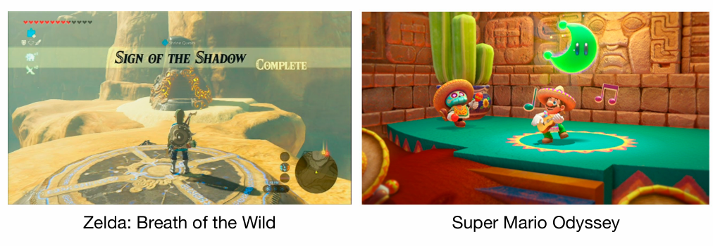
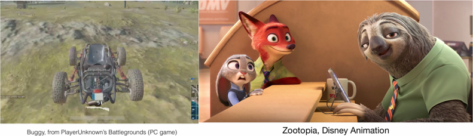
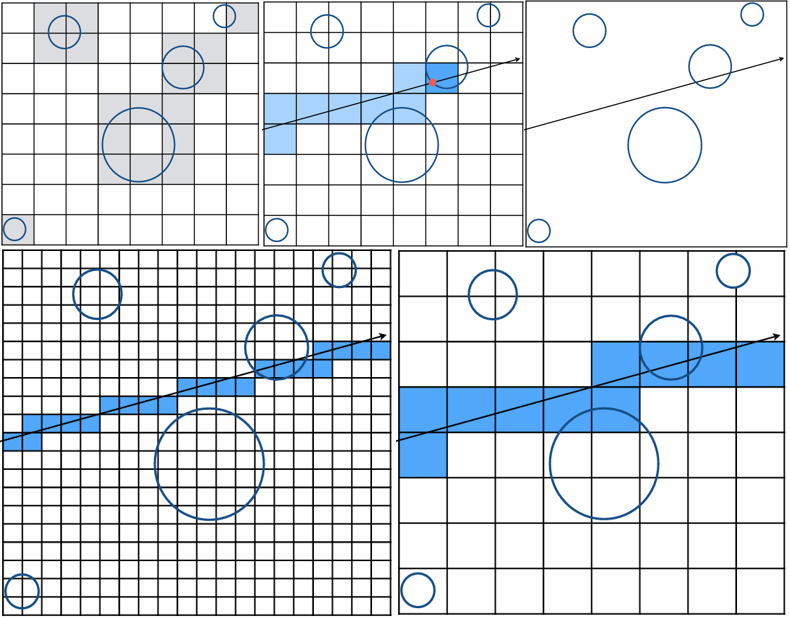

阴影贴图是光栅化渲染中生成阴影的主流技术。其核心思想是：一个点被照亮需同时被相机和光源可见。算法分为两步：首先从光源视角渲染生成记录最近距离的深度图；然后在相机视角渲染时，将每个点投影回光源视角，对比其实际距离与深度图记录值，以判断该点处于光照还是阴影中。 

要讲述光线追踪，首先需要先引入之前的光栅化中的一个内容--阴影贴图

# 先导

## 阴影贴图 (Shadow Mapping)

### **为什么需要 Shadow Mapping？**

在光栅化渲染中，我们通常是一个三角形一个三角形地画，很难直接知道“谁挡住了谁”从而产生阴影 。为了解决这个问题，我们引入了 **Shadow Mapping**。

- **定位**：这是目前最主流的阴影生成技术，从早期的《玩具总动员》到《塞尔达传说：荒野之息》、《超级马里奥：奥德赛》等现代游戏都在使用 。
- **本质**：它是一种**图像空间 (Image-space)** 的算法 。这意味着它依赖生成的图像（深度图）来计算，而不需要一直纠缠于复杂的场景几何数据。

Shadow Mapping 的核心思想非常朴素，只有一句话：

> **如果一个点不在阴影里，那么它必须能同时被“摄像机”和“光源”看到。** 

如果不被阴影覆盖（也就是被照亮），说明那个点既能被你的眼睛（相机）看见，也能被头顶的太阳（光源）直接照射到。如果那个点被太阳“看不见”（中间有障碍物挡住了），那它就在阴影里。

### **算法流程：经典的“两步走” (2-Pass)**

Shadow Mapping 之所以叫 Mapping，就是因为它需要生成一张图（Map）。整个过程分为两次渲染：

**第一步：光源视角的“彩排” (Pass 1: Render from Light)**

- **做什么**：把摄像机挪到光源的位置，看向场景，进行一次渲染 。
- **记什么**：我们不关心颜色，只关心**深度 (Depth)**。生成的这张图叫 **Shadow Map**（阴影贴图/深度图）。
- **意义**：这张图记录了**从光源出发，在这个方向上能看到的最远的物体离光源有多近**。换句话说，任何比这个距离更远的东西，都会被挡住。

**第二步：相机视角的“实拍” (Pass 2: Render from Eye)**

- **做什么**：把摄像机放回正常的观察位置，开始渲染画面 。
- **怎么算**：对于画面上的每一个可见点（Pixel），我们做一个“灵魂拷问”——**“光源能看见你吗？”**
  - **操作**：把这个点投影回光源的视角 。
  - **对比 (Compare)**：
    1. 测量 **“当前点到光源的实际距离”**。
    2. 查看 Shadow Map 上对应位置记录的 **“光源能看到的最近距离”**。

**判定结果 (The Verdict)**：

- ✅ **被照亮 (Lit)**：如果 **实际距离 $\approx$ 记录的最近距离**。说明中间没有障碍物，光源直接照到了它（上图中显示为绿色区域）。
- 🚫 **在阴影中 (Shadow)**：如果 **实际距离 $>$ 记录的最近距离**。说明光源在更近的地方遇到了障碍物，当前点躲在了障碍物后面（上图中非绿色区域）。

> [!note]
>
> 可以总结为一句口诀：先从光源看一遍（记深度），再从相机看一遍（比深度）。

### **Shadow Mapping 的“痛点”与局限** 

虽然这个算法很强，但它并不完美。主要有以下三个问题 ：

**硬阴影 (Hard Shadows)** 

表现为阴影边缘非常锋利，像刀切一样。其原因是Shadow Mapping 假设光源是一个**点光源 (Point Light)**。而在现实中光源（如太阳）是有体积的，会产生 **本影 (Umbra)** 和 **半影 (Penumbra)**，从而形成边缘柔和的软阴影（Soft Shadows）。Shadow Mapping 原生做不到这一点。

**分辨率依赖 (Resolution / Aliasing)** 

如果你离阴影很近，会看到阴影边缘有锯齿（马赛克）。shadow Map 本质上是一张图片（位图）。如果这张图的分辨率不够高，放大后自然会有像素感。这被称为图像空间算法的通病 。

**浮点精度问题 (Z-fighting / Bias)** 

有时候受光面会莫名其妙出现一些黑色的斑点（脏脏的感觉）。因为我们在对比距离时，是在比较浮点数。由于计算机精度的误差，或者采样位置的微小偏差，导致“实际距离”和“记录距离”虽然理论上相等，但数值上略有差异（例如 $10.00001 > 10.00000$），导致系统误判为阴影。实际使用的过程中通常需要引入一个容差值（Tolerance 或 Bias），允许一点点误差。

# 光线追踪

## 为什么要引入光线追踪？ (Why Ray Tracing?)

在之前的课程中，我们一直在学光栅化（Rasterization）。它很快，是实时渲染（如游戏）的霸主，但它有一个致命弱点：**它太“局限”了**。

> [!tip]
>
> 实际上在算力极大提升的2025年，光栅化主要占据的生态位是移动端游戏和低性能PC端或主机端。

- **光栅化的局限**：它在处理全局效果时非常笨拙。例如，想要画出完美的**软阴影**（Soft Shadows）、**光泽反射**（Glossy Reflection）或者**间接光照**（Indirect Illumination，光线弹射多次），光栅化需要各种复杂的 hack 技巧 。
- **光线追踪的优势**：它符合物理直觉，能生成极其逼真的图像（如《疯狂动物城》），代价就是**慢** 。

## 光线追踪基础算法

### 光线投射 (Ray Casting) —— 光线追踪的雏形

这是最早期的光线追踪算法（Appel 1968），它的核心思想基于**光路可逆性**：与其从光源发出亿万条光线去碰运气看哪条进入眼睛，不如**从眼睛发出光线**去逆向追踪光路 。

**生成光线 (Generation)**： 假设摄像机是一个针孔相机，我们将眼睛作为起点，通过成像平面上的每一个**像素 (Pixel)** 发射一条射线，这条射线叫 **Eye Ray** 。

**求交 (Intersection)**： 计算这条光线与场景中所有物体的交点，并找到**距离眼睛最近**的那个交点（因为远的会被近的挡住） 。

**着色与阴影 (Shading & Shadow)**： 在最近的交点处，我们需要计算颜色。

- **判定阴影**：从该交点向**光源**发射一条射线（Shadow Ray）。如果这条射线中间没有被其他物体阻挡，说明该点能被照亮；如果被阻挡，则该点处于阴影中 。
- **计算颜色**：结合材质属性（如法线方向）和光照模型（如 Blinn-Phong），算出该像素的颜色 。

### Whitted-Style 光线追踪 (Recursive Ray Tracing) —— 让光线“弹”起来

Ray Casting 只考虑了光线直接击中物体的效果，而 1980 年提出的 Whitted-Style 光线追踪引入了**递归 (Recursion)**，让光线可以在物体之间反弹，从而模拟反射和折射 。

**主光线 (Primary Ray)**： 和 Ray Casting 一样，从眼睛发出光线，找到最近的交点 。

**次级光线 (Secondary Rays)**： 在这个交点处，根据物体的材质，光线会发生分支：

- **反射光线 (Reflection Ray)**：如果是镜面，光线会发生镜面反射 。
- **折射光线 (Refraction Ray)**：如果是玻璃或水，光线会发生折射（透射） 。
- **阴影光线 (Shadow Ray)**：依然需要向光源发射光线来检测阴影 。

**递归计算**： 反射和折射出去的新光线，会继续向前飞行，撞击下一个物体，再次产生新的反射/折射光线。这个过程会一直递归下去（直到达到设定的最大深度或光线能量衰减到忽略不计）。

**颜色叠加**： 最终像素的颜色 = **本色 + 反射回来的颜色 + 折射回来的颜色**。

### 光线与表面求交 (Ray-Surface Intersection) —— 数学基础

为了实现上述算法，计算机必须能算出“光线在哪里撞到了物体”。这需要解数学方程。

**1. 光线方程 (Ray Equation)**

首先，我们需要用数学语言描述“光线”是什么。 在图形学中，光线被定义为从一点发出的**射线**。我们在数学上将光线定义为一条射线，由起点 (Origin, $o$) 和方向 (Direction, $d$) 决定。任意时刻 $t$ 的位置为：
$$
r(t) = o + t d \quad (0 \le t < \infty)
$$
- $r(t)$：光线在 t 时刻到达的位置。
- $t$：可以理解为“时间”或者“距离” 

**约束**：$0 \le t < \infty$ 。

- $t=0$ 时，光线在起点 $o$。
- $t$ 必须是正数，因为光线只向前跑，不会向后跑。

**2. 隐式表面求交 (Implicit Surfaces)**

隐式曲面是用数学方程 $f(p)=0$ 定义的表面,以**球体**为例，球的方程是 $(p-c)^2 - R^2 = 0$（$p$是球上一点，$c$是球心，$R$是半径）。

- 求交逻辑：如果光线上的某个点 $r(t)$ 也在球上，那么把光线方程代入球的方程必须成立。
  $$
  (o + td - c)^2 - R^2 = 0
  $$

- 求解：

  这个方程展开后，本质上是一个关于未知数 $t$ 的一元二次方程 ($at^2 + bt + c = 0$) 。

  - 利用求根公式 $t=\frac{-b\pm\sqrt{b^{2}-4ac}}{2a}$ 求解 。
  - **判定**：
    - 如果有两个实根，说明穿过球体（两个交点）。
    - 如果有一个实根，说明相切。
    - 无实根，说明没打中。
  - **注意**：我们需要找到**最小的正实数解 $t$**，这才是光线接触到的第一个点。

**3. 显式表面求交 (Triangle Mesh)**

这是图形学中最重要的情况，因为绝大多数模型（如牛、建筑、角色）都是由**三角形**组成的 

**思路一：笨办法 (Ray-Plane Intersection)**

把三角形视为无限大平面的一个子集。

1. **第一步**：求光线与三角形所在的**无限大平面**的交点 。
   - 平面方程定义为：$(p - p') \cdot N = 0$，其中 $N$ 是法线，$p'$ 是平面上任意一点 。
   - 代入光线方程求解 $t$：$t = \frac{(p' - o) \cdot N}{d \cdot N}$ 。
2. **第二步**：判断这个交点是否在**三角形内部** 。
   - 这通常利用叉积（Cross Product）来判断点是否在三条边的同一侧。

**思路二：Möller-Trumbore 算法 (工业界标准)**

这是一种更快速、更直接的方法，不需要先算平面交点 。

核心思想是：利用重心坐标 (Barycentric Coordinates)。

三角形内的任意一点 $P$ 可以表示为三个顶点的加权和：
$$
P = (1 - b_1 - b_2)P_0 + b_1 P_1 + b_2 P_2
$$
且满足 $b_1 \ge 0, b_2 \ge 0, 1-b_1-b_2 \ge 0$ 。

联立方程，让光线上的点等于三角形内的点：
$$
O + tD = (1 - b_1 - b_2)P_0 + b_1 P_1 + b_2 P_2
$$
求解：这是一个包含三个未知数 ($t, b_1, b_2$) 的线性方程组。利用克莱姆法则 (Cramer's Rule) 可以直接推导出求解公式 。

**判定**：如果算出的 $t > 0$ 且 $b_1, b_2$ 符合重心坐标的范围约束，则判定为相交。

## 光线追踪计算加速

光线追踪的瓶颈在于，对于场景中的每一根光线，都要判断它是否与场景中的**所有**三角形相交。如果不加干预，复杂度是线性的 $O(N)$。加速结构的目标是构建一种层级化的数据结构，通过预处理将场景组织起来，使得光线查询的复杂度降低到对数级 $O(\log N)$ 。

> 想象你在图书馆找一本书（光线找三角形）。
>
> **没有加速结构**：你需要从第一个书架的第一本书开始，一本一本检查书名，直到找到为止。如果有 100 万本书，你会累死。
>
> **有加速结构**：你利用**索引**。先看“区号”（包围盒），发现书不在A区，那A区里的一万本书直接不用看了。这就是AABB 测试，快速排除无关区域。

### 光线与包围盒求交 (Bounding Volumes / AABB)

为了加速光线追踪，我们需要先判断光线是否碰到**轴对齐包围盒 (AABB)**。这一步的数学推导非常巧妙。

**理解 AABB (Slabs Method)**

- AABB 可以被理解为三对**无限大的板子 (Slabs)** 的交集 。

  - 一对垂直于 x 轴的板子（形成了 x 轴范围 $x_{min}, x_{max}$）。
  - 一对垂直于 y 轴的板子。
  - 一对垂直于 z 轴的板子。

- 光线进入与离开：

  光线 $r(t) = o + td$ 穿过一对板子（例如 x 轴方向）时，会有两个时刻：

  - $t_{min} = (x_{min} - o_x) / d_x$
  - $t_{max} = (x_{max} - o_x) / d_x$
  - 注意：如果 $d_x$ 是负数，需要交换 $t_{min}$ 和 $t_{max}$ 确保小的值在前 。

**核心求交逻辑**

对于三维盒子，光线必须**都处于三对板子中间**，才算在盒子里 。

1. 进入时间 ($t_{enter}$)：光线必须进入了所有三对板子，才算真正进入盒子。就像木桶效应的反面，必须等最晚的那个。
   $$
   t_{enter} = \max(t_{min\_x}, t_{min\_y}, t_{min\_z})
   $$

2. 离开时间 ($t_{exit}$)：光线只要离开了任意一对板子，就算离开了盒子。
   $$
   t_{exit} = \min(t_{max\_x}, t_{max\_y}, t_{max\_z})
   $$

> [!tip]
>
> 简单来说这里就是，在三对两两对应的板子中，取出进入最晚、出去最早的值。

**最终判定条件**

光线与 AABB 相交，当且仅当满足以下数学条件 ：

$$t_{enter} < t_{exit} \quad \text{且} \quad t_{exit} \ge 0$$

- **$t_{enter} < t_{exit}$**：表示光线在盒子里待了一段时间（如果进入时间比离开时间还晚，说明没进去过）。
- **$t_{exit} \ge 0$**：表示盒子不在光线的**正后方**（即使光线反向延长线穿过盒子，也不算相交，因为光线只向前射）。

### 网格优化

不管是 Whitted-style 还是后续的 Path Tracing，如果不加优化，我们需要把每一根光线和场景里**所有**的三角形都做一遍求交测试 。 想象一下，如果场景里有 1000 万个三角形，一根光线就要算 1000 万次，这根本不可能实时渲染，为了解决这个问题，图形学中提出了一些加速方法。

上述方法中我们已经掌握了如何快速判断**光线是否击中一个包围盒（AABB）**，现在将上节课学习的**原子操作（AABB 求交）**整合进**宏观架构（加速结构）**中。

#### 均匀网格 (Uniform Grids)

在预处理阶段，找到场景的包围盒，将其划分为分辨率相同的、规则的网格单元（Cells）。每个单元格内存储了与该单元格重叠的物体引用。光线追踪时，光线按照 3D DDA 算法（类似画直线的算法）依序遍历其穿过的网格 。

如果场景里的物体分布很均匀（比如这满屏幕的草地），这招快得飞起 。

然而对于经典的**“体育场里的茶壶” (Teapot in a stadium)** 问题。如果场景极其空旷，只有中间放个茶壶，光线会在空气中空转几万次格子检测才能碰到茶壶，效率极低 。

#### 空间划分：KD-Tree (Spatial Partitions)

为了解决“格子太死板”的问题，我们引入了自适应的划分。

KD-Tree 是一种将空间递归二分的树形结构。

- **划分方式**：交替沿着 x、y、z 轴，将当前的空间（节点）一分为二。
- **存储规则**：**中间节点**只存“我在哪里切了一刀”（划分轴和位置），**叶子节点**才存储具体的物体列表 。
- **性质**：子空间之间是**互不重叠**的（Disjoint）。

**“切蛋糕”策略**。**切分**：看着整个房间，物体哪里密，就在哪里多切几刀。比如桌子上东西多，就在桌子周围疯狂切分空间；天花板没东西，就留一大块空间。**寻路**：光线射进来，利用上节课学的 $t_{enter}/t_{exit}$，判断它是先穿过“左半边蛋糕”还是“右半边蛋糕”。

**“被切坏的三角形”**。 因为你切的是**空间**（蛋糕），如果有一把刀刚好切在了桌子中间，桌子（物体）就被切成了两半。 这导致同一个物体必须在“左边空间”的名单里写一次，又在“右边空间”的名单里写一次。这让数据维护变得非常恶心 。

###  物体划分：BVH (Object Partitions) —— 工业界主流

为了不把物体切坏，我们换一种思路：不切空间，而是**分组**。

Bounding Volume Hierarchy (BVH) 是基于对象的划分。

**划分方式**：将物体集合划分为两个子集，然后为每个子集重新计算一个紧凑的 AABB 包围盒。

**性质**：一个物体只属于一个节点，但不同节点的**包围盒在空间上允许重叠** 。

> [!tip]
>
> **【通俗理解】**
>
> **“收纳箱”策略**。 既然切蛋糕会切坏东西，那我们改用**收纳**。
>
> - **分组**：把房间里的东西分成两堆。一堆是“家具”，一堆是“散落的玩具”。
> - **打包**：给“家具”套一个大箱子（AABB），给“玩具”套一个小箱子（AABB）。
> - **特点**：家具箱子和玩具箱子可能会**堆叠在一起**（空间重叠），但这没关系！关键是一个玩具绝对不会同时在两个箱子里（物体完整）。

| **策略**       | **比喻**   | **核心特点**             | (tenter/texit) 用在哪？                        |
| -------------- | ---------- | ------------------------ | ---------------------------------------------- |
| **均匀网格**   | 跳房子     | 空间等分，容易在空地空转 | 每进一个新格子，判断是否击中格子范围           |
| **KD-Tree**    | 切蛋糕     | 空间二分，物体会被切碎   | 判断光线先进入切分面的左边还是右边             |
| **BVH (主流)** | **收纳箱** | **物体分组，箱子可重叠** | **这是核心！没击中箱子就不开箱，极大减少计算** |