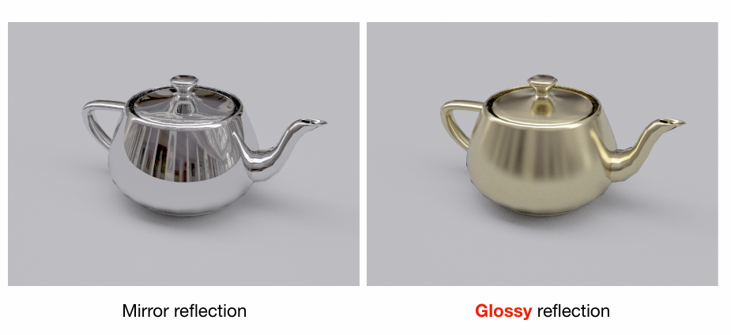
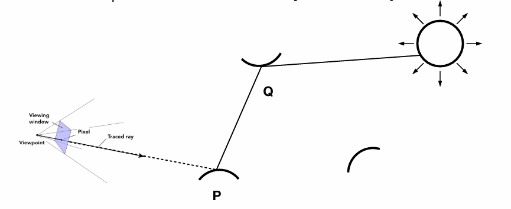
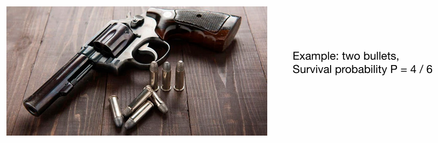
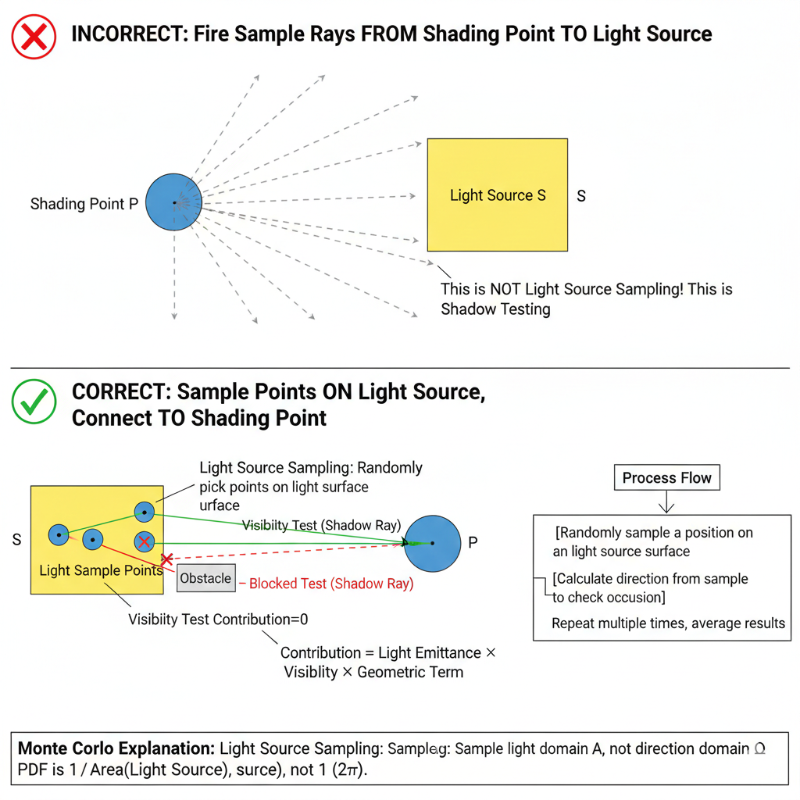
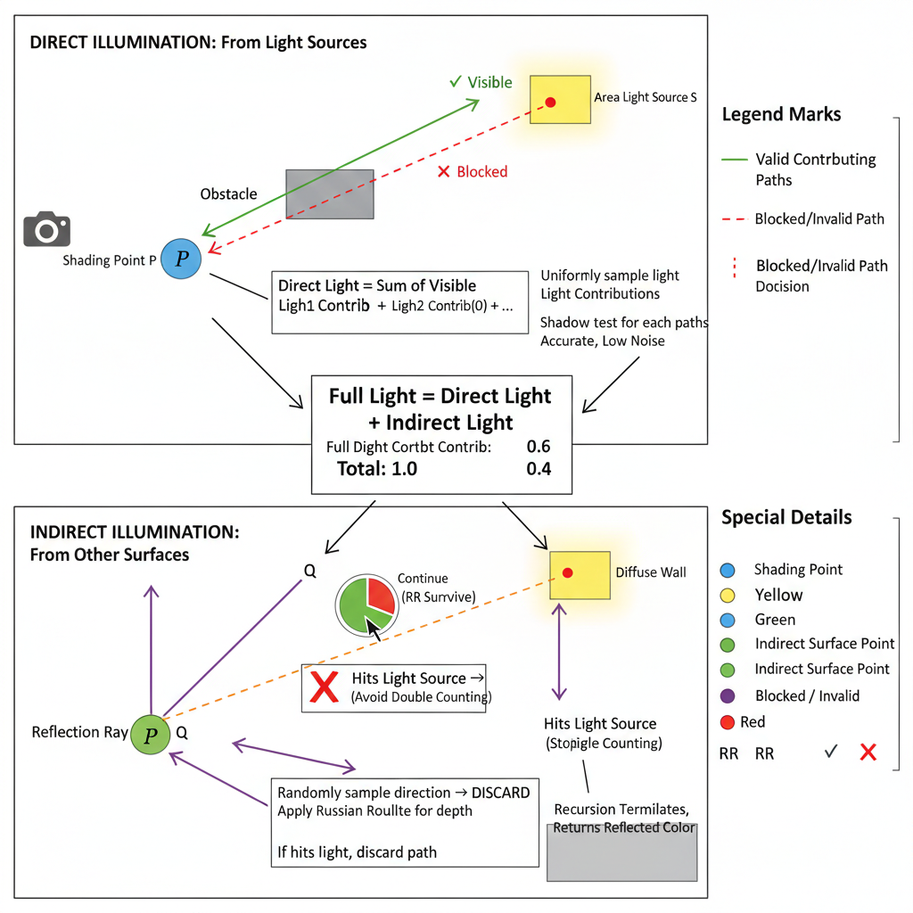
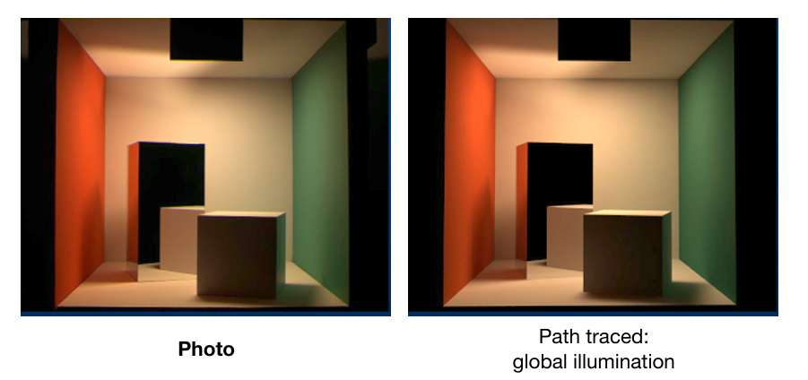

蒙特卡洛积分利用随机采样近似计算复杂积分，其理论基础是概率论。文章介绍了离散与连续随机变量、概率密度函数、期望值以及随机变量函数的概念，并阐述了这些知识在图形学渲染问题中的应用。 

> [!tip]
>
> 在图形学中，我们经常遇到无法算出解析解的积分（比如上一节课的渲染方程，需要对半球面上所有光线积分）。 
>
> **解决思路**：既然算不准，那我就随机取样。 比如我想知道一个广场上所有人的平均身高，我不需要真的去量几万个人的身高（求积分），我只需要随机抓 100 个人量一下（采样），算个平均值（期望），就能大概估算出结果。这就是概率论在渲染中的核心作用。

蒙特卡洛积分是一种基于随机采样的方法，而概率论是它的理论基石。

## 概率论基础

### 随机变量 (Random Variables)

**定义**：随机变量 $X$ 是一个变量，它的值是不确定的，代表了一个随机过程的潜在结果 。

**例子**：掷骰子。$X$ 可能取的值是 $\{1, 2, 3, 4, 5, 6\}$ 。

#### 离散情况 (Discrete Case) —— 以“掷骰子”为例

如果 $X$ 是离散的，它取第 $i$ 个值 $x_i$ 的可能性记为 $p_i$ 。这里的$p_i$有两个硬性条件 ：

1. **非负性**：$p_i \ge 0$（概率不能是负数）。
2. **归一化**：$\sum_{i=1}^{n} p_i = 1$（所有可能性的概率加起来必须等于 1，也就是必然会发生某件事）。

则对于掷骰子来说，每个面朝上的概率是相等的，即 $p_i = 1/6$ 

#### 期望 (Expected Value)

期望可以理解为**平均值**。如果你不断地从分布中抽取样本，最终得到的平均结果就是期望 。
$$
E[X] = \sum_{i=1}^{n} x_i p_i
$$
即：（结果1 $\times$ 概率1）+（结果2 $\times$ 概率2）... 

则在例子掷骰子中会发生这种情况：虽然骰子只有整数点数，但其期望是：
$$
E[X] = 1 \cdot \frac{1}{6} + 2 \cdot \frac{1}{6} + \dots + 6 \cdot \frac{1}{6} = 3.5
$$
虽然你永远掷不出 3.5 这个点数，但“3.5”代表了掷很多次后的平均结果。

### 连续情况 (Continuous Case)

在图形学中，光线的方向、位置等都是连续的，所以我们不能用离散模型，必须进阶到连续模型。

**概率密度函数 (PDF, Probability Density Function)**

对于连续变量 $X$，我们无法说“取某个特定值 $x$ 的概率是多少”（因为特定一点的概率在数学上是 0）。我们用 **概率密度函数 $p(x)$** 来描述在某个值附近的**相对可能性** 。

PDF 必须满足的条件：

1. **非负性**：$p(x) \ge 0$ 。
2. **归一化**：函数曲线下的总面积为 1，即 $\int p(x) dx = 1$ 。

则对于连续变量的期望值，就可以将离散的求和 ($\sum$) 替换为积分 ($\int$)：
$$
E[X] = \int x \cdot p(x) dx
$$

#### 随机变量的函数 (Function of a Random Variable)

这是直接对应渲染方程的关键概念。在渲染中，我们**随机采样的是方向**（$X$），但我们要计算的是**该方向上的光照贡献**（$Y = f(X)$）。

- **概念**：如果 $X$ 是一个随机变量，那么它的函数 $Y = f(X)$ 也是一个随机变量 。

- 如何求期望：

  我们要计算的是函数值 $f(X)$ 的期望，利用 $X$ 的 PDF 即可计算：

$$
E[Y] = E[f(X)] = \int f(x) \cdot p(x) dx
$$

为了方便区分，我们将其换个变量名，写作:
$$
E[g(X)] = \int g(x) p(x) dx
$$
这个公式告诉我们：如果你有一个随机变量 $X$，它的概率密度是 $p(x)$，那么函数 $g(X)$ 的平均值（期望），等于 $g(x) \cdot p(x)$ 的积分。

## 蒙特卡洛法

在渲染方程中，我们得到了一个核心的积分形式：
$$
L_o(p, \omega_o) = L_e(p, \omega_o) + \int_{\Omega} L_i(p, \omega_i) \, f_r(p, \omega_i, \omega_o) \, \cos\theta_i \, d\omega_i
$$
这个方程描述了光线在场景中经过无数次反射、折射后，最终从某点 $p$沿方向 $ω_o$ 出射的辐射亮度。然而，由于场景几何、材质和光照的极端复杂性，这个积分几乎不可能求出解析解。为了求解这类复杂积分，图形学广泛采用基于概率的数值方法——**蒙特卡洛积分**。

### 核心思想与数学表述

蒙特卡洛积分的核心思想是：**用随机采样来逼近积分的值**。对于一个定积分 $\int_a^b f(x)dx$，如果 $f(x)$ 难以直接积分，我们可以在定义域内按照某种概率分布$p(x)$在积分域内随机取 $N$ 个样本 $X_1,X_2,…,X_N$，然后构造一个**无偏估计量**：
$$
F_N = \frac{1}{N} \sum_{i=1}^{N} \frac{f(X_i)}{p(X_i)}
$$
**特性**：采样点越多（$N$ 越大），结果越接近真实值，噪声（方差）越小 。

**直观理解**：我们可以将积分  $\int_f(x)dx$ 视为函数  $f(x)$ 在定义域上的“总和”。如果我们在定义域上“均匀”地采样（即  $p(x)=1/(b-a_i)$ ），那么每个样本  $f(X_i)$ 可以看作是对这个总和的一次随机观测。为了得到积分的“平均值”，我们先将总和除以样本个数 $N$，再乘以定义域的长度  $(b−a)$，这与公式在 $p(x)$ 为均匀分布时的特例一致。而除以 $p(X_i)$的作用，正是对**非均匀采样**进行校正，确保无论样本如何分布，估计的期望值始终等于真实的积分值。

> [!tip]
>
> 这里给一个类比的通俗解释：“广场平均身高问题”：你想知道广场上几万人的平均身高（积分），但你不可能把每个人都量一遍。
>
> **做法**：你闭着眼随机抓 100 个人（采样 $N=100$）。**计算**：把这 100 个人的身高加起来除以 100。
>
> 只要你抓的人够随机、够多，算出来的这个平均值，就约等于全广场人的平均身高。
>
> 关于 $p(x)$：如果你是在“姚明篮球俱乐部”门口抓人（$p(x)$ 不均匀），那你算出来的均值肯定偏高。所以你需要除以 $p(x)$（权重）来修正这个偏差。

### 数学推导：为什么它成立？

蒙特卡洛积分的有效性建立在**期望的线性性质**之上。我们的目标是计算积分：
$$
I = \int f(x) dx
$$
我们引入一个概率密度函数 $p(x)$，满足 $\int_Dp(x)dx=1$ 且在 $f(x)\neq0$处有 $p(x)>0$ 。构造一个新的随机变量：
$$
Y = \frac{f(X)}{p(X)}, \quad X \sim p(x)
$$
计算 $Y$ 的期望值：
$$
\begin{aligned}
E[Y] &= \int_{\mathcal{D}} \frac{f(x)}{p(x)} \cdot p(x) \, dx \\
&= \int_{\mathcal{D}} f(x) \, dx \\
&= I
\end{aligned}
$$
**关键结论**：随机变量 $Y=f(X)/p(X)$ 的数学期望，恰好等于我们想求的积分 $I$ 。根据**大数定律**，当我们独立地抽取 $N$ 个样本 $X_i$，并计算其对应的 $Y_i$的算术平均值时，这个平均值将以概率 $1$ 收敛到其期望值 $I$ 。因此，蒙特卡洛估计量 $FN=N1∑i=1NYi$ 是积分 $I$ 的一个**无偏估计**。

**重要特性**：

1. **无偏性**：估计量 $F_N$的期望值等于真实积分值，即 $E[F_N]=I$ 。这意味着从统计意义上讲，估计没有系统性偏差。
2. **收敛性**：根据大数定律，当样本数 N→∞时，估计值 FN几乎必然收敛到真实值 I。
3. **收敛速率**：蒙特卡洛积分的误差（标准差）以 $O(1/\sqrt{N})$ 的速率下降。这意味着要将误差减少一半，需要大约四倍的样本数。这个收敛速率与积分维度**无关**，使其成为处理高维积分（如渲染方程）的强大工具。
4. **方差与噪声**：估计的**方差**直接影响渲染图像中的噪声大小。方差越大，需要的样本数越多，收敛越慢。**重要性采样** 技术就是通过设计更优的 $p(x)$（使其形状与 $∣f(x)∣$近似），来降低方差，加速收敛。

$$
\text{Var}(F_N) = \frac{1}{N} \text{Var}\left( \frac{f(X)}{p(X)} \right)
$$

### 在渲染中的应用

在路径追踪中，我们使用蒙特卡洛积分来估算渲染方程中的半球积分。对于从着色点 $p$ 出发的射线，我们随机在半球上选择若干方向 $ω_i$来采样入射光，并递归地追踪这些光线。每次采样方向 $ω_i$ 时，我们根据其概率密度 $p(ω_i)$计算贡献值:
$$
\frac{L_i \cdot f_r \cdot \cos\theta_i}{p(\omega_i)}
$$
最后对所有样本的贡献取平均，即可得到出射光亮度 $L_o$的近似值。通过这种方式，复杂的全局光照计算被转化为一系列可控的随机采样与平均过程。

## 从直接光照到全局光照的蒙特卡洛求解

### 直接光照 (Direct Illumination)

考虑最简单的情况：从相机出发的光线打到场景点 $p$ 后，**只计算从该点直接反射到眼睛的光**，不考虑光线在场景中的多次反弹。此时，渲染方程中的入射光 $L_i$仅来自直接可见的光源。

我们将蒙特卡洛积分直接应用于渲染方程的半球面积分：

1. **采样**：在着色点 $p$ 的半球面 $Ω$ 上，按照某种概率密度函数 $p(ω_i)$ 随机选取 $N$ 个入射方向 $\{ \omega_i^{(1)}, \omega_i^{(2)}, \dots, \omega_i^{(N)} \} $ 每个方向 $\omega_i^{(k)}$ 都对应一个从 $p(\omega_i)$ 生成的随机样本。。
2. **估计**：对每个采样方向，计算其贡献并取平均。若采用最简单的**均匀采样**，则概率密度函数为常数 $p(ω_i)=1/(2π)$（半球面立体角总和为 $2π$ ）。于是蒙特卡洛估计量为：

$$
L_o(p, \omega_o) \approx \frac{1}{N} \sum_{k=1}^{N} \frac{L_i(p, \omega_i^{(k)}) \cdot f_r(p, \omega_i^{(k)}, \omega_o) \cdot \cos\theta_i^{(k)}}{1/(2\pi)}
$$

其中，$Li(p,ωi^{(k)})$ 表示沿 ωi(k)方向到达 $p$ 点的入射辐射亮度。只有当该方向的光线**直接击中光源**时，$L_i$才非零（即光源本身的发光强度），否则 $L_i=0$ 。

### 递归计算与“指数爆炸”问题

这种方法虽然能计算直接光照，但效率极低，因为大部分随机方向都“浪费”在了没有光源的空间中。

为了计算全局光照（即光线在物体间多次反弹的效果），逻辑上需要递归计算。当从 $p$ 点采样的光线 $ω_i$ 没有击中光源，而是击中了场景中的另一点 $q$ 时，$q$ 点反射到 $p$ 点的光 $Li(p,ω_i)$ 实际上等于 $q$ 点向 $ω_i$的相反方向出射的光 $L_o(q,−ω_i)$。因此，我们需要递归地计算 $q$ 点的出射光亮度。

如果采用朴素的递归方法，即每次在半球面上采样 $N$个方向来估计积分，会导致计算量呈指数级增长：

- 第 1 次弹射：从相机出发 1 根光线，在交点处采样 $N$ 个新方向 → 产生 $N$ 条次级光线。

- 第 2 次弹射：每条次级光线又采样 $N$ 个方向 → 产生 $N^2$ 条光线。

- 第 3 次弹射：产生 $N^3$条光线。

- …

### Path Tracing 路径追踪

路径追踪巧妙地解决了指数爆炸问题。其核心思想非常简单而深刻：**在每一次相交点计算反射积分时，不再采样 N个方向，而是强制只采样 1个方向**（即 $N=1$ ）。

**具体做法**：

1. 从相机通过像素中心发射一根初始光线（眼睛射线）。
2. 光线与场景相交于点 $p_0$。
3. 为了估计 $p_0$点的反射光，我们在其半球面上随机且仅采样 1 个方向 $ω_{i,1}$ ，并沿此方向发射一条新的光线。
4. 新光线击中下一点 $p_1$，我们再次只采样 1 个方向 $ω_{i,2}$ 继续追踪。
5. 重复此过程，直到光线击中光源、逃逸出场景，或达到预设的最大弹射次数（深度）。这样就生成了一条从相机到光源的**随机光路**。

由于每次弹射只产生 1 条子光线，光路数量始终保持为 1，彻底避免了指数爆炸。整条路径的贡献，由路径上各点的 BRDF、几何项和最终击中的光源亮度共同决定。

> [!tip]
>
> **“侦察兵”类比**
>
> **Whitted-Style**：像是一个将军，遇到分岔路口就派出所有分身去探路。路口越多，分身越多，最后累死。
>
> **Path Tracing**：像是派出 1000 个**独立的侦察兵**（对应一个像素的 SPP）。
> - 每个侦察兵遇到路口，只**随机选一条路**走到底（N=1）。
> - 有的侦察兵找到了宝藏（光源），有的撞了墙。
> - 最后将军听取这 1000 个人的汇报，取个平均值，就得到了最准确的地图。

### 噪声问题与解决方案

然而，N=1带来了一个新问题：**巨大的方差（噪声）**。因为每次积分估计只用一个随机样本来代表整个半球面积分，结果具有强烈的随机性，导致渲染图像噪点极多。

路径追踪的解决方案是：**不在单条路径内部增加样本，而是为每个像素独立生成多条路径，然后取平均**。

### 俄罗斯轮盘赌 (Russian Roulette，RR)

在路径追踪中，每条光线路径理论上应无限递归，模拟真实世界的光线弹射。但在计算机实现中面临根本矛盾：

**困境一：固定深度截断 → 有偏估计**

- 若强制设置最大弹射次数 $K_max$ ，所有超过 $K_max$次弹射的光线贡献被丢弃
- 导致**系统性能损失**（画面整体变暗），因为忽略了高次弹射的能量
- 成为**有偏估计**，即便采样数 $M→∞$，结果仍不收敛于真实值

**困境二：无限递归 → 程序崩溃**

- 允许无限递归理论上正确，但实践中必然导致栈溢出或死循环
- 即使不崩溃，计算时间也趋于无限

俄罗斯轮盘赌（RR）提供了一种**随机但无偏**的解决方案：

对于路径上的每个交点，在执行下一次递归前：

1. 生成一个 $[0,1)$ 区间的均匀随机数 $ξ$ 
2. 预设一个**生存概率** $P_{RR}∈(0,1]$（通常为0.6-0.95）
3. 决策：
   - 若 $ξ<P_{RR}$ ：路径继续传播，但当前贡献值除以 $P_{RR}$
   - 否则：路径终止，返回0贡献

$$
L_{\text{RR}} = 
\begin{cases}
\dfrac{L_{\text{true}}}{P_{\text{RR}}}, & \text{以概率 } P_{\text{RR}} \\
0, & \text{以概率 } 1-P_{\text{RR}}
\end{cases}
$$

其数学期望：
$$
\begin{aligned}
E[L_{\text{RR}}] &= P_{\text{RR}} \times \frac{L_{\text{true}}}{P_{\text{RR}}} + (1-P_{\text{RR}}) \times 0 \\
&= L_{\text{true}}
\end{aligned}
$$
妙处：虽然每条光线的命运是随机的，但从数学期望（平均值）上看，我们没有损失任何能量，结果是无偏的 (Unbiased) 。

> [!tip]
>
> 这里的俄罗斯赌轮盘和深度学习中的MC_Dropout思想几乎一模一样啊哈哈😄其实是同一个公式在不同领域的应用

无论是 Path Tracing 还是 MC Dropout，它们的核心公式都是蒙特卡洛积分公式：
$$
E[f(x)] \approx \frac{1}{N} \sum_{i=1}^{N} f(x_i)
$$
即：**用 $N$ 次随机采样的平均值，来逼近一个复杂的期望值（积分）。**

| **步骤**       | **Path Tracing (图形学)**                                    | **MC Dropout (深度学习)**                                    |
| -------------- | ------------------------------------------------------------ | ------------------------------------------------------------ |
| **问题**       | 场景的光照太复杂，无法直接算出像素颜色。                     | 神经网络的参数分布太复杂（贝叶斯网络），无法直接算出预测分布。 |
| **随机性来源** | **随机光线方向**：每次弹射选不同的路。                       | **随机神经元掩码 (Mask)**：每次前向传播随机关掉不同的神经元。 |
| **单次采样**   | 发射 **1 条光线** (Sample 1 path)，得到一个充满噪点的颜色值。 | 进行 **1 次前向传播** (Forward pass)，得到一个不确定的预测结果。 |
| **多次采样**   | 对同一个像素，发射 **N 条光线** (SPP)。                      | 对同一个输入，进行 **N 次前向传播** (开启 Dropout)。         |
| **最终结果**   | **取平均值**：得到平滑、无噪点的像素颜色。                   | **取平均值**：得到模型对该输入的最终预测（贝叶斯近似）。     |
| **副产品**     | **方差 (Variance)**：表现为画面噪点。方差大说明光照复杂，需要更多采样。 | **方差 (Uncertainty)**：表现为模型的不确定性。方差大说明模型对这个输入“心里没底”。 |

### 对光源采样 

虽然我们现在的算法能得到基本正确的结果，但效率极低，“光线浪费”现象很严重。

如上图所示，我们在半球面上瞎蒙（均匀采样）。如果光源很小（比如天上的星星），随机选方向打中它的概率微乎其微。大量光线因为打不中光源而返回 0，导致画面全是噪点 。

为了解决该问题，提出了一种方法：**直接在光源上采样**。既然我们只想知道“光源有没有照亮这里”，不如直接把采样点移到**光源表面**上。

**对光源采样**（也称为**直接光照采样**或**光源重要性采样**）的核心是：

**从光源表面随机采样点，然后向场景发射光线（或连接采样点与着色点），而不是从着色点向光源发射光线。**

#### 数学变换 

蒙特卡洛积分要求采样域与积分域一致。我们需要将渲染方程从**立体角域**变换到**光源表面积域**。

立体角微分 $dω$ 与光源面积微分 $dA$ 的关系：
$$
d\omega = \frac{dA \cdot \cos\theta'}{\|x - x'\|^2}
$$
其中 $\theta'$ 是光源表面法线 $n'$ 与方向向量 $(x'-x)$ 的夹角，${\|x - x'\|}$ 是着色点 $x$ 到光源点 $x′$ 的距离 。

则渲染方程由：
$$
L_o(x, \omega_o) = \int_{\Omega} L_i(x, \omega_i) f_r(x, \omega_i, \omega_o) \cos\theta_i \, d\omega_i
$$
变换为：
$$
L_o(x, \omega_o) = \int_{A_{\text{light}}} L_e(x') f_r(x, \omega_i, \omega_o) \frac{\cos\theta_i \cos\theta'}{\|x - x'\|^2} \, dA
$$
**物理意义**：

- $L_e(x′)$ ：光源在 x′点的自发光亮度
- $f_r$：着色点P的BRDF
- $cosθ_i$ ：入射光与着色点法线的余弦
- $cosθ′$：出射光与光源法线的余弦
- 分母：距离平方衰减

光源采样变换后，蒙特卡洛估计量仍然保持无偏：
$$
E\left[ \frac{f_r \cos\theta \cos\theta' L_e}{\|x-x'\|^2 \cdot p_{\text{light}}(x')} \right] 
= \int_{A_{\text{light}}} \frac{f_r \cos\theta \cos\theta' L_e}{\|x-x'\|^2} \, dA
$$

最终算法逻辑则是将将光照拆成两部分分别计算 ：
$$
完整光照 = 直接光照 + 间接光照
$$
**直接光照 (Direct Illumination)**：

- **方法**：直接在光源面积上采样（无噪声）。
- **注意**：要发射一条 **Shadow Ray** 检查光源和点之间有没有障碍物 。

**间接光照 (Indirect Illumination)**：

- **方法**：依然对半球采样 + 俄罗斯轮盘赌。
- **注意**：如果射出的光线打到了**光源**，这部分必须**扔掉**（因为直接光照已经在第 1 步算过了，不能重复算

经过了对光源采样，可以看到光线追踪全局光照得到的绘制结果已经非常接近物理光线了。

> [!caution]
>
> 一句话总结一下Path Tracing:
>
> 在每个像素发射多条光线，光线每次弹射只随机走一个方向（N=1），利用俄罗斯轮盘赌决定停止，同时为了减少噪点，我们将直接光照单独拿出来，直接在光源面积上进行采样。