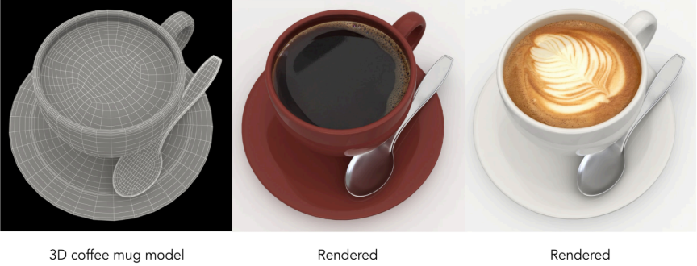
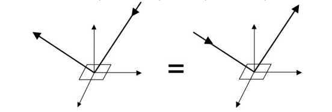
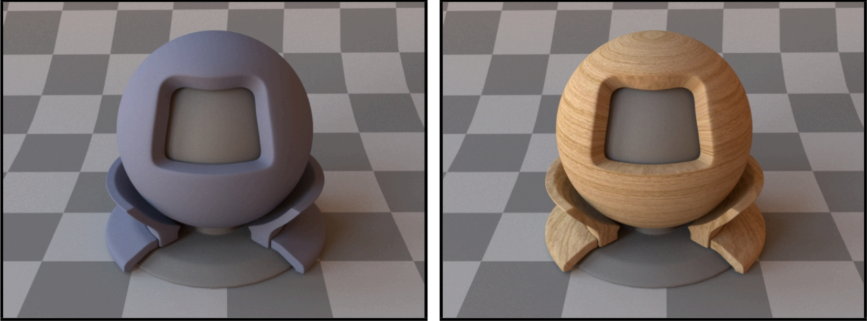
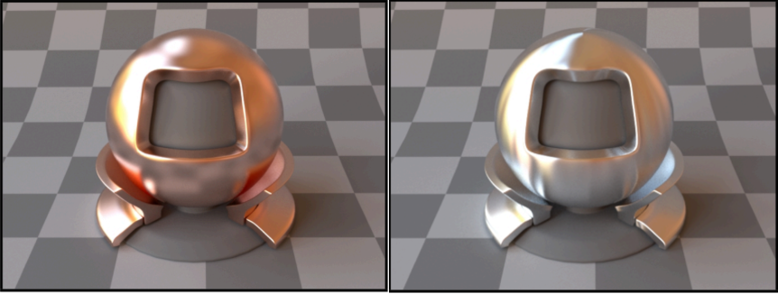
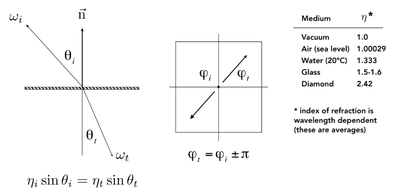
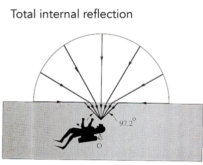
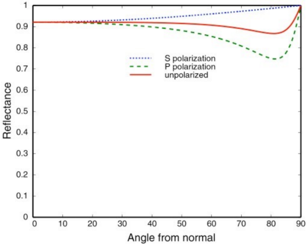
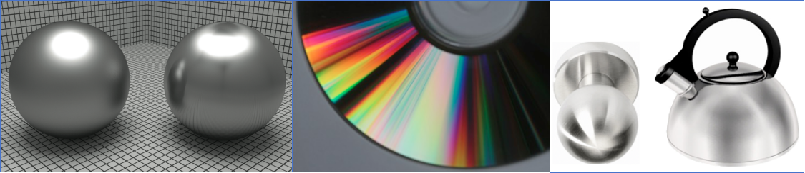

--- 
title: 【Games101】材质与外观
date: 2025-12-11T00:00:00+08:00
mathjax: true
categories: ["Games101笔记"]
tags: ["图形学", "GAMES课程", "材质", "BRDF"]
description: "在计算机图形学中，材料的视觉外观由其与光线的相互作用决定，这通过双向反射分布函数（BRDF）数学模型精确描述。BRDF必须遵循非负性、线性、可逆性和能量守恒等物理定律，以确保渲染的真实性。"
cover: "/img/ComputerGraphics.png"
headerImage: "/img/rthykless.png"
math: true
--- 

在计算机图形学中，材料的视觉外观由其与光线的相互作用决定，这通过双向反射分布函数（BRDF）数学模型精确描述。BRDF必须遵循非负性、线性、可逆性和能量守恒等物理定律，以确保渲染的真实性。 

在计算机图形学中，我们如何定义和区分不同的材料？

例如，一个3D咖啡杯模型，通过赋予不同的表面属性，它可以呈现出陶瓷、金属或塑料的质感。

答案是：**材料的视觉外观完全由其与光线的相互作用方式决定**。这种相互作用在图形学中通过一个称为**BRDF（双向反射分布函数）** 的数学模型来精确描述。因此，一个核心等式被确立：**Material == BRDF**。这意味着，改变一个物体的材质，本质上就是改变它的BRDF。

### BRDF 的物理性质

BRDF（双向反射分布函数）作为一个描述材质物理属性的函数，必须遵循以下几条核心的物理定律。这些性质保证了渲染结果在物理上的真实性和可信度。

**非负性 (Non-negativity)**

这是最基本的性质。因为 BRDF 描述的是光能量的分布比例，而光能量不可能是负数，所以 BRDF 函数的值必须永远大于等于零 。

- 公式：
  $$
  f_{r}(\omega_{i}\rightarrow\omega_{r})\ge0
  $$

**线性 (Linearity)**

材质对光照的反应是线性的。这意味着，如果你有两个光源照亮物体，物体反射的总光线等于这两个光源分别照射时反射光线的总和 。

- **物理意义**：这一性质允许我们将场景中所有光源的影响（通过积分）累加起来，计算出最终的出射辐射亮度（Radiance）。

- 公式：
  $$
  L_{r}(p,\omega_{r})=\int_{H^{2}}f_{r}(p,\omega_{i}\rightarrow\omega_{r})L_{i}(p,\omega_{i})\cos\theta_{i}d\omega_{i}
  $$
  这个积分公式体现了所有入射光 $L_i$ 对出射光 $L_r$ 的线性贡献 。

**可逆性 (Reciprocity Principle)**

这是一条非常有趣的物理性质，也被称为“赫姆霍兹互惠原理”（Helmholtz Reciprocity）。

- **定义**：如果你交换光源入射的方向 ($\omega_i$) 和摄像机观察的方向 ($\omega_r$)，测得的 BRDF 值应该是一模一样的 。
- **通俗解释**：如果你能通过镜子看到对方的眼睛，对方也一定能通过镜子看到你的眼睛。光路是可逆的。

- 公式：
  $$
  f_{r}(\omega_{r}\rightarrow\omega_{i})=f_{r}(\omega_{i}\rightarrow\omega_{r})
  $$

**能量守恒 (Energy Conservation)**

这是物理世界最铁的定律。物体表面只是反射光线，如果不自身发光，它反射出去的总能量绝对不可能超过接收到的总能量 。

- **物理意义**：对于任何一个入射方向，BRDF 在整个半球面上对所有出射方向的积分值必须小于等于 1。

  - 如果等于 1，说明是理想的全反射（如完美的镜子或绝对白的漫反射）。
  - 如果小于 1，说明部分光线被物体吸收并转化为热能了。

- 公式：
  $$
  \forall\omega_{r}\int_{H^{2}}f_{r}(\omega_{i}\rightarrow\omega_{r})\cos\theta_{i}d\omega_{i}\le1
  $$

**各向同性与各向异性 (Isotropic vs. Anisotropic)**

虽然这不是所有 BRDF 必须遵守的限制，但它是区分材质物理特性的重要分类。

- **各向同性 (Isotropic)**：
  - **定义**：表面的微观结构没有方向性。BRDF 的值只取决于入射光和反射光的**相对**方位角差 ($\phi_r - \phi_i$)，而与绝对方位角无关 。
  - **推论**：根据可逆性，各向同性材质的 BRDF 可以进一步简化为只依赖三个变量：入射角 $\theta_i$、出射角 $\theta_r$ 以及它们的相对方位角 $|\phi_r - \phi_i|$ 。
  - **现象**：旋转物体（不改变视角和光照），高光形状不变。
- **各向异性 (Anisotropic)**：
  - **定义**：反射性质随表面的绝对方位角变化。
  - **现象**：如拉丝金属，其微观结构（划痕）有特定方向，导致高光形状随物体旋转而改变。

### 基础材质模型

#### 漫反射材质（兰伯特定律）

这是最简单也是最基础的材质模型。理想漫反射表面将入射光线均匀地散射到所有方向，因此表面不会出现任何镜面高光，看起来非常柔和。粉笔、哑光墙面是典型的例子。

- **光学特性**：光线在微观表面经过多次反射、折射后被均匀散射，出射亮度与观察角度无关。

- **BRDF公式推导**：假设场景光照均匀，可以推导出出射辐亮度 Lo与入射辐亮度 Li的关系： 

$$
L_{o}(\omega_{o})=\int_{H^{2}}f_{r}L_{i}(\omega_{i})\cos\theta_{i}d\omega_{i}=f_{r}L_{i}\int_{H^{2}}\cos\theta_{i}d\omega_{i}=\pi f_{r}L_{i}
$$

- 为了使材质反射的能量守恒（即反射光不超过入射光），BRDF被定义为:

$$
f_r = \frac{\rho}{\pi}
$$

其中，**ρ称为反照率**，它是一个介于0到1之间的值（或三维向量），决定了材质的基色。通过使用纹理贴图来定义每个点的 ρ，我们就可以实现丰富多彩的漫反射纹理表面。

#### 光泽材质与理想镜面反射/折射

**光泽材质**（如抛光铜、铝）的 BRDF 特性介于漫反射和理想镜面之间 。它们的光线反射具有方向性，会在镜面反射方向周围形成一个较宽的高光瓣（Lobe），这通常是因为表面微观上不够平整导致的 。

理想镜面反射/折射材质则涉及更精确的物理现象，通常用 BSDF 来描述 。

- **镜面反射 (Specular Reflection)**：遵循“入射角等于反射角”的定律（$\theta_o = \theta_i$）。其反射方向 $\omega_o$ 可由入射方向 $\omega_i$ 和法线 $\vec{n}$ 精确计算得出 ：

$$
\omega_{o}=-\omega_{i}+2(\omega_{i}\cdot\vec{n})\vec{n}
$$

- **折射 (Refraction)**：光线穿过不同介质界面（如空气进入水或玻璃）时会发生弯曲，遵循斯涅尔定律（Snell's Law）：
  $$
  \eta_{i}\sin\theta_{i}=\eta_{t}\sin\theta_{t}
  $$
  其中 $\eta$ 是物质的折射率（IOR），例如水约为1.33，玻璃约为1.5 。

  

- **全内反射 (Total Internal Reflection)**：一个关键的光学现象。当光从光密介质（折射率高）射向光疏介质（折射率低），即 $\frac{\eta_{i}}{\eta_{t}}>1$ 时，如果入射角足够大，光线将无法折射出去，而是全部反射回原介质 。这一现象解释了水下观察水面时为何会出现像镜子一样的“斯涅尔窗”边缘 。

### 菲涅尔效应 (Fresnel Term)

在现实世界中，物体的反射率并不是一个固定的常数，它会随着**视线与表面的夹角**发生剧烈变化。

- **垂直观察**：当你垂直看向物体表面时（如低头看脚下的水面），反射通常较弱，你会更多地看到折射进去的光（水底的石头）。
- **掠射角观察 (Grazing Angle)**：当你视线几乎与表面平行时（如看向远处的湖面），水面会变得像镜子一样，反射率急剧增加甚至接近 100% 。

**不同材质的表现**：

- **绝缘体 (Dielectrics)**：如玻璃、塑料、水。在垂直入射时反射率很低（通常约 4%），大部分光线发生折射；但在掠射角，反射率会迅速上升至 1.0 。

- **导体/金属 (Conductors)**：如金、铜、铝。金属原本的反射率就很高（60%-90%），并且带有颜色（如金色的反射）。在掠射角，它们的反射率也会最终达到 1.0 。

- 计算公式 (Schlick's Approximation)：

  精确的菲涅尔方程计算非常复杂且依赖于光的偏振 。在图形学实践中，我们通常使用 Schlick 近似 来高效模拟这一现象 ：
  $$
  R(\theta)=R_{0}+(1-R_{0})(1-\cos\theta)^{5}
  $$

  - $R_0$：基础反射率（垂直入射时的反射率），对于水或玻璃等绝缘体，它是通过折射率计算得出的 。
  - $\theta$：视线与法线的夹角。

### 微表面模型 (Microfacet Material)

这是基于物理的渲染 (PBR) 的理论核心。它解释了为什么有的表面看起来粗糙，有的看起来光滑，以及“高光”究竟是怎么形成的。

> 核心理论：宏观上平坦的表面，在微观层面上其实是凹凸不平的。

我们假设表面由无数个微小的、像镜子一样的**微平面 (Microfacets)** 组成 。

- 每个微平面都遵循完美的镜面反射定律，拥有自己的法线方向 。

- 粗糙度与高光：

材质的“粗糙度”本质上就是微平面法线的统计分布 。

- **光滑表面 (Glossy)**：微平面的法线非常集中，大部分都朝向同一个方向。因此光线反射方向一致，形成锐利、明亮的高光。
- **粗糙表面 (Diffuse)**：微平面乱七八糟地朝向各个方向（Spread）。光线被反射到四面八方，视觉上高光就“糊”开了，甚至变成了漫反射。

微表面 BRDF 公式：

基于微表面理论，BRDF 被定义为以下三个核心项的乘积 ：
$$
f(i,o)=\frac{F(i,h)G(i,o,h)D(h)}{4(n \cdot i)(n \cdot o)}
$$
**F (Fresnel Term)**：**菲涅尔项**。决定了光线撞击到微平面上时，有多少能量被反射，有多少被折射（吸收）。

**D (Normal Distribution Function, NDF)**：**法线分布函数**。这是决定高光形状的关键。它统计了有多少微平面的法线正好指向“半程向量 $h$”的方向（即正好能把光从入射方向 $i$ 反射到观察方向 $o$）。

**G (Geometry Term / Shadowing-Masking)**：**几何遮挡项**。在粗糙表面上，微平面之间会发生相互遮挡。

- **Shadowing**：光线还没照到微平面就被挡住了。
- **Masking**：光线反射出来后，被前面的微平面挡住了。
- 这一项在掠射角特别重要，防止边缘过亮。

微表面材质部分还有一个特殊的类型，就是纤维材质、

如上图所示，表面带有毛发的材质可能会随着人的摆弄而产生不同的光学性质，这部分的建模比较复杂，留到下节课进行讨论。

### 材质的方向性：各向同性 vs 各向异性

如上图所示，生活中，我们常常观察到有金属关泽的茶壶和发出彩色光泽的光盘，这些物体的高光既像是镜面反射，又与完全镜面反射有一定的区别，其主要原因是因为其材质具有方向性。

**各向同性 (Isotropic)**： 表面的微观结构没有特定方向。无论你如何旋转物体（保持视角不变），反射的高光形状和强度基本不变 。大部分常见的塑料、陶瓷属于此类。

各向同性（Isotropic）的定义公式：
$$
f_{r}(\theta_{i},\phi_{i};\theta_{r},\phi_{r})=f_{r}(\theta_{i},\theta_{r},\phi_{r}-\phi_{i})
$$
对于绝大多数普通材质（各向同性），BRDF 的值只取决于 $\phi_r - \phi_i$（相对方位角）。这意味着只要相对角度不变，旋转物体不会改变反射外观。进一步推导可得：$f_{r}(\theta_{i},\theta_{r},|\phi_{r}-\phi_{i}|)$ 。

**各向异性 (Anisotropic)**： 表面的微观结构具有方向性（例如有平行的划痕或纤维）。当你旋转物体时，高光的形状会随之改变 。

- **典型例子**：**拉丝金属**（Brushed Metal）、尼龙、天鹅绒 。
- **视觉特征**：拉丝金属的高光通常会被拉伸成条状，且方向垂直于纹理的划痕方向 。

各向异性（Anisotropic）的定义公式：
$$
f_{r}(\theta_{i},\phi_{i};\theta_{r},\phi_{r})\ne f_{r}(\theta_{i},\theta_{r},\phi_{r}-\phi_{i})
$$
这个不等式意味着：**反射不仅取决于入射光和反射光之间的相对角度，还取决于它们在表面上的绝对“方位角”（Azimuthal Angle）**。换句话说，如果你保持视线和光源不动，仅仅在平面上旋转物体，各向异性材质的反射效果（BRDF值）是**会发生改变**的。