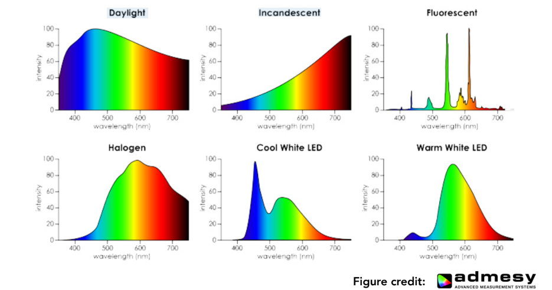
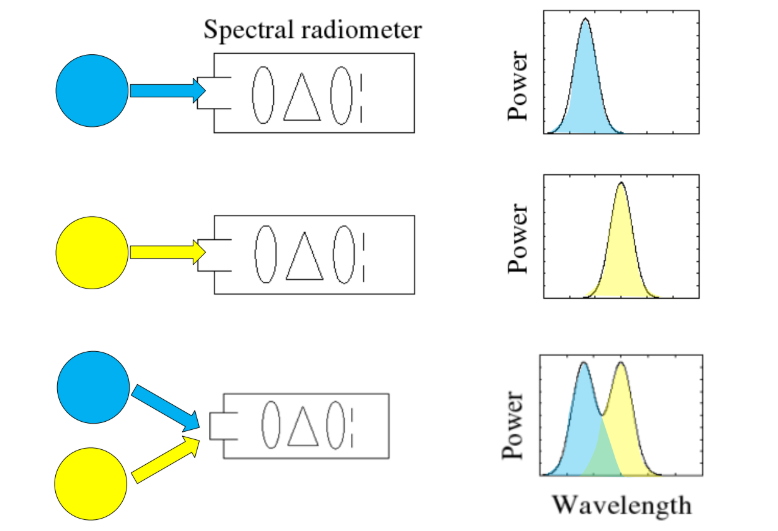
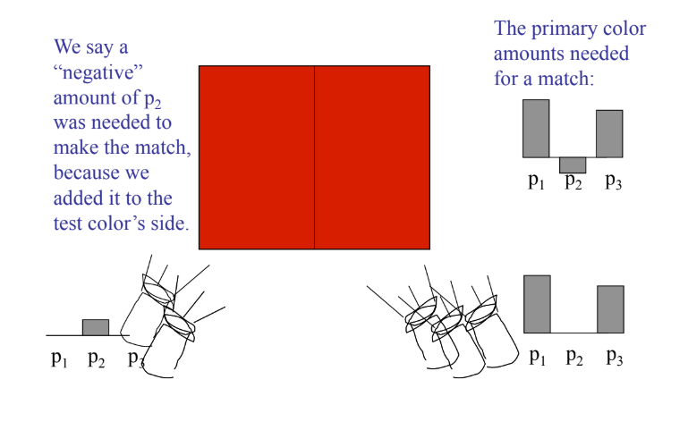

颜色是光线与感光系统互动的结果。人眼通过三种视锥细胞将连续光谱转换为三个神经信号，这解释了为何三原色能模拟色彩，并产生了同色异谱现象。 

##  光谱分布 (SPD)

在理解计算机如何模拟颜色之前，必须澄清一个根本的物理事实：**颜色并非物体固有的属性，而是光线与特定感光系统（如人眼、相机传感器）相互作用的产物**。一个物体之所以呈现红色，并非因为它“是”红色，而是因为它吸收了可见光中除红光波段外的其他光线，并将红光反射到了我们的眼睛中。

**可见光谱 (Visible Spectrum)**：决定我们看到何种颜色的关键，是光的**可见光谱**。这是电磁波谱中波长介于 **400纳米（紫光）到 700纳米（红光）** 之间的一段。波长低于400nm的紫外线、高于700nm的红外线，人眼都无法直接感知。因此，在绝大多数游戏、影视渲染等视觉应用中，我们仅需模拟和计算这一狭小波长范围内的光线行为，这极大地简化了问题。

**光谱功率分布 (SPD)：**为了精确描述一束光的颜色构成，我们使用**光谱功率分布（Spectral Power Distribution, SPD）** 这一核心物理量。SPD 描述了光在**每个波长（λ）上携带的能量（或功率）**。

它可以看作是一个函数：横坐标是波长 λ，纵坐标是该波长上的辐射能量。一束纯净的单色激光的 SPD 是一个尖锐的尖峰，而日常的太阳光或白炽灯光则是在整个可见光谱上都有广泛分布。SPD 是定义一种光最基础、最完整的物理方式。

> [!tip]
>
> SPD 就像是光的“成分配方表”。日光的配方比较均匀，而白炽灯的配方里“长波（红色）”比例更高 。

**光线还具有线性性质**：不同光线的能量（其 SPD）是**线性可叠加**的。

当两束或多束光交汇时，它们在空间任意一点上产生的总效果，就是各自 SPD 在该点的直接向量加法。这一原理是全局光照、多光源渲染、以及所有基于线性方程的光照模型（如辐射度、路径追踪）能够成立并正确计算的物理基础。正是基于这种线性叠加性，我们才能将复杂的光照场景分解为多个独立光源的贡献，分别计算后再合成最终图像。

 ## 生物过滤网：大脑收到的三路信号

虽然自然界中的光在物理上拥有连续且近乎无限维的光谱分布，但人类之所以能用有限的“三原色”模拟和感知丰富的色彩世界，其根本原因在于我们视觉系统的生物学构造本身就是一个强大的“三通道生物滤波器”。

人眼包含两种功能不同的感光细胞：**视杆细胞** 负责在极暗环境下感知明暗，提供单色的夜视能力，但无法分辨颜色；而**视锥细胞** 则是在正常光照下产生色觉的主力。

决定我们颜色视觉的关键在于，视锥细胞并非只有一种，而是主要分为三种，它们各自对不同波长的光具有最高的敏感度，但响应范围有所重叠：

- **S-视锥细胞**：对短波长（约 400-500nm，蓝色波段）最为敏感。
- **M-视锥细胞**：对中波长（约 450-630nm，绿色波段）最为敏感。
- **L-视锥细胞**：对长波长（约 500-700nm，红色波段）最为敏感。

当我们观察一种光时，其完整的光谱功率分布 s(λ)并不会被大脑直接接收。相反，光首先经过这三种视锥细胞“过滤”。每种细胞的响应强度，并非简单地取决于其最敏感波长的能量，而是其自身的光谱敏感度曲线 r(λ)与入射光谱 s(λ)在整个可见光范围内的**积分结果**。即，大脑最终收到的信号是三个标量值：
$$
S = \int r_S(\lambda)s(\lambda)d\lambda
$$

$$
M = \int r_M(\lambda)s(\lambda)d\lambda
$$

$$
L = \int r_L(\lambda)s(\lambda)d\lambda
$$

**这一生物学过程构成了三原色理论的生理学基础。** 这意味着，无论自然界中光的物理光谱多么千变万化（是连续、无穷维的函数），进入人类视觉系统后，都被“压缩”或“编码”成了仅仅三个数值 (S,M,L)。因此，只要我们能找到三种特定的基础光源（即“三原色”），并通过调节它们的强度比例混合出某种光，使得这种混合光在三种视锥细胞中激发的 (S,M,L)响应与目标自然光相同，那么在人眼看来，这两种物理光谱完全不同的光，其颜色就是**完全一样**的。

## 同色异谱 (Metamerism)

**同色异谱** 是颜色科学和图形学中一个极其精妙的现象，也是现代显示技术能够成功“欺骗”人眼的生理学基础。它描述了一种特殊情况：**两种在物理光谱构成上完全不同的光，却能给人眼带来完全相同的颜色感知。**

其数学原理直接源于人眼三色视觉的生物模型。假设有两种光，它们拥有不同的光谱功率分布 s1(λ)和 s2(λ)。当它们分别经过人眼的三种视锥细胞的敏感度曲线 rS(λ),rM(λ),rL(λ)进行“滤波”和积分后，如果产生的三刺激值 (S,M,L)完全相同，即：
$$
∫rS​(λ)s1​(λ)dλ=∫rS​(λ)s2​(λ)dλ
$$

$$
∫rM	​(λ)s1​(λ)dλ=∫rM​(λ)s2​(λ)dλ
$$

$$
∫rL	​(λ)s1	​(λ)dλ=∫rL	​(λ)s2	​(λ)dλ
$$

那么，尽管 $s1(λ)!=s2(λ)$，但是我们的大脑无法区分它们，会认为我们看到的是同一种颜色。

例如，显示器上的“白色”是由红、绿、蓝三个像素点以特定强度混合发出的光，其光谱是三个狭窄的尖峰。而自然界的日光是一种近乎连续的全光谱白光。这两种光的物理光谱分布天差地别，但通过精心设计的红、绿、蓝三原色强度配比，显示器可以模拟出与日光相同的 (S,M,L)三刺激值，从而让人眼产生“看到了日光”的错觉。因此，显示器不需要、也不可能复刻太阳的完整光谱，它只需巧妙地利用同色异谱效应，通过有限的三种光“凑”出相同的生物神经信号即可。

## 数学标准：从 RGB 到 XYZ

### RGB 色彩匹配实验

为了将颜色感知量化，科学家设计了经典的**色彩匹配实验**。

实验让观察者使用三束特定波长的单色光（通常为红、绿、蓝）进行混合，尝试匹配目标波长的单色光。

实验发现，大多数颜色可以通过调整三原色的比例来匹配，但某些颜色（如某些纯青色）无法通过简单相加获得。为了达到视觉匹配，有时必须将一部分红光**加到目标光一侧**，这在数学上相当于给红光赋予了**负的权重**。这说明，基于真实物理三原色的颜色系统在数学上存在负值，不利于计算和标准化。

### CIE XYZ 空间：万能坐标 

为了消除负值并建立一个普适、标准的颜色表示系统，国际照明委员会（CIE）在1931年定义了三个**虚构的原色 X、Y、Z**，对应三条经过精心设计的**颜色匹配函数**。这个系统的设计目标明确：

1. **Y 表示亮度**：Y 通道被设计为与人类的明度感知直接对应，专门用于表示明暗程度。
2. **无负值**：所有可见光谱色在 XYZ 空间中的坐标值均为非负，消除了计算中的负权重问题。
3. **全覆盖**：X、Y、Z 构成的色域完全覆盖了所有人类可见的颜色。

由此，任何物理光谱都可以通过颜色匹配函数积分，转换为唯一的 XYZ 三刺激值，构成了颜色科学与工业的绝对基准。

### 色度图与色域

为了直观地研究颜色本身（排除亮度影响），我们通过归一化得到**色度坐标**：
$$
x = \frac{X}{X+Y+Z}, y = \frac{Y}{X+Y+Z}
$$
以 (x,y)为坐标绘制的图形，就是著名的 **CIE 1931 色度图**，其形状类似马蹄形（或舌形）。马蹄形边界线代表最纯净的单色光（光谱轨迹），内部是所有可能的可见颜色。

任何实际的显示设备（如显示器、打印机）都无法再现所有可见颜色，其能再现的颜色范围称为**色域**。在色度图中，一个设备的色域通常表示为一个三角形（如 sRGB、Adobe RGB、DCI-P3），三角形的顶点对应该设备三原色的色度坐标。三角形面积越大，代表该设备的色域越广，能显示的颜色越丰富。

## 感知均匀的颜色空间

### HSV/HSB 空间

HSV（色相、饱和度、明度）是面向艺术家和设计师的直观颜色模型。它将颜色组织为：

- **色调 (Hue)**：围绕色相环的角度，表示“是什么颜色”（红、黄、绿等）。
- **饱和度 (Saturation)**：从中心（灰色）到边缘（纯色）的径向距离，表示颜色的鲜艳程度。
- **明度 (Value/Brightness)**：从黑到白的轴向位置，表示颜色的明暗。 这种模型更符合人类对颜色的直观描述习惯，便于进行选色和色彩调整。

### CIELAB 空间

虽然 XYZ 空间是标准，但它并非**感知均匀**的——即图中两点间的几何距离，并不对应人眼感知到的颜色差异大小。为了解决这个问题，CIE 推出了 **CIELAB (L\*a\*b*)** 颜色空间。

- **L\***：明度轴，从 0（黑）到 100（白）。
- **a\***：红-绿对立轴：正值偏红，负值偏绿。
- **b\***：黄-蓝对立轴：正值偏黄，负值偏蓝。 CIELAB 在设计上力求做到，在空间中任意方向上相等的几何距离，对应大致相等的视觉感知差异，因此在色彩管理、色彩差异评估等领域至关重要。

CIELAB 在设计上力求做到，在空间中任意方向上相等的几何距离，对应大致相等的视觉感知差异，因此在色彩管理、色彩差异评估等领域至关重要

### 拮抗色理论与“红绿色”的不可能性

CIELAB 的设计背后，有深刻的生理学基础——**拮抗色理论**。该理论认为，人脑并非独立处理红、绿、蓝信号，而是将其编码为三组**对立通道**：红-绿、蓝-黄、黑-白（明度）。

这解释了为什么我们无法想象或感知到“红绿色”或“蓝黄色”。因为红色和绿色处于同一根神经编码轴的两端，一个颜色信号只能在此轴上表现为偏红或偏绿，或处于中间的某种平衡（如黄或灰），但不能同时向两个极端偏移。就像一个物体不能同时处于“极大”和“极小”的状态。这种拮抗处理是视觉系统提高效率、增强对比的重要方式，也决定了我们感知和描述颜色的根本框架。