NLP 技术从传统统计方法演进至神经网络，Word Embeddings、RNN/LSTM 等模型逐步发展。Transformer 凭借自注意力机制实现突破，成为里程碑，并催生了 BERT、GPT 等变革性模型。 

### 博文背景

之前在学习大模型相关技术的时候，看了很多篇对 Transfomer 解释的博客，但是感觉总是理解不透彻，不久之后就忘掉了，打算自己整理输出一下，以便更好的理解。

### Transformer 的来源

2017 年，Google 团队在论文《**Attention Is All You Need**》中提出 Transformer，它完全摒弃递归结构，引入 **自注意力机制**（Self-Attention），实现了全局上下文感知与并行计算的平衡，成为 NLP 乃至深度学习领域的里程碑。**Transformer** 是 NLP 技术的一次革命性突破。与 RNN 和 LSTM 不同，Transformer 摒弃了序列数据的顺序处理方式，转而采用 **自注意力机制**（Self-Attention），使得每个单词都能够直接与其它所有单词进行交互，从而提高了计算效率，并能捕捉更复杂的依赖关系。

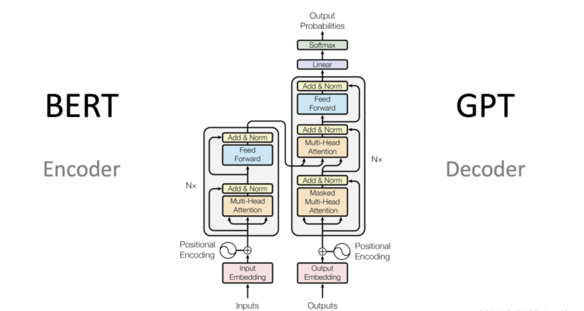

#### BERT

**BERT**（Bidirectional Encoder Representations from Transformers）是基于 Transformer 的预训练模型，通过在大规模文本上进行双向预训练，BERT 能够更好地理解文本的上下文信息。BERT 的出现彻底改变了 NLP 模型的训练方法，许多 NLP 任务通过 **迁移学习**，即先在大规模语料上预训练，再在具体任务上微调，取得了显著的效果提升。

#### GPT

**GPT**（Generative Pre-trained Transformer)系列是由 OpenAI 提出的基于 Transformer 架构的生成模型。与 BERT 的“编码器”结构不同，GPT 采用了“解码器”结构，专注于生成任务，如文本生成、翻译、问答等。

随着模型规模的不断增大，NLP 领域进入了 **大模型时代**。例如，GPT-3 有 1750 亿个参数，BERT 的规模也达到了数百亿级别。预训练模型通过在大规模数据集上的训练，能够捕捉到丰富的语言知识，然后在特定任务上进行微调，显著提高了许多 NLP 任务的效果。

# Transfomer 是什么

直接给一个大模型给出的定义：

>**Transformer 是一种用于自然语言处理（NLP）和其他序列到序列（sequence-to-sequence）任务的深度学习模型架构**，它在 2017 年由 Vaswani 等人首次提出。Transformer 架构引入了自注意力机制（self-attention mechanism），这是一个关键的创新，使其在处理序列数据时表现出色。
>**以下是 Transformer 的一些重要组成部分和特点：**
>
>**自注意力机制**（Self-Attention）：这是 Transformer 的核心概念之一，它使模型能够同时考虑输入序列中的所有位置，而不是像循环神经网络（RNN）或卷积神经网络（CNN）一样逐步处理。自注意力机制允许模型根据输入序列中的不同部分来赋予不同的注意权重，从而更好地捕捉语义关系。
>**多头注意力**（Multi-Head Attention）：Transformer 中的自注意力机制被扩展为多个注意力头，每个头可以学习不同的注意权重，以更好地捕捉不同类型的关系。多头注意力允许模型并行处理不同的信息子空间。
>**堆叠层**（Stacked Layers）：Transformer 通常由多个相同的编码器和解码器层堆叠而成。这些堆叠的层有助于模型学习复杂的特征表示和语义。
>**位置编码**（Positional Encoding）：由于 Transformer 没有内置的序列位置信息，它需要额外的位置编码来表达输入序列中单词的位置顺序。
>**残差连接和层归一化**（Residual Connections and Layer Normalization）：这些技术有助于减轻训练过程中的梯度消失和爆炸问题，使模型更容易训练。
>**编码器和解码器**：Transformer 通常包括一个编码器用于处理输入序列和一个解码器用于生成输出序列，这使其适用于序列到序列的任务，如机器翻译。

## 自顶向下理解 Transformer 架构

### Seq2Seq 任务

在深入 Transformer 之前，我们首先需要理解它要解决的核心问题——**Seq2Seq（Sequence-to-Sequence）任务**。

#### 什么是 Seq2Seq？

Seq2Seq 是指将一个输入序列映射到另一个输出序列的任务。这类任务在 NLP 中极为常见：

| 任务类型 | 输入序列 | 输出序列 |
|---------|---------|---------|
| **机器翻译** | "我爱你" | "I love you" |
| **文本摘要** | 一篇长文 | 几句摘要 |
| **问答系统** | "Transformer 的核心是什么？" | "自注意力机制" |
| **对话生成** | 用户问题 | 机器回复 |

#### Seq2Seq 的发展历程

在 Transformer 出现之前，解决 Seq2Seq 任务的主流架构经历了三个阶段：

**第一阶段：RNN Encoder-Decoder**

```
输入: "我 爱 学 习"
      ↓  ↓  ↓  ↓
    [RNN Encoder]
      ↓
  Context Vector (固定长度)
      ↓
    [RNN Decoder]
      ↓  ↓  ↓  ↓
输出: "I l o v e   l e a r n i n g"
```

**问题：**
- **固定长度瓶颈**：无论输入多长，都压缩成一个固定大小的向量，信息必然丢失
- **无法并行**：RNN 必须按顺序处理，无法充分利用 GPU
- **长距离依赖弱**：输入开头的信息传到输出时已经 "遗忘" 了

**第二阶段：引入 Attention 机制**

```
输入: "我 爱 学 习"
      ↓  ↓  ↓  ↓
    [RNN Encoder]
      ↓
  Context Vectors (每个词都有一个)
      ↓
    [RNN Decoder]
      ↓
输出: "I l o v e   l e a r n i n g"
      ↑
   Attention查询编码器的Context
```

**改进：** 解码器在生成每个词时，可以 "回头看" 输入的所有词，通过注意力权重选择关注哪些输入。

**第三阶段：Transformer 的彻底革命**

Transformer 完全抛弃了 RNN 结构：
- **纯注意力**：用自注意力机制替代循环结构
- **完全并行**：整个序列可以一次性输入，所有位置同时计算
- **全局依赖**：任何两个词之间的距离都是 1，完美解决长距离依赖问题

这就是 Transformer 被称为 "里程碑" 的原因——它不只是改进，而是重新定义了序列建模的范式。

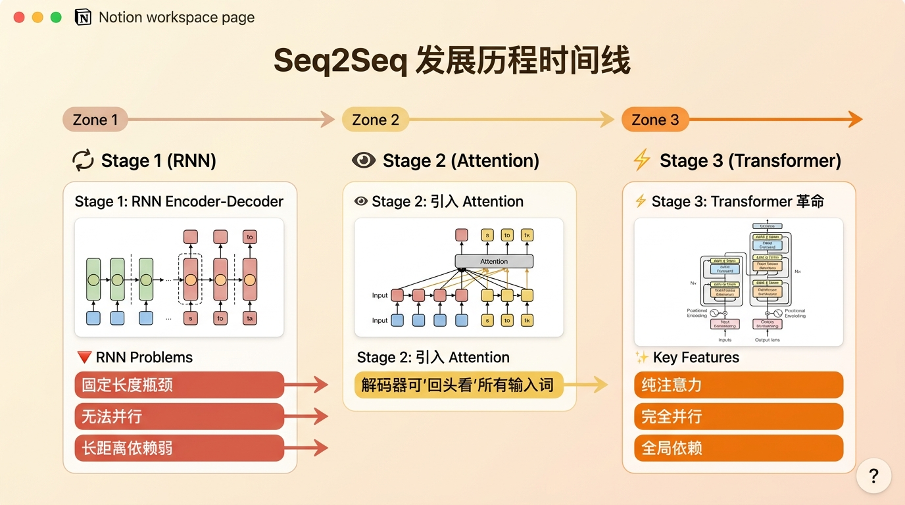

### 从整体上理解 Transformer

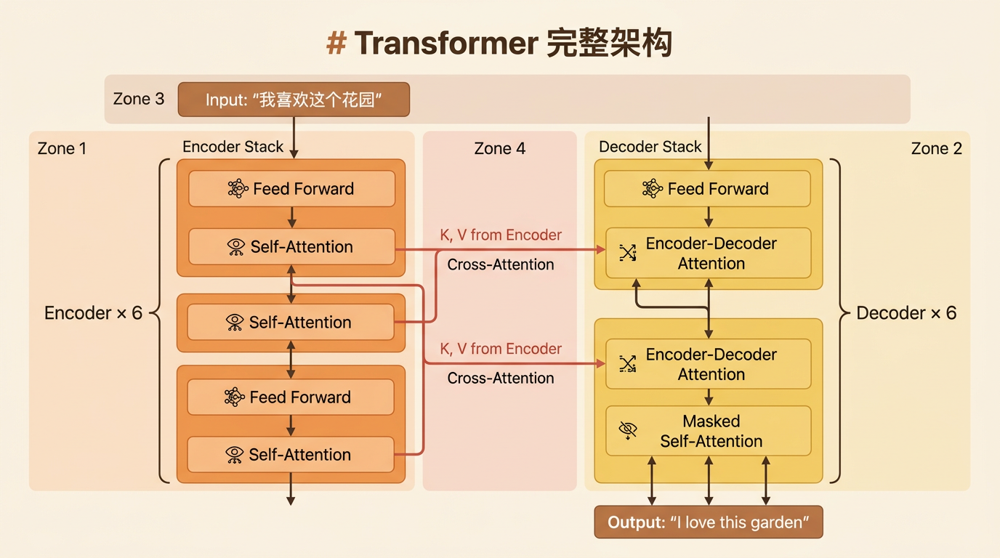

假定当前我们有这样一个 Transformer 模型的应用场景：

> 使用机器翻译将一句西语翻译为应用：

对该 Transformer 模型进行进行分解，就会找到一个编码组件、一个解码组件以及它们之间的连接。

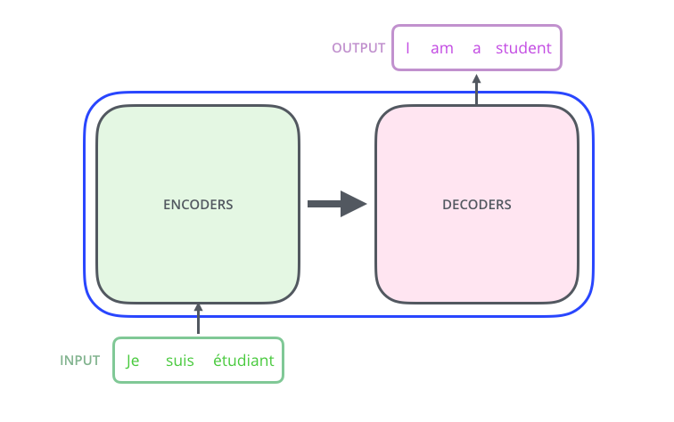

编码组件和解码组件一般都是由一堆的解码器和编码器构成的，且他们之间的数量一般是相同的。

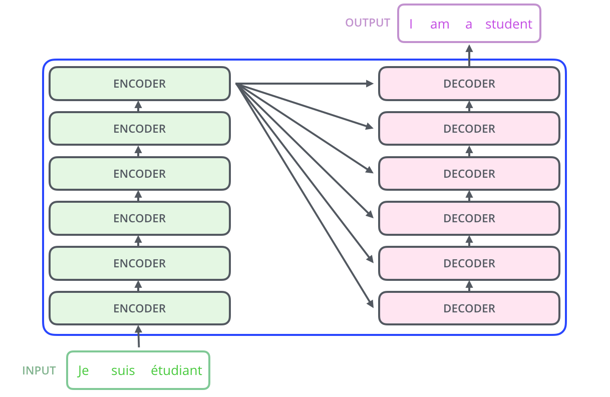

继续分解编码器：每个解码器的结构是完全相同的，不过他们的权重不同，每个解码器分为两个子层，一个注意力层，一个前馈神经网络层。

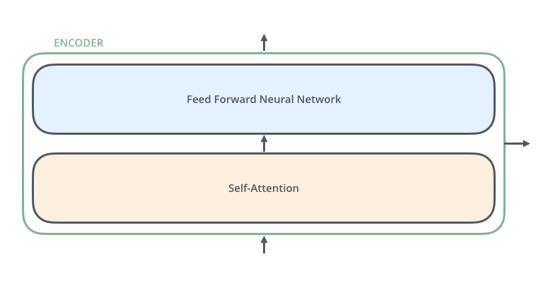

编码器的输入首先流经自注意力层(self-attention) - 该层可帮助编码器在编码特定单词时查看输入句子中的其他单词。后面将详细阐述自注意力机制。

自注意力层的输出被馈送到前馈神经网络(Feed Forward)。完全相同的前馈网络独立应用于每个位置。

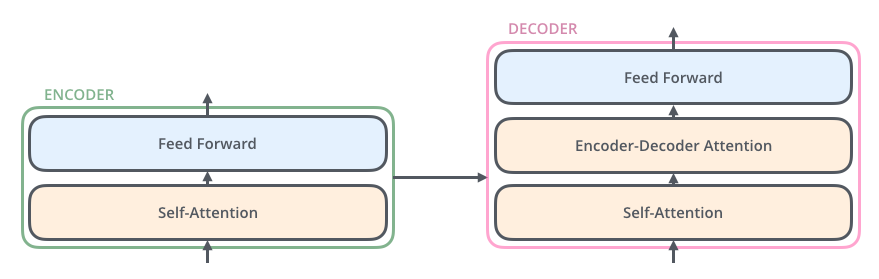

解码器也具有这两个层，但是他们之间还有一个解码注意力层，可以帮助解码器关注输入句子的相关部分（这里我并不是特别理解）。

### 将张量引入架构

现在我们已经了解了模型的主要组成部分，让我们开始看看各种向量/张量以及它们如何在这些组成部分之间流动，从而将训练模型的输入转化为输出。

与常规的 NLP 模型一样，Transformer 模型也会先尝试让机器读懂自然语言--即使用嵌入算法将每个书输入词转化为向量。

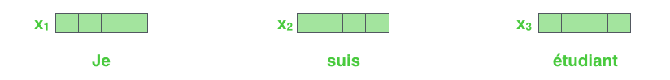

嵌入仅发生在最底层的编码器中。所有编码器的共同抽象是它们接收一个向量列表，每个向量的大小为 512 。 在底层编码器中，这将是单词嵌入，但在其他编码器中，它将是直接位于下方的编码器的输出。此列表的大小是我们可以设置的超参数 – 基本上它将是我们训练数据集中最长句子的长度。

> [!TIP]
>
> 此处也没有看很懂，后续查阅理解一下

将单词嵌入到输入序列之后，每个单词都会流经编码器的两层中的每一层。

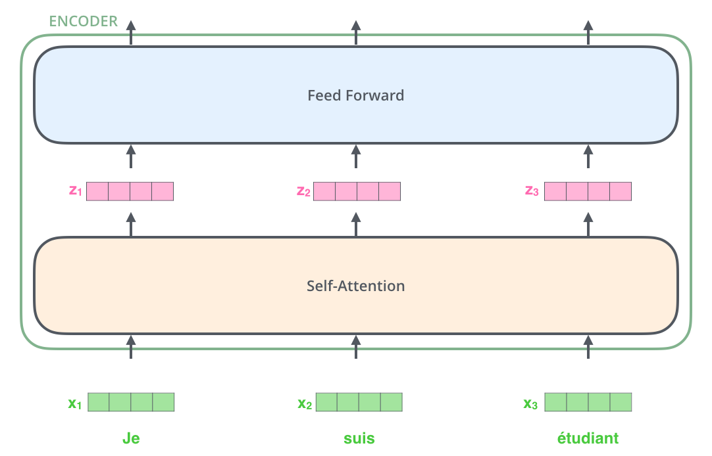

这里我们开始看到 Transformer 的一个关键特性，即 **每个位置上的单词在编码器中流经自己的路径。在自注意力层中，这些路径之间存在依赖关系。然而，前馈层没有这些依赖关系，因此各种路径可以在流经前馈层时并行执行。**

### 自注意力机制

假定下面是一个机器翻译应用中要翻译的句子：

> “ The animal didn't cross the street because it was too tired”

这句话中的”它”指的是什么？它指的是街道还是动物？对于人类来说，这是一个简单的问题，但对于算法来说却不那么简单。

自注意力机制的作用就是当模型处理 `it` 这个词时，让模型将 `it` 与 `animal` 联系起来。

当模型处理每个单词（输入序列中的每个位置）时，自我注意力机制允许它查看输入序列中的其他位置以寻找有助于更好地编码该单词的线索。说人话就是 **对于每一个单词，模型会运算该单词与输入内容中所有单词的内容的位置关系和相关性关系**。

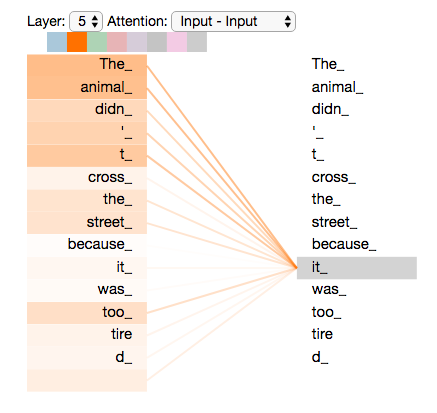

如上图所示，在进行单词 `it` 的相关性计算时，注意力机制根据计算得分，将其与 `The animal` 关联起来（其实不是真正意义上的关联，而是将计算结果矩阵和 it 的词嵌入矩阵合并，输入给下一层，对于观察者或者后面的层来说，这一步相当于把分数最高的相关性单词关联起来）。下面将详细阐述注意力机制的计算过程：

### 自注意力机制的计算详解

计算注意力机制的第一步是编码器给每个输入向量（在本例中理解为每个单词的嵌入）创建的三个向量（矩阵），分别为 Query 向量、Key 向量、Value 向量，这三个向量是注意力进行计算和思考的抽象概念。

#### 核心公式

自注意力机制的完整计算公式：

$$
\text{Attention}(Q, K, V) = \text{softmax}\left(\frac{QK^T}{\sqrt{d_k}}\right)V
$$
让我们逐步拆解这个公式的每个部分：

1. **$QK^T$**：注意力分数矩阵，计算 Query 和 Key 的相似度
2. **$\sqrt{d_k}$**：缩放因子，防止数值过大
3. **$\text{softmax}$**：将分数转化为概率分布
4. **乘以 $V$**：根据权重对 Value 进行加权聚合

> [!CAUTION]
>
> 这里的新向量一般维度是小于嵌入向量的。它们的维度为 64，而嵌入向量和编码器输入/输出的向量维度为 512。这仅仅是一种架构选择，方便后续的多头注意力机制的计算保持恒定。

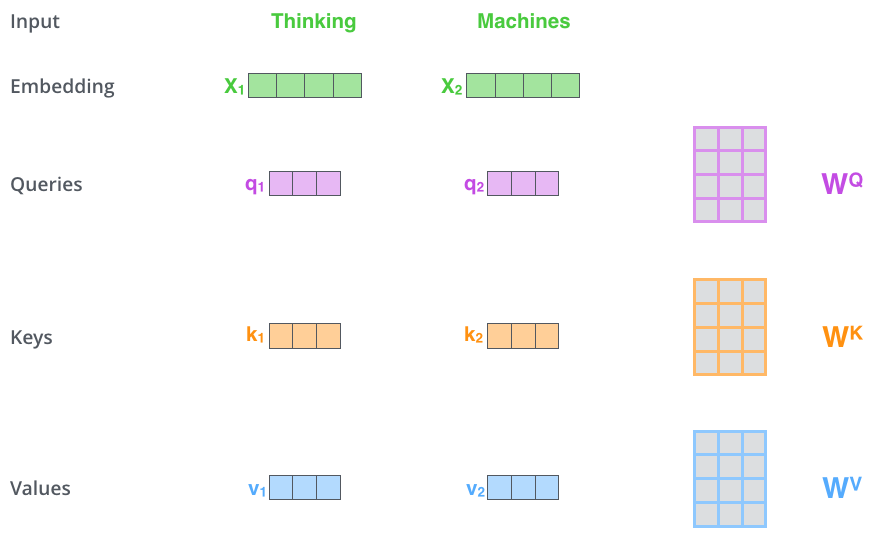


#### Q|K|V 三个向量的具体意义是什么

这里用一个巧妙的比喻来解释：

> 想象你在一个巨大的图书馆（图书馆就是我们要处理的一段文本或一系列信息）。
>
> - **Query ： 你的查询请求** 它就是 **你** 提出的问题。比如：“我想找一本关于‘宇宙哲学’的书。”**意义**：`Query` 代表当前需要关注什么的“意图”或“问题”。在翻译任务中，当模型在生成“美丽”这个词时，它的 `Query` 就是在问：“为了生成‘美丽’这个词，我应该关注输入句子中的哪些部分？”
> - **Key ： 书脊上的书名和标签** 图书馆里每本书的书脊上都有书名和分类标签（如“哲学”、“天文”、“科幻”）。这些就是书的 `Key`。**意义**：`Key` 是信息的“标识”或“摘要”。它用来与 `Query` 进行匹配，判断这条信息是否相关。在文本中，每个单词的 `Key` 向量就像是这个单词的“身份摘要”，用来回答 `Query` 的提问。
> - **Value ： 书中的具体内容** 这是书里面 **完整的知识内容**。一本标签是“宇宙哲学”的书，其 `Value` 就是书中关于宇宙、生命、万物之理的详细论述。**意义**：`Value` 是信息的“实质内容”。一旦我们通过 `Query` 和 `Key` 的匹配找到了相关的书，我们真正需要获取和使用的是书中的具体内容，也就是 `Value`。

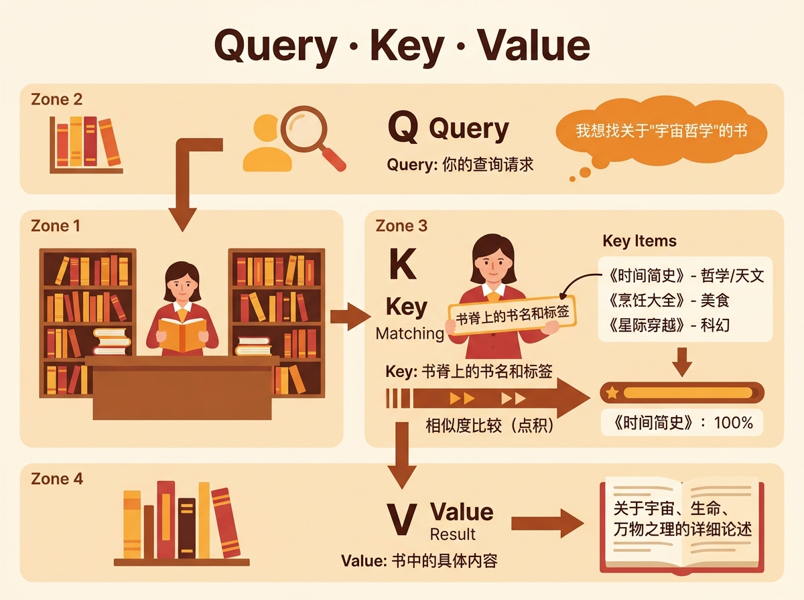

在上述例子中，注意力机制的工作流程如下：

1. **匹配（打分）**：你将你的 `Query`（“宇宙哲学”）与图书馆里所有书的 `Key`（书脊上的标签）进行相似度比较。你会给《时间简史》打高分，给《烹饪大全》打低分。
2. **加权（注意力权重）**：根据匹配分数，你决定在每本书上花费多少“注意力”。你可能给《时间简史》100%的注意力，给《星际穿越》50%的注意力，而完全忽略《烹饪大全》。
3. **汇总（加权求和）**：最后，你将这些注意力权重分别应用到对应的 `Value`（书的内容）上，然后汇总。你最终得到的信息，是高度集中于《时间简史》内容，并略带《星际穿越》风格的、关于“宇宙哲学”的一个 **全新综合理解**。

#### 注意力机制的矩阵计算

回归到注意力机制的计算，整个过程就很显而易见了：

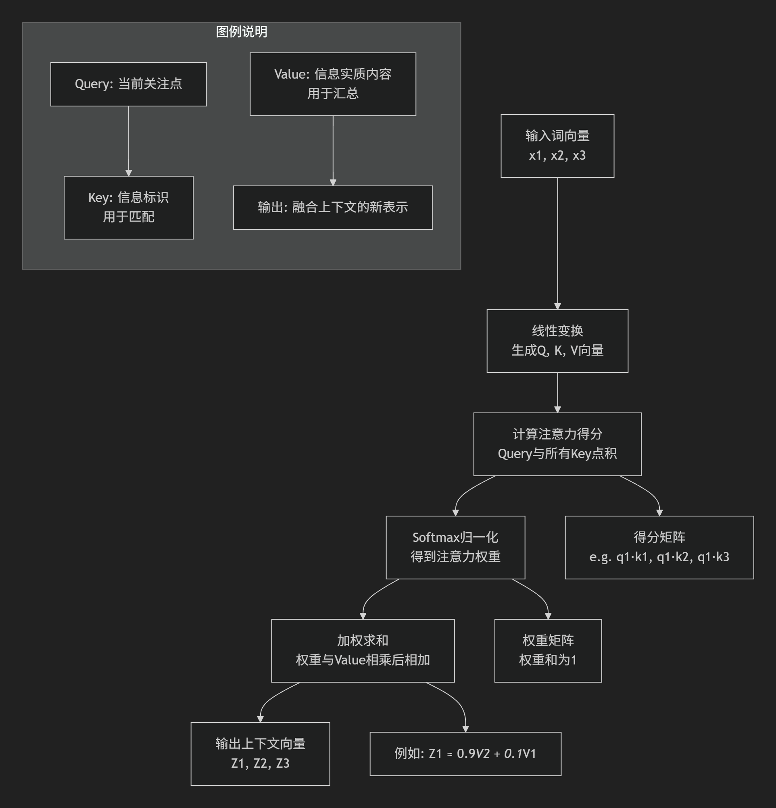

输入序列中的 **每个单词**（更准确地说，是它的嵌入向量）都会通过三种不同的线性变换（即乘以三个不同的权重矩阵 *W* *Q*, *W* *K*, *W* *V*），分别生成三个对应的向量：

- **Query 向量 \*q\***：代表“当前位置”想获取信息的意图。
- **Key 向量 \*k\***：代表“每个位置”所能提供信息的标识。
- **Value 向量 \*v\***：代表“每个位置”实际拥有的信息内容。

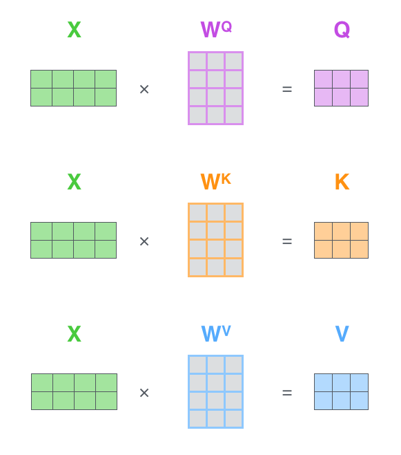

注意力机制计算流程：

**第 1 步：计算注意力分数（匹配）** 对于某个特定的 `Query`（比如对应“美丽”这个词的 `q_美丽`），我们用它与输入序列中 **所有单词** 的 `Key` 进行点积计算相似度（`q_美丽 · k_我`, `q_美丽 · k_喜欢`, `q_美丽 · k_这个`, `q_美丽 · k_花园`）。这个分数回答了“在生成‘美丽’这个词时，与‘我’、‘喜欢’、‘这个’、‘花园’这些词的关联度有多大？”结果可能发现 `q_美丽 · k_花园` 的分数最高。

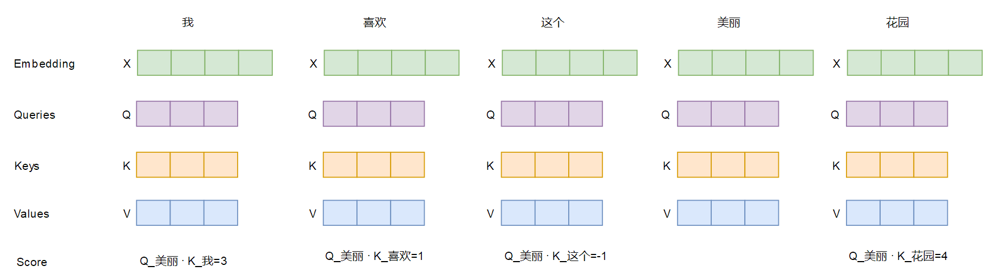

**第 2 步：应用 Softmax**（归一化为权重）将这些分数通过 Softmax 函数处理，得到一组权重系数（和为 1）。这步之后，“花园”对应的权重会接近 1，而其他词的权重接近 0。这步将分数转化为概率分布，明确了“注意力”应该如何 **分配**。几乎所有的注意力都集中在了“花园”上。

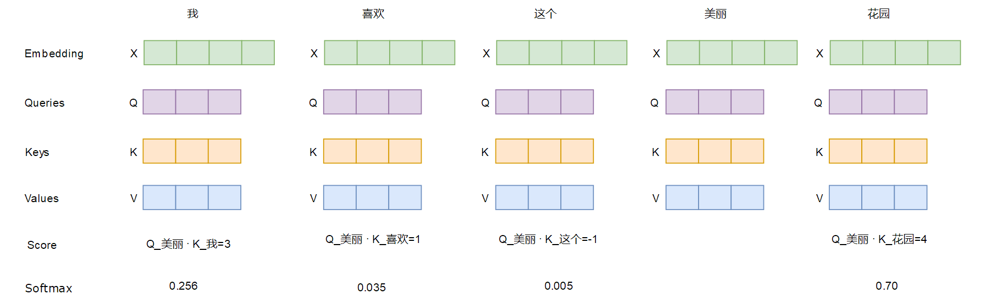

**第 3 步：加权求和 Value**（汇总）将上一步得到的所有权重，分别与对应单词的 `Value` 向量相乘，然后将所有结果相加，得到最终的 **注意力输出**。`输出 = 权重_我 * v_我 + 权重_喜欢 * v_喜欢 + ... + ~1.0 * v_花园` 这是最精妙的一步！最终的输出 **不是**“花园”这个词的原始表示，而是所有单词 `Value` 的加权平均，但其中“花园”的 `Value` 占据了绝对主导。这个输出是一个 **融合了上下文信息的、全新的“花园”的表示**。它包含了“为了理解‘美丽’，我们需要重点关注‘花园’”这一信息。

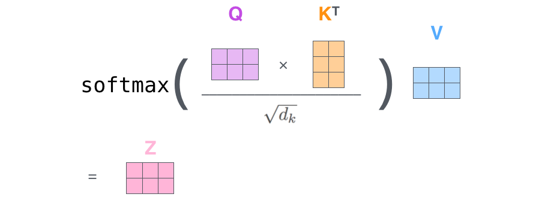

### 多头注意力机制

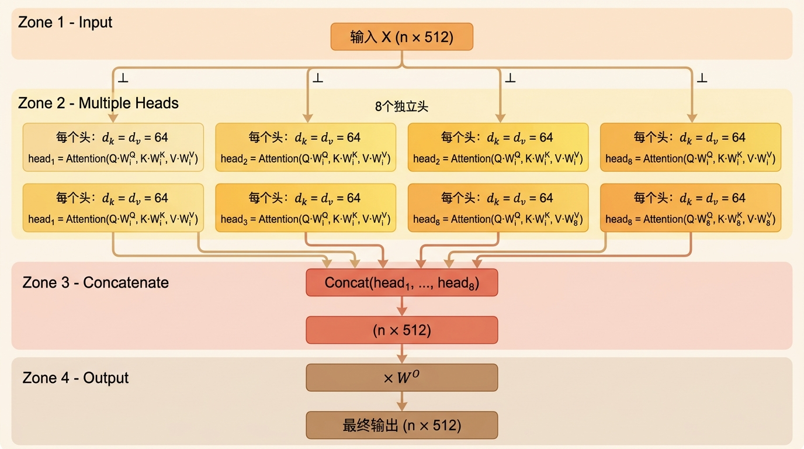

还是以例句进行展示：

> 看到句子 **“那只苹果很甜，是乔布斯创立的公司”** 时，你的大脑可能会并行地处理：
>
> 1. **语义关联**（一词多义）：“苹果”在这里指的是水果还是公司？你需要根据上下文（“甜” vs “乔布斯”）来判断。
> 2. **语法结构**：“很甜”修饰的是“苹果”，构成主谓关系。
> 3. **指代关系**：“是”后面的“公司”指代的是前面的“苹果”。
>
> 单一的头（Single-Head）注意力机制，可以看作是 **一次综合性的注意力**，它可能会同时捕捉到以上所有信息，但这些信息在同一个表示空间中是混杂在一起的。

**多头注意力（Multi-Head Attention）的核心思想就是：**

> **“与其让一个注意力机制一次性完成所有信息的捕捉，不如将模型划分为多个‘头’（子空间），让每个头专注于学习一种特定的注意力模式。最后再将所有头的结果合并起来，从而得到更丰富、更细腻的上下文表示。”**

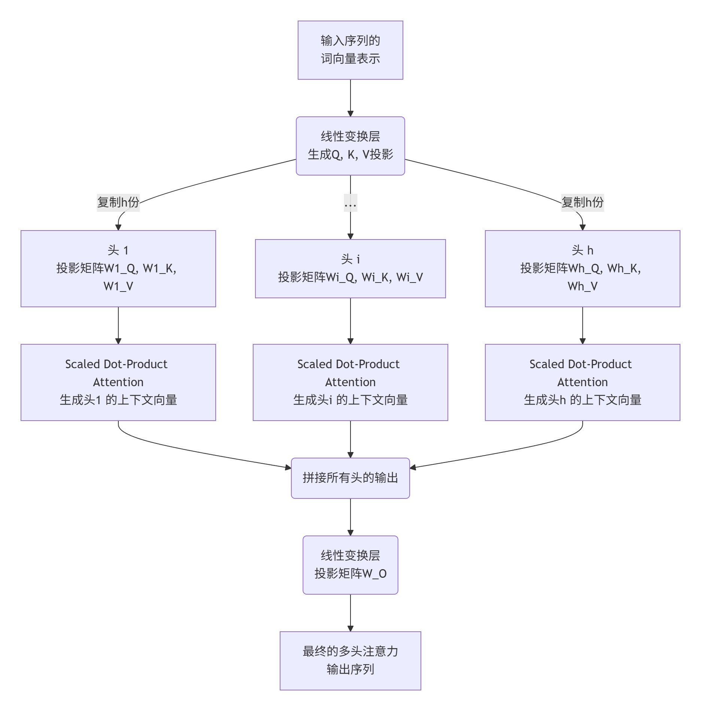

#### 多头注意力机制的计算

##### 公式推导

首先，让我们从数学角度理解多头注意力：

$$
\text{MultiHead}(Q, K, V) = \text{Concat}(\text{head}_1, \dots, \text{head}_h)W^O
$$
其中每个头的计算：

$$
\text{head}_i = \text{Attention}(XW_i^Q, XW_i^K, XW_i^V)
$$

$$
\text{Attention}(Q, K, V) = \text{softmax}\left(\frac{QK^T}{\sqrt{d_k}}\right)V
$$

##### 数值演算示例

假设输入 $X$ 维度为 4，我们使用 2 个头 ($h=2, d_k=2$)：

**1. 线性投影**
$$
X \in \mathbb{R}^{n \times 4} \xrightarrow{W_1^Q, W_2^Q} Q_1, Q_2 \in \mathbb{R}^{n \times 2}
$$
**2. 并行计算注意力**
两个头独立算出各自的注意力结果（维度均为 $n \times 2$）：
$$
\text{head}_1 = \text{Attention}(Q_1, K_1, V_1) \in \mathbb{R}^{n \times 2}
$$

$$
\text{head}_2 = \text{Attention}(Q_2, K_2, V_2) \in \mathbb{R}^{n \times 2}
$$


**3. 拼接与融合**
$$
\text{Concat}(\text{head}_1, \text{head}_2) \in \mathbb{R}^{n \times 4} \xrightarrow{W^O} \text{Output} \in \mathbb{R}^{n \times 4}
$$

##### 计算步骤详解

**第 1 步：初始化**

假设输入序列有 `n` 个词，每个词被表示为一个维度是 `d_model`（例如 512）的向量。那么输入矩阵 `X` 的维度是 `[n, d_model]`。

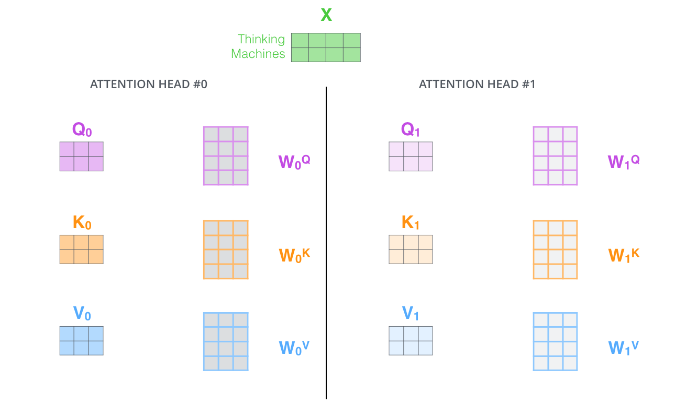

**第 2 步：创建多个头**（并行操作）

1. **线性投影：** 对于每个头 $i$（假设共有 $h$ 个头，例如 8 个），我们使用三组 **独立的** 权重矩阵 $W_i^Q, W_i^K, W_i^V$ 将原始的 $Q, K, V$ 分别投影到 **更低的维度**。通常，每个头的维度会变为 $d_k = d_v = d_{model} / h$（例如 512/8 = 64）。这样做的好处是总计算量与单头注意力相似。

2. **独立计算注意力：** 在每个投影后的低维空间里，分别执行标准的缩放点积注意力（Scaled Dot-Product Attention）操作：**计算注意力分数** ：$head_i=Attention(QW_i^Q,KW_i^K,VW_i^V)$


   这样，每个头都会产生一个输出矩阵 $head_i$，其维度是 $[n, d_v]$（例如 $[n, 64]$）。

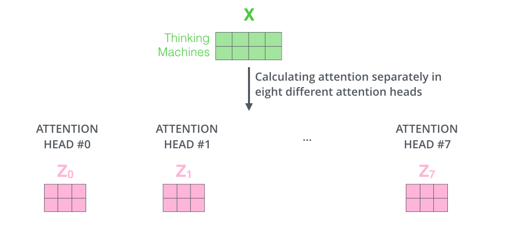

**第 3 步：合并输出**

1. **拼接：** 将所有 `h` 个头的输出矩阵 $head_1, head_2, ..., head_h$ 在 **特征维度** 上拼接起来，得到一个维度为 $[n, h * d_v] = [n, d_{model}]$ 的大矩阵。
2. **最终线性投影：** 将这个拼接后的大矩阵通过一个 **可学习的权重矩阵**  $W^O$ 进行线性变换，得到最终的输出。$W^O$  的维度通常是 $[d_{model}, d_{model}]$。这个步骤的作用是融合所有头的信息，并允许模型学习如何最有效地组合它们。

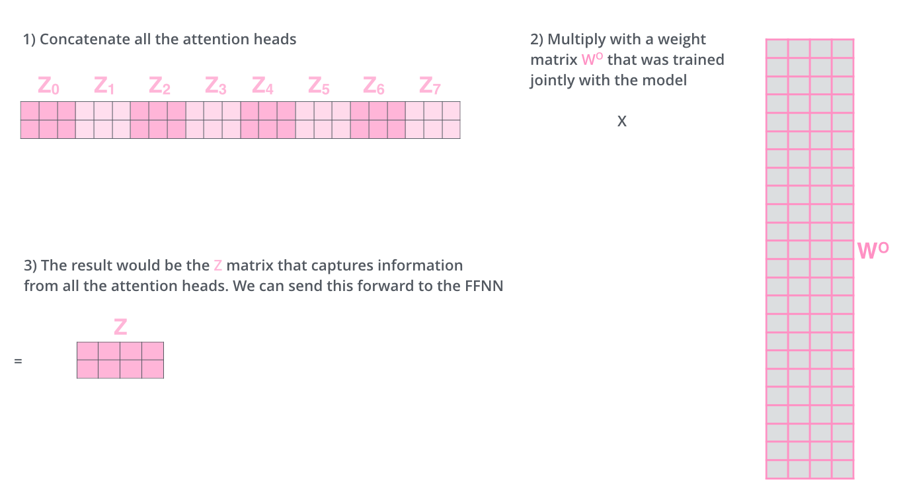

#### 多头注意力的优势

1. **增强建模能力**：允许模型在不同的表示子空间里协同关注来自不同位置的信息，大大扩展了模型的表示能力。
2. **并行计算**：多个头之间互不依赖，可以完全并行计算，效率极高。
3. **可解释性**：通过可视化不同头的注意力权重，我们可以直观地看到模型学习了哪些类型的语法或语义关系（如指代关系、形容词修饰关系等），这为理解模型提供了一扇窗口。

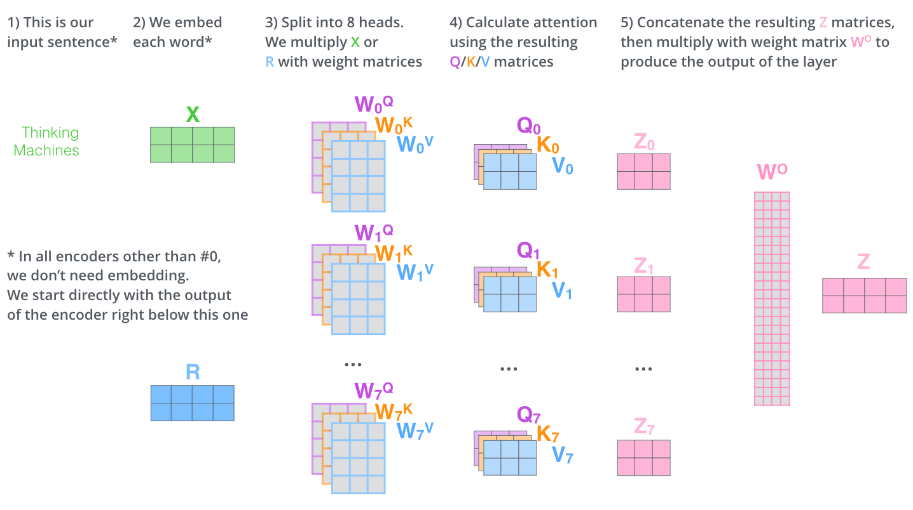

#### 常见的误区

**多头注意力的意思就是输入内容的每一个单词都会作为一个头去计算和别的单词的相关性吗？**

>  这是一个非常常见的误解，这个描述更接近“自注意力机制”本身，而不是“多头”。
>
> 在自注意力中，**每个词** 都会扮演两个角色：**主动查询者**：它用自己的 Query 向量去“询问”序列中的所有词（包括自己）：“你们谁跟我最相关？”**被查询对象**：它的 Key 和 Value 向量被其他词的 Query 向量用来计算相关性。所以，自注意力机制 **本身** 就保证了每个词都会与所有其他词进行交互。

**正确的理解：多头**（Multi-Head）

“多头”是指在 **已经有的自注意力机制之上**，再增加一个“并行化”的维度。它的意思是：

> **从多个不同的“视角”或“侧面”来并行地计算这种相关性，而不仅仅只计算一次。**

还是举一个栗子：

> 假设我们要分析一个“苹果”。
>
> - **单头注意力**（Single-Head）：相当于你 **一个人**，综合地从颜色、形状、大小、气味等多个方面来观察这个苹果，然后得出一个整体的结论。
> - **多头注意力**（Multi-Head，比如 8 个头）：相当于你组建了一个 **8 人的专家团队**，让他们 **同时** 观察这个苹果：**头 1 颜色专家**：只专注于分析苹果的颜色（红、黄、绿），给出颜色方面的报告。**头 2 形状专家**：只专注于分析苹果的形状（圆、歪），给出形状方面的报告。**头 3 质地专家**：只专注于触摸苹果的表面（光滑、粗糙）。**头 4 语义专家，针对文本**：专注于分析“苹果”这个词是指水果还是科技公司。**头 5 语法专家**：专注于分析“苹果”在句子中是主语还是宾语。...（还有其他专家）最后，你将这 8 份 **不同视角** 的专家报告汇总起来，得到对这个苹果最全面、最深入的理解。

再举一个更具体的例子，以上面的 `我喜欢这个美丽花园` 作为输入，在 Transformer 模型中:

1. 第一步：序列 `[我， 喜欢， 美丽， 花园]` 输入模型。这是基础输入。

2. **第二步**：模型不会只计算 **一套** 注意力权重。它会同时初始化 8 个（例如）独立的“专家团队”（即 8 个头）。每个“头”都有自己的一套独立的参数（独立的 `W_Q`, `W_K`, `W_V` 矩阵），这保证了它们会学习关注不同的方面。**每个头都会独立地为序列中的每个词计算一次它与其他所有词的相关性**。也就是说，**每个头都会生成一个完整的、但视角不同的注意力权重矩阵**。

   例如，在处理“美丽”这个词时：**头 1** 可能计算出 `花园` 与 `美丽` 的相关性最强（关注 **语义搭配**）。**头 2** 可能计算出 `喜欢` 与 `美丽` 的相关性最强（关注 **语法动宾关系**）。**头 3** 可能更关注 `这个` 与 `美丽` 的关系（关注 **指代或修饰关系**）。

3. **第三步**：将 8 个头得到的 8 组结果拼接起来，再通过一个线性层融合，得到最终的输出。这个输出融合了 8 种不同的关系信息。

| 机制           | 核心问题                                   | 比喻                                                         |
| :------------- | :----------------------------------------- | :----------------------------------------------------------- |
| **自注意力**   | **一个词如何与序列中所有词交互？**         | 保证团队里的每个人（每个词）都能和所有其他人交流。           |
| **多头注意力** | **我们能否从多个不同角度来评估这种交互？** | 组建一个专家团队，每个人从不同视角（颜色、形状等）同时评估这些交流。 |

### 位置编码

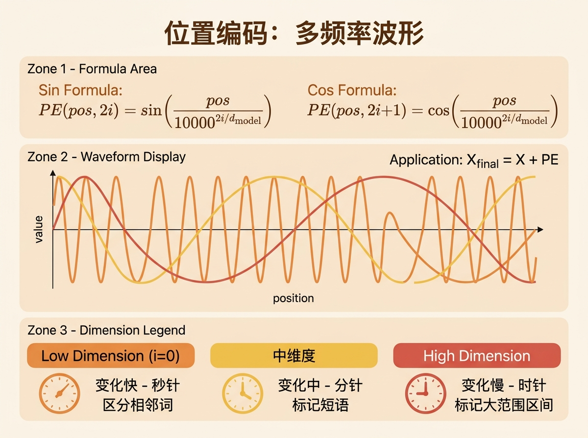

到目前为止，我们所描述的模型只缺少一件事，那就是解释输入序列中单词顺序的方法。

#### 为什么需要位置编码？

由于 Transformer 的注意力机制是并行计算的，它天生感知不到单词的顺序。所有词被同时输入模型，模型无法知道 "我" 是第一个词，"喜欢" 是第二个词。

为了解决这个问题，Transformer 模型对每个输入的向量都添加了一个向量。这些向量遵循特定的数学模式，有助于确定每个单词的位置，或者句子中不同单词之间的距离。

#### 正弦/余弦位置编码（Sinusoidal Position Encoding）

##### 公式推导

原始 Transformer 论文使用不同频率的波形来标记位置 $pos$：

$$
PE(pos, 2i) = \sin\left(\frac{pos}{10000^{2i/d_{model}}}\right) \quad \text{（偶数维）}
$$

$$
PE(pos, 2i+1) = \cos\left(\frac{pos}{10000^{2i/d_{model}}}\right) \quad \text{（奇数维）}
$$

其中：
- $pos$：词在序列中的位置（0, 1, 2, ...）
- $i$：向量的维度索引
- $d_{model}$：词向量的总维度

##### 设计思想：多频率波形

这个设计的巧妙之处在于：它用 **不同频率的波形** 来编码位置信息。

| 维度范围 | 频率特征 | 作用 | 比喻 |
|---------|---------|------|------|
| 低维度 (i = 0) | 变化快 | 区分 **相邻词** | 秒针，精细到秒 |
| 中维度 | 变化中 | 区分 **短语** | 分针，精细到分 |
| 高维度 | 变化慢 | 标记 **大范围区间** | 时针，标记小时 |

##### 数值对比示例

以 $d_{model}=4$ 为例，当 $pos=1$ 时：

$$
PE(1, 0) = \sin(1/10000^{0/4}) = \sin(1) \approx 0.84
$$

$$
PE(1, 1) = \cos(1/10000^{0/4}) = \cos(1) \approx 0.54
$$

$$
PE(1, 2) = \sin(1/10000^{2/4}) = \sin(0.01) \approx 0.01
$$

$$
PE(1, 3) = \cos(1/10000^{2/4}) = \cos(0.01) \approx 1.00
$$

注意到：
- **低维（0, 1）**：变化明显，区分相邻位置
- **高维（2, 3）**：变化缓慢，标记相对位置

##### 可视化理解

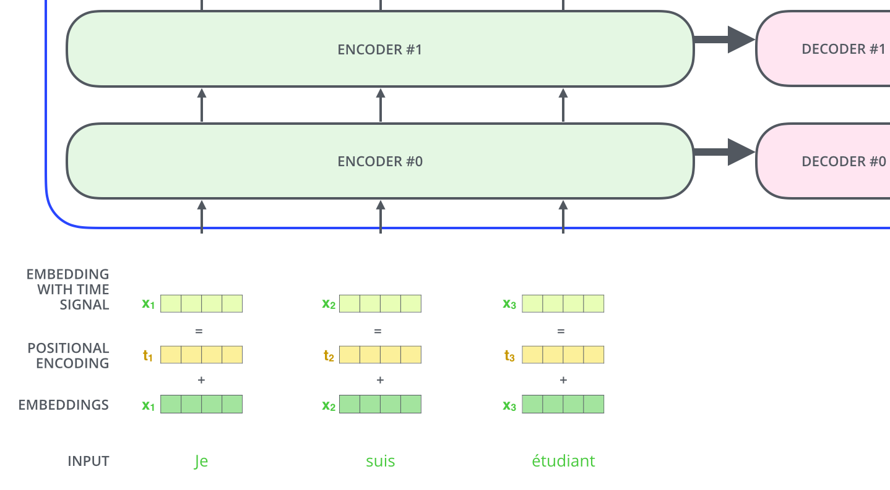

假设嵌入的维数为 4，则实际的位置编码将如下所示：

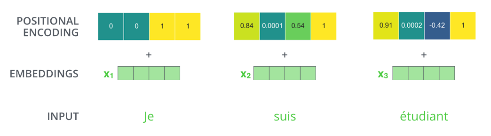

更直观的展示一下位置编码：

在下图中，每一行对应一个向量的位置编码。因此，第一行将是我们要添加到输入序列中第一个单词的嵌入的向量。每行包含 512 个值 - 每个值介于 1 和 -1 之间。对它们进行了颜色编码，以便模式清晰可见。

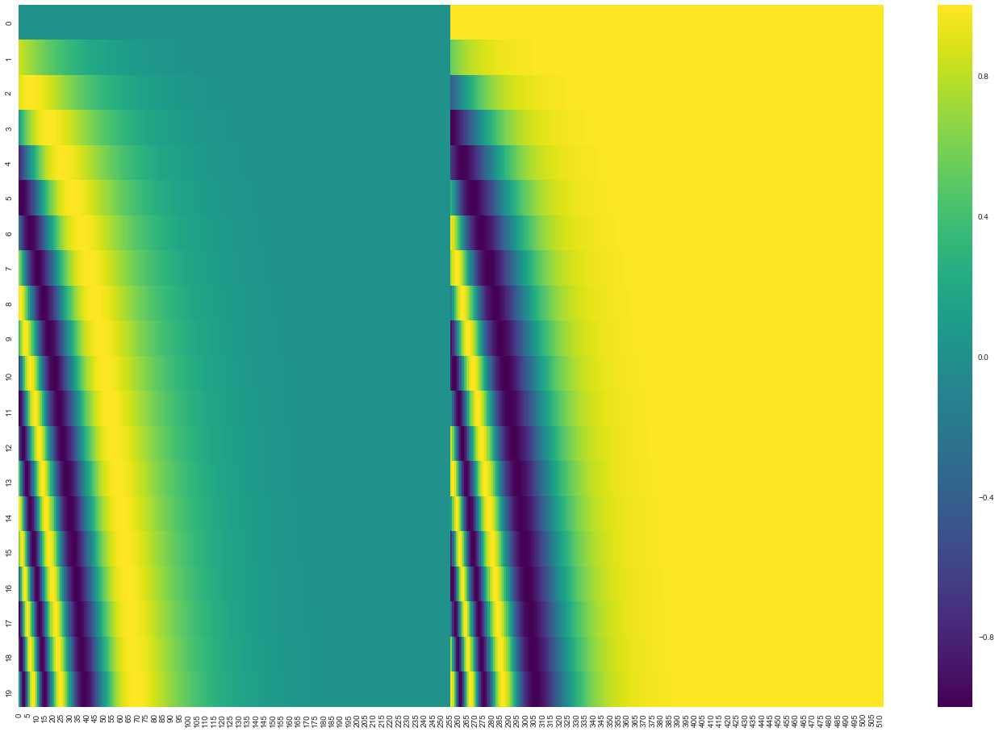

##### 最终应用

将这个 $PE$ 向量与词向量 $X$ 直接相加：

$$
X_{final} = X + PE
$$
模型就获得了空间感，可以理解词的相对位置关系。

#### 为什么选择固定位置编码而非可学习的？

原始论文使用固定的正弦/余弦编码有几个优势：
1. **泛化能力**：可以处理比训练时更长的序列
2. **相对位置**：$PE_{pos+k}$ 可以表示为 $PE_{pos}$ 的线性变换，模型能学习相对位置关系
3. **无需训练**：不增加额外参数，节省计算资源

> [!tip]
>
> 现代 Transformer（如 GPT 系列）多使用 **可学习的位置嵌入**（Learnable Position Embeddings），在大规模数据下表现更好，但需要固定最大序列长度。

### 前馈神经网络与层归一化（Feed Forward Network & Layer Normalization）

在注意力提取完关系后，Transformer 还需要进一步加工和稳定数值，这时就用到了 **前馈神经网络（FFN）** 和 **层归一化（LayerNorm）**。

#### 前馈神经网络（Feed Forward Network, FFN）

每个 Transformer 层（编码器和解码器）都包含一个 **位置级前馈神经网络**，它对序列中的 **每个位置** 的向量进行独立的非线性变换。

##### 公式

$$
\text{FFN}(x) = \max(0, xW_1 + b_1)W_2 + b_2
$$

或者更详细地表示为：

$$
\text{FFN}(x) = \text{ReLU}(xW_1 + b_1)W_2 + b_2
$$

##### 结构说明

- **第一层线性变换**：将输入向量 $x$（维度 $d_{model}=512$）投影到更高维空间（通常是 $4 \times d_{model}=2048$）
- **ReLU 激活函数**：引入非线性，让模型能拟合复杂关系
- **第二层线性变换**：将高维向量投影回 $d_{model}$ 维度

##### 为什么需要 FFN？

自注意力机制擅长捕捉 **词与词之间的关系**，而 FFN 则负责对 **每个词的表示进行深度加工**。可以理解为：

```
Self-Attention: "这个词应该关注其他哪些词？"
        ↓
        FFN: "这个词的深层语义是什么？如何加工它的表示？"
```

#### ReLU 激活函数

**ReLU**（Rectified Linear Unit，修正线性单元）是 FFN 中的关键组件。

##### 公式

$$
f(x) = \max(0, x) = \begin{cases}
x, & x > 0 \\
0, & x \le 0
\end{cases}
$$

##### 作用

1. **引入非线性**：没有激活函数，多层网络就退化为单层等价变换
2. **计算高效**：ReLU 比传统激活函数（如 Sigmoid、Tanh）快得多
3. **缓解梯度消失**：正区间的梯度恒为 1，梯度不会像指数级衰减

#### 层归一化（Layer Normalization）

##### 为什么需要归一化？

在深度网络中，数据分布会不断漂移，导致：
- 梯度不稳定
- 训练困难
- 收敛速度慢

##### LayerNorm 公式

$$
\text{LayerNorm}(x) = \gamma \cdot \frac{x - \mu}{\sqrt{\sigma^2 + \epsilon}} + \beta
$$

其中：
- $\mu = \frac{1}{H}\sum_{i=1}^{H}x_i$：均值
- $\sigma^2 = \frac{1}{H}\sum_{i=1}^{H}(x_i - \mu)^2$：方差
- $\gamma, \beta$：可学习的缩放和偏移参数
- $\epsilon$：防止除零的小常数

##### LayerNorm vs BatchNorm

| 特性 | LayerNorm | BatchNorm |
|------|-----------|-----------|
| **归一化维度** | 对每个样本的所有特征维度归一化 | 对每个特征维度的所有样本归一化 |
| **适用场景** | 序列数据、变长输入 | 图像、固定 batch size |
| **训练/推理** | 行为一致 | 需要统计 running 均值和方差 |

Transformer 选择 LayerNorm 的原因：
- 处理序列数据更自然
- 不依赖 batch size
- 训练和推理行为一致

### 残差连接（Residual Connections）

回到 Transformer 的架构图，可以发现：编码器结构中编码器的每个子层（Self Attention 层和 FFNN）都有一个残差连接和层标准化（layer-normalization）。

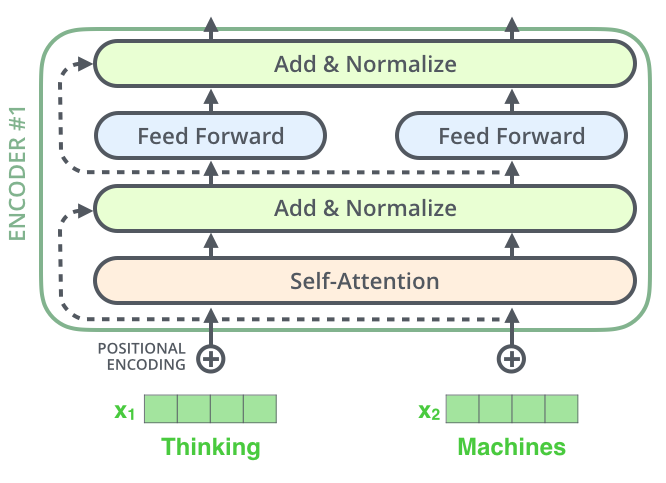

将自注意力机制的相关向量和层进行可视化：

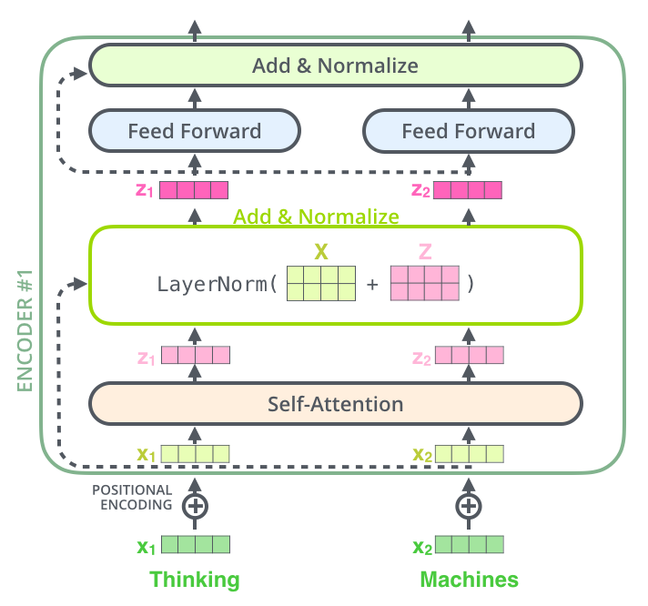

是不是看的云里雾里，其实很简单，我仍然举一个通俗的例子：

> 假设你（模型）要学习做一道菜，比如“西红柿炒鸡蛋”。我们把做菜的过程看成网络的一层。
>
> **1. 没有残差连接时**（传统方式）：
>
> - 你每次做菜，都是 **从零开始**。
> - 师傅尝了你的菜说：“味道不够，需要改进。”
> - 但你不知道具体哪一步出了问题。是盐放少了？火候不对？鸡蛋炒老了？你需要 **猜测并调整整个做菜流程**。这非常困难，而且很容易改得面目全非，甚至还不如上一版。
>
> **2. 有残差连接时**（Transformer 的方式）：
>
> - 你做了一道“西红柿炒鸡蛋”（我们叫它 **版本 A**）。
> - 师傅尝了后说：“味道不够，需要改进。”
> - 但现在，你不是从头开始做。你的任务是：**在版本 A 的基础上，只做一个小小的“改进”或“补丁”**。
> - **具体步骤是**：
>   - **保留原版**：你把做好的“版本 A”完整地留在盘子里。`（这就是 x，输入）`
>   - **制作“改进包”**：你另外拿个小碗，调一点点更鲜的酱油汁，或者切一点葱花。`（这就是 F(x)，要学习的“残差”或“变化”）`
>   - **合并**：最后，你把小碗里的“改进包”浇到“版本 A”上。`（这就是 x + F(x)，输出 = 输入 + 变化）`
>   - 最终菜品 = 原来的菜 (x) + 改进的调料 (F(x))

在上面的示意图中，在 Transformer 的每一层（比如注意力层），发生的事情就是：

输入（一句话的词向量） --进入--> 【本层的复杂计算】 --产生--> 一个“变化量”

然后：**本层的最终输出 = 输入 + 变化量**

这个“+”号，就是 **残差连接**。它确保了这一层无论怎么折腾，最初输入的信息都原封不动地保留了一份，并传递到了下一层。

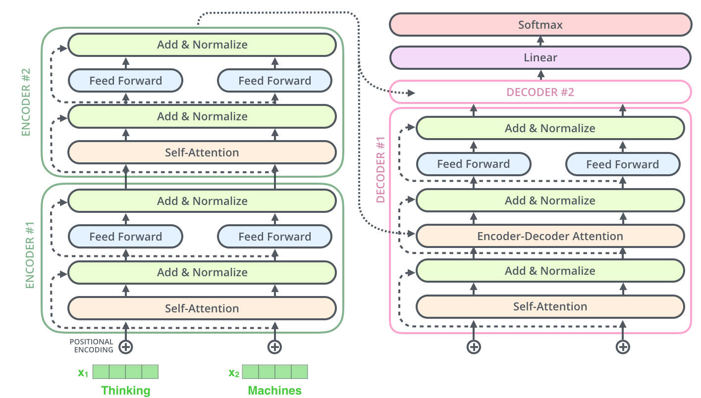

#### 为什么残差如此重要？

残差连接解决了训练 **深度神经网络** 时的两个核心难题：

> **1. 梯度消失/爆炸问题**
>
> - **没有残差连接**：在反向传播时，梯度需要从最深层（第 N 层）一层一层地传回最浅层（第 1 层）。这个过程就像穿过一个漫长的、信号会不断衰减的隧道。当网络很深时，梯度可能会变得极小（消失）或极大（爆炸），导致浅层参数无法得到有效的更新。
> - **有残差连接**：梯度可以通过残差路径这条“捷径”直接、无损地传回更早的层。这确保了即使网络有几十甚至上百层，所有层都能获得有效的梯度信号，使得训练非常深的模型成为可能。
>
> **2. 网络退化问题**
>
> - 即使解决了梯度消失，实验发现，单纯增加网络深度反而会导致训练和测试误差都变大。这不是过拟合，而是网络 **退化** 了——更深的网络表现反而不如较浅的网络。
> - **残差连接的妙处**：如果一个更深的网络的最优解就是简单地模仿一个较浅的网络（即让新增的层什么也不做），那么学习 `F(x) = 0` 要比学习 `H(x) = x` 容易得多！因为 `F(x) = 0` 意味着让权重逼近零即可。这样，更深的网络 **至少不会比浅层网络差**。如果更深层有用，模型再去学习一个非零的 `F(x)`。
>
> 它是 Transformer 能够构建得非常深（例如 GPT-3 有 96 层）、从而拥有强大能力的关键技术支柱之一。

### 掩码机制（Masking）

在详细介绍解码器之前，我们先理解一个关键概念——**掩码（Masking）**。

#### 为什么需要掩码？

在训练和推理过程中，解码器采用 **自回归（Autoregressive）** 生成方式：一次生成一个词，下一个词的生成基于之前已经生成的词。

如果在生成第 3 个词时，模型 "偷看" 了第 4、第 5 个词，那就是作弊了！掩码的作用就是防止这种情况。

#### 如何实现掩码？

在解码器的自注意力计算中，我们使用 **下三角掩码**（Causal Mask）：
$$
\text{MaskedAttention}(Q, K, V) = \text{softmax}\left(\frac{QK^T}{\sqrt{d_k}} + M\right)V
$$
其中 $M$ 是掩码矩阵：

$$
M = \begin{bmatrix}
0 & -\infty & -\infty & -\infty \\
0 & 0 & -\infty & -\infty \\
0 & 0 & 0 & -\infty \\
0 & 0 & 0 & 0
\end{bmatrix}
$$

解释：
- 对角线及以下（$j \le i$）：允许关注，值为 0
- 对角线以上（$j > i$）：禁止关注，值为 $-\infty$

当 $-\infty$ 经过 softmax 后，这些位置的注意力权重变为 0，模型就 "看不见" 未来的词了。

#### 填充掩码（Padding Mask）

除了因果掩码，Transformer 还使用 **填充掩码** 来忽略序列中的填充符（padding token）：

在变长序列处理时，我们需要将所有序列填充到相同长度。填充掩码确保注意力机制不会关注这些无效的填充位置。

### 解码器

现在我们已经介绍了编码器方面的大部分概念，也基本上知道了解码器组件的工作原理。让我们看看它们是如何协同工作的。

编码器首先处理输入序列。然后，顶部编码器的输出被转换为一组注意向量 K 和 V。每个解码器将在其“编码器-解码器注意”层中使用它们，这有助于解码器将注意力集中在输入序列中的适当位置：


还是举个例子方便理解

>#### 第 1 步：编码器处理输入序列
>
>法语情报文档 `"J'aime le beau jardin"`（“我喜欢美丽的花园”）被送入编码器团队。这个团队由多个（比如 6 个）分析专家（编码器层）堆叠而成。
>
>- **过程**：第一个分析专家（编码器层 1）阅读原始文档，进行初步分析，输出一份初步的“分析笔记”。这份笔记传递给第二个专家（编码器层 2），他在前一个专家的分析基础上进行更深入、更综合的分析。以此类推，直到最顶层的专家（编码器层 6）完成分析。
>- **结果**：顶层编码器输出的，不再是简单的单词表示，而是 **一份富含上下文、已经充分理解了整句话含义的“终极分析报告”**。这份报告里的每个词（如 `"J'aime"`, `"beau"`, `"jardin"`）都已经被赋予了基于整个句子上下文的意义。
>
>#### 第 2 步：生成注意向量 K 和 V
>
>这份“终极分析报告”被转换成两份特殊的情报摘要：**K- 密钥** 和 **V -值**。你可以理解为：**K** 像是报告内容的 **精确索引** 或 **关键词列表**。它帮助快速定位信息。**V** 像是报告内容的 **实质信息** 或 **详细内容** 本身。
>
>- **目的**：这样做的目的是为了让解码器（报告撰写员）能够高效地查询这些信息，而无需重新阅读整个复杂的分析报告。
>
>#### 第 3 步：解码器逐步生成，并查询编码器
>
>“每个解码器将在其‘编码器-解码器注意’层中使用它们，这有助于解码器将注意力集中在输入序列中的适当位置。”现在，报告撰写员（解码器）开始用英语一个字一个字地写报告。**这是最关键的一步！**
>
>- **具体过程**（假设已经生成了前两个词 “I love”）：
>  -  **解码器自注意力**：撰写员先看看自己已经写了什么（`"I love"`），确保下文连贯。（这是解码器的自注意力层）
>  - **询问编码器**：接下来，撰写员要写下一个词了。他思考：“基于我目前写的 `‘I love’`，我应该去法语文档的哪个部分寻找最重要的信息来确定下一个词？”他拿着当前的状态（对应一个 Query，Q），去查询编码器提供的那份索引 K。通过比对，他发现他的 Q 与编码器 K 中代表 `"beau"`（美丽）和 `"jardin"`（花园）的键最匹配。特别是 `"jardin"`（花园）匹配度最高。于是，他将 **注意力集中** 到编码器信息 V 中与 `"jardin"` 相关的实质内容上。
>  - **生成词语**：综合了自身已写的内容（`"I love"`）和从编码器那里聚焦的信息（`"jardin"` 的语义），他判断下一个词应该是 `"the beautiful garden"`，并先写出下一个词 `"the"`。


>  [!NOTE]
>
> 解码器中的自注意力层的操作方式与编码器中的自注意力层略有不同：
>
> 在解码器中，自注意力层仅允许关注输出序列中的较早位置。这是通过 `-inf` 在自注意力计算中的 `softmax ` 步骤之前屏蔽未来位置（将其设置为 0）来实现的。“编码器-解码器注意”层的工作原理与多头自注意类似，不同之处在于它从其下方的层创建查询矩阵，并从编码器堆栈的输出中获取键和值矩阵。

### 最后的线性层和 Softmax 层

解码器堆栈输出一个浮点向量。我们如何将其转换成一个单词？这是最后一个线性层的工作，后面是 Softmax 层。

#### 线性层（Linear Layer / Projection Head）

线性层是一个简单的完全连接的神经网络，它将解码器堆栈产生的向量投影到一个更大的向量中，称为 **logits 向量**。

假设我们的模型知道从训练数据集中学习到的 10,000 个独特的英语单词（我们模型的 "输出词汇表"）。这将使 logits 向量宽度达到 10,000 个单元格 - 每个单元格对应一个独特单词的分数。

#### Softmax 层

Softmax 层将这些分数转换为概率（所有分数均为正数，总和为 1.0）。

##### Softmax 公式

$$
\text{softmax}(x_i) = \frac{e^{x_i}}{\sum_{j=1}^{n} e^{x_j}}
$$

##### 生成过程

在推理时，我们通常有两种策略：

1. **贪婪解码（Greedy Decoding）**：选择概率最高的单元格
2. **采样（Sampling）**：从概率分布中采样（如 Top-K、Top-P/nucleus 采样）

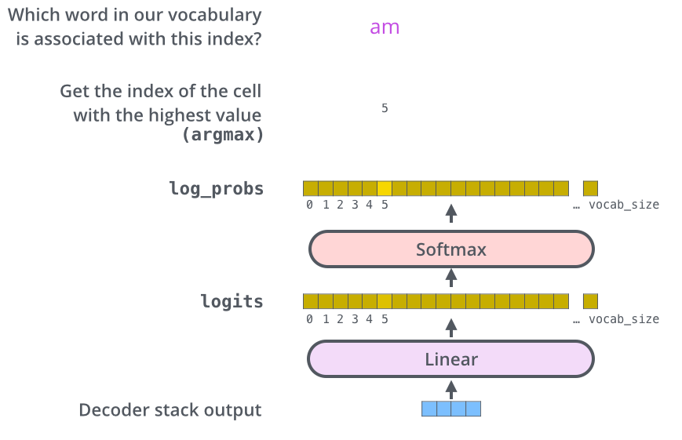

## 完整的 Transformer Block 公式

最后，我们将所有组件缝合在一起。一个典型的 **"前规一化"(Pre-Norm)** 结构的完整逻辑如下：

### 编码器层（Encoder Layer）

$$
\text{EncoderLayer}(X) = \text{FFN}(\text{LayerNorm}(X + \text{MultiHeadAttention}(\text{LayerNorm}(X))))
$$

或者分步骤表示：

1. **自注意力支路**：
   $$
   X_{attn} = X + \text{MultiHead}(\text{LayerNorm}(X))
   $$
   
2. **前馈网络支路**：
   $$
   X_{final} = X_{attn} + \text{FFN}(\text{LayerNorm}(X_{attn}))
   $$
   

### 解码器层（Decoder Layer）

解码器有三种子层：

1. **掩码自注意力**：
   $$
   X_{masked\_attn} = X + \text{MultiHeadMasked}(\text{LayerNorm}(X))
   $$
   
2. **编码器-解码器注意力（交叉注意力）**：
   $$
   X_{cross\_attn} = X_{masked\_attn} + \text{MultiHeadCross}(\text{LayerNorm}(X_{masked\_attn}), \text{EncoderOutput})
   $$
   
3. **前馈网络**：
   $$
   X_{final} = X_{cross\_attn} + \text{FFN}(\text{LayerNorm}(X_{cross\_attn}))
   $$

## 总结

**Transformer 是一个基于自注意力的编码器-解码器架构，其核心创新包括：**

| 核心组件 | 作用 | 解决的问题 |
|---------|------|-----------|
| **自注意力机制** | 让每个词直接与所有词交互词间依赖 | |
| **多头注意力** | 从多个子空间捕捉不同关系 | 单一注意力的限制 |
| **位置编码** | 注入序列顺序信息 | 并行计算丢失顺序 |
| **前馈网络** | 深度加工每个词的表示 | 增强建模能力 |
| **层归一化** | 稳定数值分布 |归一化 |
| **残差连接** | 保留原始信息，缓解梯度问题 | 梯度消失/网络退化 |
| **掩码机制** | 防止解码器看未来 | 自回归生成需求 |

**编码器负责将输入序列压缩为富含上下文的表示，解码器则通过交叉注意力机制，基于编码器的输出和已生成的内容，自回归地生成目标序列。其高效、强大的特性使其成为自然语言处理领域的绝对主流，并催生了 BERT、GPT 等变革性模型。**

### Transformer 的影响力

从 2017 年《Attention Is All You Need》发表至今，Transformer 已经彻底改变了 NLP 乃至整个 AI 领域：

- **NLP 领域**：BERT、GPT 系列、T5 等大模型
- **计算机视觉**：ViT（Vision Transformer）、Swin Transformer
- **多模态**：CLIP、DALL-E、GPT-4V
- **生物信息**：AlphaFold2 用于蛋白质结构预测

Transformer 不仅是一个模型架构，更是一种全新的 **"注意力计算范式"**。

## 学习资源推荐

**论文：**

- [《Attention Is All You Need》- 原始论文](https://arxiv.org/abs/1706.03762)

**博客：**

- [图解 Transformer | 图形化深入浅出地解释 Transformer 模型的工作原理](https://blog.eimoon.com/p/transformer-explained/)
- [序列模型之王 - Transfomer 全细节详解-CSDN 博客](https://blog.csdn.net/Kuo_Jun_Lin/article/details/114241287?spm=1001.2014.3001.5506)
- [【超详细】【原理篇&实战篇】一文读懂 Transformer-CSDN 博客](https://blog.csdn.net/weixin_42475060/article/details/121101749)

**视频：**

- [一小时从函数到 Transformer！一路大白话彻底理解 AI 原理](https://www.bilibili.com/video/BV1NCgVzoEG9/?share_source=copy_web&vd_source=a06df7b174b0e55e45242729b8ce1758)
- [李沐：动手学深度学习-Transformer](https://www.bilibili.com/video/BV1Lv4y1e7hT)