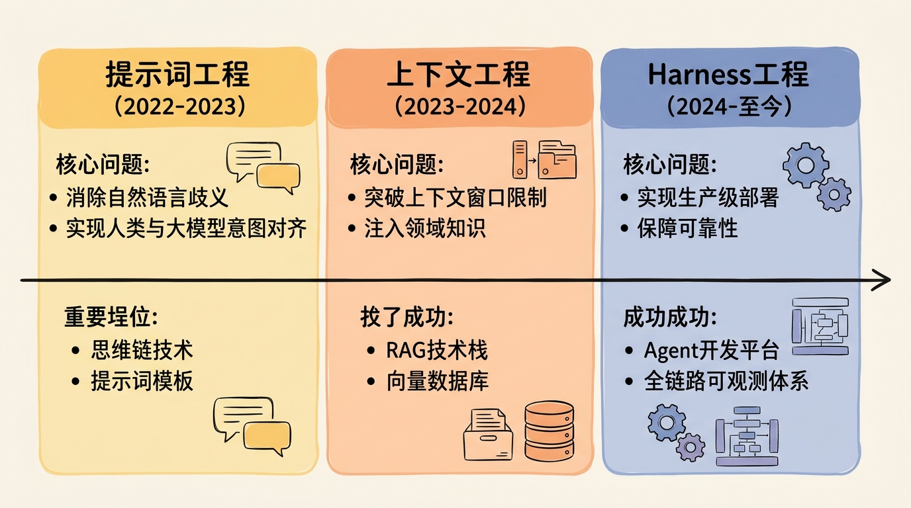
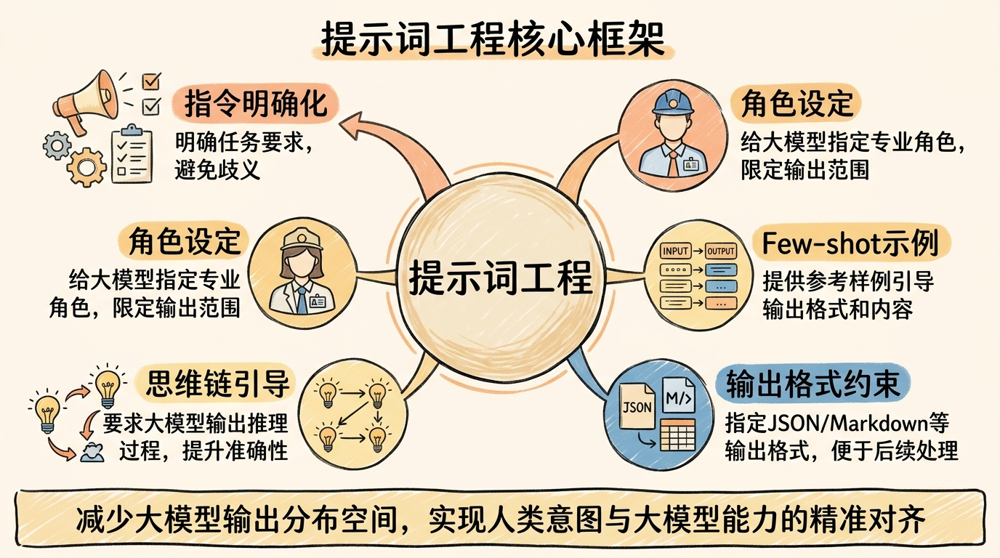
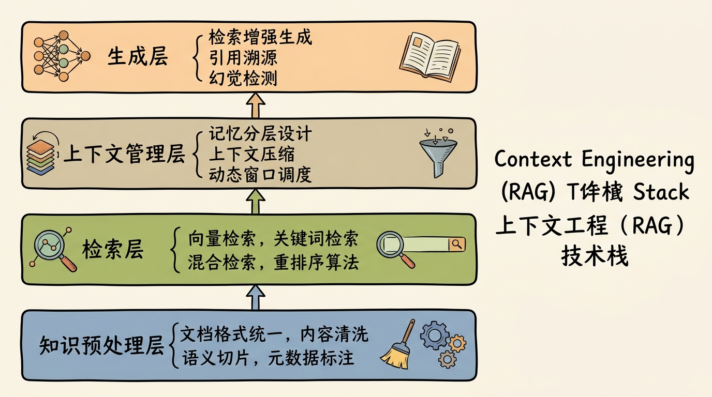
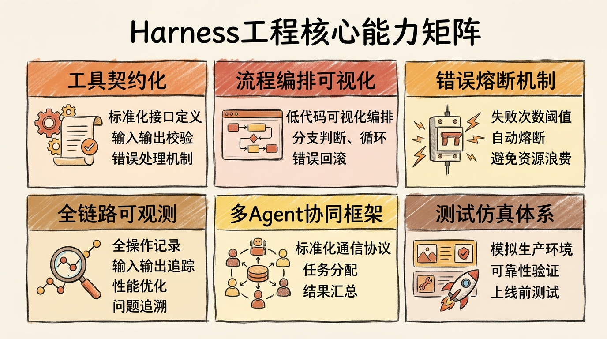
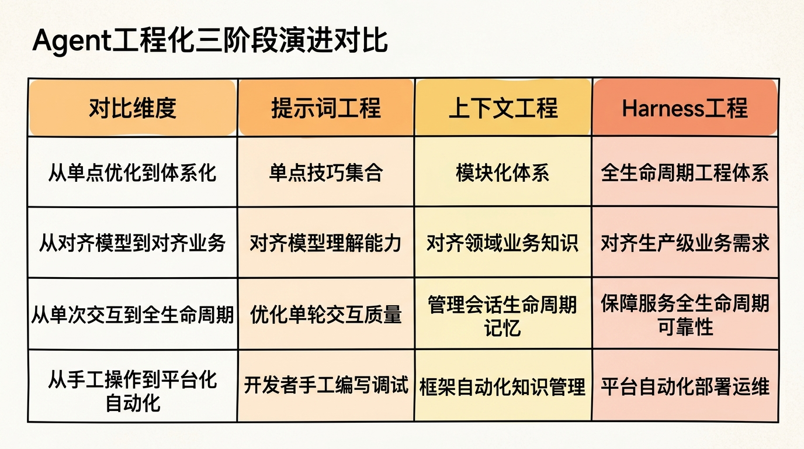

---

## 引言
大模型驱动的智能体（Agent）技术发展至今，已经走过了三个清晰的工程化阶段：从最初「怎么写好提示词」的单点技巧探索，到「怎么高效管理上下文」的模块体系构建，再到今天「怎么部署生产级Agent」的完整工程体系。这三个阶段的演进不是技术的随机迭代，而是遵循着清晰的设计哲学脉络，本质是软件工程理念在AI时代的自然延伸。

## 一、提示词工程（Prompt Engineering）：人机交互接口的第一次对齐

### 设计哲学：把自然语言变成新的编程语言
提示词工程是Agent技术的第一个工程化阶段，它要解决的核心问题是**消除自然语言的歧义性，实现人类意图与大模型能力的精准对齐**。

在大模型刚出现的阶段，开发者很快发现：同样的问题用不同的表述方式问大模型，得到的结果可能天差地别。这背后的本质是大模型的能力是建立在海量文本数据的统计规律之上，它对自然语言的理解和人类的认知存在天然的偏差。提示词工程的出现，就是为了构建一套「翻译规则」，把人类的自然语言需求翻译成大模型能够精准理解的输入格式。

### 核心方法论的演进
从最基础的指令明确化，到角色设定、思维链（Chain-of-Thought）引导、Few-shot示例注入、输出格式约束，提示词工程的所有方法论本质上都是在做同一件事：**给大模型足够的上下文约束，减少它的输出分布空间，让结果落在预期的范围内**。

这一阶段的标志性成果包括：
- OpenAI官方发布的[《Prompt Engineering Guide》](https://platform.openai.com/docs/guides/prompt-engineering)，系统化梳理了提示词设计的最佳实践
- Google DeepMind提出的[思维链（CoT）技术](https://arxiv.org/abs/2201.11903)，大幅提升了大模型的复杂推理能力
- 各种提示词框架的出现，把零散的技巧变成可复用的模板

提示词工程的历史贡献在于它第一次证明了：不需要微调大模型参数，只通过优化输入就能显著提升大模型的输出质量，这为后续的工程化探索打开了全新的思路。

## 二、上下文工程（Context Engineering）：模型记忆能力的工程化突破

### 设计哲学：让大模型从「闭卷考试」变成「开卷考试」
提示词工程很快遇到了它的能力天花板：
1. 上下文窗口长度限制，无法注入大量的领域知识
2. 知识更新滞后，大模型的训练数据是静态的，无法获取实时信息
3. 幻觉问题难以避免，大模型会编造不存在的信息
4. 知识复用成本高，每次交互都需要重复注入相同的背景信息

上下文工程（核心是RAG技术体系）的出现就是为了系统性解决这些问题，它的设计哲学非常朴素：**既然大模型的「内部记忆」有限且不可修改，那就给它外接一个「外部知识库」，让它可以动态检索需要的信息来回答问题**。

### 核心体系的构建
上下文工程已经形成了完整的技术栈：
- **知识预处理层**：文档格式统一、内容清洗、语义切片、元数据标注
- **检索层**：向量检索、关键词检索、混合检索、重排序算法
- **上下文管理层**：记忆分层设计（短期记忆/工作记忆/长期记忆）、上下文压缩、动态窗口调度
- **生成层**：检索增强生成、引用溯源、幻觉检测

这一阶段的标志性成果包括：
- LangChain推出的[RAG完整技术栈](https://python.langchain.com/docs/use_cases/question_answering/)，成为上下文工程的事实标准框架
- 斯坦福大学发布的[《Retrieval-Augmented Generation for Large Language Models: A Survey》](https://arxiv.org/abs/2312.10997)，系统化梳理了RAG技术的发展路径
- 各种向量数据库的兴起，为外部知识库提供了高效的存储和检索能力

上下文工程的历史贡献在于它把大模型的能力边界从「通用知识问答」扩展到了「领域专属场景」，第一次让大模型具备了落地到具体业务场景的可能性。

## 三、Harness工程（Harness Engineering）：Agent生产级部署的完整工程体系

### 设计哲学：把Agent从「玩具原型」变成「生产级系统」
上下文工程解决了知识注入的问题，但当开发者尝试把Agent部署到生产环境时，又遇到了全新的挑战：
- 工具调用可靠性低：大模型经常调用错误的工具、传入错误的参数
- 多步任务规划失败：复杂任务执行到一半容易卡壳、陷入死循环
- 可观测性缺失：不知道Agent执行过程中发生了什么，无法排查问题
- 容错机制缺失：一旦某一步执行失败，整个任务就崩溃
- 多Agent协同困难：多个Agent之间的任务分配、信息同步没有统一标准
- 资源调度效率低：无法根据任务优先级动态分配计算资源

Harness工程的出现就是为了系统性解决这些生产级问题，它的设计哲学是**把传统软件工程的DevOps理念完整移植到Agent开发领域，构建一整套覆盖Agent全生命周期的工程化体系**。

### 核心能力矩阵
完整的Harness工程体系包含六大核心能力：
1. **工具契约化**：所有工具都有标准化的接口定义、输入输出校验、错误处理机制，避免大模型随意调用
2. **流程编排可视化**：Agent的执行流程可以通过低代码方式可视化编排，支持分支判断、循环、错误回滚等逻辑
3. **错误熔断机制**：当Agent执行失败次数超过阈值时自动熔断，避免无限循环浪费资源
4. **全链路可观测**：完整记录Agent执行的每一步操作、输入输出、耗时、错误信息，支持问题追溯和性能优化
5. **多Agent协同框架**：提供标准化的Agent通信协议、任务分配机制、结果汇总逻辑
6. **测试仿真体系**：提供模拟生产环境的仿真测试平台，在上线前充分验证Agent的可靠性

这一阶段的标志性成果包括：
- Harness公司推出的[AI Agent Platform](https://www.harness.io/products/ai-agent-platform)，是第一个完整的Harness工程落地产品
- 业界发布的[《Agent Engineering: A Systematic Approach to Building Production-Grade Intelligent Agents》](https://arxiv.org/abs/2401.05242)白皮书，第一次系统化定义了Agent工程的方法论
- 各大云厂商相继推出的Agent开发平台，把Harness工程的能力包装成开箱即用的服务

Harness工程的历史贡献在于它第一次让Agent具备了生产级部署的可能性，把Agent从实验室的玩具变成了能够真正创造业务价值的生产系统。

## 四、演进的底层设计哲学
这三个阶段的演进不是技术的随机发展，而是完全符合软件工程发展的普遍规律：

### 1. 从「单点优化」到「体系化构建」
- 提示词工程是单点技巧的集合，开发者靠经验和灵感写提示词
- 上下文工程是模块化的体系，有明确的分层架构和技术栈
- Harness工程是完整的工程体系，覆盖从开发、测试到部署、运维的全生命周期

### 2. 从「对齐模型」到「对齐业务」
- 提示词工程解决的是「让模型听懂需求」的问题，对齐的是模型的理解能力
- 上下文工程解决的是「让模型拥有领域知识」的问题，对齐的是领域业务知识
- Harness工程解决的是「让模型稳定完成业务任务」的问题，对齐的是生产级业务需求

### 3. 从「解决单次交互」到「解决全生命周期问题」
- 提示词工程优化的是单轮交互的质量
- 上下文工程管理的是整个会话生命周期的记忆
- Harness工程保障的是Agent整个服务生命周期的可靠性

### 4. 从「开发者手工操作」到「平台化自动化」
- 提示词工程靠开发者手工编写和调试
- 上下文工程靠框架自动化管理知识检索和注入
- Harness工程靠平台自动化完成部署、监控、扩容、容错等运维工作

## 总结
Agent工程化的演进路径本质上是人类在探索「怎么用大模型构建可靠系统」这个问题的过程中，不断把零散的经验沉淀成工程方法论的过程。提示词工程、上下文工程、Harness工程不是互相替代的关系，而是层层递进的关系：Harness工程体系中依然会用到上下文管理的技术，上下文管理的过程中依然需要提示词工程的技巧。

未来Agent工程化的发展方向必然是越来越低的开发门槛、越来越高的可靠性、越来越标准化的技术体系。Harness工程只是这个演进路径上的一个中间阶段，未来我们会看到更完整的「Agent操作系统」出现，让开发生产级Agent像今天开发Web应用一样简单。