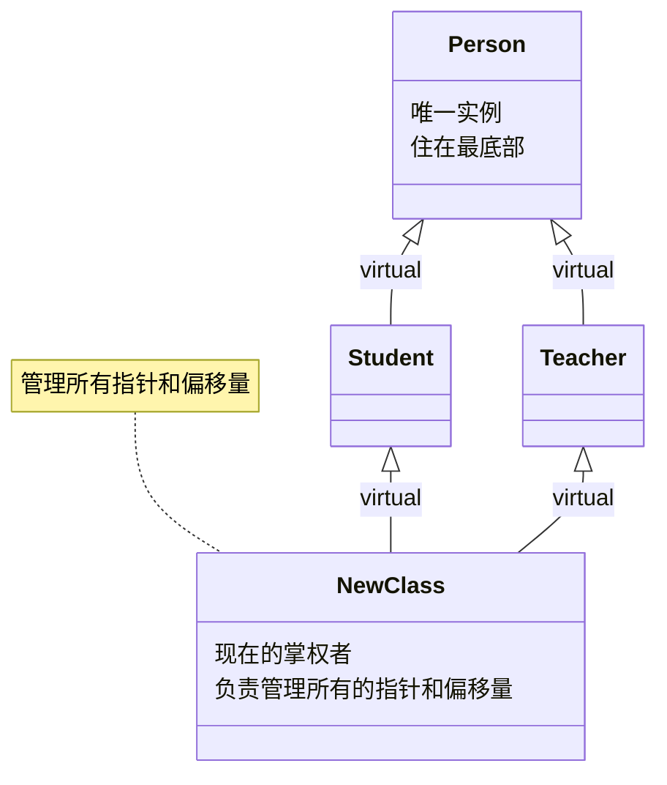

组合（Composition）、继承（Inheritance）和多态（Polymorphism）是C++中面向对象编程（OOP）的三大支柱。

之前只在大学课本上学到一点皮毛，在此做复习和深入挖掘。

## 组合 (Composition)物理嵌套与高效复用

**组合**描述的是一种“有一个 (Has-a)”的关系。在 C++ 中，当我们将一个类的对象作为另一个类的数据成员时，就形成了组合。

从内存布局的角度来看，组合体现为**物理上的直接嵌套**：成员对象的所有数据成员被完整地包含在宿主对象的内存空间内。这意味着，如果你在栈上创建一个宿主对象，其组合的所有成员也都在栈上；同理，若宿主在堆上，成员也在堆上。

这种布局方式带来了极高的执行效率，因为数据在内存中是连续存放的，极大提高了 CPU 的缓存命中率。

在初始化逻辑上，C++ 遵循严格的顺序：**成员对象先构造，宿主对象后构造**；析构时则完全相反。设计上，C++ 社区推崇“优先使用组合而非继承”，因为组合是一种“黑盒复用”，宿主类只需关心成员类的公共接口，而不需要了解其内部实现，这大大降低了代码间的耦合度。

```cpp
class Engine { /* 引擎数据 */ };

class Car {
private:
    Engine engine; // Car 组合了 Engine
};
```

如果你在栈上创建一个 `Car` 对象，那么 `Engine` 的数据会**直接包含**在 `Car` 的内存块内部。

**设计原则**：**优先使用组合，而不是继承**。组合耦合度低，灵活性高。

**生命周期**：成员对象（Engine）随宿主对象（Car）的创建而创建，随其销毁而销毁。

## 继承 (Inheritance)：结构延伸与逻辑分类

**继承**建立的是一种“是一个 (Is-a)”的关系，允许你基于已有的类创建新类，从而复用代码。它允许子类继承父类的属性和行为。

```cpp
class Animal {
public:
    int age;
    void eat() { std::cout << "Eating..."; }
};

class Cat : public Animal { // Cat 继承自 Animal
public:
    void meow() { std::cout << "Meow!"; }
};
```

派生类（Cat）的内存结构是：**父类的数据成员 + 派生类特有的数据成员**。

**核心逻辑**：

- **可见性**：`public` 继承表示父类的公有成员在子类中依然公有。
- **构造顺序**：先调用父类构造函数，再调用子类构造函数。析构顺序则相反。

在内存层面，继承表现为**结构的延伸**：子类对象的内存块头部通常包含了一个完整的父类对象副本，随后才是子类特有的数据成员。这种“头部对齐”的特性使得父类指针能够安全地指向子类对象的起始地址。

继承被称为“白盒复用”，因为子类往往能够看到父类的 `protected` 成员，这虽然增强了灵活性，但也导致了较高的耦合——父类的任何微小改动都可能波及整个继承链。

C++ 的继承体系遵循**“先父后子”**的构造原则：系统必须先确保基类部分初始化完成，才能开始子类部分的构建。

### 菱形继承问题与虚继承

当一个类（基类 A）被两个子类（B 和 C）继承，而又有一个类（D）同时继承这两个子类时，继承图的形状就像一个菱形。

>  举个栗子：
>
> - **Person (人)**：基类
> - **Student (学生)**：继承自 Person
> - **Teacher (老师)**：继承自 Person
> - **TeachingAssistant (助教)**：既是学生也是老师，同时继承自 Student 和 Teacher

**二义性与冗余**

如果不做特殊处理，菱形继承会导致严重的内存问题。我们来看这段会报错的代码：

```cpp
#include <iostream>
#include <string>

class Person {
public:
    std::string name;
};

class Student : public Person {};
class Teacher : public Person {};

class TA : public Student, public Teacher {};

int main() {
    TA ta;
    // ta.name = "小明"; // 报错！编译失败：二义性 (ambiguous)
    
    // 你必须这样写，编译器才知道你要改哪个“分身”的名字：
    ta.Student::name = "学生小明";
    ta.Teacher::name = "老师小明";
    
    return 0;
}
```

在内存中，`TA` 对象内部包含了两个 `Person` 的副本：

1. 一个是从 `Student` 路径继承下来的 `Person`。
2. 一个是从 `Teacher` 路径继承下来的 `Person`

**二义性**：当你访问 `ta.name` 时，编译器不知道你是要访问 Student 里的 name 还是 Teacher 里的 name。

**资源浪费**：如果 `Person` 很大（比如包含 100MB 的头像数据），那么 `TA` 对象就会无谓地占用 200MB 内存。

#### 虚继承 (Virtual Inheritance)

为了解决这个问题，C++ 引入了 **虚继承**。我们只需要在中间层（Student 和 Teacher）继承时加上 `virtual` 关键字。

```cpp
class Person {
public:
    std::string name;
    Person() { std::cout << "构造了一个 Person\n"; }
};

// 【关键】虚继承
class Student : virtual public Person {};
class Teacher : virtual public Person {};

class TA : public Student, public Teacher {};

int main() {
    TA ta;
    ta.name = "小明"; // 现在成功了！全局唯一
    std::cout << "TA 的名字是: " << ta.name << std::endl;
    return 0;
}
```

#### 虚基类指针 (vbptr)

当你使用了 `virtual` 继承，内存布局发生了翻天覆地的变化：

1. **内存合并**：编译器不再把 `Person` 放在 `Student` 和 `Teacher` 的“身体里”，而是把唯一的 `Person` 放在内存的**最末端**（作为公共资源）。
2. **引入指针**：`Student` 和 `Teacher` 内部不再存 `Person` 的数据，而是各存了一个 **虚基类指针 (vbptr, virtual base pointer)**。
3. **查找偏移**：这个指针指向一张 **虚基类表 (vbtable)**，表里记录了“从当前位置到公共 `Person` 数据的距离（偏移量）”。

如下列示例代码所示：

```cpp
#include <iostream>

// 基类：4 字节
class Base {
    int data; 
};

// --- 情况 1：普通菱形继承 ---
class A1 : public Base {};
class B1 : public Base {};
class C1 : public A1, public B1 {};

// --- 情况 2：虚继承 ---
class A2 : virtual public Base {};
class B2 : virtual public Base {};
class C2 : public A2, public B2 {};

int main() {
    std::cout << "--- 普通继承 ---" << std::endl;
    std::cout << "Base 大小: " << sizeof(Base) << std::endl;
    std::cout << "A1 (普通) 大小: " << sizeof(A1) << std::endl;
    std::cout << "C1 (普通) 大小: " << sizeof(C1) << std::endl;

    std::cout << "\n--- 虚继承 ---" << std::endl;
    std::cout << "A2 (虚继承) 大小: " << sizeof(A2) << std::endl;
    std::cout << "C2 (虚继承) 大小: " << sizeof(C2) << std::endl;

    return 0;
}
```

运行后会发现：

| **类**        | **大小 (Bytes)** | **内存组成拆解**                                 |
| :------------ | ---------------- | ------------------------------------------------ |
| **Base**      | **4**            | 1 个 `int`                                       |
| **A1** (普通) | **4**            | 继承了 Base 的 1 个 `int`                        |
| **C1** (普通) | **8**            | A1 的 `int` + B1 的 `int` (冗余了！)             |
| **A2** (虚)   | **12 或 16**     | **vbptr (8字节)** + Base 的 `int` (4字节) + 补齐 |
| **C2** (虚)   | **24 或 32**     | **A2的vbptr + B2的vbptr + 唯一的Base(int)**      |

虚继承不是为了消除冗余吗？为什么 C2 反而比 C1 大这么多？

**空间换唯一性**：虽然我们消除了重复的 `Base::data`，但为了能在运行时找到那个唯一的 `Base`，编译器不得不给每个参与虚继承的对象塞进一个 **虚基类指针 (vbptr)**。

**指针的代价**：在 64 位系统下，一个指针就是 8 字节。在我们的例子中，`Base` 本身才 4 字节。为了节省 4 字节的冗余，我们引入了 8 字节的指针。

当你在内存中观察 `C2` 对象时，它的排布大约是这样的：

- **[ 0 - 7 字节 ]**: `vbptr` (属于 A2 部分)，指向一张偏移量表。
- **[ 8 - 15 字节 ]**: `vbptr` (属于 B2 部分)，指向另一张偏移量表。
- **[ 16 - 19 字节 ]**: **唯一的 Base::data**。它是被“共享”的。
- **[ 20 - 23 字节 ]**: 内存填充（Padding），为了对齐。

**这就是为什么它叫“虚”继承：** 在普通继承中，父类就在子类的“身体”里，位置是死的； 在虚继承中，父类被踢到了对象的末尾，子类通过指针“虚”地指向它。无论继承链多复杂，大家都指向这同一个末尾。

既然虚继承有额外的内存和寻址开销，则使用时应该遵循以下原则：

- **不要滥用**：只有当你确定会出现“菱形结构”且基类数据很大、必须唯一时才使用。
- **架构设计**：在设计大型插件系统或接口树（如 `iostream` 库中的 `ios` 基类）时，虚继承是处理多重职责合并的神器。

### 多层虚继承

如果现在我们创建了一个新类 `NewClass`，让它**虚继承**自 `Student` 和 `Teacher`（而这两者已经虚继承了 `Person`），这种情况被称为**“多层虚继承”**。

在这种情况下，会发生以下三件核心的事情：

#### 全局唯一性依然锁定

无论你的继承链条有多深（A -> B -> C -> D...），只要所有的继承路径都打上了 `virtual` 标签，那么在最终的对象（`NewClass`）内存里，**顶层基类 `Person` 永远只有一份**。

它不会因为 `Student` 和 `Teacher` 被再次虚继承而变成两份。编译器会像“收纳大师”一样，把最底层的 `Person` 踢到整个 `NewClass` 对象的**最末尾**，作为所有上层类共享的公共资源。

#### 内存布局的变化：更多的“地图”

当你让 `NewClass` 虚继承 `Student` 和 `Teacher` 时，`NewClass` 对象的内部结构会变得更加模块化：

**vbptr（虚基类指针）会增多**：

- `Student` 部分有一个 `vbptr`，用来找 `Person`。
- `Teacher` 部分有一个 `vbptr`，用来找 `Person`。
- **新增：** `NewClass` 也会拥有自己的 `vbptr`（或者复用现有的），用来在运行时寻找它的虚基类 `Student` 和 `Teacher`。

**间接层增加**： 现在，如果你想在 `NewClass` 中访问 `Person` 的数据，CPU 需要经过两次查找：

1. 查看 `NewClass` 的表，找到 `Student` 的位置。
2. 查看 `Student` 的表，找到 `Person` 的位置。 （现代编译器通常会进行优化，将这些偏移量合并到一张大表里，实现“一步到位”，但逻辑上它是多层的。）

#### 初始化责任的“权力移交”

这是 C++ 语法中最坑的一点，也是多层虚继承的必考点：**初始化虚基类的责任，永远属于“最底层”的派生类。**

- **普通继承中**：`NewClass` 负责初始化 `Student`，`Student` 负责初始化 `Person`。
- **虚继承中**：`Student` 和 `Teacher` 对 `Person` 的初始化调用在此时会被**直接忽略**！
- **谁负责？**：必须由 **`NewClass`** 的构造函数直接显式调用 `Person` 的构造函数。

因为 `Person` 是共享的，如果由 `Student` 和 `Teacher` 分别去初始化，那 `Person` 到底听谁的？为了避免打架，C++ 规定：谁最后承载这个完整的对象，谁就负责最顶层虚基类的构造。

这种情况在工程中被称为 **“虚继承格 (Virtual Inheritance Lattice)”**。它的内存形状从简单的“菱形”变成了多层的“网格”：



**唯一性**：无论嵌套多少层，`virtual` 保证了最顶层的那个共享基类在内存里只有一份拷贝。

**指针开销**：每一层虚继承都会引入额外的 `vbptr` 或增加 `vbtable` 的条目，这会让对象变“胖”，且访问成员变量的速度变慢（因为需要计算偏移）。

**构造权限**：最底层的类（`NewClass`）夺取了对祖先类（`Person`）的初始化主权。

> [!note]
>
> **为什么 C++ 程序员通常会尽量避免深层的多重虚继承?**
>
> 它虽然完美解决了数据冗余问题，但带来的内存布局复杂度和性能损耗就像“套娃”一样，层数越多，系统开销和理解成本就越高。

## 动态多态 (Dynamic Polymorphism)：运行时的行为分发

**多态**是面向对象编程中最具魔力的部分，它允许你**通过父类的指针或引用，去调用子类重写的方法**。

C++ 的动态多态主要依赖于 **虚函数 (Virtual Function)** 机制。当一个类声明了虚函数，编译器会为该类生成一张**虚函数表 (vtable)**，表中存储了该类所有虚函数的实际入口地址。同时，每个该类的对象实例在内存的起始位置都会被秘密安插一个**虚表指针 (vptr)**，指向对应的虚函数表。

每个**对象**（在堆上或栈上）的内存起始位置，都会多出 8 字节（64位系统）来存放指向该类 `vtable` 的指针`vptr`。

当通过基类指针调用虚函数时，程序不再是简单的代码跳转，而是经历一次“间接寻址”：首先根据对象的 `vptr` 找到 `vtable`，再根据偏移量从表中提取正确的函数地址。这是实现多态的关键，但也带来了一定的运行时开销。

```cpp
class Shape {
public:
    virtual void draw() { std::cout << "画一个形状" << std::endl; }
    virtual ~Shape() {} // 重要：虚析构函数防止内存泄漏
};

class Circle : public Shape {
public:
    void draw() override { std::cout << "画一个圆" << std::endl; }
};

void render(Shape* s) {
    s->draw(); // 运行时决定调用哪个 draw
}
```

当你调用 `s->draw()` 时，程序会：

1. 顺着指针 `s` 找到对象。
2. 找到对象头部的 `vptr`。
3. 通过 `vptr` 查 `vtable`。
4. 跳到正确的函数地址执行。

### 为什么多态通常要配合堆对象和指针？

```cpp
void slice(Base b) { b.show(); }    // 值传递：发生“对象切片”
void poly(Base* b) { b->show(); }   // 指针传递：保留虚表指针
```

**多态必须配合指针或引用使用**，因为如果直接进行值传递（存放在栈上的普通对象赋值），会发生“对象切片 (Slicing)”现象——子类的特有数据和 `vptr` 会被丢弃，导致对象退化为基类，多态特性随之丧失。**指针或引用**只是一把“钥匙”，它能指向堆上更完整的子类对象，并能通过 `vptr` 找到正确的函数。

### 虚析构函数的必要性

```cpp
// 接口（多态的基础）
class Tool {
public:
    virtual void work() = 0; // 纯虚函数
    virtual ~Tool() {}
};

// 具体的零件（用于组合）
class Battery { public: int power = 100; };

// 具体的实现（继承自 Tool）
class Drill : public Tool {
private:
    Battery battery; // 【组合】：钻机有一个电池
public:
    void work() override { std::cout << "钻头转动中..." << std::endl; } // 【多态重写】
};

// 使用
Tool* myTool = new Drill(); // 多态调用
myTool->work();
delete myTool; // 安全析构
```

在多态体系中，**虚析构函数**是防止内存泄漏的最后一道防线。当一个类可能被继承且被多态使用时，必须将其**析构函数**声明为 `virtual`。这是因为，当我们通过基类指针 `delete` 一个派生类对象时，如果析构函数不是虚函数，编译器将执行“静态绑定”，仅调用基类的析构函数。

在这种情况下，派生类中特有的资源（如派生类在堆上申请的内存、打开的文件句柄等）将永远不会被释放。而一旦将基类析构函数设为 `virtual`，`delete` 操作就会通过虚函数表找到派生类的析构函数。派生类析构函数执行完毕后，会自动向上调用基类的析构函数，从而确保整个对象树的所有部分都能被完整、干净地清理。

### virtual关键字

在 C++ 之父 Bjarne Stroustrup 的设计哲学中，`virtual` 代表一种**“间接层”**。

- **虚函数**是函数的间接化：你不直接调用函数，而是通过表去“查”函数。
- **虚继承**是数据的间接化：你不直接定位成员，而是通过表去“查”成员在内存里的偏移。

计算机科学中有一句名言：

> "Any problem in computer science can be solved with another layer of indirection."
>
>  (计算机科学中的任何问题都可以通过增加一个间接层来解决。)

在 C++ 中，`virtual` 这个关键字的本质含义是**“推迟到运行时再决定”**。虽然“虚函数”和“虚继承”共享同一个关键字，但它们推迟决定的内容完全不同：

- **虚函数**推迟决定的是：**“我要执行哪段代码？”**（行为多态）
- **虚继承**推迟决定的是：**“我的父类数据在哪？”**（结构共享）

 虚函数 (Virtual Function) —— 解决“调用谁”

虚函数是为了实现**动态多态**。当你通过父类指针调用一个虚函数时，编译器在编译阶段并不知道你指向的是哪个子类。

虚函数的核心机制是vtable (虚函数表)，vtable中存放的是函数的内存地址。

**查找逻辑**：`vptr` -> `vtable` -> **跳转到对应的代码段 (Code Segment)** 执行。

虚继承 (Virtual Inheritance) —— 解决“在哪找”

虚继承是为了解决**菱形继承中的冗余**。由于虚基类（如 `Person`）被多个路径共享，它在派生类（如 `TA`）的内存布局中位置是不固定的。

虚继承的核心机制是**vbtable (虚基类表)**，`vbtable` 中存放的是**偏移量 (Offset)**（即：从当前位置加/减多少字节能找到那个共享的基类）。

**查找逻辑**：`vbptr` -> `vbtable` -> **计算出数据在堆/栈中的内存偏移** -> 访问成员变量。

| **特性**         | **虚函数 (Virtual Function)** | **虚继承 (Virtual Inheritance)**  |
| ---------------- | ----------------------------- | --------------------------------- |
| **解决的问题**   | 成员函数的**多态调用**        | 基类成员变量的**存储冗余/二义性** |
| **推迟的内容**   | 函数的**入口地址**            | 基类子对象的**内存偏移量**        |
| **引入的指针**   | `vptr` (虚函数表指针)         | `vbptr` (虚基类表指针)            |
| **指向的表**     | `vtable` (存放函数指针)       | `vbtable` (存放字节偏移值)        |
| **对大小的影响** | 增加一个指针大小              | 增加一个或多个指针大小            |
| **性能损耗点**   | 额外的函数跳转（间接调用）    | 额外的地址计算（间接寻址）        |

一个类可以既有虚函数，又被虚继承。在这种情况下，对象的内存布局会变得异常复杂：它可能既包含 `vptr`，又包含 `vbptr`。

> [!tip]
>
> **现代编译器优化：** 许多现代编译器（如 GCC/Clang 使用的 Itanium C++ ABI）为了节省空间，会把 `vbtable` 的功能合并进 `vtable` 中。也就是说，一个指针（vptr）可能既用来找虚函数，也用来找虚基类的偏移。但这不改变它们逻辑上的分离。

### vtable和vbtable存放在哪里

这些表（`vtable` 和 `vbtable`）既不在**栈**上，也不在**堆**上。它们存放于内存五个区域中的：**只读数据段（Read-Only Data Segment）**，在 Linux 系统底层通常被称为 `.rodata` 段。

在 C++ 程序运行时的内存布局中，`vtable` 和 `vbtable` 的位置如下：

**只读数据段 (.rodata)**：存放 **vtable** 和 **vbtable**。

- **理由**：这些表是由编译器在**编译阶段**生成的。由于一个类的所有对象共享同一份虚函数地址，且这些地址在程序运行期间不会改变，因此放在只读区既能节省空间（所有对象共用一份），又能防止被意外修改。

**对象所在区（栈或堆）**：存放 **vptr** 和 **vbptr**（即指向表的指针）。

- 如果你在函数里写 `Circle c;`，`vptr` 就在**栈**上。
- 如果你写 `Shape* s = new Circle();`，`vptr` 就在**堆**上的对象头部。

**代码段 (.text)**：存放虚函数本身的**机器指令**。

- `vtable` 里的条目只是指向这些指令起始位置的“门牌号”。

| **内存区域**             | **存放内容**            | **生命周期**     | **管理方式** | **包含的 OOP 元素**                       |
| ------------------------ | ----------------------- | ---------------- | ------------ | ----------------------------------------- |
| **栈 (Stack)**           | 局部变量、函数参数      | 函数结束即销毁   | 系统自动     | 栈对象、`vptr` 指针、`vbptr` 指针         |
| **堆 (Heap)**            | `new` 出来的对象        | 随 `delete` 销毁 | 程序员手动   | 堆对象及其内部的 `vptr`                   |
| **全局/静态存储区**      | 全局变量、`static` 变量 | 程序结束销毁     | 系统自动     | 单例对象、静态成员变量                    |
| **只读数据区 (.rodata)** | 常量、字符串字面量      | 永久             | 系统自动     | **vtable (虚表)**、**vbtable (虚基类表)** |
| **代码区 (.text)**       | 函数二进制指令          | 永久             | 系统自动     | 成员函数、静态函数、虚函数代码            |

### 多重继承下的多指针

上面的结论提到一个继承了虚函数对象有一个 `vptr`，但实际上在**多重继承**中，这个结论是错的。

假设你有两个独立的基类，它们都有自己的虚函数：

```cpp
class Base1 {
public:
    virtual void func1() { std::cout << "Base1::func1" << std::endl; }
    int data1;
};

class Base2 {
public:
    virtual void func2() { std::cout << "Base2::func2" << std::endl; }
    int data2;
};

// 派生类同时继承两者
class Derived : public Base1, public Base2 {
public:
    void func1() override { std::cout << "Derived::func1" << std::endl; }
    void func2() override { std::cout << "Derived::func2" << std::endl; }
    int data3;
};
```

此时会出现一个矛盾点：

当你把 `Derived*` 转成 `Base1*` 时，代码期望在指针开头看到 `Base1` 的虚表。

当你把 `Derived*` 转成 `Base2*` 时，代码期望在指针开头看到 `Base2` 的虚表。

如果只有一个 `vptr`，它只能指向一张表。那么 `Base2` 路径的调用就会彻底乱套，因为它会在 `Base1` 的表里寻找 `func2`。

为了解决这个问题，编译器将 `Derived` 对象拆分成了多个“基类子对象”。在 64 位系统下，`Derived` 的内存长相大约是这样的：

| **偏移量**  | **内容**    | **说明**                                                     |
| ----------- | ----------- | ------------------------------------------------------------ |
| **0 - 7**   | **vptr1**   | 指向 `Derived` 的第一张虚表（包含 Base1 和 Derived 自己的函数） |
| **8 - 11**  | **data1**   | Base1 的成员变量                                             |
| **12 - 15** | *(Padding)* | 内存对齐                                                     |
| **16 - 23** | **vptr2**   | 指向 `Derived` 的第二张虚表（专门负责 Base2 路径的跳转）     |
| **24 - 27** | **data2**   | Base2 的成员变量                                             |
| **28 - 31** | **data3**   | Derived 自己的成员变量                                       |

一个 `Derived` 对象里有两个虚表指针。如果你再继承一个 `Base3`，就会有第三个。

当你进行指针类型转换时，**指针的数值实际上发生了改变**：

```cpp
Derived* d = new Derived();
Base1* b1 = d;            // b1 的地址和 d 是一样的（指向对象开头）
Base2* b2 = d;            // 重点：b2 的地址比 d 增加了 16 字节！
```

**b1** 指向对象的起始位置。那里刚好是 `vptr1`，符合 `Base1` 的预期。

**b2** 被编译器自动“挪”到了后面 16 字节处。那里刚好是 `vptr2`，符合 `Base2` 的预期。

这种自动调整地址的技术，确保了无论你把对象看作哪个父类，它都能在其“视角”的起始位置找到正确的虚表。

这里还有一个深层问题： 当通过 `Base2*` 调用 `func2` 时，执行的是 `Derived::func2`。但 `Derived::func2` 内部可能需要访问 `data1`（对象的开头）。 可是此时的 `this` 指针指向的是 `Base2` 的子对象（偏移了 16 字节的地方）。

**编译器如何解决？** 虚表里存的不仅仅是函数地址，有时是一段被称为 **“thunk”** 的简短机器码。

- 当调用通过 `vptr2` 发生时，程序先跳到 thunk。
- **thunk 做一件事**：把 `this` 指针减去 16，使其重新指向 `Derived` 对象的开头。
- 然后再跳转到真正的 `Derived::func2`。

---

### 基础概念补充

####  纯虚函数(Pure Virtual Function)

纯虚函数是一种特殊的虚函数，它在基类中**没有定义（没有实现）**，要求派生类必须自行实现。

**语法**：在虚函数声明后面加上 `= 0`。

```cpp
class Shape {
public:
    // 纯虚函数：我不知道怎么画一个“形状”，但我要求子类必须会画
    virtual void draw() = 0; 
    virtual ~Shape() {} 
};
```

在虚函数表（vtable）中，纯虚函数对应的位置通常存放的是一个**空指针（nullptr）**或者指向一个名为 `__pure_virtual_called` 的错误处理函数。这保证了程序在运行时如果不小心调用了它，会直接报错而不是乱跳地址。

#### 抽象类(Abstract Class)

只要一个类中包含**至少一个**纯虚函数，这个类就自动成为了**抽象类**。抽象类是类的“半成品”，不能独立存在（不能 new），必须被继承。

> [!caution]
>
> 抽象类**不能实例化对象**。
>
> `Shape s;` // **错误！** 编译器会报错，因为 Shape 是抽象的。
>
> `Shape* s = new Circle();` // **正确！** 你可以拥有指向抽象类的指针或引用。

它纯粹是为了给子类提供一个共同的“模版”或“基石”。

#### 接口 (Interface)

在 Java 或 C# 中有 `interface` 关键字，但在 C++ 中，接口是通过**特殊的抽象类**来实现的。接口是最高级的抽象，它不代表“是什么”，只代表“能做什么”。

**一个 C++ 接口通常满足以下条件**：

1. 没有任何成员变量（Data Members）。
2. 所有的成员函数都是**纯虚函数**（Pure Virtual）。
3. 有一个虚析构函数。

```cpp
// 这是一个“可飞行”的接口
class IFlyable {
public:
    virtual void takeOff() = 0;
    virtual void land() = 0;
    virtual ~IFlyable() {}
};

// 这是一个“可游泳”的接口
class ISwimmable {
public:
    virtual void swim() = 0;
    virtual ~ISwimmable() {}
};

// 具体的类：鸭子（既能飞又能游）
class Duck : public IFlyable, public ISwimmable {
public:
    void takeOff() override { /* ... */ }
    void land() override { /* ... */ }
    void swim() override { /* ... */ }
};
```

结合之前的多重继承的指针之谜，你会发现接口在 C++ 中非常强大：

**解耦**：你的函数可以只接收 `IFlyable*`，而不需要知道这个对象到底是“飞机”还是“鸭子”。

**安全性**：通过接口，你只暴露了对象的一部分能力。比如你把 `Duck` 对象传给一个只接受 `ISwimmable*` 的函数，那个函数就只能让鸭子游泳，而不能让它起飞。

**内存布局**：当你使用多个接口时，编译器会自动为每个接口生成一个 `vptr`。这保证了当你把 `Duck*` 转换成 `IFlyable*` 时，指针会自动偏移到对应的虚表位置。
