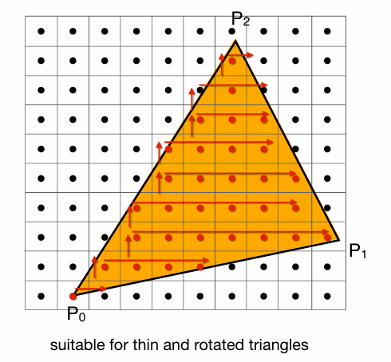
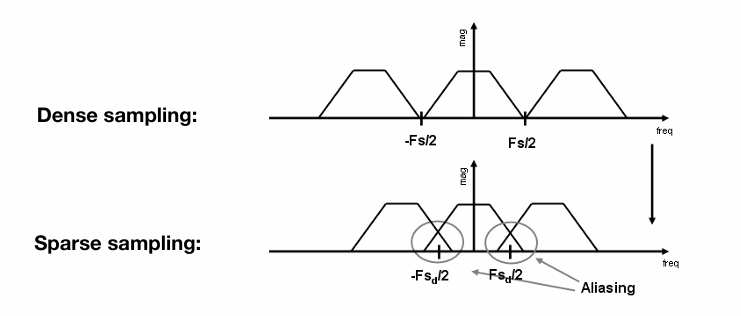

光栅化是将几何图元（如三角形）转换为屏幕像素的核心渲染过程，涉及视口变换等步骤，并依托于CRT、LCD、OLED等显示设备最终成像。 


# 什么是光栅化？ 

光栅化是 **将几何图元（如三角形、线段）转换为屏幕上的像素（或片元）的过程**，是实时3D渲染的核心步骤。它通过计算图元覆盖的像素区域，并插值顶点属性（颜色、深度等），最终生成可供显示的2D图像。


## 显示器模型

图形学中，屏幕就认为是一个装了像素的二维数组。如数组大小1920*1080，每个数组为一个像素点，像素是最小单位，每个像素由RBG的四维矩阵构成。


如上图所示像素的坐标以左下角为准，如图中蓝色像素坐标为（2，1）

像素的中心为（x+0.5,y+0.5）

## 视口变换

在进行了上节课的**透视投影变换**操作之后，所有物体都处在了[-1，1]³的立方体中，接下来就要把他画在屏幕上。


要将将[-1,1]³中的东西显示到屏幕上，我们可以考虑以下步骤：

- 暂时忽略z坐标
- 将[-1,1]²变换到xy平面[0, width] x [0, height]

这个过程称为视口变换，其矩阵示意如下:
$$
M_{\text{viewport}} = 
\begin{pmatrix}
\frac{width}{2} & 0               & 0 & \frac{width}{2}  \\
0               & \frac{height}{2} & 0 & \frac{height}{2} \\
0               & 0               & 1 & 0                \\
0               & 0               & 0 & 1
\end{pmatrix}
$$


## 现代光栅显示设备

**阴极射线管（CRT）**


**阴极射线管**（CRT） 的显像原理是通过电子枪发射电子束，在高压电场作用下轰击屏幕内表面的荧光粉涂层，使其发光从而逐行扫描成像。

这是一种技术成熟但结构复杂的早期主流显示技术。其特点非常鲜明：能够实现极高的对比度，色彩还原也相当饱满准确。然而，其固有的工作方式导致了明显的缺点，包括体积和重量巨大、功耗高，并且会产生一定的电磁辐射。随着平板显示技术的兴起，CRT 由于这些劣势已基本被市场淘汰，其主要应用曾广泛覆盖老式电脑显示器、电视机显像管以及部分示波器等专业仪器。

**液晶显示器（LCD）**


**液晶显示**（LCD）的基本原理是利用液晶分子的旋光特性调制背光源光线，其工作需要依赖外部背光源（如CCFL或LED）。此

类显示器在结构上相对轻薄且功耗较低，但在可视角度和对比度方面存在一定限制。根据液晶分子排列与驱动方式的不同，LCD主要衍生出三种子类型：TN面板响应速度快，但色彩表现和视角较差，适用于强调反应速度的电竞场景；IPS面板色彩还原准确、可视角度广阔，适合对色彩有严格要求的设计与专业用途；VA面板则在对比度方面表现突出，但响应时间相对较慢，常见于影音娱乐应用。

LCD技术广泛应用于常规显示器及早期智能手机等设备中。

**有机发光二极管（OLED）**


**有机发光二极管（OLED）** 显示技术的核心原理在于其每个像素点都能独立发光，无需依赖外部背光源。

这一特性带来了两大显著优点：一是能够实现像素级别的关闭，从而呈现极致的纯黑画面与理论上的无限对比度；二是其柔性基底材质使得屏幕可弯曲甚至可折叠。然而，该技术也存在固有缺点，即有机发光材料存在寿命限制，长时间显示静态画面可能导致“烧屏”现象。

根据驱动方式和基板材质的不同，OLED主要有两大子类型：**AMOLED**采用主动矩阵驱动，是目前智能手机的主流屏幕技术；**POLED**则使用塑料基板取代玻璃，专为实现柔性显示而设计，广泛应用于折叠屏手机。目前，OLED凭借其优异的显示效果，已成为高端智能手机和旗舰电视普遍采用的面板技术。

**电子墨水屏（E-Ink）**


**电子墨水（E Ink）** 显示技术的原理基于带电颜料颗粒在微胶囊中的电泳移动，通过施加电场控制黑白颗粒的位置来模拟传统墨水印刷的效果。

其最大特点是本身不发射光线，完全依靠环境光反射成像，因此视觉感受极为接近纸张，能实现极致的护眼效果和超低的功耗（仅在刷新画面时耗电）。然而，其刷新率极低，主要适用于显示静态或更新不频繁的内容，且目前主流产品多为黑白显示。

基于这些特性，电子墨水技术最主要的应用领域是**电纸书阅读器**（如亚马逊的Kindle），为长时间文本阅读提供了最接近实体书的体验。

## 三角形


**为什么光栅化选择了三角形？**

在计算机图形学中，光栅化流程选择三角形作为核心图元，是基于其在数学和计算上的完备性与高效性。三角形是最小的多边形，是几何不可再分的基础单元，任何复杂的多边形网格都可以被稳定地拆解为三角形的集合。其三个顶点天然确保其处于一个绝对平面内，避免了在光栅化时因顶点不共面而产生的歧义。判定一个点位于三角形“内部”还是“外部”的规则简单而明确，通常通过顶点环绕顺序即可定义，这为像素填充和遮挡测试提供了清晰依据。

更重要的是，三角形支持高效的线性插值：通过重心坐标系，三角形内任意一点的属性（如颜色、纹理坐标、深度等）都可以由三个顶点的属性进行平滑、可预测的插值计算得到，这为着色和渲染奠定了坚实的数学基础。

# 三角形绘制

在得到由三角形面组成的图形后，我们开始考虑：怎样将三角面绘制到像素格子的屏幕？


一个简单的方式是进行采样：

## 简单近似采样

**什么是采样？**

**采样（Sampling）** 是指将连续信号（如时间、空间上的函数）转换为离散数据的过程。在计算机图形学、信号处理、音频处理等领域，采样是数字化现实世界信息的关键步骤。简单来说采样就是**采样就是把一个函数离散化的过程**。


对于如上三角形，我们可以采取以下的方式进行像素绘制：在像素的中心进行采样，来判断中心是否落在三角形内，如果在三角形内则绘制该像素块，如果不在则不绘制该像素块。

> ps:对于边缘点一般会用一些特殊的方式处理，本章主要是传达光栅化的流程思想，此处不做讨论。

```cpp
for (int x = 0; x < xmax; ++x) 
  for (int y = 0; y < ymax; ++y) 
    image[x][y] = inside(tri, x + 0.5, y + 0.5);
```


## 计算优化方案

如果每绘制一个三角形都要对整个屏幕的所有像素点进行遍历采样，那性能开销是不可想象的，所以对于简单近似采样方法有一些优化计算方法：

**BoundingBox方法**


知道三角形三个顶点的坐标，有了Xmin，Ymin，Xmax，Ymax就可以得到蓝色的区域，只要遍历蓝色区域就可以进行相同的绘制效果。

**Incremental Triangle Traversal**



也可以通过一些计算方法，直接从三角形的边上开始一行一行扫描，这个方法更快，但是如何计算出三角形的边缘像素块需要一些特殊处理。

# 采样造成的问题


把到达光学元件上的光，产生的信息，离散成了像素，对这些像素采样，形成了照片，但是采样会造成很多问题，如上图所示，采样绘制后的三角形形状上大体相似，但是边缘却出现了大量的失真。

> [!note]
>
> 采样不只发生在位置上还能发生在时间上，比如视频和动画就是对图片的时间采样。


但是采样会造成诸多问题，我们将其称为“Sampling Artifacts  ”(Errors / Mistakes / Inaccuracies in  Computer Graphics)

比较典型的几种问题如锯齿化、摩尔纹、车轮效应等


造成这些现象的原因是：信号变化太快（剧烈），而采样的频率（速度）跟不上。

## 信号处理中的基础概念

### 频域与时域

为了解释上面的原因，这里引入两个概念：时域和频域

在信号处理和采样理论中，**时域（Time Domain）** 和 **频域（Frequency Domain）** 是分析信号的两种基本视角。它们通过数学变换（如傅里叶变换）相互关联，对理解采样、混叠（Aliasing）和重建（Reconstruction）至关重要。

时域表示信号随时间的变化，是直接观测到的原始形式，频域表示信号在不同频率上的能量分布，两种形式可以通过傅里叶变换互相转化。

### 傅里叶级数和傅里叶变换


#### 傅里叶级数（Fourier Series）

任何一个周期性的函数都可以变成一系列正弦/余弦的线性组合和一个常数项，在信号处理中的应用则是：将**周期性信号**分解为一系列**正弦波（Sine）和余弦波（Cosine）**的叠加。

#### 傅里叶变换（Fourier Transform）

可以把一个函数f（x）通过变化变成F（w），F（w）还能通过逆变换变成f（x）。**核心思想**：将**非周期信号**分解为**连续频率分量**的积分，是傅里叶级数在非周期信号上的推广。


举个栗子：


如上图所示：对五个不同频率的函数波形进行采样。通过f1(x)、f2(x)的采样点，我们可以大致还原出f1(x)\f2(x)的函数波形，但是从f3(x)开始，还原出的波形和原来的函数有较大出入，越往下越明显，这里就可以理解什么叫采样的频率跟不上信号变化的频率了。


对蓝色函数进行采样，得到黑色的函数，但假如原本就有这样一个黑色的函数，我们同时对蓝色和黑色进行采样，两个截然不同的函数，得到的采样结果完全相同。这种现象就叫做走样（Aliases）。

### 滤波

此处我们再引入一个概念：滤波。滤波就是抹掉一些特定的频率

如下面的原始图片的时域和频域数据：右边的图像就是左边的照片通过傅里叶变换得到的


频域数据的中间部分是低频信息，越往外越高频，观察可知该照片的信息主要集中在低频部分

#### 高通滤波

顾名思义就是允许高频通过的滤波，如下图所示


观察可知：高通滤波处理后图像只剩下了形状的轮廓，高频的信息在图像上一般表示的就是图像形状的边界。

#### 低通滤波

同理上述


观察可知：图像失去了明显的轮廓，变的模糊不堪，保留的低频信息在图像上对应的就是衣服皮肤等颜色相同/接近变化不明显的部分。

### 卷积

卷积操作是信号处理与计算机视觉中的核心工具，其本质可以直观地理解为**对信号（或图像）的局部提取与加权平均**。


如上图所示，一个三维的卷积核在输入信号上滑动，在每个位置与局部区域进行加权求和，从而生成一个新的、通常略被“压缩”的信号。

#### 卷积的一些定理


**时域的卷积 == 频域的乘积**

“时域的卷积等于频域的乘积”是信号处理领域的核心定理。

其直观解释如上图所示：**要对一幅图像进行滤波处理，存在两条等效的路径。**

第一种方法是直接在时域（即像素空间）进行操作，将图像与一个卷积核（滤波器）进行卷积计算。

第二种方法则利用了频域的高效性。首先，将原图像通过傅里叶变换转换到频域，得到其频率分布。同时，将卷积核也进行傅里叶变换。随后，在频域中，将两者对应的频率谱进行**逐点相乘**。这一乘法操作的结果，即是所需滤波效果在频域的体现。最后，将乘积结果通过逆傅里叶变换转换回时域，便可得到与直接卷积完全相同的输出图像。这一原理将复杂的卷积运算转化为更简单的乘法，是许多快速算法（如快速卷积）的理论基石。

> [!Important]
>
> 将3*3的滤波器乘1/9是为了不让图像整体的颜色发生变化。如果不乘1/9，那么每个像素就会是原来这个像素周围九个像素的和，图像就会越卷越明亮了。

### 总结


采样在时域与频域中呈现出清晰的镜像关系。左列展示时域过程：对原始连续信号（a）以一定间隔进行采样，得到离散样本序列（e）。采样过程由采样函数（c）控制。

右列则是对应的频域视角。原始信号的频谱（b）经采样后，其效果在频域体现为频谱的**周期性复制与延展**（d）。



采样频率决定了这些复制频谱副本间的间隔：采样越密集（频率越高），副本间距越大，越不易重叠；采样越稀疏（频率越低），副本间距越小，越容易发生**频谱混叠**。

混叠即上图中频谱副本相互重叠、相交的区域（f），它在时域中的表现就是**走样**——采样后重建的信号会失真，无法还原原始波形。因此，采样定理要求**采样频率必须至少是信号最高频率的两倍，以避免混叠，确保采样能完整保留原始信息**。

# 采样问题处理

## 反走样

在图形渲染中，**反走样** 的核心目标是减少因采样不足而产生的锯齿和失真。最直观的解决方案是提高物理采样率，例如使用 4K 甚至更高分辨率的显示器。这种方法相当于“大力出奇迹”——在采样定理的保证下，更高的采样密度能更精确地捕获信号细节，从而在物理层面降低走样。

然而，硬件条件往往有限。在屏幕分辨率固定的情况下，可以通过算法实现反走样。一个基础且有效的思路是**先模糊，再采样**。其原理在于，走样常源于图像中包含高于采样频率的高频信息（如锐利的边缘）。如果在采样前，先用低通滤波器对信号进行适度的模糊处理，过滤掉这部分会导致频谱混叠的高频成分，再进行采样，就能显著减少锯齿感。如图示，对边缘做模糊预处理后，采样重建出的阶梯感会变得平滑，从而达到视觉上反走样的效果。


想要完成该效果其实就是要使用一个低通滤波器对三角形进行一个卷积操作

但在屏幕显示的具体实现中，每一个像素点本质上是一个采样点，而每个像素在最终输出时只能呈现单一的颜色值。因此，“部分覆盖”这种连续信息无法被直接表达。为了解决这个问题，常见的近似方法是让像素的**灰度（或颜色强度）与其覆盖的图形面积成正比**。


如果一个像素只有一部分被三角形覆盖，那么该像素的颜色就会根据覆盖面积的比例，从背景色到图形色之间进行插值（例如呈现为灰色），而不是非黑即白。这种基于覆盖率的灰度调制，实质上是**在信号离散化（采样）之前，在连续域内进行了一次低通滤波的近似实现**，从而在视觉上模拟了抗锯齿的效果，让“稀疏采样”下的边缘也能显得较为平滑。

## 抗锯齿方法

### 基于超采样的方法（Supersampling）

在高于物理屏幕分辨率的尺度上进行渲染，之后通过滤波和下采样到目标分辨率，本质上是通过提高采样频率来减少走样。

#### SSAA（Supersampling Anti-Aliasing）

将整个场景以 *n*倍于目标分辨率（例如 4 倍）进行光栅化和着色，生成高分辨率中间图，再通过低通滤波器（通常为均值滤波）下采样到最终分辨率。

- 例如：4×SSAA 会在每个像素内对应 4 个子采样点，计算颜色后取平均，得到最终像素颜色。

该方法也属于力大转飞的类型，一般用于电源和CG等离线渲染的场景，游戏中很少使用。

#### MSAA（Multisample Anti-Aliasing）多重采样抗锯齿

只在**几何覆盖阶段**进行多重采样，每个像素存储多个样本的覆盖信息与深度，但在着色阶段通常只计算一次颜色（以像素中心或第一个样本为准），颜色在像素内被样本覆盖情况加权混合。

通过更多的样本来近似三角形的覆盖率，并不是提高采样频率

- 例如：4×MSAA 把一个像素分成 4 个子样本点，判断每个样本是否在三角形内，然后按覆盖率对三角形颜色进行混合。


该方法并不是提高了采样的频率，只是用来做第一步模糊，求三角形的覆盖率，平均之后是再用过度灰度去绘制。

在工业上并不是直接将每个像素平均分了四份，而是采用了一些独特的图形，而且一些边缘的像素还会被复用，以用于节省计算开销。

该方法是 DX11/OpenGL 时代实时游戏的主流抗锯齿方案，在性能与质量间取得较好平衡。

### 基于后处理（Post-Processing）

**核心思想**：在完成普通渲染后，对图像进行识别和处理，平滑锯齿边缘。

#### FXAA（Fast Approximate AA）快速近似抗锯齿

在完全渲染后的图像上进行**边缘检测**，识别出锯齿明显的区域，然后对其进行模糊或混合处理。

该方法完全独立于渲染管线，开销很小，适配性强，广泛用于性能敏感场景，如手游、主机游戏。

关于FXAA可以去看一下Games104第7讲，里面有一小节专门讲抗锯齿，讲的比较详细[Games104渲染管线与后处理](https://www.bilibili.com/video/BV1kY411P7QM/?share_source=copy_web&vd_source=b5b61a696da53c748b74998cb3c20d84&t=2199)

#### TAA（Temporal Anti-Aliasing）

利用**时间连续性**，将当前帧与历史帧（通过 Motion Vector 重投影对齐）进行混合，实现多帧累积的超采样效果。

TAA能以较低开销显著减少动态闪烁和锯齿，是目前 3A 游戏的主流实时方案。

但也可能引入“鬼影”（Ghosting）或运动模糊感，需配合适当的滤波与剔除策略。

**应用**：现代3A游戏（如《赛博朋克2077》）。

# 遮挡问题

之前一直是在屏幕上绘制一个三角形，但是当碰到几个三角形相互遮挡的时候应该怎样绘制呢？

## 画家算法

从直观上想，要实现三维物体在二维屏幕上的正确遮挡，最直接的思路就是模拟画家作画的步骤：先画远处的背景，再依次绘制更近的物体，用近处的覆盖远处的——这种方法就是**画家算法**。

如图所示，当场景中的物体存在明确的远近层次关系（如天空、远山、草原、湖泊、近处的森林）且互不交错时，画家算法是可行的：只要从远到近依次绘制，就能自然地得到正确的遮挡结果。


然而，画家算法的核心依赖是**全局的、确定的深度顺序**。一旦遇到多个物体在深度上相互交错、无法排出明确前后顺序的情况，算法就会失效。比如上图中的三个三角形互相重叠，彼此之间并没有一个全局的“谁完全在谁后面”的顺序。此时，无论按何种顺序绘制，都无法保证所有遮挡关系都正确——总会有一个三角形错误地遮挡了另一个本应更靠近观察者的部分。


因此，画家算法的局限性在于它无法处理**深度循环遮挡**或**物体交错**的情形。

## Z-Buffer

**Z-Buffer**（深度缓冲）方法是为了解决画家算法在复杂遮挡关系下的失效问题而提出的。其核心思想是不依赖物体绘制的全局顺序，而是通过逐像素比较深度值来决定最终的可见性。这种方法避免了因深度交错或循环遮挡导致的绘制顺序难题。

深度缓冲的实现依赖于两个核心组件：**帧缓冲**（Frame Buffer）与**深度缓冲**(Z-Buffer)。

帧缓冲用于存储每个像素的最终颜色输出，而深度缓冲则是一个与屏幕像素一一对应的缓冲区，用于记录每个像素位置当前最靠近观察者的深度值。


**算法初始化**：帧缓冲被填充为背景色，深度缓冲的所有值则被设置为最大深度（通常对应远裁剪面距离）。

**算法执行**：场景中的每个三角形依次被光栅化。对于三角形覆盖的每个像素位置，系统会计算该像素处的深度值，并与深度缓冲中已存储的深度进行比较。

- 如果当前深度小于缓冲中记录的深度（z < z_current），说明该三角形在该像素处更靠近观察者，此时深度缓冲和帧缓冲都会相应更新；
- 否则z >=z_current，该像素将被忽略。

这一过程完全独立于三角形的提交顺序，使得算法在硬件上易于并行化，成为现代GPU的标准功能。


尽管深度缓冲在实现上简洁高效，但它也存在明显的局限性。

其一是**深度冲突**问题：当两个表面在深度值上非常接近时，浮点数精度限制可能导致像素级别上的闪烁，即Z-fighting。

其二是无法正确处理**半透明物体**，因为透明渲染需要按从后往前的顺序进行颜色混合，而深度缓冲只保留最近深度，会破坏正确的混合顺序。因此在实际应用中，透明物体通常需要使用其他渲染技术单独处理。

> [!tip]
>
> 深度冲突类似于哈希冲突，都是在一系列计算后得到的深度值相同的情况