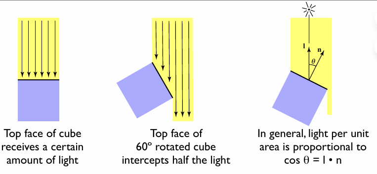
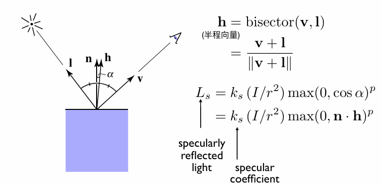
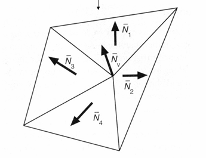
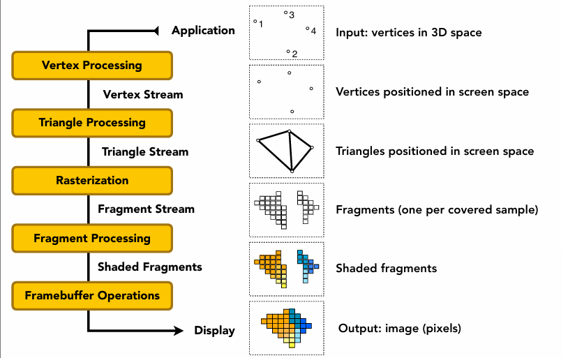

Shading是图形学中模拟光线与物体表面交互，计算颜色和明暗的技术。其核心包括局部着色模型，以及漫反射、镜面高光和环境光等基础光照现象的模拟，以实现逼真的视觉效果。 


Shading是图形学中决定物体表面外观的关键技术，它模拟光线与物体表面的交互过程。

## 什么是Shading？

Shading是指计算物体表面颜色和明暗的过程，通过模拟光线与材质相互作用来产生逼真的视觉效果。

## 局部着色（Shading is Local）


局部着色定义为：计算特定着色点处反射到相机的光线

其关键要素一般为：l  光线照射方向向量，n 着色点表面法向量，v 观察视角方向，以及一个关键的表面参数（比如颜色color，光泽度shininess）

## 基础光照现象


如上图所示，**镜面高光（Specular highlights）**在杯口和把手转折处形成明亮的聚焦光斑，体现了光滑表面对光源的直接反射；**漫反射（Diffuse reflection）**在杯身侧面形成均匀的色彩渐变，如淡绿色杯子柔和的明暗过渡，反映了朗伯体表面的均匀散射特性；**环境光（Ambient lighting）**则使背光面（如棕色杯子底部）保持基础可见性，代表间接光照的简化模拟。

### 漫反射与兰伯特余弦定律（Lambert's Cosine Law）


漫反射的光线均匀地向所有方向散射，从任何视角观察，表面颜色都保持一致。



理想漫反射表面接收和反射的光强，与表面法线和入射光方向夹角的余弦成正比。

- 物体表面法向量n，和光源方向l，的夹角θ，决定了明暗强度

- 可以把光当成能量，吸收的越多越亮

### 能量守恒与光线衰减（Light Falloff）


光的传播遵循能量守恒定理，假设最初点光源的光能量都集中在一个球壳上，一开始球壳的表面积很小，那么单位面积上光的能量就很多，光越向外扩散，单位面积的能量就越小。

基于小学二年级学过的表面积的公式可以得知：距离光源为r的球壳上，单位面积上能量为I/r²

### 漫反射光照公式解析

结合上面的余弦定理，就可以知道diffuse的公式
$$
L_{d} = \underbrace{k_d}_{\text{表面颜色}} \times \underbrace{\left(\frac{I}{r^2}\right)}_{\text{入射光强}} \times \underbrace{\max(0, \mathbf{n}\cdot\mathbf{l})}_{\text{角度衰减}}
$$

I/r² 表示有多少光到达了ShadingPoint（因为光会随着传播距离而衰减）

Kd表示了该点颜色的反射率

- 如果Kd=0，那么该点完全没有反射光出去，该点吸收了所有光，那么该点表现为黑色

- 如果Kd=1，那么该点反射了所有光，那么该点表现为白色

- 如果用RGB三个通道表示Kd，那么Kd就是Color

Max（0，**n·l**）表示反射角度，nl都是单位向量，**n·l** = cosθ，当入射光从表面下面照入，θ>90°，cos<0，这种情况没有意义，因为我们只考虑反射光，不考虑折射等光线，所以需要和0比，取最大值

举个栗子：当Kd试为RGB颜色值的时候

当Kd=0时，此时对应着RGB值是：[0, 0, 0]，在计算机里表示为黑色，黑色正是完全吸收光的颜色，反之，当Kd=1时，对应着 [255, 255, 255]，在计算机里表示为白色，白色正是完全反射光的颜色。


上图可以看到，点光源在左上角处，随着Kd越来越大，左上角的物体表面反射光能量越来越多，而右下角处于背光处，所以完全没有光，越往中间部分，法线方向与光照方向的夹角越来越大，所以接收的光能量越来越少，符合 Blinn-Phong 模型。

### 高光与镜面反射


反射的强度一般取决于观察的方向，一般在镜面反射方向附近最为明亮。高光的产生：**在物体表面的观察角度与光源角度正好是镜面对称时，即可看到高光**


抽象到计算机图形学中，可通过计算镜面反射方向 **R** 与观察方向 **V** 的接近程度来量化高光强度，然而直接计算反射向量 **R** 的运算量较大。Blinn-Phong 光照模型为此引入**半程向量** 来简化计算。



从几何关系可知，表面法线 **n** 是入射方向 **l** 与镜面反射方向 **R** 的角平分线方向，而该角平分线方向也可以通过入射方向 **l** 与观察方向 **V** 相加后单位化得到，这个新向量就是**半程向量 h**。通过比较法线 **n** 与半程向量 **h** 的夹角 **α** 即可间接反映 **V** 与 **R** 的对齐程度，其计算式为：
$$
\cos\alpha = \frac{\mathbf{n} \cdot \mathbf{h}}{|\mathbf{n}||\mathbf{h}|} = \mathbf{n} \cdot \mathbf{h}
$$
由于cos*α*∈[0,1]可以表示物体表面该点反射的高光强度，所以我们可以得到计算高光的公式：
$$
L_{s} = K_{s}\left(\frac{I}{r^{2}}\right)\max(0, \cos\alpha)^{p} = K_{s}\left(\frac{I}{r^{2}}\right)\max(0, \mathbf{n} \cdot \mathbf{h})^{p}
$$
其中，**Kₛ** 是镜面反射系数，决定了材质对高光的反射率，通常用 RGB 三元组表示，以支持彩色高光。

指数 **p** 用于控制高光的衰减速度，**p** 值越大，高光范围越集中，可模拟更锐利的光斑。该设计是为了模拟真实世界中高光通常只出现在表面极小的局部区域内，而余弦函数的自然衰减速度过慢，通过指数加速可实现视觉上更为真实的高光效果。


从如下图所示的参数影响上看，**Kₛ** 增大，整体高光亮度增强；**p** 增大，高光区域则明显缩小，更集中于反射方向周围。


传统 Phong 模型直接基于 **R** 与 **V** 的夹角进行计算，其高光分布与 Blinn-Phong 略有不同，后者由于采用半程向量，计算效率更高，且生成的高光通常更为柔和，在实时渲染中应用更广泛。两种模型在视觉效果上各具特点，可根据具体需求选择使用。

### 环境光照

环境光描述的是间接光照的效果：光线并非直接从光源照射到物体表面，而是在场景中经过多次反射、散射后，从四面八方抵达物体表面再进入观察者眼中。例如一个茶杯，即使在没有被光源直接照射到的暗部，仍可看到微弱的亮度和色彩，这就是环境光的作用。


由于真实的环境光计算极为复杂（涉及全局光照与光线弹射），Blinn-Phong 模型对其进行大幅简化：假设物体表面每一点接收到的环境光强度是均匀的，记为 $I_a$。同时，物体表面材质对环境光有一定的吸收和反射特性，用环境光反射系数 $k_a$（通常为一个 RGB 向量）表示。这样，环境光项可简化为：

$$
L_{a} = k_{a} I_{a}
$$

该项与光源位置、视线方向、表面法线均无关，仅取决于预设的环境光强度和物体自身的材质颜色，因此计算非常简单，常用来模拟基础的间接照明效果。

## Blinn-Phong 模型


Blinn-Phong 模型将物体表面某点的光照分为三个部分进行叠加：环境光、漫反射和高光。
$$
\begin{aligned}
L &= L_{a} + L_{d} + L_{s} \\
&= k_{a}I_{a} + k_{d}\left(\frac{I}{r^{2}}\right)\max(0, \mathbf{n} \cdot \mathbf{l}) + k_{s}\left(\frac{I}{r^{2}}\right)\max(0, \mathbf{n} \cdot \mathbf{h})^{p}
\end{aligned}
$$
可以拆分来看：

- **环境光**：由于环境光是常数，所以作用在物体的每一个点上都有相同的光强度效果。
- **漫反射**：与观察方向无关，只取决于光源方向 **l** 与表面法线 **n** 的夹角，模拟粗糙表面对光的均匀散射。
- **高光**：使用半程向量 **h** 简化计算，反映视线 **v** 与镜面反射方向接近时产生的亮斑，指数 p控制高光集中程度。

Blinn-Phong 模型因其计算高效、效果直观，成为早期实时图形学中最经典的光照模型之一，为后续基于物理的渲染模型奠定了基础。

## 着色方法


如上图所示，三个球具有完全相同的空间信息，着色频率不同后表现不一样，其代表的是三种不同的着色方式。

### Flat shading（平面着色）

Flat Shading是最基础、计算开销最低的着色方法。其核心思想是将每个多边形（通常是三角形）视为一个统一的、平坦的表面。


**计算步骤：**

1. **法线计算**：为每个三角形面片计算一个单一的“面法线”。这通常由三角形任意两条边向量的叉积得出，并进行归一化：`n = normalize(cross(v1 - v0, v2 - v0))`。

2. **光照计算**：选取该三角形上一个具有代表性的点（如几何中心、或任意一个顶点），使用完整的光照模型（例如结合了环境光、漫反射和高光项的Blinn-Phong模型）计算该点的颜色。

3. **统一着色**：将上一步计算得到的单一颜色值，赋予该三角形覆盖的所有像素。

Flat Shading的主要优势在于其极高的计算效率。由于每个三角形多边形仅需执行一次光照计算，并将其结果应用于整个面片，这种方法对计算资源的消耗极低，尤其适合早期计算能力有限的图形硬件。其实现逻辑简洁明了，为图形渲染提供了最基本但可靠的着色机制。

然而，这种效率的代价是视觉质量的显著损失。Flat Shading会产生明显的“面片化”效果，物体表面呈现出不连续的色块，完全无法模拟平滑曲面的外观。在表现高光等光照细节时尤为糟糕，镜面反射区域会呈现生硬的多边形轮廓，与真实世界中光滑表面自然的高光过渡相去甚远。

### Gouraud shading（高洛德着色）

Gouraud Shading通过颜色插值来模拟平滑着色，由法国计算机科学家Henri Gouraud于1971年提出。是对Flat Shading的一次重要改进。它将光照计算的频率从“逐面片”提升到了“逐顶点”。


**计算流程：**

1. **顶点法线与颜色计算**：
   - 为每个顶点计算或指定一个“顶点法线”。对于共享该顶点的所有面片的法线求平均，是常见方法。
   - 在每个顶点处，使用该顶点的法线和位置，独立计算完整的光照，得到该顶点的颜色值。
2. **颜色插值（重心坐标插值）**：
   - 在光栅化过程中，对于三角形内部的每一个像素，利用其重心坐标 `(α, β, γ)`对三个顶点的颜色进行线性插值： `C_pixel = α * C0 + β * C1 + γ * C2`
   - 这个过程是在屏幕空间进行的，与三角形本身的形状和大小解耦。
3. **输出**：将插值得到的颜色写入帧缓冲区。

Gouraud Shading在视觉质量上实现了质的飞跃。通过在每个顶点计算光照并进行颜色插值，它能够生成平滑渐变的色彩过渡，有效消除了令人生厌的面片感。与Flat Shading相比，它在适中的计算开销下提供了显著提升的视觉体验，每个顶点而非每个面片执行一次光照计算的设计，使其在当时的硬件条件下成为平滑着色的实用解决方案。

高洛德着色通过对顶点颜色进行插值，以适中的代价极大地消除了面片感，但其主要缺陷在于光照计算仅在顶点进行。对于高光等依赖于视线方向的细节，三角形内部通过颜色插值得到的效果往往是模糊和失真的，无法准确描绘小而锐利的镜面反射光斑。

### Phong着色（冯氏着色）

Phong Shading是目前在视觉质量上最精细的经典着色方法，由犹大学者Bui Tuong Phong于1973年提出。它将光照计算的频率进一步提升到了“逐像素”级别，但其核心创新在于**对法线向量进行插值**，而非对颜色进行插值。


**计算流程**：

1. **顶点法线传递**：在顶点处理阶段，将顶点的法线向量（通常经过模型-视图变换矩阵的逆转置矩阵校正，以保持正确方向）传递到光栅化阶段。
2. **法线插值**：
   - 在光栅化过程中，对三个顶点的法线向量进行插值，为三角形内部的每个像素计算一个**插值后的法线**： `n_pixel = normalize(α * n0 + β * n1 + γ * n2)`。
   - **归一化**步骤至关重要，因为插值得到的向量长度通常不为1。
3. **逐像素光照**：
   - 在片段着色器中，使用该像素的**插值后法线**、**该像素在世界或视图空间中的位置**（也需通过插值得到）以及其他光照参数，为**每一个像素独立执行一次完整的光照计算**。

Phong Shading代表了经典光照模型中最高的视觉保真度。其核心创新在于对法线向量而非颜色值进行插值，并将完整的光照计算推迟到每个像素执行。这一设计带来了革命性的改进：由于每个像素都基于其独特的、连续变化的法线进行独立计算，因此能够生成极其精确和锐利的高光，完美模拟光线在光滑表面的镜面反射行为，获得最接近物理真实的光照效果。

然而，这种质量的提升伴随着最大的计算成本。每个可见像素都需要执行一次可能包含向量运算、幂函数等复杂操作的光照计算，对处理能力提出了更高要求。尽管如此，在现代GPU强大的并行计算能力支持下，这一开销已被广泛接受，其奠定的“插值属性、逐像素计算”范式已成为现代图形管线的绝对核心。


在实际应用中，选择何种着色方法并非一个绝对的技术问题，而是对视觉质量、计算性能和模型几何复杂度三者进行的综合性权衡。这一决策的核心逻辑在于**着色频率与几何细节密度的匹配关系**。

当模型的三角形面数（几何细节）远超过屏幕像素数量时，每个三角形在屏幕上仅覆盖极少数像素，此时即使使用计算最简单的平面着色（Flat Shading），其固有的“面片化”瑕疵在像素级别也难以被察觉，而其极低的计算开销反而成为显著优势。反之，对于一个面数稀少的模型（例如一个仅由数百个三角形构成的球体），平面着色会产生极其明显的棱角外观，此时必须借助高洛德着色（Gouraud Shading）或冯氏着色（Phong Shading）的插值技术来模拟出平滑的曲面视觉效果。

### 求逐顶点的法线



求取逐顶点法线是计算机图形学中的一项基础而关键的操作，其核心思想是：**一个顶点的法线，应该代表其周围局部表面的平均朝向**。最常用和直观的方法是**面积加权平均法**。

**面积加权平均**

对于网格中的任意一个顶点，其法线并非直接来自某个三角形，而是由所有共享该顶点的三角形面片的法线加权平均后得到。使用**三角形的面积**作为权重是一种物理上更合理的方案，因为较大的面对顶点法线的贡献应该更大。
$$
N_{v} = \frac{\sum_{i} N_{i}}{\left\|\sum_{i} N_{i}\right\|}
$$

计算步骤：

1. **遍历每个三角形**，计算其面法线（通过两条边向量的叉积：`n_face = normalize(cross(v1 - v0, v2 - v0))`）。
2. **计算该三角形的面积**，通常取叉积向量模长的一半（即三角形面积）。这个面积值将作为该面法线的权重。
3. **对于每个顶点**，找出所有包含该顶点的三角形。将这些三角形的面法线，各自乘以其面积权重，然后相加，得到一个未归一化的总和向量。
4. 将得到的向量**归一化**，其结果即为该顶点的法线。

在现代图形渲染管线的实践中，**冯氏着色所确立的“插值属性，逐像素计算”范式已成为绝对主流**。今天的实时渲染几乎全部构建在这一思想框架之上：在顶点着色器中准备并输出世界空间法线、位置等关键属性，然后在片段着色器中进行最终的光照与材质计算。这种架构不仅完美实现了高质量的平滑着色，更因其灵活性和可扩展性，成为集成法线贴图、基于物理的渲染（PBR）、各向异性着色等一系列先进图形技术的基石。

## 图形管线/实时渲染管线



**1. 顶点处理**

顶点处理是渲染管线的起点，负责对三维模型进行一系列空间变换。它接收模型的原始顶点数据（通常定义在模型自身的局部坐标系中），通过**模型变换**将其放置于世界场景的适当位置与姿态。接着，根据虚拟摄像机的位置和方向，进行**视图变换**，将所有顶点转换到以摄像机为原点的观察坐标系。最后，通过**投影变换**（通常为透视或正交投影）将三维场景映射到规则的二维观察空间（裁剪空间），并最终转换为屏幕空间坐标，为后续步骤准备好带有深度信息的顶点。

**2. 三角形处理与图元装配**

此阶段将离散的顶点组织成基本的几何图元（主要是三角形）。系统将三个一组的相关顶点装配成三角形，并进行重要的**几何裁剪**。首先执行**背面剔除**，快速丢弃那些法线背对摄像机的三角形，这通常能立即移除约一半的不可见面。随后进行**视锥体裁剪**，精确剔除完全位于摄像机可视范围之外的三角形，并对与视锥体边界相交的三角形进行裁剪，生成新的多边形以确保其完全位于可见范围内。最终，输出一个完全位于屏幕可视区域内、且面向摄像机的有效三角形列表。

**3. 光栅化与插值**

光栅化是将连续的几何图元转换为离散的屏幕像素片段（Fragment）的过程。对于每个有效的三角形，系统确定其覆盖的像素区域，并为每个被覆盖的像素计算其**重心坐标**。利用重心坐标，可以对三角形三个顶点的所有属性（如颜色、纹理坐标、法线向量、深度等）进行平滑的线性插值，从而为每个像素生成一个拥有完整插值属性的**片段**。此阶段是连接几何与着色的桥梁，将矢量描述转化为可供着色的离散像素数据。

**4. 片段着色与计算**

片段着色是赋予像素颜色与外观的核心阶段，通常在可编程的片段着色器中执行。基于光栅化阶段提供的插值属性，着色器首先**采样纹理**，获取表面的基础颜色与物理材质属性。随后，结合光照信息（光源位置、强度、类型）和插值得到的法线，执行复杂的光照模型计算（如漫反射、镜面反射、环境光遮蔽等），模拟光线与表面的交互。最后，混合所有材质与光照计算结果，输出该片段的最终颜色值。此阶段决定了物体表面的视觉细节和质感。

**5. 测试、混合与后处理**

在片段颜色计算完成后，还需经过一系列测试与混合操作才能最终写入屏幕。**深度测试**（Z-Buffer）是其中最关键的一步，它通过比较当前片段的深度值与深度缓冲区中存储的值，决定其是否可见，从而正确解决三维场景中的遮挡关系。对于透明或半透明物体，则需要进行**混合**操作，将当前片段颜色与帧缓冲区中已有颜色按透明度进行合成。此后，管线会应用可选的**后处理效果**，如抗锯齿（MSAA、FXAA等）、色调映射、泛光、景深等全屏特效，以提升最终图像的视觉质量。所有处理完成后，数据被写入**帧缓冲区**，最终呈现为屏幕上的图像。

## Shader

现代GPU中，这套渲染管线某些部分是可编程的，可以由开发者去定义顶点/像素如何着色，也就是用代码控制如何着色，这部分代码就叫Shader。

Shader指定的是每一个像素/顶点如何着色，所以不能也不用去指定某一个像素如何着色。如果写的是顶点操作，这个shader就叫做VertexShader（顶点着色器），如果写的是像素操作，这个shader就叫做FragmentShader（片段/片元着色器）/PixelShader（像素着色器）。

```glsl
uniform sampler2D myTexture;    // 纹理采样器
uniform vec3 lightDir;          // 世界空间光源方向（应归一化）
varying vec2 uv;                // 纹理坐标（已插值）
varying vec3 norm;             // 顶点法线（应归一化）

void diffuseShader() {
  vec3 kd; 
  kd = texture2D(myTexture, uv).rgb; // 获取纹理颜色
  kd *= clamp(dot(-lightDir, norm), 0.0, 1.0); // 兰伯特余弦计算
  gl_FragColor = vec4(kd, 1.0);     // 输出最终颜色
}
```