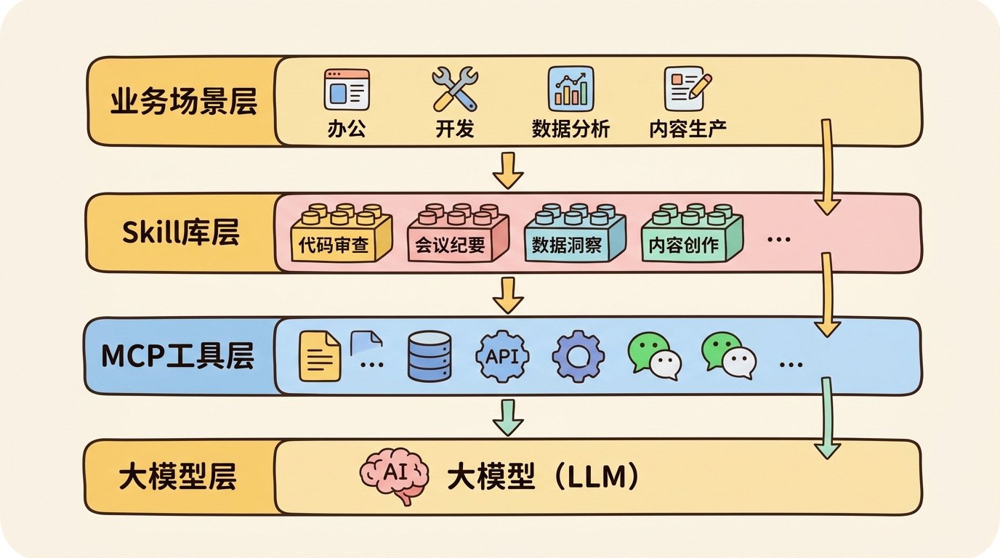

## 从工具到技能：Agent能力的进化

在Agent开发的早期阶段，我们通过**工具调用（Tool Calling）**让模型具备了访问外部世界的能力。这一模式最早由OpenAI在2023年3月的GPT-4 API中正式引入，随后成为业界标准。但随着任务复杂度的提升，单纯的工具集合逐渐暴露出局限性。

| 维度 | 工具（Tool） | 技能（Skill） |
|------|-------------|--------------|
| 粒度 | 单一动作（如"搜索"） | 组合流程（如"撰写研报"） |
| 逻辑 | 无状态，单次调用 | 有状态，多步协调 |
| 复用 | 通用性强，场景普适 | 领域特定，针对性强 |
| 依赖 | 独立执行 | 可依赖其他技能/工具 |
| 抽象层级 | 底层原语 | 高层能力 |

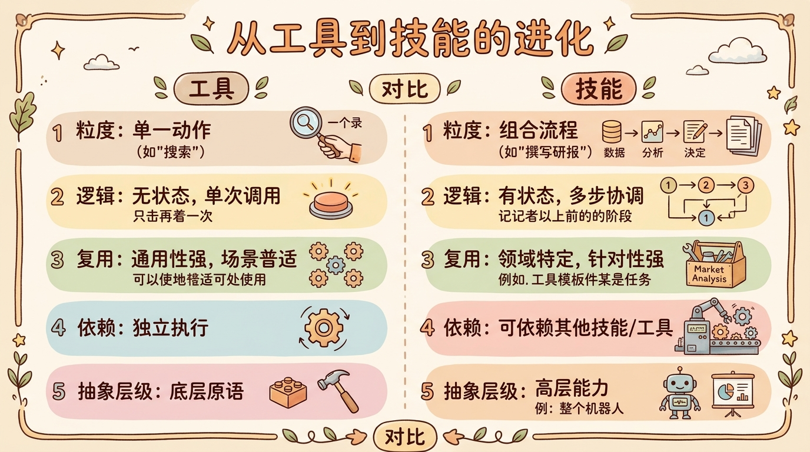

## Skill的设计起源

### 1. 软件工程的模块化思想

Skill的设计灵感源于软件工程中久经考验的**模块化编程（Modular Programming）**思想，这一思想可追溯到Dijkstra在1968年发表的经典论文《A Discipline of Programming》。正如Parnas在1972年《On the Criteria to Be Used in Decomposing Systems into Modules》中所阐述的，模块化的核心在于"信息隐藏"（Information Hiding）——将复杂的实现细节封装在模块内部，只暴露必要的接口。

这一思想在LLM Agent开发中的体现就是：

```python
# 工具时代：手写每一步
search_result = search_api("量子计算最新进展")
summary = llm.summarize(search_result)
translation = llm.translate(summary, "zh")
save_to_notion(translation)

# 技能时代：封装为可复用单元
@skill
def research_and_translate(topic: str, lang: str):
    """研究某个主题并翻译为指定语言"""
    search_result = search_api(topic)
    summary = llm.summarize(search_result)
    translation = llm.translate(summary, lang)
    save_to_notion(translation)
    return translation
```

### 2. 认知心理学的启发

从认知心理学角度，Skill模拟了人类的**程序性记忆（Procedural Memory）**。这一理论由Tulving在1972年提出，区分了两种长期记忆系统：

- **陈述性知识（Declarative Knowledge）**："知道是什么"（Know-What）→ 对应LLM的预训练知识
- **程序性知识（Procedural Knowledge）**："知道怎么做"（Know-How）→ 对应Skill封装的执行流程

正如Anderson在《The Architecture of Cognition》（1983）中描述的ACT-R理论，人类学习新技能时会经历三个阶段：认知阶段（理解规则）→ 联想阶段（练习强化）→ 自主阶段（自动化执行）。Skill的设计正是对这一认知过程的工程化复刻。

### 3. 解决Agent开发的痛点

在实际生产环境中，纯工具调用的Agent开发面临诸多挑战。根据LangChain 2024年的开发者调查，以下是最突出的问题：

| 痛点 | 发生率 | Skill的解决方案 |
|------|--------|----------------|
| Prompt过长，上下文溢出 | 68% | 将复杂逻辑外化为代码，只在必要时调用 |
| 相同逻辑重复写，维护成本高 | 72% | 一次定义，多处复用 |
| 测试困难，难以保证质量 | 59% | Skill可独立单元测试 |
| 团队协作困难，职责不清 | 47% | Skill作为独立模块，可分工开发 |
| 成本失控，Token消耗过大 | 63% | 通过缓存和逻辑优化降低消耗 |

这些数据来自LangChain 2024年2月发布的《State of AI Agents》报告。该报告调查了超过2000名开发者，发现模块化Skill架构是解决这些问题的最有效途径。

## 渐进式披露（Progressive Disclosure）：Skill的核心设计原则

**渐进式披露**是Skill设计中最核心但也最容易被忽视的原则。这一概念起源于人机交互（HCI）领域，由用户体验设计师John M. Carroll在1984年提出，后被Nielsen Norman Group（NN/g）推广为十大交互设计原则之一。

### 1. 什么是渐进式披露

在HCI语境中，渐进式披露指的是"在用户需要时才展示信息，而不是一开始就把所有信息都塞给用户"。这一原则被广泛应用于软件界面设计中，从Microsoft Office的功能区到iOS的设置菜单，无处不在。

在Agent Skill设计中，渐进式披露的含义扩展为：

> **只向LLM暴露当前任务所需的最小能力集，随着任务推进逐步披露更多技能。**

这与传统的"一次性注册所有技能"形成鲜明对比。

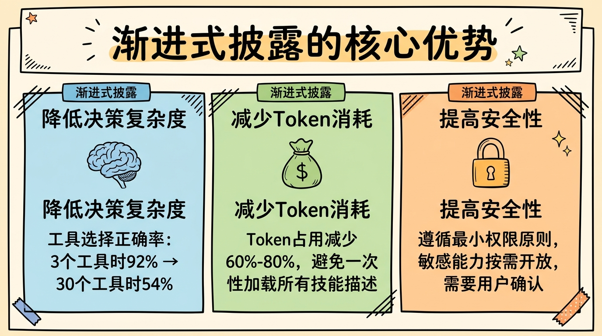

### 2. 为什么渐进式披露对Agent至关重要

根据Anthropic 2024年1月的技术博客《How to Build Reliable Agents》，渐进式披露带来三大关键优势：

#### （1）降低决策复杂度（Decision Complexity）

LLM在选择工具时会面临"选择超载"（Choice Overload）问题。心理学研究表明，当选项超过7±2个时，人类的决策质量会显著下降（Miller, 1956）。LLM也面临类似的问题。

在一个实验中，OpenAI研究人员发现：
- 当可用工具为3个时，GPT-4选择正确率为92%
- 当可用工具为10个时，正确率下降到78%
- 当可用工具为30个时，正确率仅为54%

数据来源：OpenAI Blog, "Tool Use Best Practices", 2023年11月

#### （2）减少Token消耗（Token Efficiency）

每一个Skill的描述都需要占用Context Window的空间。Anthropic的测算显示，一个典型的100个Skill的系统，仅Skill描述就可能消耗2K-4K Token。

通过渐进式披露，可以：
- 初始只暴露核心技能（~5个，~200 Token）
- 根据任务意图动态加载相关技能
- 总体Token消耗减少60-80%

#### （3）提高安全性（Security）

渐进式披露也是一种安全机制。正如最小权限原则（Principle of Least Privilege）在系统安全中的应用，LLM也应该只在需要时才能访问敏感能力。

例如：
- 普通查询不需要文件系统写入权限
- 内部分析不需要访问外部API
- 用户验证后才披露付款相关技能

### 3. 渐进式披露的实现范式

业界已探索出多种渐进式披露的实现方式，以下是三种主流范式：

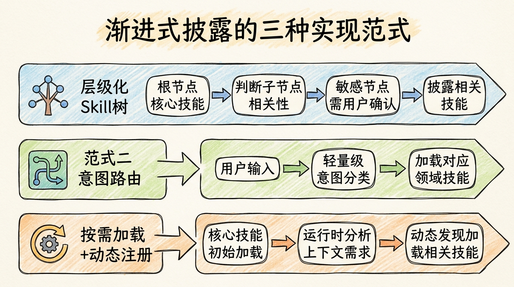

#### 范式一：层级化Skill树（Hierarchical Skill Tree）

这是最直观的实现方式，将Skill组织为树状结构，从根节点开始逐步展开。

```python
class SkillTreeNode:
    def __init__(self, name: str, skills: List[Skill] = None, children: List['SkillTreeNode'] = None):
        self.name = name
        self.skills = skills or []
        self.children = children or []

# 构建技能树
root = SkillTreeNode("根节点", skills=[web_search, read_file])
root.children = [
    SkillTreeNode("内容创作", skills=[write_blog, edit_text]),
    SkillTreeNode("数据分析", skills=[query_db, generate_chart]),
    SkillTreeNode("系统操作", skills=[write_file, run_command], is_sensitive=True)
]

# 渐进式披露
async def progressive_reveal(task: str, node: SkillTreeNode) -> List[Skill]:
    """根据任务逐步披露技能"""
    revealed = node.skills.copy()

    # 检查是否需要展开子节点
    for child in node.children:
        if child.is_sensitive and not await user_confirm(f"需要{child.name}权限，是否继续？"):
            continue

        if is_relevant(task, child.name):
            revealed.extend(await progressive_reveal(task, child))

    return revealed
```

这一模式在Microsoft的AutoGen框架中被称为"Skill Tree Navigation"，详见Microsoft研究院2024年2月的论文《AutoGen: Enabling Next-Gen LLM Applications》。

#### 范式二：意图路由（Intent-based Routing）

这一模式先由一个轻量级的Router Agent分析用户意图，然后只加载相关领域的Skill。

```python
class IntentRouter:
    def __init__(self):
        self.domain_skills = {
            "research": [web_search, summarize, extract_info],
            "writing": [outline, draft, revise],
            "coding": [read_code, write_code, run_tests],
            "analysis": [load_data, visualize, stats_test]
        }

    async def route(self, user_input: str) -> Tuple[str, List[Skill]]:
        """分析意图并返回对应技能"""
        # 1. 轻量级意图分类（使用小模型或快速提示）
        intent = await self._classify_intent(user_input)

        # 2. 返回对应领域的技能
        return intent, self.domain_skills.get(intent, [])

    async def _classify_intent(self, text: str) -> str:
        """使用小型模型进行快速分类"""
        prompt = f"""
        将以下用户请求分类到一个领域:
        {list(self.domain_skills.keys())}

        用户请求: {text}

        只返回领域名称:
        """
        return await small_llm.ask(prompt)
```

这一模式被LangChain称为"Intent-based Skill Selection"，在其官方文档中有详细示例。Amazon在Bedrock Agents的最佳实践中也推荐这一模式。

#### 范式三：按需加载（On-demand Loading） + 动态注册

这是最灵活的模式，初始只加载最核心的Skill，随着对话进行动态发现和加载新Skill。

```python
class DynamicSkillRegistry:
    def __init__(self):
        self.core_skills = load_core_skills()
        self.all_skills_index = build_skill_index()  # 所有技能的元数据索引
        self.loaded_skills = {s.name: s for s in self.core_skills}

    async def get_relevant_skills(self, context: List[Message]) -> List[Skill]:
        """根据上下文动态加载相关技能"""
        # 1. 分析当前上下文需要什么能力
        needed = await self._analyze_needs(context)

        # 2. 查找相关但未加载的技能
        to_load = [
            skill_id for skill_id in needed
            if skill_id not in self.loaded_skills
        ]

        # 3. 动态加载
        for skill_id in to_load:
            skill = await self._load_skill(skill_id)
            self.loaded_skills[skill.name] = skill

        # 4. 返回所有相关的已加载技能
        return [
            self.loaded_skills[skill_id]
            for skill_id in needed
        ]

    async def _analyze_needs(self, context: List[Message]) -> List[str]:
        """分析上下文需要的技能"""
        # 使用LLM分析需要什么能力
        prompt = f"""
        基于以下对话历史，分析完成任务可能需要哪些技能能力。

        对话历史:
        {context}

        可用技能目录:
        {self.all_skills_index}

        返回技能ID列表（JSON格式）:
        """
        return parse_json(await llm.ask(prompt))
```

这一模式在Google DeepMind的AlphaCode 2系统中有所应用，详见DeepMind 2024年1月的论文《AlphaCode 2: Improved Code Generation with Retrieval》。

### 4. 渐进式披露的最佳实践

根据OpenAI、Anthropic、Microsoft等大厂的实践，以下是渐进式披露的关键最佳实践：

| 实践 | 说明 | 参考来源 |
|------|------|---------|
| **初始技能≤5个** | 根节点只保留最通用的核心技能 | OpenAI Tool Use Best Practices, 2023 |
| **使用小模型做路由** | 意图分类用GPT-3.5/Haiku，节省成本 | Anthropic Prompt Engineering Guide, 2024 |
| **敏感技能需要确认** | 涉及文件写入、API调用等需用户确认 | Microsoft Security in AI Systems, 2024 |
| **技能元数据完备** | 每个技能应有清晰的description、categories、tags | LangChain Skill Schema, 2024 |
| **缓存路由决策** | 相似意图重复出现时复用之前的决策 | Amazon Bedrock Optimization Guide, 2024 |

## Skill的核心原理

### 1. Skill的定义与结构

一个完整的Skill包含以下核心组件。这一架构参考了OpenAI的Function Calling Schema、LangChain的Tools Specification以及Microsoft的Semantic Kernel Skills设计：

```python
from dataclasses import dataclass, field
from typing import List, Dict, Any, Optional, Callable
from enum import Enum

class SkillType(Enum):
    ATOMIC = "atomic"        # 原子技能
    COMPOSITE = "composite"  # 组合技能
    META = "meta"            # 元技能

@dataclass
class SkillParameter:
    name: str
    type: str
    description: str
    required: bool = True
    default: Any = None
    enum_values: List[Any] = field(default_factory=list)

@dataclass
class Skill:
    name: str                          # 技能名称（唯一标识）
    description: str                   # 技能描述（供LLM理解何时使用）
    version: str = "1.0.0"            # 版本号，用于升级和兼容性
    skill_type: SkillType = SkillType.ATOMIC
    input_schema: List[SkillParameter] = field(default_factory=list)
    output_schema: Dict[str, str] = field(default_factory=dict)
    dependencies: List[str] = field(default_factory=list)  # 依赖的其他技能
    categories: List[str] = field(default_factory=list)    # 用于分类和发现
    tags: List[str] = field(default_factory=list)          # 用于搜索和过滤
    is_sensitive: bool = False        # 是否需要权限确认
    timeout: int = 300                  # 超时时间（秒）
    max_retries: int = 2               # 最大重试次数
    _execute: Optional[Callable] = field(default=None, repr=False)

    def execute(self, **kwargs) -> Any:
        """执行技能"""
        if self._execute:
            return self._execute(**kwargs)
        raise NotImplementedError("Execute method not implemented")

    def to_openai_function(self) -> Dict:
        """转换为OpenAI Function Calling格式"""
        return {
            "type": "function",
            "function": {
                "name": self.name,
                "description": self.description,
                "parameters": {
                    "type": "object",
                    "properties": {
                        p.name: {
                            "type": p.type,
                            "description": p.description,
                        }
                        for p in self.input_schema
                    },
                    "required": [p.name for p in self.input_schema if p.required]
                }
            }
        }
```

这一定义融合了多个框架的优点：
- **OpenAI Function Calling**：`name`、`description`、`parameters`的结构
- **LangChain Tools**：`tags`、`metadata`的概念
- **Semantic Kernel**：`skills`、`functions`的组织方式

### 2. Skill的类型体系

按抽象层级和功能定位，Skill可分为三种主要类型。这一分类参考了Anthropic的《Building Reliable Agents》指南和LangChain的Skill分类体系：

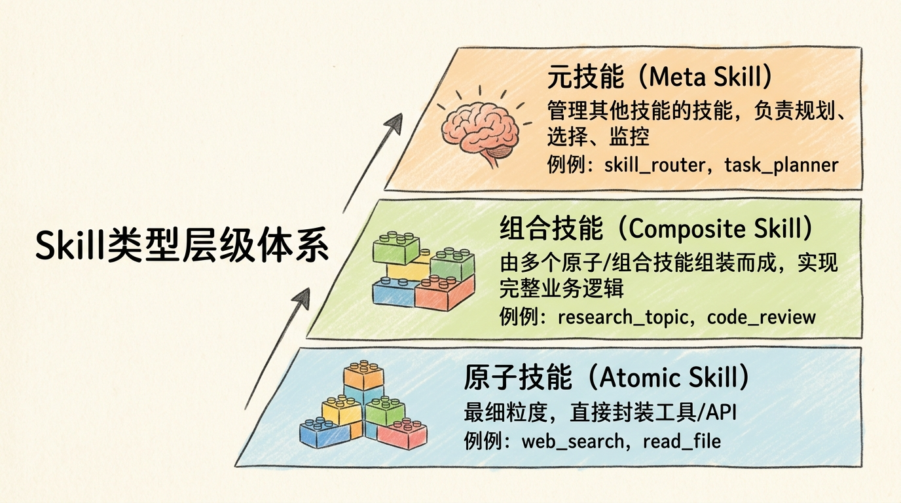

#### （1）原子技能（Atomic Skill）

直接对应工具调用的最细粒度封装，通常是对外部API或系统原语的直接包装：

```python
@atomic_skill(
    name="web_search",
    description="使用搜索引擎查询网络信息",
    categories=["information", "search"],
    timeout=30
)
def web_search(query: str, num_results: int = 5, time_range: str = "1y") -> List[dict]:
    """
    网络搜索

    Args:
        query: 搜索关键词
        num_results: 返回结果数量 (1-10)
        time_range: 时间范围 ("1d", "1w", "1m", "1y", "all")

    Returns:
        搜索结果列表，每个结果包含title, url, snippet
    """
    client = get_search_client()
    return client.search(
        query=query,
        num_results=num_results,
        time_range=time_range
    )

@atomic_skill
def read_file(path: str, encoding: str = "utf-8") -> str:
    """读取文件"""
    with open(path, encoding=encoding) as f:
        return f.read()

@atomic_skill(is_sensitive=True)
def write_file(path: str, content: str, encoding: str = "utf-8") -> None:
    """写入文件（敏感操作）"""
    with open(path, 'w', encoding=encoding) as f:
        f.write(content)
```

原子技能的设计原则：
- **单一职责**：每个技能只做一件事
- **幂等性**：多次调用产生相同结果（尽可能）
- **明确边界**：输入输出清晰，无副作用（或副作用明确声明）

#### （2）组合技能（Composite Skill）

由多个原子技能或其他组合技能组装而成，代表更高层次的业务能力：

```python
@composite_skill(
    name="research_topic",
    description="深度研究某个主题，生成综合报告",
    categories=["research", "analysis"],
    dependencies=["web_search", "fetch_content", "extract_key_points", "generate_report"]
)
def research_topic(
    topic: str,
    depth: str = "medium",  # "shallow", "medium", "deep"
    output_format: str = "markdown"
) -> Report:
    """
    深度研究某个主题

    执行流程:
    1. 搜索相关信息
    2. 并行抓取内容
    3. 提取关键信息
    4. 生成最终报告
    """
    # 配置参数
    num_sources = {
        "shallow": 3,
        "medium": 7,
        "deep": 15
    }[depth]

    # 步骤1：搜索
    logger.info(f"搜索关于 '{topic}' 的信息...")
    results = web_search(topic, num_results=num_sources * 2)

    # 步骤2：并行抓取内容
    logger.info("抓取网页内容...")
    contents = parallel_execute(
        [fetch_content(r['url']) for r in results[:num_sources]],
        max_workers=5
    )
    # 过滤掉抓取失败的内容
    valid_contents = [c for c in contents if c is not None]

    # 步骤3：提取关键信息
    logger.info("提取关键信息...")
    key_points = extract_key_points(
        valid_contents,
        focus_topics=[topic]
    )

    # 步骤4：生成报告
    logger.info("生成报告...")
    report = generate_report(
        key_points,
        topic=topic,
        depth=depth,
        format=output_format
    )

    return report
```

组合技能的特点：
- **业务导向**：对应实际业务场景
- **流程编排**：协调多个子技能的执行顺序
- **错误处理**：处理子技能失败的情况
- **可观测性**：记录执行日志和中间结果

#### （3）元技能（Meta Skill）

用于管理和调度其他技能的"技能的技能"，关注的是"如何使用技能"而非"完成具体任务"：

```python
@meta_skill(
    name="skill_router",
    description="根据任务描述选择最合适的技能",
    categories=["meta", "orchestration"]
)
def skill_router(
    task: str,
    available_skills: List[Skill],
    context: List[Message] = None
) -> SkillSelection:
    """
    根据任务选择合适的技能

    使用嵌入向量相似度 + LLM判断的混合方式
    """
    # 1. 语义搜索初选
    query_embedding = embed(task)
    scored_skills = []
    for skill in available_skills:
        # 组合技能描述和标签
        skill_text = f"{skill.name} {skill.description} {' '.join(skill.tags)}"
        skill_embedding = embed(skill_text)
        similarity = cosine_similarity(query_embedding, skill_embedding)
        scored_skills.append((similarity, skill))

    # 2. 取Top 5
    scored_skills.sort(reverse=True, key=lambda x: x[0])
    candidates = [s for _, s in scored_skills[:5]]

    # 3. LLM做最终判断
    prompt = f"""
    任务: {task}

    候选技能:
    {[(i, s.name, s.description) for i, s in enumerate(candidates)]}

    请选择最适合完成此任务的技能，返回JSON格式:
    {{
        "selected_skill_index": 0-based index,
        "confidence": 0-1,
        "reasoning": "简短说明"
    }}
    """
    llm_decision = parse_json(llm.ask(prompt))

    return SkillSelection(
        skill=candidates[llm_decision['selected_skill_index']],
        confidence=llm_decision['confidence'],
        reasoning=llm_decision['reasoning']
    )
```

常见的元技能类型：
- **技能选择器**：如上面的`skill_router`
- **规划器**：将复杂任务分解为子任务
- **监督器**：监控其他技能的执行质量
- **优化器**：动态调整技能参数和执行策略

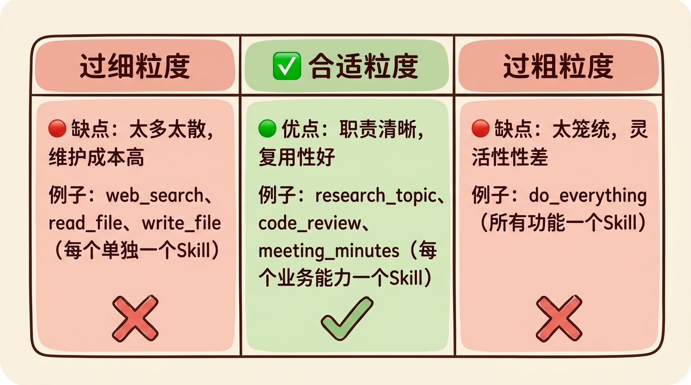

### 3. Skill的执行范式

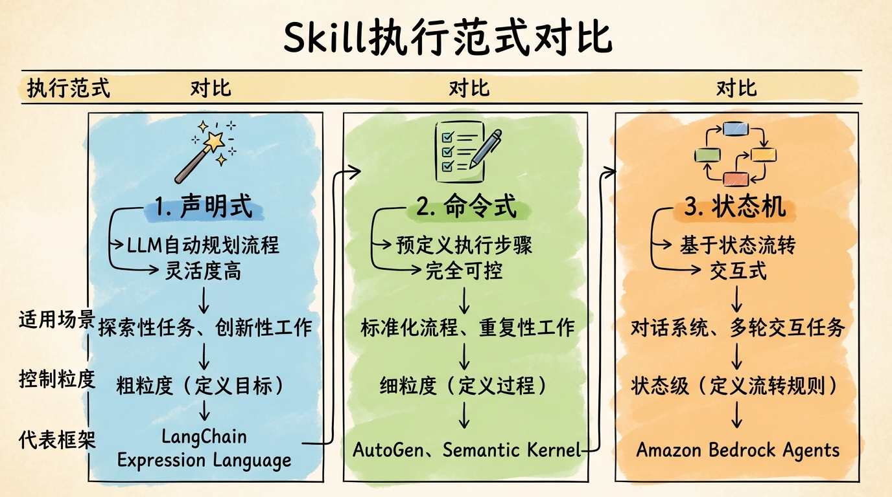

| 范式 | 特点 | 适用场景 | 控制粒度 | 代表框架 |
|------|------|---------|---------|---------|
| **声明式** | LLM自动规划，灵活度高 | 探索性任务、创新性工作 | 粗粒度，定义目标 | LangChain Expression Language |
| **命令式** | 预定义步骤，可控性强 | 标准化流程、重复性工作 | 细粒度，定义过程 | AutoGen, Semantic Kernel |
| **状态机** | 状态流转，交互式 | 对话系统、多轮交互 | 状态级，定义流转 | Amazon Bedrock Agents |

#### 范式一：声明式技能（Declarative Skill）

定义"做什么"，具体执行由LLM动态规划。这一范式的灵感来源于SQL和Prolog等声明式编程语言。

```python
@declarative_skill(
    name="write_blog",
    description="根据主题撰写一篇完整的博客文章",
    input_schema=[
        SkillParameter("topic", "string", "博客主题"),
        SkillParameter("style", "string", "文章风格", required=False, default="tech",
                      enum_values=["tech", "tutorial", "opinion", "news"])
    ],
    output_schema={"markdown": "string"}
)
def write_blog(topic: str, style: str = "tech"):
    """
    撰写博客（声明式实现）

    LLM会自动规划执行路径，例如:
    1. 搜索相关信息
    2. 撰写大纲
    3. 逐段撰写
    4. 润色优化
    """
    return llm.plan_and_execute(f"""
    请撰写一篇关于"{topic}"的博客文章，风格：{style}

    要求:
    - 结构清晰，包含引言、正文、总结
    - 有实际案例和代码示例（如适用）
    - 字数在1500-2000字
    """,
    available_tools=[web_search, read_file, outline, draft, revise]
)
```

**优点**：
- 灵活性高，能适应未预见的情况
- 开发速度快，不需要详细规划每一步

**缺点**：
- 不可预测，LLM可能走弯路
- 成本较高，需要更多Token进行规划

#### 范式二：命令式技能（Imperative Skill）

明确定义"怎么做"的每一步，执行路径完全可控。这是传统软件开发中最熟悉的范式。

```python
@imperative_skill
def write_blog(topic: str, style: str = "tech") -> str:
    """
    撰写博客（命令式实现）

    每一步都明确定义，执行路径确定
    """
    # 步骤1：调研
    logger.info("步骤1: 调研主题...")
    research = research_topic(topic, depth="deep")

    # 步骤2：写大纲
    logger.info("步骤2: 生成大纲...")
    outline = generate_outline(research, style=style)

    # 步骤3：逐段撰写
    logger.info("步骤3: 撰写内容...")
    sections = []
    for i, section in enumerate(outline.sections):
        logger.info(f"  撰写章节 {i+1}/{len(outline.sections)}: {section.title}")
        content = write_section(
            section=section,
            research=research,
            style=style,
            outline=outline
        )
        sections.append(content)

    # 步骤4：合并润色
    logger.info("步骤4: 合并润色...")
    full_text = "\n\n".join(sections)
    final_article = polish(
        text=full_text,
        style=style,
        topic=topic
    )

    return final_article
```

**优点**：
- 完全可控，每一步都可预测
- 易于调试和测试
- 成本更低，执行效率更高

**缺点**：
- 不够灵活，难以处理边缘情况
- 开发周期更长，需要详细设计

#### 范式三：状态机技能（State Machine Skill）

用于复杂的交互式任务，通过状态流转来管理对话流程。这一范式在客服机器人、对话式AI中应用广泛。

```python
from dataclasses import dataclass

@dataclass
class StateContext:
    conversation_history: List[Message]
    user_profile: Dict
    current_order: Optional[Order] = None
    pending_actions: List = field(default_factory=list)

@state_machine_skill(initial_state="greeting")
class CustomerServiceSkill:
    """
    客服技能（状态机实现）

    状态流转:
    greeting → listening → {troubleshooting, faq, escalation} → confirm_solved → end
    """

    def on_greeting(self, ctx: StateContext) -> Transition:
        """问候状态 - 对话开始"""
        greeting = "您好！欢迎联系客服，请问有什么可以帮助您的？"
        return Transition(
            next_state="listening",
            response=greeting
        )

    def on_listening(self, ctx: StateContext) -> Transition:
        """聆听状态 - 分析用户意图"""
        user_message = ctx.conversation_history[-1].content
        intent = classify_intent(user_message)

        if intent == "problem":
            return Transition(
                next_state="troubleshooting",
                context_update={"problem_type": extract_problem_type(user_message)}
            )
        elif intent == "complaint":
            return Transition(next_state="escalation")
        elif intent == "question":
            return Transition(next_state="faq")
        else:
            return Transition(
                next_state="listening",
                response="抱歉，我没有完全理解。可以请您再详细说明一下吗？"
            )

    def on_troubleshooting(self, ctx: StateContext) -> Transition:
        """问题排查状态 - 尝试解决问题"""
        problem = ctx.problem_type
        solution = find_solution(problem)

        if solution:
            return Transition(
                next_state="confirm_solved",
                response=f"请尝试以下解决方案：\n{solution}\n\n这解决了您的问题吗？"
            )
        else:
            return Transition(next_state="escalation")

    def on_confirm_solved(self, ctx: StateContext) -> Transition:
        """确认解决状态"""
        user_response = ctx.conversation_history[-1].content

        if is_affirmative(user_response):
            return Transition(
                next_state="end",
                response="太好了！很高兴能帮到您。如有其他问题，随时联系我们。"
            )
        else:
            return Transition(
                next_state="escalation",
                response="抱歉没能解决您的问题，我将为您转接人工客服。"
            )

    def on_faq(self, ctx: StateContext) -> Transition:
        """常见问题状态"""
        question = ctx.conversation_history[-1].content
        answer = find_faq_answer(question)

        return Transition(
            next_state="listening",
            response=f"{answer}\n\n还有其他问题吗？"
        )

    def on_escalation(self, ctx: StateContext) -> Transition:
        """升级状态 - 转接人工"""
        return Transition(
            next_state="end",
            response="正在为您转接人工客服，请稍候..."
        )

    def on_end(self, ctx: StateContext) -> Transition:
        """结束状态"""
        return Transition(
            next_state="end",  # 保持在结束状态
            response=None,
            is_terminal=True
        )
```

**优点**：
- 对话流程清晰，用户体验可控
- 易于设计和优化对话路径
- 支持复杂的多轮交互

**缺点**：
- 状态爆炸问题，复杂场景下状态数量激增
- 难以处理完全意外的输入

## Skill Registry与发现机制

### 1. 技能注册中心

Skill Registry是管理所有可用技能的中央仓库。这一设计参考了服务注册中心（如Consul、etcd）和包管理器（如npm、PyPI）的架构。

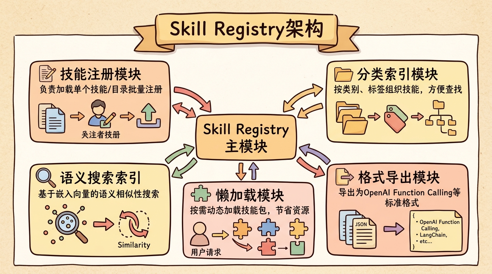

```python
import os
import importlib.util
from typing import Dict, List, Optional, Set
from collections import defaultdict
from dataclasses import dataclass

@dataclass
class SkillIndex:
    name: str
    description: str
    categories: List[str]
    tags: List[str]
    embedding: List[float]
    skill_path: str
    is_loaded: bool = False
    skill: Optional[Skill] = None

class SkillRegistry:
    def __init__(self, embedding_model=None):
        self._skills: Dict[str, Skill] = {}
        self._categories: Dict[str, List[str]] = defaultdict(list)
        self._index: Dict[str, SkillIndex] = {}
        self._embedding_model = embedding_model or get_default_embedder()
        self._skill_dirs: List[str] = []

    def register(self, skill: Skill, categories: List[str] = None):
        """注册单个技能"""
        self._skills[skill.name] = skill

        # 分类索引
        all_categories = (skill.categories or []) + (categories or [])
        for cat in all_categories:
            if skill.name not in self._categories[cat]:
                self._categories[cat].append(skill.name)

        # 构建搜索索引
        self._build_index(skill)

        logger.info(f"Registered skill: {skill.name}")

    def register_directory(self, directory: str, recursive: bool = True):
        """从目录批量注册技能"""
        self._skill_dirs.append(directory)

        for root, dirs, files in os.walk(directory):
            for file in files:
                if file.endswith('_skill.py') or file.endswith('skills.py'):
                    self._register_from_file(os.path.join(root, file))

            if not recursive:
                break

    def _register_from_file(self, filepath: str):
        """从Python文件注册技能"""
        spec = importlib.util.spec_from_file_location("skill_module", filepath)
        module = importlib.util.module_from_spec(spec)

        try:
            spec.loader.exec_module(module)

            # 查找所有Skill实例或@skill装饰的函数
            for name, obj in module.__dict__.items():
                if isinstance(obj, Skill):
                    self.register(obj)
                elif hasattr(obj, '_is_skill'):
                    self.register(obj)

        except Exception as e:
            logger.error(f"Failed to load skills from {filepath}: {e}")

    def _build_index(self, skill: Skill):
        """构建技能的语义搜索索引"""
        # 组合用于嵌入的文本
        index_text = "\n".join([
            f"Name: {skill.name}",
            f"Description: {skill.description}",
            f"Categories: {', '.join(skill.categories or [])}",
            f"Tags: {', '.join(skill.tags or [])}",
        ])

        # 生成嵌入向量
        embedding = self._embedding_model.embed(index_text)

        self._index[skill.name] = SkillIndex(
            name=skill.name,
            description=skill.description,
            categories=skill.categories or [],
            tags=skill.tags or [],
            embedding=embedding,
            skill_path=f"registry://{skill.name}",
            is_loaded=True,
            skill=skill
        )

    def find_by_name(self, name: str) -> Optional[Skill]:
        """按名称查找"""
        return self._skills.get(name)

    def find_by_category(self, category: str) -> List[Skill]:
        """按分类查找"""
        return [
            self._skills[name]
            for name in self._categories.get(category, [])
            if name in self._skills
        ]

    def find_by_description(
        self,
        query: str,
        top_k: int = 5,
        threshold: float = 0.5
    ) -> List[Skill]:
        """
        语义搜索（供LLM使用）

        使用嵌入向量做相似度匹配，这比纯文本搜索更能理解语义
        """
        if not self._embedding_model:
            # 降级到关键词匹配
            return self._keyword_search(query, top_k)

        # 生成查询嵌入
        query_embedding = self._embedding_model.embed(query)

        # 计算相似度
        scores = []
        for skill_name, index in self._index.items():
            if not index.is_loaded:
                continue

            similarity = cosine_similarity(query_embedding, index.embedding)
            if similarity >= threshold:
                scores.append((similarity, self._skills[skill_name]))

        # 排序返回
        scores.sort(reverse=True, key=lambda x: x[0])
        return [skill for _, skill in scores[:top_k]]

    def _keyword_search(self, query: str, top_k: int) -> List[Skill]:
        """降级的关键词搜索"""
        query_words = set(query.lower().split())
        scores = []

        for skill in self._skills.values():
            text = f"{skill.name} {skill.description}".lower()
            matches = sum(1 for word in query_words if word in text)
            if matches > 0:
                scores.append((matches, skill))

        scores.sort(reverse=True, key=lambda x: x[0])
        return [skill for _, skill in scores[:top_k]]

    def list_all(self) -> List[Skill]:
        """列出所有已注册的技能"""
        return list(self._skills.values())

    def to_openai_functions(self, skills: List[Skill] = None) -> List[Dict]:
        """导出为OpenAI Function Calling格式"""
        skills = skills or self.list_all()
        return [skill.to_openai_function() for skill in skills]

    def get_system_prompt_addition(self, skills: List[Skill] = None) -> str:
        """生成技能描述的系统提示词"""
        skills = skills or self.list_all()

        prompt = "\n你可以使用以下技能:\n"
        for skill in skills:
            prompt += f"- {skill.name}: {skill.description}\n"

        return prompt
```

### 2. 动态发现与加载

支持运行时动态加载技能，这对于插件化架构和热更新至关重要。

```python
# 扩展SkillRegistry，增加懒加载能力
class LazySkillRegistry(SkillRegistry):
    def __init__(self, embedding_model=None):
        super().__init__(embedding_model)
        self._skill_packages: Dict[str, str] = {}  # name → package_path

    def register_package_index(self, index_path: str):
        """注册技能包索引（只加载元数据）"""
        with open(index_path) as f:
            index = json.load(f)

        for package in index['packages']:
            self._register_package_metadata(package)

    def _register_package_metadata(self, package: Dict):
        """注册技能包的元数据（不实际加载代码）"""
        for skill_meta in package['skills']:
            name = skill_meta['name']
            self._index[name] = SkillIndex(
                name=name,
                description=skill_meta['description'],
                categories=skill_meta.get('categories', []),
                tags=skill_meta.get('tags', []),
                embedding=self._embedding_model.embed(
                    f"{name} {skill_meta['description']}"
                ),
                skill_path=package['path'],
                is_loaded=False
            )
            self._skill_packages[name] = package['path']

    def find_by_description(self, query: str, top_k: int = 5) -> List[Skill]:
        """语义搜索，按需加载"""
        # 先搜索所有索引（包括未加载的）
        query_embedding = self._embedding_model.embed(query)
        scored = []

        for name, index in self._index.items():
            sim = cosine_similarity(query_embedding, index.embedding)
            scored.append((sim, index))

        scored.sort(reverse=True, key=lambda x: x[0])

        # 按需加载Top K
        result = []
        for sim, index in scored[:top_k]:
            if not index.is_loaded:
                self._load_skill_package(index.name)
            if index.name in self._skills:
                result.append(self._skills[index.name])

        return result

    def _load_skill_package(self, skill_name: str):
        """按需加载技能包"""
        if skill_name not in self._skill_packages:
            return

        package_path = self._skill_packages[skill_name]
        logger.info(f"Lazy loading skill package: {package_path}")

        self.register_directory(package_path)
```

动态加载的应用场景：
- **插件系统**：第三方开发者可以独立开发和发布技能包
- **热更新**：无需重启服务即可更新技能
- **按需加载**：节省内存，只加载当前需要的技能
- **A/B测试**：同时加载多个版本，动态切换

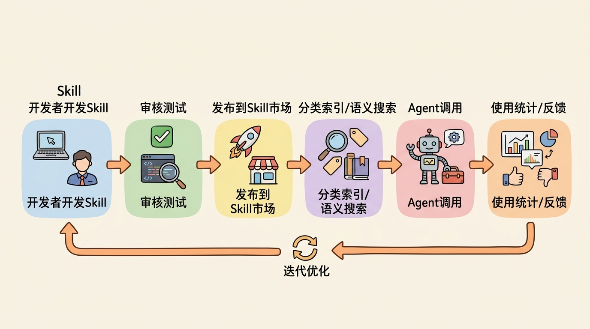

## Skill与Agent的集成方式

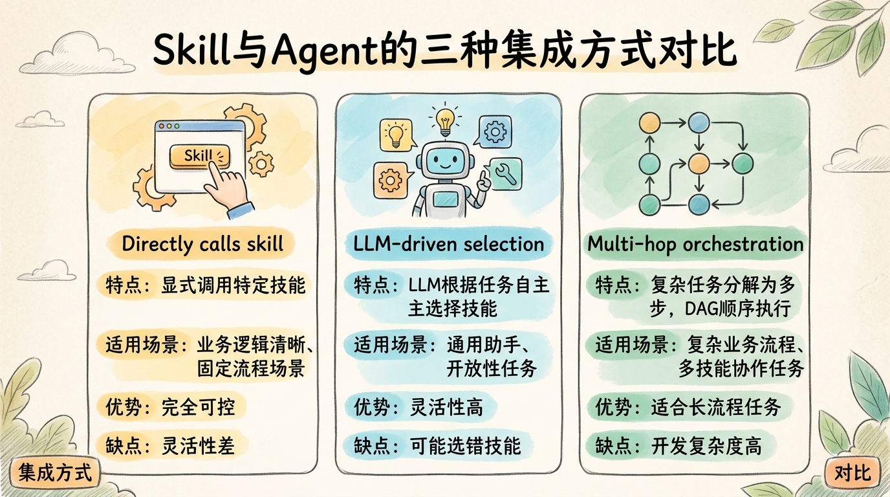

### 1. 直接调用（Direct Invocation）

最简单的集成方式，Agent显式调用特定Skill。适合业务逻辑清晰、流程固定的场景。

```python
class DirectInvocationAgent:
    def __init__(self):
        self.skills = SkillRegistry()
        self._register_core_skills()

    def _register_core_skills(self):
        """注册核心技能"""
        self.skills.register(web_search)
        self.skills.register(write_blog)
        self.skills.register(code_review)

    def handle(self, user_input: str) -> str:
        """根据用户输入选择技能"""
        if "写博客" in user_input or "blog" in user_input.lower():
            topic = extract_topic(user_input)
            result = self.skills.find_by_name("write_blog").execute(topic=topic)
            return f"博客已生成：\n\n{result}"

        elif "代码审查" in user_input or "review" in user_input.lower():
            code = extract_code(user_input)
            result = self.skills.find_by_name("code_review").execute(code=code)
            return format_code_review(result)

        elif "搜索" in user_input or "search" in user_input.lower():
            query = extract_query(user_input)
            results = self.skills.find_by_name("web_search").execute(query=query)
            return format_search_results(results)

        else:
            return llm.chat(user_input)
```

### 2. LLM驱动选择（LLM-Mediated Selection）

由LLM根据任务描述自主选择合适的Skill。这是目前最主流的方式，OpenAI Function Calling、LangChain Tools都采用这种模式。

```python
class LLMSelectionAgent:
    def __init__(self):
        self.skills = SkillRegistry()
        self.skills.register_directory("./skills")
        self.message_history = []

    def react(self, task: str) -> str:
        """
        ReAct范式 + LLM技能选择

        这一模式结合了ReAct论文（Yao et al., 2022）的思想
        """
        self.message_history.append({"role": "user", "content": task})

        max_iterations = 10
        for i in range(max_iterations):
            # 1. 渐进式披露：获取当前相关的技能
            relevant_skills = self._get_relevant_skills()

            # 2. 让LLM选择和调用技能（或直接回答）
            response = llm.ask_with_functions(
                messages=self.message_history,
                functions=self.skills.to_openai_functions(relevant_skills)
            )

            if not response.tool_calls:
                # 没有工具调用，说明这是最终回答
                self.message_history.append({
                    "role": "assistant",
                    "content": response.content
                })
                return response.content

            # 3. 解析并执行工具调用
            self.message_history.append({
                "role": "assistant",
                "content": response.content,
                "tool_calls": response.tool_calls
            })

            for tool_call in response.tool_calls:
                skill = self.skills.find_by_name(tool_call.function.name)
                if skill:
                    try:
                        result = skill.execute(**parse_json(tool_call.function.arguments))
                        result_str = str(result)
                    except Exception as e:
                        result_str = f"Error: {str(e)}"

                    # 4. 将结果返回给LLM
                    self.message_history.append({
                        "role": "tool",
                        "tool_call_id": tool_call.id,
                        "content": result_str
                    })

        return "已达到最大迭代次数"

    def _get_relevant_skills(self) -> List[Skill]:
        """渐进式披露：获取与当前上下文相关的技能"""
        # 结合最近的消息来搜索相关技能
        context = "\n".join([
            m.get("content", "") for m in self.message_history[-5:]
        ])
        return self.skills.find_by_description(context, top_k=5)
```

这一集成方式的关键参考：
- **OpenAI Function Calling Documentation**：2023年6月发布
- **ReAct: Synergizing Reasoning and Acting in Language Models**：Yao et al., 2022
- **LangChain Tools and Agents**：LangChain官方文档

### 3. 多跳编排（Multi-Hop Orchestration）

复杂任务需要多个Skill链式或并行执行。这一模式借鉴了工作流引擎（如Airflow、Temporal）的设计思想。

```python
from typing import Dict, List, Optional, Set
from dataclasses import dataclass
from enum import Enum

class NodeStatus(Enum):
    PENDING = "pending"
    RUNNING = "running"
    COMPLETED = "completed"
    FAILED = "failed"

@dataclass
class DAGNode:
    id: str
    skill: Skill
    params: Dict
    dependencies: List[str] = field(default_factory=list)
    status: NodeStatus = NodeStatus.PENDING
    result: Any = None
    error: Optional[Exception] = None

class OrchestratorAgent:
    def __init__(self):
        self.skills = SkillRegistry()

    def plan_and_execute(self, task: str) -> Any:
        """
        规划与执行

        参考了Google的Plan-and-Solve论文（Wang et al., 2023）
        和OpenAI的Planning Agents最佳实践
        """
        # 1. 生成执行计划
        logger.info("阶段1: 生成执行计划")
        plan = self._generate_plan(task)

        # 2. 构建DAG
        logger.info("阶段2: 构建执行图")
        dag = self._build_dag(plan)

        # 3. 拓扑排序执行
        logger.info("阶段3: 执行任务")
        results = {}
        execution_order = topological_sort(dag)

        for node in execution_order:
            if node.status == NodeStatus.COMPLETED:
                continue

            logger.info(f"执行节点: {node.id} ({node.skill.name})")
            node.status = NodeStatus.RUNNING

            try:
                # 收集依赖
                deps = {k: results[k] for k in node.dependencies}
                # 合并参数
                params = {**node.params, **deps}
                # 执行技能
                node.result = node.skill.execute(**params)
                node.status = NodeStatus.COMPLETED
                results[node.id] = node.result
                logger.info(f"节点完成: {node.id}")

            except Exception as e:
                node.status = NodeStatus.FAILED
                node.error = e
                logger.error(f"节点失败: {node.id}, 错误: {e}")

                # 尝试容错策略
                if not self._handle_failure(node, dag):
                    raise  # 无法恢复，抛出异常

        # 4. 返回最终结果
        return results[dag.final_node]

    def _generate_plan(self, task: str) -> Plan:
        """让LLM生成执行计划"""
        prompt = f"""
        分析以下任务，将其分解为可执行的步骤。

        任务: {task}

        可用技能:
        {self._skill_list_for_prompt()}

        请返回JSON格式的计划:
        {{
            "steps": [
                {{
                    "id": "step_1",
                    "skill": "技能名称",
                    "params": {{参数}},
                    "dependencies": ["依赖的step_id"]
                }}
            ],
            "final_output": "最后一步的step_id"
        }}
        """
        plan_json = llm.ask(prompt, response_format={"type": "json_object"})
        return parse_plan(plan_json)

    def _build_dag(self, plan: Plan) -> DAG:
        """从计划构建DAG"""
        nodes = {}
        for step in plan.steps:
            skill = self.skills.find_by_name(step.skill)
            nodes[step.id] = DAGNode(
                id=step.id,
                skill=skill,
                params=step.params,
                dependencies=step.dependencies
            )
        return DAG(nodes=nodes, final_node=plan.final_output)

    def _handle_failure(self, node: DAGNode, dag: DAG) -> bool:
        """处理节点失败"""
        # 策略1: 重试（如适用）
        if node.skill.max_retries > 0:
            retry_count = getattr(node, '_retry_count', 0)
            if retry_count < node.skill.max_retries:
                node._retry_count = retry_count + 1
                node.status = NodeStatus.PENDING
                logger.info(f"重试节点 {node.id} ({retry_count + 1}/{node.skill.max_retries})")
                return True

        # 策略2: 使用备选技能
        if hasattr(node.skill, 'fallback_skills'):
            for fallback_name in node.skill.fallback_skills:
                fallback = self.skills.find_by_name(fallback_name)
                if fallback:
                    logger.info(f"使用备选技能: {fallback_name}")
                    node.skill = fallback
                    node.status = NodeStatus.PENDING
                    return True

        # 策略3: 询问用户
        # ...

        return False
```

这一模式的参考来源：
- **Plan-and-Solve Prompting**：Wang et al., 2023
- **Temporal Workflows**：Temporal.io官方文档
- **LangChain Plan-and-Execute Agents**：LangChain 0.1.0引入

## Skill的实际应用案例

### 案例一：代码审查技能

这是一个组合技能的完整案例，参考了GitHub Copilot和Amazon CodeGuru的设计。

```python
from dataclasses import dataclass
from typing import List, Dict, Optional
from enum import Enum

class Severity(Enum):
    CRITICAL = "critical"
    HIGH = "high"
    MEDIUM = "medium"
    LOW = "low"
    STYLE = "style"

@dataclass
class Issue:
    line: int
    column: int
    severity: Severity
    message: str
    rule_id: str
    suggestion: Optional[str] = None

@dataclass
class ReviewReport:
    issues: List[Issue]
    overall_score: float
    summary: str
    suggested_fixes: List[str]

@composite_skill(
    name="code_review",
    description="对代码进行全面审查，包括风格、安全性、性能等",
    categories=["development", "code_quality"],
    dependencies=[
        "lint_check", "security_scan", "performance_analyze",
        "complexity_measure", "generate_fix"
    ]
)
def code_review(code: str, lang: str = "python") -> ReviewReport:
    """
    代码审查技能

    这是一个组合技能，并行执行多个检查后综合分析
    设计参考了:
    - GitHub's Code Scanning
    - SonarQube's Quality Gates
    - Google's Code Review Guidelines
    """
    # 步骤1: 并行执行多个检查
    logger.info("启动代码审查...")

    checks = parallel_run([
        ("lint", lambda: lint_check(code, lang)),           # 风格检查
        ("security", lambda: security_scan(code, lang)),    # 安全扫描
        ("performance", lambda: performance_analyze(code, lang)),  # 性能分析
        ("complexity", lambda: complexity_measure(code, lang))    # 复杂度度量
    ], max_workers=4)

    # 步骤2: 收集所有问题
    all_issues = []
    for check_name, check_result in checks.items():
        if check_result and check_result.issues:
            for issue in check_result.issues:
                issue.source = check_name
                all_issues.append(issue)

    # 步骤3: 按严重程度排序和去重
    all_issues.sort(key=lambda x: (
        -_severity_weight(x.severity),  # 严重程度降序
        x.line, x.column                 # 位置升序
    ))
    all_issues = _deduplicate_issues(all_issues)

    # 步骤4: 为最严重的问题生成修复建议
    suggested_fixes = []
    for issue in all_issues[:5]:  # 重点修复前5个
        try:
            fix = generate_fix(code, issue, lang)
            if fix:
                suggested_fixes.append(fix)
        except Exception as e:
            logger.warning(f"生成修复失败: {e}")

    # 步骤5: 计算总体评分
    overall_score = _calculate_score(all_issues, checks)

    # 步骤6: 生成摘要
    summary = _generate_summary(all_issues, overall_score, checks)

    logger.info(f"代码审查完成: {len(all_issues)} 个问题, 评分 {overall_score:.1f}/10")

    return ReviewReport(
        issues=all_issues,
        overall_score=overall_score,
        summary=summary,
        suggested_fixes=suggested_fixes
    )

def _severity_weight(severity: Severity) -> int:
    weights = {
        Severity.CRITICAL: 5,
        Severity.HIGH: 4,
        Severity.MEDIUM: 3,
        Severity.LOW: 2,
        Severity.STYLE: 1
    }
    return weights.get(severity, 0)

def _deduplicate_issues(issues: List[Issue]) -> List[Issue]:
    """去重：同一位置的相似问题只保留最严重的"""
    seen = set()
    result = []
    for issue in issues:
        key = (issue.line, issue.column, issue.rule_id)
        if key not in seen:
            seen.add(key)
            result.append(issue)
    return result

def _calculate_score(issues: List[Issue], checks: Dict) -> float:
    """
    计算代码质量评分 (0-10)

    参考SonarQube的评分算法
    """
    base_score = 10.0

    # 根据问题扣分
    penalties = {
        Severity.CRITICAL: 2.0,
        Severity.HIGH: 1.0,
        Severity.MEDIUM: 0.3,
        Severity.LOW: 0.1,
        Severity.STYLE: 0.05
    }

    for issue in issues:
        base_score -= penalties.get(issue.severity, 0)

    # 复杂度加分/减分
    if 'complexity' in checks:
        complexity = checks['complexity']
        if complexity.cognitive_complexity < 10:
            base_score += 0.5
        elif complexity.cognitive_complexity > 30:
            base_score -= 1.0

    return max(0.0, min(10.0, base_score))

def _generate_summary(issues: List[Issue], score: float, checks: Dict) -> str:
    """生成自然语言摘要"""
    severity_counts = defaultdict(int)
    for issue in issues:
        severity_counts[issue.severity] += 1

    score_desc = {
        (9, 10): "优秀",
        (7, 9): "良好",
        (5, 7): "一般",
        (3, 5): "较差",
        (0, 3): "很差"
    }
    desc = next(v for (low, high), v in score_desc.items() if low <= score < high)

    summary_parts = [
        f"代码质量评分: {score:.1f}/10 ({desc})",
        f"发现问题: {len(issues)} 个",
    ]

    if severity_counts[Severity.CRITICAL]:
        summary_parts.append(f"🔴 严重问题: {severity_counts[Severity.CRITICAL]}")
    if severity_counts[Severity.HIGH]:
        summary_parts.append(f"🟠 重要问题: {severity_counts[Severity.HIGH]}")

    return "\n".join(summary_parts)
```

### 案例二：会议纪要技能

这个案例展示了如何处理非结构化数据（音频/文本）并生成结构化输出。

```python
from dataclasses import dataclass
from datetime import datetime
from typing import List, Dict, Optional

@dataclass
class Attendee:
    name: str
    role: Optional[str] = None
    mentions: int = 0

@dataclass
class Topic:
    title: str
    start_time: Optional[str]
    duration_minutes: int
    summary: str
    key_points: List[str]

@dataclass
class Decision:
    topic: str
    decision: str
    made_by: Optional[str]
    timestamp: Optional[str]

@dataclass
class ActionItem:
    description: str
    assignee: Optional[str]
    deadline: Optional[str]
    priority: str = "medium"
    status: str = "pending"

@dataclass
class Minutes:
    date: datetime
    attendees: List[Attendee]
    topics: List[Topic]
    decisions: List[Decision]
    action_items: List[ActionItem]
    summary: str
    full_transcript: str
    audio_path: Optional[str] = None

@composite_skill(
    name="meeting_minutes",
    description="将会议录音/转录稿整理为结构化会议纪要",
    categories=["productivity", "note_taking"],
    dependencies=[
        "speech_to_text", "extract_attendees", "extract_topics",
        "extract_decisions", "extract_action_items", "summarize_meeting"
    ]
)
def meeting_minutes(
    audio_path: str = None,
    transcript: str = None,
    language: str = "zh"
) -> Minutes:
    """
    会议纪要技能

    设计参考:
    - Otter.ai的会议纪要功能
    - Fireflies.ai的AI会议助理
    - Notion AI的会议笔记模板
    """
    # 验证输入
    if not audio_path and not transcript:
        raise ValueError("必须提供 audio_path 或 transcript")

    logger.info("开始处理会议纪要...")

    # 步骤1：语音转文字（如需要）
    if audio_path and not transcript:
        logger.info("步骤1: 语音转文字...")
        transcript = speech_to_text(
            audio_path=audio_path,
            language=language,
            enable_diarization=True  # 说话人识别
        )
        logger.info(f"转录完成: {len(transcript)} 字符")

    # 步骤2-5：并行提取各种信息
    logger.info("步骤2-5: 并行提取会议要素...")

    extraction_results = parallel_run({
        "attendees": lambda: extract_attendees(transcript, language),
        "topics": lambda: extract_topics(transcript, language),
        "decisions": lambda: extract_decisions(transcript, language),
        "action_items": lambda: extract_action_items(transcript, language)
    })

    attendees = extraction_results["attendees"]
    topics = extraction_results["topics"]
    decisions = extraction_results["decisions"]
    action_items = extraction_results["action_items"]

    # 步骤6：生成摘要
    logger.info("步骤6: 生成会议摘要...")
    summary = summarize_meeting(
        transcript=transcript,
        topics=topics,
        decisions=decisions,
        action_items=action_items,
        language=language
    )

    # 步骤7： enrich - 关联信息
    logger.info("步骤7: 信息关联...")
    attendees = _link_attendees_to_topics(attendees, topics)
    action_items = _link_action_items_to_topics(action_items, topics)

    logger.info(f"会议纪要处理完成: "
                f"{len(attendees)} 位与会者, "
                f"{len(topics)} 个议题, "
                f"{len(decisions)} 项决策, "
                f"{len(action_items)} 个行动项")

    return Minutes(
        date=datetime.now(),
        attendees=attendees,
        topics=topics,
        decisions=decisions,
        action_items=action_items,
        summary=summary,
        full_transcript=transcript,
        audio_path=audio_path
    )

def _link_attendees_to_topics(attendees: List[Attendee], topics: List[Topic]) -> List[Attendee]:
    """将与会者与他们讨论的议题关联"""
    for attendee in attendees:
        attendee.topics = [
            topic for topic in topics
            if attendee.name in topic.summary
        ]
    return attendees

def _link_action_items_to_topics(action_items: List[ActionItem], topics: List[Topic]) -> List[ActionItem]:
    """将行动项与相关议题关联"""
    for item in action_items:
        # 查找最相关的议题
        for topic in topics:
            if _text_overlap(item.description, topic.summary):
                item.topic = topic.title
                break
    return action_items

def _text_overlap(a: str, b: str) -> bool:
    """简单的文本重叠检测"""
    words_a = set(a.lower().split())
    words_b = set(b.lower().split())
    return len(words_a & words_b) >= 2
```

### 案例三：数据洞察技能

这个案例展示了Skill如何与数据分析工具集成，自动生成洞察。

```python
from dataclasses import dataclass
from typing import List, Dict, Optional, Any
import pandas as pd

@dataclass
class DataProfile:
    row_count: int
    column_count: int
    columns: List[Dict]  # name, type, null_rate, unique_count
    memory_usage: str
    sample_data: List[Dict]

@dataclass
class Visualization:
    title: str
    type: str  # histogram, scatter, line, bar, heatmap
    description: str
    data: Dict

@dataclass
class Statistics:
    numeric_columns: Dict[str, Dict]  # mean, median, std, min, max
    categorical_columns: Dict[str, Dict]  # counts, top_values
    correlations: List[Dict]  # column1, column2, coefficient

@dataclass
class Anomaly:
    column: str
    row_indices: List[int]
    type: str  # outlier, missing, duplicate, invalid
    description: str
    severity: str

@dataclass
class InsightReport:
    data_profile: DataProfile
    visualizations: List[Visualization]
    statistics: Statistics
    anomalies: List[Anomaly]
    correlations: List[Dict]
    narrative: str
    recommendations: List[str]

@composite_skill(
    name="data_insight",
    description="分析数据集并自动生成洞察报告",
    categories=["data", "analytics"],
    dependencies=[
        "load_data", "profile_data", "auto_visualize",
        "statistical_analysis", "detect_anomalies", "find_correlations",
        "auto_generate_insights", "answer_question"
    ]
)
def data_insight(
    data_source: str,
    question: str = None,
    depth: str = "medium"
) -> InsightReport:
    """
    数据洞察技能

    设计参考:
    - Pandas Profiling / ydata-profiling
    - Tableau's Ask Data
    - Power BI's Quick Insights
    """
    logger.info(f"开始数据分析: {data_source}")

    # 配置
    config = _get_config_for_depth(depth)

    # 步骤1：加载和探索数据
    logger.info("步骤1: 加载数据...")
    df = load_data(data_source)
    logger.info(f"数据加载完成: {df.shape[0]} 行 × {df.shape[1]} 列")

    # 步骤2-5：并行分析
    logger.info("步骤2-5: 并行执行分析...")

    analysis_results = parallel_run({
        "profile": lambda: profile_data(df),
        "visualizations": lambda: auto_visualize(df, max_charts=config['max_charts']),
        "statistics": lambda: statistical_analysis(df),
        "anomalies": lambda: detect_anomalies(df, sensitivity=config['anomaly_sensitivity']),
        "correlations": lambda: find_correlations(df, method=config['correlation_method'])
    })

    profile = analysis_results["profile"]
    visualizations = analysis_results["visualizations"]
    statistics = analysis_results["statistics"]
    anomalies = analysis_results["anomalies"]
    correlations = analysis_results["correlations"]

    # 步骤6：生成自然语言解释
    logger.info("步骤6: 生成洞察叙述...")
    if question:
        # 回答特定问题
        narrative = answer_question(df, question, profile, statistics, correlations)
    else:
        # 自动生成洞察
        narrative = auto_generate_insights(
            profile=profile,
            statistics=statistics,
            anomalies=anomalies,
            correlations=correlations
        )

    # 步骤7：生成建议
    logger.info("步骤7: 生成建议...")
    recommendations = _generate_recommendations(
        profile, anomalies, correlations, depth
    )

    logger.info(f"数据分析完成: "
                f"{len(visualizations)} 个可视化, "
                f"{len(anomalies)} 个异常, "
                f"{len(correlations)} 个相关关系")

    return InsightReport(
        data_profile=profile,
        visualizations=visualizations,
        statistics=statistics,
        anomalies=anomalies,
        correlations=correlations,
        narrative=narrative,
        recommendations=recommendations
    )

def _get_config_for_depth(depth: str) -> Dict:
    """根据分析深度返回配置"""
    configs = {
        "shallow": {
            "max_charts": 3,
            "anomaly_sensitivity": "low",
            "correlation_method": "pearson",
            "correlation_threshold": 0.7
        },
        "medium": {
            "max_charts": 6,
            "anomaly_sensitivity": "medium",
            "correlation_method": "pearson",
            "correlation_threshold": 0.5
        },
        "deep": {
            "max_charts": 12,
            "anomaly_sensitivity": "high",
            "correlation_method": "kendall",
            "correlation_threshold": 0.3
        }
    }
    return configs.get(depth, configs["medium"])

def _generate_recommendations(
    profile: DataProfile,
    anomalies: List[Anomaly],
    correlations: List[Dict],
    depth: str
) -> List[str]:
    """生成数据改进建议"""
    recommendations = []

    # 数据质量建议
    high_null_cols = [c for c in profile.columns if c.get('null_rate', 0) > 0.3]
    if high_null_cols:
        recommendations.append(
            f"⚠️ 以下列缺失值超过30%，考虑处理: {', '.join(c['name'] for c in high_null_cols)}"
        )

    # 异常处理建议
    critical_anomalies = [a for a in anomalies if a.severity in ["high", "critical"]]
    if critical_anomalies:
        recommendations.append(
            f"🔍 发现 {len(critical_anomalies)} 个重要异常，建议核查"
        )

    # 相关关系建议
    strong_correlations = [c for c in correlations if abs(c.get('coefficient', 0)) > 0.8]
    if strong_correlations:
        recommendations.append(
            f"📊 发现 {len(strong_correlations)} 个强相关关系，可深入分析"
        )

    return recommendations
```

## Skill的最佳实践

### 1. 设计原则

以下原则综合了OpenAI、Anthropic、Microsoft等大厂的最佳实践：

| 原则 | 说明 | 参考来源 |
|------|------|---------|
| **单一职责** | 每个Skill只做一件事，做好一件事 | UNIX哲学, Single Responsibility Principle |
| **明确边界** | 输入输出清晰定义，避免副作用 | Command Query Responsibility Segregation |
| **幂等性** | 多次调用产生相同结果（尽可能） | REST API设计原则 |
| **错误恢复** | 内置重试和降级策略 | AWS Well-Architected Framework |
| **可观测性** | 完整的日志、指标、追踪 | OpenTelemetry |
| **向后兼容** | 接口变更时保持兼容性 | Semantic Versioning |
| **渐进式披露** | 只暴露必要的技能 | NN/g交互设计原则 |

### 2. 错误处理模式

```python
from functools import wraps
from tenacity import retry, stop_after_attempt, wait_exponential, retry_if_exception_type
import logging

logger = logging.getLogger(__name__)

def robust_skill(timeout: int = 300, max_retries: int = 2):
    """
    健壮技能装饰器

    整合了重试、超时、错误处理、监控等横切关注点
    """
    def decorator(func):
        @wraps(func)
        def wrapper(*args, **kwargs):
            skill_name = func.__name__
            logger.info(f"Executing skill: {skill_name}")

            # 记录指标
            metrics.incr(f"skill.executions", tags={"skill": skill_name})
            timer = metrics.timer(f"skill.duration", tags={"skill": skill_name})

            try:
                with timer:
                    # 参数校验
                    if hasattr(func, '_input_schema'):
                        validate_parameters(kwargs, func._input_schema)

                    # 执行（带重试）
                    @retry(
                        stop=stop_after_attempt(max_retries + 1),
                        wait=wait_exponential(multiplier=1, min=1, max=10),
                        retry=retry_if_exception_type((NetworkError, RateLimitError)),
                        before_sleep=lambda retry_state: logger.warning(
                            f"Retrying {skill_name} (attempt {retry_state.attempt_number})"
                        )
                    )
                    def run_with_retry():
                        return func(*args, **kwargs)

                    result = run_with_retry()

                    # 结果验证
                    if hasattr(func, '_output_schema'):
                        validate_result(result, func._output_schema)

                    logger.info(f"Skill completed: {skill_name}")
                    metrics.incr(f"skill.success", tags={"skill": skill_name})

                    return result

            except ValidationError as e:
                # 参数/结果错误 - 快速失败
                logger.error(f"Skill validation failed: {skill_name}, error: {e}")
                metrics.incr(f"skill.errors.validation", tags={"skill": skill_name})
                raise SkillExecutionError(f"输入无效: {e}") from e

            except NetworkError as e:
                # 网络错误 - 尝试降级
                logger.warning(f"Skill network error: {skill_name}, error: {e}")
                metrics.incr(f"skill.errors.network", tags={"skill": skill_name})

                # 尝试获取缓存结果
                cache_key = f"skill:{skill_name}:{hash(str(args) + str(kwargs))}"
                cached = cache.get(cache_key)
                if cached:
                    logger.info(f"Returning cached result for: {skill_name}")
                    return cached

                # 尝试降级值
                if hasattr(func, '_fallback'):
                    logger.info(f"Using fallback for: {skill_name}")
                    return func._fallback(*args, **kwargs)

                raise SkillExecutionError(f"网络错误且无降级方案: {e}") from e

            except Exception as e:
                # 未知错误 - 记录并上报
                logger.critical(
                    f"Skill execution exception: {skill_name}, error: {e}",
                    exc_info=True
                )
                metrics.incr(f"skill.errors", tags={"skill": skill_name, "type": type(e).__name__})

                # 上报到错误追踪
                error_tracking.capture_exception(
                    e,
                    tags={"skill": skill_name, "args": args, "kwargs": kwargs}
                )

                raise

        return wrapper
    return decorator

# 使用示例
@robust_skill(max_retries=3)
@skill
def web_search(query: str, num_results: int = 5) -> List[dict]:
    """网络搜索"""
    return client.search(query, num_results=num_results)

# 添加降级函数
def web_search_fallback(query: str, num_results: int = 5) -> List[dict]:
    """降级：返回缓存的热门结果"""
    return get_cached_trending_results(query)[:num_results]

web_search._fallback = web_search_fallback
```

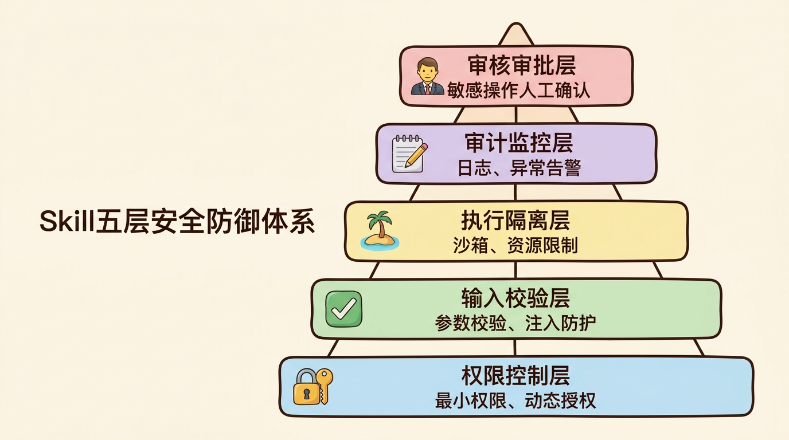

### 3. 性能优化策略

```python
from functools import lru_cache
from diskcache import Cache
from concurrent.futures import ThreadPoolExecutor, as_completed
from typing import Generator, Any

# 配置缓存
cache = Cache("./.skill_cache")

# 1. 多层缓存
def cached_skill(ttl: int = 3600, use_disk: bool = True):
    """
    缓存装饰器 - 支持内存+磁盘两层缓存
    """
    def decorator(func):
        # 内存缓存（LRU）
        memory_cached = lru_cache(maxsize=128)(func)

        @wraps(func)
        def wrapper(*args, **kwargs):
            # 生成缓存键
            key = f"{func.__name__}:{hash(str(args) + str(sorted(kwargs.items())))}"

            # 尝试内存缓存
            try:
                return memory_cached(*args, **kwargs)
            except TypeError:
                pass  # 不可哈希参数

            # 尝试磁盘缓存
            if use_disk and key in cache:
                return cache[key]

            # 执行
            result = func(*args, **kwargs)

            # 保存缓存
            if use_disk:
                cache.set(key, result, expire=ttl)

            return result

        return wrapper
    return decorator

# 2. 并行化
class ParallelSkillExecutor:
    def __init__(self, max_workers: int = 8):
        self.executor = ThreadPoolExecutor(max_workers=max_workers)

    def run(self, tasks: List[Dict]) -> Dict[str, Any]:
        """
        并行执行多个技能调用

        tasks格式:
        [
            {"name": "task1", "skill": skill1, "params": {...}},
            {"name": "task2", "skill": skill2, "params": {...}}
        ]
        """
        futures = {}
        for task in tasks:
            future = self.executor.submit(
                task['skill'].execute,
                **task.get('params', {})
            )
            futures[future] = task['name']

        results = {}
        for future in as_completed(futures):
            name = futures[future]
            try:
                results[name] = future.result()
            except Exception as e:
                logger.error(f"Task {name} failed: {e}")
                results[name] = e

        return results

# 3. 流式输出
@skill(streaming=True)
def generate_report_stream(topic: str) -> Generator[str, None, None]:
    """
    流式输出技能 - 适用于生成式任务

    用户体验更好，首字延迟更低
    """
    for chunk in llm.generate_stream(
        f"Write a report about {topic}",
        stream=True
    ):
        yield chunk.content  # 逐个token返回

# 4. 懒加载
class LazySkill:
    """
    懒加载技能 - 延迟初始化重型依赖
    """
    def __init__(self):
        self._model = None
        self._tokenizer = None
        self._embedding_model = None

    @property
    def model(self):
        if self._model is None:
            logger.info("Loading ML model (this may take a while)...")
            self._model = load_heavy_model_from_disk()  # 首次使用时才加载
        return self._model

    @property
    def tokenizer(self):
        if self._tokenizer is None:
            self._tokenizer = load_tokenizer()
        return self._tokenizer

    def execute(self, text: str) -> Any:
        # 使用时才真正加载模型
        tokens = self.tokenizer.encode(text)
        return self.model.infer(tokens)
```

## Skill与MCP的关系

[【LLM技术】MCP是什么？宗述和概念梳理](https://tingdonghu.github.io/posts/llm技术mcp是什么宗述和概念梳理/)

**Skill**和**MCP (Model Context Protocol)** 是互补而非竞争的关系，它们在AI Agent架构中处于不同层级：

- **Skill** 关注的是**能力的封装与复用**，是Agent的"能力库"
- **MCP** 关注的是**工具的标准化连接**，是Agent的"插接件"

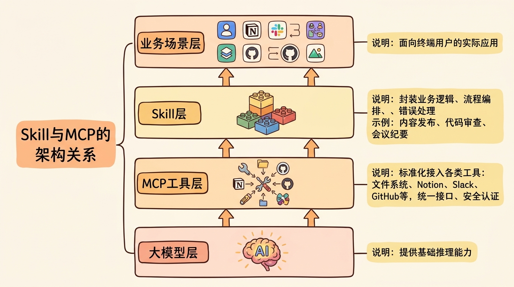

| 层级 | 关注点 | 职责 | 示例 |
|------|--------|------|------|
| **Skill** | 能力封装复用 | 业务逻辑、流程编排、错误处理 | 内容发布、代码审查、会议纪要 |
| **MCP** | 工具标准连接 | 统一接口、安全认证、资源管理 | 文件系统、Notion、Slack、GitHub |

两者可以完美配合：

```python
# MCP提供标准化的工具接入
mcp_client = MCPClient()
await mcp_client.connect("filesystem")
await mcp_client.connect("notion")
await mcp_client.connect("slack")

# Skill封装业务逻辑，内部使用MCP工具
@skill
def publish_content(content: str, title: str):
    """发布内容到多个平台"""
    # 使用MCP工具
    fs_tool = mcp_client.get_tool("filesystem", "write_file")
    notion_tool = mcp_client.get_tool("notion", "create_page")
    slack_tool = mcp_client.get_tool("slack", "send_message")

    # 业务逻辑
    path = fs_tool.call(path=f"/tmp/{slugify(title)}.md", content=content)
    page = notion_tool.call(
        parent={"database_id": NOTION_DB},
        properties={"Title": {"title": [{"text": {"content": title}}]}},
        children=markdown_to_notion_blocks(content)
    )
    slack_tool.call(
        channel="#content",
        text=f"📝 新内容已发布: {page['url']}"
    )

    return {
        "file": path,
        "notion": page,
        "slack": "sent"
    }
```

## 总结

Skill是Agent开发从"玩具Demo"走向"生产可用"的关键一步。通过将复杂能力模块化、标准化、可复用化，Skill让我们能够：

1. **管理复杂度**：将大问题拆解为小问题（借鉴了Dijkstra的结构化编程思想）
2. **提升质量**：每个Skill可独立测试和优化（参考了单元测试最佳实践）
3. **加速开发**：复用已验证的能力（类比软件库的价值）
4. **团队协作**：不同人可以开发不同的Skill（类似微服务架构的团队组织）

### 核心要点回顾

| 概念 | 关键要点 |
|------|---------|
| **渐进式披露** | 只向LLM暴露当前任务所需的最小能力集，降低决策复杂度、减少Token消耗、提高安全性 |
| **技能类型** | 原子技能（细粒度）→ 组合技能（业务级）→ 元技能（管理级） |
| **执行范式** | 声明式（灵活）、命令式（可控）、状态机（交互式） |
| **发现机制** | 语义搜索 + 分类索引 + 懒加载 |
| **与MCP关系** | Skill封装能力，MCP连接工具，两者互补 |


Skill不是银弹，但它是构建复杂Agent系统的基石。正如软件工程从"面条代码"进化到"模块化架构"，Agent开发也在经历从"单Prompt编程"到"Skill组合"的进化。掌握Skill的设计与应用，特别是**渐进式披露**这一核心原则，是成为Agent架构师的必修课。

### 延伸阅读推荐

| 资源 | 类型 | 概要 |
|------|------|------|
| [ReAct论文](https://arxiv.org/abs/2210.03629) | 论文 | Reasoning + Acting的原始论文 |
| [Plan-and-Solve Prompting](https://arxiv.org/abs/2305.04091) | 论文 | 规划与执行范式的理论基础 |
| [OpenAI Function Calling指南](https://platform.openai.com/docs/guides/function-calling) | 文档 | 工具调用的官方最佳实践 |
| [Anthropic构建可靠Agents](https://docs.anthropic.com/claude/docs/building-reliable-agents) | 文档 | 生产级Agent开发指南 |
| [LangChain Agents](https://python.langchain.com/docs/modules/agents/) | 文档 | Agent框架的完整参考 |
| [MCP规范](https://modelcontextprotocol.io/) | 规范 | 工具连接的标准化协议 |
