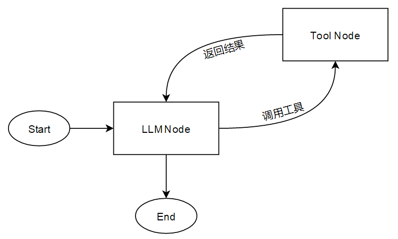
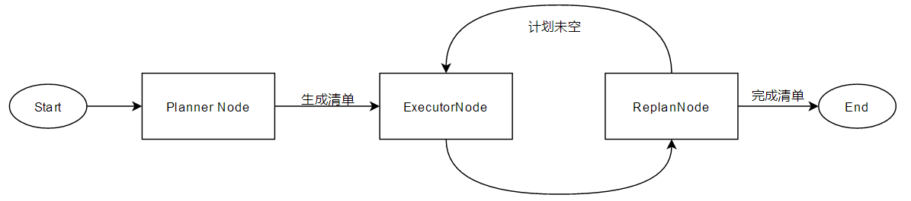
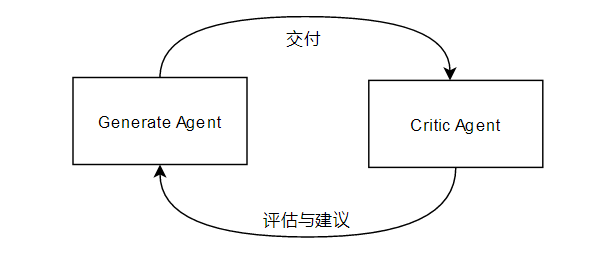

--- 
title: 【LLM应用开发原理】Agent经典开发范式
date: 2026-03-06T00:00:00+08:00
categories: ["LLM"]
tags: ["LLM", "大模型", "Agent", "ReAct","Reflection",“Plan-and-Execute”]
cover: "/img/ArtificialIntelligence.png"
headerImage: "/img/GeCML.png"
math: true
description: "Datawhale开源项目HelloAgent提供Agent架构学习。ReAct范式通过“思考-行动-观察”循环处理任务，适用于短链路工具调用，但存在Token消耗大和长任务易迷失的缺点。"
--- 

### 动手学Agent

推荐一个Datawhale开源项目，体系学习，动手实现一个简单Agent架构：[HelloAgent](https://github.com/datawhalechina/hello-agents)

具体的编码实现项目中非常详细，本博文中我只尝试做一个设计思想整理。

## Agent经典范式

### 1.ReAct范式（Reasoning and Acting）

最基础、应用最广的范式，是目前绝大多数 Agent 的基石。

它模仿人类解决问题的直觉：**先思考（Thought），再行动（Action），最后观察结果（Observation）。**



**逻辑链路**：

传统LLM是一问一答。ReAct引入了一个**循环**（Loop）

用户输入 $\rightarrow$ 思考 (Thought) $\rightarrow$ 行为 (Action/Tool Call) $\rightarrow$ 观察 (Observation/Result) $\rightarrow$ 再次思考...直到得出答案。

**适用场景**：绝大多数调用工具的短链路任务，如实时搜索、数据库查询、如查天气、订机票等。

**缺点**：**Token 消耗大且易迷路**。

在复杂长任务或者长链路中，模型容易在反复的循环中忘记最初的目标（上下文漂移），或者陷入无限死循环。

**流程**：

1. **用户输入**：“上海明天的天气适合穿短袖吗？”
2. **Thought**：我需要先查上海明天的气温，然后再判断是否适合短袖。
3. **Action**：调用 `weather_api(location="shanghai", date="tomorrow")`。
4. **Observation**：返回 15°C - 22°C，有阵雨。
5. **Thought**：气温偏凉且有雨，不适合穿短袖，建议长袖加外套。
6. **Final Answer**：不适合，建议穿长袖...

**代码逻辑**：

LLM节点和工具节点之间的无限乒乓球，直到LLM决定停止（或达到最大预设次数）

```python
def _run_with_tools(self, messages: list, input_text: str, max_tool_iterations: int, **kwargs) -> str:
    current_iteration = 0

    while current_iteration < max_tool_iterations:
        current_iteration += 1
        # 1. 调用 LLM
        response = self.llm.invoke(messages, **kwargs)

        # 2. 检查是否有工具调用
        tool_calls = self._parse_tool_calls(response)

        if not tool_calls:
            # 如果没有工具调用，说明这已经是最终回答了
            self.add_message(Message(input_text, "user"))
            self.add_message(Message(response, "assistant"))
            print(f"✅ {self.name} 最终响应完成")
            return response

        print(f"🔧 检测到 {len(tool_calls)} 个工具调用")

        # 3. 执行工具并收集结果
        tool_results = []
        clean_response = response
        for call in tool_calls:
            result = self._execute_tool_call(call['tool_name'], call['parameters'])
            tool_results.append(f"工具 {call['tool_name']} 返回结果: {result}")

            # 从响应中移除工具调用标记，保持历史记录整洁
            clean_response = clean_response.replace(call['original'], "")

        # 4. 将结果喂回给模型，继续下一轮循环
        # 如果 AI 只输出了标签而没有文字，我们补一个提示词，防止发送空消息
        assistant_display = clean_response.strip() if clean_response.strip() else "正在调用工具处理..."

        # 将清理后的内容存入 assistant 角色
        messages.append({"role": "assistant", "content": assistant_display})

        # 存入工具返回的结果，让 AI 基于这些事实进行下一轮思考
        messages.append({
            "role": "user",
            "content": f"工具执行结果:\n" + "\n".join(tool_results) + "\n请基于这些结果继续回答。"
        })

    return "错误：达到最大工具调用次数限制。"
```

### 2.Plan-and-Execute 范式（规划与执行）

 针对ReAct容易“走一步看一步”导致跑偏的问题，这种范式把“规划”和“执行”拆分开。

**核心逻辑**：先做任务规划，再逐个击破。通常由两个逻辑单元（Planner和Executor）组成。



**适用场景**：撰写研报、多步骤跨平台操作等任务步骤明确、流程较长、逻辑复杂的任务。

**缺点**：**响应延迟（Latency）高**。由于需要先做完整的规划，用户的第一反馈会很慢；且如果初始规划失误，后续步骤可能全是无效功。

**流程**：

1. **用户输入**：“分析特斯拉和比亚迪的财报并对比写一份 PPT 提纲。”
2. **Planner (规划阶段)**：生成步骤列表：① 搜索特斯拉财报；② 搜索比亚迪财报；③ 提取关键数据；④ 生成对比表格；⑤ 撰写提纲。
3. **Executor (执行阶段)**：依次调用 ReAct 模式完成 ① 至 ⑤。
4. **Re-planner (重评阶段)**：检查结果，如果发现步骤 ② 没搜到数据，则修改计划重新搜索。

**代码逻辑**：

for循环+队列，生成清单->消费清单，清单可以线性执行，部分不依赖前面内容的也可以并行执行。

> [!tip]
>
> 每一个清单（执行器）单元也可以是一个单个的拥有独立调用工具能力的Agent。

```python
def run(self,task:str):
    # 1. Planner 阶段：生成静态计划
    plan=self._generate_plan(task)
    print(f"📋 生成的计划：\n{plan}")

    #2. Solver阶段： 循环执行每一个步骤
    results=[]
    steps=self._parse_steps(plan)
    for i,step in enumerate(steps):
        print(f"🚀 正在执行第 {i+1} 步: {step}")
        #调用之前写好的SimpleAgent.run
        result=self.executor.run(step)
        results.append(f"步骤{i+1}结果:{result}")
    return self._summarize(task,results)
```

### 3.Reflection/Self-Correction范式（反思与修正）

为了让Agent不仅“做完”，还能“做好”，引入了类似人类的“自我审查”机制。

全称：Reasoning with Reflection (反思增强)

**应用场景**：长文本生成、代码生成、翻译优化。

**缺点**：**成本极高**。为了得到一个正确答案，可能需要消耗 3-5 倍的 Token 和计算时间。

**核心逻辑**：引入一个**批判者**（Critic）角色，对输出结果进行打分和错误分析，并将失败经验作为新的上下文。



**流程**：

1. **执行**：模型生成一段处理数据的 Python 代码。
2. **测试**：代理层在沙箱运行代码，报错 `IndexError`。
3. **Reflection**：模型分析报错原因：“我在处理空列表时没有判断长度。”
4. **Refine**：模型参考失败经验，生成修正后的代码并再次测试。

**代码逻辑**：

> [!TIP]
>
> 这里的批判者（Critic）往往可能会使用不同的模型或者不同的Agent来做交叉验证。

```python
candidate = agent.initial_guess(task)
for i in range(max_retries):
    feedback = critic.evaluate(candidate) # 检查错误或逻辑漏洞
    if feedback.is_perfect: break
    # 将失败尝试和反馈重新喂给模型
    candidate = agent.refine(candidate, feedback, memory=past_attempts)
```