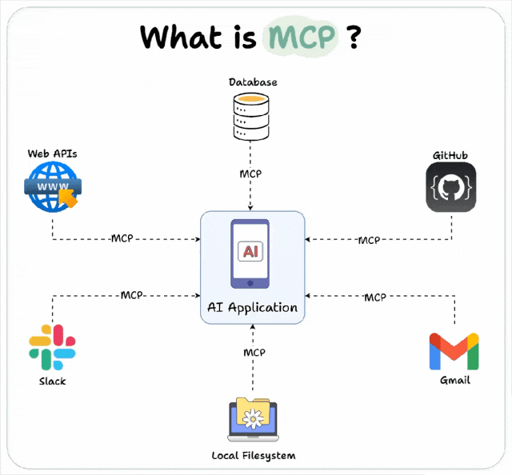
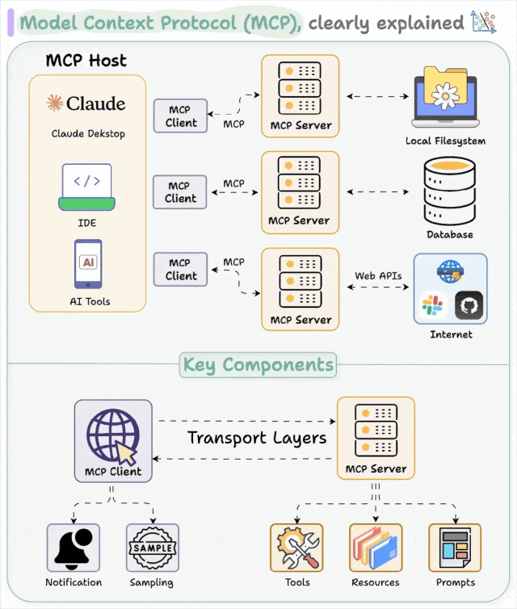
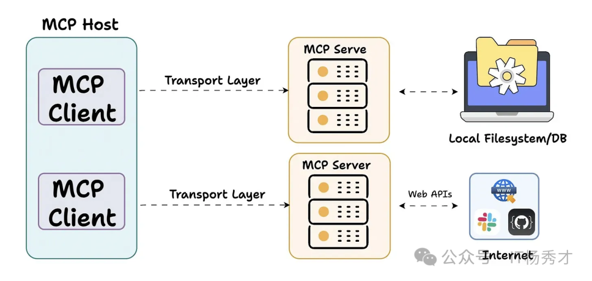
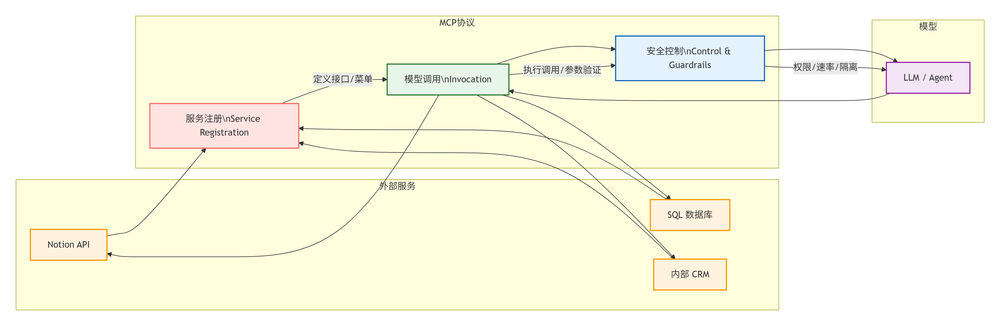

--- 
title: 【LLM应用开发原理】FunctionCalling底层原理与MCP
date: 2026-03-09T00:00:00+08:00
categories: ["Agent"]
tags: ["LLM", "大模型", "Agent", "FunctionCalling", "MCP"]
cover: "/img/ArtificialIntelligence.png"
headerImage: "/img/GeCML.png"
math: true
description: "Function Calling通过有监督微调让LLM学会将用户意图映射为结构化JSON输出，再借助推理时的约束解码确保JSON语法正确，最终由外部代理执行工具调用并返回结果，形成完整的意图-动作闭环。"
--- 

## Function Calling底层原理

上节课提到一个Agent架构中，LLM只负责基于输入内容生成输出内容，其本身只有与外界通过语言序列交流一种方式。

现代一些大模型（Chat-4,Qwen-7B-Chat等）能够之所以能够精准调用工具和别的一些服务功能，是因为在训练阶段或后续微调阶段进行一些规范化，使用特殊的数据集进行训练。以使模型本身成功建立“任务-工具-参数”的概率关联，在调用工具的时候能够使用特定格式的输出，方便代理层进行解析，并调用响应服务以返回结果。

这一让LLM从“只能回答问题”变成“能指挥工具干活的指挥官”的过程，就称之为“Function Calling”。

### 1.训练层面：教会模型“填空” (SFT)

模型本身是怎样建立“任务-工具-参数”的概率相关的？路径之一是通过 **有监督微调** (**Supervised Fine-Tuning**)

向大模型输入大量结构化的数据对：

- 数据集构成：
  - **User Query**：用户的自然语言诉求（如：“查一下明早北京的天气”）。
  - **System Prompt**：系统提示词补齐可用工具定义列表（JSON Schema）。
  - **Target Output**：模型应当输出的特定标记符（Token）+具体调用 JSON字符串。

通过这样的有监督微调，模型学到了一种模式：当用户意图与系统提示中的某个工具描述匹配时，不输出自然语言，而输出特定的结构化**JSON**,并使用特定的标记符开始和结束。

使用示例：

```
### System:
你是一个行政助手。可用工具: [book_meeting_room(room_name, date, duration_hours)]

### User:
帮我定一下明天下午‘星云阁’会议室，用 2 小时。

### Assistant:
<|thought|>
用户想要预订会议室。
参数提取：
- 会议室：星云阁
- 日期：明天（基于当前日期 2026-03-09 推算为 2026-03-10）
- 时长：2 小时
匹配工具：book_meeting_room
<|tool_call_start|>:{"name": "book_meeting_room", "arguments": {"room_name": "星云阁", "date": "2026-03-10", "duration_hours": 2}}<|tool_call_end|>
```

### 2.推理层面：强制模型“守规矩” (Constrained Decoding)

为了保证模型的输出JSON 100% 符合语法（不会缺少或多余逗号括号等）。推理引擎（如vLLM, llama.cpp）通常使用了**约束编码**（**Constrained Decoding/Grammar-based Sampling**）。

**问题**：LLM生成文本是概率性的，可能会生成错误的JSON,导致代理层解析失败。

**解决方法**：

- **状态机/语法引导**： 推理引擎（如 vLLM, llama.cpp）会加载一个 **JSON Schema**。如果当前生成的 Token 破坏了 JSON 结构（例如在布尔值位置生成了字符串），引擎会强行将该 Token 的概率掩码（Mask）降为 0，迫使模型选择符合语法的下一个 Token。

- **强制类型对齐**： 如果 Schema 定义 `count` 必须是 `integer`，模型在生成该字段值时，会被限制只能在数字 Token 中选择。

**示例**：

- 如果模型已经生成了 {"city":，下一个 Token 必须是字符串的开始引号 " 。如果模型想生成一个数字，推理引擎会强行把数字的概率设为 0，迫使模型只能选择符合 JSON 语法的 Token。

**结果**： 这保证了程序后端在拿到模型输出时，可以直接用 `json.loads()` 解析，而不会因为格式错误(Syntax Error)导致系统崩溃。

### 3.协议层面：完整的交互循环（The Loop）

Function Calling 不仅仅是一次请求，而是一个标准的 **4 步循环协议**：

核心逻辑：一个“意图 -> 动作 -> 结果 -> 结论”的闭环。

> [!important]
>
> **关键点**：模型本身**并不具备**访问互联网或执行代码的能力。它只是“提议”调用某个函数，真正的执行是由代理层业务代码（Python/Node.js 等）完成的。

| **步骤**                    | **角色 (Role)**  | **动作描述**                                                 | **示例内容**                                                 |
| --------------------------- | ---------------- | ------------------------------------------------------------ | ------------------------------------------------------------ |
| 1.**用户请求**&**系统注入** | `user`，`system` | 用户提出自然语言需求<br />代理层把可调用工具的列表`JSON`描述打包为特殊的`System Prompt` 发送给模型。 | `user`: "查一下我的订单 12345"<br />`system`：”你是一个可以调用工具的助理，可以使用以下工具...“ |
| **2. 意图识别&模型决策**    | `assistant`      | 模型根据用户的问题`{"查下订单"}`和 `System Prompt `进行**Attention计算**<br />如果匹配到了工具，停止生成自然语言，生成特殊标识符（如`finish_reason='tool_calls'`）<br />生成符合 Schema 的参数`JSON` 。<br />暂停生成，调用参数（`JSON`）返回代理层。 | `assistant`：`{ "name": "get_order", "args": {"id": "12345"} }` |
| **3. 客户端执行&结果回填**  | `tool`           | **代理层**解析`JSON`,调用真实接口，完成后将结果回填。        | `tool`：`{ "status": "shipped", "eta": "2 days" }`           |
| **4. 模型总结**             | `assistant`      | 模型将“原始需求”与“执行结果”合并，生成最终答复。             | `assistant`: "您的订单 12345 已发货，预计 2 天后送达。"      |


> [!tip]
>
> **强制触发（Tool Choice）**： 在实际应用中，可以通过参数 `tool_choice='required'` 强制模型**必须**调用某个工具，而不许说废话。这在自动化流水线（Pipeline）中非常有用。

除了Function Calling之外MCP也算大模型调用工具这方面非常火热的一个词。

## MCP的定义

MCP，全称 **Model Context Protocol**，中文可译为 **模型上下文协议**。  

它由 Anthropic（Claude） 在 2024 年提出，是一种 **Agent 级系统协议**，目标是让 **大模型（LLM）能够安全、受控地访问外部工具和数据源**。  

- MCP 是一个标准协议，就像给 AI 大模型装了一个 “万能接口”，让 AI 模型能够与不同的数据源和工具进行无缝交互。它就像 USB-C 接口一样，提供了一种标准化的方法，将 AI 模型连接到各种数据源和工具。
- MCP 旨在替换碎片化的 Agent 代码集成，从而使 AI 系统更可靠，更有效。通过建立通用标准，服务商可以基于协议来推出它们自己服务的 AI 能力，从而支持开发者更快的构建更强大的 AI 应用。开发者也不需要重复造轮子，通过开源项目可以建立强大的 AI Agent 生态。
- MCP 可以在不同的应用 / 服务之间保持上下文，从而增强整体自主执行任务的能力。

简单来说Function Calling 是“器官”，定义了模型“如何表达”想用工具的意图。而 MCP（Model Context Protocol）定义了工具和数据“如何规范地”暴露给模型，并提供统一的传输链路。


> [!tip]
>
> 如上图所示**MCP 是为 LLM 打造的“USB接口标准”，让它能安全地接上各种外部设备和服务。**

### Function Calling与MCP的协作

可以把它们的关系类比为 **“乐高积木”与“乐高底板”**：

#### 维度一：能力的标准化

- **没有 MCP 时**：你需要手动把 API 文档写成 JSON Schema 喂给模型（Function Calling 的第一步）。如果你换了一个模型或平台，可能要重写这套描述。
- **有了 MCP 后**：任何支持 MCP 的服务器（Server）都会自动导出一套标准的工具列表。模型（Client）通过 MCP 协议直接“看到”这些工具，并自动将其转化为 Function Calling 所需的 Schema。

#### 维度二：连接的拓扑结构

- **Function Calling (点对点)**：App $\rightarrow$ 编写解析代码 $\rightarrow$ 调用具体 API。
- **MCP (星型拓扑)**：App $\rightarrow$ MCP 控制器 $\rightarrow$ 挂载 N 个 MCP Servers（如 Postgres 服务器、Slack 服务器）。

这里给一个直观的对比

| **特性**       | **Function Calling (函数调用)**       | **MCP (模型上下文协议)**                     |
| -------------- | ------------------------------------- | -------------------------------------------- |
| **本质**       | 模型的一种**生成能力**（输出 JSON）。 | 一套**通信协议**（定义如何传输数据和工具）。 |
| **关注点**     | 侧重于“模型怎么说”。                  | 侧重于“工具怎么接”、“数据怎么传”。           |
| **作用域**     | 单次对话的请求/响应循环。             | 跨平台、跨工具的持久化连接。                 |
| **开发者工作** | 手写 JSON Schema 和解析逻辑。         | 运行一个现成的 MCP Server 即可一键挂载工具。 |



## **MCP架构**

MCP 是基于客户端-服务器的架构，架构图如下所示：



架构包含三个主要组件：

- MCP Host （宿主应用）
- MCP Client （MCP 客户端）
- MCP Server （MCP 服务器）

MCP Host主要是人工智能应用程序（例如，Claude 桌面、集成开发环境），负责管理 MCP 客户端，控制权限、生命周期、安全性和上下文聚合
MCP Clien是Host 内部专门用于与 MCP Server 建立和维持一对一连接的模块。它负责按照 MCP 协议的规范发送请求、接收响应和处理数据。简单来说，MCP Client 是 Host 内部处理 RPC 通信的“代理”，专注于与一个 MCP Server 进行标准化的数据、工具或 prompt 的交换
MCP Server暴露特定的功能并提供数据访问，比如实时获取天气、浏览网页等等能力



## MCP的工作流程



MCP的基本步骤可以概括为 **三段式：注册 -> 调用 -> 控制**。  

1. **服务注册（Service Registration）**  
   外部服务（如 Notion API、SQL数据库、内部CRM）通过 MCP 定义接口，声明自己能做什么（类似“菜单”）。  
   - 例如：`notion.create_page(title, content)`  
   - 或：`database.query("SELECT ...")`  

2. **模型调用（Invocation）**  
   当 LLM 需要完成某个任务时，它不会直接“拍脑袋”执行，而是向 MCP 发出请求：  
   - “我需要调用 `notion.create_page` 来新建日报页面。”  
   MCP 会验证参数是否合法、调用是否安全，然后再把请求转发给实际的服务。  

3. **安全控制（Control & Guardrails）**  
   MCP 不是一个“裸奔接口”，它有一层**安全护栏**：  
   - 权限管理（只能读，不能写？）  
   - 速率限制（防止无限循环请求）  
   - 上下文隔离（不同任务之间的数据不能随意共享）  

# MCP教程|博文|网址推荐

- CSDN:
  - [MCP是什么，一篇搞懂MCP爆火的其中奥秘！](https://blog.csdn.net/m0_48891301/article/details/147918360?fromshare=blogdetail&sharetype=blogdetail&sharerId=147918360&sharerefer=PC&sharesource=xx_xb&sharefrom=from_link)
  - [什么是MCP和A2A？一文搞懂MCP和A2A，非常详细收藏这一篇就够了_mcp a2a-CSDN博客](https://blog.csdn.net/2401_84204207/article/details/147421954?ops_request_misc=&request_id=&biz_id=102&utm_term=MCP是什么&utm_medium=distribute.pc_search_result.none-task-blog-2~all~sobaiduweb~default-1-147421954.142^v102^control&spm=1018.2226.3001.4187)
  - [MCP协议是什么？MCP入门实战-CSDN博客](https://blog.csdn.net/weixin_73093777/article/details/149002722?ops_request_misc=%7B%22request%5Fid%22%3A%22c4298b172455e9ad2e9b5e3c4283aa92%22%2C%22scm%22%3A%2220140713.130102334..%22%7D&request_id=c4298b172455e9ad2e9b5e3c4283aa92&biz_id=0&utm_medium=distribute.pc_search_result.none-task-blog-2~all~sobaiduend~default-4-149002722-null-null.142^v102^control&utm_term=MCP是什么&spm=1018.2226.3001.4187)

- YouTube：
  - [MCP是啥？技术原理是什么？一个视频搞懂MCP的一切。Windows系统配置MCP，Cursor,Cline 使用MCP](https://www.youtube.com/watch?v=McNRkd5CxFY&t=4s)