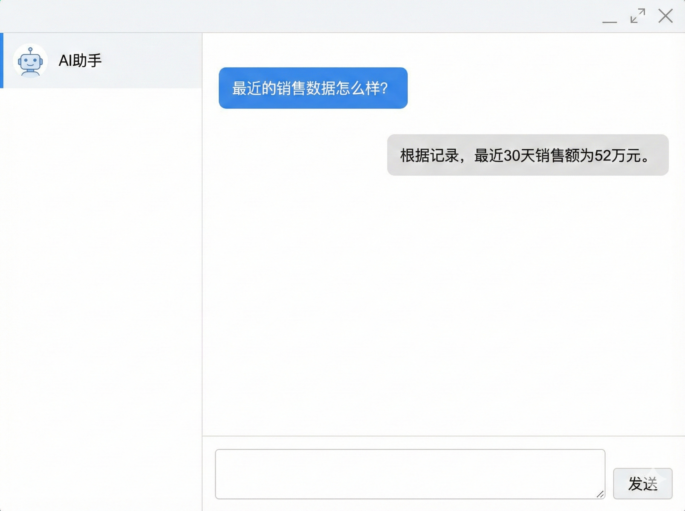

寒假开学以来，一直在学习一些Agent相关的技术文档和媒体视频，从概念设计思想到手搓了几个Demo，最近在尝试拆解一些热门框架的源码，这段时间的学习让我对Agent的看法大为改观，沉迷于每日头脑风暴，有些想法不吐不快，做此纪录。

## 怎样理解Agent

自 2023 年 ChatGPT 引爆全球以来，我几乎每天都在与各类 Chat 产品交互。在那段时期，我对大模型的认知还停留在一个极简的逻辑上——**"模型即产品”**。我理所当然地认为，大模型就是一个能与我无障碍交流的聊天窗口。

随后，前年开始，Agent(智能体)的概念被自媒体反复咀嚼与炒作：从早期的"工作流颠覆世界”，到后来层出不穷、月更不辍的新名词，每一波浪潮都宣称要重塑人类社会。这种浮躁的空气让我对 Agent 这个词产生了某种程度的"**PTSD**(创伤后应激障碍)”，导致我迟迟没有沉下心去剖析它的底层机理。

但在这一段时间系统性的学习后，我大致认清了Agent的产品形态。现在，我可以非常肯定地给出一个核心结论：**Agent 绝非炒作概念，它是以大模型为核心驱动(类似CPU)的下一代操作系统。** 我们此前以及现在所使用的所有顶级 AI 产品，剥开它们的对话外壳，其本质都是一套复杂而精密的 Agent 系统。

### Transformer的无状态性

提到大模型与 Agent 的进化，绕不开 AI 时代真正的分水岭：Transformer 架构。

[【LLM技术】Transformer架构宗述 | 古月月仔的博客](https://tingdonghu.github.io/posts/llm技术transformer架构宗述/)

从底层数学逻辑看，Transformer 本质上是一个高度复杂的"概率序列预测器”。 它并非像人类一样具备实体感官或持续意识，而是基于概率分布在海量的 Token空间中寻找下一个最合理的输出。模型所展现出的惊人智能，源于它在预训练阶段从万亿级语料中汲取的**隐性知识**(Implicit Knowledge)。

当多模态模型接收到文字、语音或图像的混合输入时，它会将其映射到高维的**潜空间**(Latent Space)中。在这里，模型执行的不是简单的关键词匹配，而是极其复杂的高阶矩阵运算。所谓的"推理能力”，本质上是模型在潜空间中沿着逻辑语义的**流形**(Manifold)进行概率坍缩。

然而，回归其物理本质，模型依然是**无状态**(Stateless)且**瞬时**的。它唯一的任务是基于当前输入(Context)计算概率最大化的下一个 Token。它没有"昨天”的记忆，也没有"行动”的渴望。这种"预测即推理”的特性，既是大模型力量的源泉，也是它产生幻觉与缺乏逻辑稳定性的根源。

### 代理行为到代理层

在使用 ChatGPT 类产品时，你之所以感觉到它能对语境理解清晰对答如流，并非因为模型具备持久化记忆，而是后台程序在发挥作用。每当你按下回车键，后台会迅速对历史聊天记录(Context)进行打包、修剪，连同当前问题一并注入模型。这种"**用户发送内容、程序提供语境**”的交互模式，本质上就是一种代理(Proxy/Agent)模式：模型负责瞬时的序列预测，而后台负责维护状态与环境。

Agent 的定义也由此清晰：它不再是一个裸露的模型接口，而是一个被逻辑代码包裹、能感知并利用上下文进行决策的闭环系统。

不仅是上下文管理，Chat 类产品的诸多特性皆源于此：

- 当你无法表述自己需求，只写了一半句子时，发现模型仍然能较好的猜测出意图并回答，是代理层在后台做**意图识别**(Intent Recognition)**意图扩展**(Intent Expansion)；
- 当你触发敏感词而模型拒绝回答问题时，是**安全审核层**在拦截和审查；
- 当你看到模型输出的MarkDown语法直接渲染为的富文本样式时，是**前端代理**在解析逻辑和渲染；
- 当你要求总结 PDF 或联网搜索，是**外挂插件**和**知识图谱**在提取知识并标记出处。

这一切功能，大模型LLM本身都无法独立实现。回归本质：**大模型的核心任务只有"预测下一个 Token”**，而从用户输入到最终交互的整个黑盒空间，全部是由**代理层**(**Agent Layer**)驱动的。

从用户体验上看，Chat类产品代理层的作用其实就是：**增强交互+无感使用**。

从技术解耦上看，Agent就是一个AI产品中除了核心模型之外全部的总和。

## AGI与Agent

## Agent架构设计

