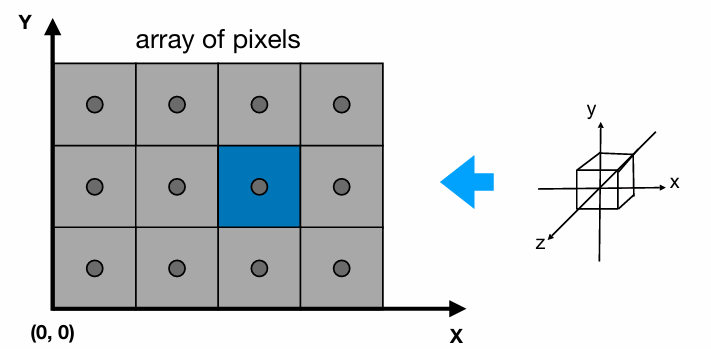
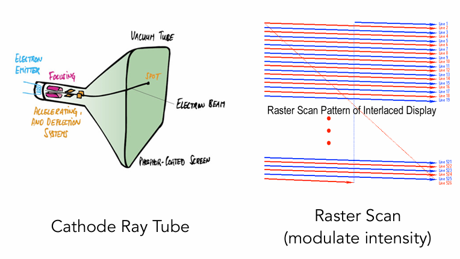
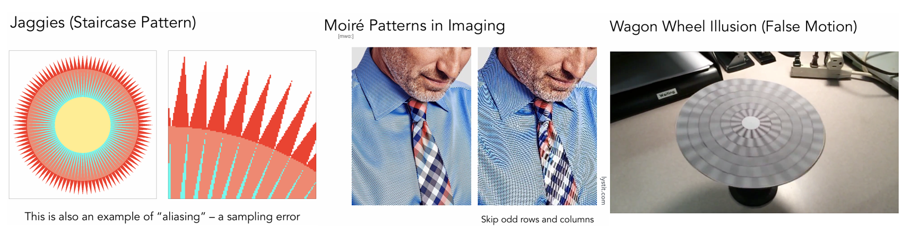

--- 
title: 【Games101】光栅化基础
date: 2025-06-29T00:00:00+08:00
mathjax: true
categories: ["Games101笔记"]
tags: ["图形学", "shading", "GAMES课程", "线性代数", "光栅化", "滤波", "卷积"]
description: "光栅化是将几何图元转换为屏幕像素的核心渲染过程，涉及视口变换，并依托于CRT、LCD、OLED等显示设备最终成像。"
cover: "/img/ComputerGraphics.png"
headerImage: "/img/rthykless.png"
math: true
--- 

光栅化是将几何图元（如三角形）转换为屏幕像素的核心渲染过程，涉及视口变换等步骤，并依托于CRT、LCD、OLED等显示设备最终成像。 


# 什么是光栅化？ 

光栅化是 **将几何图元（如三角形、线段）转换为屏幕上的像素（或片元）的过程**，是实时3D渲染的核心步骤。它通过计算图元覆盖的像素区域，并插值顶点属性（颜色、深度等），最终生成可供显示的2D图像。


## 显示器模型

图形学中，屏幕就认为是一个装了像素的二维数组。如数组大小1920*1080，每个数组为一个像素点，像素是最小单位，每个像素由RBG的四维矩阵构成。


如上图所示像素的坐标以左下角为准，如图中蓝色像素坐标为（2，1）

像素的中心为（x+0.5,y+0.5）

## 视口变换

在进行了上节课的**透视投影变换**操作之后，所有物体都处在了[-1，1]³的立方体中，接下来就要把他画在屏幕上。




要将将[-1,1]³中的东西显示到屏幕上，我们可以考虑以下步骤：

- 暂时忽略z坐标
- 将[-1,1]²变换到xy平面[0, width] x [0, height]

这个过程称为视口变换，其矩阵示意如下:
$$
M_{\text{viewport}} = 
\begin{pmatrix}
\frac{width}{2} & 0               & 0 & \frac{width}{2}  \\
0               & \frac{height}{2} & 0 & \frac{height}{2} \\
0               & 0               & 1 & 0                \\
0               & 0               & 0 & 1
\end{pmatrix}
$$


## 现代光栅显示设备

**阴极射线管（CRT）**



- **原理**：通过电子束轰击荧光粉逐行成像，是早期显示技术。
- 特点：
  - 高对比度、色彩还原好。
  - 体积大、耗电高，已逐步淘汰。
- **应用**：老式电脑显示器、显像管，示波器。

**液晶显示器（LCD）**


- **原理**：利用液晶分子调制背光源光线，需依赖外部背光（如CCFL或LED）。
- 特点：
  - 轻薄省电，但存在可视角度和对比度限制。
- 子类型：
  - **TN面板**：响应快但色彩差，适合电竞。
  - **IPS面板**：色彩准、视角广，适合设计。
  - **VA面板**：高对比度但响应慢，适合影音。
- **应用**：普通显示器、早期智能手机。

**有机发光二极管（OLED）**


- **原理**：像素自发光，无需背光。
- 特点：
  - 极致黑场（对比度无限）、可弯曲。
  - 可能烧屏，寿命较短。
- 子类型：
  - **AMOLED**：主动矩阵驱动（手机常用）。
  - **POLED**：柔性基板（折叠屏手机）。
- **应用**：高端手机（如iPhone）、电视。

**电子墨水屏（E-Ink）**


- **原理**：带电颗粒移动模拟墨水。
- 特点：
  - 护眼、超低功耗，仅显示静态内容。
- **应用**：电纸书（如Kindle）。

## 三角形


**为什么光栅化选择了三角形？**

- 三角形是最基本的多边形，没有比三角形边更少的多边形
- 其他多边形都可以拆分为三角形
- 三角形必定在一个平面内
- 容易定义三角形的里外
- 三角形的三个点定义好后，三角形内任意一点可以通过线性的插值来计算得到（重心坐标的插值方法）

如：定义好三个点的颜色，三角形内任意一点的颜色可以通过三个点的颜色来进行插值计算得到

# 三角形绘制

在得到由三角形面组成的图形后，我们开始考虑：怎样将三角面绘制到像素格子的屏幕？


一个简单的方式是进行采样：

## 简单近似采样

**什么是采样？**

**采样（Sampling）** 是指将连续信号（如时间、空间上的函数）转换为离散数据的过程。在计算机图形学、信号处理、音频处理等领域，采样是数字化现实世界信息的关键步骤。简单来说采样就是**采样就是把一个函数离散化的过程**。


对于如上三角形，我们可以采取以下的方式进行像素绘制：在像素的中心进行采样，来判断中心是否落在三角形内，如果在三角形内则绘制该像素块，如果不在则不绘制该像素块。

> ps:对于边缘点一般会用一些特殊的方式处理，本章主要是传达光栅化的流程思想，此处不做讨论。

```cpp
for (int x = 0; x < xmax; ++x) 
  for (int y = 0; y < ymax; ++y) 
    image[x][y] = inside(tri, x + 0.5, y + 0.5);
```


## 计算优化方案

如果每绘制一个三角形都要对整个屏幕的所有像素点进行遍历采样，那性能开销是不可想象的，所以对于简单近似采样方法有一些优化计算方法：

**BoundingBox方法**


知道三角形三个顶点的坐标，有了Xmin，Ymin，Xmax，Ymax就可以得到蓝色的区域，只要遍历蓝色区域就可以进行相同的绘制效果。

**Incremental Triangle Traversal**


也可以通过一些计算方法，直接从三角形的边上开始一行一行扫描，这个方法更快，但是如何计算出三角形的边缘像素块需要一些特殊处理。

# 采样造成的问题


把到达光学元件上的光，产生的信息，离散成了像素，对这些像素采样，形成了照片，但是采样会造成很多问题，如上图所示，采样绘制后的三角形形状上大体相似，但是边缘却出现了大量的失真。

采样不只发生在位置上还能发生在时间上，比如视频和动画就是对图片的时间采样。


但是采样会造成诸多问题，我们将其称为“Sampling Artifacts  ”(Errors / Mistakes / Inaccuracies in  Computer Graphics)

比较典型的几种问题如锯齿化、摩尔纹、车轮效应等



造成这些现象的原因是：信号变化太快（剧烈），而采样的频率（速度）跟不上。

## 信号处理中的基础概念

### 频域与时域

为了解释上面的原因，这里引入两个概念：时域和频域

在信号处理和采样理论中，**时域（Time Domain）** 和 **频域（Frequency Domain）** 是分析信号的两种基本视角。它们通过数学变换（如傅里叶变换）相互关联，对理解采样、混叠（Aliasing）和重建（Reconstruction）至关重要。

时域表示信号随时间的变化，是直接观测到的原始形式，频域表示信号在不同频率上的能量分布，两种形式可以通过傅里叶变换互相转化。

### 傅里叶级数和傅里叶变换


#### 傅里叶级数（Fourier Series）

任何一个周期性的函数都可以变成一系列正弦/余弦的线性组合和一个常数项，在信号处理中的应用则是：将**周期性信号**分解为一系列**正弦波（Sine）和余弦波（Cosine）**的叠加。

#### 傅里叶变换（Fourier Transform）

可以把一个函数f（x）通过变化变成F（w），F（w）还能通过逆变换变成f（x）。**核心思想**：将**非周期信号**分解为**连续频率分量**的积分，是傅里叶级数在非周期信号上的推广。


举个栗子：


如上图所示：对五个不同频率的函数波形进行采样。通过f1(x)、f2(x)的采样点，我们可以大致还原出f1(x)\f2(x)的函数波形，但是从f3(x)开始，还原出的波形和原来的函数有较大出入，越往下越明显，这里就可以理解什么叫采样的频率跟不上信号变化的频率了。


对蓝色函数进行采样，得到黑色的函数，但假如原本就有这样一个黑色的函数，我们同时对蓝色和黑色进行采样，两个截然不同的函数，得到的采样结果完全相同。这种现象就叫做走样（Aliases）。

### 滤波

此处我们再引入一个概念：滤波。滤波就是抹掉一些特定的频率

如下面的原始图片的时域和频域数据：右边的图像就是左边的照片通过傅里叶变换得到的


频域数据的中间部分是低频信息，越往外越高频，观察可知该照片的信息主要集中在低频部分

#### 高通滤波

顾名思义就是允许高频通过的滤波，如下图所示


观察可知：高通滤波处理后图像只剩下了形状的轮廓，高频的信息在图像上一般表示的就是图像形状的边界。

#### 低通滤波

同理上述


观察可知：图像失去了明显的轮廓，变的模糊不堪，保留的低频信息在图像上对应的就是衣服皮肤等颜色相同/接近变化不明显的部分。

### 卷积

与计算机视觉中的概念一样，可以简单描述为：对图像的提取和局部平均


如上图所示，通过一个三维的卷积核，可以卷出一个比原来信号压缩一部分的新信号。其实就是信号在任意一个地方，在他的周围做了个平均操作。

#### 卷积的一些定理


**时域的卷积 == 频域的乘积**

如上图所示，

- 可以拿到一幅图直接用一个卷积滤波器进行卷积操作
- 也可以通过下面步骤完成
  - 先傅里叶变换这幅图，将这幅图变到频域。
  - 将卷积滤波器变到频域上。
  - 将两者相乘，乘完后得到的频域的结果，将其逆傅里叶变换，变到时域上。

> ⚠注意：将3*3的滤波器乘1/9是为了不让图像整体的颜色发生变化。如果不乘1/9，那么每个像素就会是原来这个像素周围九个像素的和，图像就会越卷越明亮了。

### 总结


左边一列是时域，右边一列是频域。对a图像进行c的采样，得到e。对应的操作在频域中就是bdf。时域的采样在频域中就就体现为频域信号的复制。


越密集的采样对原本图像的拟合程度越高，采样频率越稀疏越容易走样，如上图所相交的部分就是走样。

# 采样问题处理

## 反走样

对于处理反走样，可以想到最直观的方式就是换4K分辨率的屏幕，直接提高采样率，力大转飞。

在外设配置的限制下其实还可以用一些算法去优化，比如可以想到将其模糊化处理，如下图所示


想要完成该效果其实就是要使用一个低通滤波器对三角形进行一个卷积操作

但是我们知道在屏幕显示的过程中每一个像素点就是一个采样点，而一个像素只有以下几种状态：


## 抗锯齿方法

### 基于超采样的方法（Supersampling）

#### SSAA（Supersampling Anti-Aliasing）

以更高分辨率渲染场景，再下采样到目标分辨率。

- 例如：4×SSAA → 渲染4倍像素，混合为1个像素。

该方法也属于力大转飞的类型，一般用于电源和CG等离线渲染的场景，游戏中很少使用。

#### MSAA（Multisample Anti-Aliasing）多重采样抗锯齿

通过更多的样本来近似三角形的覆盖率，并不是提高采样频率

- 例如：把一个像素划分为几个小点，判断这些小点是否在三角形内，再把结果平均起来，就知道三角形覆盖了这个像素的百分之多少


该方法并不是提高了采样的频率，只是用来做第一步模糊，求三角形的覆盖率，平均之后是再用过度灰度去绘制。

在工业上并不是直接将每个像素平均分了四份，而是采用了一些独特的图形，而且一些边缘的像素还会被复用，以用于节省计算开销。

- **应用**：实时游戏（DX11/OpenGL主流方案）。

### 基于后处理（Post-Processing）

#### FXAA（Fast Approximate AA）

对渲染完成的图像进行边缘检测，模糊锯齿区域。先完成渲染，再对图像进行处理。

该方法的性能开销很小，多用于手游。

关于FXAA可以去看一下Games104第7讲，里面有一小节专门讲抗锯齿，讲的比较详细[Games104渲染管线与后处理](https://www.bilibili.com/video/BV1kY411P7QM/?share_source=copy_web&vd_source=b5b61a696da53c748b74998cb3c20d84&t=2199)

#### TAA（Temporal Anti-Aliasing）

- 原理：利用前一帧的历史信息（Motion Vector）混合当前帧，减少闪烁。
  - 结合时间累积（Temporal Accumulation）。
- **优点**：有效解决动态锯齿，性能适中。
- **缺点**：可能产生鬼影（Ghosting）。
- **应用**：现代3A游戏（如《赛博朋克2077》）。

# 遮挡问题

之前一直是在屏幕上绘制一个三角形，但是当碰到几个三角形相互遮挡的时候应该怎样绘制呢？

## 画家算法

基于上面的问题，可以显而易见的想到，先绘制最后面的一层（最远的物体），再绘制近处的物品，让近的物体遮盖远处的物体，这种思想就是画家算法


图上图所示，可以依次绘制天空山群、草原、湖泊、森林，在此情况下画家算法是可用的。

但是画家算法有一个绘制的顺序问题：


如上图的三个互相重叠的物体，当我们无法标定三个三角形的深度关系时，就无法使用正确的顺序进行画家算法绘制，画家算法就失效了

## Z-Buffer

为了解决这个问题，图形学中提出了一个深度缓冲的概念

Z-Buffer算法通过维护一个与屏幕像素一一对应的深度缓冲区（Z-Buffer）来决定哪些物体表面应该被显示。

**核心组件：**

1. **帧缓冲(Frame Buffer)**：存储每个像素的颜色值（即最终渲染结果）
2. **深度缓冲(Z-Buffer)**：存储每个像素对应的深度值（通常用z坐标表示）


**算法原理**

1. 初始化：
   - 将帧缓冲所有像素设置为背景色
   - 将深度缓冲所有像素设置为最大深度值（通常为远裁剪面的距离）
2. 对于场景中的每个多边形：
   - 将多边形投影到屏幕空间
   - 对于多边形覆盖的每个像素(x,y)：
     - 计算该像素处的深度值z
     - 比较z与Z-Buffer中存储的当前深度值z(x,y)
     - 如果z < z(x,y)：
       - 更新z(x,y) = z
       - 更新帧缓冲中(x,y)处的颜色为当前多边形在该点的颜色


Zbuffer算法实现简单直观，不需要对物体进行排序，计算开销小易于并行化，但是有以下缺陷：

- 无法处理深度冲突（Z-fighting）的问题
- 无法处理透明物体的情况

> 注意⚠：深度冲突类似于哈希冲突，都是在一系列计算后得到的深度值相同的情况