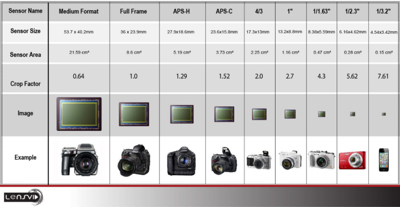
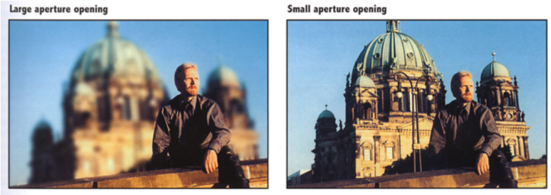
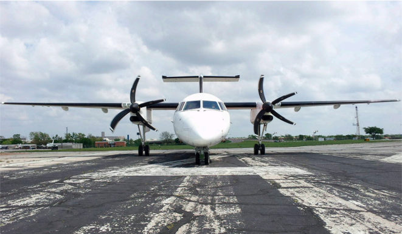
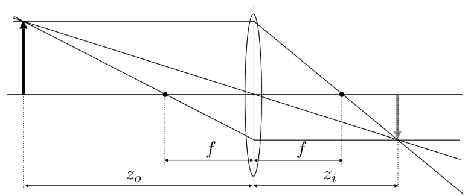

---
title: 【Games101】相机与透镜
date: 2025-12-16T00:00:00+08:00
mathjax: true
categories: ["Games101笔记"]
tags: ["图形学", "GAMES课程", "透视原理", "相机成像"]
description: "成像包含合成与捕捉。针孔相机清晰但进光量不足，透镜提升亮度却引入景深与视场角等物理权衡，揭示了亮度与清晰度的内在矛盾。"
cover: "/img/ComputerGraphics.png"
headerImage: "/img/rthykless.png"
math: true
--- 

成像包含合成与捕捉两个环节。针孔相机虽能实现清晰成像，但进光量不足；引入透镜可提升亮度，却带来了景深与视场角等物理权衡，揭示了亮度与清晰度的内在矛盾。 

我们在之前的课程里（光栅化、光线追踪）一直在忙着计算“光线是怎么传播的”。但这只是故事的一半。

**Synthesis (合成)**：我们在之前的课程里做的光栅化、光线追踪，是在计算场景中光线的传播。

**Capture (捕捉)**：这节课讲的是，如何用一个虚拟的“设备”（相机）把这些光线记录下来变成图像。
$$
\mathrm{Imaging} = \mathrm{Synthesis} + \mathrm{Capture}
$$

## 针孔与透镜

最原始的相机是**针孔相机 (Pinhole Camera)**。它很简单，却道出了成像的本质。利用小孔成像原理，强制让光线“各行其道”。因为孔极小，物体上一点发出的光，只能通过这唯一的孔打在传感器的一个点上。其优点在于：无限景深。无论远近，所有物体都是清晰的（没有虚焦概念）。

**致命缺陷**：**太暗了**。因为孔太小，进光量微乎其微。要想拍出亮的照片，曝光时间得按小时算。

> [!tip]
>
> **如果把孔弄大点呢？**结果是光线会乱。物体上一点发出的光会打在传感器的一片区域上，图像就糊了（Blur）。

为了解决“暗”的问题，我们需要把孔弄大（光圈）。但为了解决孔大导致的“糊”的问题，我们引入了**透镜**。透镜能把从物体上同一点发出、射向不同方向的光线，重新**汇聚**到传感器上的同一个点。代价则是**焦距 (Focus)** 的产生。

- 透镜只能让特定距离的物体完美汇聚。
- 比这个距离远或近的物体，汇聚点就不在传感器上了，结果就是**模糊 (Defocus Blur)**。

> [!note]
>
> **TA 划重点**： 这一权衡告诉我们，**景深 (Depth of Field)** 不是为了艺术特意加的滤镜，而是为了“让画面变亮”所付出的物理代价。

## 视场角 (Field of View, FOV)

这是在游戏引擎摄像机组件中最常见的参数之一。它决定了你能看到多少东西。

**视场角的的定义是**：相机能看到的视野范围角度。

FOV 由 传感器大小 (Sensor Size, $h$) 和 焦距 (Focal Length, $f$) 共同决定。想象一个等腰三角形，底边是传感器高度 $h$，高是焦距 $f$ 则其公式如下所示：

$$
FOV = 2 \arctan\left(\frac{h}{2f}\right)
$$

焦距越短，FOV 越大（广角镜头，如 17mm $\approx 104^\circ$）。焦距越长，FOV 越小（长焦镜头，如 200mm $\approx 12^\circ$）。传感器越大，FOV 越大（前提是焦距不变）这也是为什么全画幅相机的视野比半画幅相机广的原因 。

## 曝光 (Exposure):摄影三要素

照片的亮度不仅仅取决于场景里的 Radiance（光线追踪算出来的），还取决于相机接收了多少能量。其物理公式为：$H = T \times E$

$$
Exposure (曝光量) = Time (时间) $\times$ Irradiance (照度)
$$

### 光圈 (Aperture) - 控制 Irradiance ($E$)

F-Stop (光圈值)：写作 $F/N$（如 F1.4, F8）。其定义为：$N = f / D$（焦距除以光圈直径）。这里有一个反直觉的特性，就是F-Number 越小，光圈越大，进光量越多 。光圈越大（F值越小），景深越浅（背景越虚化）。

### 快门速度 (Shutter Speed) - 控制时间 ($T$)

传感器感光的持续时间（如 1/60秒，1/1000秒）。快门时间越长，物体运动产生的拖影越严重。

快门速度在渲染中的应用：有时候我们故意需要这种模糊来体现速度感或进行抗锯齿 (Temporal Anti-Aliasing 的思路来源之一) 。

**卷帘快门 (Rolling Shutter)**：对于高速运动物体，如果传感器是逐行扫描读取的，物体会发生扭曲（如飞机的螺旋桨）。

### 感光度 (ISO) - 后期增益

感光度可以定义为：对传感器信号的放大倍率（Gain）。噪点 (Noise)也与ISO有很大的关系，噪点是信号采样中的非目标信号，ISO 越高,对信号的采样敏感度越高，图像越亮，噪点也越多 。

这引出了摄影中经典的**“曝光三角”**，它们在图形学中对应着三种不同的渲染副作用：

| **物理参数**        | **控制变量**              | **渲染副作用 (Artifacts)**                                  |
| ------------------- | ------------------------- | ----------------------------------------------------------- |
| **光圈 (Aperture)** | 照度 $E$ (进光口的面积)   | **景深 (Depth of Field)**：光圈越大，背景越虚。             |
| **快门 (Shutter)**  | 时间 $T$ (进光的时间长短) | **运动模糊 (Motion Blur)**：时间越长，运动物体拖影越严重 。 |
| **感光度 (ISO)**    | 后期增益 (Gain)           | **噪点 (Noise)**：ISO 越高，信号放大越多，噪点越多。        |

##  薄透镜近似 (Thin Lens Approximation)

真实的摄像机/手机镜头组由多片玻璃组成，极其复杂。在图形学中，我们假设透镜是“理想的薄透镜”，以此简化计算。

### 三条核心定律

在一般的相机透镜模型中，遵循三种理想化的定律：**平行光穿过焦点**：所有平行于主轴的光线，穿过透镜后汇聚于焦点。**过光心不折射**：穿过透镜中心的光线路径不改变。**光路可逆**：光线倒着射回来，路径一模一样。

### 高斯成像公式 (The Gaussian Lens Equation)

这是一个神圣法则的公式，描述了物体距离 ($z_o$)、像距 ($z_i$) 和焦距 ($f$​) 之间的关系：

$f$：焦距（透镜的固有属性），$z_o$：物距（物体离透镜多远），$z_i$：像距（成像在透镜后多远）。
$$
\frac{1}{f} = \frac{1}{z_i} + \frac{1}{z_o}
$$

对于一个特定的焦距 $f$，物体离透镜的距离 $z_o$ 决定了它的像会在 $z_i$ 处清晰成像。如果传感器正好放在 $z_i$ 处，这个物体就是清晰的。

## 景深 (Depth of Field) 的物理原理

生活中拍照我们经常追求一种人像质感（虚化效果），为什么会有“焦内清晰，焦外模糊”的效果？

### 弥散圆 (Circle of Confusion, CoC)

如果传感器没放在理想像距 $z_i$ 上（或者物体移动了导致 $z_i$ 变了），原本汇聚成“一个点”的光线，在传感器上就会扩散成“一个光斑”。这个光斑就叫**弥散圆 (CoC)** 。CoC 大计算公式如下：

$$
C = A \frac{|z_s - z_i|}{z_i}
$$
其中 $A$ 是光圈直径，$z_s$ 是传感器距离透镜的距离，$z_i$ 是物体的理想像距。光圈 ($A$) 越大，CoC 越大，模糊越严重，景深越浅 17。这就是为什么拍人像虚化背景要用大光圈（如 F1.4）。

### 如何在 Ray Tracing 中实现景深？

要在光线追踪渲染器中实现真实的物理景深，不能只从针孔发射光线，需要模拟透镜成像过程

1. 先选定焦距、光圈大小、以及**对焦距离 (Focal Distance)**。再根据对焦距离，计算出场景中哪个平面是绝对清晰的。
2. **采样透镜**：对于屏幕上的每个像素，不再是从相机中心发射一条光线，而是从**透镜圆盘上随机采样一个点 ($x''$)**，连接这个采样点与焦平面上的对应点 ($x'''$)，形成光线。
3. **平均结果**：对这些光线的 Radiance 取平均值。如果物体在焦平面上，所有光线汇聚于一点（清晰）；如果不在，光线会散开（模糊）。

> [!note]
>
> **Shader 中的 DoF**：在实时渲染（光栅化）中，我们通常通过 Post-Processing（后处理）来模拟这个过程。我们会根据深度图 (Depth Buffer) 计算每个像素的 CoC 大小，然后进行不同程度的高斯模糊。

> [!note]
>
> **Path Tracing 中的 DoF**：如上所述，通过在相机镜头上抖动射线的起点（Lens Sampling）来物理地实现，这是最准确但计算成本最高的方法。

> [!tip]
>
> **F-Stop 的数学意义**：$N = f/A$。记住这个反比关系，对调节渲染器的相机参数非常重要。

## 光场 (Light Field)

**全光函数 (Plenoptic Function)**：这是一个“上帝视角”的函数。它认为如果你能记录下空间中**任何位置** 、**任何方向** 、**任何时间** 、**任何波长** 的光线，你就捕捉了整个视觉现实 。

**光场相机的工作原理**：普通相机记录的是光线的**位置**（ irradiance），而光场相机通过在传感器前放置**微透镜阵列 (MLA)** ，把每一个像素位置的光线按**方向**拆解开来记录 。

**先拍照后聚焦**：因为记录了方向信息，我们可以通过软件提取特定方向的光线，实现**计算重聚焦** 。

> [!tip]
>
> 这就像是在后期做“虚拟摄影”，你可以随意调整焦点和光圈，因为你已经把空间中所有的光线数据都“打包”带回家了 。

## 后话(非上课内容)

> [!tip]
>
> **主要是一些自己看课程时候的头脑风暴和具体的相机参数是怎样对应成像原理的**

### 延时摄影与快门速度的关系

首先我们要把两个容易混淆的时间概念拆开：

**拍摄间隔 (Interval)**：决定了**时间的流速**。比如每 5 秒拍一张，播放时 30fps，那么现实中的 5 秒就被压缩成了视频里的 1/30 秒。这决定了云彩跑得有多快。

**快门速度 (Shutter Speed)**：决定了**单帧的质感**。在这 1/30 秒的一瞬间里，物体是“凝固”的还是“拖影”的。快门控制了传感器感光的持续时间 ，直接决定了运动模糊的程度。

#### 1.决定画面的“流畅度” (Temporal Continuity)

这是两者最核心的关系。快门速度决定了延时摄影看起来是“卡顿的定格动画”还是“丝滑的流体运动”。

**A. 高速快门 (Fast Shutter) = 频闪/跳跃感**

**设置**：快门速度远小于拍摄间隔（例如：间隔 5秒，快门 1/1000秒）。**效果则是**：每一帧都是绝对清晰的瞬间。**视觉感受为**：物体（如行人、车流）会像瞬移一样跳跃。

这相当于在时间轴上进行了极窄的采样，完全没有**时间抗锯齿 (Temporal Anti-Aliasing)**，导致了严重的时间混叠（Temporal Aliasing），视觉上就是“卡顿”。

**B. 慢速快门 (Slow Shutter) = 丝滑/拖影感**

**设置**：快门速度接近拍摄间隔（例如：间隔 5秒，快门 2.5秒）。**效果则是**：每一帧都包含了物体在一段时间内的运动轨迹（Motion Blur）。**视觉感受为**：车流变成了连贯的光带，人群变成了流动的雾气。

利用**运动模糊 (Motion Blur)** 将帧与帧之间的空隙“填补”起来，欺骗人眼，让不连续的采样看起来像连续的流体。

#### 2.物理限制 (The Physical Constraint)

这是一个硬性的逻辑限制，在设置相机参数时必须遵守。公式为：
$$
T_{shutter} < T_{interval}
$$
**快门时间**必须小于**拍摄间隔**。如果你设置相机每 **2秒** 拍一张照片（间隔），你就绝对不能把快门设置为 **5秒**。**后果**：相机会由“延时模式”变成“连拍模式”，或者直接报错，因为上一张还没曝光完，下一张的拍摄指令就来了。

#### 进阶应用：180度快门角原则 (The 180° Shutter Rule)

在电影摄影中，为了让运动看起来自然，有一个黄金法则，在延时摄影中同样适用。即：**快门速度应该是帧间隔的一半。**举例：如果你每 4秒 拍一张，为了获得电影般自然的流动感，最佳快门速度应设为 2秒 左右。

$$
\\text{Shutter Speed} \approx \frac{1}{2} \times \text{Interval}
$$
> [!note]
>
> **TA 视角**：这本质上是在做**时间域上的信号重建**。用 50% 的时间占空比来模糊高频信号，防止视觉上的频闪效应。

> [!tip]
>
> 想拍**云卷云舒、车水马龙**（流体感） $\rightarrow$ **加滤镜（ND镜），强行降低快门速度**，让它变慢。
>
> 想拍**花开花落、建筑施工**（定格感） $\rightarrow$ **提高快门速度**，保证每帧清晰。

### 曝光补偿和成像原理

#### EV 就是对 $H$ 的对数描述

本节课给出的最核心曝光公式是 ：
$$
H = T \times E
$$

**$H$ (Exposure)**：总曝光量（照片有多亮），**$T$ (Time)**：快门时间（Shutter Speed），**$E$ (Irradiance)**：传感器接收到的功率密度，由光圈（Aperture）控制。

**EV (Exposure Value)** 其实就是 $H$ 的一种**对数表达形式**（以 2 为底）。在摄影和渲染中，**+1 EV** 意味着总曝光量 $H$ **翻倍**。**-1 EV** 意味着总曝光量 $H$ **减半**。

#### 曝光补偿 vs. 本节课的“副作用”

当你调节 EV 曝光补偿（Exposure Compensation） 时，你本质上是在告诉相机（或渲染引擎的自动曝光系统）：“**我不喜欢现在的亮度，请帮我把画面调亮/调暗。**”为了达到这个目的，系统必须通过改变本节课讲到的“曝光三要素”来实现。而这正是本节课的重点——改变参数会带来副作用 (Artifacts) 。

假设你要 **+1 EV**（让画面变亮 1 倍），系统有三种物理手段，分别对应本节课的三个知识点：

**手段 A：开大光圈 (Change Aperture)**，减小 F-Number（例如从 F2.8 变为 F2.0），增加 $E$ 。这会改变 **CoC (弥散圆)** 的大小。会导致**景深变浅 (Shallower Depth of Field)**。背景会变得更模糊 。

**手段 B：延长快门 (Change Shutter Speed)**，增加 $T$（例如从 1/60s 变为 1/30s）。增加了传感器收集光线的时间。副作用：会产生运动模糊 (Motion Blur)。如果场景里有东西在动，拖影会变长 。

**手段 C：提高感光度 (Change ISO)**，后期放大信号（Gain） 。这不属于光线光学的范畴，属于电子信号处理。可能会导致**噪点 (Noise)** 增加 。

#### 在渲染引擎 (TA 视角) 中的应用

在游戏引擎（如 Unreal Engine）中，`Exposure Compensation` 通常有两种工作模式，对应本节课的不同理解层面：

**物理相机模式 (Physical Camera Mode)**：当你调节 EV 时，引擎会真的去调整虚拟相机的**光圈**或**快门**参数。结果：你不仅调亮了画面，你的景深（DoF）和动态模糊效果也会随之改变。这完全符合 Lecture 19 的物理描述。

**纯后处理模式 (Post-Process Only)**：引擎不改物理参数，直接把渲染出来的 Radiance 乘上一个倍数（$2^{EV}$）。**结果**：画面变亮了，但景深和动态模糊没变。这相当于仅仅做了 ISO 增益，或者是 Tone Mapping 之前的乘法操作。现代图形学和计算摄影中在该模式下可能还会使用一些平滑采样算法，以减少ISO增强后的噪点，

> [!note]
>
> 如果想获得正确的**曝光 ($H$)**，可以调整光圈 ($A$) 或快门 ($T$)。
>
> **EV 补偿**：无论你调整哪个，每调整一档（EV $\pm 1$），能量 $H$ 就翻倍或减半。
>
> 为了获得正确的 EV（亮度），必须在**景深**（光圈决定）和**模糊**（快门决定）之间做权衡——这就是摄影和拟真渲染的艺术所在。

> [!tip]
>
> 既然提到了降噪算法,索性刨根问底了解一下计算摄影部分

### 计算摄影与现代降噪算法

#### 核心思路：用“多采样”对抗“随机性”

根据统计学原理，噪点（Noise）通常是随机分布的，而信号（Signal，即真实的图像细节）是固定的。如果我们能获得同一个像素的多次采样值并取平均，随机的噪点就会相互抵消，而真实的信号会保留下来。公式：信噪比（SNR）与采样次数（$N$）的平方根成正比。

$$
SNR\propto \sqrt{N}
$$
采样 4 次，噪点减半；采样 16 次，噪点变为 1/4。

#### 计算摄影中的应用 (手机/相机)

当你用手机在夜景模式（Night Mode）拍摄时，ISO 往往很高，但照片却很纯净。这是因为手机在后台默默做了以下几件事：

**A. 多帧降噪 (Multi-Frame Noise Reduction, MFNR) —— 时间上的平滑**

原理：当你按下快门的一瞬间，手机其实连续拍了 6-10 张短曝光（高 ISO）的照片。

算法步骤：对齐 (Alignment)：利用陀螺仪和图像特征，计算手抖带来的位移，把这几张照片“对齐”。堆栈 (Stacking)：将对齐后的像素值进行加权平均。效果：虽然每一张单帧都是高噪点的（符合 Lecture 19 的物理规律），但合成后的结果相当于一张“长曝光、低 ISO”的照片。这相当于在时间维度上增加了采样数。

**B. 像素合并 (Pixel Binning) —— 空间上的平滑**

原理：很多现代传感器（如 4800万、1亿像素）支持将相邻的 4 个像素（2x2）甚至 9 个像素（3x3）合并成一个“大像素”来用。

效果：牺牲分辨率：48MP 变成 12MP。换取信噪比：单个“大像素”的受光面积翻了 4 倍，感光能力大大增强，从而物理上减少了对 ISO 增益的需求。这相当于在空间维度上进行了平均采样。

#### 实时渲染中的应用 (光线追踪)

在游戏的光线追踪（Ray Tracing）中，我们面临同样的问题：为了保证 60FPS，每像素只能发射极少的光线（Low SPP），导致画面全是噪点。现代图形学通过以下算法解决(其实和计算摄影很像)：

**A. 时域累积 (Temporal Accumulation)**

逻辑：既然这一帧的采样不够，那就“借用”上一帧的结果。

TAA (Temporal Anti-Aliasing) 的进化：利用 运动向量 (Motion Vector)，找到当前像素在上一帧的位置。将上一帧的颜色与当前帧的颜色进行混合（通常是 90% 历史 + 10% 新采样）。代价则是：鬼影现象 (Ghosting)。如果运动预测失败（如光影变化太快），会有拖影。

**B. SVGF (Spatiotemporal Variance-Guided Filtering)**

[一文搞懂Spatiotemporal Variance-Guided Filter（SVGF）算法及其实现细节 - 知乎](https://zhuanlan.zhihu.com/p/699706592)

这是目前工业界（如 NVIDIA RTX）最主流的降噪算法框架之一。时空联合：时域 (Temporal)：先做时间上的累积。空域 (Spatial)：如果时间累积后还是有噪点（比如刚出现的物体，没有历史帧），就在当前帧的周围找相似的像素借用信息（做模糊）。方差引导 (Variance-Guided)：算法会计算每个像素的“方差”（即噪点程度）。

聪明地模糊：只在方差大（噪点多）的地方多模糊一点，在方差小（细节多）的地方少模糊，从而保留边缘细节。

**C. 深度学习降噪 (AI Denoising / DLSS)**

原理：不再用传统的数学公式（高斯模糊、双边滤波）来平滑，而是训练一个神经网络。

输入：噪点图 + 辅助信息（Albedo 贴图、法线 Normal 贴图、深度 Depth 贴图），输出：AI 猜出来的“干净图像”。代表技术：NVIDIA DLSS (Ray Reconstruction)。它甚至能补全因为采样不足而丢失的高频细节。

#### DLSS就是深度学习插帧吗？

答案是：**不完全是，这是对它功能的一种片面理解（主要受 DLSS 3.0 营销影响），它的核心定义其实是“超分辨率”技术。**DLSS 的全称是 **Deep Learning Super Sampling**，中文直译为 **“深度学习超级采样”**。

**它是“放大镜”，不是“补帧机”**

从名字 **Super Sampling (超级采样)** 就能看出，DLSS 的老本行是 **“空间上的分辨率提升”**，而不是“时间上的帧数插入”。

**原理 (DLSS 1.0 / 2.0)**：**输入**：显卡只渲染一张**低分辨率**的小图（比如 1080P），这很省力，帧数自然就高。**处理**：AI 神经网络分析这张小图，结合**多帧时域信息（Temporal Accumulation）和运动向量（Motion Vector）**，把它“脑补”放大成一张**高分辨率**的大图（比如 4K）。**输出**：你看到的是清晰的 4K 画面，但显卡只需要干 1080P 的活。

在 DLSS 3.0 发布之前，DLSS **完全没有插帧功能**，它纯粹是画质放大技术（Upscaling）。

**为什么会觉得它是“插帧”？——因为 DLSS 3**

之所以会有“它是插帧技术”的印象，是因为 NVIDIA 在 **DLSS 3.0** 中引入了一个新功能，叫 **Frame Generation (帧生成)**。

DLSS 3 的构成：
$$
DLSS\ 3 = DLSS\ 2\ (超级采样) + Reflex\ (低延迟) + \textbf{Frame Generation\ (帧生成)}
$$

**帧生成 (插帧) 的原理**：

显卡渲染了第 1 帧和第 2 帧，AI 分析这两帧的**光流场 (Optical Flow Field)**（还记得 Lecture 19 提到的运动信息吗？），计算出像素是怎么移动的。AI 直接在两帧中间**生成（插入）**一个新的帧（第 1.5 帧）。**结果**：这一帧完全没经过渲染管线，是 AI 算出来的。帧数瞬间翻倍。

| **技术版本**   | **核心功能**                      | **空间维度 (分辨率)** | **时间维度 (帧率)**          | **是否插帧？** |
| -------------- | --------------------------------- | --------------------- | ---------------------------- | -------------- |
| **DLSS 1 / 2** | **超分辨率 (Super Resolution)**   | 把 1080P 变成 4K      | 间接提升（因为渲染负荷低了） | **否**         |
| **DLSS 3**     | **帧生成 (Frame Gen)**            | 把 1080P 变成 4K      | **直接翻倍**（插入假帧）     | **是**         |
| **DLSS 3.5**   | **光线重建 (Ray Reconstruction)** | 修复光追噪点          | 提升画质                     | **否**         |

DLSS 的全称是深度学习超级采样，它的本体是画质放大技术；但DLSS 3 确实包含了深度学习插帧技术作为其功能的一部分。