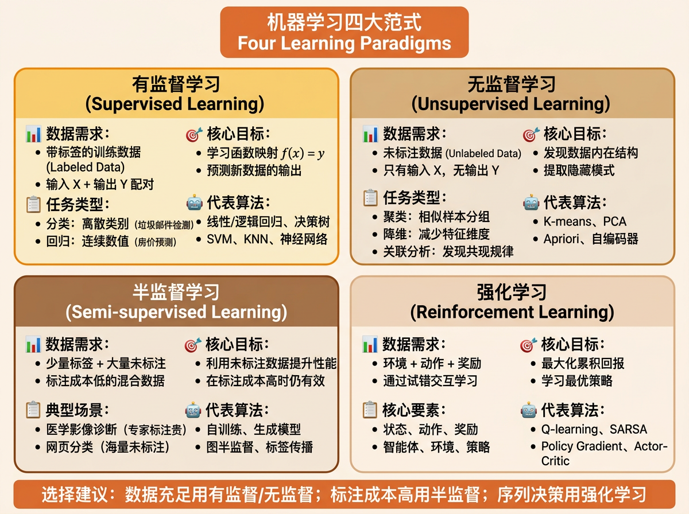
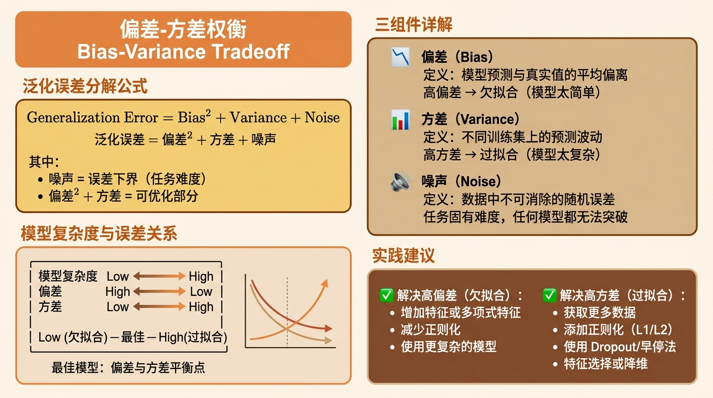
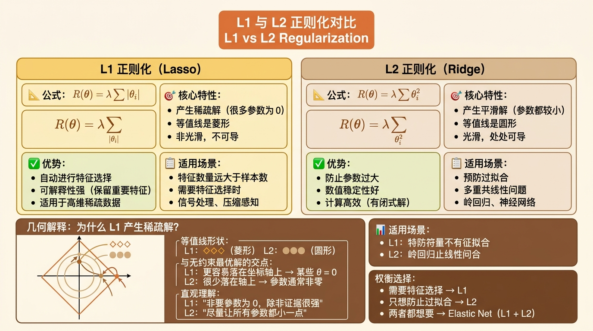
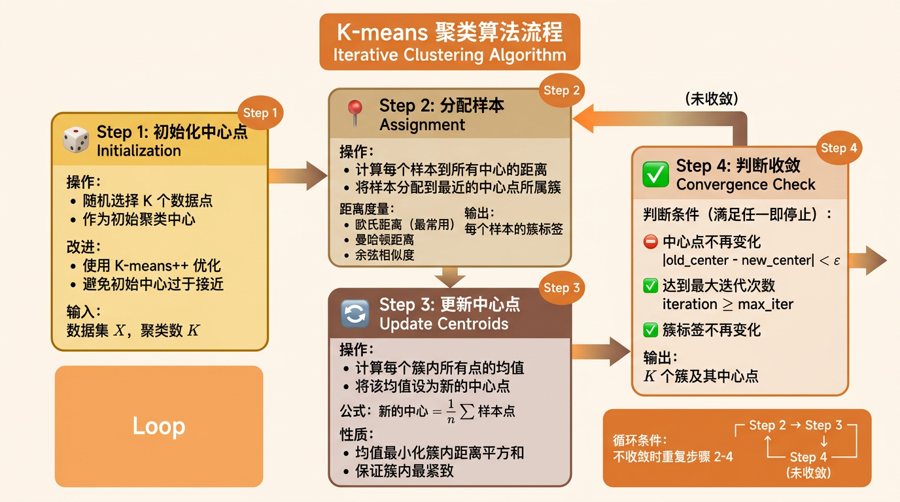
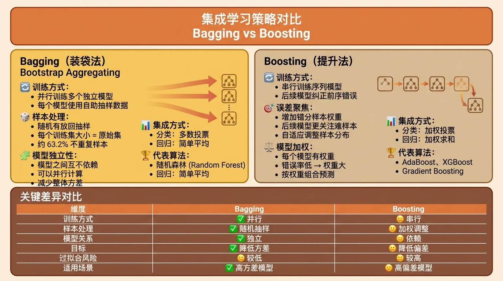
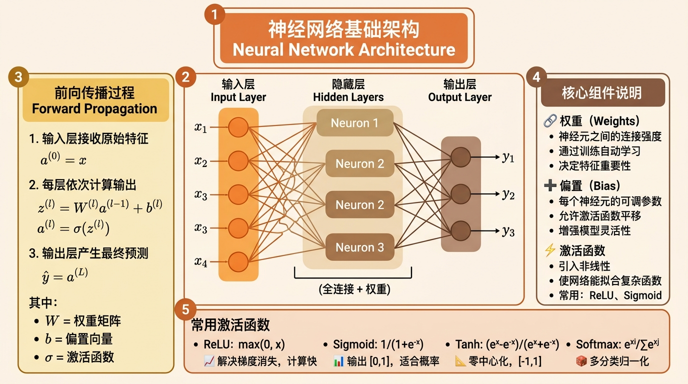

# 机器学习基础知识全梳理：从原理到实践

## 写在前面

机器学习作为人工智能的核心分支，已经渗透到我们生活的方方面面：推荐系统推荐你喜欢的音乐、垃圾邮件自动识别、自动驾驶车辆感知环境、医疗辅助诊断等等。但你是否想过，这些系统是如何"学习"的？

**本文适合对机器学习已有初步了解的学习者进行系统复习**，内容从基础概念到算法原理，由浅入深，注重理解而非死记硬背。如果你是机器学习新手，强烈推荐先系统学习吴恩达老师的经典课程。

> **推荐入门课程**：
> - [吴恩达机器学习 2025 重制版](https://www.bilibili.com/video/BV1owrpYKEtP/) - B站高清完整课程，附课件和实战项目
> - [CS229: Machine Learning](https://see.stanford.edu/Course/CS229) - 斯坦福大学官方课程资料
> - [3Blue1Brown: Neural Networks](https://www.youtube.com/playlist?list=PLZHQObOWTQDNU6R1_67000DiV4ZFndKSg) - 视觉化理解神经网络

## 一、什么是机器学习？

### 形式化定义

机器学习是人工智能的一个分支，它使计算机系统能够从数据中学习并做出决策或预测，而无需进行明确的编程。

**通俗理解**：假设你有一个数据集，需要通过这个数据集找出一个函数或方法来分析数据并对新数据进行预测。从这个角度看，**机器学习本质上就是"找函数"的过程**。

### 学习范式类比

我们可以用一个形象的类比来理解机器学习的核心思想：

| 传统编程 | 机器学习 |
|---------|---------|
| 输入数据 + 明确规则 → 输出结果 | 输入数据 + 期望输出 → 推导规则 |
| 规则由人类编写 | 规则从数据中学习 |
| 适合规则明确的任务 | 适合规则难以定义的任务 |

**举例说明**：
- **传统编程**：编写一个程序判断数字是否能被 2 整除——规则明确（`x % 2 == 0`）
- **机器学习**：训练模型识别手写数字——规则难以用代码表达，需要从大量样本中学习

### 学习的三要素

有效的机器学习需要三个核心要素：

1. **数据（Data）**：学习的素材，质量决定上限
2. **模型（Model）**：函数的假设空间，决定表达能力
3. **算法（Algorithm）**：从数据中优化模型参数的方法

> **延伸阅读**：
> - [Mitchell, T. (1997). Machine Learning](https://www.cs.cmu.edu/~tom/mlbook.html) - 经典教材，学习形式化定义
> - [Learning representations by back-propagating errors](https://www.nature.com/articles/323533a0) - 神经网络反向传播经典论文

## 二、机器学习四大范式



### 1. 有监督学习（Supervised Learning）

#### 核心思想

有监督学习利用**带有标签的训练数据**（labeled data），学习从输入变量 X 到输出变量 Y 的函数映射。

**数学表达**：

$$ y = f(x) $$

其中：
- $x$ 是输入特征向量
- $y$ 是目标标签或值
- $f$ 是我们要学习的函数

#### 任务类型

| 类型 | 输出类型 | 典型应用 |
|------|---------|---------|
| **分类问题** | 离散类别 | 垃圾邮件检测、图像识别、疾病诊断 |
| **回归问题** | 连续数值 | 房价预测、股票价格、气温预报 |

#### 代表算法

- 线性回归、逻辑回归
- 决策树、随机森林、XGBoost
- 支持向量机（SVM）
- K近邻算法（KNN）
- 神经网络

#### 集成学习

集成学习将有监督学习推向了新高度，它将多个"弱"模型组合成"强"模型：

- **Bagging（装袋法）**：并行训练多个独立模型，投票或平均决策（如随机森林）
- **Boosting（提升法）**：串行训练模型，后续模型纠正前序错误（如 AdaBoost、XGBoost）

> **延伸阅读**：
> - [Scikit-learn Supervised Learning Guide](https://scikit-learn.org/stable/supervised_learning.html) - 监督学习官方指南
> - [XGBoost: A Scalable Tree Boosting System](https://arxiv.org/abs/1603.02754) - XGBoost 原论文

### 2. 无监督学习（Unsupervised Learning）

#### 核心思想

无监督学习处理**只有输入变量 X** 的训练数据，利用未标注数据对数据的内在结构建模。它不需要标签，而是要发现数据中隐藏的模式。

#### 任务类型

| 类型 | 目标 | 典型应用 |
|------|------|---------|
| **关联分析** | 发现事物同时出现的规律 | 购物篮分析（买啤酒的人也常买尿布） |
| **聚类** | 将相似样本归为一组 | 客户分群、图像压缩、异常检测 |
| **降维** | 减少特征维度，保留关键信息 | 数据可视化、特征提取、降噪 |
| **异常检测** | 识别偏离正常模式的数据 | 欺诈检测、系统监控 |

#### 降维机制

降维是减少数据维度同时保留有意义信息的技术，分为两类：

- **特征选择**：选择原始特征的一个子集
- **特征提取**：将数据从高维空间变换到低维空间（如 PCA）

#### 代表算法

- K-means 聚类
- 主成分分析（PCA）
- Apriori 关联规则
- 自编码器

> **延伸阅读**：
> - [Unsupervised Learning Guide](https://scikit-learn.org/stable/unsupervised_learning.html) - 无监督学习指南
> - [Principal Component Analysis](https://setosa.io/ev/principal-component-analysis/) - PCA 交互式可视化

### 3. 半监督学习（Semi-supervised Learning）

#### 核心思想

半监督学习结合了有监督学习和无监督学习的特点，使用**少量标注数据和大量未标注数据**。这在标注成本高昂的场景中特别有价值。

#### 常见场景

- 医学影像诊断（专家标注成本高）
- 网页分类（海量的未标注网页）
- 语音识别（标注时间序列数据困难）

#### 典型方法

- **自训练（Self-training）**：用有监督学习模型预测未标注数据，将高置信度样本加入训练集
- **生成模型**：假设数据服从特定分布（如高斯混合模型）
- **图半监督**：利用数据间的邻接关系传播标签

> **延伸阅读**：
> - [A Survey on Semi-Supervised Learning](https://arxiv.org/abs/1704.00158) - 半监督学习综述
> - [Label Propagation Algorithm](https://scikit-learn.org/stable/modules/label_propagation.html) - 标签传播算法

### 4. 强化学习（Reinforcement Learning）

#### 核心思想

强化学习通过**试错（Trial and Error）** 来学习最优策略，目标是最大化累积回报。智能体（Agent）根据当前状态选择动作，环境反馈奖励和下一状态。

#### 关键要素

| 要素 | 说明 |
|------|------|
| **状态（State）** | 智能体所处的环境状况 |
| **动作（Action）** | 智能体可以采取的操作 |
| **奖励（Reward）** | 环境对动作的反馈，正向奖励鼓励、负向奖励惩罚 |
| **策略（Policy）** | 从状态到动作的映射函数 |

#### 典型应用

- 游戏AI（AlphaGo、星际争霸AI）
- 机器人控制（步行、抓取）
- 自动驾驶
- 推荐系统（探索与利用）

#### 核心算法

- Q-learning（基于价值函数）
- SARSA（同策略时序差分）
- Policy Gradient（基于策略梯度）
- Actor-Critic（价值+策略混合）

> **延伸阅读**：
> - [Reinforcement Learning: An Introduction](http://incompleteideas.net/book/bookdraft2017nov5.pdf) - Sutton & Barto 经典教材
> - [Human-level control through deep reinforcement learning](https://www.nature.com/articles/nature14236) - DeepMind 论文

## 三、核心概念深度解析

### 1. 偏差-方差权衡

机器学习模型面对的是一个永恒的矛盾：**太简单的模型学不到复杂规律，太复杂的模型会记住噪声**。



#### 偏差（Bias）

**定义**：模型预测值与真实值的平均偏离程度，反映模型本身的拟合能力。

**高偏差**：模型太简单，无法捕捉数据的真实规律，表现为**欠拟合**。

> **比喻**：用一个直尺去拟合弯曲的数据，无论怎么调整直尺都画不出那条曲线。

#### 方差（Variance）

**定义**：同一模型在不同训练数据集上的预测波动程度，反映模型对数据扰动的敏感度。

**高方差**：模型太复杂，对训练数据的噪声过度敏感，表现为**过拟合**。

> **比喻**：考试前死记硬背了模拟卷的所有题目，但考试遇到稍有不同的题就蒙了。

#### 噪声（Noise）

**定义**：数据中无法消除的随机误差，代表了任务本身的难度，是泛化误差的下界。

#### 泛化误差分解

$$ \text{泛化误差} = \text{偏差}^2 + \text{方差} + \text{噪声} $$

| 模型复杂度 | 偏差 | 方差 | 泛化误差 |
|------------|------|------|---------|
| 低（简单模型） | 高 | 低 | 高（欠拟合） |
| 中（适中模型） | 中 | 中 | 低（最佳） |
| 高（复杂模型） | 低 | 高 | 高（过拟合） |

> **延伸阅读**：
> - [Understanding the Bias-Variance Tradeoff](https://towardsdatascience.com/understanding-the-bias-variance-tradeoff-1e2923a8ee00) - 详细解释
> - [百面机器学习：偏差与方差](https://book.douban.com/subject/27087403/) - 中文经典教材

### 2. 过拟合与欠拟合

#### 表现特征

| 现象 | 训练集表现 | 测试集表现 |
|------|------------|-----------|
| **过拟合** | 优秀（近乎完美） | 差（远差于训练集） |
| **欠拟合** | 差 | 差 |
| **恰当拟合** | 良好 | 接近训练集 |

#### 过拟合的原因

1. **模型过于复杂**：参数数量远超数据规模
2. **训练数据不足**：样本无法代表真实分布
3. **数据噪声过大**：模型将噪声当作特征学习
4. **训练时间过长**：过度训练导致"死记硬背"

#### 欠拟合的原因

1. **模型过于简单**：表达能力不足
2. **特征工程不足**：关键特征缺失
3. **训练不充分**：未收敛或迭代次数过少

#### 解决过拟合的方法

| 方法 | 原理 | 适用场景 |
|------|------|---------|
| **更多数据** | 提供更全面的样本分布 | 数据收集成本可接受 |
| **数据增强** | 通过变换生成额外样本 | 图像、文本数据 |
| **正则化** | 添加参数惩罚项，限制复杂度 | 参数过多的模型 |
| **Dropout** | 训练时随机丢弃神经元 | 深度神经网络 |
| **早停法** | 验证误差上升时停止训练 | 迭代式训练 |
| **交叉验证** | 更客观地评估泛化能力 | 小数据集 |

#### 解决欠拟合的方法

| 方法 | 说明 |
|------|------|
| 增加新特征、特征组合 |
| 添加多项式特征（如 $x^2$, $x^3$） |
| 减少正则化强度 |
| 使用更复杂的模型（深度学习、核SVM） |

> **延伸阅读**：
> - [Regularization (Mathematics)](https://en.wikipedia.org/wiki/Regularization_(mathematics)) - 正则化数学原理
> - [Early Stopping - Prevent Overfitting of Neural Networks](https://machinelearningmastery.com/early-stopping-to-avoid-overtraining-neural-network-models/) - 早停法详解

### 3. 正则化与参数稀疏性

#### 为什么参数越小代表模型越简单？

正则化的核心思想是**通过约束参数大小来限制模型复杂度**，其原理可以从数学直观理解：

1. **参数稀疏即特征选择**：小的参数意味着对应特征的权重低，相当于弱化了该特征
2. **平滑性**：参数越小，函数曲线越平滑，不会在小区间内剧烈波动
3. **梯度控制**：大参数会产生大梯度，导致预测值在局部剧烈变化

#### L1 与 L2 正则化



| 类型 | 公式 | 特点 | 典型应用 |
|------|------|------|---------|
| **L1（Lasso）** | $\lambda \sum |\theta_i|$ | 产生稀疏解 | 特征选择 |
| **L2（Ridge）** | $\lambda \sum \theta_i^2$ | 平滑解，防止参数过大 | 岭回归 |

**L1 为什么能产生稀疏解？**

L1 正则化的损失函数等值线是菱形的，与无约束最优解的交点更容易落在坐标轴上，意味着某些参数恰好为 0。

> **延伸阅读**：
> - [L1 and L2 Regularization](https://towardsdatascience.com/l1-and-l2-regularization-clearly-explained-ace71d3db32c) - 可视化理解
> - [The Lasso](https://www.stat.cmu.edu/~ryantibs/convexopt-F15/lectures/lasso.pdf) - Lasso 理论基础

## 四、经典算法详解

### 有监督学习算法

#### 1. 线性回归（Linear Regression）

##### 基本原理

线性回归假设目标变量与特征之间存在线性关系，通过最小化预测误差（通常用最小二乘法）来拟合最佳直线或超平面。

**数学表达**：

$$
h_\theta(x) = \theta_0 + \theta_1 x_1 + \dots + \theta_n x_n
$$
**损失函数**：

$$
J(\theta) = \frac{1}{2m} \sum_{i=1}^{m} (h_\theta(x^{(i)}) - y^{(i)})^2
$$

##### 优缺点

| 优点 | 缺点 |
|------|------|
| 实现简单、计算高效 | 只能建模线性关系 |
| 可解释性强（参数即特征重要性） | 对异常值敏感 |
| 是很多复杂算法的基础 | 需要满足高斯噪声假设 |

##### 代码示例

```python
import pandas as pd
import matplotlib.pyplot as plt
from sklearn.datasets import fetch_california_housing
from sklearn.model_selection import train_test_split
from sklearn.linear_model import LinearRegression
from sklearn.metrics import mean_squared_error, r2_score

# 加载加州房价数据集
housing = fetch_california_housing()
X = pd.DataFrame(housing.data, columns=housing.feature_names)
y = housing.target

# 划分训练集和测试集
X_train, X_test, y_train, y_test = train_test_split(X, y, test_size=0.2, random_state=42)

# 训练线性回归模型
lr = LinearRegression()
lr.fit(X_train, y_train)

# 在测试集上进行预测
y_pred = lr.predict(X_test)

# 评估模型
mse = mean_squared_error(y_test, y_pred)
r2 = r2_score(y_test, y_pred)
print(f"均方误差: {mse:.4f}")
print(f"R² 得分: {r2:.4f}")
```

> **延伸阅读**：
> - [Linear Regression Implementation](https://scikit-learn.org/stable/modules/linear_model.html#ordinary-least-squares) - scikit-learn 官方文档
> - [The Elements of Statistical Learning](https://hastie.su.domains/ElemStatLearn/) - 统计学习圣经

#### 2. 逻辑回归（Logistic Regression）

##### 基本原理

逻辑回归用于**二分类问题**，通过 Sigmoid 函数将线性输出映射到 $[0,1]$ 区间，表示属于正类的概率。

**Sigmoid 函数**：

$$
\sigma(z) = \frac{1}{1 + e^{-z}}
$$
**决策规则**：当 $P(y=1|x) > 0.5$ 时预测为正类，否则为负类。

##### 为什么需要 Sigmoid？

线性模型的输出范围是 $(-\infty, +\infty)$，而概率必须限制在 $[0,1]$。Sigmoid 函数完美解决了这个问题：

1. 指数函数 $e^z$ 恒大于 0
2. 除以自身加 1，保证结果小于 1
3. 极限行为：$\sigma(-\infty) = 0$, $\sigma(+\infty) = 1$

##### 决策边界

逻辑回归的决策边界是线性的（或超平面），当特征空间线性可分时效果良好，否则需要引入多项式特征。

##### 代码示例

```python
import numpy as np
import matplotlib.pyplot as plt
from sklearn.datasets import load_iris
from sklearn.model_selection import train_test_split
from sklearn.linear_model import LogisticRegression
from sklearn.metrics import accuracy_score, classification_report
from matplotlib.colors import ListedColormap

# 加载鸢尾花数据集
iris = load_iris()
X = iris.data[:, :2]  # 只选择前两个特征用于可视化
y = iris.target

# 划分训练集和测试集
X_train, X_test, y_train, y_test = train_test_split(X, y, test_size=0.2, random_state=42)

# 训练逻辑回归模型
lr = LogisticRegression(max_iter=200)
lr.fit(X_train, y_train)

# 在测试集上进行预测
y_pred = lr.predict(X_test)

# 评估模型
print(f"准确率: {accuracy_score(y_test, y_pred):.4f}")
print("\n分类报告:")
print(classification_report(y_test, y_pred, target_names=iris.target_names))
```

> **延伸阅读**：
> - [Logistic Regression Guide](https://scikit-learn.org/stable/modules/linear_model.html#logistic-regression) - 官方指南
> - [The Sigmoid Function](https://en.wikipedia.org/wiki/Sigmoid_function) - 数学性质

#### 3. 决策树（Decision Tree）

##### 基本原理

决策树通过一系列**是/否问题**将数据逐步分割到叶子节点，每个节点对应一个特征判断，叶子节点对应预测结果。

**工作流程**：
1. 选择最优特征和切分点
2. 根据切结果将数据分为子集
3. 递归构建左右子树
4. 达到停止条件（深度、样本数、纯度）时生成叶子

##### 关键概念

| 概念 | 说明 |
|------|------|
| **信息增益** | 切分前后信息熵的减少量 |
| **基尼指数** | 衡量集合纯度（越小越纯） |
| **剪枝** | 减少复杂度，防止过拟合 |

##### 优缺点

| 优点 | 缺点 |
|------|------|
| 可解释性强（可视化为树结构） | 容易过拟合 |
| 无需特征缩放 | 不稳定（数据微小变化导致树结构大变） |
| 可处理分类和回归任务 | 难以建模线性关系 |

##### 代码示例

```python
import matplotlib.pyplot as plt
from sklearn.datasets import load_iris
from sklearn.model_selection import train_test_split
from sklearn.tree import DecisionTreeClassifier, plot_tree
from sklearn.metrics import accuracy_score

# 加载鸢尾花数据集
iris = load_iris()
X = iris.data
y = iris.target

# 划分训练集和测试集
X_train, X_test, y_train, y_test = train_test_split(X, y, test_size=0.2, random_state=42)

# 构建决策树模型（限制深度防止过拟合）
dt = DecisionTreeClassifier(max_depth=3, random_state=42)
dt.fit(X_train, y_train)

# 在测试集上进行预测
y_pred = dt.predict(X_test)
print(f"准确率: {accuracy_score(y_test, y_pred):.4f}")

# 绘制决策树
plt.figure(figsize=(14, 8))
plot_tree(dt, filled=True, feature_names=iris.feature_names,
          class_names=iris.target_names, fontsize=10)
plt.title("决策树结构可视化", fontsize=14)
plt.tight_layout()
plt.show()
```

> **延伸阅读**：
> - [Scikit-learn Decision Trees](https://scikit-learn.org/stable/modules/tree.html) - 官方文档
> - [CART: Classification and Regression Trees](https://www.taylorfrancis.com/books/9780367812053) - CART 算法经典著作

#### 4. 朴素贝叶斯（Naive Bayes）

##### 基本原理

朴素贝叶斯基于**贝叶斯定理**，通过先验概率和似然计算后验概率进行分类。

**贝叶斯定理**：

$$
P(h|d) = \frac{P(d|h)P(h)}{P(d)}
$$
其中：
- $P(h|d)$ 是后验概率（在数据 d 下假设 h 为真的概率）
- $P(d|h)$ 是似然（假设 h 为真时数据 d 的概率）
- $P(h)$ 是先验概率
- $P(d)$ 是证据因子（归一化常数）

##### 为什么"朴素"？

朴素贝叶斯假设**所有特征相互独立**。这个假设在现实中很少成立，但算法依然在实践中效果很好，原因是：
- 对分类要求不高，只要找到概率最高的类别即可
- 特征独立性假设带来的简化往往抵消了假设误差

##### 应用场景

- 文本分类（垃圾邮件过滤、新闻分类）
- 情感分析
- 医学诊断

##### 示例：天气与运动

给定历史数据：`{天气, 温度, 湿度} → 是否运动`，当今天是 `{晴天, 炎热, 高湿}` 时，计算：
- $P(\text{运动}|晴天,炎热,高湿)$
- $P(\text{不运动}|晴天,炎热,高湿)$

选择概率更高的作为预测结果。

> **延伸阅读**：
> - [Naive Bayes Documentation](https://scikit-learn.org/stable/modules/naive_bayes.html) - 官方文档
> - [Naive Bayes for Text Classification](https://arxiv.org/abs/1302.4932) - 文本分类应用

#### 5. K近邻算法（KNN）

##### 基本原理

KNN 是一种**基于实例的学习**，不显式训练模型，而是直接存储所有训练数据。预测时，找到 k 个最相似的训练样本，根据它们的标签进行预测。

##### 工作流程

1. 计算待分类样本与所有训练样本的距离（欧氏距离、曼哈顿距离等）
2. 选择距离最近的 k 个样本
3. 分类问题：采用**多数投票**；回归问题：采用**平均值**

##### 关键超参数

| 参数 | 影响 |
|------|------|
| **k** | k 过小（k=1）：过拟合、对噪声敏感；k 过大：欠拟合、决策边界模糊 |
| **距离度量** | 欧氏距离、曼哈顿距离、余弦相似度等 |
| **权重** | 等权重、距离加权（近邻权重更大） |

##### 优缺点

| 优点 | 缺点 |
|------|------|
| 实现简单、直观 | 预测慢（需要计算与所有训练样本的距离） |
| 无需训练阶段 | 对数据分布敏感 |
| 可处理多分类任务 | 需要合适的距离度量和 k 值 |

> **延伸阅读**：
> - [KNN Algorithm Detailed Explanation](https://www.analyticsvidhya.com/blog/2018/08/introduction-k-nearest-neighbours-algorithm/) - 详细教程
> - [Distance Metrics in Machine Learning](https://medium.com/@kunaljangir01/distance-metrics-in-machine-learning-e99e8e0f2342) - 距离度量对比

#### 6. 支持向量机（SVM）

##### 基本原理

SVM 在特征空间中寻找一个**最优超平面**，使两类样本点之间的**间隔（Margin）**最大化。

##### 核心思想

1. **最大间隔**：选择距离两类样本都最远的超平面，提高泛化能力
2. **支持向量**：位于间隔边界上的样本点，唯一影响决策边界的点
3. **核技巧**：通过核函数将数据映射到高维空间，解决线性不可分问题

##### 数学基础

超平面方程：$w \cdot x + b = 0$

决策函数：$f(x) = \text{sign}(w \cdot x + b)$

优化目标：
$$
\min_{w,b} \frac{1}{2}\|w\|^2 + C \sum_{i=1}^{n} \xi_i
$$
其中 $\xi_i$ 是松弛变量，$C$ 是正则化参数。

##### 常用核函数

| 核函数 | 公式 | 特点 |
|--------|------|------|
| **线性核** | $K(x,y) = x \cdot y$ | 线性可分数据，速度快 |
| **多项式核** | $K(x,y) = (x \cdot y + c)^d$ | 可捕获非线性关系 |
| **RBF核（高斯核）** | $K(x,y) = \exp(-\gamma \|x-y\|^2)$ | 最常用，可拟合复杂边界 |
| **Sigmoid核** | $K(x,y) = \tanh(\kappa x \cdot y + c)$ | 类似神经网络激活 |

##### 优缺点

| 优点 | 缺点 |
|------|------|
| 在高维空间高效 | 对大规模数据较慢 |
| 核技巧灵活 | 对噪声敏感（软间隔 SVM 可缓解） |
| 小数据集表现优异 | 核函数和参数选择困难 |

> **延伸阅读**：
> - [SVM Tutorial](https://www.svm-tutorial.com/) - 详细教程
> - [A Tutorial on Support Vector Machines for Pattern Recognition](https://link.springer.com/article/10.1023/A:1009745974277) - 经典教程

### 无监督学习算法

#### 1. K-means 聚类

##### 基本原理

K-means 是一种**迭代聚类算法**，将数据划分为 K 个簇，使簇内相似度高、簇间相似度低。

##### 算法流程

```
1. 随机选择 K 个初始中心点
2. 重复直到收敛：
   a. 分配：将每个样本分配到最近的中心点
   b. 更新：计算每个簇的新中心点（均值）
   c. 判断：如果中心点不再变化或达到最大迭代次数，停止
```



##### 关键问题

| 问题 | 说明 |
|------|------|
| **K 值选择** | 肘部法则、轮廓系数、Gap Statistic |
| **初始中心敏感** | K-means++ 改进初始中心选择 |
| **收敛到局部最优** | 多次随机初始化取最佳结果 |
| **簇形状假设** | 假设簇是凸形，不适合复杂形状 |

##### 代码示例

```python
import matplotlib.pyplot as plt
from sklearn.datasets import make_blobs
from sklearn.cluster import KMeans
from sklearn.metrics import silhouette_score

# 生成测试数据
X, y_true = make_blobs(n_samples=300, centers=4, cluster_std=0.60, random_state=42)

# K-means 聚类
kmeans = KMeans(n_clusters=4, init='k-means++', random_state=42)
y_pred = kmeans.fit_predict(X)

# 评估聚类质量
silhouette_avg = silhouette_score(X, y_pred)
print(f"轮廓系数: {silhouette_avg:.4f}")
```

> **延伸阅读**：
> - [K-Means Clustering Algorithm](https://scikit-learn.org/stable/modules/clustering.html#k-means) - 官方文档
> - [K-means++: The Advantages of Careful Seeding](https://theory.stanford.edu/~sergei/papers/kMeansPP.pdf) - K-means++ 原论文

### 集成学习算法



#### 1. 随机森林（Random Forest）

##### 基本原理

随机森林是 Bagging 集成学习的典型代表，它**并行训练多棵决策树**，最终通过投票（分类）或平均（回归）进行预测。

##### 两个随机性

1. **样本随机性**：每棵树使用自助采样（Bootstrap）得到的训练集
2. **特征随机性**：每个节点只从随机选择的特征子集中寻找最佳切分

##### 两个随机性的作用

- 减少树之间的相关性
- 降低整体方差
- 提高泛化能力

##### 优缺点

| 优点 | 缺点 |
|------|------|
| 准确率高、泛化能力强 | 模型较大，预测速度慢 |
| 可评估特征重要性 | 超参数较多 |
| 对异常值和缺失值鲁棒 | 某些情况下不如梯度提升树 |

> **延伸阅读**：
> - [Random Forests](https://link.springer.com/article/10.1186/1471-2105-9-323) - 随机森林原论文
> - [Understanding Random Forests](https://towardsdatascience.com/understanding-random-forests-and-decision-trees-from-scratch-3e703ce0d138) - 从零实现

#### 2. AdaBoost（自适应提升）

##### 基本原理

AdaBoost 是 Boosting 算法的代表，它**串行训练一系列弱分类器**，每个新分类器关注前序分类器分错的样本，最终加权组合所有分类器。

##### 算法流程

```
1. 初始化样本权重（均匀）
2. 对于每个弱分类器：
   a. 用当前权重训练分类器
   b. 计算分类器错误率和权重
   c. 更新样本权重（增加错分样本的权重）
3. 加权组合所有分类器
```

##### 核心机制

| 机制 | 说明 |
|------|------|
| **样本加权** | 分错的样本权重增加，后续分类器更关注它们 |
| **分类器加权** | 错误率低的分类器权重更大 |
| **指数损失** | 优化目标为最小化指数损失函数 |

##### 手写识别例子

理解 AdaBoost 的一个经典场景是手写数字识别：
- 第一个弱分类器可能只识别"有闭合圆圈的数字"（0, 6, 8, 9）
- 第二个弱分类器可能识别"有竖线的数字"（1, 4, 7）
- 组合起来就能区分所有数字

> **延伸阅读**：
> - [AdaBoost Algorithm](https://scikit-learn.org/stable/modules/ensemble.html#adaboost) - 官方文档
> - [A Decision-Theoretic Generalization of On-line Learning](https://www.sciencedirect.com/science/article/pii/S002200009791504X) - AdaBoost 原论文

#### 3. XGBoost

##### 基本原理

XGBoost（eXtreme Gradient Boosting）是 Gradient Boosting 的高效实现，通过**正向分步添加模型**，每一步都拟合上一轮的残差。

##### 核心特性

| 特性 | 说明 |
|------|------|
| **二阶导数**：利用泰勒展开二阶信息，优化更精准
| **正则化**：自动添加正则化项，防止过拟合
| **并行处理**：特征维度并行、数据并行
| **处理缺失值**：自动学习缺失值的分裂方向
| **可剪枝**：基于信息增益进行后剪枝 |

##### 为何如此流行？

- 准确率高，是许多 Kaggle 比赛的制胜算法
- 计算效率高，支持分布式训练
- API 设计友好，接口丰富

> **延伸阅读**：
> - [XGBoost Documentation](https://xgboost.readthedocs.io/) - 官方文档
> - [XGBoost: A Scalable Tree Boosting System](https://arxiv.org/abs/1603.02754) - 原论文

### 深度学习简介

#### 神经网络（Neural Networks）

##### 基本原理

神经网络模仿生物神经元结构，由**输入层、隐藏层、输出层**组成，每层包含多个神经元，层间通过权重连接。



##### 前向传播

输入数据从输入层流向输出层，每层神经元接收前层输出，经过加权求和、激活函数处理，输出到下一层。

$$
a^{(l)} = \sigma(W^{(l)} a^{(l-1)} + b^{(l)})
$$

##### 反向传播

通过链式法则从输出层向输入层计算梯度，更新权重以最小化损失函数。

##### 常用激活函数

| 激活函数 | 公式 | 特点 |
|---------|------|------|
| **ReLU** | $\max(0, x)$ | 解决梯度消失，计算快 |
| **Sigmoid** | $\frac{1}{1+e^{-x}}$ | 输出概率，适合二分类 |
| **Tanh** | $\frac{e^x-e^{-x}}{e^x+e^{-x}}$ | 零中心化 |
| **Softmax** | $\frac{e^{x_i}}{\sum e^{x_j}}$ | 多分类归一化 |

> **延伸阅读**：
> - [Neural Networks and Deep Learning](http://neuralnetworksanddeeplearning.com/) - 在线教程
> - [Deep Learning](https://www.deeplearningbook.org/) - Goodfellow 等经典教材

## 五、图像特征工程

在深度学习普及前，传统机器学习需要手动设计特征。以下是经典图像特征：

| 特征 | 全称 | 原理 | 应用 |
|------|------|------|------|
| **HOG** | Histogram of Oriented Gradient | 局部区域梯度方向直方图 | 行人检测 |
| **LBP** | Local Binary Pattern | 中心与邻域像素灰度比对 | 红理检测、纹理分类面识别 |
| **Haar** | Haar-like | 矩形区域像素差值 | 人脸检测（Viola-Jones） |

> **注意**：深度学习时代，这些手工特征很大程度上被 CNN 自动学到的特征所取代，但理解它们有助于洞察特征工程的本质。

## 六、学习资源推荐

### 官方文档与框架

- [Scikit-learn Documentation](https://scikit-learn.org/) - Python 机器学习标准库
- [TensorFlow Tutorials](https://www.tensorflow.org/tutorials) - Google 深度学习框架
- [PyTorch Tutorials](https://pytorch.org/tutorials/) - Meta 深度学习框架

### 经典教材

- [The Elements of Statistical Learning](https://hastie.su.domains/ElemStatLearn/) - 统计学习基础
- [Pattern Recognition and Machine Learning](https://www.microsoft.com/en-us/research/uploads/prod/2006/01/Bishop-Pattern-Recognition-and-Machine-Learning-2006.pdf) - 贝叶斯视角
- [Deep Learning](https://www.deeplearningbook.org/) - 深度学习圣经

### 中文资源

- [百面机器学习](https://book.douban.com/subject/27087403/) - 面试题集
- [西瓜书：机器学习](https://book.douban.com/subject/26708119/) - 周志华经典教材
- [南瓜书：南瓜书对西瓜书的数学推导](https://github.com/datawhalechina/pumpkin-book) - 数学推导详解

### 实战平台

- [Kaggle](https://www.kaggle.com/) - 数据科学竞赛平台
- [天池大数据竞赛](https://tianchi.aliyun.com/) - 阿里云竞赛平台
- [OpenML](https://www.openml.org/) - 机器学习数据集和任务库

---

**总结**：机器学习是一个广阔而精深的领域，本文涵盖了其核心概念和经典算法。掌握这些基础知识后，你可以根据具体问题选择合适的算法，并通过调参、特征工程、集成学习等手段不断提升模型性能。记住，实践是最好的老师——动手实现、调参、分析结果，你会发现机器学习的魅力所在。
