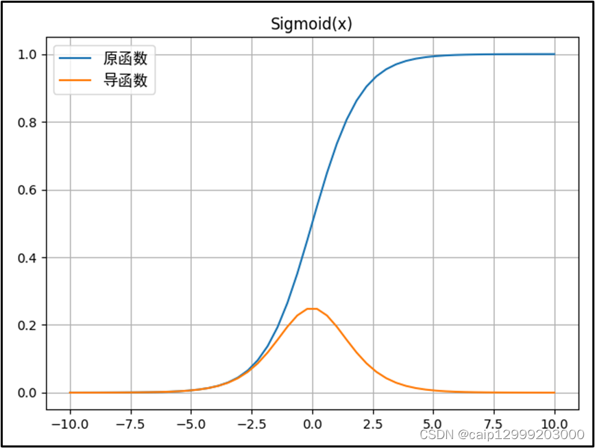
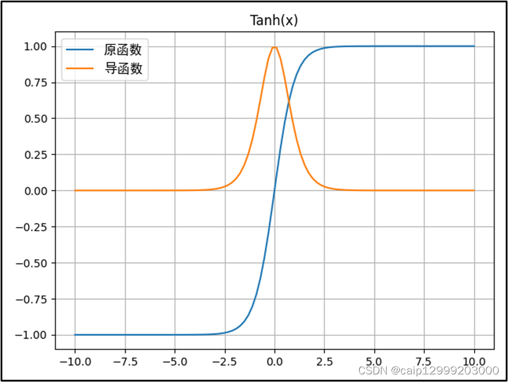
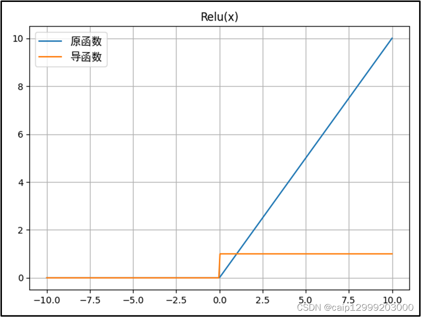
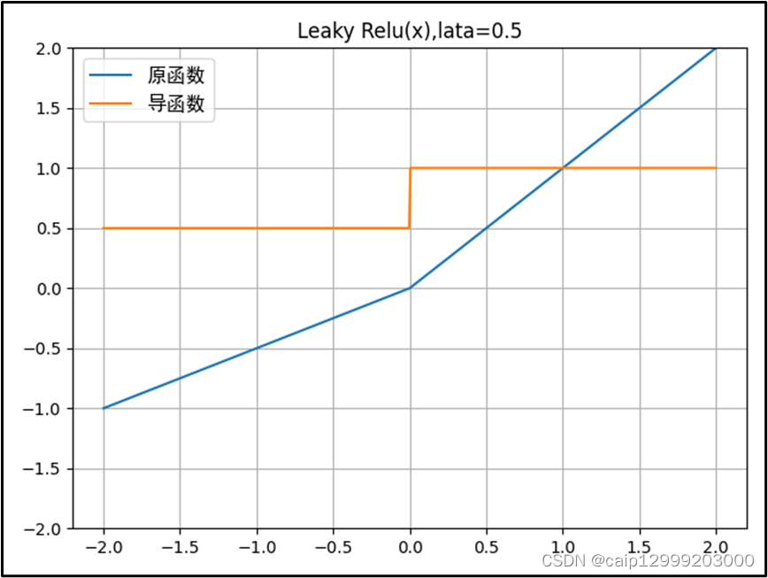
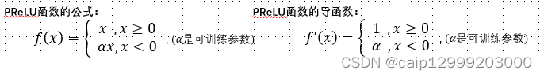
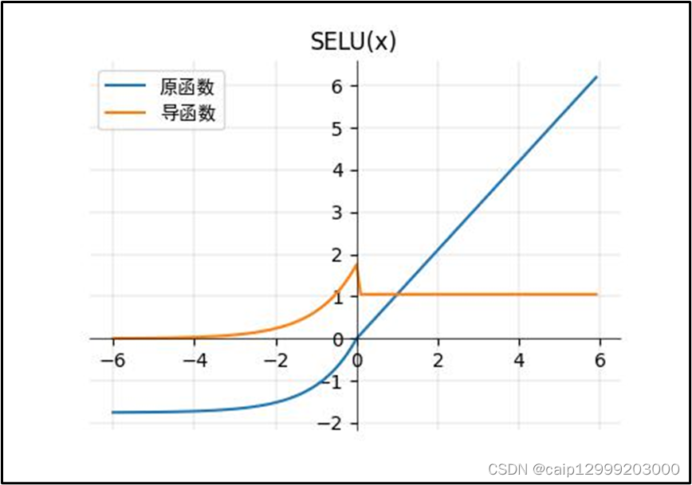

--- 
title: 【深度学习】常见的激活函数
date: 2025-01-30T00:00:00+08:00
categories: ["机器学习"]
tags: ["机器学习", "激活函数", "Sigmoid", "Softmax"]
description: "激活函数为神经网络引入非线性，使其能够学习复杂模式。它分为饱和与非饱和两类，前者如Sigmoid和tanh，后者如ReLU。使用激活函数可避免网络退化为线性模型，并解决梯度消失等问题，从而增强模型的表达能力。"
cover: "/img/machinelearning.png"
headerImage: "/img/rthykless.png"
math: true
--- 

激活函数为神经网络引入非线性，使其能够学习复杂模式。它分为饱和与非饱和两类，前者如Sigmoid和tanh，后者如ReLU。使用激活函数可避免网络退化为线性模型，并解决梯度消失等问题，从而增强模型的表达能力。 

***激活函数（Activation Function）***,是一种添加到人工神经网络中的函数，旨在帮助网络学习数据中的复杂模式。

### 什么是激活函数
在神经元中，输入的input经过一系列加权求和后作用于另一个函数，这个函数就是这里的激活函数。类似于人类大脑中基于神经元的模型，激活函数最终决定了是否传递信号以及要发射给下一个神经元的内容。
激活函数为神经网络引入了非线性元素，使得网络能够逼近复杂的非线性函数，从而解决更广泛的问题。
### 为什么要使用激活函数
如果不用激活函数，每一层输出都是上层输入的线性函数，无论神经网络有多少层，输出都是输入的线性组合，这种情况就是最原始的***感知机（Perceptron）***。
使用激活函数能够给神经元引入非线性因素，使得神经网络可以任意逼近任何非线性函数，使深层神经网络表达能力更加强大，这样神经网络就可以应用到众多的非线性模型中。
### 激活函数的分类
基于激活函数的本质，可以将激活函数分为以下两大类：

- ***饱和激活函数***：Sigmoid、tanh......
- ***非饱和激活函数***：ReLU、LeakyRelu、ELU、PReLU、RReLU....

#### 什么是饱和？

反之，不满足以上条件的函数则称为非饱和激活函数。
***Sigmoid***函数需要一个实值输入压缩至[0,1]的范围
***tanh函数***需要讲一个实值输入压缩至 [-1, 1]的范围
相对于饱和激活函数，使用非饱和激活函数的优势在于两点：
- 非饱和激活函数能解决深度神经网络（层数非常多）带来的梯度消失问题
- 使用非饱和激活函数能加快收敛速度。

### 常见的激活函数
#### 1.Sigmoid函数
对于二分类问题，**Sigmoid**是一个常用的激活函数，它将任意实数映射到（0，1）区间，这个区间内的数值可以自然地解释为概率
Sigmoid激活函数的数学表达式为: 
$$
f(x)=\frac{1}{1+e^{-x}}
$$

其导数的表达式为
$$
f'(x)=f(x)(1-f(x))
$$

函数图像如下：

##### 什么情况下适合使用Sigmoid？
- Sigmoid 函数的输出范围是 0 到 1。非常适合作为模型的输出函数用于输出一个0~1范围内的概率值，比如用于表示二分类的类别或者用于表示置信度。
- 梯度平滑，便于求导，也防止模型训练过程中出现突变的梯度。
##### Sigmoid函数的问题
- 容易造成梯度消失。我们从导函数图像中了解到sigmoid的导数都是小于0.25的，那么在进行反向传播的时候，梯度相乘结果会慢慢的趋向于0。这样几乎就没有梯度信号通过神经元传递到前面层的梯度更新中，因此这时前面层的权值几乎没有更新，这就叫梯度消失。除此之外，为了防止饱和，必须对于权重矩阵的初始化特别留意。如果初始化权重过大，可能很多神经元得到一个比较小的梯度，致使神经元不能很好的更新权重提前饱和，神经网络就几乎不学习。
- 函数输出不是以 0 为中心的，梯度可能就会向特定方向移动，从而降低权重更新的效率.
- Sigmoid 函数执行指数运算，计算机运行得较慢，比较消耗计算资源。

#### 2.Softmax函数
Softmax函数又被称为归一化指数函数。它是二分类函数***Sigmoid***在多分类上的推广，作用是将多分类的结果以概率的形式展现出来。
Softmax激活函数的数学表达式: 
$$
Softmax(x)=\frac{e^{x_i}}{\sum_ie^{x_i}}
$$
函数图像如下：

Softmax函数常在神经网络输出层充当激活函数，将输出层的值通过激活函数映射到0-1区间，将神经元输出构造成概率分布，用于多分类问题中，Softmax激活函数映射值越大，则真实类别可能性越大
下图给出了Softmax作激活函数对输出值映射处理过程

#### 3.Tanh函数

`tanh`激活函数的数学表达式为: 
$$
f(x)=\frac{e^x-e^{-x}}{e^x+e^{-x}}
$$

`tanh`函数图像如下：

Tanh函数是sigmoid的变形: $$tanh(x)=2sigmoid(2x)-1$$
与sigmoid不同的是，tanh是“零为中心”的。因此在实际应用中，tanh会比sigmoid更好一些。但是在饱和神经元的情况下，tanh还是没有解决梯度消失问题。

##### 什么情况下适合使用Tanh？
- tanh 的输出间隔为1，并且整个函以0为中心
- 在tanh图中，负输入将被强映射为负，而零输入被映射为接近0.
##### Tanh有哪些缺点？
- 仍然存在梯度饱和的问题。
- 依然是指数运算。

#### 4.ReLU函数
***Relu激活函数***的数学表达式为:
$$
f(x)=max(0,x)
$$

函数图像如下：

##### 什么情况下适合使用ReLU?

- ReLU解决了梯度消失的问题，当输入值为正时，神经元不会饱和
- 由于ReLU线性、非饱和的性质，在SGD中能够快速收敛
- 计算复杂度低，不需要进行指数运算
##### ReLU有哪些缺点？
- 与Sigmoid一样，其输出不是以0为中心的
- Dead ReLU 问题。当输入为负时，梯度为0。这个神经元及之后的神经元梯度永远为0，不再对任何数据有所响应，导致相应参数永远不会被更新
训练神经网络的时候，一旦学习率没有设置好，第一次更新权重的时候，输入是负值，那么这个含有ReLU的神经节点就会死亡，再也不会被激活。所以，要设置一个合适的较小的学习率，来降低这种情况的发生。
#### 5.Leaky ReLU函数
***Leaky ReLU激活函数***的数学表达式为: 
$$
f(x)=max(ax,x)
$$

函数图像如下：

##### Leaky ReLU函数的优点？
- 解决了ReLU输入值为负时神经元出现的死亡问题
- Leaky ReLU线性、非饱和的性质，在SGD中能够快速收敛
- 计算复杂度低，不需要进行指数运算
##### Leaky ReLU的缺点？
- 函数中的 $$a$$,需要通过先验知识人工赋值（一般设为0.01）
- 有些近似线性，导致在复杂分类中的效果不好。
从理论上讲，Leaky ReLU 具有 ReLU 的所有优点，而且 Dead ReLU 不会有任何问题，但在实际操作中，尚未完全证明 Leaky ReLU 总是比 ReLU 更好

#### 6.PRelu函数
PRelu激活函数的数学表达式为:

函数图像如下：

PRelu激活函数也是用来解决ReLU带来的神经元坏死的问题。与Leaky ReLU激活函数不同的是，PRelu激活函数负半轴的斜率参数α 是通过学习得到的，而不是手动设置的恒定值
#### 7.ELU函数
ELU激活函数的数学表达式为: 

函数图像如下：

#### 8.SELU函数
SELU激活函数的数学表达式为：

函数示例图像如下：

SELU 允许构建一个映射 g，其性质能够实现 SNN（自归一化神经网络）。SNN 不能通过ReLU、sigmoid 、tanh 和 Leaky ReLU 实现。这个激活函数需要有：（1）负值和正值，以便控制均值；（2）饱和区域（导数趋近于零），以便抑制更低层中较大的方差；（3）大于 1 的斜率，以便在更低层中的方差过小时增大方差；（4）连续曲线。后者能确保一个固定点，其中方差抑制可通过方差增大来获得均衡。通过乘上指数线性单元（ELU）来满足激活函数的这些性质，而且 λ>1 能够确保正值净输入的斜率大于 1

SELU激活函数是在自归一化网络中定义的，通过调整均值和方差来实现内部的归一化，这种内部归一化比外部归一化更快，这使得网络能够更快得收敛

#### 9.Swish函数
Swish激活函数的数学表达式为: 
$$
f(x)=x*sigmoid(x)
$$

函数图像如下：

Swish激活函数无界性有助于防止慢速训练期间，梯度逐渐接近 0 并导致饱和；同时，有界性也是有优势的，因为有界激活函数可以具有很强的正则化(防止过拟合， 进而增强泛化能力)，并且较大的负输入问题也能解决
Swish激活函数在x=0附近更为平滑，而非单调的特性增强了输入数据和要学习的权重的表达能力。

#### 10.Mish函数
`Mish`激活函数的数学表达式为: 
$$
f(x)=x*tanh(ln(1+e^x))
$$

函数图像如下：

Mish激活函数的函数图像与Swish激活函数类似，但要更为平滑一些，缺点是计算复杂度要更高一些

博客参考链接

- [常用的激活函数合集（详细版）-CSDN博客](https://blog.csdn.net/caip12999203000/article/details/127067360?ops_request_misc=%7B%22request%5Fid%22%3A%22dbe52ff27a31fe27bdcfc2e069793b70%22%2C%22scm%22%3A%2220140713.130102334..%22%7D&request_id=dbe52ff27a31fe27bdcfc2e069793b70&biz_id=0&utm_medium=distribute.pc_search_result.none-task-blog-2~all~top_positive~default-1-127067360-null-null.142^v102^pc_search_result_base5&utm_term=激活函数&spm=1018.2226.3001.4187)
- [激活函数（Activation Function）-CSDN博客](https://blog.csdn.net/weixin_39910711/article/details/114849349?ops_request_misc=%7B%22request%5Fid%22%3A%22dbe52ff27a31fe27bdcfc2e069793b70%22%2C%22scm%22%3A%2220140713.130102334..%22%7D&request_id=dbe52ff27a31fe27bdcfc2e069793b70&biz_id=0&utm_medium=distribute.pc_search_result.none-task-blog-2~all~top_positive~default-2-114849349-null-null.142^v102^pc_search_result_base5&utm_term=激活函数&spm=1018.2226.3001.4187)