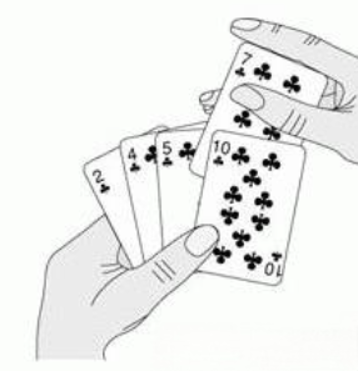

--- 
title: 【算法刷题】排序算法总结
date: 2025-12-06T00:00:00+08:00
categories: ["算法刷题"]
tags: ["排序算法", "冒泡排序", "插入排序", "快排", "归并", "堆排序"]
description: "冒泡排序通过相邻元素交换实现排序，时间复杂度O(n²)，稳定且原地排序。选择排序通过选择最小元素放置到已排序末尾完成排序。插入排序将未排序元素插入已排序序列的合适位置。"
cover: "/img/Algorithm.png"
headerImage: "/img/Makima.png"
math: true
--- 

本文整理了冒泡排序和选择排序的算法笔记。冒泡排序通过相邻元素交换实现排序，时间复杂度O(n²)，稳定且原地排序。选择排序通过选择最小元素放置到已排序末尾完成排序。 


> [!tip]
>
> 近来准备重拾刷题的习惯，为就业早做准备，刚好把之前学过的算法笔记顺带整理一下，理一遍思路，夯实基础。

## 基础算法 (Basic Algorithms)

### 冒泡排序 (Bubble Sort)


- **核心思想**：重复交换相邻的逆序元素，使最大/小值如气泡般“浮”到顶端。
- **时间复杂度**：O(n²) (平均 & 最坏)
- **关键特性**：**稳定**、原地排序、最简单但效率最低。

**来道例题**：[5334. 冒泡排序 - AcWing题库](https://www.acwing.com/file_system/file/content/whole/index/content/10768559/)

```cpp
//示例代码
void Bubble_Sort(int arr[], int len)
{
    for(int i = 0; i < len - 1; i++)
    {
        // 每一轮将最大的元素“冒泡”到末尾
        for(int j = 0; j < len - 1 - i; j++)  
        {
            if(arr[j] > arr[j + 1])       
            {
                swap(arr[j], arr[j + 1]);
            }
        }
    }
    return;
}
```

> [!Note]
>
> 个人认为在冒泡排序中最重要的点是，要理解其核心操作是**两两对比**
>
> - 每次**比较相邻的两个元素**
> - 如果顺序错误就交换，让较大的元素“冒泡”上浮
>
> 每一次得到一个相对最大(小)值移动到队尾，然后在下一次循环时就不必考虑该值，从而**逐步缩小范围**。
>
> - 每轮结束后，**当前最大元素一定“沉”到最后**
> - 下一轮只需比较前面 n-1 个元素，再下一轮比较 n-2 个...
> - 这正是代码中 `j < n-1-i`的原因

### 选择排序 (Selection Sort)


选择排序（Selection Sort）的核心思想非常直观，可以概括为：**“不断地从未排序的队伍中挑出最小（或最大）的元素，把它放到已排序队伍的末尾。”**

这就像我们在打扑克牌时整理手牌一样：如果你想把手中的牌从小到大排列，你会先看一遍所有的牌，找出最小的那张放在最左边；接着再看剩下所有的牌，找出最小的放在第二张的位置，以此类推。

选择排序将数组分为两个部分：

- **已排序区间**：初始为空，随着排序进行，位于数组左侧。
- **未排序区间**：初始包含所有元素，随着排序进行，位于数组右侧。

**具体流程：**

1. **第一轮**：遍历整个数组（未排序区间），找到**最小**的那个元素。
2. **交换**：将这个最小元素与数组的**第一个**元素交换位置。此时，第一个元素归入“已排序区间”。
3. **第二轮**：从第二个元素开始（即剩下的未排序区间），再次寻找最小的元素。
4. **交换**：将这个最小元素与数组的**第二个**元素交换位置。此时，前两个元素归入“已排序区间”。
5. **重复**：重复上述过程，直到“未排序区间”只剩下一个元素为止。

来道例题：[5332. 选择排序 - AcWing题库](https://www.acwing.com/file_system/file/content/whole/index/content/10768557/)

```cpp
//示例代码：
void Selection_Sort()
{
    for(int i=0;i<n-1;i++)
    {
        int k_idx=i;
        for(int j=i+1;j<n;j++)
        {
            if(p[k_idx]>p[j])
                k_idx=j;
        }
        swap(p[i],p[k_idx]);
    }
    return;
}
```

### 插入排序 (Insertion Sort)



想象你在打扑克牌，桌子上有一堆乱牌，你要把它们整理到手里：

- **选择排序的做法**： 你眼睛死死盯着桌子上的**全套乱牌**，找出其中**最小**的一张（比如“A”），拿起来放到左手上。然后再次盯着桌子上剩下的牌，找最小的（比如“2”），放到“A”旁边。
  - **关键点**：你的视线主要在**未排序的牌**（桌子）上。
- **插入排序的做法**： 你不管桌子上有什么，顺手摸起一张牌（比如“5”）放到左手。再摸一张（比如“3”），你看看左手里的牌，发现“3”比“5”小，就把“3”**插**到“5”前面。
  - **关键点**：你的视线主要在**已排序的牌**（左手）上，为了给新牌找个位置。


- **核心思想**：将数组分为“已排序”和“未排序”两部分，逐个将未排序元素**插入**到已排序部分的正确位置，如同整理扑克牌。
- **时间复杂度**：最坏情况：O(n²)（数组完全逆序）最好情况：O(n)（数组已有序）平均情况：O(n²)
- **关键特性**：**稳定**、原地排序、对小规模或基本有序数据效率高，是许多高级算法（如TimSort）的基础组件。

- **来道例题：**[5333. 插入排序 - AcWing题库](https://www.acwing.com/problem/content/5336/)

```cpp
//示例代码
void insertsort()
{
    for(int i=1;i<n;i++)//默认第一个已经排好序了
    {
        int key=p[i];//待插入元素
        int j=i-1;//已排序索引号
        while(j>=0&&p[j]>key)
        {
            p[j+1]=p[j];
            j--;
        }
        p[j+1]=key;
    }
    return;
}
```

> [!note]
>
> 插入排序要考虑的几个边界问题：
>
> - 一是要**默认第一个元素已有序**`for (int i = 1; i < n; i++)`
> - 二是**插入位置是`j+1`，不是`j`**

**为什么通常认为插入排序比选择排序“好”？**

在实际的小规模数据排序（或者作为复杂排序算法如快速排序的底层优化）中，**插入排序**出场率远高于选择排序。

原因在于现实世界的数据往往是**“部分有序”**的。在这种情况下，插入排序的效率会大幅提升，逼近 $O(n)$，而选择排序则雷打不动地跑 $O(n^2)$。

## 进阶算法 (Advanced Algorithms)

### 快速排序 (Quick Sort)


- **核心思想**：采用**分治法**，任取一个元素作为基准，将数组划分为小于基准和大于基准的两个子序列，然后递归地对子序列排序，如同快速整理书架——先分大类，再各自细化。
- **时间复杂度**：最佳/平均情况：**O(n log n)**（每次分区大致平衡）最坏情况：**O(n²)**（每次分区极不平衡，如数组已有序且选端点作基准）
- **关键特性**：**不稳定**、原地排序（递归栈O(log n)）、平均性能最好的通用排序算法，但对基准选择敏感，最坏情况需优化避免。

C++ 的 `std::sort` 默认用快排

快排模板算是很基础的基本模板，可以直接背会

> "一终二初三分区，四递归。
>
> - **一终**：第一件事写终止条件 `if (l >= r) return;`
> - **二初**：初始化 `i = l-1, j = r+1, x = q[(l+r)>>1]`
> - **三分区**：`while(i < j)`循环，里面两个do-while找元素，然后交换
> - **四递归**：最后递归 `quickSort(q, l, j)`和 `quickSort(q, j+1, r)`

**为什么 `i = l-1`, `j = r+1`？**

```cpp
int i = l - 1, j = r + 1;
```

- 因为后面用 `do i++`和 `do j--`开头
- 这样第一次循环时 `i = l`, `j = r`，正好是左右边界
- 如果写 `int i = l, j = r`，那后面就要用 `while(q[++i])`，容易乱

**为什么选中间元素？**

```cpp
int x = q[(l + r) >> 1];  // >>1 等价于 /2
```

- 避免最坏情况（已排序数组）
- 比随机选简单，比三数取中简洁
- 竞赛和面试都够用

**为什么用 `j`而不是 `i`分界？**

```cpp
quickSort(q, l, j);
quickSort(q, j + 1, r);
```

- 分区结束后，`i`可能大于 `j`
- 用 `j`作为分界点更稳定
- 如果用 `i`：`quickSort(q, l, i-1)`和 `quickSort(q, i, r)`可能死循环

**来道例题：**[3638. 排序 - AcWing题库](https://www.acwing.com/problem/content/3641/)

```1cpp
//示例代码
void quicksort(int l,int r,int arr[N])
{
    if (l>=r)return;
    int key=arr[(l+r)/2];
    int i=l-1;
    int j=r+1;
    while(i<j)
    {
        do i++;while (arr[i]<key);
        do j--;while (arr[j]>key);
        if (i < j) swap(arr[i], arr[j]); // 交换
    }
    quicksort(l,j,arr);
    quicksort(j+1,r,arr);
}
```

### 归并排序 (Merge Sort)

归并排序的核心思想是：**分治法 (Divide and Conquer)**。简单来说，它的逻辑就是六个字：**先分（Divide），再合（Merge）。**

想象你面前有一堆乱序的扑克牌，归并排序的处理方式是这样的：

> 第一步：分 (Divide) —— “无限切分”。不要试图一下子把整堆牌排好。我们把这堆牌从中间一分为二，分成左边一堆、右边一堆。
>
> - 如果这两堆还是很厚，继续分。
> - 一直分到**每一堆只剩下一张牌**为止。
> - **思考**：为什么分到只剩一张？因为一张牌天然就是“有序”的！
>
> 第二步：治 (Conquer/Merge) —— “有序合并”。现在你手头全是只有一张牌的小堆。接下来开始两两合并：
>
> - 拿两堆已经排好序的牌（最开始每堆只有1张），把它们合并成一个有序的“两张堆”。
> - 再拿两个有序的“两张堆”，合并成一个有序的“四张堆”。
> - 以此类推，直到恢复成完整的一大堆。

**关键难点：如何“合并”两个有序数组？**

归并排序的精华在于**合并（Merge）这个动作。 假设你有两组已经排好序**的数组，如何把它们合并成一个大的有序数组？

> **例子**：
>
> - 左组：`[2, 5, 8, 9]`
> - 右组：`[1, 3, 6, 10]`
> - 目标：合并成 `[1, 2, 3, 5, 6, 8, 9, 10]`

**“双指针”战术**：

1. 我们准备一个空的大盘子（临时数组 `tmp`）。
2. 派两个指针 `i` 和 `j`，分别指向左组和右组的**排头**。
3. **PK 环节**：比较 `左[i]` 和 `右[j]` 谁更小？
   - `1` 比 `2` 小。
   - 把 `1` 拿出来放入大盘子。
   - 右组指针 `j` 往后移一位。
4. **重复 PK**：
   - 现在 `左[i]` 是 2，`右[j]` 是 3。
   - `2` 比 `3` 小。
   - 把 `2` 放入大盘子。
   - 左组指针 `i` 往后移一位。
5. **收尾**：如果某一组先取完了，就把另一组剩下的所有牌直接一股脑倒进大盘子。

来道例题：[787. 归并排序 - AcWing题库](https://www.acwing.com/file_system/file/content/whole/index/content/4315/)

```cpp
//示例代码：
int tmp[N];
void merge_sort(int q[],int l,int r)
{
    if(l>=r)return;
    int mid=(l+r)>>1;
    merge_sort(q,l,mid);
    merge_sort(q,mid+1,r);
    int k=0;
    int i=l;
    int j=mid+1;
    while(i<=mid&&j<=r)
    {
        if(q[i]<=q[j])tmp[k++]=q[i++];
        else tmp[k++]=q[j++];
    }
    while(i<=mid)tmp[k++]=q[i++];
    while(j<=r)tmp[k++]=q[j++];
    
    for(i=l,j=0;i<=r;i++,j++)q[i]=tmp[j];
}
```

### 堆排序 (Heap Sort)

如果说**归并排序**赢在“分治”，那么**堆排序**就赢在“**数据结构**”。它本质上是**选择排序（Selection Sort）的“究极进化版”**。

- **选择排序的痛点**：为了找到最大值，每次都要从头到尾遍历数组，耗时 $O(n)$。
- **堆排序的优化**：利用“堆”这种数据结构，把找最大值的时间从 $O(n)$ 压缩到了 $O(\log n)$。

#### 什么是“堆” (Heap)？

1. **逻辑结构**：它是一棵**完全二叉树**（除了最后一层，其他层都是满的，且最后一层靠左排列）。
2. **物理存储**：它通常用**数组**来实现。
   - 如果是从下标 0 开始存储：
   - 父节点 $i$ 的左孩子是 $2i + 1$
   - 父节点 $i$ 的右孩子是 $2i + 2$
3. **性质（大顶堆 Max-Heap）**：**任意节点的值 $\ge$ 其子节点的值**。
   - 这意味着：**堆顶（根节点）永远是整个堆中最大的元素。**

#### 核心思路拆解

堆排序可以分为两个大步骤：**建堆** 和 **排序**。

第一步：建堆 (Build Heap)

目标：把一个乱序的数组，调整成一个符合“大顶堆”性质的数组。

方法：从最后一个非叶子节点开始，倒着往回遍历，对每个节点进行“下沉（Down Adjust / Heapify）”操作。

> [!tip]
>
> 为什么要倒着来？
>
> 因为叶子节点本身已经符合堆性质（没有孩子限制它）。我们要从底部开始，先把一个个小的子树修建成堆，再慢慢往上整合成大树。

第二步：排序 (Sort)

目标：利用堆顶最大的特性，依次取出最大值。

流程：

1. **交换**：把**堆顶**（最大值）和**堆尾**（当前未排序部分的最后一个元素）交换。
   - 此时，最大值被“钉”在了数组末尾，完成了归位。
2. **“削减”堆大小**：把堆的长度减 1（刚才那个最大值已经不用管了）。
3. **下沉**：刚才被换到堆顶的那个元素可能很小，破坏了堆的规矩。我们需要对新的堆顶进行“下沉”操作，让它回到合适的位置，重新恢复大顶堆。
4. **循环**：重复上述过程，直到堆的大小变为 1。

**“下沉” (Heapify / Down Adjust)**

这是堆排序的引擎。给定一个节点，如果它比孩子小，就把它和较大的孩子交换，然后继续往下看，直到它比孩子大或者沉到底部。

图解逻辑：


[4分钟学堆排序(手机动画版)_哔哩哔哩_bilibili](https://www.bilibili.com/video/BV1sek9YBELe/?spm_id_from=333.337.search-card.all.click&vd_source=f604ed39833f1fa9ecc8f678b861d642)

假设堆顶是 3，左孩子 9，右孩子 5。

1. 3 比 9 小，交换 -> 堆顶变 9，左孩子变 3。
2. 检查 3 在新位置（原左孩子位置）是否符合规矩，如果不符合继续交换。

```cpp
// count: 当前堆的大小（注意不是数组总长度，是还没排好的部分）
void heapify(int arr[], int count, int i)
{
    int largest = i;     // 假设父节点最大
    int l = 2 * i + 1;   // 左孩子
    int r = 2 * i + 2;   // 右孩子
   
    // 使用参数 count 而不是全局 n
    // 使用 > 号构建大顶堆 (为了升序排序)
    if (l < count && arr[l] > arr[largest])
    {
        largest = l;
    }
    // 使用 count
    // 使用 > 号
    if (r < count && arr[r] > arr[largest])
    {
        largest = r;
    }
    
    if (largest != i)
    {
        swap(arr[i], arr[largest]);
        // 继续向下调整
        heapify(arr, count, largest);
    }    
}

void heap_sort(int arr[], int count)
{
    // 1. 建堆
    // 从最后一个非叶子节点开始 (count / 2 - 1)
    for (int i = count / 2 - 1; i >= 0; i--)
    {
        heapify(arr, count, i);
    }
    
    // 2. 排序
    for (int i = count - 1; i > 0; i--)
    {
        swap(arr[0], arr[i]); // 把最大值(堆顶)放到数组末尾
        heapify(arr, i, 0);   // 【关键】对剩下的 i 个元素重新堆化
    }
}
```

## 特殊场景算法 (Specialized Algorithms)

### 希尔排序 (Shell Sort)


### 计数排序 (Counting Sort)

### 桶排序 (Bucket Sort)

### 基数排序 (Radix Sort)