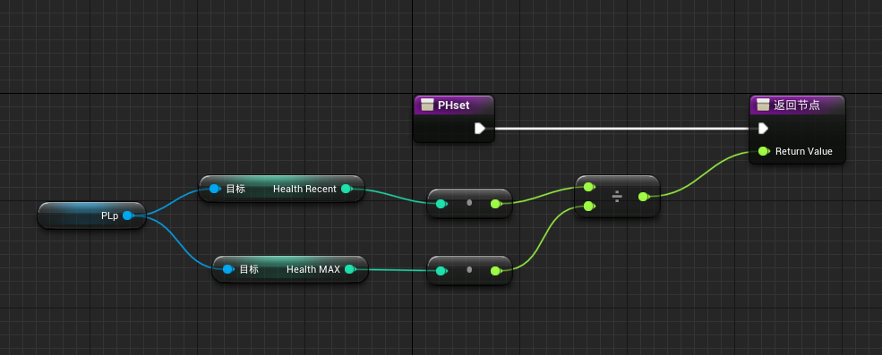
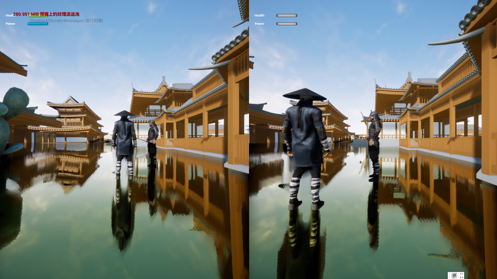

--- 
title: 【虚幻引擎】设置双人分屏
date: 2023-08-11T00:00:00+08:00
categories: ["虚幻引擎"]
tags: ["UnrealEngine", "双人", "用户控件", "环境配置"]
description: "在虚幻引擎中实现本地分屏联机，需在项目设置启用分屏模式并配置游戏模式。核心逻辑通过蓝图动态生成玩家角色，利用循环遍历出生点数组，结合生成与位置控制节点完成。"
cover: "/img/unrealengine.png"
headerImage: "/img/angle.png"
math: true
--- 

本文记录了在项目中实现本地分屏联机功能的过程，包括在项目设置中启用分屏模式、配置游戏模式，并详细解析了用于动态生成玩家角色的蓝图核心逻辑与关键节点。 

在开发项目的时候想添加一个本地联机功能,使用分屏功能实现,查了一些资料做此记录博客.

## 项目设置

在项目设置中`Local Multiplayer`目录下打开使用分屏功能,可以选择垂直/水平分屏,一般像双人成行那样选择垂直模式.

> ⚠Warning !
>
> 注意此处要跳过将手柄指定到玩家1选项.,因为我们想实现一个玩家1使用键鼠操作,后续玩家使用手柄操作的模式

## 游戏模式设置

打开项目设置后就可以修改我们的游戏模式.

 **蓝图核心逻辑解析**

1. **触发入口**

- 以 **`Event BeginPlay`** 节点作为起点（游戏开始时触发），启动后续流程。

2. **数据准备与循环处理**
   - 使用 **`For Each Loop`** 节点遍历一个数组（数组为使用`get_all_actor_of_class`得到的玩家出生点对象数组）。
   - 通过 **`Length`** 节点获取数组长度，控制循环次数。
   - 在循环中，通过 **`Array Element`** 或 **`Get`** 节点提取当前处理的数组元素（如生成位置、对象类型等）。
3. **动态生成与位置控制**
   - 生成阶段：

     - 使用 **`Spawn Actor`** 或类似节点（ `Spawn Transform`）在指定位置生成玩家对象,并设置玩家的Player_index为玩家打上标记。
     - 生成时传入 **变换信息**（位置、旋转、缩放）。

   - 位置调整：

     - 通过 **`Get Player Location`** 获取玩家当前位置，结合 **`Shift`** 或其他运算节点计算偏移量（例如生成物体围绕玩家分布）。
   - 最终用 **`Set Actor Location`** 节点设置生成对象的位置（可能直接使用数组中的坐标，或基于玩家位置动态计算）。

------

 **关键节点与功能**

| 节点名称                | 作用                                                 |
| ----------------------- | ---------------------------------------------------- |
| **For Each Loop**       | 遍历数组，逐个处理元素（如生成点或对象）。           |
| **Length**              | 获取数组长度，控制循环次数或生成数量。               |
| **Spawn Transform**     | 在指定位置生成对象，可能包含动态参数（如振动频率）。 |
| **Get Player Location** | 获取玩家当前位置，用于相对生成或偏移计算。           |
| **Set Actor Location**  | 最终将生成的对象定位到目标位置。                     |

> [!caution]
>
> 由于使用的是虚幻引擎的中文版本,有一些翻译问题:
>
> Create Player(创建播放器）翻译问题 应该是创建玩家(控制器)
>
> 后续创建的玩家对象蓝图被此处的控制器所控制

在世界场景设置中选定游戏模式(`GameMode`)为我们新写好的游戏模式

如果想要两个玩家使用的角色不一样,可以修改我们之前的`GameMode`蓝图,基于`playercontroller`的`index`为两个玩家创建不一样的角色对象.

> [!tip]
>
> 虽然我们的游戏是本地双人的,但是可以提一嘴
>
> `get_player_controller`会默认获取本地的的所有玩家控制器生成一个对象列表(数组)返回

玩家的操作逻辑写在玩家一的角色蓝图中

> [!warning]
>
> 操作蓝图分别写在两个蓝图中会导致玩家2无法操控（不知道为什么）

## 本地双人模式的用户控件

### 实现一个血条和蓝条的`UI`

在一个用户控件中获取当前控件所有者的Pawn,将玩家控制的角色`Pawn`类提示为变量传入

实现血条和蓝条的简单计算:

将该函数绑定到设计界面的相应值

### 添加UI到视口

还是回到我们写的游戏模式,基于`playercontroller`的`index`分别为玩家生成用户控件

> [!tip]
>
> 注意此处的节点是Add To Player Screen添加到播放器屏幕（多人常用）,而不是Add To Viewport 添加到视口（单人常用）

完成后的效果如下:

