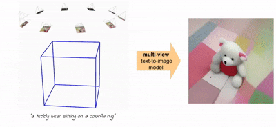

---
title: 【论文阅读】ViewDiff：基于文生图模型的3D一致图像生成技术
date: 2025-11-04T00:00:00+08:00
categories: ["ComfyUI"]
tags: ["Diffusion", "AIGC", "AI绘画", "视觉图像生成", "视频生成", "生成式人工智能", "扩散模型", "文生图"]
description: "ViewDiff利用预训练文生图扩散模型生成高质量、多视角一致的3D图像，解决了现有方法在真实感和视角一致性上的不足。"
cover: "/img/ArtificialIntelligence.png"
headerImage: "/img/GeCML.png"
math: true
--- 

CVPR 2024论文ViewDiff提出了一种新方法，利用预训练的文生图扩散模型生成高质量且多视角一致的3D图像，旨在克服现有方法在真实感和视角一致性上的不足。 

大家好，我今天要分享的内容是ViewDiff 基于文生图模型的3D一致图像生成技术，是CVPR2024的一篇论文。

 论文原址：https://lukashoel.github.io/ViewDiff/

## 背景

近年来 生成式人工智能(artificial intelligence generated content, AIGC)重新定义了视觉内容的生成、制作和编辑过程, 特别是自从扩散模型LDM（Latent Diffusion Model）和DiT (Diffusion Transformer)架构发布以来，由这两个架构所衍生的Stable Diffusion社区生态带来了AIGC领域的一片繁荣。

最近国内常提起的豆包修图和Nannobanana也是基于上述的DIT框架。

## 相关工作

### 过往方法

上述生成的内容主要局限在2D领域，扩散模型社区的繁荣吸引了很多研究人员探索扩散模型在3D内容生成领域的应用。

现有方法普遍存在以下问题：

- 优化类方法（如DreamFusion）生成结果非逼真、缺乏背景

- 相比起训练模型的2D数据,真实3D多视图数据的获取难度大，而通过2D数据合成的3D数据训练模型的模型普遍缺乏真实感。

基于上述问题，本论文提出方法的核心目标是：

利用预训练T2I模型先验，从真实数据中生成多视角一致的高质量图像

### 前置知识

在讲述本文方法的实现细节之前，先来讲述一下前置工作

#### 文生图扩散模型DDPM

扩散模型包含两个过程：前向扩散过程和反向生成过程，可以简单的理解为对一张图像逐渐添加[高斯噪音](https://zhida.zhihu.com/search?content_id=213390531&content_type=Article&match_order=1&q=高斯噪音&zhida_source=entity)再对其去噪的过程，我在这里做一个形象的比喻，就是我们使用肉眼观察照片的时候眯眼再睁眼的过程。无论是前向过程还是反向过程都是一个参数化的[马尔可夫链](https://zhida.zhihu.com/search?content_id=213390531&content_type=Article&match_order=1&q=马尔可夫链&zhida_source=entity)（Markov chain）。扩散过程是指的对数据逐渐增加高斯噪音直至数据变成随机噪音的过程。对于原始数据，总共包含步的扩散过程的每一步都是对上一步得到的数据按如下方式增加高斯噪音：

扩散过程是指的对数据逐渐增加高斯噪音直至数据变成随机噪音的过程。对于原始数据 $\mathbf{x}_{0}\sim q(\mathbf{x}_{0})$，总共包含 $ T $ 步的扩散过程的每一步都是对上一步得到的数据 $ mathbf{x}_{t - 1} $ 按如下方式增加高斯噪音：

$$
q(\mathbf{x}_{t}\mid\mathbf{x}_{t - 1})=\mathcal{N}(\mathbf{x}_{t};\sqrt{1 - \beta_{t}}\mathbf{x}_{t - 1},\beta_{t}\mathbf{I})
$$

这里 $ \{\beta_{t}\}_{t = 1}^{T} $ 为每一步所采用的方差，它介于 $ 0\sim 1 $ 之间。对于扩散模型，我们往往称不同step的方差设定为variance schedule或者noise schedule，通常情况下，越后面的step会采用更大的方差，即满足 $ \beta_{1}<\beta_{2}<\cdots<\beta_{T} $。在一个设计好的variance schedule下，如果扩散步数 $ T $ 足够大，那么最终得到的 $ \mathbf{x}_{T} $ 就完全丢失了原始数据而变成了一个随机噪音。

扩散过程的每一步都生成一个带噪音的数据 $mathbf{x}_{t}x$ ,整个扩散过程也就是一个马尔可夫链：

$$
q(\mathbf{x}_{1:T}\mid\mathbf{x}_{0})=\prod_{t = 1}^{T}q(\mathbf{x}_{t}\mid\mathbf{x}_{t - 1})
$$
**扩散过程**：将数据（图像）噪音化。**反向过程**：一个去噪的过程，即**数据生成的过程**。

如果已知反向过程中每一步的真实条件分布  $q\left(\mathbf{x}_{t-1}\mid\mathbf{x}_{t}\right)$ ，那么从一个随机噪声$\mathbf{x}_{T}\sim\mathcal{N}\left(\mathbf{0},\mathbf{I}\right)$ 开始，逐步进行去噪，就能生成一个偏向真实的样本。因此，**反向过程本质上就是数据生成的机制**。

这个过程同样是一个马尔可夫链，从随机噪声  $x_T$ 开始，逐步生成越来越清晰的图像  $x_{T−1}$ ,$ x_{T−2}$ ,...,直至最终生成目标数据  $x_0$ 。
$$
p_θ(x0:T)=p(xT)t=1∏Tpθ(xt−1∣xt)
$$
$$
p_{\theta}\left(\mathbf{x}_{t-1}\mid\mathbf{x}_{t}\right)=\mathcal{N}\left(\mathbf{x}_{t-1};\boldsymbol{\mu}_{\theta}\left(\mathbf{x}_{t}, t\right),\boldsymbol{\Sigma}_{\theta}\left(\mathbf{x}_{t}, t\right)\right)
$$

这里 $p\left( \mathbf{x}_{T} \right)=\mathcal{N}\left( \mathbf{x}_{T} ;\mathbf{0},\mathbf{I} \right)$,而 $p_{\theta}\left( \mathbf{x}_{t-1}\mid \mathbf{x}_{t} \right)$ 为参数化的高斯分布，它们的均值和方差由训练的网络 $\boldsymbol{\mu}_{\theta}\left( \mathbf{x}_{t},t \right)$ 和 $\boldsymbol{\Sigma}_{\theta}\left( \mathbf{x}_{t},t \right)$ 给出。实际上，**扩散模型就是要得到这些训练好的网络，因为它们构成了最终的生成模型**。

扩散模型中大规模使用的**U-Net** 就是实现公式中$\boldsymbol{\mu}_{\theta}$和$\boldsymbol{\Sigma}_{\theta}$这两个函数的神经网络架构。

## 论文核心创新点

本文提出了一种方法，从给定的文本或放置图像输入中生成3D一致的图像。具体来说，给定所需的输出姿势，联合生成与条件相对应的所有图像。利用预训练的文本到图像模型`Hierarchical text-conditional image generation with CLIP latents`和`Photorealistic text-to-image diffusion models with deep language understanding`，并在多视图数据`Common objects in 3D`上对其进行微调。在每个块中添加新层来扩展现有的U-Net架构 ，最终使用扩散模型直接从任何视角自回归地渲染相同的对象。

为了在所有图像上建模3D一致的去噪过程，使用了神经网络$ϵ_θ$预测每个图像的噪声,该神经网函数表达如下：
$$
ϵ^n_θ(x^{0:N}_t,t)
$$
**各组成部分的含义**：

- ϵ：噪声预测函数（epsilon）
- θ：神经网络参数（theta）
- n：视角索引（n=0,1,…,N）
- $x_t^{0:N}$：所有视角在时间步 t的噪声图像
- t：扩散过程的时间步

这个神经网络是从现有文本到图像模型的预训练权重初始化的，通常被定义为一个U-Net架构。我们试图利用所有图像的前状态$x_0:N_t$来实现3D一致的去噪步骤。本文在U-Net架构中添加两个层，即跨视角注意力层和投影层。我们注意到，预测的每个图像的噪声需要是特定于图像的，因为所有图像都是从单独的高斯噪声开始生成的。因此，保留在每个图像上分别起作用的2D层非常重要，本文通过对现有的ResNet和ViT块进行微调来实现这一点。

此外，本文在U-Net架构中添加两个层，即跨视角注意力层和投影层。注意到，预测的每个图像的噪声需要是特定于图像的，因为所有图像都是从单独的高斯噪声开始生成的。因此，保留在每个图像上分别起作用的2D层非常重要，本文通过对现有的ResNet和ViT块进行微调来实现这一点。

### 三维一致性的扩散模型

前面我们提到扩散模型的目标是学习到$x_0$的分布：
$$
p_{\theta}\left(x_{0}\right)=\int p_{\theta}\left(x_{0: T}\right) dx_{1:T}
$$
扩散模型将分布拆分成马尔卡夫链的每一步的高斯转化核，通过对降噪过程的随机过程的高斯核进行建模，实现对整个分布的建模。本文直接对多视角图片的联合概率密度进行建模：
$$
p_{\theta}(x_{0:T}^{0:N}) := p(x_{T}^{0:N}) \prod_{t=1}^{T} \prod_{n=0}^{N} p_{\theta}(x_{t-1}^{n} \mid x_{t}^{0:N})
$$
从 $t$ 时刻的所有视角的图片作为条件生成 $t-1$ 时刻某一个视角的图片。对所有的图片都进行一次降噪的预测后，再做 $t-2$ 时刻的推导。每一个视角的加噪过程被设计为独立的：
$$
q(x_{1:T}^{0:N} \mid x_{0}^{0:N}) = \prod_{t=1}^{T} \prod_{n=0}^{N} q(x_{t}^{n} \mid x_{t-1}^{n})
$$
扩散模型的训练目标则为：
$$
\mathcal{L} = \mathbb{E}_{x_{0}^{0:N},\ \epsilon^{0:N} \sim \mathcal{N}(\mathbf{0}, \mathbf{I}),\ n} \left[ \left\| \epsilon^{n} - \epsilon_{\theta}^{n} \left( x_{t}^{0:N}, t \right) \right\|^{2} \right]
$$

> **训练一个噪声预测器，让它预测的噪声尽可能接近真实添加的噪声。**
>
> **1. 损失函数 `ℒ`**
>
> - 这是模型需要**最小化**的优化目标。通过最小化这个损失，来训练模型参数 `θ`。
>
> **2. 期望符号 `𝔼`及其下标**
>
> 期望符号表示我们对括号内的量求**平均**。下标说明了平均是在哪些变量上进行的：
>
> - $x_0^{0:N}$：从训练数据集中**随机采样**的一组真实、清晰的多视角图像。
> - $ε^{0:N} ~ 𝒩(0, I)$：**随机采样**的噪声，每个视角都采样自标准高斯分布（均值为0，方差为1）。
> - $n$：**随机选择一个视角索引**。这意味着模型训练时，在每个批次中可能会侧重于优化某个特定视角的预测。
>
> **3. 核心目标 `‖ εⁿ - ε_θⁿ(...) ‖²`**
>
> 这是损失函数的主体，一个**均方误差**：
>
> - **`εⁿ`**：**真实噪声**。这是在“前向加噪过程”中，实际添加到第n个视角清晰图像上的噪声。这是已知的、真实的标签。
> - **`ε_θⁿ(x_t^{0:N}, t)`**：**模型预测的噪声**。这是ViewDiff神经网络（参数为`θ`）根据**所有视角在时间步t的噪声状态**，所预测出的第n个视角上的噪声。
> - **`‖ ... ‖²`**：L2范数的平方，即计算预测值与真实值之间的平方误差。

### 交叉视角注意力

受视频扩散模型的启发，论文方法将跨帧注意力层添加到U-Net架构中。修改现有的自注意力层以计算：
$$
CFAttn(Q, K, V) = \text{softmax}\left( \frac{Q K^{T}}{\sqrt{d}} \right) V
$$

$$
Q = W^{Q} h_{i}, \quad K = W^{K} [h_{j}]_{j \neq i}, \quad V = W^{V} [h_{j}]_{j \neq i}
$$

$W^Q$ 、$W^K$ 和 $W^V$是用于特征投影的预训练权重矩阵。对于每一幅图像 $i∈[1,N]$，其输入的空间特征表示为 $h_i∈R^{C×H×W}$ 。直观而言，该机制通过在所有帧（视角）间进行特征匹配，确保了生成内容具有**一致的全局风格**。

为进一步引导生成过程，我们向所有跨帧注意力层注入一个条件向量 $z$，用以通知网络每个图像的视角信息。该向量的构建如下：

1. **姿态信息**：将每个图像的相机矩阵 $p∈R^{4×4}$编码为一个嵌入向量 $z_1∈R^4$，其编码方式与 Zero-1-to-3 方法类似。
2. **内参信息**：将每个相机的焦距和主点坐标拼接，形成另一个嵌入向量 $z_2∈R^4$。
3. **强度信息**：引入一个强度编码 $z_3∈R^2$，其存储了图像 RGB 值的均值与方差。在训练时，$z_3$被设置为每个输入图像的真实强度统计量；而在推理（测试）时，我们将其统一设置为 [0.5,0]。此设计有助于减弱数据集中因相机曝光不同等因素引起的、与视角相关的光照差异。

最终的条件向量由三者拼接而成：$z=[z_1,z_2,z_3]$。我们通过一个 **LoRA（Low-Rank Adaptation）** 线性层 $W^Q$将该条件向量整合到查询（Query）的特征投影矩阵 $W^Q$中。具体地，条件化后的查询特征投影计算如下：
$$
Q = W^{Q} h_{i} + s \cdot W^{\prime Q} [h_{i}; z]
$$

$$
K = W^{K} [h_{j}]_{j \neq i} + s \cdot W^{\prime K} [[h_{j}]_{j \neq i}; z]
$$

$$
V = W^{V} [h_{j}]_{j \neq i} + s \cdot W^{\prime V} [[h_{j}]_{j \neq i}; z]
$$

### 投影层

跨视角注意力层有助于生成全局一致的3D图像。对象并没有精确地遵循指定的姿势，这导致了视角不一致性。为此，本文在U-Net架构中添加了一个投影层如图所示。 

> 这里我第一次读的时候有点理解偏差，前面的跨帧注意力机制已经在保证内容一致了，这里的投影层为什么又要保持一致性？
>
> 问了问GPT，回答的还是非常清楚的，在此附上：
>
> **这两种层处理的是不同层面的“一致性”问题**。跨视角注意力层确保的是 **“风格”或“身份”一致性**，而投影层确保的是 **“几何”一致性**。
>
> 1. **跨视角注意力层的局限：风格一致，但几何不准**
>
> 跨视角注意力层的机制是让所有生成中的视角在特征层面进行“沟通”。这非常有效，但存在一个本质局限：
>
> - **工作原理**：它通过比较所有视角的**二维图像特征**，来确保生成的物体具有相同的纹理、颜色和全局外观。例如，它能让所有视角下的泰迪熊都是“红色帽子、蓝色外套”的同一只熊。
> - **固有局限**：这种操作完全在**2D图像特征空间**中进行。它**无法直接理解或推理不同视角之间背后的3D几何关系**。它知道要生成“同一只熊”，但并不确切知道从另一个特定角度看过去，这只熊的耳朵或鼻子应该出现在图像的什么**精确位置**。
>
> 这就导致了您引用的文中所述的现象：“对象并没有精确地遵循指定的姿势”。换句话说，模型可能生成了同一只熊，但熊的**三维形状或位置**可能没有严格按照输入的相机姿态进行正确的透视变换，从而从某些角度看会产生微小的错位或变形。
>
> **2. 投影层的角色：引入显式3D几何约束**
>
> 正是为了克服上述局限，论文引入了**投影层**。它的核心思想是：**在去噪过程的中间阶段，显式地构建一个3D表示，来强制实现几何一致性。**

该层的思想是创建一致的3D特征，然后由下一个U-Net层（例如ResNet块）进一步处理。通过在U-Net的所有阶段重复这一层，确保每个图像特征处于一个一致的3D空间中。**本方案没有将投影层添加到第一个和最后一个U-Net块中，因为放置在这些位置没有产生好的效果。**可能的原因是，在这些阶段网络处理图像特定信息，因此不需要一致的3D特征空间。受多视角立体文献的启发，我们从所有输入空间特征中创建一个3D特征体素网格，集合了所有空间特征 $h_{\text{in}}^{0:N} \in \mathbb{R}^{C \times H \times W}$ 。这个集合了多视角空间特征的3d体素是通过投影到所有的输入视角获取该视角下的空间特征所得到的3d特征。

#### 特征处理与体素渲染流程

1. **特征压缩与降维**​首先，通过一个 $1\times1$ 卷积将输入特征  $h^{0:N}$ 的通道数压缩至 $C'=16$ 。
2. **构建体素网格**对降维后的特征在图像平面位置进行**双线性插值**，并将其放入体素中。此步骤为每个视图创建一个独立的体素网格。
3. **多视图体素聚合**通过一个聚合器 **MLP** 将多个独立视图的体素网格合并成一个统一的体素网格。受 **IBRNet** 启发，该 MLP 用于预测每个视图的权重，随后进行**加权特征平均**，以融合多视角信息。
4. **3D 特征空间细化**在聚合后的体素网格上运行一个轻量级的 **3D CNN**，以细化和增强 3D 特征空间中的信息。
5. **体积渲染**使用**体素渲染**技术将处理后的 3D 体素网格渲染为 2D 输出特征，此过程类似于 NeRF 所采用的体积渲染方法。**前景/背景处理**：将体素网格的前一半分配给前景，后一半分配给背景。在射线行进过程中，应用 **MERF 的背景模型** 来处理背景部分。
6. **特征缩放与维度恢复**体积渲染器通常在射线投射期间使用 Sigmoid 函数作为最终激活层，但其输出范围被限制在  $[0, 1]$ 。为了将渲染后的特征值范围调整到与输入特征相匹配的任意浮点范围，引入了一个**缩放函数**。该函数由一个 $1\times1$卷积和一个 **ReLU** 激活函数构成，用于非线性地缩放特征。最后，通过一个 $1\times1$卷积将特征通道数从 $C'$恢复至原始的输入特征维度 $C$ ，得到最终的输出 $h_{out}^{0:N}$ 。

### 自回归生成

在ViewDiff论文中，自回归生成被设计为一种扩展模型生成能力的关键机制，其核心思想在于将多视角图像的生成过程从单次前向传递转变为一种迭代、条件式的序列生成范式。具体而言，该方法允许模型在推理阶段动态地生成任意数量和任意相机姿态的新视角图像，而非局限于训练时固定的视角数量。

技术实现上，自回归生成通过灵活划分输入批次中的条件部分（已生成的清晰图像）和生成部分（待去噪的新视角），并利用时间步控制机制（将条件图像的时间步设为0，生成图像的时间步从噪声逐步递减）使模型能够基于已有视角联合去噪新视角。这种设计不仅支持从单张图像进行3D重建（如输入一张玩具熊图像生成环绕视图），还能通过连续生成批次实现平滑的相机轨迹动画，从而直接通过扩散模型完成对3D对象的连贯浏览，有效突破了传统方法在视角数量和一致性上的限制。

### 生成过程

模型可以接受三种不同的输入，文字输入，单张图片输入，多张图片输入。模型无条件生成的时候，就是根据输入文本生成多视角图片的过程。如果输入单张图片，那么可以根据给定的任意位姿生成该位姿视角下的图片。本文设计了一种自回归的生成方法，首先使用一张图片输入，可以得到期望视角的图片，然后可以使用这些视角的图片和相应的相机参数进行多视角生成。每生成的了新的视角，都可以作为模型的输入，进行新一轮的多视角生成。

## 实验结果

以下是本文的ViewDiff模型和HoloFusion,ViewSetDiffusion在文字生成多视角图片的对比。可以看到相比于之前的两种方法，ViewDiff可以生成带背景的真实感图片。

下图是ViewDiff在无条件生成的消融实验。可以看到，在没有投影层的情况下，物体的位置和方向有较大的偏差，说明投影层集合多视角特征再分发到各个视角下的操作对于保证视角对相机为参的一致性非常重要；如果没有跨视角注意力机制，那么物体本身的内容则会出现较大的偏差，出现挤压变形之类的视觉效果。说明跨视角注意力机制对于保证物体的内容有着重要作用。

下图是ViewDiff在单视角输入下的生成结果。

## 总结

最后对这篇论文做一个总结ViewDiff：一个两阶段融合框架

**在强大的2D生成先验基础上，通过引入显式的3D几何约束，实现高质量、多视角一致的图像生成**。其创新性体现在三个紧密耦合的层面。

**1. 核心架构：增强的U-Net与双阶段一致性保障**

ViewDiff并非从零开始训练一个新模型，而是**精巧地微调（Fine-tune）预训练的文本到图像（T2I）模型**。其核心是在T2I模型的U-Net架构中，战略性地集成了两个关键的新层，它们分别从不同层面保障一致性：

- **跨帧注意力层：保障“身份一致性”**此层充当**风格协调器**。它允许在去噪过程的每一步，所有生成视角的特征之间进行全局通信。这确保了生成的多个视角在纹理、颜色和物体身份上保持一致，即生成的是“同一个”物体
- **投影层：保障“几何一致性”**此层充当**几何校正器**。它将多视角的2D特征反投影到一个共享的3D体素网格中，通过3D CNN进行细化，再利用体积渲染技术投影回新的2D视角。这一操作**显式地引入了3D几何推理**，确保物体形状和位置精确遵循输入的相机姿态，解决了纯注意力机制可能产生的视角偏差。

**2. 训练策略：先验保持与3D约束的平衡**

为了在引入3D一致性的同时不破坏预训练模型的强大2D生成能力，论文采用了**先验保持损失**。该策略通过在训练中混合使用原始2D先验数据和新的3D多视角数据，确保模型在学习几何约束的同时，保留其丰富的纹理和背景生成先验。

**3. 生成范式：灵活的自回归生成**

ViewDiff支持两种生成模式，并通过**自回归生成**实现了强大的扩展性：

- **无条件生成**：仅凭文本提示，即可一次性生成一组环绕物体的多视角图像。
- **图像条件生成**：给定一张或多张输入图像，可生成任何新视角的图像。通过自回归方式，可以不断添加新视角，形成平滑的相机轨迹动画。