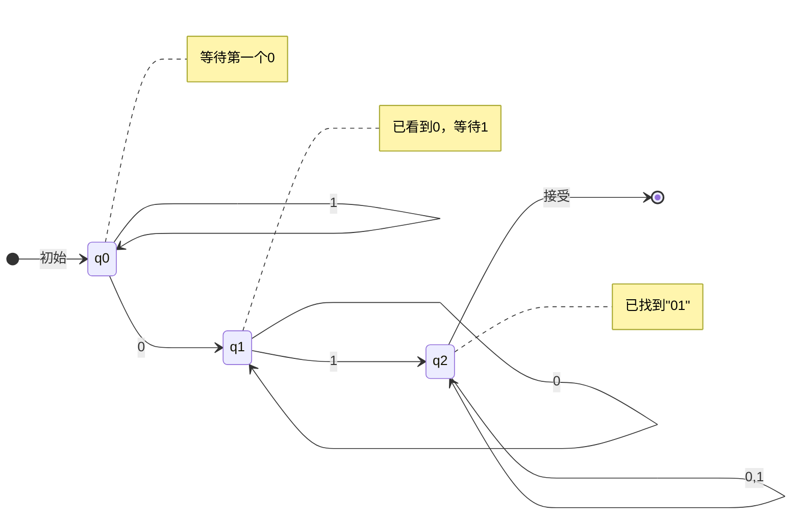
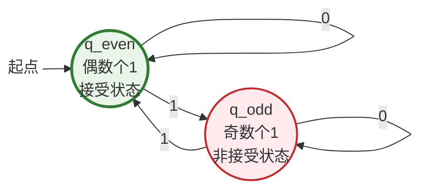
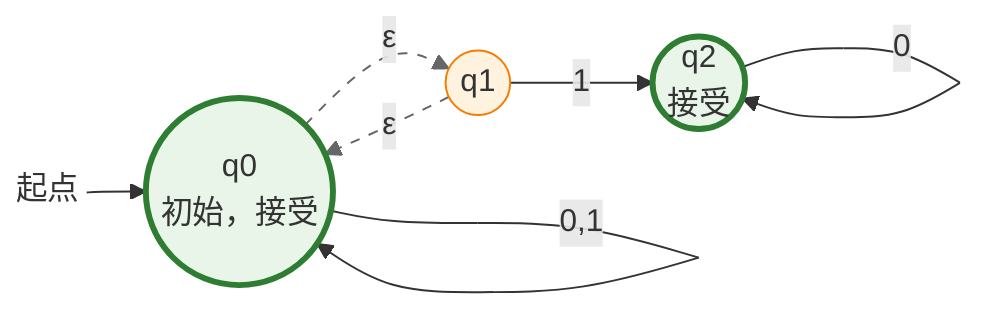
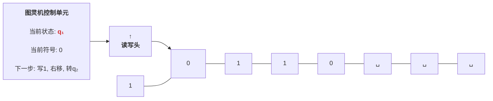

# 可计算理论导论：从零开始理解计算的边界

## 前言：为什么我们需要可计算理论？

在开始接触可计算理论之前，你可能会问一个很自然的问题：**我已经会写代码了，为什么还要学这些抽象的理论？**

让我们用一个简单的例子来回答这个问题。

想象一下，你写了一个程序来处理数据：

```python
def process_data(data):
    # 做一些复杂的处理
    while True:
        result = some_computation(data)
        if should_stop(result):
            return result
```

这个程序有一个 `while True` 循环。如果 `should_stop` 永远返回 `False`，程序就会永远运行下去——我们称之为 **死循环** 或 **无限循环**。

现在，一个很自然的问题出现了：

> **有没有一个万能工具，能够自动检测任何程序是否会陷入死循环？**

你可能会想："这不就是编译器或静态分析工具要做的事情吗？" 但可计算理论给出的答案是：

## **不存在这样的万能工具。**

这就是可计算理论要告诉我们的第一个重要事实：**计算机的能力是有根本边界的。**

---

## 什么是可计算理论？

可计算理论（Computability Theory）是计算机科学的理论基石之一，它试图回答以下根本性问题：

1. **什么是 "可计算" 的？** —— 能够用计算机解决的问题有什么特征？
2. **计算机能解决什么问题？** —— 哪些问题存在算法？
3. **计算机解决不了什么问题？** —— 哪些问题永远不存在算法？

这些问题听起来很抽象，但它们关系到：

- **程序的可靠性**：我们能否证明程序正确？
- **密码学的安全性**：密码学的安全性依赖于某些问题的难解性
- **人工智能的边界**：AI 能否解决所有问题？
- **算法设计的方向**：哪些问题值得投入精力去优化

---

## 教材与学习方法

本文基于 MIT Michael Sipser 教授的经典教材《Introduction to the Theory of Computation》（《计算理论导引》第三版）。

> **学习建议**：
> 1. **不要被符号吓到**：数学符号只是表达方式的简化，理解背后的直观含义更重要
> 2. **动手画图**：自动机的状态转移图、语法树等，动手画一画会帮助你理解
> 3. **联系编程实践**：每个理论概念都可以对应到实际的编程场景
> 4. **循序渐进**：从最简单的有限自动机开始，逐步过渡到图灵机

---

## 一、可计算理论的三个分支

计算理论通常分为三个主要领域，它们从不同角度研究计算：

### 1.1 形式语言与自动机

**问题**：什么是最简单的计算模型？

想象你在用正则表达式匹配文本：

```python
import re
# 匹配邮箱地址
pattern = r"[a-zA-Z0-9._%+-]+@[a-zA-Z0-9.-]+\.[a-zA-Z]{2,}"
re.findall(pattern, text)
```

这个正则表达式就是一个 **形式语言** 的描述，而正则表达式引擎本质上是一个 **有限自动机**。

**核心概念**：

- **字母表**：所有可能使用的字符集合
- **字符串**：字符的序列
- **语言**：字符串的集合（如 "所有合法的邮箱地址"）
- **自动机**：一个抽象机器，能够判断某个字符串是否属于某个语言

**为什么重要**：
- 编译器需要识别代码的语法结构
- 文本编辑器需要支持搜索和替换
- 网络协议需要解析数据格式

**自动机层次**（从弱到强）：
```
有限自动机 (DFA/NFA)  →  下推自动机 (PDA)  →  线性有界自动机
      ↓                        ↓
  正则语言                上下文无关语言
```

---

### 1.2 可计算性

**问题**：哪些问题有算法？哪些问题永远没有算法？

想象一个通用的问题求解器：

```
输入：问题描述
输出：问题的答案
```

可计算理论研究这个 "通用求解器" 的能力边界。

**核心概念**：

- **图灵机**：一个理想化的计算模型，可以模拟任何现代计算机
- **可判定语言**：存在算法能够判定任意输入是否属于该语言
- **不可判定语言**：不存在这样的算法
- **停机问题**：能否判断任意程序是否会停机？答案是不可判定

**通俗解释**：

想象你有一台 "万能计算机"，它能够运行任何程序。可计算性问的是：

> 这台万能计算机能解决什么问题？哪些问题永远解决不了？

**经典结果**：

- **停机问题** 不可判定 —— 不存在一个程序能判断任意程序是否会停机
- **许多数学问题不可判定** —— 如 "哥德尔不完备定理"

---

### 1.3 计算复杂性

**问题**：如果一个问题可解，需要多少时间和空间？

想象两个解决同一问题的算法：

```python
# 算法 A：O(n²) 时间
def algorithm_a(arr):
    for i in range(len(arr)):
        for j in range(i, len(arr)):
            # 做一些操作
            pass

# 算法 B：O(n log n) 时间
def algorithm_b(arr):
    arr.sort()  # O(n log n)
    # 做一些操作
```

算法 B 明显更快，这就是 **时间复杂度** 要研究的问题。

**核心概念**：

- **P 类**：多项式时间内可解的问题（如排序、最短路径）
- **NP 类**：多项式时间内可验证答案的问题（如数独、旅行商问题）
- **P vs NP**：所有多项式可验证的问题是否都多项式可解？这是计算机科学最大的未解问题

**为什么重要**：

- P = NP 会彻底改变密码学（因为加密会变得容易破解）
- P ≠ NP 证明了某些问题的本质难度
- 指导我们选择合适的算法

---

## 二、形式语言基础

在深入研究自动机之前，我们需要先理解几个基本概念。

### 2.1 字母表（Alphabet）

**定义**：字母表 $\Sigma$（读作 sigma）是一个有限的非空符号集合。

**通俗解释**：

想象你在写一个程序，你需要知道程序中可以使用哪些字符。这个 "可用字符的集合" 就是字母表。

**示例**：

1. **二进制字母表**：$\Sigma = \{0, 1\}$
   - 只有两个符号：0 和 1
   - 计算机内部使用的就是这个字母表

2. **英文字母表**：$\Sigma = \{A, B, C, \dots, Z, a, b, c, \dots, z\}$
   - 包含大小写英文字母

3. **ASCII 字母表**：$\Sigma = \{0, 1, 2, \dots, 126, 127\}$
   - 包含 128 个 ASCII 字符的编码

4. **DNA 字母表**：$\Sigma = \{A, T, C, G\}$
   - 生物信息学中使用的字母表

**重要性质**：

- 字母表是 **有限** 的：符号数量有限
- 字母表是 **非空** 的：至少包含一个符号

---

### 2.2 字符串（String）

**定义**：字符串是字母表中有穷符号序列。空串记作 $\epsilon$（读作 epsilon）。

**通俗解释**：

字符串就是把字母表中的符号按顺序排起来。就像一串珠子，每个珠子都是字母表中的一个符号。

**示例**：

设 $\Sigma = \{0, 1\}$（二进制字母表）

| 字符串 | 描述 |
|--------|------|
| `0` | 长度为 1 的字符串 |
| `1` | 长度为 1 的字符串 |
| `01` | 长度为 2 的字符串，先 0 后 1 |
| `101` | 长度为 3 的字符串 |
| `0000000` | 长度为 7 的字符串，全是 0 |
| `ε` (epsilon) | 空串，长度为 0 |

**字符串长度**：字符串的长度记作 $|s|$。

例如：
- $|0| = 1$
- $|101| = 3$
- $|\epsilon| = 0$

**字符串连接**：两个字符串的连接就是把它们接起来。

例如：
- `01` 连接 `10` = `0110`
- `hello` 连接 `world` = `helloworld`

**字符串反转**：字符串 $s$ 的反转记作 $s^R$。

例如：
- $01^R = 10$
- $hello^R = olleh$

---

### 2.3 $\Sigma^*$ 和 $\Sigma^+$

**定义**：
- $\Sigma^*$ 表示字母表 $\Sigma$ 上 **所有** 字符串的集合（包括空串 $\epsilon$）
- $\Sigma^+$ 表示 $\Sigma$ 上所有 **非空** 字符串的集合

**通俗解释**：

$\Sigma^*$ 就像是 "所有可能的字符串库"，里面包含了用这个字母表能组成的所有字符串，不管多长（只要是有限的）。

**示例**：

设 $\Sigma = \{0, 1\}$：

$$
\Sigma^* = \{\epsilon, 0, 1, 00, 01, 10, 11, 000, 001, 010, 011, 100, 101, 110, 111, \dots\}
$$

注意：
- $\Sigma^*$ 是 **无限集合**（虽然有穷字符串，但数量无限）
- $\Sigma^* = \Sigma^+ \cup \{\epsilon\}$

**为什么使用符号 $*$？**

这个符号来自 "克林星号"（Kleene star）运算符，表示 "重复任意次数（包括零次）"。

---

### 2.4 语言（Language）

**定义**：$\Sigma$ 上的一个语言 $L$ 是 $\Sigma^*$ 的子集。

**通俗解释**：

语言就是从 "所有可能的字符串" 中，挑选出一些满足特定条件的字符串组成的一个集合。

**关键理解**：语言就是一个 **字符串集合**。

**示例**：

设 $\Sigma = \{0, 1\}$：

1. **语言 $L_1 = \{0, 1, 00, 11\}$**
   - 只包含这 4 个字符串
   - 很有限的语言

2. **语言 $L_2 = \{0^n \mid n \geq 0\}$**
   - 包含：$\epsilon, 0, 00, 000, 0000, \dots$
   - 所有只由 0 组成的字符串
   - 这里 $0^n$ 表示 $n$ 个 0

3. **语言 $L_3 = \{0^n 1^n \mid n \geq 0\}$**
   - 包含：$\epsilon, 01, 0011, 000111, \dots$
   - 先 $n$ 个 0，然后 $n$ 个 1
   - 0 和 1 的数量必须相等

4. **语言** $L_4 = \{w \mid w \text{ 包含偶数个 } 1\}$
   - 所有包含偶数个 1 的二进制字符串
   - 例如：$\epsilon, 0, 11, 101, 0101, \dots$

5. **空语言 $\emptyset$**：
   - 不包含任何字符串
   - 注意：$\emptyset \neq \{\epsilon\}$
   - $\emptyset$ 是 "没有元素"，$\{\epsilon\}$ 是 "有一个元素，那个元素是空串"

**语言的判定问题**：

给定一个语言 $L$ 和一个字符串 $w$，问：$w \in L$ 吗？

这就是我们要用自动机解决的问题。

---

### 2.5 语言的运算

就像数字有加、减、乘等运算，语言也有自己的运算。

#### 2.5.1 并运算（Union）

**定义**：$A \cup B = \{x \mid x \in A \text{ 或 } x \in B\}$

**通俗解释**：把两个语言的所有字符串合在一起。

**示例**：
- 设 $A = \{0, 00\}$，$B = \{1, 11\}$
- $A \cup B = \{0, 00, 1, 11\}$

#### 2.5.2 连接运算（Concatenation）

**定义**：$A \circ B = \{xy \mid x \in A, y \in B\}$

**通俗解释**：从 A 取一个字符串，从 B 取一个字符串，连接起来，所有这样的组合的集合。

**示例**：
- 设 $A = \{0, 1\}$，$B = \{00, 11\}$
- $A \circ B = \{000, 011, 100, 111\}$
- 解释：
  - $0 \circ 00 = 000$
  - $0 \circ 11 = 011$
  - $1 \circ 00 = 100$
  - $1 \circ 11 = 111$

#### 2.5.3 星号运算（Kleene Star）

**定义**：$A^* = A^0 \cup A^1 \cup A^2 \cup A^3 \cup \dots$

其中：
- $A^0 = \{\epsilon\}$（零次连接就是空串）
- $A^1 = A$
- $A^2 = A \circ A$
- $A^3 = A \circ A \circ A$
- ...

**通俗解释**："任意次连接，包括零次"。

**示例**：
- 设 $A = \{0, 1\}$
- $A^0 = \{\epsilon\}$
- $A^1 = \{0, 1\}$
- $A^2 = \{00, 01, 10, 11\}$
- $A^3 = \{000, 001, 010, 011, 100, 101, 110, 111\}$
- $A^* = \{\epsilon, 0, 1, 00, 01, 10, 11, 000, 001, \dots\}$

**重要性质**：
- $(A^*)^* = A^*$（星号幂等）
- $\epsilon \in A^*$（空串总是在语言的星号中）

#### 2.5.4 补运算（Complement）

**定义**：$\overline{A} = \Sigma^* \setminus A$

**通俗解释**："所有不在 A 中的字符串"。

**示例**：
- 设 $\Sigma = \{0, 1\}$
- 设 $A = \{0, 00\}$
- $\overline{A} = \{\epsilon, 1, 01, 10, 11, 000, 001, \dots\}$
- 即：所有二进制字符串，除了 0 和 00

---

## 三、有限自动机

现在我们进入自动机的世界。有限自动机是最简单的计算模型，但它的威力超乎想象。

### 3.1 什么是自动机？

**通俗解释**：

想象一个简单的 "状态机"：

```
初始状态 → [读到 'A'] → 状态1 → [读到 'B'] → 状态2 → [读完] → 接受
```

这就像你在阅读代码时，随着读到的字符，从一个状态转换到另一个状态。如果读完后停在 "接受状态"，就说明字符串符合要求。

**自动机的组成**：

1. **状态**（States）：机器所处的 "情况" 或 "模式"
2. **输入**（Input）：被处理的信息（通常是字符）
3. **转移**（Transition）：根据输入，从一个状态转移到另一个状态
4. **初始状态**（Initial State）：开始时的状态
5. **接受状态**（Accept States）：如果结束时在这些状态，就接受输入

---

### 3.2 确定性有限自动机（DFA）

**定义**：确定性有限自动机（Deterministic Finite Automaton，DFA）是一个五元组：

$$
M = (Q, \Sigma, \delta, q_0, F)
$$

其中：
- $Q$：有穷状态集（机器的所有可能状态）
- $\Sigma$：输入字母表
- $\delta$：$Q \times \Sigma \rightarrow Q$，转移函数（给定当前状态和输入符号，确定下一个状态）
- $q_0$：初始状态
- $F \subseteq Q$：接受状态集

**"确定性" 是什么意思？**

"确定性" 意味着：在任何状态下，对于任何输入符号，**只有一个可能的转移**。没有分支，没有选择。

---

### 3.3 DFA 示例

**示例 1**：识别所有包含子串 "01" 的二进制字符串




**解释**：

- $q_0$：还没有看到 0，在等待第一个 0
- $q_1$：刚刚看到了一个 0，在等待 1
- $q_2$：已经看到了 "01"，无论后面是什么都可以接受

**形式化表示**：
- $Q = \{q_0, q_1, q_2\}$
- $\Sigma = \{0, 1\}$
- $q_0 = q_0$（初始状态）
- $F = \{q_2\}$（接受状态）
- 转移函数 $\delta$：
  - $\delta(q_0, 0) = q_1$（在 q0 读到 0，转到 q1）
  - $\delta(q_0, 1) = q_0$（在 q0 读到 1，还在 q0）
  - $\delta(q_1, 0) = q_1$（在 q1 读到 0，还在 q1，等待 1）
  - $\delta(q_1, 1) = q_2$（在 q1 读到 1，转到 q2，找到了 "01"）
  - $\delta(q_2, 0) = q_2$（已经找到，保持接受）
  - $\delta(q_2, 1) = q_2$（已经找到，保持接受）

**测试字符串**：
| 输入字符串 | 路径 | 结果 |
|-----------|------|------|
| `101` | q0 → q1 → q2 → q2 | 接受 |
| `010` | q0 → q1 → q2 → q2 | 接受 |
| `111` | q0 → q0 → q0 → q0 | 拒绝 |
| `000` | q0 → q1 → q1 → q1 | 拒绝 |
| ε | q0 | 拒绝 |

---

**示例 2**：识别包含偶数个 1 的二进制字符串



**解释**：

- $q_{even}$：目前看到了偶数个 1（包括 0 个）
- $q_{odd}$：目前看到了奇数个 1

**直观理解**：
- 在 q_even 时，读到 1，1 的数量变成奇数，转到 q_odd
- 在 q_odd 时，读到 1，1 的数量变成偶数，转到 q_even
- 读到 0 不改变 1 的数量

---

### 3.4 非确定性有限自动机（NFA）

**定义**：非确定性有限自动机（Nondeterministic Finite Automaton，NFA）与 DFA 类似，但转移函数 $\delta: Q \times \Sigma_\epsilon \rightarrow \mathcal{P}(Q)$。

其中：
- $\Sigma_\epsilon = \Sigma \cup \{\epsilon\}$（输入可以是符号，也可以是空串）
- $\mathcal{P}(Q)$ 是 $Q$ 的幂集（所有可能的子集集合）

**"非确定性" 是什么意思？**

与 DFA 不同，NFA 在一个状态下，对于某个输入，可能有：
1. **多个可能的转移**（分支）
2. **ε-转移**（不读入任何字符就转移）

**关键理解**：NFA 不是 "随机选择"，而是 "并行尝试所有可能性"。

---

### 3.5 NFA 示例

**示例**：识别以 0 结尾的二进制字符串



**解释**：
- 从 q0 可以不读任何字符（ε-转移）就转到 q1
- 从 q0 也可以一直读 0 或 1，保持在 q0
- 从 q1 读到 1，转到 q2
- q2 接受

**等价的 DFA**：
这个问题用 DFA 也能解决，但 NFA 的描述更简洁。

---

### 3.6 NFA 与 DFA 的等价性

**定理**：每个 NFA 都等价于某个 DFA。

**这是什么意思？**

虽然 NFA 看起来更强大（可以分支、可以 ε-转移），但它们识别的语言集合是 **完全相同** 的。任何 NFA 能识别的语言，都有一个 DFA 也能识别。

**为什么？**

因为 DFA 可以 "并行模拟" NFA 的所有可能分支。这通过 **子集构造法**（Subset Construction）实现。

**子集构造法直观解释**：

假设 NFA 在某个输入下可能处于 $\{q_1, q_2, q_3\}$ 这三个状态之一（因为分支了）。DFA 就用一个新状态来表示 "NFA 当前可能在 {q1, q2, q3}"。

**示例**：

NFA 有状态 $\{A, B, C\}$。在某时刻，NFA 可能同时在 A 和 B。DFA 就创建状态 $S = \{A, B\}$ 来表示这种情况。

**重要推论**：
- 非确定性没有增加计算能力
- 但 NFA 通常比 DFA 简洁（状态更少）
- DFA 可能需要指数级数量的状态（最坏情况）

---

### 3.7 正则表达式

**定义**：正则表达式是描述正则语言的一种代数方式。

**基本操作**：
1. **并**：$R_1 + R_2$ 或 $R_1 | R_2$（$R_1$ 或 $R_2$）
2. **连接**：$R_1 R_2$（先 $R_1$ 后 $R_2$）
3. **星号**：$R^*$（任意重复，包括 0 次）

**示例**：

| 正则表达式 | 描述的语言 |
|-----------|-----------|
| `0*` | 任意个 0（包括空串） |
| `0+` | 至少一个 0 |
| `(0+1)*` | 任意二进制字符串 |
| `01` | 字符串 "01" |
| `0*1*` | 任意个 0 后跟任意个 1 |
| `0*1*0*` | 任意 0 和 1 的组合，所有 1 必须连续 |

**与编程的联系**：

你在编程语言中使用的正则表达式：

```python
import re

# 匹配邮箱
email_pattern = r"[a-zA-Z0-9._%+-]+@[a-zA-Z0-9.-]+\.[a-zA-Z]{2,}"

# 匹配电话号码
phone_pattern = r"\d{3}-\d{3}-\d{4}"
```

这些都是正则表达式，它们描述的语言都能被 DFA 识别。

---

### 3.8 Kleene 定理

**定理（Kleene 定理）**：一个语言是正则的，当且仅当它可以被正则表达式描述。

**这意味着**：
- 正则表达式 ≈ DFA ≈ NFA
- 这三者是等价的描述方式

**为什么重要**：
- 你可以用正则表达式表达任何 DFA 能识别的语言
- 反过来，任何正则表达式都可以转换为 DFA

**实际应用**：
- 正则表达式引擎（如 Python 的 `re` 模块）
- 编译器的词法分析器
- 文本搜索和替换

---

### 3.9 泵引理（Pumping Lemma）

**定理（正则语言的泵引理）**：

如果 $L$ 是正则语言，则存在泵长度 $p$，使得对于 $L$ 中任何长度 $\geq p$ 的字符串 $s$，可以将其划分为 $s = xyz$，满足：

1. 对于每个 $i \geq 0$，$xy^iz \in L$（泵送后仍在语言中）
2. $|y| \geq 1$（y 不为空）
3. $|xy| \leq p$（xy 的长度不超过泵长度）

**这是什么意思？**

直观地说，如果语言是正则的（即可以用 DFA 识别），那么对于足够长的字符串，必然有一个 "可泵送" 的部分——这部分可以重复任意次，结果字符串仍在语言中。

**为什么？**

因为 DFA 只有有限个状态。当字符串足够长时，DFA 必然会重复访问某个状态（鸽巢原理）。这就形成了一个 "循环"，可以无限重复。

**应用**：泵引理常用于证明一个语言 **不是** 正则的。

---

### 3.10 使用泵引理证明非正则语言

**示例**：证明 $L = \{0^n 1^n \mid n \geq 0\}$ 不是正则语言。

**证明**：

1. **假设** $L$ 是正则的，设泵长度为 $p$。

2. **选择字符串** $s = 0^p 1^p \in L$（p 个 0 后跟 p 个 1）。

3. **根据泵引理**，s 可以划分为 $s = xyz$，满足：
   - $|xy| \leq p$（意味着 xy 只包含 0）
   - $|y| \geq 1$（y 至少有一个 0）

   因此，$y = 0^k$，其中 $k \geq 1$。

4. **泵送**：考虑 $xy^2z = 0^{p+k} 1^p$（0 的数量增加了 k，但 1 的数量不变）。

5. **矛盾**：$0^{p+k} 1^p$ 中 0 和 1 的数量不相等，所以 $xy^2z \notin L$。

   这与泵引理的条件 "对于所有 i，xy^iz ∈ L" 矛盾。

6. **结论**：假设错误，$L$ 不是正则语言。

**直观理解**：

DFA 只有有限状态，无法 "记住" 看到了多少个 0。当 0 的数量超过状态数时，DFA 必然会 "混淆" 不同数量的 0。因此无法保证 0 和 1 数量相等。

> 给个说人话的解释：
>
> **正则语言就是“没记性”**
>
> 正则语言（Regular Language）其实就是**可以用“死脑筋”规则描述的语言**。
>
> 想象一下，如果你是一个只有**7秒记忆**的鱼（就像电影《记忆碎片》里的主角），或者一个**只有固定数量档位**的旋钮开关，你能处理什么样的任务？
>
> - **你能做的**：数数、开关、循环。比如“看到红灯就停”、“数到3就响”。
> - **你做不了的**：需要**记住具体数字**的任务。比如“刚才看到的那个数字是5吗？如果是5，我现在要执行A，否则执行B”。
>
> **正则语言就是：不需要“回头看”或者“记笔记”，只要顺着读一遍就能判断的语言。**
>
> **生活中的类比**
>
> 1. 红绿灯系统（是正则语言）
>
> - **规则**：如果是红灯 -> 停；如果是绿灯 -> 走。
> - **状态**：只有“停”和“走”两种。
> - **特点**：不需要记住上一秒是什么灯，只要看当前这一秒的灯就行。
>
> 2. 简单的密码锁（是正则语言）
>
> - **规则**：必须依次输入 `1`-> `2`-> `3`才能开锁。
> - **状态**：等待1 -> 等待2 -> 等待3 -> 开锁。
> - **特点**：你只需要记住“我现在在等第几个数字”，不需要记住之前输过的所有数字。
>
> 3. 严格的会计（不是正则语言）
>
> - **规则**：你必须先存进去 100 块钱，然后才能取出来 100 块钱。
> - **难点**：如果你存了 100 块，去喝了杯水，回来后忘了刚才存了多少。这时候让你取钱，你敢取吗？
> - **结论**：这需要**记忆（Memory）**，超出了正则语言的能力范围。
>
> 回到刚才的 $0^n1^n$例子
>
> 为什么 $0^n1^n$（n个0后面跟着n个1）不是正则语言？
>
> 因为当你读完那 n 个 0，准备开始读 1 的时候，你必须**记住**刚才到底读了多少个 0。
>
> - 如果是 5 个 0，你就得数 5 个 1。
> - 如果是 100 个 0，你就得数 100 个 1。
>
> **正则语言没有“无限存储器”**，它没法记住那个无穷大的 n。所以，凡是需要**“配对”**或者**“计数匹配”**的语言（比如括号匹配、HTML标签匹配），通常都不是正则语言。

**正则语言** = **线性扫描** = **不需要栈/内存** = **DFA/NFA 能搞定**。

**非正则语言** = **需要记忆** = **需要回头看** = **必须用到栈（PDA）或更复杂的机器**。

---

##  四、上下文无关语言

正则语言（DFA）的局限性是明显的：它们无法处理 "嵌套结构"。

### 4.1 为什么需要上下文无关语言？

考虑编程语言的括号匹配：

```python
# 合法的嵌套括号
()           # 1 层
(())         # 2 层
((()))       # 3 层
(()())       # 嵌套 + 并列

# 不合法的
)(           # 闭合在前
())          # 多余的闭合
(((          # 多余的开启
```

正则语言无法识别 "任意深度的嵌套括号"，因为 DFA 无法 "记住" 开括号的数量。

这就是需要 **上下文无关语言**（Context-Free Language）和 **下推自动机**（Pushdown Automaton）的原因。

---

### 4.2 上下文无关文法（CFG）

（Context-Free Grammar, CFG）

**定义**：上下文无关文法是一个四元组 $G = (V, \Sigma, R, S)$，其中：
- $V$：变量集合（也称为非终结符）
- $\Sigma$：终结符集合（实际字符）
- $R$：规则集合，每条规则形式为 $A \rightarrow w$，其中 $A \in V$，$w \in (V \cup \Sigma)^*$
- $S \in V$：起始变量

**通俗解释**：

CFG 是一种 "生成规则"，用来描述语言的字符串如何被 "生成"。

---

### 4.3 CFG 示例

**示例 1**：生成 $\{0^n 1^n \mid n \geq 0\}$
$$
\begin{align*}
S &\rightarrow 0S1 \mid \epsilon
\end{align*}
$$

这是一个**上下文无关文法（Context-Free Grammar, CFG）** 的产生式规则：

- **S**：起始符号（Start symbol）
- **→**：推导出
- **0S1**：0 加上 S 加上 1
- **|**：或者
- **ε**：空字符串（什么也没有）

**推导过程**：

- $S \Rightarrow 0S1 \Rightarrow 00S11 \Rightarrow 00\epsilon11 = 0011$

**直观理解**：
- 每次应用规则 $S \rightarrow 0S1$，就添加一个 0 在前面，一个 1 在后面
- 最后用 $S \rightarrow \epsilon$ 停止

---

**示例 2**：生成合法的括号串

$$
\begin{align*}
S &\rightarrow (S)S \mid \epsilon
\end{align*}
$$

**推导过程**：
- $S \Rightarrow (S)S \Rightarrow (S)(S)S \Rightarrow ()()()$

**直观理解**：

- 一个合法的括号串可以是：
  - 空串
  - 一个括号对中间包一个合法串，后面再跟一个合法串

---

**示例 3**：简单算术表达式
$$
\begin{align*}
E &\rightarrow E + E \mid E * E \mid (E) \mid \text{id}
\end{align*}
$$

**推导过程**：
- $E \Rightarrow E + E \Rightarrow \text{id} + E \Rightarrow \text{id} + \text{id}$

**问题**：这个文法有歧义（需要运算符优先级规则）

---

### 4.4 语法树（Parse Tree）

语法树展示了字符串是如何根据文法规则被推导出来的。

**示例**：字符串 `0011` 的语法树（文法 $S \rightarrow 0S1 \mid \epsilon$）

```
    S
   /|\
  0 S 1
   /|\
  0 S 1
    |
    ε
```

**为什么重要**：
- 编译器通过语法树理解代码结构
- 语法树是后续分析和优化的基础

---

### 4.5 下推自动机（PDA）

**定义**：下推自动机是有限自动机的扩展，配备了一个 **栈**（Stack）。

**栈的特性**：
- 后进先出（LIFO, Last In First Out）
- 只能访问栈顶元素
- 操作：push（压入）、pop（弹出）

**为什么是栈？**

栈的 LIFO 特性恰好适合处理嵌套结构：
- 遇到开括号，压入栈
- 遇到闭括号，检查栈顶并弹出
- 最后栈应为空

---

### 4.6 PDA 示例

**示例**：识别 $\{0^n 1^n \mid n \geq 0\}$

**算法**：
1. 初始时，栈中有起始符号 `S`
2. 读到 0：
   - 弹出 `S`，压入 `0S1`（生成 0...1）
   - 或者弹出 `S`，压入 ε（停止）
3. 读到 1：
   - 如果栈顶是 1，弹出
4. 接受条件：栈为空

**直观理解**：
PDA 通过栈来 "记住" 有多少个 0 还没匹配到 1。

---

### 4.7 CFG 与 PDA 的等价性

**定理**：一个语言是上下文无关的，当且仅当它被某个下推自动机接受。

**这意味着**：
- CFG（生成方式）≈ PDA（识别方式）
- 可以互相转换

**实际应用**：
- 编译器的语法分析器（通常使用 PDA 的变体）
- 编程语言的语法描述

---

### 4.8 上下文无关语言的泵引理

**定理**：如果 $L$ 是上下文无关语言，则存在泵长度 $p$，使得任何长度 $\geq p$ 的字符串 $s$ 可以划分为 $s = uvwxy$，满足：

1. 对于每个 $i \geq 0$，$uv^ixy^iz \in L$
2. $|vxy| \leq p$
3. $|vx| \geq 1$

**与正则语言泵引理的区别**：
- 上下文无关语言有两个 "可泵送" 的部分（v 和 y）
- 这反映了 PDA 有栈，可以处理 "两段" 的重复

**应用**：证明某些语言不是上下文无关的。

---

### 4.9 证明非上下文无关语言

**示例**：证明 $L = \{a^n b^n c^n \mid n \geq 1\}$ 不是上下文无关语言。

**证明**：

1. **假设** $L$ 是上下文无关语言，泵长度为 $p$。

2. **选择字符串** $s = a^p b^p c^p$。

3. **根据泵引理**，$s = uvwxy$，且 $|vxy| \leq p$。

   这意味着 $vxy$ 不能同时包含 a、b、c 三种字符（因为它们被分开了）。

4. **考虑情况**：
   - 若 $v$ 或 $y$ 中包含 a 和 b：泵送后 a 和 b 的数量不同
   - 若 $v$ 或 $y$ 中包含 b 和 c：泵送后 b 和 c 的数量不同
   - 若 $v$ 或 $y$ 中包含 a 和 c：泵送后 a 和 c 的数量不同

5. **矛盾**：任何情况下，$uv^2xy^2z$ 都不在 $L$ 中。

6. **结论**：$L$ 不是上下文无关语言。

**直观理解**：

PDA 只有一个栈，只能记住一种 "计数"。要保证 a、b、c 三者的数量都相等，需要同时记住两个关系（a = b 且 b = c），这超出了 PDA 的能力。

---

## 五、图灵机（Turing Machine）

现在我们到达了计算理论的顶峰——图灵机。

### 5.1 为什么需要图灵机？

我们已经看到：
- DFA：无法处理嵌套
- PDA：只能处理一种嵌套结构

图灵机是更强的计算模型，它能够：

1. **无限存储**：有无限长的带子
2. **随机访问**：可以自由左右移动
3. **通用计算**：能模拟任何算法

**关键结论**：图灵机的能力与现代计算机（在理论上）是等价的。

---

### 5.2 图灵机定义

**定义**：图灵机是一个七元组 $M = (Q, \Sigma, \Gamma, \delta, q_0, q_{\text{accept}}, q_{\text{reject}})$，其中：

- $Q$：有限状态集
- $\Sigma$：输入字母表（不包含空白符号 ␣）
- $\Gamma$：带字母表（␣ ∈ Γ，Σ ⊆ Γ）
- $\delta: Q \times \Gamma \rightarrow Q \times \Gamma \times \{L, R\}$：转移函数
- $q_0$：初始状态
- $q_{\text{accept}}$：接受状态
- $q_{\text{reject}}$：拒绝状态

**转移函数的含义**：
- 输入：当前状态 + 当前读到的符号
- 输出：新状态 + 写入的符号 + 移动方向（L 或 R）

---

### 5.3 图灵机的组成部分



- **带子**：无限长的格子序列，每个格子存一个符号
- **读写头**：可以读当前格子的符号，写入新符号，左右移动
- **状态**：有限状态集中的一个
- **控制单元**：根据状态和读到的符号，决定下一步操作

---

### 5.4 图灵机示例

**示例**：识别形如 $0^n 1^n$ 的字符串

**算法**：
1. 用 X 标记最左边的 0
2. 向右移动到最右边的 1
3. 用 Y 标记这个 1
4. 向左返回
5. 重复直到没有 0 或 1

**直观理解**：
图灵机通过在带子上做标记来 "记住" 已匹配的 0 和 1，然后继续匹配剩余的。

---

### 5.5 Church-Turing 论题

**论题**：任何直觉上可计算的函数都可以被图灵机计算。

**注意**：这是论题，不是定理。它无法严格证明，因为 "直觉上可计算" 本身是模糊的。

**为什么重要**：
- 将 "可计算" 从模糊概念精确化为形式化定义
- 是计算机科学的理论基础
- 暗示图灵机与现代计算机等价

**现代意义**：
如果一个问题对图灵机不可解，那么对任何实际的计算机也不可解。

---

## 六、可判定性与可识别性

现在我们用图灵机来研究 "哪些问题可解"。

### 6.1 可判定语言

**定义**：语言 $L$ 是图灵可判定的，如果存在图灵机 $M$ 满足：
- 对于 $w \in L$，$M$ 接受 $w$
- 对于 $w \notin L$，$M$ 拒绝 $w$

**关键点**：M 对 **所有** 输入都停机（要么接受，要么拒绝）。

**通俗解释**：这是一个 "总能给出答案" 的算法。

**示例**：
- 检查一个数是否为素数
- 检查一个字符串是否为回文
- 排序算法

---

### 6.2 可识别语言

**定义**：语言 $L$ 是图灵可识别的，如果存在图灵机 $M$ 满足：
- 对于 $w \in L$，$M$ 接受 $w$
- 对于 $w \notin L$，$M$ 拒绝 $w$ **或无限循环**

**关键点**：M 对 $w \in L$ 一定会停机（接受），但对 $w \notin L$ 可能永远停不下来。

**通俗解释**：这是一个 "只能识别成员的语言" 的机器——对非成员可能说 "拒绝"，也可能 "说不出话"。

---

### 6.3 可判定与可识别的关系

**定理**：一个语言是可判定的，当且仅当它和它的补都是可识别的。

**直观理解**：

- 如果 $L$ 是可判定的，那么：
  - $L$ 可识别（直接用判定器）
  - $\overline{L}$ 也可识别（用判定器，接受变拒绝）

- 反过来，如果 $L$ 和 $\overline{L}$ 都可识别：
  - 并行运行两个识别器
  - 必然有一个会停机（因为输入要么在 L 中，要么在补集中）
  - 这就构造出了 L 的判定器

---

### 6.4 可判定性与编程的关系

| 概念 | 编程类比 |
|------|---------|
| 可判定 | 一个总是返回的函数 |
| 可识别 | 一个可能无限循环的函数（对某些输入） |
| 不可识别 | 无法用任何函数描述的 "语言" |

**重要结论**：
- 大多数实用的程序问题都是可判定的
- 但存在理论上的不可判定问题（如停机问题）

---

## 七、停机问题

这是可计算理论中最著名的定理。

### 7.1 停机问题定义

**定义**：停机问题的语言定义为：

$$
\text{HALTM} = \{\langle M, w \rangle \mid M \text{ 是图灵机，} M \text{ 在输入 } w \text{ 上停机}\}
$$

其中 $\langle M, w \rangle$ 是 $M$ 和 $w$ 的编码。

**通俗解释**：

> 给定任意程序和输入，判断这个程序在这个输入上是否会停机。

**为什么重要**：
- 如果停机问题可解，就能解决许多其他问题
- 但停机问题是不可判定的

---

### 7.2 停机问题的不可判定性（直观版本）

**证明概要**：使用 **对角线论证**。

1. **假设** 存在一个图灵机 $H$，能够判断停机问题。

2. **构造** 图灵机 $D$，在输入 $\langle M \rangle$ 上：
   - 如果 $H$ 说 $M$ 在 $\langle M \rangle$ 上接受，则 $D$ 拒绝
   - 如果 $H$ 说 $M$ 在 $\langle M \rangle$ 上拒绝，则 $D$ 接受

   （简单来说：D 与 H 的判断相反）

3. **矛盾**：考虑 $D$ 在自身输入 $\langle D \rangle$ 上的行为：
   - 如果 $D$ 接受 $\langle D \rangle$，则 $H$ 应该说 $D$ 拒绝，矛盾
   - 如果 $D$ 拒绝 $\langle D \rangle$，则 $H$ 应该说 $D$ 接受，矛盾

4. **结论**：假设错误，$H$ 不存在。

**类比**："理发师悖论"：

> 理发师给所有 "不给自己理发的人" 理发。那理发师给自己理发吗？

这就是自指导致的矛盾。

---

### 7.3 停机问题的不可判定性（形式化证明）

**证明**：

1. **假设** 停机问题 HALTM 可判定，存在判定器图灵机 $H$，使得：
   - $H(\langle M, w \rangle) = accept$ 当且仅当 $M$ 在输入 $w$ 上停机并接受
   - $H(\langle M, w \rangle) = reject$ 当且仅当 $M$ 在输入 $w$ 上停机并拒绝

2. **构造** 图灵机 $D$，在输入 $\langle M \rangle$ 上：
   ```
   步骤 1：运行 H(⟨M, ⟨M⟩⟩)
   步骤 2：如果 H 返回 accept，则进入无限循环
   步骤 3：如果 H 返回 reject，则接受并停机
   ```

3. **分析** $D$ 在输入 $\langle D \rangle$ 上的行为：

   - **情况 1**：$H(\langle D, \langle D \rangle \rangle) = accept$
     - 这意味着 $D$ 在输入 $\langle D \rangle$ 上停机并接受
     - 但根据 $D$ 的构造（步骤 2），$D$ 应该进入无限循环
     - 矛盾

   - **情况 2**：$H(\langle D, \langle D \rangle \rangle) = reject$
     - 这意味着 $D$ 在输入 $\langle D \rangle$ 上停机并拒绝
     - 但根据 $D$ 的构造（步骤 3），$D$ 应该接受并停机
     - 矛盾

4. **结论**：两种情况都导致矛盾，因此假设 $H$ 存在是错误的。停机问题不可判定。

---

### 7.4 停机问题的含义

**对编程的影响**：

1. **无法写出万能的死循环检测器**
   - 编译器无法保证检测所有死循环
   - 静态分析工具总是有限制

2. **程序验证的局限性**
   - 无法一般性地证明程序 "正确"
   - 只能证明特定程序的正确性

3. **数学的影响**
   - 哥德尔不完备定理：某些命题无法被证明
   - 与停机问题密切相关

---

### 7.5 其他不可判定问题

通过停机问题的归约，可以证明许多其他问题不可判定：

| 问题 | 描述 |
|------|------|
| 空图灵机问题 | $\text{ETM} = \{\langle M \rangle \mid L(M) = \emptyset\}$ |
| 正则图灵机问题 | $\text{REGULARTM} = \{\langle M \rangle \mid L(M) \text{ 是正则语言}\}$ |
| 等价问题 | $\text{EQTM} = \{\langle M_1, M_2 \rangle \mid L(M_1) = L(M_2)\}$ |
| Post 对应问题 | 给定两组字符串，判断是否存在序列使得拼接后相等 |

**归约方法**：假设问题 A 可解，用它来解决停机问题。矛盾，因此 A 不可解。

---

## 八、计算复杂性基础

现在我们研究 "可解问题需要多少资源"。

### 8.1 时间复杂度

**定义**：图灵机 $M$ 的时间复杂度是 $t(n)$，如果对于每个长度为 $n$ 的输入，$M$ 在 $t(n)$ 步内停机。

**直观理解**：$t(n)$ 告诉我们 "对于长度为 n 的输入，最多需要多少步"。

**示例**：
- $t(n) = n$：线性时间（如遍历数组）
- $t(n) = n^2$：平方时间（如冒泡排序）
- $t(n) = 2^n$：指数时间（如暴力搜索）

---

### 8.2 复杂度类

#### P 类（多项式时间）

**定义**：P = ⋃ₖ TIME(nᵏ)

**直观理解**：P 是所有在多项式时间内可判定的语言集合。

**示例**：
- 排序：O(n log n) ∈ P
- 最短路径：O(n²) ∈ P
- 矩阵乘法：O(n³) ∈ P

**为什么多项式时间重要**：
- 多项式增长相对 "温和"
- 大多数实用算法都是多项式时间的

---

#### NP 类（非确定性多项式时间）

**定义**：NP 是所有在多项式时间内可 **验证** 的语言集合。

**直观更清晰的解释**：
- 对于 $w \in L$，存在一个 "证书" $c$
- 验证器 $V$ 可以在多项式时间内验证 $V(w, c) = accept$

**示例**：
- **数独**：给定一个数独，很难求解，但如果有人给你答案，你可以在多项式时间内验证它是否正确
- **旅行商问题**：很难找到最短路径，但给定一条路径，可以验证它是否是最短（或至少算出长度）

**常见误解**：
- NP 不代表 "非多项式"（Non-Polynomial）
- NP 代表 "非确定性多项式"（Nondeterministic Polynomial）

---

#### EXPTIME 类（指数时间）

**定义**：EXPTIME = ⋃ₖ TIME(2^{nᵏ})

**直观理解**：需要指数时间的问题。

**示例**：
- 国际象棋的必胜策略
- 某些逻辑公式的可满足性问题

---

### 8.3 复杂度类的关系

已知包含关系：
- P ⊆ NP ⊆ EXPTIME
- P ⊂ EXPTIME（严格包含）

未解决的问题：
- **P = NP 吗？**（最重要）

**P ⊆ NP 的证明**：
- 如果一个问题有多项式时间的判定算法
- 那么它有多项式时间的验证算法（直接用判定算法）
- 因此 P ⊆ NP

---

### 8.4 P vs NP 问题

**问题**：P = NP 吗？

**为什么重要**：
- 这是计算机科学中最重要的未解问题
- Clay 数学研究所的千禧年大奖难题之一
- 答案有巨大实际意义

**如果 P = NP**：
- 所有 NP 问题都有多项式时间算法
- 密码学会被彻底颠覆（很多加密依赖 P ≠ NP）
- 优化问题都可以高效解决
- AI 可能突破许多限制

**如果 P ≠ NP**：
- 某些问题本质上就是困难的
- 密码学有坚实的理论基础
- 指导我们不要在某些问题上浪费精力

**当前共识**：大多数计算机科学家相信 P ≠ NP，但尚未证明。

---

### 8.5 NP 完全性

**定义**：语言 $B$ 是 NP 完全的，如果：
1. $B \in$ NP
2. 每个 $A \in$ NP 都多项式时间可归约到 $B$

**直观理解**：
- NP 完全问题是 "NP 中最难的问题"
- 如果任何一个 NP 完全问题有多项式时间算法，则 P = NP
- 反过来，如果 P ≠ NP，则所有 NP 完全问题都没有多项式时间算法

**重要的 NP 完全问题**：

| 问题 | 简述 |
|------|------|
| SAT 问题 | 布尔可满足性问题（第一个被证明 NP 完全） |
| 团问题 | 图中是否存在大小为 k 的团 |
| 独立集问题 | 图中是否存在大小为 k 的独立集 |
| 顶点覆盖问题 | 图中是否有大小 ≤ k 的顶点覆盖 |
| 哈密顿回路问题 | 图中是否存在经过所有顶点的回路 |
| 旅行商问题 | 找到经过所有城市的最短路径 |
| 子集和问题 | 给定集合，是否存在子集和为特定值 |

**实际应用**：
- 证明一个问题 NP 完全，说明它很可能是 "本质上困难" 的
- 指导我们使用近似算法而不是精确算法

---

## 九、空间复杂度

除了时间，我们还可以研究空间（内存）需求。

### 9.1 空间复杂度类

#### L 类（对数空间）

**定义**：L 是所有在对数空间内可判定的语言。

**直观理解**：只需要 O(log n) 空间。

**示例**：
- 检查一个图是否连通（可以用 BFS/DFS，但需要 O(n) 空间）
- 检查是否是回文

#### PSPACE 类（多项式空间）

**定义**：PSPACE 是所有在多项式空间内可判定的语言。

**直观理解**：只需要多项式空间，但可能需要指数时间。

**关系**：
- P ⊆ NP ⊆ PSPACE
- P ⊆ L ⊆ PSPACE

---

### 9.2 Savitch 定理

**定理**：$\text{NSPACE}(s(n)) \subseteq \text{SPACE}(s(n)^2)$，对于 $s(n) \geq \log n$。

**直观解释**：
- 非确定性图灵机使用 $s(n)$ 空间
- 确定性图灵机可以模拟，只需要 $s(n)^2$ 空间
- 空间上，非确定性没有太大优势（与时间复杂度不同）

**为什么重要**：
- 证明了 PSPACE = NPSPACE（确定性空间等价于非确定性空间）
- 与 P vs NP 问题形成对比（P vs NP 尚未解决）

**证明思路（递归可达性）**：

给定非确定性图灵机 $M$，构造确定性图灵机 $D$ 来计算：

$$
\text{REACH}(q_a, q_b, t) = \text{能否在 } t \text{ 步内从状态 } q_a \text{ 到达 } q_b
$$

递归关系：
$$
\text{REACH}(q_a, q_b, t) = \bigvee_{q_c} [\text{REACH}(q_a, q_c, \lceil t/2 \rceil) \wedge \text{REACH}(q_c, q_b, \lfloor t/2 \rfloor)]
$$

通过 "分治" 将时间折半，递归深度为 O(log t)，因此空间为 O(s(n)²)。

---

## 十、总结与展望

### 10.1 计算模型的层次化演进

```
有限自动机 (DFA)
    ↓ 正则语言
下推自动机 (PDA)
    ↓ 上下文无关语言
图灵机 (TM)
    ↓ 递归可枚举语言
```

**每一层都增加了计算能力**：
- DFA：无法处理嵌套
- PDA：能处理一种嵌套结构
- TM：通用计算模型

---

### 10.2 核心要点总结

1. **形式语言与自动机**
   - 字母表 → 字符串 → 语言
   - DFA/NFA 识别正则语言
   - PDA 识别上下文无关语言

2. **可计算性**
   - 图灵机是通用计算模型
   - 存在不可判定问题（如停机问题）
   - 可判定 ⊂ 可识别 ⊂ 所有语言

3. **复杂性**
   - P ⊆ NP ⊆ PSPACE ⊆ EXPTIME
   - P = NP 是最大未解问题
   - NP 完全问题是 "最难的" NP 问题

4. **归约技术**
   - 证明不可判定性
   - 证明 NP 完全性
   - 比较问题难度

---

### 10.3 为什么学习可计算理论？

1. **理解计算的边界**
   - 知道什么能做，什么不能做
   - 避免在不可能的问题上浪费时间

2. **指导算法设计**
   - 问题分类：P、NP、NP 完全
   - 选择合适的算法策略

3. **密码学基础**
   - 加密的安全性依赖于问题的难解性
   - P = NP 会破坏密码学

4. **程序验证**
   - 理解程序正确性的局限
   - 知道哪些性质可以验证

---

### 10.4 延伸学习方向

| 方向 | 相关内容 |
|------|---------|
| 编译器设计 | 词法分析（DFA）、语法分析（PDA） |
| 形式化验证 | 程序正确性证明、模型检验 |
| 密码学 | 单向函数、基于难解性的加密 |
| 算法设计与分析 | 近似算法、随机算法 |
| 量子计算 | BQP 类，对传统复杂性理论的挑战 |

---

### 10.5 推荐阅读

**教材**：
1. Michael Sipser, *Introduction to the Theory of Computation*（本文参考）
2. Hopcroft et al., *Introduction to Automata Theory, Languages, and Computation*
3. Arora & Barak, *Computational Complexity: A Modern Approach*

**通俗读物**：
- *Gödel, Escher, Bach: An Eternal Golden Braid*（侯世达）
- *The Emperor's New Mind*（罗杰·彭罗斯）

---

## 十一、学习建议与常见陷阱

### 11.1 学习建议

1. **不要被符号吓倒**
   - 先理解直观含义，再看形式化定义
   - 动手画图比死记符号更有用

2. **循序渐进**
   - 从 DFA 开始，理解清楚再进阶
   - 不要一开始就跳到图灵机

3. **联系实践**
   - 每个理论概念都对应实际编程场景
   - 想想你在代码中见过类似的模式

4. **多做练习**
   - 构造自动机来识别语言
   - 用泵引理证明非正则/非上下文无关

---

### 11.2 常见误区

1. **误区：NP 代表 "非多项式"**
   - 纠正：NP 代表 "非确定性多项式"

2. **误区：所有不可判定问题都是停机问题**
   - 纠正：停机问题只是最著名的例子，还有许多其他不可判定问题

3. **误区：PDA 比 DFA 强所以应该用 PDA**
   - 纠正：DFA 更简单高效，适合正则表达式等场景；PDA 用于需要嵌套的情况

4. **误区：P = NP 会有 AI 奇迹**
   - 纠正：P = NP 意味着优化问题可以高效解决，但不代表 AI 能解决所有问题

---

*本文笔记整理自 Michael Sipser 教授《计算理论导引》第三版，内容仅代表学习者个人理解。如有错误，欢迎指正。*
