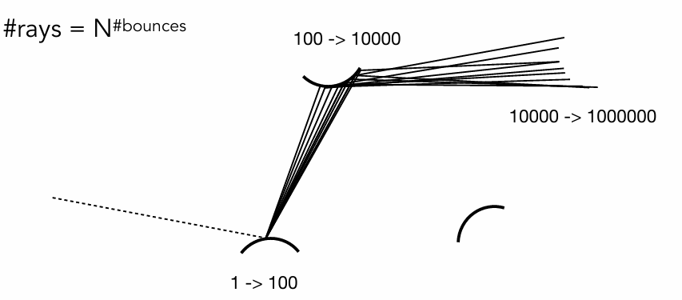

--- 
title: 【Games101】光线追踪与蒙特卡洛路径追踪
date: 2025-12-09T00:00:00+08:00
mathjax: true
categories: ["Games101笔记"]
tags: ["图形学", "GAMES课程", "光线追踪", "路径追踪", "概率论", "蒙特卡洛方法"]
description: "蒙特卡洛积分利用随机采样近似计算复杂积分，其理论基础是概率论。文章介绍了离散与连续随机变量、概率密度函数、期望值以及随机变量函数的概念，并阐述了这些知识在图形学渲染问题中的应用。"
cover: "/img/ComputerGraphics.png"
headerImage: "/img/rthykless.png"
math: true
--- 

蒙特卡洛积分利用随机采样近似计算复杂积分，其理论基础是概率论。文章介绍了离散与连续随机变量、概率密度函数、期望值以及随机变量函数的概念，并阐述了这些知识在图形学渲染问题中的应用。 

> [!tip]
>
> 在图形学中，我们经常遇到无法算出解析解的积分（比如上一节课的渲染方程，需要对半球面上所有光线积分）。 
>
> **解决思路**：既然算不准，那我就随机取样。 比如我想知道一个广场上所有人的平均身高，我不需要真的去量几万个人的身高（求积分），我只需要随机抓 100 个人量一下（采样），算个平均值（期望），就能大概估算出结果。这就是概率论在渲染中的核心作用。

蒙特卡洛积分是一种基于随机采样的方法，而概率论是它的理论基石。

## 概率论基础

### 随机变量 (Random Variables)

**定义**：随机变量 $X$ 是一个变量，它的值是不确定的，代表了一个随机过程的潜在结果 。

**例子**：掷骰子。$X$ 可能取的值是 $\{1, 2, 3, 4, 5, 6\}$ 。

#### 离散情况 (Discrete Case) —— 以“掷骰子”为例

如果 $X$ 是离散的，它取第 $i$ 个值 $x_i$ 的可能性记为 $p_i$ 。这里的$p_i$有两个硬性条件 ：

1. **非负性**：$p_i \ge 0$（概率不能是负数）。
2. **归一化**：$\sum_{i=1}^{n} p_i = 1$（所有可能性的概率加起来必须等于 1，也就是必然会发生某件事）。

则对于掷骰子来说，每个面朝上的概率是相等的，即 $p_i = 1/6$ 

#### 期望 (Expected Value)

期望可以理解为**平均值**。如果你不断地从分布中抽取样本，最终得到的平均结果就是期望 。
$$
E[X] = \sum_{i=1}^{n} x_i p_i
$$
即：（结果1 $\times$ 概率1）+（结果2 $\times$ 概率2）... 

则在例子掷骰子中会发生这种情况：虽然骰子只有整数点数，但其期望是：
$$
E[X] = 1 \cdot \frac{1}{6} + 2 \cdot \frac{1}{6} + \dots + 6 \cdot \frac{1}{6} = 3.5
$$
虽然你永远掷不出 3.5 这个点数，但“3.5”代表了掷很多次后的平均结果。

### 连续情况 (Continuous Case)

在图形学中，光线的方向、位置等都是连续的，所以我们不能用离散模型，必须进阶到连续模型。

**概率密度函数 (PDF, Probability Density Function)**

对于连续变量 $X$，我们无法说“取某个特定值 $x$ 的概率是多少”（因为特定一点的概率在数学上是 0）。我们用 **概率密度函数 $p(x)$** 来描述在某个值附近的**相对可能性** 。

PDF 必须满足的条件：

1. **非负性**：$p(x) \ge 0$ 。
2. **归一化**：函数曲线下的总面积为 1，即 $\int p(x) dx = 1$ 。

则对于连续变量的期望值，就可以将离散的求和 ($\sum$) 替换为积分 ($\int$)：
$$
E[X] = \int x \cdot p(x) dx
$$

#### 随机变量的函数 (Function of a Random Variable)

这是直接对应渲染方程的关键概念。在渲染中，我们**随机采样的是方向**（$X$），但我们要计算的是**该方向上的光照贡献**（$Y = f(X)$）。

- **概念**：如果 $X$ 是一个随机变量，那么它的函数 $Y = f(X)$ 也是一个随机变量 。

- 如何求期望：

  我们要计算的是函数值 $f(X)$ 的期望，利用 $X$ 的 PDF 即可计算：

$$
E[Y] = E[f(X)] = \int f(x) \cdot p(x) dx
$$

为了方便区分，我们将其换个变量名，写作:
$$
E[g(X)] = \int g(x) p(x) dx
$$
这个公式告诉我们：如果你有一个随机变量 $X$，它的概率密度是 $p(x)$，那么函数 $g(X)$ 的平均值（期望），等于 $g(x) \cdot p(x)$ 的积分。

## 蒙特卡洛法

在上一节课（Lecture 15），我们推导出了渲染方程：
$$
L_o(p, \omega_o) = L_e + \int_{\Omega} L_i(p, \omega_i) f_r \cos\theta d\omega_i
$$
这是一个包含积分的方程。然而，场景里的光照太复杂，这个积分我们根本算不出解析解（无法直接用公式算出结果）。

怎么办？ 我们只能借助上一节课复习的概率论，用数值方法去“猜”出这个积分的值。

**问题**：我们需要计算定积分 $\int_a^b f(x)dx$，但 $f(x)$ 可能非常复杂，很难求出解析解 。

**方法**：通过随机采样来估算。在积分域内随机取 $N$ 个样本 $X_i$，计算函数值并取平均。

其公式为：
$$
F_N = \frac{1}{N} \sum_{i=1}^{N} \frac{f(X_i)}{p(X_i)}
$$
其中 $p(X_i)$ 是样本的概率密度函数 (PDF) 。

**特性**：采样点越多（$N$ 越大），结果越接近真实值，噪声（方差）越小 。

> [!tip]
>
> 这里给一个类比的通俗解释：“广场平均身高”
>
> 你想知道广场上几万人的平均身高（积分），但你不可能把每个人都量一遍。
>
> - **做法**：你闭着眼随机抓 100 个人（采样 $N=100$）。
> - **计算**：把这 100 个人的身高加起来除以 100。
> - **原理**：只要你抓的人够随机、够多，算出来的这个平均值，就约等于全广场人的平均身高。
> - **关于 $p(x)$**：如果你是在“姚明篮球俱乐部”门口抓人（$p(x)$ 不均匀），那你算出来的均值肯定偏高。所以你需要除以 $p(x)$（权重）来修正这个偏差。

### 蒙特卡洛法推导来源

- **我们的目标**是求积分： $I = \int f(x) dx$
- **我们的工具**是期望： $E = \int g(x) p(x) dx$

**蒙特卡洛积分的精髓就在于：** 我们能不能构造一个特殊的函数 $g(x)$，使得它的期望值 $E$ 刚好等于我们想求的积分 $I$？

数学推导（Why it works）：

假设我们在积分域内通过某个概率密度函数 $p(x)$ 随机采样得到 $X$。我们构造一个“估算函数” $g(X) = \frac{f(X)}{p(X)}$。现在，我们把这个构造好的 $g(X)$ 代入 期望公式里算一下：
$$
\begin{aligned} E[g(X)] &= \int g(x) \cdot p(x) dx \\ &= \int \frac{f(x)}{p(x)} \cdot p(x) dx \quad \text{(把 g(x) 替换掉)} \\ &= \int f(x) dx \quad \text{(p(x) 约分消掉了！)} \end{aligned}
$$
**结论**：原来，如果我们每次采样得到 $X_i$ 后，算一下 $\frac{f(X_i)}{p(X_i)}$，这个值的**数学期望**（平均值）就是我们要算的积分结果！

于是我们得到了蒙特卡洛积分公式：
$$
F_N = \frac{1}{N} \sum_{i=1}^{N} \frac{f(X_i)}{p(X_i)}
$$

- $\frac{1}{N} \sum$ 就是在算样本的平均值（逼近期望）。
- $\frac{f(X_i)}{p(X_i)}$ 就是我们构造的那个随机变量。

## 算法演进

### 直接光照 (Direct Illumination)

我们先解决最简单的情况：**光线打到物体，直接反射到眼睛**（没有反弹）。

将渲染方程中的积分直接套用蒙特卡洛公式：

1. **采样**：在半球面上随机选 $N$ 个入射方向 $\omega_i$。

2. **PDF**：如果是均匀采样，半球面积是 $2\pi$，所以 $p(\omega_i) = 1/2\pi$ 

3. 计算：
   $$
   L_o \approx \frac{1}{N} \sum \frac{L_i \cdot f_r \cdot \cos\theta}{1/2\pi}
   $$
   这里只有当光线 $\omega_i$ 击中光源时，$L_i$ 才有值，否则为 0 4。

然而这种方法存在指数爆炸的问题：

如果光线没打中光源，而是打中了一堵墙 $Q$，怎么办？逻辑：墙 $Q$ 反射的光，就是点 $P$ 的入射光。我们需要算出 $Q$ 的 $L_o$，这就变成了递归 。

设想：我们在 $P$ 点采样 100 根光线。这 100 根光线打到周围物体上，每个物体又采样 100 根去寻找光...

后果：

- 1 次弹射：100 根
- 2 次弹射：10,000 根
- 3 次弹射：1,000,000 根

计算量呈指数级爆炸，计算机瞬间死机 。

### Path Tracing

为了不让光线爆炸，我们强制规定 **$N=1$**。

**做法**：每次弹射，**只随机选 1 个方向**往下走 。

- 这样光线数量永远是 $1 \to 1 \to 1 \dots$，永远不会爆炸。

**噪点问题**：只选 1 根光线，结果肯定充满了噪点。

**解决方案**：我们不对“一次弹射”做多次采样，而是对**每个像素**做多次采样（Ray Generation 循环）。只要一个像素发出的光线（Path）足够多，取平均后画面就干净了 。

> [!tip]
>
> **“侦察兵”类比**
>
> - **Whitted-Style**：像是一个将军，遇到分岔路口就派出所有分身去探路。路口越多，分身越多，最后累死。
> - **Path Tracing**：像是派出 1000 个**独立的侦察兵**（对应一个像素的 SPP）。
>   - 每个侦察兵遇到路口，只**随机选一条路**走到底（N=1）。
>   - 有的侦察兵找到了宝藏（光源），有的撞了墙。
>   - 最后将军听取这 1000 个人的汇报，取个平均值，就得到了最准确的地图。

### 俄罗斯轮盘赌 (Russian Roulette，RR)

**问题**：光线在物理世界会反弹无数次，递归什么时候停？

- 如果强制设为 3 次停止，能量就会损失（少了 3 次以后的光），画面会变暗（Biased）。
- 如果不亦步亦趋，程序会死循环。

我们引入俄罗斯轮盘赌 (RR) 来决定光线是否“死亡”。设定一个存活概率 $P$（例如 0.8）。

每次递归前，扔个骰子：

- 存活 ($P$)：继续发射光线，但要把计算结果除以 $P$（$L_o / P$）。

- 死亡 ($1-P$)：停止递归，返回 0 。

$$
E = P \times \frac{L_o}{P} + (1-P) \times 0 = L_o
$$

妙处：虽然每条光线的命运是随机的，但从数学期望（平均值）上看，我们没有损失任何能量，结果是无偏的 (Unbiased) 。

> [!tip]
>
> 这里的俄罗斯赌轮盘和深度学习中的MC_Dropout思想几乎一模一样啊哈哈😄其实是同一个公式在不同领域的应用

无论是 Path Tracing 还是 MC Dropout，它们的核心公式都是蒙特卡洛积分公式：
$$
E[f(x)] \approx \frac{1}{N} \sum_{i=1}^{N} f(x_i)
$$
即：**用 $N$ 次随机采样的平均值，来逼近一个复杂的期望值（积分）。**

| **步骤**       | **Path Tracing (图形学)**                                    | **MC Dropout (深度学习)**                                    |
| -------------- | ------------------------------------------------------------ | ------------------------------------------------------------ |
| **问题**       | 场景的光照太复杂，无法直接算出像素颜色。                     | 神经网络的参数分布太复杂（贝叶斯网络），无法直接算出预测分布。 |
| **随机性来源** | **随机光线方向**：每次弹射选不同的路。                       | **随机神经元掩码 (Mask)**：每次前向传播随机关掉不同的神经元。 |
| **单次采样**   | 发射 **1 条光线** (Sample 1 path)，得到一个充满噪点的颜色值。 | 进行 **1 次前向传播** (Forward pass)，得到一个不确定的预测结果。 |
| **多次采样**   | 对同一个像素，发射 **N 条光线** (SPP)。                      | 对同一个输入，进行 **N 次前向传播** (开启 Dropout)。         |
| **最终结果**   | **取平均值**：得到平滑、无噪点的像素颜色。                   | **取平均值**：得到模型对该输入的最终预测（贝叶斯近似）。     |
| **副产品**     | **方差 (Variance)**：表现为画面噪点。方差大说明光照复杂，需要更多采样。 | **方差 (Uncertainty)**：表现为模型的不确定性。方差大说明模型对这个输入“心里没底”。 |

### 对光源采样 

虽然我们现在的算法能得到基本正确的结果，但效率极低，“光线浪费”现象很严重。

如上图所示，我们在半球面上瞎蒙（均匀采样）。如果光源很小（比如天上的星星），随机选方向打中它的概率微乎其微。大量光线因为打不中光源而返回 0，导致画面全是噪点 。

为了解决该问题，提出了一种方法：**直接在光源上采样**。既然我们只想知道“光源有没有照亮这里”，不如直接把采样点移到**光源表面**上。

#### 数学变换 

蒙特卡洛积分要求采样域和积分域一致。我们把积分域从“立体角 $d\omega$”变换到“光源面积 $dA$”。

关系式如下：
$$
d\omega = \frac{dA \cdot \cos\theta'}{dist^2}
$$
其中 $\theta'$ 是光源法线与光线的夹角，$dist$ 是距离 。

新的重写方程：
$$
L_o = \int_{A} L_i f_r \cos\theta \frac{\cos\theta'}{dist^2} dA
$$
最终算法逻辑则是将将光照拆成两部分分别计算 ：

**直接光照 (Direct Illumination)**：

- **方法**：直接在光源面积上采样（无噪声）。
- **注意**：要发射一条 **Shadow Ray** 检查光源和点之间有没有障碍物 。

**间接光照 (Indirect Illumination)**：

- **方法**：依然对半球采样 + 俄罗斯轮盘赌。
- **注意**：如果射出的光线打到了**光源**，这部分必须**扔掉**（因为直接光照已经在第 1 步算过了，不能重复算

经过了对光源采样，可以看到光线追踪全局光照得到的绘制结果已经非常接近物理光线了。

> [!caution]
>
> 一句话总结一下Path Tracing:
>
> 在每个像素发射多条光线，光线每次弹射只随机走一个方向（N=1），利用俄罗斯轮盘赌决定停止，同时为了减少噪点，我们将直接光照单独拿出来，直接在光源面积上进行采样。