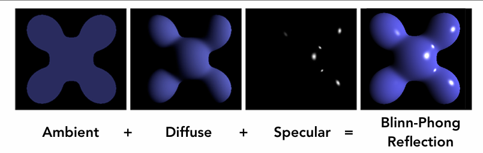

--- 
title: 【Games101】着色基础
date: 2025-07-01T00:00:00+08:00
mathjax: true
categories: ["Games101笔记"]
tags: ["图形学", "渲染管线", "光照", "GAMES课程", "线性代数", "着色器", "Shading", "shader"]
description: "Shading是图形学中模拟光线与物体表面交互以计算颜色和明暗的技术，其核心包括局部着色模型，以及漫反射、镜面高光和环境光等基础光照现象的模拟。"
cover: "/img/ComputerGraphics.png"
headerImage: "/img/rthykless.png"
math: true
--- 

Shading是图形学中模拟光线与物体表面交互，计算颜色和明暗的技术。其核心包括局部着色模型，以及漫反射、镜面高光和环境光等基础光照现象的模拟，以实现逼真的视觉效果。 


Shading是图形学中决定物体表面外观的关键技术，它模拟光线与物体表面的交互过程。

## 什么是Shading？

Shading是指计算物体表面颜色和明暗的过程，通过模拟光线与材质相互作用来产生逼真的视觉效果。

## 局部着色（Shading is Local）


定义为：计算特定着色点处反射到相机的光线

其关键要素一般为：

- l  光线照射方向向量
- n 着色点表面法向量
- v 观察视角方向
- 以及一个关键的表面参数（比如颜色color，光泽度shininess）

## 基础光照现象


如上图所示，**镜面高光（Specular highlights）**在杯口和把手转折处形成明亮的聚焦光斑，体现了光滑表面对光源的直接反射；**漫反射（Diffuse reflection）**在杯身侧面形成均匀的色彩渐变，如淡绿色杯子柔和的明暗过渡，反映了朗伯体表面的均匀散射特性；**环境光（Ambient lighting）**则使背光面（如棕色杯子底部）保持基础可见性，代表间接光照的简化模拟。

### 漫反射与兰伯特余弦定律（Lambert's Cosine Law）


漫反射的光线均匀地向所有方向散射，从任何视角观察，表面颜色都保持一致。


理想漫反射表面接收和反射的光强，与表面法线和入射光方向夹角的余弦成正比。

- 物体表面法向量n，和光源方向l，的夹角θ，决定了明暗强度

- 可以把光当成能量，吸收的越多越亮

### 能量守恒与光线衰减（Light Falloff）


光的传播遵循能量守恒定理，假设最初点光源的光能量都集中在一个球壳上，一开始球壳的表面积很小，那么单位面积上光的能量就很多，光越向外扩散，单位面积的能量就越小。

基于表面积的关系可以得知：距离光源为r的球壳上，单位面积上能量为I/r²

### 漫反射光照公式解析

结合上面的余弦定理，就可以知道diffuse的公式
$$
L_{d} = \underbrace{k_d}_{\text{表面颜色}} \times \underbrace{\left(\frac{I}{r^2}\right)}_{\text{入射光强}} \times \underbrace{\max(0, \mathbf{n}\cdot\mathbf{l})}_{\text{角度衰减}}
$$

- I/r² 表示有多少光到达了ShadingPoint（因为光会随着传播距离而衰减）
- Kd表示了该点颜色的反射率

​	 如果Kd=0，那么该点完全没有反射光出去，该点吸收了所有光，那么该点表现为黑色

​	 如果Kd=1，那么该点反射了所有光，那么该点表现为白色

​	 如果用RGB三个通道表示Kd，那么Kd就是Color

- Max（0，**n·l**）表示反射角度，nl都是单位向量，**n·l** = cosθ，当入射光从表面下面照入，θ>90°，cos<0，这种情况没有意义，因为我们只考虑反射光，不考虑折射等光线，所以需要和0比，取最大值

举个栗子：当Kd试为RGB颜色值的时候

当Kd=0时，此时对应着RGB值是：[0, 0, 0]，在计算机里表示为黑色，黑色正是完全吸收光的颜色，反之，当Kd=1时，对应着 [255, 255, 255]，在计算机里表示为白色，白色正是完全反射光的颜色。


上图可以看到，点光源在左上角处，随着Kd越来越大，左上角的物体表面反射光能量越来越多，而右下角处于背光处，所以完全没有光，越往中间部分，法线方向与光照方向的夹角越来越大，所以接收的光能量越来越少，符合 Blinn-Phong 模型。

### 高光与镜面反射


反射的强度一般取决于观察的方向，一般在镜面反射方向附近最为明亮

高光的产生：**在物体表面的观察角度与光源角度正好是镜面对称时，即可看到高光**


抽象到计算机图形学中，我们定义向量R是镜面反射方向，当观察方向V与R越接近时，高光部分越明显。

我们可以通过计算R和V的接近程度来确定看到的高光强度，但是:在计算机中计算反射向量R的计算量非常大。

所以，Blinn-Phong光照模型提出使用另一种计算方法:**半程向量**


通过上图可以发现，物体表面一点的法线方向正好是光源方向*l*和镜面反射方向*R*的角平分向量。

同样，我们知道视角*V*和光源*l*，可以很容易的计算出它们的角平分向量*h*，而该向量就称为半程向量。

通过比对法向量n和半程向量h的接近程度，用角度α表示：
$$
\cos\alpha = \frac{\mathbf{n} \cdot \mathbf{h}}{|\mathbf{n}||\mathbf{h}|} = \mathbf{n} \cdot \mathbf{h}
$$
由于cos*α*∈[0,1]可以表示物体表面该点反射的高光强度，所以我们可以得到计算高光的公式：
$$
L_{s} = K_{s}\left(\frac{I}{r^{2}}\right)\max(0, \cos\alpha)^{p} = K_{s}\left(\frac{I}{r^{2}}\right)\max(0, \mathbf{n} \cdot \mathbf{h})^{p}
$$
**注意：**

1. *Ks*依旧表示物体表面该点对光的吸收率，在计算机中用RGB值表示
2. 指数*p*用于加快函数的衰减程度：
   - 物理世界中高光存在于物体表面很小的一部分
   - cos*α*的自然衰减速度太慢
   - 通过指数加速衰减，使高光只在**n**与**h**非常接近时可见


如下图为参数变化后得到的绘制结果，纵向来看，反射系数Ks越大，高光越亮。横向来看，指数p越大，高光越小：


实际上允许使用视角向量**v**和镜面反射向量**R**的接近程度来计算高光，而这种计算方式就称为Phong模型。Phong模型与Bling-Phong模型产生的高光效果不一样，Bling-Phong产生的高光更加柔和。

### 环境光照

环境光是照射在其它物体上的光先反射到观察物体上，通过观察物体表面再反射至视角中。


一个茶杯，在光源并没有直接照射的方向上也有一定的亮度，因为一个光线可以弹射很多次，从四面八方打到任何一个点，这些光照就算是环境光照

由于环境光照非常复杂，这里我们假设一个点受到的环境光照永远都是相同的，强度称为Ⅰa

任何一个点都有自己的颜色，Ka相当于环境光的系数，就可以近似的得到一个环境光公式
$$
L_{a} = k_{a} I_{a}
$$

## Blinn-Phong 模型



环境光（无论方向）（常数颜色） + 漫反射（无论观测方向）（光照/法线） + 高光 = 布林冯反射模型
$$
\begin{aligned}
L &= L_{a} + L_{d} + L_{s} \\
&= k_{a}I_{a} + k_{d}\left(\frac{I}{r^{2}}\right)\max(0, \mathbf{n} \cdot \mathbf{l}) + k_{s}\left(\frac{I}{r^{2}}\right)\max(0, \mathbf{n} \cdot \mathbf{h})^{p}
\end{aligned}
$$
可以拆分来看：

- **第一幅图**：由于环境光是常数，所以作用在物体的每一个点上都有相同的光强度效果。
- **第二幅图**：漫反射光与观察视角相关，所以观察视角与物体表面顶点法线越接近，光强度越大。
- **第三幅图**：高光和观察的视角密切相关，只有半程向量与顶点法线偏差非常小时，才能看到高光效果。

## 着色方法


如上图所示，三个球具有完全相同的空间信息，着色频率不同后表现不一样，其代表的是三种不同的着色方式。

### Flat shading（平面着色）


该着色方式计算流程：

1. 获取三角形面片的几何法向量
2. 计算面片中心点的光照强度（使用Phong等光照模型）
3. 将计算结果应用于整个三角形区域

### Gouraud shading（高洛德着色）


Gouraud着色是一种**基于顶点的着色技术**，由法国计算机科学家Henri Gouraud于1971年提出。其核心流程是：

1. 在**顶点着色器**中计算每个顶点的颜色
2. 通过**双线性插值**确定三角形内部各像素的颜色
3. 输出最终渲染结果

至于双线性插值的具体计算流程我们后续讲解我们后续讲解。

### Phong着色（冯氏着色）


Phong着色是一种**基于像素的光照计算技术**，由犹大学者Bui Tuong Phong于1973年提出。其核心流程是：

1. 在**顶点阶段**传递法线数据
2. 在**光栅化阶段**对法线进行插值
3. 在**片段着色器**中为每个像素独立计算光照


三种着色频率产生的效果也取决于模型本身

每一行的模型本身顶点数是一样的，越往下顶点数越多

当几何足够复杂时用FlatShading得到的效果也很好

反过来说，当几何的面数大于像素数量时FlatShading的性能也不会好于PhongShading

### 求逐顶点的法线


其最简单的一个思路其实是将与顶点相邻的面的法向量做加权平均
$$
N_{v} = \frac{\sum_{i} N_{i}}{\left\|\sum_{i} N_{i}\right\|}
$$


## 图形管线/实时渲染管线


1. **顶点处理**
   - 接收3D模型的原始顶点数据（模型坐标系）
   - 通过模型矩阵转换到世界坐标系
   - 根据摄像机位置计算视图变换
   - 投影变换将3D坐标映射到2D裁剪空间
   - 输出屏幕空间坐标（带深度值）
2. **三角形处理**
   - 将顶点装配成三角形图元
   - 执行背面剔除（丢弃背对相机的三角形）
   - 进行视锥体裁剪（移除屏幕外的部分）
   - 输出待渲染的有效三角形列表
3. **光栅化**
   - 将三角形转换为覆盖的像素区域
   - 计算每个像素的重心坐标
   - 对顶点属性（颜色/法线/UV）进行插值
   - 生成片段（Fragment）集合
4. **着色计算**
   - 采样纹理获取基础颜色
   - 计算光照（漫反射+镜面反射）
   - 混合材质属性与光照结果
   - 输出片段最终颜色值
5. **后处理**
   - 深度测试解决遮挡关系（Z-Buffer）
   - 执行抗锯齿处理（如MSAA）
   - 可选的屏幕特效（Bloom/HDR）
   - 最终写入帧缓冲区

## Shader

现代GPU中，这套渲染管线某些部分是可编程的，可以由开发者去定义顶点/像素如何着色

也就是用代码控制如何着色，这部分代码就叫Shader。

Shader指定的是每一个像素/顶点如何着色，所以不能也不用去指定某一个像素如何着色

如果写的是顶点操作，这个shader就叫做VertexShader（顶点着色器）

如果写的是像素操作，这个shader就叫做FragmentShader（片段/片元着色器）/PixelShader（像素着色器）

```glsl
uniform sampler2D myTexture;    // 纹理采样器
uniform vec3 lightDir;          // 世界空间光源方向（应归一化）
varying vec2 uv;                // 纹理坐标（已插值）
varying vec3 norm;             // 顶点法线（应归一化）

void diffuseShader() {
  vec3 kd; 
  kd = texture2D(myTexture, uv).rgb; // 获取纹理颜色
  kd *= clamp(dot(-lightDir, norm), 0.0, 1.0); // 兰伯特余弦计算
  gl_FragColor = vec4(kd, 1.0);     // 输出最终颜色
}
```