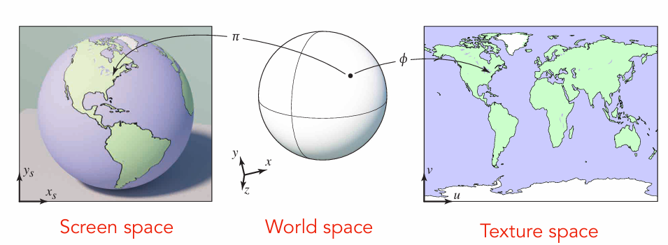
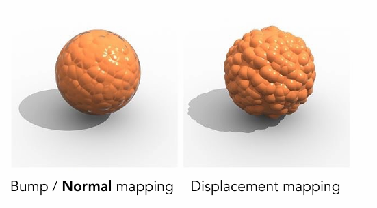

--- 
title: 【Games101】纹理映射与着色
date: 2025-07-03T00:00:00+08:00
mathjax: true
categories: ["Games101笔记"]
tags: ["图形学", "GAMES课程", "纹理", "插值", "纹理映射", "各向异性过滤", "Shading"]
description: "纹理是计算机图形学中用于增强模型表面细节的二维图像或数据贴图。通过纹理映射技术，结合UV坐标系和重心坐标插值，可将纹理贴合到三维模型表面，提供颜色、法线等丰富信息，提升视觉真实感。"
cover: "/img/ComputerGraphics.png"
headerImage: "/img/rthykless.png"
math: true
--- 

纹理是计算机图形学中用于增强模型表面细节的二维图像或数据贴图。通过纹理映射技术，结合UV坐标系和重心坐标插值，可将纹理贴合到三维模型表面，提供颜色、法线等丰富信息，提升视觉真实感。 

# 什么是 Texture？

**纹理（Texture）** 是计算机图形学中用于增强图像细节和真实感的图像或数据贴图。它本质上是一种二维（通常是图片）或多维数据，常用于为图形表面提供颜色、法线、反射、透明度等信息。结合我们上节课提到的 **布林-冯反射模型（Blinn-Phong Reflectance Model）**，纹理可以在漫反射部分表现不同的模型颜色，通过将纹理映射到表面，提供更加丰富的视觉效果。

> **纹理** 作为图形表面上的“贴图”，通常是二维图像，但在某些情况下，也可以是多维数据，用来提供表面的额外信息，增强其细节。
>
> 在 **布林-冯反射模型** 中，纹理主要用于模拟漫反射光照效果（即表面反射的光线分布），使得物体表面看起来更加自然和复杂。例如，在一个物体表面的漫反射部分，纹理可以通过控制不同区域的颜色和明暗，进一步模拟表面材料的特性。

## 纹理映射（Texture Mapping）

纹理映射是一种将二维纹理图像（通常为位图）“贴”到三维模型表面的方法，目的是在不增加几何体复杂度的前提下，为三维物体提供更细致的视觉效果。通过纹理映射，物体表面可以拥有丰富的颜色、图案、细节等信息，而不需要额外的多边形面片。

如上图所示：3D物体的表面其实都是2D的，比如地球仪，将地球仪上的图撕下来，可以平铺成一张2D的图物体的表面，通过这种方式可以和一张图有一一对应的关系，这张图就叫纹理， 将这张图平铺/裁剪/拉伸到任何物体表面，就叫纹理映射，纹理上的坐标系通常以UV来表示。

## UV坐标系

**UV 坐标系统**：这是一种标准的坐标系统，用来描述如何将纹理与物体表面的几何形状进行对应。纹理坐标的值通常在 [0, 1] 范围内：

- `U` 是纹理图像的水平方向坐标，类似于 x 轴；
- `V` 是纹理图像的垂直方向坐标，类似于 y 轴。

每个顶点都被赋予一个 `(U, V)` 坐标，当渲染时，图形管线会根据这些坐标从纹理图像中提取颜色信息。屏幕上的采样点（x,y）可以用重心坐标算出在纹理中采样的uv，得到对应纹理。

## 重心坐标与插值

**重心坐标（Barycentric Coordinates）** 是处理三角形表面插值的核心工具。在纹理映射中，三角形的每个顶点都有一个对应的纹理坐标，而三角形内部任意一点的纹理坐标可以通过 **重心坐标** 计算得到。换句话说，重心坐标帮助我们根据三角形的顶点坐标，插值出该点的 **纹理坐标、颜色或法线** 等信息。

- **官方定义**：重心坐标是一种坐标系统，用于在三角形内表示点的位置，表达式为 `αA + βB + γC`，其中 `α + β + γ = 1`，其几何意义是某点与三顶点连线分割的三个三角形面积刚好相同。

- **通俗解释**：想象三角形的三个顶点，重心坐标就是告诉我们该点离每个顶点的距离比例。例如，如果你在一个三角形的中心位置，重心坐标可能会是 `1/3, 1/3, 1/3`，这意味着它等距地靠近三个顶点。

> [!important]
>
> 要注意，对于三维空间中的点，不能保证其被投影后的重心坐标不变。因为在做光栅化时，需要知道像素中心在三角形的什么位置，此时不能直接求重心坐标进行插值。需要将该点重新投影回三维空间中，在三维空间中计算重心坐标插值。

通过 **重心坐标**，我们可以在三角形内平滑地进行 **插值**，也就是计算出任意位置（如屏幕上的某个像素）所需的属性值。通常我们会插值纹理坐标、颜色、法线等属性，从而让图像在渲染时更加平滑。

# 纹理应用中的问题

## 纹理放大Texture Magnification

当低分辨率纹理应用到高分辨率的屏幕上，纹理就会被拉大。

当我们放大一个纹理，使得纹理覆盖更大屏幕区域时，每个像素（纹素）会变得更大。如果纹理本身的分辨率较低，放大后就会显得模糊，甚至会出现像素化的现象。这是因为纹理中的信息被拉伸到一个更大的空间里，而其原始细节不足以支撑更大的显示区域。

> **像素化（Pixelation）**：当纹理分辨率较低时，放大后每个纹理像素（texel）就会变得明显可见，看起来像是放大了的方块，这使得图像显得粗糙。
>
> **模糊（Blurring）**：当纹理被拉伸时，由于采样不足，可能会导致细节丢失，使得纹理看起来模糊不清。

### 最近邻采样（Nearest Neighbor Sampling）

最近邻采样是一种最简单的纹理过滤方法，它通过选择最接近的纹素来决定当前像素的颜色。也就是说，对于一个放大的纹理，每个像素直接取最近的纹理像素的颜色，而不会考虑周围其他像素的颜色。

如上图所示，B点之间被赋予了A点像素的颜色，这种方法速度快，但由于没有进行插值，结果通常会显得很粗糙，容易出现锯齿和模糊。

### 双线性插值（Bilinear Interpolation）

双线性插值是纹理过滤中常用的一种方法。它通过对四个最近的纹理像素进行加权平均来计算目标像素的颜色值。

- 具体来说，首先在水平和垂直两个方向分别对纹理像素进行线性插值，然后再对这两个结果进行线性插值，最终得到目标像素的颜色。

双线性插值相比最近邻采样，能够有效地减少锯齿现象和模糊，过渡更加平滑，因此通常能提供更好的视觉效果。

### 双三次插值（Bicubic Interpolation）

双三次插值是比双线性插值更精细的插值方法，它在计算时考虑了 **周围16个纹理像素**。通过在两个方向上进行三次插值，双三次插值能够提供更高质量的结果，尤其是在大幅度放大纹理时。

双三次插值能够获得比双线性插值更平滑的结果，尤其是对于复杂的图像和大比例的放大，能显著减少模糊和锯齿。当然，其计算开销也远高于双线性插值。

## 纹理缩小Texture Minification

当我们把一个纹理缩小到比原来小的尺寸，通常是因为物体离相机很远，或者物体在屏幕上的显示面积变小。此时，纹理的分辨率可能不再适应新的显示大小。

> **问题表现**：
>
> - **失真（Distortion）**：当纹理被缩小时，图像的细节会丢失，可能会导致一些视觉失真。比如，图像可能会失去原有的清晰度，细节模糊不清。
> - **“摩尔纹”（Moiré）**：摩尔纹是一种由低频率纹理和高频率显示之间的干扰产生的图案，通常在纹理被大幅度缩小时出现。
> - **模糊**：由于纹理细节丢失，缩小后的纹理可能会变得模糊不清，特别是在较小的显示区域上，纹理的细节几乎完全消失。

如果直接简单的使用线性插值进行采样会得到右图，远处有摩尔纹近处有锯齿。远处的一个像素就会覆盖很大一片的纹理区域，单纯以像素的中心是标准取纹理的值是不对的。这其实就是转变为了采样率不足的问题，之前解决采样率不足的问题我们可以使用SSAA，每个像素内分为若干小像素进行采样。

以512个小像素为例，得到的结果如下图

正确，但花费了512倍的性能!

既然采样方法有问题，那我们如果可以直接查询而不采样呢？

### Mipmap多级渐远纹理

纹理缩小时，一个屏幕上的像素对应了纹理上的多个纹素，使图像看起来就变得模糊。基于此我们引出了**Mipmap（多级渐远纹理）**技术。

Mipmap 是一个纹理的多级层次结构，其中每个级别的纹理分辨率都比上一层低。

- **Mipmap 工作原理**：当物体远离相机时，我们会选择较低分辨率的纹理来提高渲染效率，而当物体靠近时，使用较高分辨率的纹理。
- **Mipmap的优势**：通过使用不同分辨率的纹理级别，Mipmap 可以避免纹理在远距离缩小时出现的 **模糊** 和 **失真**。

> [!IMPORTANT]
>
> 因为生成了多个较小的图像，需要额外储存生成的小图像，Mipmap方法算是一个经典的空间换时间策略。在某些教材表述中，该方法也被称为“纹理金字塔”(Texture Pyramid)。

#### **Mipmap的额外存储需求**

假设原始纹理的尺寸为 $W \times H$（宽度为 $ W $，高度为 $ H $），那么 Mipmap 将生成多个不同分辨率的纹理层级。每个级别的纹理尺寸将是上一层的一半，直到纹理的尺寸减小到 $ 1 \times 1 $ 或最小纹理尺寸。

**存储需求计算**

每个 Mipmap 级别的纹理存储空间是该级别纹理像素数乘以每个像素的存储大小。假设每个像素使用 4 字节（例如 RGBA 格式），则：

1. **第 0 级（原始纹理）** 的存储大小为$ W \times H \times 4 $ 字节。
2. **第 1 级** 的存储大小为 $ \left( \frac{W}{2} \right) \times \left( \frac{H}{2} \right) \times 4 $ 字节。
3. **第 2 级** 的存储大小为 $ \left( \frac{W}{4} \right) \times \left( \frac{H}{4} \right) \times 4 $ 字节。
4. 以此类推，每一层的纹理分辨率是前一层的一半。

如果原始纹理的大小是 $W \times H$，那么 Mipmap 总共需要的存储空间（包括所有级别的纹理）可以通过以下公式计算：
$$
 \text{总存储空间} = 4 \times \left( W \times H + \frac{W}{2} \times \frac{H}{2} + \frac{W}{4} \times \frac{H}{4} + \dots + 1 \times 1 \right)
$$
具体来说，Mipmap 所需的存储量大约是原始纹理存储空间的 2 到 4 倍（取决于纹理的宽高比以及原始纹理的尺寸）。这意味着，Mipmap 存储需要大约 **2倍到4倍** 的额外存储空间。

#### Mipmap与三线性插值

Mipmap虽好，但是之间查询使用会出现不连续的纹理映射，因为查的纹理都是整数层，比如我们事先存储好了1、2、4、8层的Mipmap，而在距离为1.5的时候就无法直接查询1.5层的Mipmap。

如下图使用不同的颜色代表不同的远近，在衔接处会出现明显的割裂和锯齿。

这时候我们再延续之前的插值思想，把离散变为连续，在层与层之间进行插值，这个方法就是**三线性插值**。

三线性插值是双线性插值的扩展，它不仅对纹理的空间进行插值，还考虑了 **多个 Mipmap 级别之间的过渡**。Mipmap 是一系列不同分辨率的纹理图像，三线性插值通过对两个不同的 Mipmap 级别进行插值，平滑过渡纹理的细节。

**效果**：三线性插值通过引入 **多个 Mipmap 级别**，能够大大减少缩小纹理时的失真现象，尤其在物体远离相机时，它会选择一个合适的 Mipmap 级别进行纹理采样，从而避免图像出现不自然的模糊或失真。

在经历了插值后，可以看到，衔接处的割裂情况少了很多，过渡更加平滑。

### 各向异性过滤Anisotropic Filtering

回到之前我们的一张网格地图，可以看到，点采样出现了非常严重的锯齿和失真，512倍超采样效果最好但性能开销极大，Mipmap+三线性插值以比较小的性能开销使得近处的网格看起来和超采样的效果几乎一样好，但是远处依然是糊成了一片。因为Mipmap是近似的、正方形的查询，只能查询正方形区域，而且三线性插值也是近似。

> 在计算机图形学中，纹理映射是通过将二维图像（纹理）映射到三维物体表面来增强图形的细节。然而，当我们以斜角或不正对纹理的角度观察时，纹理会发生变形。此时，传统的纹理过滤方法（如 **双线性插值** 或 **三线性插值**）可能无法充分保留细节，导致图像模糊或失真。

屏幕上的像素映射到纹理上不一定是正方形，对于不是正方形的Mipmap就无法处理。如上图，对于右边不是正方形但是是比较规则的矩形，我们可以用各向异性过滤来进行优化。

> [!note]
>
> **各向异性** 是指在不同方向上，图像像素的大小会有所不同，特别是在以斜角观察纹理时，纹理像素的形状并不是均匀的。因此，传统的过滤方法会遇到困难，不能有效地处理纹理图像在斜角视角下的细节问题。

各向异性过滤通过对纹理的多个采样点进行加权平均，尤其是在 **斜角视角** 下进行优化，能够根据不同方向的纹理像素大小来提高纹理的清晰度。它的工作原理可以通过以下几个步骤来理解：

**斜角纹理采样**：

- 当从不同的角度观察纹理时，纹理的采样点会以不同的 **斜率**（即在屏幕上的投影大小）被拉伸或压缩。
- 各向异性过滤通过在不同方向上进行多个 **纹理采样**，特别是斜角方向，以确保对不同像素的处理能够根据它们的形状调整权重。

**加权平均**：

- 各向异性过滤对纹理的多个采样点进行加权平均，这样可以消除纹理在某些方向上的失真和模糊。
- 通过这种方法，各向异性过滤能够减少 **摩尔纹**（Moiré）和 **纹理失真**，让纹理显示更加清晰。

**不同方向的处理**：

- 各向异性过滤在各个方向上进行不同程度的采样，尤其是处理 **对角线方向**（即斜角观察时的方向）上的采样，这些方向通常会受到 **扭曲** 和 **失真** 的影响。
- 各向异性过滤通过多次采样，在纹理的各个方向上优化其显示效果。

### Ripmap和EWS过滤

各向异性过滤虽然能提升一定斜视视角的显示效果，但需要额外的计算和采样，因此会增加图形渲染的性能开销，尤其是在较高的过滤级别下。

**Ripmap**延续了之前空间换时间的思想：把uv方向下单轴极限压缩情况下的纹理预存起来。当纹理在三维表面上的投影是不规则的矩形或 斜角的时，Ripmap 通过重新调整接近的采样区域，确保纹理映射的每个像素都能在正确的位置进行采样，以减少失真和模糊。

**EWA 过滤**（Elliptical Weighted Average Filtering）通过将纹理采样区域拆分为多个不同大小的椭圆形状来优化纹理的显示效果。这种方法可以精确地处理 **斜角投影** 或 **非正交纹理映射** 的情况，减少模糊和失真，并保留更多的细节。然而，这种方法的代价是它需要进行 **多次查询**，因此带来了一定的 **性能开销**。

# 纹理的其他应用

现在现代GPU中，纹理不仅仅用于表示颜色，它还可以承担其他重要的功能。纹理的本质是将数据带入片段计算中，这意味着它是一个存储和查询数据的工具。具体应用包括：

## EnvironmentMap -- 环境光贴图

环境图是利用纹理来模拟环境光照的一个重要概念，最早由Blinn和Newell（1976年）提出。环境图可以捕捉整个场景的光源信息并应用到3D物体表面。环境图的应用之一就是**反射渲染**，通过环境图，物体表面可以反射环境中的光线，从而达到更真实的光照效果。具体例子包括：

- **环境光照**：环境图通过记录从不同方向到达物体表面的光线，来模拟从环境反射回来的光。这种方法特别适用于具有镜面反射的表面，例如水面或金属表面。
- **渲染应用**：通过在3D物体的表面使用环境图，物体能够反射周围的场景，产生非常真实的反射效果。例如，右边的茶壶图像展示了通过环境图进行渲染的效果。

### 环境光照 (Environmental Lighting)

环境光照技术的关键是利用环境图来模拟光源在三维空间中的影响。通过这种方式，图形引擎能够在场景中生成更自然的光照效果。环境图的左边展示了从环境中获取的光源，而右边的图像则展示了通过环境光照渲染出来的茶壶，反射了环境中的其他物体和光源。

这种技术被广泛应用于渲染逼真场景，尤其是在光滑且有反射的表面上。例如，在制作具有金属表面或者水面效果的场景时，环境光照可以帮助提升渲染的真实感。

### 球形环境图 (Spherical Environment Map)

球形环境图（Spherical Environment Map）是一种较为经典的环境图表示方法，它通过将场景的光照信息映射到一个球形纹理上来模拟环境光照。通过这种方法，光照信息被均匀地分布在球形图像的表面上，从而可以有效地用于场景渲染。

然而，球形环境图也存在一个**失真问题**，尤其是在图像的顶部和底部区域。这个问题通常在将环境图应用到物体表面时被放大，导致图像的边缘部分产生畸变。

### 立方体映射 (Cube Map)

为了避免球形映射的失真问题，**立方体映射**应运而生。立方体映射通过将环境信息映射到立方体的六个面上，从而减少了球形映射的失真问题。每个面都使用一个正方形的纹理，从而实现更高质量的反射效果。

立方体映射的好处在于，它能够保持更少的失真，并且由于每个面的纹理是正方形，能够更加精确地表达环境光照的信息。与此同时，立方体映射需要对方向向量与立方体面的对应关系进行计算。

## 纹理对着色的影响

纹理不仅仅用于颜色映射，它还可以影响着色（shading）过程中的其他属性，特别是通过存储表面属性（如法线、凹凸、位移等），帮助实现更复杂的视觉效果。以下是几种常见的纹理影响着色的方式：

### 法线映射（Normal Mapping）与凹凸映射（Bump Mapping）

法线映射是一种使用纹理来修改物体表面法线的技术，从而改变表面光照的计算，而不增加几何细节。通过法线图（normal map），可以模拟出复杂的表面细节，例如凹坑、凸起等，虽然物体的几何结构并没有改变。法线映射利用RGB图像中的每个像素来表示表面法线的不同方向。

这种技术广泛应用于游戏和电影中，以减少模型的多边形数量，同时增加视觉细节。

凹凸映射是一种简单的技术，使用灰度纹理来模拟物体表面的细微起伏。它通过修改每个像素的法线方向，使得光照计算时产生细节的效果。这种方法不涉及实际的几何变化，而是仅仅修改光照计算中的法线，因此它是一种“假”的几何变化。与法线映射类似，凹凸映射主要用于模拟细节而不增加多边形的复杂度。

**如何使用纹理进行凹凸映射？**

- **纹理存储**：凹凸纹理（bump map）是一个灰度图，每个像素的灰度值表示表面在该点的高度或偏移。
- **法线计算**：通过计算纹理中像素的高度差（例如通过计算相邻像素的差值），我们可以推导出表面在该点的法线方向，从而影响光照计算。

**数学表达**

在平面上，假设有一个表面法线 $n(p)$，并且纹理中的每个像素 $b(u,v)$ 存储了该点的高度变化，法线的修改可以通过以下公式来计算：

- **原始法线** $n(p) = (0, 1)$
- **扰动计算** $dp = c \times [h(p+1) - h(p)]$
- **扰动后的法线** $n(p) = (-dp, 1)$（经过归一化）

### 位移映射（Displacement Mapping）

与法线映射和凹凸映射不同，位移映射不仅仅改变法线，它实际改变了表面的几何结构。位移映射使用纹理中的信息（通常是灰度纹理）来推算表面每个点的位置，从而改变物体表面的形状。通过这种方式，可以获得更为复杂的几何效果，比如山脉的表面起伏、粗糙的岩石等。

此外对于复杂模型的环境光照，也可以预先计算好存储在纹理中：

纹理还不止于3D物体表面，也可以用于存储空间结构，比如3D模型内部的密度，医学中使用3D纹理直接进行体积渲染

