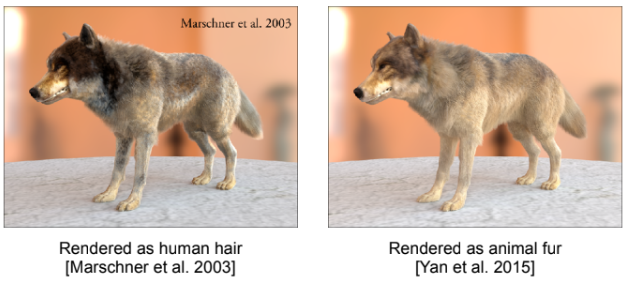
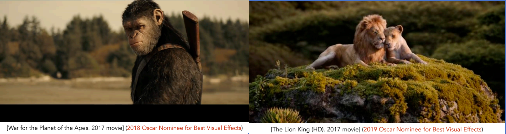
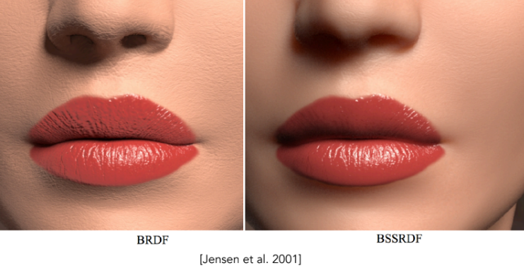

--- 
title: 【Games101】高级光线传播与复杂外观建模
date: 2025-12-15T00:00:00+08:00
mathjax: true
categories: ["Games101笔记"]
tags: ["图形学", "GAMES课程", "毛发建模", "复杂光线传播"]
description: "文章对比了无偏与有偏渲染方法，并详细分析了双向路径追踪和梅特罗波利斯光线传播两种高级光线传播技术的原理、适用场景及优缺点。"
cover: "/img/ComputerGraphics.png"
headerImage: "/img/rthykless.png"
math: true
--- 

高级光线传播技术旨在提升复杂光照下的渲染效率与质量。文章对比了无偏与有偏方法，并详细分析了双向路径追踪和梅特罗波利斯光线传播两种策略的原理、适用场景及优缺点。 

> [!tip]
> 这节课可以当作一个小综述，大致了解就好。

> [!tip]
>
> 前的课程我们学习了路径追踪（Path Tracing），它是现代渲染的“黄金标准”。但是，它并非万能。在面对“光路特别复杂”或者“材质特别复杂”的情况时，标准路径追踪会产生巨大的噪点，或者效率极低。这节课就是为了解决这两个难题：
>
> 1. **高级光线传播**：怎么在复杂光照下算得更准、更快？
> 2. **高级外观建模**：怎么渲染那些不是简单平面的物体（如头发、雾气、皮肤）？

# 高级光线传播 (Advanced Light Transport)

这部分的核心在于解决标准 Path Tracing 收敛慢、噪点多的问题。

### 无偏与有偏 (Unbiased vs. Biased)

在深入算法之前，我们需要先建立一个评价标准：

**无偏 (Unbiased)**定义为：蒙特卡洛估计的期望值**始终等于**真实值。其特点为：样本少时会有噪点（Noise），但只要样本够多，结果一定是对的。之前学过的Path Tracing就是一个无偏的方法。

**有偏 (Biased)**定义为：估计值的期望与真实值有系统性偏差。其特点为：样本少时，结果通常是**模糊 (Blurry)** 的，而不是噪点。**一致性 (Consistent)**：这是有偏方法中好的那一类。如果样本数趋向于无穷大时，误差能收敛到0，就叫“一致”。

> [!tip]
>
> **通俗理解**：无偏 = 画面有噪点但准确；有偏 = 画面平滑但可能模糊（看起来像把噪点抹平了）。

## 解决“光路难找”的几种高级策略

当光源被遮挡，或者光线需要经过多次反弹才能进入眼睛时（例如：光线打到墙上，墙漫反射到玻璃球，玻璃球折射聚焦到地板，我们看地板上的亮斑），标准 Path Tracing 很难随机“碰”到这种路径。

### 双向路径追踪 (BDPT - Bidirectional Path Tracing)

**原理**：既然只从摄像机发射光线（Path Tracing）很难找到光源，那不如**同时从摄像机和光源**各发射一条半路径，然后把中间的端点连起来 。

**适用场景**：

- 光源主要是间接光的情况（如：灯罩里的灯照亮天花板，天花板照亮书）。

**优缺点**：效果很好，但这是一种**无偏**的方法，实现极其复杂，且速度较慢 。

### 梅特罗波利斯光线传播 (MLT - Metropolis Light Transport)

这是一种“聪明的”采样方法。这就好比你在找路，一旦你发现了一条能通向光源的缝隙，MLT 就会在这个缝隙周围**反复采样**，因为它猜测这附近大概率还有其他通路，而不是像 Path Tracing 那样傻傻地随机乱撞 。

**原理**：利用马尔可夫链蒙特卡洛 (MCMC) 方法，根据当前样本生成下一个样本（局部扰动）。

> [!tip]
>
> 虽然原理都是马尔科夫链，但是在扩散模型中，随机种子是**旅程的起点**，旅程本身（去噪）相对直接，目的是到达一个具体的终点（图片）。
>
> 在MLT中，当前光线是**随机游走的当前位置**，游走本身是高度随机和探索性的，目的是用整个游走历史来绘制地图（计算积分），所以才会出现闪帧的问题。

| 层次               | 扩散模型                                                 | Metropolis Light Transport                      |
| ------------------ | -------------------------------------------------------- | ----------------------------------------------- |
| **状态定义**       | 一张**去噪过程中的中间图像** $x_t$                       | 一条**完整的光线路径** $\bar{x}$                |
| **马尔可夫链**     | 反向去噪链 $x_T→x_{T−1}→...→x_0$                         | 路径状态链$xˉ0→xˉ1→...$                         |
| **“种子”对应物**   | 链的**初始状态**：纯噪声 $x_T$                           | 链的**初始状态**：一条随机生成的光线路径        |
| **转移算子**       | 学得的去噪分布 $p_θ(x_{t−1}∥x_t)$                        | 提议分布 + Metropolis-Hastings 接受准则         |
| **目标分布**       | **没有明确的“目标分布”**，链的目的是产生一个样本（图片） | **明确的目标分布**：路径的贡献函数 $f(\bar{x})$ |
| **我们关心的输出** | 链的**最终状态** $x_0$（生成的图片）                     | 链的**所有状态的统计平均**（积分的估计）        |

**优缺点**：

- **神技**：非常擅长处理极其困难的光路（如 SDS 路径：Specular-Diffuse-Specular，例如游泳池底的焦散）。
- **硬伤**：因为它是“局部探索”，会导致画面收敛速度不均匀，看起来**很脏 (Dirty)**。因此几乎**无法用于动画**，因为帧与帧之间会闪烁 。

### 光子映射 (Photon Mapping)

这是一种专门用来做**焦散 (Caustics)** 的神技（例如阳光透过装水的玻璃杯在桌上形成的亮斑）。它是一种**有偏但一致 (Biased but Consistent)** 的两阶段方法 。

**步骤通解**：

1. **光子发射 (Photon Tracing)**：从光源发射出无数个“光子”，让它们在场景里弹射，停在漫反射表面上。
2. **光子收集 (Photon Collection)**：从摄像机发射光线，打到物体表面后，看看这个点周围**N 个最近的光子**有多密。

**为什么有偏？**：因为它是通过统计周围一圈光子的密度来估算当前点的亮度，这本质上是一种**密度估计 (Density Estimation)**。这相当于把周围的光子“抹平”或者是“模糊”了，所以是有偏的。

**直观表现**：N 取小了，会有噪点；N 取大了，画面会变糊（Bias 变大）。

 ### 顶点连接与合并 (VCM)与实时辐射度 (Instant Radiosity)

**VCM**：把 BDPT 和光子映射结合起来，集百家之长 。

**Instant Radiosity (VPL)**：把被光照亮的表面点，都当成一个个新的微型光源 (Virtual Point Lights)。如果你想快速照亮一个漫反射场景，这个方法很快，但在缝隙处容易产生奇怪的发光点 (Spikes) 。

# 高级外观建模 (Advanced Appearance Modeling)

解决了“光怎么跑”的问题，接下来要解决“光打到了什么”的问题。现实中很多物体不是简单的表面（如塑料），而是极其复杂的结构。

## 非表面模型 (Non-Surface Models)

这类物体没有清晰的“壳”，光线是和整个“体积”发生作用。

### 参与介质 (Participating Media)

**如** 雾、云、烟、混浊的水。

光线进入介质后，会不断撞击微小的粒子（如水滴、尘埃）,产生区别于表面模型的吸收和散射现象。

**吸收 (Absorption)：** 光子撞上粒子，能量消失了（变成了热能）。这决定了介质的**颜色**（比如烟是黑的，说明吸收强）。

**散射 (Scattering)：** 光子撞上粒子，被弹到了另一个方向。这决定了介质的**浑浊感**。

**相位函数 (Phase Function)**

这是体积渲染里的“BRDF”。它描述了光撞到粒子后，更喜欢往哪儿飞？

各向同性 (Isotropic)： 往四面八方飞的概率一样（比如稀薄的雾）。

前向散射 (Forward Scattering)： 喜欢顺着原来的方向飞（比如云，所以逆光看云边缘非常亮，叫“银边”）。

后向散射 (Backward Scattering)： 喜欢弹回来。

这类模型渲染计算量很大， 光线可能在云里弹射几百次才出来，计算量巨大。

### 毛发 (Hair & Fur)

人的头发、动物皮毛。 *这是一段从“作弊”到“硬核物理”的进化史。*

#### Kajiya-Kay 模型 (早期/简易)

其原理是： 把头发看成不透明的圆柱体。 只是简单地把原本是一个面的光照，压缩到一条线上算。渲染效果像塑料丝，只有简单的亮斑，做不出头发那种通透感。主要用于旧时代的网游、为了性能牺牲画质的手游。

#### Marschner 模型 (现代标准/迪士尼)

其原理是把头发看成**透明**的玻璃圆柱体（角蛋白）。

**光路分解 (最重要的三个分量)：**

**R (Reflection)：** 光打到头发表面直接反射。

- *视觉效果：* 它是**白色**的（没有进入头发内部），形成了头发上最亮的那一圈光环。

**TT (Transmit-Transmit)：** 光穿进头发，穿过中间，从另一边出来。

- *视觉效果：* 它是**有颜色**的（被头发吸收过），这让背光下的头发看起来金灿灿的。

**TRT (Transmit-Reflect-Transmit)：** 光穿进去，撞到内壁反弹一下，再穿出来。

- *视觉效果：* 它是**有颜色**的。因为头发表面像叠瓦片一样不平整，这束光通常会偏离主高光，形成头发上特有的“第二高光”（天使环）。

#### Double Cylinder 模型 (动物专用)

**背景：** 闫令琪老师团队发现，用 Marschner 模型渲染动物（如狼）不管怎么调参数都不像。

研究生物蛋白结构发现： 动物毛发比人发粗，中间有一根充满散射颗粒的**髓质 (Medulla)**。

其团队做了如下改进： 在 Marschner 的玻璃圆柱里，再套一个小圆柱（髓质），专门负责散射光线 (S 分量)。这让动物毛发看起来更“厚实”且有杂色。

该技术被用在了电影金刚和狮子王中，并获得了2018和2019奥斯卡最佳视觉提名

### 颗粒材质 (Granular Material)

如：沙丘、一碗米饭、盐堆

**难点：** 几亿颗沙子，没法建模。

**方案：** 既不把它们当单独的几何体，也不当成简单的体积。而是用程序化定义它们的排列密度，动态计算光在颗粒缝隙间的弹射。

## 表面模型 (Surface Models)

这类物体有表面，但光线在表面附近的行为很复杂。

### 次表面散射 (Subsurface Scattering / BSSRDF)

如： 皮肤、玉石、蜡烛、牛奶、葡萄。

BRDF 的局限性：标准 BRDF 假设光线打到物体表面的 $x$ 点，必须立刻从同一个 $x$ 点反射出来。这对于金属、镜子是成立的。

而真实世界的情况是：对于半透明物体（Translucent），光线打到 $x_i$ 点后，会钻进物体内部，经过多次散射（Bounce），最后从完全不同的 $x_o$ 点射出。

> *生活案例*：在暗室里把手电筒紧贴手指，你会看到手指边缘发出**红光**。这是因为白光射入肉里，被血液吸收了其他颜色（留下了红色），然后在内部乱跑，最后从手指侧面跑了出来。

为了描述这种现象，我们把 BRDF 升级为 **BSSRDF** (Bidirectional Scattering-Surface Reflectance Distribution Function)。

**公式变化**：

- BRDF: $f_r(x, \omega_i, \omega_o)$ —— 输入是一个点、入光方向、出光方向。
- BSSRDF: $S(x_i, \omega_i, x_o, \omega_o)$ —— 输入变成了**两个点**（入点、出点）和两个方向。

**渲染代价**：极其昂贵。因为对于每一个要渲染的像素（出点），你都要去计算物体表面**所有**可能的入点对它的贡献。这相当于做了一个全表面的积分。

**工业界解法:偶极子近似 (Dipole Approximation)：**

既然光在物体内部是经过高度散射的（像墨水滴入水中扩散），我们可以不模拟每一条光路，而是模拟**扩散的结果**。

完整计算 BSSRDF 太慢了。Jensen 发明了一个神技：

为了模拟光在表面下的扩散光斑，他在物体表面上方放一个**正光源**，在表面下方放一个**负光源**。这两个虚拟光源的共同作用，恰好能形成一个类似于真实次表面散射的“衰减光斑”。把复杂的物理积分，简化成了简单的数学公式。这让实时渲染皮肤成为可能。

> [!tip]
>
> 如上图所示，从渲染的角度解释，你化妆卡粉的原因是脸部太干了，所以以后先敷个面膜再上底妆🤭

### 布料 (Cloth)

**核心问题**：布料是固体表面吗？还是体积？

布料的渲染难点在于它的**多层级结构**：纤维 (Fiber) $\to$ 股 (Ply) $\to$ 线 (Yarn) $\to$ 布 (Cloth)。根据观察距离的远近，图形学发展出了三套完全不同的渲染逻辑。

**作为表面 (As Surface)**

远距离观察的情况下，或者像丝绸这样编织极密的布料。可以通过直接修改 BRDF进行模拟。

经典案例：天鹅绒 (Velvet)

- 普通的布料是漫反射（Lambert），中间亮，边缘暗。
- 天鹅绒恰恰相反，**边缘最亮 (Rim Light)**。
- *原因*：天鹅绒表面竖立着无数细小的绒毛。当视线与表面平行时（看边缘），视线穿过的绒毛路径最长，更容易看到绒毛散射的光。

**作为参与介质 (As Participating Media)**

适用场景：厚实的毛织物（如羊毛大衣、地毯）。

通过体积渲染 (Volume Rendering)的方式，把布料当成一层厚厚的“云”。光线在布料纤维之间反复散射（就像光在云层里一样）。这类方法能渲染出布料的厚重感和毛茸茸的质感，比单纯的面片更真实。

**作为纤维 (As Fibers)**

**适用场景**：电影级特写（如《冰雪奇缘》里艾莎的衣服）。

直接暴力计算，真的在计算机里把每一根线、每一根纤维都建出来。光线射过来时，去计算它和每一根微小圆柱体的相交。计算量是天文数字，但效果是照片级的。

### 细节外观 (Detailed Appearance)

**核心问题**：为什么游戏里的金属地面远看像塑料，近看才有细节？

问题根源为：完美的法线分布

在微表面模型（Microfacet Theory）中，我们通常假设在一个像素范围内，微表面的法线分布（NDF）是一个**平滑的统计分布**（比如高斯分布/贝克曼分布）。

**这带来的后果：**当你离物体很远，一个像素覆盖了物体表面很大一块区域（比如这块区域里有几千个微小的划痕）。传统的 Mipmap 技术会把这几千个划痕的法线**平均**一下。**平均的结果就是平滑**。原本波光粼粼的海面，远看变成了一滩死水；原本有拉丝质感的金属，远看变成了光滑塑料。

#### P-NDF (Pixel-NDF)

**核心思想**：不要平均！我们要保留细节的**方差**。

在这个像素覆盖的范围内，具体的法线分布可能非常杂乱（比如有两个尖峰，或者是一堆锯齿）。我们需要去查询这个具体的、不规则的分布，而不是用一个平滑的高斯函数来替代它。

**视觉效果**：实现了**Glints (闪烁)**。随着视角微小的移动，高光会剧烈跳动，这完美复现了远处看海面波光粼粼，或者在阳光下看金属漆面的那种颗粒感。

#### 波动光学 (Wave Optics)

当表面的微观结构小到和光波的波长（微米级）差不多时（例如全息防伪标、昆虫甲壳、光盘背面），几何光学的“反射/折射”就失效了。

这时必须考虑**衍射 (Diffraction)** 和 **干涉 (Interference)**，这属于更前沿的物理渲染领域。

###  程序化外观 (Procedural Appearance)

**核心问题**：如果物体要做无限大，纹理贴图存不下怎么办？

传统的材质是“查表”（Texture Mapping），程序化材质是“计算”（Function）。

**公式**：$Color(x, y, z) = f(x, y, z)$

你给我空间中任意一个点的坐标，我当场算出来这个点的颜色是什么。

**噪声函数 (Noise Function)**：

Perlin Noise：最著名的噪声。它生成的纹理是连续的、自然的，看起来像云层、山脉或大理石纹路。

**3D 噪声 (Solid Noise) 的威力**：

**体积感**：如果我给一个立方体应用 3D 噪声，它不仅仅是表面有纹理，而是**整个实心体内**都有纹理。

**动态切割**：你在游戏中砍断一根程序化生成的木头，断口处会自动显示出原本隐藏在内部的年轮。因为年轮是根据 $(x,y,z)$ 算出来的，断口有了新的面，自然就算出了对应的纹理。这是贴图完全做不到的。