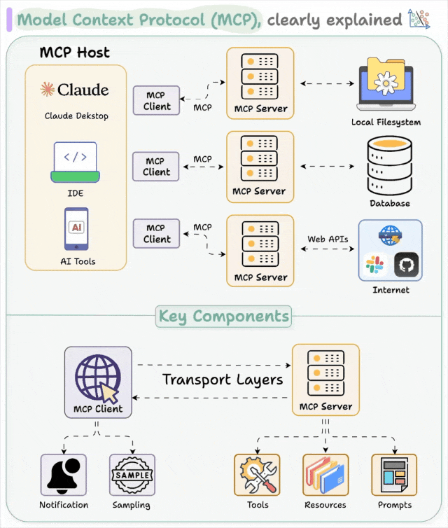

## MCP的定义

MCP，全称 **Model Context Protocol**，中文可译为 **模型上下文协议**。  

它由 Anthropic（Claude） 在 2024 年提出，是一种 **Agent 级系统协议**，目标是让 **大模型（LLM）能够安全、受控地访问外部工具和数据源**。  

- MCP 是一个标准协议，就像给 AI 大模型装了一个 “万能接口”，让 AI 模型能够与不同的数据源和工具进行无缝交互。它就像 USB-C 接口一样，提供了一种标准化的方法，将 AI 模型连接到各种数据源和工具。
- MCP 旨在替换碎片化的 Agent 代码集成，从而使 AI 系统更可靠，更有效。通过建立通用标准，服务商可以基于协议来推出它们自己服务的 AI 能力，从而支持开发者更快的构建更强大的 AI 应用。开发者也不需要重复造轮子，通过开源项目可以建立强大的 AI Agent 生态。
- MCP 可以在不同的应用 / 服务之间保持上下文，从而增强整体自主执行任务的能力。

> [!TIP]
>
> 一句话总结：**MCP 是为 LLM 打造的“USB接口标准”，让它能安全地接上各种外部设备和服务。**

## **MCP架构**

MCP 是基于客户端-服务器的架构，架构图如下所示：

架构包含三个主要组件：

- MCP Host （宿主应用）
- MCP Client （MCP 客户端）
- MCP Server （MCP 服务器）

MCP Host主要是人工智能应用程序（例如，Claude 桌面、集成开发环境），负责管理 MCP 客户端，控制权限、生命周期、安全性和上下文聚合
MCP Clien是Host 内部专门用于与 MCP Server 建立和维持一对一连接的模块。它负责按照 MCP 协议的规范发送请求、接收响应和处理数据。简单来说，MCP Client 是 Host 内部处理 RPC 通信的“代理”，专注于与一个 MCP Server 进行标准化的数据、工具或 prompt 的交换
MCP Server暴露特定的功能并提供数据访问，比如实时获取天气、浏览网页等等能力

## MCP的工作流程

MCP的基本步骤可以概括为 **三段式：注册 -> 调用 -> 控制**。  

1. **服务注册（Service Registration）**  
   外部服务（如 Notion API、SQL数据库、内部CRM）通过 MCP 定义接口，声明自己能做什么（类似“菜单”）。  
   - 例如：`notion.create_page(title, content)`  
   - 或：`database.query("SELECT ...")`  

2. **模型调用（Invocation）**  
   当 LLM 需要完成某个任务时，它不会直接“拍脑袋”执行，而是向 MCP 发出请求：  
   - “我需要调用 `notion.create_page` 来新建日报页面。”  
   MCP 会验证参数是否合法、调用是否安全，然后再把请求转发给实际的服务。  

3. **安全控制（Control & Guardrails）**  
   MCP 不是一个“裸奔接口”，它有一层**安全护栏**：  
   - 权限管理（只能读，不能写？）  
   - 速率限制（防止无限循环请求）  
   - 上下文隔离（不同任务之间的数据不能随意共享）  

## MCP与其他方法

| 技术     | 特点           | 优势                            | 局限                           |
| -------- | -------------- | ------------------------------- | ------------------------------ |
| **RAG**  | 检索增强生成   | 快速接入最新知识，不需重训      | 只能读，不能“操作”外部系统     |
| **微调** | 内化知识       | 响应快，专业性强                | 知识更新成本高，不支持实时调用 |
| **MCP**  | 模型上下文协议 | 允许 LLM 调用外部服务，安全可控 | 架构复杂，依赖生态成熟度       |

- 如果说 RAG 给 AI 配了一个“秘书”，  
- 那么 MCP 就是给 AI 配了一个 **“律师 + 安保团队”**，既能帮它打理对外事务，又能防止它越界。
- **RAG** 解决了“知识缺失”的问题；**微调**解决了“专业化”的问题；**MCP** 解决了“行动落地”的问题

# MCP教程|博文|网址推荐

- CSDN:
  - [MCP是什么，一篇搞懂MCP爆火的其中奥秘！](https://blog.csdn.net/m0_48891301/article/details/147918360?fromshare=blogdetail&sharetype=blogdetail&sharerId=147918360&sharerefer=PC&sharesource=xx_xb&sharefrom=from_link)
  - [什么是MCP和A2A？一文搞懂MCP和A2A，非常详细收藏这一篇就够了_mcp a2a-CSDN博客](https://blog.csdn.net/2401_84204207/article/details/147421954?ops_request_misc=&request_id=&biz_id=102&utm_term=MCP是什么&utm_medium=distribute.pc_search_result.none-task-blog-2~all~sobaiduweb~default-1-147421954.142^v102^control&spm=1018.2226.3001.4187)
  - [MCP协议是什么？MCP入门实战-CSDN博客](https://blog.csdn.net/weixin_73093777/article/details/149002722?ops_request_misc=%7B%22request%5Fid%22%3A%22c4298b172455e9ad2e9b5e3c4283aa92%22%2C%22scm%22%3A%2220140713.130102334..%22%7D&request_id=c4298b172455e9ad2e9b5e3c4283aa92&biz_id=0&utm_medium=distribute.pc_search_result.none-task-blog-2~all~sobaiduend~default-4-149002722-null-null.142^v102^control&utm_term=MCP是什么&spm=1018.2226.3001.4187)

- YouTube：
  - [MCP是啥？技术原理是什么？一个视频搞懂MCP的一切。Windows系统配置MCP，Cursor,Cline 使用MCP](https://www.youtube.com/watch?v=McNRkd5CxFY&t=4s)