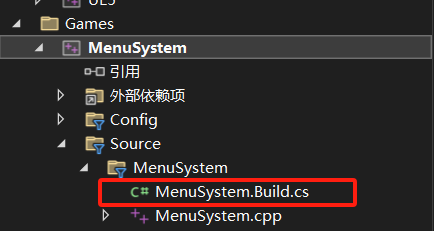
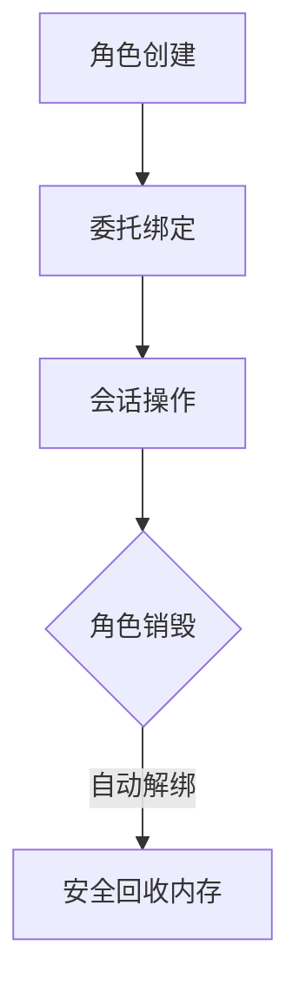
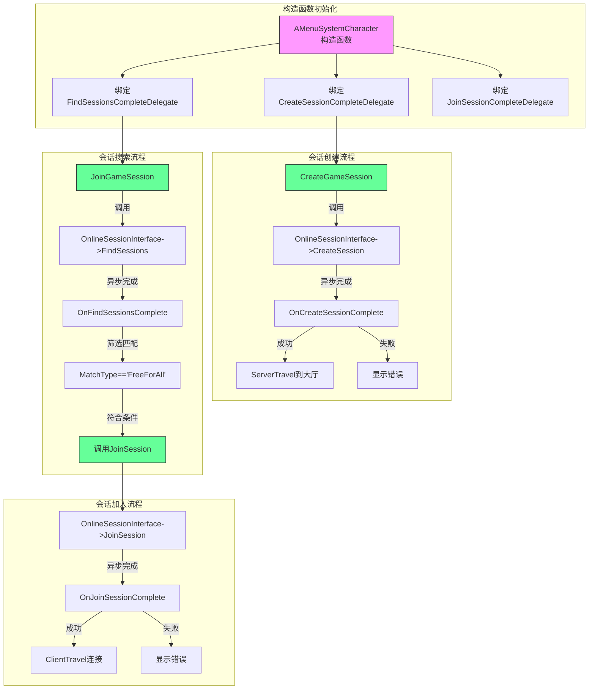
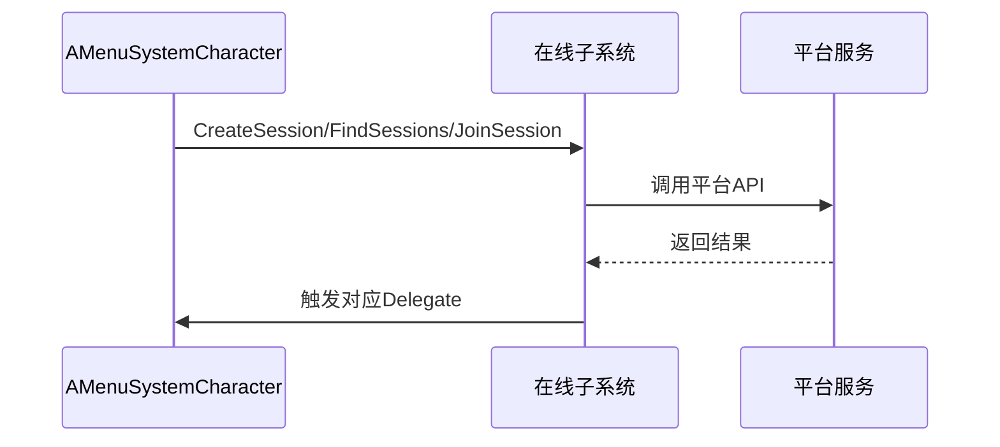
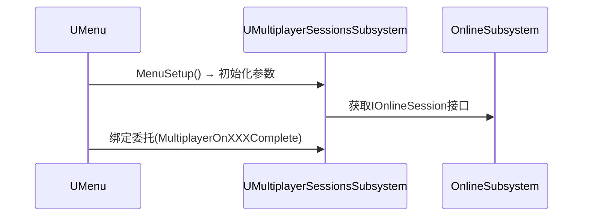
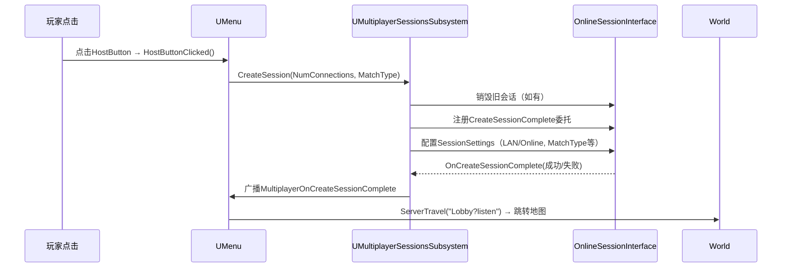
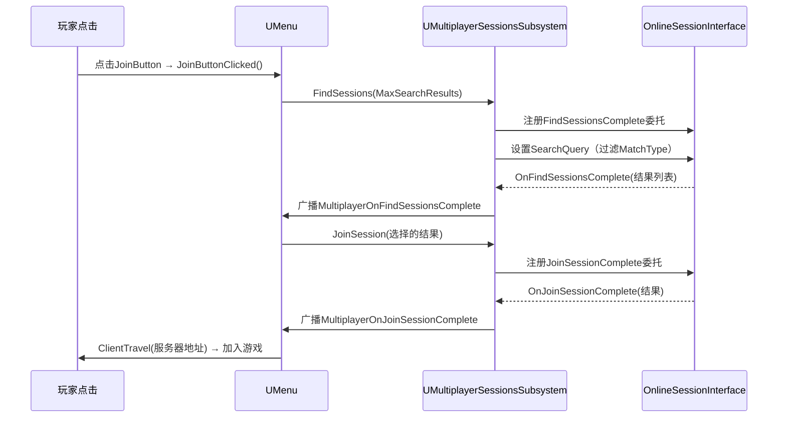

--- 
title: 【MultiplayerCourse】创建多人联机插件
date: 2024-04-19
categories: ["游戏开发", "MultiplayerCourse"]
tags: ["UnrealEngine", "插件", "多人联机", "Steam"]
description: "在UE5中配置Steam在线子系统，需启用插件、修改项目依赖项并编辑配置文件，以实现多人游戏功能。"
cover: "/img/unrealengine.png"
headerImage: "/img/sakura.png"
math: true
--- 

本文记录了在Unreal Engine 5中配置Steam在线子系统的具体步骤，包括启用插件、修改项目依赖项以及编辑配置文件，以实现多人游戏功能。 


此博客为学习油管DruidMech大佬的广域网多人射击游戏的笔记
附上项目GitHub源码地址https://github.com/DruidMech/MultiplayerCourseMenuSystem

## 新建项目

首先使用引擎（5.0及以上）创建一个基于第三人称模板的`.cpp`项目，我这里将其命名为`MenuSystem`.

## Subsystem插件配置

一、在编辑器-插件中打开`Oline Subsystem Steam`插件，然后重启项目。


二、在项目的`Build.cs`下找到一个`PublicDependencyModuleNames`,把插件的配置项`OnlineSubsystemSteam`、`OnlineSubsystem`添加到其中然后编译

```c#
PublicDependencyModuleNames.AddRange(new string[] { "Core", "CoreUObject", "Engine", "InputCore", "HeadMountedDisplay", "EnhancedInput" ,"OnlineSubsystemSteam","OnlineSubsystem"});
```



三、在`项目/config/DefaultEngine.ini`中添加下面代码

```
[/Script/Engine.GameEngine]
	+NetDriverDefinitions=(DefName="GameNetDriver",DriverClassName="OnlineSubsystemSteam.SteamNetDriver",DriverClassNameFallback="OnlineSubsystemUtils.IpNetDriver")
 
	[OnlineSubsystem]
	DefaultPlatformService=Steam
 
	[OnlineSubsystemSteam]
	bEnabled=true
	SteamDevAppId=480
 
	; If using Sessions
	; bInitServerOnClient=true
 
	[/Script/OnlineSubsystemSteam.SteamNetDriver]
	NetConnectionClassName="OnlineSubsystemSteam.SteamNetConnection"
```

注意：

- 此处`SteamDevAppId=480`的ID是一个示范项目(星空)的ID

- 子系统的具体用法和配置参考如下文档[Online Subsystem in Unreal Engine | 虚幻引擎 5.1 文档 | Epic Developer Community](https://dev.epicgames.com/documentation/zh-cn/unreal-engine/online-subsystem-in-unreal-engine?application_version=5.1)

四、删除缓存文件`saved`、`Intermediate`、`Binaries`后然右键`.object`文件重新构建生成项目（`GenerateProject`）,完成配置。

## 访问在线子系统

### 在`Character`类中添加引用

一、修改头文件`Character.h`为其添加管理在线游戏会话的智能指针声明，在类底部写一个新的`public`关键字用于区分系统源码与我们书写的代码

添加如下代码：

```cpp
public:
    TSharedPtr<class IOnlineSession, ESPMode::ThreadSafe> OnlineSessionInterface;
```

修改解释：

`TSharedPtr`:**Unreal Engine 的智能指针**，类似标准库的 `std::shared_ptr`，但针对 UE 的内存管理优化。

`<class IOnlineSession, ESPMode::ThreadSafe>`:

- `IOnlineSession`: 指向的接口类型（UE 在线会话系统的核心接口）。
- `ESPMode::ThreadSafe`: 指定指针的线程安全模式（此处为线程安全版本）。


二、修改`Character.cpp`文件的头文件引用和构造函数

添加头文件：

```cpp
#include "OnlineSubsystem.h"
#include "Interfaces/OnlineSessionInterface.h"
```

找到析构函数在最后面添加：

```cpp
//获取在线子系统实例
IOnlineSubsystem* OnlineSubsystem = IOnlineSubsystem::Get();
if (OnlineSubsystem)
{
    //获取会话接口
    OnlineSessionInterface = OnlineSubsystem->GetSessionInterface();

    if (GEngine)
    {
        //输出的到日志
        GEngine->AddOnScreenDebugMessage(
            -1,   // Key（-1 表示自动生成唯一标识）
            15.f,
            FColor::Blue,
            FString::Printf(TEXT("Found subsystem %s"), *OnlineSubsystem->GetSubsystemName().ToString())
        );
    }
}
```

`CTRL+Shift+B`快捷键编译内容检查是否有错误

> **注意⚠️** 如果编译时出现无法热重载文件的报错，解决方法：
>
> 关闭虚幻编辑器，在文件目录下删除缓存文件`saved`、`Intermediate`、`Binaries`后然右键`.object`文件重新构建生成项目（`GenerateProject`）,打开项目重新编译一般就解决了。

### 打包项目测试

> **注意⚠️** 在测试之前首先需要打开steam，挂在后台就可以。

上面修改的代码编译完成后在之间虚幻编辑器中运行是无法获取子系统的实例的。


将项目打包到`项目/Build/`目录下,再运行可发现，右下角弹出了Steam服务调用的提示，而游戏窗口中的Logger也显示在线子系统返回的服务名称为Steam，证明访问子系统成功。


## 创建与加入会话实现

#### 创建等待关卡

新建一个地图保存在`ThirdPerson/Maps`目录下，命名为`Lobby`.


在项目打包设置中将该地图添加到`PackageMapsList`


#### 对`Character.h`进行修改

在导包处添加

```cpp
#include "Interfaces/OnlineSessionInterface.h"
```

删除之前自己在`public`处写的：
```cpp
TSharedPtr<class IOnlineSession, ESPMode::ThreadSafe> OnlineSessionInterface;
```

修改为：

```cpp
IOnlineSessionPtr OnlineSessionInterface;
```

在下面添加暴露给蓝图的函数以及用于同步事件的委托：
```cpp
protected:
	//暴露给蓝图的创建会话
	UFUNCTION(BlueprintCallable)
	void CreateGameSession();
	//暴露给蓝图的加入会话
	UFUNCTION(BlueprintCallable)
	void JoinGameSession();

	// 会话创建完成回调
	void OnCreateSessionComplete(FName SessionName, bool bWasSuccessful);
	// 会话搜索完成回调
	void OnFindSessionsComplete(bool bWasSuccessful);
	//加入会话完成回调
	void OnJoinSessionComplete(FName SessionName, EOnJoinSessionCompleteResult::Type Result); 

private:
	//下面的委托写法为虚幻OnlineSubsystem特有的委托写法，与虚幻原生的委托并不一样
	FOnCreateSessionCompleteDelegate CreateSessionCompleteDelegate;  // 会话创建完成的委托
	FOnFindSessionsCompleteDelegate FindSessionsCompleteDelegate;    // 会话搜索完成的委托
	TSharedPtr<FOnlineSessionSearch> SessionSearch;                  // 会话搜索参数
	FOnJoinSessionCompleteDelegate JoinSessionCompleteDelegate;		// 会话加入完成委托（OnlineSubsystem专用）
```

#### 对`Character.cpp`进行修改

首先在cpp文件最上面导包的部分用

```cpp
#include "OnlineSessionSettings.h"
```

替换原来的

```cpp
#include "Interfaces/OnlineSessionInterface.h"
```

然后将`AMenuSystemCharacter类`头的部分修改为:

```
AMenuSystemCharacter::AMenuSystemCharacter():
	CreateSessionCompleteDelegate(FOnCreateSessionCompleteDelegate::CreateUObject(this, &ThisClass::OnCreateSessionComplete)),
    FindSessionsCompleteDelegate(FOnFindSessionsCompleteDelegate::CreateUObject(this, &ThisClass::OnFindSessionsComplete)),
 	JoinSessionCompleteDelegate(FOnJoinSessionCompleteDelegate::CreateUObject(this, &ThisClass::OnJoinSessionComplete))
{
    // 构造函数主体...
}
```

这是一种虚幻引擎中**委托绑定**的高级用法

1. **成员初始化列表绑定**：在对象构造阶段直接绑定委托
2. **`CreateUObject` 方法**：虚幻提供的安全绑定工具
3. **`ThisClass` 用法**：避免硬编码类名，增强可维护性

其流程如下图所示：



 在`.cpp`文件中实现`.h`文件中定义过的函数与回调函数：

##### 实现`CreateSession`功能：

`CreateGameSession`函数实现：

```cpp
void AMenuSystemCharacter::CreateGameSession()
{
    // 当按下1键时调用此函数（创建游戏会话）

    // 检查在线会话接口是否有效
    if (!OnlineSessionInterface.IsValid())
    {
        // 如果接口无效（可能网络未连接或在线子系统未初始化）
        UE_LOG(LogTemp, Warning, TEXT("OnlineSessionInterface is invalid!"));
        return;
    }

    // 检查是否已存在同名游戏会话
    auto ExistingSession = OnlineSessionInterface->GetNamedSession(NAME_GameSession);
    if (ExistingSession != nullptr)
    {
        // 销毁已有会话（避免冲突）
        OnlineSessionInterface->DestroySession(NAME_GameSession);
        // 注意：实际项目应等待DestroySession完成回调后再创建新会话
        UE_LOG(LogTemp, Log, TEXT("Existing session destroyed"));
    }

    // 绑定会话创建完成委托（已在构造函数初始化）
    OnlineSessionInterface->AddOnCreateSessionCompleteDelegate_Handle(CreateSessionCompleteDelegate);

    // 配置会话参数
    TSharedPtr<FOnlineSessionSettings> SessionSettings = MakeShareable(new FOnlineSessionSettings());
    SessionSettings->bIsLANMatch = false;            // 互联网连接
    SessionSettings->NumPublicConnections = 4;       // 最大4名玩家
    SessionSettings->bAllowJoinInProgress = true;    // 允许中途加入
    SessionSettings->bAllowJoinViaPresence = true;  // 允许通过好友加入
    SessionSettings->bShouldAdvertise = true;       // 公开会话
    SessionSettings->bUsesPresence = true;          // 使用平台在线状态

    // 设置自定义匹配类型（用于筛选特定游戏模式）
    SessionSettings->Set(
        FName("MatchType"),
        FString("FreeForAll"),
        EOnlineDataAdvertisementType::ViaOnlineServiceAndPing
    );

    // 获取本地玩家网络ID并创建会话
    if (const ULocalPlayer* LocalPlayer = GetWorld()->GetFirstLocalPlayerFromController())
    {
        OnlineSessionInterface->CreateSession(
            *LocalPlayer->GetPreferredUniqueNetId(),  // 玩家唯一ID
            NAME_GameSession,                         // 会话名称
            *SessionSettings                         // 会话配置
        );
        UE_LOG(LogTemp, Log, TEXT("Session creation requested"));
    }
}
```

回调`OnCreateSessionComplete`函数实现：

```cpp
void AMenuSystemCharacter::OnCreateSessionComplete(FName SessionName, bool bWasSuccessful)
{
    // 会话创建完成回调
    if (bWasSuccessful)
    {
        // 成功时跳转至大厅地图
        if (GEngine)
        {
            GEngine->AddOnScreenDebugMessage(
                -1, 15.f, FColor::Blue,
                FString::Printf(TEXT("Session created: %s"), *SessionName.ToString())
            );
        }

        // 服务器端地图跳转（?listen表示作为监听服务器）
        if (UWorld* World = GetWorld())
        {
            World->ServerTravel("/Game/ThirdPerson/Maps/Lobby?listen");
        }
    }
    else
    {
        // 失败处理
        if (GEngine)
        {
            GEngine->AddOnScreenDebugMessage(
                -1, 15.f, FColor::Red,
                TEXT("Failed to create session!")
            );
        }
    }
}
```

##### 实现`JoinSession`功能：

`JoinGameSession`函数：

```cpp
void AMenuSystemCharacter::JoinGameSession()
{
    // 当玩家请求加入游戏时调用

    if (!OnlineSessionInterface.IsValid())
    {
        UE_LOG(LogTemp, Warning, TEXT("OnlineSessionInterface is invalid!"));
        return;
    }

    // 绑定会话搜索完成委托
    OnlineSessionInterface->AddOnFindSessionsCompleteDelegate_Handle(FindSessionsCompleteDelegate);

    // 配置搜索条件
    SessionSearch = MakeShareable(new FOnlineSessionSearch());
    SessionSearch->MaxSearchResults = 100;          // 最大搜索结果数
    SessionSearch->bIsLanQuery = false;             // 仅搜索互联网会话

    // 设置必须支持Presence（确保找到的是好友/公开会话）
    SessionSearch->QuerySettings.Set(
        SEARCH_PRESENCE,
        true,
        EOnlineComparisonOp::Equals
    );

    // 开始搜索会话
    if (const ULocalPlayer* LocalPlayer = GetWorld()->GetFirstLocalPlayerFromController())
    {
        OnlineSessionInterface->FindSessions(
            *LocalPlayer->GetPreferredUniqueNetId(),
            SessionSearch.ToSharedRef()
        );
        UE_LOG(LogTemp, Log, TEXT("Session search started"));
    }
}
```

回调函数`OnFindSessionsComplet`:

```cpp
void AMenuSystemCharacter::OnFindSessionsComplete(bool bWasSuccessful)
{
    // 会话搜索完成回调

    if (!OnlineSessionInterface.IsValid() || !SessionSearch.IsValid())
    {
        return;
    }

    // 遍历所有搜索结果
    for (const FOnlineSessionSearchResult& Result : SessionSearch->SearchResults)
    {
        // 提取会话信息
        FString MatchType;
        Result.Session.SessionSettings.Get("MatchType", MatchType);

        // 只加入匹配类型的会话
        if (MatchType == "FreeForAll")
        {
            // 绑定加入会话完成委托
            OnlineSessionInterface->AddOnJoinSessionCompleteDelegate_Handle(JoinSessionCompleteDelegate);

            // 发起加入请求
            if (const ULocalPlayer* LocalPlayer = GetWorld()->GetFirstLocalPlayerFromController())
            {
                OnlineSessionInterface->JoinSession(
                    *LocalPlayer->GetPreferredUniqueNetId(),
                    NAME_GameSession,
                    Result
                );
                break; // 只加入第一个匹配的会话
            }
        }
    }
}
```

回调函数`OnJoinSessionComplete`

```cpp
void AMenuSystemCharacter::OnJoinSessionComplete(FName SessionName, EOnJoinSessionCompleteResult::Type Result)
{
    // 加入会话完成回调

    if (Result != EOnJoinSessionCompleteResult::Success)
    {
        UE_LOG(LogTemp, Warning, TEXT("Join session failed with code: %d"), Result);
        return;
    }

    // 获取服务器连接地址
    FString ConnectString;
    if (OnlineSessionInterface->GetResolvedConnectString(NAME_GameSession, ConnectString))
    {
        // 客户端跳转到目标服务器
        if (APlayerController* PlayerController = GetGameInstance()->GetFirstLocalPlayerController())
        {
            PlayerController->ClientTravel(ConnectString, TRAVEL_Absolute);
        }
    }
}
```

几个函数的调用逻辑：



异步调用流程图：




在角色蓝图中调用`.cpp`文件中写好的函数：


打包测试：

> **注意**⚠️ 如果报了`Fail to create a session`的错误
>
> 去`config/DefaultEngine.ini`中添加一句`bInitServerOnClient=true`
>
> 重新保存打包测试


> **注意**⚠️ 如果报了`Fail to Find a session`的错误
>
> 确认网络没有问题，在`CreateGameSession`函数中`SessionSettings`部分添加一句  
>
> ```cpp
> SessionSettings->bUseLobbiesIfAvailable = true;
> ```

> **注意**⚠️ 如果报成功创建Session，但是一直find不到，检查一下两台主机的Steam下载地区是否相同


## 创建插件

`new`一个`Blank`模板的`Plugin`，将其命名为`MultiplayerSessions`，在内容浏览界面打开`Show Plugin Content`


进入VS界面`ReloadAll`重新加载全部，查看插件模块，`Ctrl+Shift+B`编译


编译完成后在`MultiplayerSession.uplugin`和`MultiplayerSessions.Build.cs`中添加开发插件需要的插件和模组：

在`MultiplayerSession.uplugin`添加在线子系统插件，并设置为`Enabled`为`true`

```json
	"Plugins": [
 		{
 			"Name": "OnlineSubsystem",
 			"Enabled": true
 		},
 		{
 			"Name": "OnlineSubsystemSteam",
 			"Enabled": true
 		}
 	]
```

中`MultiplayerSessions.Build.cs`中添加编译需要的ModuleName

```c#
PublicDependencyModuleNames.AddRange(
 			new string[]
 			{
 				"Core",
 				"OnlineSubsystem",
 				"OnlineSubsystemSteam",
 				// ... add other public dependencies that you statically link with here ...
 			}
 			);
```

重新编译即可

### 子系统类

#### 创建子系统类

在`C++Classes\MenuSystem\`路径下创建一个继承自`UGameInstanceSubsystem`的`cpp`类，创建在`MutiplayerSession`模块中这里我将他命名为`MultiplayerSessionsSubsystem`,注意这里多加了个s,当初找了好久这个问题.


为新创建的类添加变量和实现构造函数:

`.h`文件中,在类定义中添加构造函数和会话接口指针声明:

```cpp

public:
 	UMultiplayerSessionsSubsystem();
 protected:
 
 private:
 	IOnlineSessionPtr SessionInterface;
```

`.cpp`文件中实现构造函数:

```cpp
#include "OnlineSubsystem.h"

UMultiplayerSessionsSubsystem::UMultiplayerSessionsSubsystem()
 {
 	IOnlineSubsystem* Subsystem = IOnlineSubsystem::Get();
 	if (Subsystem)
 	{
 		SessionInterface = Subsystem->GetSessionInterface();
 	}
 }
```

删除缓存文件（包括项目下的和`Plugin`中的），重新生成`vsproject`

> 这里有一个容易触发的抽象错误,虚幻Class中的`GENERATED_BODY()`报红.
>
> 这个问题是由于VS和虚幻的兼容性引起的,解决方法就是把头文件处的无用的缩进和空行都删掉.

#### 委托与回调函数声明

先将需求的功能在类中进行声明:

`.h`文件中`public`部分添加功能函数:

```cpp
void CreateSession(int32 NumPublicConnections, FString MatchType);
void FindSessions(int32 MaxSearchResults);
void JoinSession(const FOnlineSessionSearchResult& SessionResult);
void DestroySession();
void StartSession();
```

`.h`文件中`private`部分添加如下委托和委托句柄:

**委托句柄的作用**:通过保存句柄，确保在合适的时机（如对象销毁时）清理委托，避免内存泄漏或无效回调。

- 直接保存 `FDelegateHandle` 比手动管理委托更安全，尤其是涉及异步操作时。
- 虚幻引擎的委托系统允许动态绑定/解绑函数到事件。

```cpp
FOnCreateSessionCompleteDelegate CreateSessionCompleteDelegate;
FDelegateHandle CreateSessionCompleteDelegateHandle;
FOnFindSessionsCompleteDelegate FindSessionsCompleteDelegate;
FDelegateHandle FindSessionsCompleteDelegateHandle;
FOnJoinSessionCompleteDelegate JoinSessionCompleteDelegate;
FDelegateHandle JoinSessionCompleteDelegateHandle;
FOnDestroySessionCompleteDelegate DestroySessionCompleteDelegate;
FDelegateHandle DestroySessionCompleteDelegateHandle;
FOnStartSessionCompleteDelegate StartSessionCompleteDelegate;
FDelegateHandle StartSessionCompleteDelegateHandle;
```

`.h`文件中`protected`部分添加上面委托的的回调函数:

```cpp
void OnCreateSessionComplete(FName SessionName, bool bWasSuccessful);
void OnFindSessionsComplete(bool bWasSuccessful);
void OnJoinSessionComplete(FName SessionName, EOnJoinSessionCompleteResult::Type Result);
void OnDestroySessionComplete(FName SessionName, bool bWasSuccessful);
void OnStartSessionComplete(FName SessionName, bool bWasSuccessful);
```

`.cpp`文件中使用之前说过的委托绑定的高级用法:

上面定义的功能函数和回调后续再实现.

```cpp
UMultiplayerSessionsSubsystem::UMultiplayerSessionsSubsystem():
 	CreateSessionCompleteDelegate(FOnCreateSessionCompleteDelegate::CreateUObject(this, &ThisClass::OnCreateSessionComplete)),
 	FindSessionsCompleteDelegate(FOnFindSessionsCompleteDelegate::CreateUObject(this, &ThisClass::OnFindSessionsComplete)),
 	JoinSessionCompleteDelegate(FOnJoinSessionCompleteDelegate::CreateUObject(this, &ThisClass::OnJoinSessionComplete)),
 	DestroySessionCompleteDelegate(FOnDestroySessionCompleteDelegate::CreateUObject(this, &ThisClass::OnDestroySessionComplete)),
 	StartSessionCompleteDelegate(FOnStartSessionCompleteDelegate::CreateUObject(this, &ThisClass::OnStartSessionComplete))
 {
        //类定义主体
}
```

### 菜单类

#### 创建菜单

在`C++Class\Public`文件夹下创建一个基于`UUserWidget`的类,这里我将它命名为`Menu`

在`Build.cs`中添加用户控件需要的模块:

```c#
PublicDependencyModuleNames.AddRange(
             new string[]
             {
                "Core",
                "OnlineSubsystem",
                "OnlineSubsystemSteam",
                 "UMG",
                "Slate",
                 "SlateCore"
                 // ... add other public dependencies that you statically link with here ...
            }
            );
```

为Menu添加预设:

`Menu.h`文件:

```cpp
class MULTIPLAYERSESSIONS_API UMenu : public UUserWidget
{
	GENERATED_BODY()
	
public:
	UFUNCTION(BlueprintCallable)
	void MenuSetup();
};
```

`Menu.cpp`文件,`Setup`函数用于将控件添加到视口以及设置交互形式:

```cpp
void UMenu::MenuSetup()
{
    AddToViewport();
    SetVisibility(ESlateVisibility::Visible);
    bIsFocusable = true;

    UWorld* World = GetWorld();
    if (World)
    {
        APlayerController* PlayerController = World->GetFirstPlayerController();
        if (PlayerController)
        {
            FInputModeUIOnly InputModeData;
            InputModeData.SetWidgetToFocus(TakeWidget());
            InputModeData.SetLockMouseToViewportBehavior(EMouseLockMode::DoNotLock);
            PlayerController->SetInputMode(InputModeData);
            PlayerController->SetShowMouseCursor(true);
        }
    }
}
```

基于`Menu.cpp`类创建用户控件,命名为`WBP_Menu`,创建两个`Button`,并设置他的父类为`Menu`


将用户控件添加到视口便于测试:


#### 添加基本交互

为`Menu.h`添加声明

`public`部分添加暴露给蓝图的创建函数,参数为`房间人数`和`比赛类型`:

```cpp
UFUNCTION(BlueprintCallable)
void MenuSetup(int32 NumberOfPublicConnections = 4, FString TypeOfMatch = FString(TEXT("FreeForAll")));
```


`protected`部分添加虚函数重载.

```cpp
virtual bool Initialize() override;
virtual void NativeDestruct() override;
```

`Initialize()` 是一个初始化函数，通常用于：

- 执行对象创建后的必要设置（如分配资源、加载数据、绑定委托等）。
- 返回 `bool` 表示初始化是否成功（`true`=成功，`false`=失败，可能触发错误处理）。

- 在虚幻引擎中，许多核心类（如 `UObject`、`AGameMode`、`UGameInstance`）或其派生类会通过 `Initialize()`

`NativeDestruct()` 是 `UUserWidget`（用户控件）提供的一个 **关键生命周期虚函数**(析构函数)，用于 **处理控件的销毁逻辑**。

- **调用时机**：
  当 `UUserWidget` 被 ​**显式移除（`RemoveFromParent`）​**​ 或 ​**其所属的 `UWorld` 销毁时**​（如关卡切换、游戏退出），引擎会自动调用此函数。
  - **类比**：类似于 Actor 的 `EndPlay()` 或 C++ 对象的析构函数。
- **核心用途**：
  - **释放资源**：清理绑定的动态委托（如按钮点击事件）、断开外部引用、销毁子控件等。
  - **防止内存泄漏**：确保所有手动绑定的回调（如 `UWorld` 事件）被正确解绑。

`private`部分声明`UButton`变量并将其绑定到`Widget`,声明点击事件,

```cpp
UPROPERTY(meta = (BindWidget))
class UButton* HostButton;

UPROPERTY(meta = (BindWidget))
UButton* JoinButton;

UFUNCTION()
void HostButtonClicked();

UFUNCTION()
void JoinButtonClicked();

//用于切换关卡时去除UI,恢复为WASD按键交互
void MenuTearDown();

// The subsystem designed to handle all online session functionality
class UMultiplayerSessionsSubsystem* MultiplayerSessionsSubsystem;
//定义用于设置创建房间的信息,并设置默认值
int32 NumPublicConnections{4};
FString MatchType{ TEXT("FreeForAll") };
```

> **注意**⚠️:
>
> C++文件中使用了`BindWidget`后,用户控件的相应名称必须与变量相同,否则可能引起引擎崩溃.

在`Menu.cpp`中实现初始化函数为按钮绑定事件函数,绑定事件,以及去除`UI`的逻辑:

```cpp
bool UMenu::Initialize()
{
    if (!Super::Initialize())
    {
        return false;
    }

    if (HostButton)
    {
        HostButton->OnClicked.AddDynamic(this, &ThisClass::HostButtonClicked);
    }
    if (JoinButton)
    {
        JoinButton->OnClicked.AddDynamic(this, &ThisClass::JoinButtonClicked);
    }

    return true;
}

void UMenu::NativeDestruct()
{
    MenuTearDown();
    Super::NativeDestruct();
}
//用于去除用户控件,恢复操作
void UMenu::MenuTearDown()
{
    RemoveFromParent();
    UWorld* World = GetWorld();
    if (World)
    {
        APlayerController* PlayerController = World->GetFirstPlayerController();
        if (PlayerController)
        {
            FInputModeGameOnly InputModeData;
            PlayerController->SetInputMode(InputModeData);
            PlayerController->SetShowMouseCursor(false);
        }
    }
}
```

添加需要的头文件:

```cpp
#include "Menu.h"
#include "Components/Button.h"
#include "MultiplayerSessionsSubsystem.h"
```

#### 子系统与UI交互

这部分的代码量比较大,但是基本是和之前的Character部分写的类似,画几张流程图梳理一下:

**初始化阶段**:



**创建会话（Host）**:



**加入会话（Join）**:



### 销毁逻辑与按钮禁用

`UMultiplayerSessionsSubsystem`中添加几个变量用于存储销毁和按钮的变量:

```cpp
   //添加用于销毁会话后重新创建的存储变量
   bool bCreateSessionOnDestroy{ false };
   int32 LastNumPublicConnections;
   FString LastMatchType;
```

在find失败/join失败的时候启用按钮,其余情况禁用.

### 退出菜单


在之前写的`WBP_Menu`中添加一个退出按钮,由于此处逻辑过于简单了,直接写在蓝图中即可:

