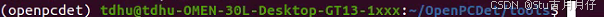
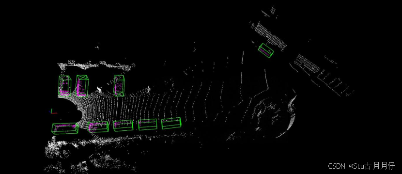

--- 
title: 【OpenPCDet】详细部署与复现
date: 2024-10-25T00:00:00+08:00
categories: ["3DComputerVison"]
tags: ["OpenPCDet", "环境配置"]
description: "本文详细介绍了在Ubuntu 20.04系统上配置OpenPCDet 3D目标检测工具箱的完整流程，涵盖创建虚拟环境、安装PyTorch与spconv等关键依赖，并最终完成编译和数据导入。"
cover: "/img/pointcloud.png"
headerImage: "/img/linpory.png"
math: true
--- 

本文详细介绍了在Ubuntu 20.04系统上配置OpenPCDet 3D目标检测工具箱的完整流程，涵盖创建虚拟环境、安装PyTorch与spconv等关键依赖，并最终完成编译和数据导入。 


### OpenPCDet简介
OpenPCDet是一个用于3D目标检测的开源工具箱，它提供了多种数据集的加载器，支持多种模型，并且易于扩展。

### 本人使用硬件与环境
Linux操作系统（Ubuntu20.04）
Python环境（Anaconda下独立创建）
CPU: 11th Gen Intel® Core™ i9-11900K @ 3.50GHz × 16 
GPU: NVIDIA GeForce RTX 3090
cuda：11.3

### 配置步骤
#### 创建虚拟环境
```shell
conda create -n pcdet python=3.8   
```
#### 激活进入虚拟环境
```shell
conda activate pcdet
```
#### 安装pytorch
查看cuda版本
```shell
 nvcc -V  
```
查看运行结果


查看对应版本下载命令行
**https://pytorch.org/get-started/previous-versions/**
可以使用pip或conda 下载安装，本人选择conda

```shell
conda install pytorch==1.12.1 torchvision==0.13.1 torchaudio==0.12.1 cudatoolkit=11.3 -c pytorch 
```

安装完成后验证
```shell
python
import torch
torch.cuda.is_available()
```
若返回True，则证明安装成功
退出python
```shell
quit()
```
#### 安装对应的spconv
根据自己服务器的cuda版本查找对应的spconv版本
https://gitcode.com/gh_mirrors/sp/spconv?utm_source=csdn_github_accelerator&isLogin=1
```shell
pip install spconv-cu113
```
验证spconv是否安装成功
```shell
python
import spconv
```
没有报错则安装成功

#### 下载安装OpenPCDet 


下载后进入OpenPCDet文件夹中
```shell
cd OpenPCDet
```
注意此时要在自己创造的环境中打开该文件夹


安装OpenPCDet所需环境
```shell
pip install -r requirements.txt
```
运行以上命令行可以一键安装，需要注意的是由于之前已经安装过pytorch，将该文件中pytorch相关的注释掉


由于pip安装速度太慢，我选择了conda安装
打开该txt文件，对应相关的包conda安装。
安装需要的包后就可以安装OpenPCDet库了
```shell
python setup.py develop
```
安装中报错基本是缺少相应的包或者包的版本过新了，把该包remove,选择一个更低版本的包安装基本就可以解决问题。
运行setup文件无报错后就可以导入数据复现结果了！

### 导入数据集
这里我使用的是Kitti公开数据集，可以从官网下载[The KITTI Vision Benchmark Suite](https://link.zhihu.com/?target=https%3A//www.cvlibs.net/datasets/kitti/)
附一个网盘链接：KITTI链接: [https://pan.baidu.com/s/1EaWsLH_ZcGGUDoDfZNEGAA?pwd=3acs](https://link.zhihu.com/?target=https%3A//pan.baidu.com/s/1EaWsLH_ZcGGUDoDfZNEGAA%3Fpwd%3D3acs) 提取码: 3acs

下载完成后将数据导入OpenPCDet中


将数据导入为以下格式


之后运行以下代码生成相应的数据集配置文件
```shell
python -m pcdet.datasets.kitti.kitti_dataset create_kitti_infos tools/cfgs/dataset_configs/kitti_dataset.yaml
```
生成了以下配置文件


### 模型训练
#### 进入配置文件夹
```shell
cd tools
```
model zoo 几个模型的训练示例
>如果运行pointpillars，则输入以下命令
python train.py --cfg_file cfgs/kitti_models/pointpillar.yaml
如果运行pointrcnn，则输入以下命令
python train.py --cfg_file cfgs/kitti_models/pointrcnn.yaml
如果运行second，则输入以下命令
python train.py --cfg_file cfgs/kitti_models/second.yaml

#### 训练报错解决
训练过程中如果报以下相关错误：KeyError: ‘road_plane‘
>/home/pc/OpenPCDet/tools/cfgs/kitti_models/pointpillar.yaml
/home/pc/OpenPCDet/tools/cfgs/dataset_configs/kitti_dataset.yaml

则在以上两个文件中修改内容


将此处的True修改为False

训练中可以使用以下命令监测GPU的使用情况
```shell
watch -n 0.5 nvidia-smi
```


#### 训练结果
训练完成后，会生成相应的训练文件，位于文件
>/home/OpenPCDet/output/kitti_models/pointrcnn/default


可以在训练日志train 2024xxxxxxxx.log中查看本次模型的训练精度


#### 结果可视化
训练成功后可运行以下命令进行结果可视化
```shell
python demo.py --cfg_file cfgs/kitti_models/pointrcnn.yaml --data_path ../data/kitti/testing/velodyne/000005.bin --ckpt ../output/kitti_models/pointrcnn/default/ckpt/checkpoint_epoch_80.pth
```



如果报错提示缺少包open3d 和mayavi，则选择其中一个下载导入就行，实测open3d比mayavi好用，运行下面命令下载open3d(清华源)
```shell
pip install open3d -i https://pypi.tuna.tsinghua.edu.cn/simple
```
对训练过程中的损失函数等可视化可以运行下面命令
```shell
tensorboard --logdir="/home/OpenPCDet/output/kitti_models/pointrcnn/default/tensorboard"
```
会输出以下结果
>TensorFlow installation not found - running with reduced feature set.
Serving TensorBoard on localhost; to expose to the network, use a proxy or pass --bind_all
TensorBoard 2.12.0 at http://localhost:6006/ (Press CTRL+C to quit)

之后在网页上打开该网址即可查看可视化结果


至此OpenPCDet的部署和复现完毕。

参考博客：
https://zhuanlan.zhihu.com/p/2835189199
https://zhuanlan.zhihu.com/p/685759829
https://blog.csdn.net/jin15203846657/article/details/122735375?spm=1001.2014.3001.5506
https://blog.csdn.net/qq_30653631/article/details/107620137