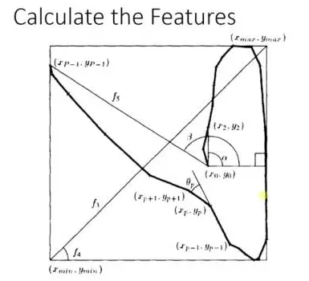

--- 
title: 【机器学习】基础知识总结
date: 2023-10-30T00:00:00+08:00
categories: ["机器学习"]
tags: ["人工智能", "机器学习", "基础算法", "贝叶斯", "回归树", "SVM"]
description: "本文为机器学习复习资料，适合已有基础的学习者快速回顾。内容涵盖机器学习的定义，并重点梳理了有监督学习、无监督学习、半监督学习和强化学习的主要算法类型及其典型应用场景。"
cover: "/img/machinelearning.png"
headerImage: "/img/rthykless.png"
math: true
--- 

本文为机器学习复习资料，适合已有基础的学习者快速回顾。内容涵盖机器学习的定义，并重点梳理了有监督学习、无监督学习、半监督学习和强化学习的主要算法类型及其典型应用场景。 


最近在复习专业课时，发现去年上过的**机器学习**的内容几乎已经都还给老师了（悲~），再去刷一遍课程的时间成本太高，所以就结合我去年画的思维导图和期末复习总结的一些资料汇总复习一下，内容有些来自公众号，有些来自老学长的圣遗物，有些是CSDN上看的。由于时间太长无法一一标明出处了，如果有侵权记得私信提醒我哈。

本文适合对机器学习已经有过学习和了解，准备期末突击/定时复习一下的同学，**如果你对机器学习尚无了解，推荐你先去看吴恩达老师的Machine Learning课程，一定会让你受益匪浅。**下附老师的课程地址(B站)。

[高清重置版-吴恩达机器学习](【【高清重制】2025年公认最好的【吴恩达机器学习课程】附课件、代码及实战项目！！！--人工智能/机器学习/深度学习】 https://www.bilibili.com/video/BV1owrpYKEtP/?p=145&share_source=copy_web&vd_source=a06df7b174b0e55e45242729b8ce1758)

## 一、什么是机器学习？

百度解释是：机器学习是人工智能的一个分支，它使计算机系统能够从数据中学习并做出决策或预测，而无需进行明确的编程。简单来说，机器学习涉及到开发算法和统计模型，这些模型可以对输入数据进行分析，以预测结果或行为。

讲人话就是**现在有一个数据集，你要通过这个数据集找出一个函数/方法让分析数据，对数据做预测。所以机器学习=找function。**

## 二、机器学习算法类型

### 1.有监督学习（**Supervised Learning**）

有监督学习通常是**利用带有标签（tags）的训练数据（labeled data）**，学习一个从输入变量X到输入变量Y的函数映射。 

公式为：

y=f(x) 

利用有监督学习解决的问题大致上可以被分为两类：

**分类问题：预测某一样本所属的类别（离散的）。**比如给定一个人（从数据的角度来说，是给出一个人的数据结构，包括：身高，年龄，体重等信息），然后判断是性别，或者是否健康。

**回归问题：预测某一样本的所对应的实数输出（连续的）。**比如预测某一地区人的平均身高。

常见的有监督学习算法：线性回归，逻辑回归，分类回归树，朴素贝叶斯，K最近邻算法等。

除此之外，集成学习也是一种有监督学习。它是将多个不同的相对较弱的机器学习模型的预测组合起来，用来预测新的样本。如随机森林装袋法，和XGBoost算法。

### 2.无监督学习(Unsupervised Learning)

  无监督学习问题处理的是**只有输入变量X没有相应输出变量的训练数据。它利用没有专家标注训练数据(unlabeled data)**，对数据的结构建模。

可以利用无监督学习解决的问题，大致分为四类：

**关联分析：发现不同事物之间同时出现的概率。**在购物篮分析中被广泛地应用。比如经典的发现买牛奶的男客户有百分之八十的概率买啤酒。

**聚类问题：将相似的样本划分为一个簇（cluster）。**与分类问题不同，聚类问题预先并不知道类别，自然训练数据也没有类别的标签。

**维度约减(数据降维)**：顾名思义，**维度约减是指减少数据的维度同时保证不丢失有意义的信息。**利用特征提取方法和特征选择方法，可以达到维度约减的效果。特征选择是指选择原始变量的子集。特征提取是将数据从高纬度转换到低纬度。广为熟知的主成分分析算法就是特征提取的方法。

**异常检测：**暂时想不出例子来，知道有这个就行

Apriori算法，K-means算法，PCA主成分分析，都属于无监督学习。

### 3. **半监督学习（Semi-supervised Learning）**

这是监督学习和无监督学习的结合，使用少量标记数据和大量未标记数据。

### 4.**强化学习（Reinforcement Learning）**

 通过学习可以获得最大回报的行为，强化学习可以让agent（个体）根据自己当前的状态，来决定下一步采取的动作。

强化学习算法通过反复试验来学习最优的动作。这类算法在机器人学中被广泛应用。在与障碍物碰撞后，机器人通过传感收到负面的反馈从而学会去避免碰撞。

## 三、常见概念和疑问

### 1.常见机器学习算法概念简介：

1、监督学习（SupervisedLearning）：有类别标签的学习，基于训练样本的输入、输出训练得到最优模型，再使用该模型预测新输入的输出；

代表算法：决策树、朴素贝叶斯、逻辑回归、KNN、SVM、神经网络、随机森林、AdaBoost、遗传算法；

2、半监督学习（Semi-supervisedLearning）：同时使用大量的未标记数据和标记数据，进行模式识别工作；

代表算法：self-training(自训练算法)、generative models生成模型、SVMs半监督支持向量机、graph-basedmethods图论方法、 multiviewlearing多视角算法等；

3、无监督学习（UnsupervisedLearning）：无类别标签的学习，只给定样本的输入，自动从中寻找潜在的类别规则；代表算法：主成分分析方法PCA等，等距映射方法、局部线性嵌入方法、拉普拉斯特征映射方法、黑塞局部线性嵌入方法、局部切空间排列方法等；

4、HOG特征：全称Histogram of Oriented Gradient（方向梯度直方图），由图像的局部区域梯度方向直方图构成特征；

5、LBP特征：全称Local Binary Pattern（局部二值模式），通过比较中心与邻域像素灰度值构成图像局部纹理特征；

6、Haar特征：描述图像的灰度变化，由各模块的像素差值构成特征；

7、核函数（Kernels）：从低维空间到高维空间的映射，把低维空间中线性不可分的两类点变成线性可分的；

8、**SVM：全称Support Vector Machine（支持向量机）** 在特征空间上找到最佳的超平面使训练集正负样本的间隔最大；是解决二分类问题的有监督学习算法，引入核方法后也可用来解决非线性问题；

9、Adaboost：全称Adaptive Boosting（自适应增强），对同一个训练集训练不同的弱分类器，把这些弱分类器集合起来，构成一个更强的强分类器；

10、**决策树算法（Decision Tree）**：处理训练数据，构建决策树模型，再对新数据进行分类；

11、随机森林算法（Random Forest）：使用基本单元（决策树），通过集成学习将多棵树集成；

12、朴素贝叶斯（Naive Bayes）：根据事件的先验知识描述事件的概率，对联合概率建模来获得目标概率值；

13、**神经网络（Neural Networks）**：模仿动物神经网络行为特征，将许多个单一“神经元”联结在一起，通过调整内部大量节点之间相互连接的关系，进行分布式并行信息处理。

### 2.其余理论知识概念

**偏差:**偏差度量了模型的期望预测与真实结果的偏离程度， 即刻画了学习算法本身的拟合能力。偏差则表现为在特定分布上的适应能力，偏差越大越偏离真实值。

**方差:**方差度量了同样大小的训练集的变动所导致的学习性能的变化， 即刻画了数据扰动所造成的影响。方差越大，说明数据分布越分散。

**噪声:**噪声表达了在当前任务上任何模型所能达到的期望泛化误差的下界， 即刻画了学习问题本身的难度 。


泛化误差、偏差、方差和模型复杂度的关系（图片来源百面机器学习）

**Q2.什么是过拟合和欠拟合，为什么会出现这个现象？**

过拟合指的是在训练数据集上表现良好，而在未知数据上表现差。

欠拟合指的是模型没有很好地学习到数据特征，不能够很好地拟合数据，在训练数据和未知数据上表现都很差。如图所示：


过拟合的原因在于**：**

1. 参数太多，模型复杂度过高；
2. 建模样本选取有误，导致选取的样本数据不足以代表预定的分类规则；
3. 样本噪音干扰过大，使得机器将部分噪音认为是特征从而扰乱了预设的分类规则；
4. 假设的模型无法合理存在，或者说是假设成立的条件实际并不成立。

欠拟合的原因在于：

1. 特征量过少
2. 模型复杂度过低

**Q3.怎么解决欠拟合？**

1. 增加新特征，可以考虑加入进特征组合、高次特征，来增大假设空间；
2. 添加多项式特征，这个在机器学习算法里面用的很普遍，例如将线性模型通过添加二次项或者三次项使模型泛化能力更强；
3. 减少正则化参数，正则化的目的是用来防止过拟合的，但是模型出现了欠拟合，则需要减少正则化参数；
4. 使用非线性模型，比如核SVM 、决策树、深度学习等模型；
5. 调整模型的容量(capacity)，通俗地，模型的容量是指其拟合各种函数的能力；
6. 容量低的模型可能很难拟合训练集。

**Q4.怎么解决过拟合？（重点）**

1. 获取和使用更多的数据（数据集增强）——解决过拟合的根本性方法
2. 特征降维:人工选择保留特征的方法对特征进行降维
3. 加入正则化，控制模型的复杂度
4. Dropout(七伤拳打法)
5. Early stopping
6. 交叉验证 增加噪声

**Q5.为什么参数越小代表模型越简单？**

因为参数的稀疏，在一定程度上实现了特征的选择。

越复杂的模型，越是会尝试对所有的样本进行拟合，甚至包括一些异常样本点，这就容易造成在较小的区间里预测值产生较大的波动，这种较大的波动也反映了在这个区间里的导数很大，而只有较大的参数值才能产生较大的导数。因此复杂的模型，其参数值会比较大。因此参数越少代表模型越简单。

## 四、经典机器学习算法介绍

**有监督学习**

### 1. 线性回归算法 （Linear Regression）

**线性回归基于以下基本原理：**

1. 线性关系假设：假设目标变量与特征之间存在线性关系。
2. 最小化误差：通过最小化实际观测值与模型预测值之间的误差来确定最佳拟合直线。

**代码示例**

```python
import matplotlib
import pandas as pd
import matplotlib.pyplot as plt
from sklearn.datasets import fetch_california_housing
from sklearn.model_selection import train_test_split
from sklearn.linear_model import LinearRegression
from sklearn.metrics import mean_squared_error
 
# 加载加州房价数据集
housing = fetch_california_housing()
X = pd.DataFrame(housing.data, columns=housing.feature_names)
y = housing.target
 
# 划分训练集和测试集
X_train, X_test, y_train, y_test = train_test_split(X, y, test_size=0.2, random_state=42)
 
# 训练线性回归模型
lr = LinearRegression()
lr.fit(X_train, y_train)
 
# 在测试集上进行预测
y_pred = lr.predict(X_test)
 
# 计算均方误差
mse = mean_squared_error(y_test, y_pred)
print("均方误差:", mse)
 
# 绘制预测值与真实值的散点图
matplotlib.rcParams['font.sans-serif'] = ['SimHei']
matplotlib.rcParams['axes.unicode_minus'] = False
plt.figure(figsize=(10, 6))
plt.scatter(y_test, y_pred, alpha=0.5)
plt.xlabel("真实")
plt.ylabel("预测")
plt.title("真实值与预测值")
plt.show()
```


### 2. 逻辑回归算法

  **逻辑回归的基本原理如下：**

1. 假设数据服从一个二项分布。
2. 使用[线性回归模型](https://so.csdn.net/so/search?q=线性回归模型&spm=1001.2101.3001.7020)的线性组合来建模数据的对数几率。
3. 对线性组合应用逻辑函数（Sigmoid函数），将连续的输出转换为概率值。
4. 根据概率值进行分类，通常设置一个阈值来决定类别。

**当预测目标是概率这样的，值域需要满足大于等于0，小于等于1的，这个时候单纯的线性模型是做不到的，因为在定义域不在某个范围之内时，值域也超出了规定区间**。


 所以此时需要这样的形状的模型会比较好 


 那么怎么得到这样的模型呢？ 这个模型需要满足两个条件 大于等于0，小于等于1 大于等于0 的模型可以选择 绝对值，平方值，这里用 指数函数，一定大于0 小于等于1 用除法，分子是自己，分母是自身加上1，那一定是小于1的了


 再做一下变形，就得到了 logistic regression 模型


 通过源数据计算可以得到相应的系数了


 最后得到 logistic 的图形


```python
import numpy as np
import matplotlib
import matplotlib.pyplot as plt
from sklearn.datasets import load_iris
from sklearn.model_selection import train_test_split
from sklearn.linear_model import LogisticRegression
from sklearn.metrics import accuracy_score, confusion_matrix
from matplotlib.colors import ListedColormap
 
# 加载鸢尾花数据集
iris = load_iris()
X = iris.data[:, :2]  # 只选择前两个特征用于可视化
y = iris.target
 
# 划分训练集和测试集
X_train, X_test, y_train, y_test = train_test_split(X, y, test_size=0.2, random_state=42)
 
# 训练逻辑回归模型
lr = LogisticRegression()
lr.fit(X_train, y_train)
 
# 在测试集上进行预测
y_pred = lr.predict(X_test)
 
# 计算准确率
accuracy = accuracy_score(y_test, y_pred)
print("Accuracy:", accuracy)
 
# 绘制决策边界
x_min, x_max = X[:, 0].min() - 0.5, X[:, 0].max() + 0.5
y_min, y_max = X[:, 1].min() - 0.5, X[:, 1].max() + 0.5
xx, yy = np.meshgrid(np.arange(x_min, x_max, 0.01),
                     np.arange(y_min, y_max, 0.01))
Z = lr.predict(np.c_[xx.ravel(), yy.ravel()])
Z = Z.reshape(xx.shape)
 
# 绘制结果
matplotlib.rcParams['font.sans-serif'] = ['SimHei']
matplotlib.rcParams['axes.unicode_minus'] = False
plt.figure(figsize=(10, 6))
plt.contourf(xx, yy, Z, alpha=0.8, cmap=ListedColormap(('red', 'green', 'blue')))
plt.scatter(X[:, 0], X[:, 1], c=y, cmap=ListedColormap(('red', 'green', 'blue')), edgecolors='k')
plt.xlabel('分隔带长度')
plt.ylabel('分隔带宽度')
plt.title('逻辑回归决策边界')
plt.show()
```


### 3. 分类回归树（决策树）

简单说就是：根据一些 feature 进行分类，每个节点提一个问题，通过判断，将数据分为两类，再继续提问。这些问题是根据已有数据学习出来的，再投入新数据的时候，就可以根据这棵树上的问题，将数据划分到合适的叶子上。


```python
import matplotlib.pyplot as plt
from sklearn.datasets import load_iris
from sklearn.model_selection import train_test_split
from sklearn.tree import DecisionTreeClassifier, plot_tree
from sklearn.metrics import accuracy_score
 
# 加载鸢尾花数据集
iris = load_iris()
X = iris.data
y = iris.target
 
# 划分训练集和测试集
X_train, X_test, y_train, y_test = train_test_split(X, y, test_size=0.2, random_state=42)
 
# 构建决策树模型
dt = DecisionTreeClassifier()
dt.fit(X_train, y_train)
 
# 在测试集上进行预测
y_pred = dt.predict(X_test)
 
# 计算准确率
accuracy = accuracy_score(y_test, y_pred)
print("Accuracy:", accuracy)
 
# 绘制决策树
plt.figure(figsize=(12, 8))
plot_tree(dt, filled=True, feature_names=iris.feature_names, class_names=iris.target_names)
plt.show()
```


### 4. 朴素贝叶斯

在给定一个事件发生的前提下，计算另外一个事件发生的概率——我们将会使用贝叶斯定理。假设先验知识为d，为了计算我们的假设h为真的概率，我们将要使用如下贝叶斯定理：


P(h|d)=后验概率。这是在给定数据d的前提下，假设h为真的概率。

P(d|h)=可能性。这是在给定假设h为真的前提下，数据d的概率。

P(h)=类先验概率。这是假设h为真时的概率（与数据无关）

P(d)=预测器先验概率。这是数据的概率（与假设无关）

**朴素贝叶斯为什么朴素？**

之所以称之为朴素是因为该算法假定所有的**变量都是相互独立**的（在现实生活大多数情况下都可以做这样的假设）。


如图，当天气是晴天的时候（第一列第一行），选手的状态是如何的呢？

在给定变量天气是晴天（sunny）的时候，为了判断选手的状态是‘yes’还是‘no’，计算概率，然后选择概率更高的作为输出。


因此，当天气是晴天的时候，选手的状态是`yes`

### 5. KNN（K近邻算法）

**K最近邻算法是利用整个数据集作为训练集，而不是将数据集分成训练集和测试集。**

**K近邻算法的基本原理如下：**

1. 对于每个待分类或预测的样本，计算其与训练集中所有样本的距离。
2. 选择与待分类样本距离最近的 k 个训练样本。
3. 对于分类问题，根据这 k 个样本中最常见的类别来决定待分类样本的类别；对于回归问题，根据这 k 个样本的平均值或加权平均值来估计待预测样本的数值。

简单说就是：**给一个新的数据时，离它最近的 k 个点中，哪个类别多，这个数据就属于哪一类** 栗子：要区分 猫 和 狗，通过 claws 和 sound 两个feature来判断的话，圆形和三角形是已知分类的了，那么这个 star 代表的是哪一类呢


k＝3时，这三条线链接的点就是最近的三个点，那么圆形多一些，所以这个star就是属于猫


### 6. **SVM**支持向量机

 **支持向量机的基本原理如下：**

1. 对于二分类问题，支持向量机试图找到一个超平面，将两个不同类别的样本点分隔开来
2. **SVM**选择的超平面是使得两个不同类别的样本点到该超平面的距离（间隔）最大化的平面。
3. 支持向量机还引入了核函数的概念，可以将非线性问题转化为线性问题，从而在更高维的特征空间中进行分类或回归。

简单说：**要将两类分开，想要得到一个超平面，最优的超平面是到两类的 margin 达到最大，margin就是超平面与离它最近一点的距离，如下图，Z2>Z1，所以绿色的超平面比较好**


将这个超平面表示成一个线性方程，在线上方的一类，都大于等于1，另一类小于等于－1


点到面的距离根据图中的公式计算


**无监督学习算法**

### 7. K-means算法

k-means算法是一个迭代算法的**聚类算法**，它将相似的数据化到一个簇（cluster）中。该算法计算出k个簇的中心点，并将数据点分配给距离中心点最近的簇。

例子：想要将一组数据，分为三类，粉色数值大，黄色数值小

最开心先初始化，这里面选了最简单的 3，2，1 作为各类的初始值

剩下的数据里，每个都与三个初始值计算距离，然后归类到离它最近的初始值所在类别


分好类后，计算每一类的平均值，作为新一轮的中心点


几轮之后，分组不再变化了，就可以停止了


### 8. 使用随机森林Bagging

随机森林算法（多个模型）是袋装决策树（单个模型）的提升版。

Bagging的第一步是针对数据集，利用自助抽样法（Bootstrap Sampling method）建造多个模型。

所谓的自助抽样，是指得到一个由原始数据集中随机的子集组成的新的训练集。每一个这样的训练集都和原始训练集的大小相同，但其中有一些重复的数据，因此并不等于原始训练集。并且，我们将原始的数据集用作测试集。因此，如果原始数据集的大小为N，那么新的训练集的大小也为N（其中不重复的数据数量为2N/3），测试集的大小为N。

Bagging的第二步是在抽样的不同的训练集上，利用相同的算法建造多个模型。

在这里，我们以随机森林为例。决策树是靠每一个节点在最重要的特征处分离来减小误差的，但与之不同，随机森林中，我们选择了随机塞选的特征来构造分裂点。这样可以减小所得预测之间的相关性。

每一个分裂点搜索的特征的数量，是随机森林算法的参数。

因此，用随机森林算法实现的Bagging，每一个树都是用随机样本构造的，每一个分裂点都是用随机的预测器构造的。

### 9. 用Adaboost实现Boosting

adaboost 是 bosting 的方法之一 bosting就是把若干个分类效果并不好的分类器综合起来考虑，会得到一个效果比较好的分类器。 下图，左右两个决策树，单个看是效果不怎么好的，但是把同样的数据投入进去，把两个结果加起来考虑，就会增加可信度


`adaboost` 的栗子，手写识别中，在画板上可以抓取到很多 features，例如 始点的方向，始点和终点的距离等等




`training` 的时候，会得到每个 `feature `的` weight`，例如 2 和 3 的开头部分很像，这个` feature `对分类起到的作用很小，它的权重也就会较小

而这个 alpha 角 就具有很强的识别性，这个 feature 的权重就会较大，最后的预测结果是综合考虑这些 feature 的结果


### 10.神经网络

Neural Networks 适合一个input可能落入至少两个类别里 NN 由若干层神经元，和它们之间的联系组成 第一层是 input 层，最后一层是 output 层 在 hidden 层 和 output 层都有自己的 classifier


input 输入到网络中，被激活，计算的分数被传递到下一层，激活后面的神经层，最后output 层的节点上的分数代表属于各类的分数，下图例子得到分类结果为 class 1 同样的 input 被传输到不同的节点上，之所以会得到不同的结果是因为各自节点有不同的weights 和 bias 这也就是 forward propagation


## 参考资料：

下附参考博客/资料：

[机器学习知识点全面总结-CSDN博客](https://blog.csdn.net/qq_36816848/article/details/115601672)

[机器学习面试知识点整理_面试机器学习基础知识-CSDN博客](https://blog.csdn.net/qq_30057549/article/details/107759723)

[红色石头的个人博客-机器学习、深度学习之路 (redstonewill.com)](http://redstonewill.com/)

[十大经典机器学习算法简介_最著名的机器学习算法-CSDN博客](https://blog.csdn.net/qq_33177599/article/details/138418253)

[图解十大经典机器学习算法入门-CSDN博客](https://blog.csdn.net/jrunw/article/details/79205322?ops_request_misc=%7B%22request%5Fid%22%3A%22172440829516800182755043%22%2C%22scm%22%3A%2220140713.130102334.pc%5Fall.%22%7D&request_id=172440829516800182755043&biz_id=0&utm_medium=distribute.pc_search_result.none-task-blog-2~all~first_rank_ecpm_v1~hot_rank-7-79205322-null-null.142^v100^pc_search_result_base8&utm_term=机器学习算法汇总&spm=1018.2226.3001.4187)

https://www.jianshu.com/p/55a67c12d3e9