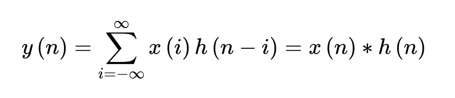
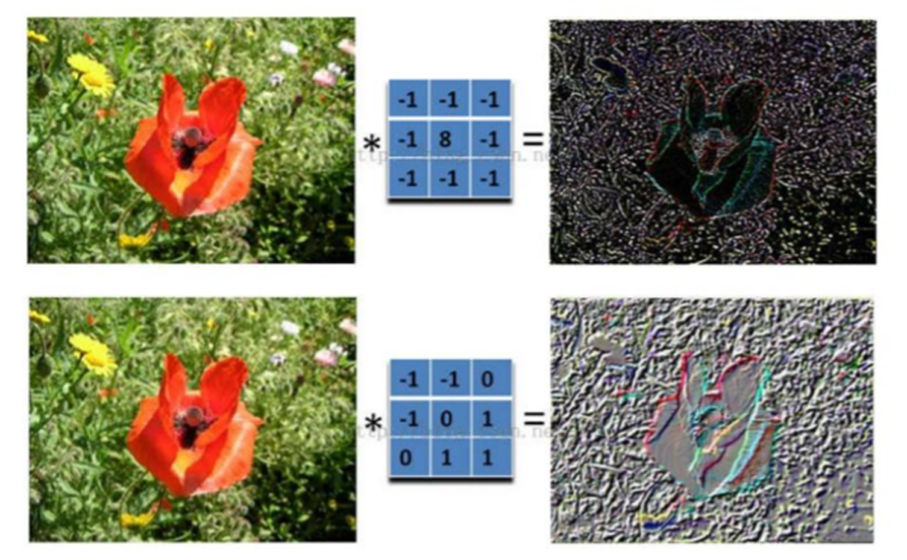

--- 
title: 卷积神经网络(CNN)的原理
date: 2024-11-10T00:00:00+08:00
categories: ["机器学习"]
tags: ["机器学习", "卷积", "神经网络"]
description: "卷积是CNN的核心数学运算，通过翻转和滑动叠加捕捉数据的局部与全局特征，使模型在图像识别等任务中有效处理平移不变性。"
cover: "/img/machinelearning.png"
headerImage: "/img/rthykless.png"
math: true
--- 

卷积神经网络（CNN）的核心运算“卷积”是一种数学操作，通过翻转和滑动叠加来捕捉数据的局部与全局特征。这种机制使CNN在图像识别等计算机视觉任务中表现出色，能够有效处理图像中的平移不变性。 


## 引言
卷积神经网络（Convolutional Neural Network，CNN）是一种在计算机视觉领域取得了巨大成功的深度学习模型。它们的设计灵感来自于生物学中的视觉系统，旨在模拟人类视觉处理的方式。在过去的几年中，CNN已经在图像识别、目标检测、图像生成和许多其他领域取得了显著的进展，成为了计算机视觉和深度学习研究的重要组成部分。

## 卷积是什么？

教科书上一般定义函数f,g的卷积f*g(n)如下：
连续形式：

离散形式：

并且也解释了，先对g函数进行翻转，相当于在数轴上把g函数从右边褶到左边去，也就是卷积的“卷”的由来。
然后再把g函数平移到n，在这个位置对两个函数的对应点相乘，然后相加，这个过程是卷积的“积”的过程。

#### 对卷积的通俗理解
***所谓两个函数的卷积，本质上就是先将一个函数翻转，然后进行滑动叠加***
在连续情况下，叠加指的是对两个函数的乘积求积分，在离散情况下就是加权求和，为简单起见就统一称为叠加。
整体看来是这么个过程：
              翻转——>滑动——>叠加——>滑动——>叠加——>滑动——>叠加 ....
多次滑动得到的一系列叠加值，构成了卷积函数。
***卷积的“卷”***，指的的函数的翻转，从 g(t) 变成 g(-t) 的这个过程；
***卷积的“积”***，指的是滑动积分/加权求和。
> 对卷积的意义的理解：
> 1. 从“积”的过程可以看到，我们得到的叠加值，是个全局的概念。以信号分析为例，卷积的结果是不仅跟当前时刻输入信号的响应值有关，也跟过去所有时刻输入信号的响应都有关系，考虑了对过去的所有输入的效果的累积。在图像处理的中，卷积处理的结果，其实就是把每个像素周边的，甚至是整个图像的像素都考虑进来，对当前像素进行某种加权处理。所以说，“积”是全局概念，或者说是一种“混合”，把两个函数在时间或者空间上进行混合。
> 2. 那为什么要进行“卷”？直接相乘不好吗？我的理解，进行“卷”（翻转）的目的其实是施加一种约束，它指定了在“积”的时候以什么为参照。在信号分析的场景，它指定了在哪个特定时间点的前后进行“积”，在空间分析的场景，它指定了在哪个位置的周边进行累积处理。
## 卷积神经网络
### 图像原理
在了解卷积神经网络前，我们先来看看图像的原理：
图像在计算机中是一堆按顺序排列的数字，数值为0到255。0表示最暗，255表示最亮。 如下图：


上图是只有黑白颜色的灰度图，而更普遍的图片表达方式是RGB颜色模型，即红、绿、蓝三原色的色光以不同的比例相加，以产生多种多样的色光。RGB颜色模型中，单个矩阵就扩展成了有序排列的三个矩阵，也可以用三维张量去理解。
其中的每一个矩阵又叫这个图片的一个channel（通道），宽, 高, 深来描述。


### 为什么要学习卷积神经网络？
在传统神经网络中，我们要识别下图红色框中的图像时，我们很可能识别不出来，因为这六张图中同一形状的位置都不通，计算机无法分辨出他们其实是一种形状或物体。


 传统神经网络原理如下图：

我们希望一个物体不管在画面左侧还是右侧，都会被识别为同一物体，这一特点就是不变性。为了实现平移不变性，卷积神经网络（CNN)等深度学习模型在卷积层中使用了卷积操作，这个操作可以捕捉到图像中的局部特征而不受其位置的影响。


### 图片的卷积是怎样计算的？
在卷积神经网络中，卷积操作是指将一个可移动的小窗口（称为数据窗口，如下图绿色矩形）与图像进行逐元素相乘然后相加的操作。这个小窗口其实是一组固定的权重，它可以被看作是一个特定的滤波器（filter）或卷积核。这个操作的名称“卷积”，源自于这种元素级相乘和求和的过程。这一操作是卷积神经网络名字的来源。


#### 卷积计算中的一些关键参数
- 步长stride：每次滑动的位置步长。
- 卷积核的个数：决定输出的depth厚度。同时代表卷积核的个数。
- 填充值zero-padding：在外围边缘补充若干圈0，方便从初始位置以步长为单位可以刚好滑倒末尾位置，通俗地讲就是为了总长能被步长整除。
#### 为什么要进行数据填充？
假设有一个大小为 4x4 的输入图像：
``` python
[[1, 2, 3, 4],
 [5, 6, 7, 8], 
[9, 10, 11, 12], 
[13, 14, 15, 16]]
```
现在，我们要应用一个 3x3 的卷积核进行卷积操作，步幅（stride）为 1，且要使用填充（padding）为 1。如果不使用填充，卷积核的中心将无法对齐到输入图像的边缘，导致输出特征图尺寸变小。假设我们使用步幅（stride）为 1 进行卷积，那么在不使用填充的情况下，输出特征图的尺寸将是 2x2。
所以我们要在它的周围填充一圈0，填充为 1 意味着在输入图像的周围添加一圈零值。添加填充后的图像：
``` python
[[0, 0, 0, 0, 0, 0], 
[0, 1, 2, 3, 4, 0], 
[0, 5, 6, 7, 8, 0], 
[0, 9, 10, 11, 12, 0], 
[0, 13, 14, 15, 16, 0], 
[0, 0, 0, 0, 0, 0]]
```
现在，我们将 3x3 的卷积核应用于这个填充后的输入图像，计算卷积结果，得到大小不变的特征图。
数据填充的主要目的是确保卷积核能够覆盖输入图像的边缘区域，同时保持输出特征图的大小。这对于在CNN中保留空间信息和有效处理图像边缘信息非常重要。
### 卷积神经网络的模型是什么样的？

上面红框框起来的部分便可以理解为一个滤波器，即带着一组固定权重的神经元。多个滤波器叠加便成了卷积层。

### 卷积神经网络的构造


- 输入层:输入层接收原始图像数据。图像通常由三个颜色通道（红、绿、蓝）组成，形成一个二维矩阵，表示像素的强度值。
- 卷积和激活:卷积层将输入图像与卷积核进行卷积操作。然后，通过应用激活函数（如ReLU）来引入非线性。这一步使网络能够学习复杂的特征。
- 池化层:池化层通过减小特征图的大小来减少计算复杂性。它通过选择池化窗口内的最大值或平均值来实现。这有助于提取最重要的特征。
- 多层堆叠:CNN通常由多个卷积和池化层的堆叠组成，以逐渐提取更高级别的特征。深层次的特征可以表示更复杂的模式。
- 全连接和输出:最后，全连接层将提取的特征映射转化为网络的最终输出。这可以是一个分类标签、回归值或其他任务的结果。


图片卷积后的样子

