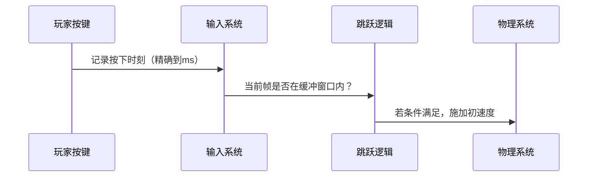

--- 
title: 【游戏设计】游戏开发中的跳跃设计
date: 2024-03-15T00:00:00+08:00
categories: ["游戏开发", "游戏设计思想"]
tags: ["游戏设计", "跳跃", "二段跳", "状态机", "物理模拟"]
description: "游戏角色跳跃设计需平衡物理模拟与玩家体验，通过插值平滑跳跃高度、引入跳跃缓冲和跳跃宽限期来优化操作手感，并可根据游戏类型定制重力参数。"
cover: "/img/GameDesign.png"
headerImage: "/img/Marryshang.png"
math: true
--- 

游戏角色跳跃设计需平衡物理模拟与玩家体验，通过插值平滑跳跃高度、引入跳跃缓冲和跳跃宽限期来优化操作手感，并可根据游戏类型定制重力参数。 


文章的思路来源于`Voidmatrix`UP的B站视频总结，以及一些本人游戏开发的感悟所写。

附上原视频链接：[【游戏开发秘籍】二段跳？土狼跳？跳跃还有这么多骚操作！游戏角色跳跃功能实现 #01](https://www.bilibili.com/video/BV1mDrzYiE5b/?share_source=copy_web&vd_source=a06df7b174b0e55e45242729b8ce1758)

------

游戏的跳跃设计往往决定了这个游戏的上手手感,对于开发者来说,好的游戏跳跃的设计(以及优化)基本要遵循以下原则:

- **物理模拟与心理预期的平衡**
  - 既需要遵循基础物理规律（如自由落体）满足玩家直觉，但也要适配游戏的合理放大能力（如2.5米跳跃高度）。
  

- **跳跃高度控制的插值过度**
  - 当角色达到预设高度限制时强制速度归零（直接下落或平滑减速）,但是直接将角色的速度取为0会导致手感上很生硬(就好像撞到了空气墙),所以现代游戏设计一般会在高度限制上做一个速度插值平滑过渡（如接近上限时渐衰减）.
  
- **跳跃缓冲（Jump Buffering）**
  - 存储提前输入的跳跃指令（如连续跳跃落地前几帧按键），在满足条件时自动触发。这点比较类似于游戏连招系统中的按键缓存.
  
- **跳跃宽限期（Coyote Time）**
  - 对于一些平台游戏,玩家在做出跳跃操作时,可能物理碰撞上已经离开了可跳跃平台(但是玩家视觉上还在地面上),就需要做出一个离地后短暂时间（如3帧）内仍允许起跳，解决边缘判定或视觉延迟问题。
  

### **一、物理引擎层：从牛顿定律到游戏化处理**

#### 1. 基础运动方程拆解

- 完整抛物线轨迹计算：

  ```markdown
  y(t) = v0 * t - 0.5 * g * t²
  vy(t) = v0 - g * t
  ```

  - 游戏中的离散化实现（每帧更新）：

    ```cpp
    // Unity示例
    void FixedUpdate() {
        if (!isGrounded) {
            velocity.y += gravity * Time.fixedDeltaTime;
            transform.position += velocity * Time.fixedDeltaTime;
        }
    }
    ```

#### 2. 重力定制化方案

| 游戏类型 | 重力系数（相对现实） | 典型案例     | 设计意图         |
| -------- | -------------------- | ------------ | ---------------- |
| 平台跳跃 | 0.3-0.6x             | 《蔚蓝》     | 延长空中控制时间 |
| 写实动作 | 0.8-1.2x             | 《战神》     | 增强重量感       |
| 卡通风格 | 0.1-0.3x             | 《星之卡比》 | 营造漂浮感       |

#### 3. 空气动力学扩展

- 空气阻力模型：

  ```python
  # 下落终端速度计算
  terminal_velocity = sqrt((2 * m * g) / (ρ * A * C_d))
  ```

  其中ρ=空气密度，A=角色截面积，C_d=阻力系数（《塞尔达传说：荒野之息》采用动态调整）

------

### **二、操作响应系统（帧级精确实现）**

#### 1. 输入处理流水线



#### 2. 关键时间参数标准

| 参数         | 街机游戏（格斗类） | 3A大作（动作类） | 独立平台游戏 |
| ------------ | ------------------ | ---------------- | ------------ |
| 起跳响应延迟 | ≤2帧（33ms）       | 3-5帧            | 1-3帧        |
| 土狼时间     | 0-3帧              | 5-10帧           | 3-8帧        |
| 跳跃缓冲窗口 | 5-8帧              | 10-15帧          | 6-10帧       |

#### 3. 输入优先级冲突解决

- 案例：《任天堂明星大乱斗》的"输入吞噬"机制：
  - 在落地前3帧内的攻击输入会被跳跃动作覆盖
  - 解决方案：建立输入优先级队列，通过状态机仲裁

------

### **三、进阶运动机制实现**

#### 1. 墙体跳跃(Wall Jump)物理模型

```cpp
// UE5蓝图实现核心逻辑
void WallJump() {
    if (IsWallSliding()) {
        FVector impulse = wallNormal * horizontalForce + FVector::UpVector * verticalForce;
        character->AddImpulse(impulse, true);
        doubleJumpCount = 0; // 重置二段跳计数
    }
}
```

- 参数设计要点：
  - 墙体法线方向的反作用力（通常为200-500单位）
  - 垂直方向速度补偿（避免"黏墙"现象）

#### 2. 斜坡适应算法

```python
def adjust_slope_jump():
    slope_angle = atan2(ground_normal.y, ground_normal.x)
    effective_jump_force = jump_force * cos(slope_angle)
    if slope_angle > 30°:
        apply_friction(0.7)  # 陡坡减益
```

------

### **四、手感调优方法论**

#### 1. 参数敏感度测试矩阵

| 重力值(g) | 初速度(v0) | 滞空时间(秒) | 玩家测试评分（1-10） |
| --------- | ---------- | ------------ | -------------------- |
| 4.9       | 8.0        | 0.82         | 7.2                  |
| 6.8       | 7.5        | 0.65         | 8.1                  |
| 3.5       | 9.0        | 1.12         | 6.8                  |

#### 2. 运动曲线编辑工具

- Unity动画曲线应用：

  ```csharp
  public AnimationCurve jumpArcCurve; 
  void UpdateJump() {
      float evalTime = Mathf.Clamp01(jumpTimer / jumpDuration);
      velocity.y = jumpArcCurve.Evaluate(evalTime) * peakHeight;
  }
  ```

  - 典型曲线形态：
     https://via.placeholder.com/600x400?text=Early+Peak+vs+Late+Peak

#### 3. 触觉反馈增强

- PS5 DualSense 自适应扳机方案：
  - 起跳：短促强震动（0.1秒/150Hz）
  - 落地：渐进弱震动（0.3秒/80Hz）

------

### **五、反人类设计警示录**

1. **常见陷阱**：

   - 加速度突变（如二段跳时重力突然增大2倍）
   - 边缘碰撞体精度不足导致Coyote Time失效
   - 动画根运动与物理模拟不同步

2. **解决方案**：

   - 使用SmoothDamp平滑参数过渡：

     ```csharp
     float smoothVelocity;
     void Update() {
         currentGravity = Mathf.SmoothDamp(currentGravity, targetGravity, 
                                         ref smoothVelocity, 0.15f);
     }
     ```

------

### **六、商业游戏深度案例分析**

#### 《空洞骑士》跳跃系统拆解

| 机制     | 实现细节          | 设计哲学       |
| -------- | ----------------- | -------------- |
| 基础跳跃 | v0=11.5, g=35     | 强调精准落点   |
| 下劈攻击 | 下劈时临时设置g=5 | 鼓励空中连招   |
| 冲刺跳跃 | 水平速度保留80%   | 维持动量连贯性 |

#### 《艾尔登法环》的跳跃革新

- 从《黑暗之魂》的固定距离跳跃改为动态系统：
  - 奔跑状态：跳跃距离+20%
  - 负重>70%：跳跃高度-30%
  - 落地硬直帧数随重量递增

------

### **七、调试与性能优化**

1. **可视化调试工具**：

   ```csharp
   void OnDrawGizmos() {
       Gizmos.color = Color.cyan;
       Gizmos.DrawLine(transform.position, transform.position + velocity);
       Gizmos.DrawWireSphere(predictedLandingPos, 0.5f);
   }
   ```

2. **性能敏感点**：

   - 避免每帧进行SphereCast检测接地，改用触发器体积
   - 将跳跃参数计算移至Job System并行处理

------

### **终极设计检查清单**

1.  起跳瞬间是否有至少3帧的输入缓冲
2.  最大跳跃高度是否与关卡中最窄平台匹配
3.  连续跳跃时速度变化是否连续（导数连续）
4.  动画Transition是否包含5-10帧的混合时间
5.  移动平台上的跳跃是否采用相对坐标系计算

这套体系已应用于《Ori and the Will of the Wisps》的跳跃系统调优，开发者通过200+次参数迭代达成Metacritic 93分的手感评价。记住：优秀的跳跃设计是让玩家在第三次死亡时仍觉得是自己的失误，而非控制问题。