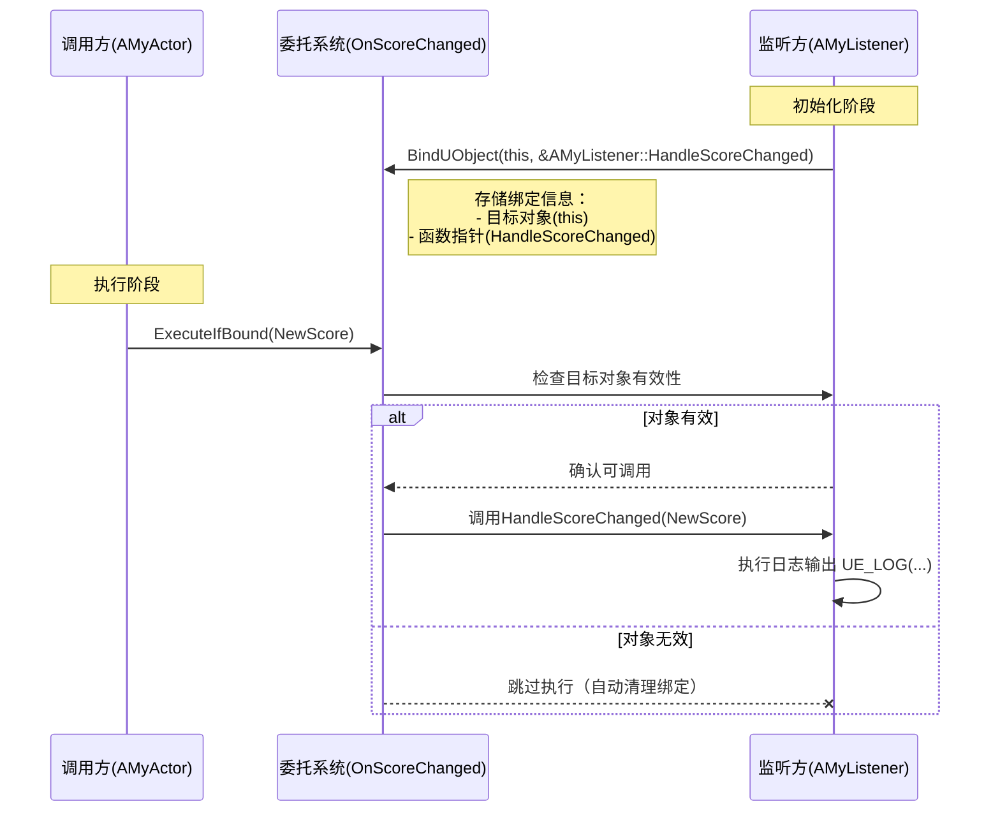

--- 
title: 【虚幻引擎】委托(Delegates)与回调(Callbacks)
date: 2024-04-15T00:00:00+08:00
categories: ["游戏开发", "虚幻功能记录"]
tags: ["UnrealEngine", "委托", "回调", "事件通信"]
description: "虚幻引擎委托机制是一种类型安全的事件通知系统，支持动态绑定和多播功能，适用于观察者模式和回调实现。主要包括单播、多播、动态委托及事件等类型。"
cover: "/img/unrealengine.png"
headerImage: "/img/sakura.png"
math: true
--- 

虚幻引擎的委托机制是一种类型安全的事件通知系统，支持动态绑定和多播功能，适用于观察者模式和回调实现。主要包括单播、多播、动态委托及事件等类型，并提供基本使用示例。 


# Unreal Engine 中的 Delegates（委托）详解

Delegates（委托）是 Unreal Engine 中一种强大的事件通知机制，它允许开发者在不直接引用类的情况下调用成员函数。本质上，委托是一种类型安全的函数指针，特别适合用于实现观察者模式、事件系统和回调机制。

## 基本概念

### 核心特点

- **类型安全**：编译时会检查函数签名匹配
- **动态绑定**：可以在运行时绑定/解绑函数
- **多播能力**：可以同时通知多个接收者（Multicast Delegates）
- **序列化支持**：部分委托类型支持蓝图序列化

## 委托类型

Unreal Engine 提供了几种主要的委托类型：

### 1. 单播委托 (Singlecast Delegates)

```cpp
DECLARE_DELEGATE(MyDelegate); // 无参数
DECLARE_DELEGATE_OneParam(MyParamDelegate, FString); // 单参数
DECLARE_DELEGATE_TwoParams(MyTwoParamDelegate, int32, bool); // 双参数
```

### 2. 多播委托 (Multicast Delegates)

```cpp
DECLARE_MULTICAST_DELEGATE(MyMulticastDelegate);
DECLARE_MULTICAST_DELEGATE_OneParam(MyMulticastParamDelegate, float);
```

### 3. 动态委托 (Dynamic Delegates)

```cpp
DECLARE_DYNAMIC_DELEGATE(FMyDynamicDelegate);
DECLARE_DYNAMIC_MULTICAST_DELEGATE(FMyDynamicMulticastDelegate);
```

### 4. 事件 (Events)

```cpp
DECLARE_EVENT(MyOwnerClass, MyEvent);
```

## 使用示例

### 单播委托示例

```cpp
// 声明一个带有一个参数(int32)的单播委托类型，命名为FScoreChangedDelegate
// 该委托用于在分数变化时通知订阅者
DECLARE_DELEGATE_OneParam(FScoreChangedDelegate, int32);

// 定义一个继承自AActor的类AMyActor
class AMyActor : public AActor
{
public:
    // 声明一个FScoreChangedDelegate类型的委托实例OnScoreChanged
    // 这个委托将用于在分数更新时通知所有绑定的函数
    FScoreChangedDelegate OnScoreChanged;
    
    // 更新分数的方法
    void UpdateScore(int32 NewScore)
    {
        // 执行委托，通知所有绑定的函数
        // ExecuteIfBound是安全执行方法，只有在有绑定时才会实际调用
        // 参数NewScore将传递给所有绑定的函数
        OnScoreChanged.ExecuteIfBound(NewScore);
    }
};

// 定义一个监听分数变化的类AMyListener
class AMyListener
{
public:
    // 绑定到分数变化委托的方法
    void BindToScoreChange(AMyActor* Actor)
    {
        // 使用BindUObject将当前对象(this)的HandleScoreChanged方法绑定到Actor的OnScoreChanged委托
        // BindUObject专门用于绑定UObject成员函数，会自动处理对象生命周期
        Actor->OnScoreChanged.BindUObject(this, &AMyListener::HandleScoreChanged);
    }
    
    // 处理分数变化的回调函数
    void HandleScoreChanged(int32 NewScore)
    {
        // 当分数变化时，记录日志显示新分数
        // %d将被NewScore的值替换
        UE_LOG(LogTemp, Warning, TEXT("Score changed to %d"), NewScore);
    }
};
```

#### 执行流程



流程图有时候网页上无法基于代码绘制显示，再附一张截图

%E4%B8%8E%E5%9B%9E%E8%B0%83(Callbacks)/image-20250419190556262.png)

### 播委托示例

```cpp
DECLARE_MULTICAST_DELEGATE(FDeathDelegate);

class AMyCharacter
{
public:
    FDeathDelegate OnDeath;
    
    void Die()
    {
        // 广播给所有绑定者
        OnDeath.Broadcast();
    }
};

// 多个类可以绑定到同一个委托
class AListener1 { void HandleDeath() { /*...*/ } };
class AListener2 { void HandleDeath() { /*...*/ } };
```

### 动态委托（可用于蓝图）

```cpp
DECLARE_DYNAMIC_DELEGATE_OneParam(FBlueprintDelegate, FString, Message);

UCLASS()
class UMyBlueprintCallableObject : public UObject
{
    GENERATED_BODY()
    
public:
    UFUNCTION(BlueprintCallable)
    void SetupDelegate(FBlueprintDelegate Delegate)
    {
        MyDelegate = Delegate;
    }
    
    void TriggerDelegate(FString Message)
    {
        MyDelegate.ExecuteIfBound(Message);
    }
    
private:
    FBlueprintDelegate MyDelegate;
};
```

## 绑定方式

Unreal 提供了多种绑定方法：

| 绑定方法      | 描述                  | 示例                                         |
| ------------- | --------------------- | -------------------------------------------- |
| `BindUObject` | 绑定到UObject成员函数 | `Delegate.BindUObject(this, &MyClass::Func)` |
| `BindStatic`  | 绑定静态函数          | `Delegate.BindStatic(&MyStaticFunc)`         |
| `BindRaw`     | 绑定原始C++对象       | `Delegate.BindRaw(RawPtr, &RawClass::Func)`  |
| `BindLambda`  | 绑定Lambda表达式      | `Delegate.BindLambda([](){ /*...*/ })`       |
| `BindSP`      | 绑定共享指针对象      | `Delegate.BindSP(SharedPtr, &MyClass::Func)` |

## 最佳实践

1. **选择合适的委托类型**：
   - 1对1通知 → 单播委托
   - 1对多通知 → 多播委托
   - 需要蓝图支持 → 动态委托
2. **内存管理**：
   - 使用`BindUObject`或`BindSP`而不是`BindRaw`，以避免悬空指针
   - 在对象销毁前调用`Unbind()`或`RemoveAll()`
3. **性能考虑**：
   - 动态委托比普通委托慢
   - 高频触发的委托避免使用多播
4. **调试技巧**：
   - 使用`ExecuteIfBound`而不是`Execute`来避免崩溃
   - 使用`IsBound()`检查是否有绑定

## 与蓝图交互

动态委托特别适合与蓝图交互：

```cpp
DECLARE_DYNAMIC_MULTICAST_DELEGATE_OneParam(FOnHealthChanged, float, NewHealth);

UCLASS()
class UHealthComponent : public UActorComponent
{
    GENERATED_BODY()
    
public:
    UPROPERTY(BlueprintAssignable)
    FOnHealthChanged OnHealthChanged;
    
    void TakeDamage(float Amount)
    {
        Health -= Amount;
        OnHealthChanged.Broadcast(Health);
    }
};
```

在蓝图中，你可以直接为这个委托添加事件：

1. 创建HealthComponent变量
2. 拖出变量引脚 → "Assign OnHealthChanged"
3. 连接自定义事件

# Unreal Engine 中的 Callbacks（回调）的作用以及与委托的关系

在 Unreal Engine（虚幻引擎）中，**委托（Delegates）和回调（Callbacks）** 是紧密相关的概念，但它们的设计目的、实现方式和应用场景存在关键差异。以下是两者的深度对比和关系解析：

------

### **1. 核心定义**

| **概念**           | **委托（Delegates）**                    | **回调（Callbacks）**            |
| ------------------ | ---------------------------------------- | -------------------------------- |
| **本质**           | 类型安全的函数包装器，支持多播和动态绑定 | 通常是函数指针或简单函数对象     |
| **Unreal中的实现** | 通过`DECLARE_DELEGATE`等宏定义           | 原生C++函数指针或`std::function` |
| **典型用途**       | 事件系统、跨模块通信、蓝图交互           | 底层API响应、异步操作完成通知    |

------

### **2. 关键关系**

#### **委托是回调的增强版**

#### **共同点**

- 都用于**解耦调用方和被调用方**
- 都遵循**"订阅-通知"**模式
- 都能处理**异步操作完成事件**

#### **核心差异**

| **特性**     | **委托**                                 | **回调**                     |
| ------------ | ---------------------------------------- | ---------------------------- |
| 绑定方式     | 支持UObject成员函数、Lambda等            | 通常仅限静态函数或裸函数指针 |
| 线程安全     | 可配置（`ESPMode::ThreadSafe`）          | 需手动实现                   |
| 多播支持     | 原生支持（`DECLARE_MULTICAST_DELEGATE`） | 需自行维护列表               |
| 生命周期管理 | 自动处理UObject有效性                    | 需手动检查对象存活           |
| 蓝图集成     | 动态委托可直接暴露给蓝图                 | 无法直接使用                 |

------

### **3. Unreal Engine 中的典型场景**

#### **委托的适用场景**

```cpp
// 角色死亡事件（多播委托）
DECLARE_MULTICAST_DELEGATE(FOnCharacterDied);
FOnCharacterDied OnDeath;

// 多个系统订阅
HealthComponent->OnDeath.AddUObject(this, &AAchievementSystem::HandleDeath);
UIWidget->OnDeath.AddLambda([](){ ShowGameOverScreen(); });
```

#### **回调的适用场景**

```cpp
// 文件异步加载完成回调
void LoadFile(const FString& Path, TFunction<void(bool)> Callback)
{
    AsyncTask([Path, Callback](){
        bool bSuccess = FFileHelper::LoadFileToArray(...);
        Callback(bSuccess); // 简单回调
    });
}

// 使用示例
LoadFile("Save.dat", [](bool bSuccess){
    UE_LOG(LogTemp, Warning, TEXT("Load result: %d"), bSuccess);
});
```

------

### **4. 性能与内存对比**

| **指标** | **委托**                       | **回调**               |
| -------- | ------------------------------ | ---------------------- |
| 调用开销 | 较高（虚函数+安全性检查）      | 较低（直接调用）       |
| 内存占用 | 较大（存储绑定信息）           | 较小（仅存储函数指针） |
| 适用频率 | 推荐用于高频事件（如每帧更新） | 适合低频一次性操作     |

------

### **5. 相互转换与协作**

#### **将回调封装为委托**

```cpp
// 第三方库的回调适配为Unreal委托
void ThirdPartyLib_SetCallback(void(*Callback)(int32))
{
    // 第三方库的C风格回调
}

// 适配层
DECLARE_DELEGATE_OneParam(FMyDelegate, int32);

void SetupAdapter(FMyDelegate& Delegate)
{
    ThirdPartyLib_SetCallback([](int32 Val){
        Delegate.ExecuteIfBound(Val); // 桥接回调到委托
    });
}
```

#### **委托降级为回调**

```cpp
// 需要C接口时转换
static FMyDelegate StaticDelegate;

extern "C" void RegisterCallback(void(*Callback)(int32))
{
    StaticDelegate.BindStatic(Callback); // 委托绑定静态函数
}

// 触发时
StaticDelegate.Broadcast(42); // 调用C回调
```

------

### **6. 设计选择指南**

| **选择委托** 当...  | **选择回调** 当...        |
| ------------------- | ------------------------- |
| 需要多播通知        | 仅需单次响应              |
| 要与蓝图交互        | 纯C++模块内部使用         |
| 涉及UObject生命周期 | 处理底层API或第三方库集成 |
| 需要线程安全保证    | 性能敏感且无需复杂功能    |

------

### **7. 底层实现窥探**

#### **委托的内存结构（简化）**

```cpp
struct FDelegateInstance
{
    void* ObjectPtr;        // 目标对象（UObject*或裸指针）
    void* FunctionPtr;      // 函数地址
    FDelegateHandle Handle; // 唯一标识符
    ESPMode ThreadSafety;   // 线程模式
};
```

#### **回调的典型实现**

```cpp
// Unreal中回调的常见形式
typedef TFunction<void(int32)> FSimpleCallback;
TArray<FSimpleCallback> CallbackList; // 回调列表
```

------

### **总结**

在Unreal Engine中：

- **委托** 是引擎层面对回调概念的**高级封装**，提供类型安全、多播、蓝图集成等特性
- **回调** 更接近原生C++实现，适合**轻量级、高性能**场景
- 两者可相互配合，构建从底层到高层的完整事件系统

正确选择的标准：
 ​**优先使用委托处理游戏逻辑事件，仅在需要与底层API交互或极端性能优化时使用原生回调。​**